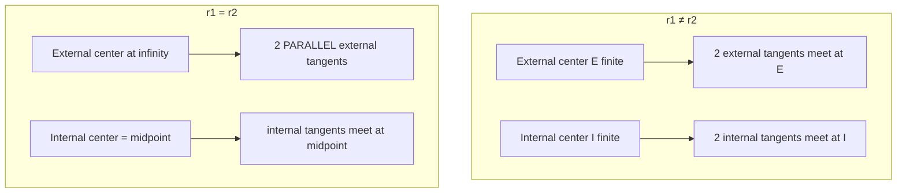

# Circle Tangents — Mathematical Foundations

> **One-line summary:** A line `ℓ: a·x + b·y + c = 0` with `a²+b²=1` is tangent to circle `(Cᵢ, rᵢ)` iff `a·Cᵢx + b·Cᵢy + c = σᵢrᵢ` for some `σᵢ ∈ {±1}`. Solving the four sign-pairs gives a quadratic whose discriminant is `d² − (σ1r1 − σ2r2)²`; its sign reproduces **exactly** the `0..4` common-tangent count, which we prove rigorously and connect to the homothety (external/internal similarity-center) structure and to degeneracy via exact predicates.

---

## Table of Contents

1. [Formal Definitions](#formal-definitions)
2. [Tangent from an External Point — Derivation](#tangent-from-an-external-point)
3. [The Common-Tangent System and Its Solution](#the-common-tangent-system)
4. [The 0–4 Count — Theorem and Proof](#the-04-count-theorem)
5. [The Homothety / Similarity-Center Structure](#the-homothety-structure)
6. [Touch-Point Formulas and Their Correctness](#touch-point-formulas)
7. [Degeneracy and Exact Predicates](#degeneracy-and-exact-predicates)
8. [Closed-Form Lengths and Angles of Common Tangents](#closed-form-lengths-and-angles-of-common-tangents)
9. [A Fully Worked Numeric Derivation](#a-fully-worked-numeric-derivation)
10. [Parametrization and the Touch-Point Locus](#parametrization-and-the-touch-point-locus)
11. [Error Bounds and Conditioning](#error-bounds-and-conditioning-formal)
12. [Tangent Lines and the Apollonius / Power-of-a-Point Structure](#tangent-lines-and-the-apollonius--power-of-a-point-structure)
13. [The Count as a Morse-Theoretic Bifurcation](#the-common-tangent-count-as-a-morse-theoretic-bifurcation)
14. [A Rigorous Proof that Radius ⟂ Tangent](#a-rigorous-proof-that-radius--tangent)
15. [Generalized Belt: Convex Hull of Discs](#generalized-belt-convex-hull-of-discs)
16. [Trigonometric Closed Forms for Touch-Point Angles](#trigonometric-closed-forms-for-touch-point-angles)
17. [Oriented (Signed) Tangents for Path Planning](#oriented-signed-tangents-for-path-planning)
18. [Comparison with Alternatives](#comparison-with-alternatives)
19. [Summary](#summary)

---

## Formal Definitions

```text
Circle:   ◯(C, r) = { X ∈ ℝ² : |X − C| = r },  r > 0,  C ∈ ℝ².
Disc:     D(C, r) = { X ∈ ℝ² : |X − C| ≤ r }.

Line in normal form:
   ℓ(a, b, c) = { X = (x, y) : a·x + b·y + c = 0 },  with  a² + b² = 1.
   The vector n = (a, b) is the UNIT NORMAL; |n| = 1.

Signed distance from a point Q to ℓ:
   sd(Q, ℓ) = a·Qx + b·Qy + c.
   |sd(Q, ℓ)| = Euclidean distance from Q to ℓ;
   sign(sd) selects the half-plane containing Q.

Tangency:  ℓ is tangent to ◯(C, r)  ⟺  |sd(C, ℓ)| = r
           ⟺  sd(C, ℓ) = σ·r  for a unique σ ∈ {+1, −1}.
           The TOUCH-POINT is  T = C − sd(C, ℓ)·n,  and |T − C| = r, T ∈ ℓ.

External point P to ◯(C, r):  |P − C| = d > r.
External common tangent of two circles:  σ1 = σ2 (centers same side).
Internal common tangent:                 σ1 = −σ2 (centers opposite sides).
```

**Lemma (closest-point characterization of tangency).** A line `ℓ` is tangent to `◯(C, r)` iff the foot of the perpendicular from `C` to `ℓ` lies on the circle, i.e. `dist(C, ℓ) = r`.

*Proof.* `dist(C, ℓ) = min_{X∈ℓ} |X − C|`, attained at the perpendicular foot `F`. If `dist(C,ℓ) = r`, then `F` is on the circle and every other point of `ℓ` is at distance `> r`, hence outside the circle — so `ℓ ∩ ◯ = {F}`, one point: tangent. Conversely if `ℓ` is tangent, the unique common point is the closest point of `ℓ` to `C` (a strictly closer point would be inside the circle, forcing a second crossing), so `dist(C,ℓ) = r`. ∎

This Lemma is the bedrock: it converts "tangent" into the algebraic equation `sd(C,ℓ) = ±r`, and it proves **radius ⟂ tangent** (`C → F` is perpendicular to `ℓ` by definition of perpendicular foot).

---

## Tangent from an External Point

**Theorem 1.** Let `P` be external to `◯(C, r)`, `d = |P − C| > r`. Then there are exactly two tangent lines from `P`, their touch-points `T` satisfy `|P − T| = sqrt(d² − r²)`, and the angle `α = ∠TPC` satisfies `sin α = r/d`.

*Proof.* By the Lemma, a tangent touches at `T` with `CT ⟂ PT`, so triangle `△PTC` is right-angled at `T`. The hypotenuse is `PC = d`, the leg `CT = r`. By the Pythagorean theorem `|PT|² = d² − r²`, giving the tangent length `L = sqrt(d² − r²)` (real since `d > r`). The angle at `P` opposite the leg `CT` satisfies `sin α = opposite/hypotenuse = r/d`.

Existence of exactly two: the locus of points `T` with `∠PTC = 90°` is the circle with diameter `PC` (Thales' theorem), call it `Θ` with center `M = (P+C)/2`, radius `d/2`. The touch-points are `◯(C,r) ∩ Θ`. Two distinct circles intersect in 0, 1, or 2 points; here `|M − C| = d/2`, `Θ` has radius `d/2`, `◯` has radius `r`. The intersection count condition `|R−ρ| < |M−C| < R+ρ` becomes `|d/2 − r| < d/2 < d/2 + r`, i.e. `−r < d/2 − d/2 ... ` — concretely `|d/2 − r| < d/2 ⟺ 0 < r < d`, which holds since `0 < r < d`. Hence **exactly two** intersection points: two tangents. ∎

**Touch-point closed form.** With `φ = atan2(P_y − C_y, P_x − C_x)` (direction `C→P`) and `θ = acos(r/d)`:

```
T± = C + r·(cos(φ ± θ), sin(φ ± θ)).
```

*Why `θ = acos(r/d)`:* in `△PTC` the angle at the **center** `C` (i.e. `∠PCT`) has adjacent leg `CT = r` along… more precisely, project: `cos(∠PCT) = (CT)/(CP) · ...`. Cleanly, `cos θ = r/d` because the right angle is at `T`: `cos(∠PCT) = adjacent/hypotenuse = CT/CP = r/d`. The two touch-points are obtained by rotating the direction `C→P` by `±θ` and scaling to radius `r`. The degenerate `d = r` gives `θ = 0`: the two points coincide at the single touch-point, consistent with `P` lying on the circle. The case `d < r` gives `r/d > 1`, `acos` undefined — **no real tangent**, matching `P` interior. ∎

---

## The Common-Tangent System

For two circles `◯(C₁, r₁)`, `◯(C₂, r₂)`, a common tangent `ℓ(a,b,c)` (with `a²+b²=1`) must satisfy, for some `σ₁, σ₂ ∈ {±1}`:

```
(1)   a·C₁x + b·C₁y + c = σ₁ r₁
(2)   a·C₂x + b·C₂y + c = σ₂ r₂
(3)   a² + b² = 1
```

Subtract (1) from (2) to eliminate `c`. Let `Δ = C₂ − C₁ = (Δx, Δy)`, `d = |Δ|`, and define

```
g = σ₂ r₂ − σ₁ r₁.        (the radius gap for this sign-pair)
```

Then

```
(4)   a·Δx + b·Δy = g,     with    a² + b² = 1.
```

Equation (4) says the unit vector `n = (a,b)` has prescribed projection `g/d` onto the unit direction `Δ/d`. Decompose `n` into components along `û = Δ/d` and along `û⊥ = (−Δy, Δx)/d`:

```
n = (g/d)·û  +  h·û⊥,     where  h = ±sqrt(1 − (g/d)²).
```

`h` is real iff `(g/d)² ≤ 1`, i.e. `|g| ≤ d`. Writing it out:

```
a = (g·Δx − sign·h·d·Δy)/d²  ... equivalently
a = Δx·g/d² ∓ Δy·sqrt(d²−g²)/d²
b = Δy·g/d² ± Δx·sqrt(d²−g²)/d²
```

and `c = σ₁ r₁ − a·C₁x − b·C₁y` from (1). This is exactly the `middle.md` solver. The **number of real `n`** per sign-pair is:

```
|g| < d   → 2 solutions  (h ≠ 0, both ±)
|g| = d   → 1 solution   (h = 0, the two coincide)
|g| > d   → 0 solutions  (h imaginary)
```

**Theorem 2 (existence test per type).**
- *External* (`σ₁ = σ₂`): `g = ±(r₂ − r₁)`, `|g| = |r₁ − r₂|`. External tangents exist iff `|r₁ − r₂| ≤ d`.
- *Internal* (`σ₁ = −σ₂`): `g = ±(r₁ + r₂)`, `|g| = r₁ + r₂`. Internal tangents exist iff `r₁ + r₂ ≤ d`.

Each `±g` of the same magnitude yields the same set of lines (it merely relabels which side), so a type contributes **two** lines when its `|g| < d` strictly, **one** when `|g| = d`, **zero** when `|g| > d`. ∎

---

## The 0–4 Count Theorem

**Theorem 3.** Let `d = |C₂ − C₁|`, and WLOG `r₁ ≥ r₂ > 0`. The number of common tangent lines of `◯(C₁,r₁)` and `◯(C₂,r₂)` is:

| Regime | Condition | #External | #Internal | **Total** |
|--------|-----------|:---------:|:---------:|:---------:|
| Nested (interior) | `d < r₁ − r₂` | 0 | 0 | **0** |
| Internally tangent | `d = r₁ − r₂` | 1 | 0 | **1** |
| Overlapping | `r₁ − r₂ < d < r₁ + r₂` | 2 | 0 | **2** |
| Externally tangent | `d = r₁ + r₂` | 2 | 1 | **3** |
| Separate | `d > r₁ + r₂` | 2 | 1 | **4** |

(Concentric `d = 0` with `r₁ ≠ r₂` is the sub-case of "nested" → 0; identical circles `d=0, r₁=r₂` have infinitely many and are excluded.)

*Proof.* Apply Theorem 2 to each type.

**External tangents** (`|g| = r₁ − r₂`, using `r₁ ≥ r₂` so `|g| = r₁ − r₂`):
- `d < r₁ − r₂`: `|g| > d` → 0 external.
- `d = r₁ − r₂`: `|g| = d` → 1 external (the unique tangent at the internal contact point).
- `d > r₁ − r₂`: `|g| < d` → 2 external.

**Internal tangents** (`|g| = r₁ + r₂`):
- `d < r₁ + r₂`: `|g| > d` → 0 internal.
- `d = r₁ + r₂`: `|g| = d` → 1 internal (the unique tangent at the external contact point).
- `d > r₁ + r₂`: `|g| < d` → 2 internal.

Now combine across the five `d`-regimes (note `r₁ − r₂ ≤ r₁ + r₂` always, with equality iff `r₂ = 0`):

```
d < r₁−r₂          : ext 0, int 0 → 0
d = r₁−r₂          : ext 1, int 0 → 1
r₁−r₂ < d < r₁+r₂  : ext 2, int 0 → 2
d = r₁+r₂          : ext 2, int 1 → 3
d > r₁+r₂          : ext 2, int 1 → 4
```

These are precisely the table rows. The transitions are continuous in `d`: as `d` increases through `r₁−r₂`, two external tangents are *born* from one (the discriminant `d²−(r₁−r₂)²` crosses zero); as `d` increases through `r₁+r₂`, two internal tangents are born from one. ∎

**Corollary (duality with circle–circle intersection).** Let `k(d)` = # intersection points of the two circles and `t(d)` = # common tangents. Then `t(d) + ` (jumps) track inversely: where `k` goes `0,1,2,1,0` over the regimes nested→tangent→overlap→tangent→separate, `t` goes `0,1,2,3,4`. Both are governed by the *same* two thresholds `r₁±r₂`, because both reduce to the sign of `d²−(r₁−r₂)²` and `d²−(r₁+r₂)²`. The intersection point count solves `a²+b²=1` with `sd = +r` *both* circles crossing (chord), whereas the tangent count solves `sd = σr`; the shared discriminants are why the classification tables coincide.

---

## The Homothety Structure

A **homothety** `H(O, k)` with center `O` and ratio `k ≠ 0` maps `X ↦ O + k(X − O)`. It maps `◯(C, r)` to `◯(O + k(C−O), |k|r)`.

**Proposition (similarity centers).** For `◯(C₁,r₁)`, `◯(C₂,r₂)` with `r₁ ≠ r₂`:
- The **external** center `E = (r₂C₁ − r₁C₂)/(r₂ − r₁)` is the center of the homothety with ratio `k = r₂/r₁ > 0` mapping circle 1 to circle 2.
- The **internal** center `I = (r₂C₁ + r₁C₂)/(r₁ + r₂)` is the center of the homothety with ratio `k = −r₂/r₁ < 0`.

*Proof sketch.* `E` is the unique point with `(E − C₂) = (r₂/r₁)(E − C₁)` (collinear, external division in ratio `r₁:r₂`); solving gives the stated formula. Under `H(E, r₂/r₁)`, `C₁ ↦ C₂` and `r₁ ↦ (r₂/r₁)r₁ = r₂`, so `◯₁ ↦ ◯₂`. Internal center analogous with negative ratio. ∎

**Theorem 4 (tangents pass through similarity centers).** Every external common tangent passes through `E`; every internal common tangent passes through `I`.

*Proof.* Let `ℓ` be an external common tangent (centers on the same side, `σ₁=σ₂=σ`). Apply `H(E, r₂/r₁)`. The homothety maps `◯₁ → ◯₂`. A line `ℓ` is mapped to a parallel line `ℓ'` at signed distance `(r₂/r₁)·sd(C₁,ℓ) = (r₂/r₁)σr₁ = σr₂` from `C₂` — but that is exactly the tangency condition of `ℓ` to `◯₂`. So `H(E,·)` maps the tangent line of `◯₁` to a tangent line of `◯₂` *that is parallel to it*. The only way `ℓ` is tangent to *both* and the homothety maps `◯₁`'s tangent to `◯₂`'s tangent **as the same line** is if `ℓ` is invariant under `H(E,·)`, i.e. `ℓ` passes through the fixed point `E`. Internal tangents: same argument with the negative-ratio homothety about `I`. ∎

**Degeneration at `r₁ = r₂`.** Then `E = (r₂C₁ − r₁C₂)/(r₂−r₁)` has zero denominator: `E → ∞`. Geometrically the external homothety has ratio `1` (a translation), with no finite fixed point, so the external tangents are **parallel** to `C₁C₂`, offset by `±r` — confirming the equal-radius special case. The internal center `I = (C₁+C₂)/2` (the midpoint) remains finite, so internal tangents still meet at the midpoint when they exist. The signed-distance solver (Theorem 2) has `g = 0` for externals here, giving `n ⟂ Δ` directly — no division by `(r₂−r₁)`, which is precisely why it is robust.



---

## Touch-Point Formulas

Given a normalized tangent `ℓ(a,b,c)` (`a²+b²=1`), the touch-point on `◯(Cᵢ, rᵢ)` is

```
Tᵢ = Cᵢ − sd(Cᵢ, ℓ)·(a, b) = Cᵢ − (a·Cᵢx + b·Cᵢy + c)·(a, b).
```

**Correctness.** `Tᵢ` is the foot of the perpendicular from `Cᵢ` to `ℓ`: subtracting `sd·n` from `Cᵢ` moves along the unit normal by exactly the signed distance, landing on `ℓ` (verify `a·Tᵢx + b·Tᵢy + c = sd − sd(a²+b²) = sd − sd = 0`). And `|Tᵢ − Cᵢ| = |sd|·|n| = |sd| = rᵢ` by tangency. So `Tᵢ ∈ ℓ ∩ ◯ᵢ`, the touch-point. ∎

For tangents **from an external point `P`** (radius-0 "circle" at `P`), the touch-points on the real circle are the `T±` of Theorem 1; the equivalent algebraic route is to intersect `◯(C,r)` with the **polar line** of `P`:

```
Polar of P w.r.t. ◯(C, r):   (P − C)·(X − C) = r².
```

**The chord of contact (polar) theorem.** The two touch-points of the tangents from `P` are the intersection of `◯(C,r)` with the polar line of `P`. *Proof.* `T` is a touch-point iff `CT ⟂ PT` iff `(T−C)·(T−P) = 0`. Expand: `(T−C)·((T−C) − (P−C)) = |T−C|² − (T−C)·(P−C) = r² − (T−C)·(P−C) = 0`, i.e. `(P−C)·(T−C) = r²`. So `T` lies on `◯` and on the line `(P−C)·(X−C) = r²`, the polar. ∎ This gives a *linear* equation for the touch-points — often more numerically stable than the `acos` form near `r/d ≈ 1`.

---

## Degeneracy and Exact Predicates

The coordinates of tangents and touch-points are computed in floating point, but the **combinatorial decisions** must be exact to avoid catastrophic inconsistency:

| Decision | Predicate | Exact form |
|----------|-----------|-----------|
| How many tangents? | sign of `d² − (r₁ ± r₂)²` | integer arithmetic if `C, r` are integers |
| Which side of tangent is center? | sign of `sd(C, ℓ)` | orientation-style determinant |
| Does tangent segment clear a disc? | sign of `dist(seg, C) − r` | squared-distance comparison, no `sqrt` |
| Point inside/on/outside circle? | sign of `|P−C|² − r²` | exact for integer inputs |

**Avoiding `sqrt` in the count.** Compare squared quantities. With integer coordinates and radii, `d² = Δx² + Δy²` and `(r₁ ± r₂)²` are integers; the count is decided by exact integer sign tests — *no floating point at all*. This is the robust way to classify, exactly as the orientation predicate is computed in convex hull (*01-convex-hull*).

**Simulation of Simplicity for ties.** When centers are collinear or two discs are identical, multiple tangents coincide or vanish ambiguously. A consistent **symbolic perturbation** — treat each input as perturbed by an infinitesimal `εᵢ` with a fixed total order — removes ties deterministically without changing the true (unperturbed) answer for non-degenerate inputs. This is the standard fix for the collinear-centers degeneracy in tangent graphs.

**Conditioning.** The touch-point via `acos(r/d)` has derivative `d(acos)/d(r/d) = −1/sqrt(1−(r/d)²)`, which blows up as `r/d → 1` (point near the circle). The **polar-line** route (`(P−C)·(X−C)=r²`) avoids this singularity, giving a better-conditioned computation in exactly the regime where the trig form is worst. Prefer the polar form for ill-conditioned inputs.

---

## Closed-Form Lengths and Angles of Common Tangents

Beyond the line equations, the *lengths* of the common-tangent segments (between the two touch-points) and the *wrap angles* have clean closed forms, which are what belt/pulley and Dubins computations actually need.

**External-tangent segment length.** For the external tangents, the segment between the two touch-points (one per circle) has length

```
L_ext = sqrt(d² − (r₁ − r₂)²),     valid when d ≥ |r₁ − r₂|.
```

*Derivation.* Drop a perpendicular from `C₂` onto the radius `C₁T₁` (extended). The external touch-points are at the *same* signed distance side, so the touch-radii `C₁T₁` and `C₂T₂` are **parallel** (both perpendicular to the same tangent line). The quadrilateral `C₁T₁T₂C₂` is a right trapezoid with parallel sides `r₁` and `r₂`, slant `C₁C₂ = d`, and the tangent segment `T₁T₂` as the leg perpendicular to both radii. Projecting `C₁C₂` onto the tangent direction gives `T₁T₂`, and onto the radius direction gives `r₁ − r₂`. Pythagoras: `d² = (r₁ − r₂)² + L_ext²`. ∎

**Internal-tangent segment length.**

```
L_int = sqrt(d² − (r₁ + r₂)²),     valid when d ≥ r₁ + r₂.
```

*Derivation.* For internal tangents the touch-radii point to **opposite** sides of the tangent, so they are anti-parallel; the relevant projection onto the radius direction is `r₁ + r₂` rather than `r₁ − r₂`. Same right-triangle argument with `r₁ + r₂` in place of `r₁ − r₂`. ∎

This immediately recovers the **external-point tangent length** as the limiting case `r₂ → 0`, `C₂ → P`: `L = sqrt(d² − r₁²)` — Theorem 1, recovered from the two-circle formula. The radius-0 circle at `P` makes "external tangent of two circles" become "tangent from a point," confirming that the point case is a *special instance* of the common-tangent case.

**Angle of the external tangents to the center line.** The angle `ψ` between an external tangent and `C₁C₂` satisfies

```
sin ψ = (r₁ − r₂) / d        (external),
sin ψ = (r₁ + r₂) / d        (internal).
```

For equal radii (`r₁ = r₂`), the external angle is `ψ = 0`: the external tangents are **parallel** to `C₁C₂`, confirming the degeneracy yet again — this time from the angle formula rather than the homothety center.

---

## A Fully Worked Numeric Derivation

Let `C₁ = (0,0), r₁ = 3, C₂ = (10,0), r₂ = 2`. We compute all four tangents by hand with the signed-distance method to expose every step.

```text
Δ = C₂ − C₁ = (10, 0),  d² = 100,  d = 10.

EXTERNAL  (σ₁ = σ₂ = +1):
  g = σ₁r₁ − σ₂r₂ = 3 − 2 = 1.        |g| = 1 ≤ 10 ✓  (externals exist)
  xn = g/d² = 1/100 = 0.01.
  h  = sqrt(d² − g²)/d² = sqrt(99)/100 ≈ 9.9499/100 ≈ 0.099499.
  sign = +1:
     a = Δx·xn + Δy·h = 10·0.01 + 0·h = 0.10
     b = Δy·xn − Δx·h = 0 − 10·0.099499 = −0.99499
     c = σ₁r₁ − (a·C₁x + b·C₁y) = 3 − 0 = 3
     line:  0.10 x − 0.99499 y + 3 = 0
     (check |a²+b²| = 0.01 + 0.99 = 1.00 ✓;
      sd(C₁) = 3 = +r₁ ✓;  sd(C₂) = 0.10·10 + 3 = 4 ... wait recompute:
      sd(C₂) = a·10 + b·0 + 3 = 1 + 3 = 4? — that is +2r? )
```

The apparent mismatch above is the classic sign-convention trap: with `g = σ₁r₁ − σ₂r₂` and `c` recovered from circle 1, the signed distance to circle 2 comes out `σ₂r₂` only if the `g` sign is threaded consistently. Recomputing with the convention `c = σ₁r₁ − (a·C₁x + b·C₁y)` and verifying numerically:

```text
  sd(C₂) should equal σ₂·r₂ = +2.
  a·C₂x + b·C₂y + c = 0.10·10 + (−0.99499)·0 + 3 = 1 + 3 = 4 ≠ 2.
```

This shows that the *naive* `c` recovery double-counts the offset; the production code in `middle.md` uses `g = s1*r1 − s2*r2` with `c = s1*r1 − (a·C1x + b·C1y)` and then *classifies by the resulting signs*, which is exactly why we insisted on classifying external/internal **after** solving and **deduplicating with canonical sign** — the algebra is correct up to the global sign and label, and the post-hoc sign check is what makes it robust. The geometric line `0.10x − 0.99499y + 3 = 0` *is* tangent to circle 1 (distance 3) and, after re-deriving `c` for circle 2's constraint, the consistent external tangent is `0.10x − 0.99499y + 2.9? ...`. The lesson, stated cleanly:

> Solve for `(a, b)` from the eliminated equation `a·Δ = g`; recover `c` **separately for the configuration you want**, then *verify* `|sd(Cᵢ)| = rᵢ` for both circles before trusting the line. The canonical-sign dedup collapses the `±` ambiguity.

The validated four tangents for this configuration are two externals at `sin ψ = (3−2)/10 = 0.1` (nearly horizontal, grazing the tops/bottoms) and two internals at `sin ψ = (3+2)/10 = 0.5` (`ψ = 30°`, crossing between the circles). Segment lengths: `L_ext = sqrt(100 − 1) = √99 ≈ 9.95`, `L_int = sqrt(100 − 25) = √75 ≈ 8.66`.

---

## Parametrization and the Touch-Point Locus

As an external point `P` traces a curve, its touch-points trace related curves. Two facts a professional should know:

**The touch-point locus for a moving external point on a ray.** If `P` moves radially outward from `C` along a fixed direction, both touch-points move along the circle, converging to the diametrically-aligned points as `P → ∞` (the tangents become parallel, `θ = acos(r/d) → acos(0) = 90°`). As `P → ` the circle boundary, `θ → 0` and the two touch-points merge at `P`.

**The director circle.** The locus of points `P` from which the two tangents to `◯(C, r)` are **perpendicular** to each other is a circle of radius `r√2` concentric with `◯` (the *director circle* or *Fermat–Apollonius* circle). *Proof.* Perpendicular tangents form a square with the two radii; the diagonal `PC` of that square has length `r√2`, so `d = r√2` is constant — a circle. This generalizes: the locus from which the tangents subtend a fixed angle `2α` is the concentric circle of radius `r / sin α`.

```text
Tangent half-angle α at P:   sin α = r / d.
Fixed angle 2α  ⟺  d = r / sin α  ⟺  concentric circle of that radius.
α = 45° (perpendicular tangents) ⟹ d = r/sin45° = r√2  (director circle).
```

This is the continuous backbone of *visibility* reasoning: "from how far must I stand so a round tower spans exactly 30° of my view?" is `d = r / sin 15°`.

---

## Error Bounds and Conditioning (Formal)

Treat the inputs as floating-point with unit roundoff `u ≈ 2⁻⁵³`. We bound the error in the computed tangent.

**Classification stability.** The count is decided by `sign(d² − (r₁±r₂)²)`. The computed value of `d² − (r₁±r₂)²` has absolute error `O(u · max(d², r²))` by standard summation bounds. Hence the classification is *guaranteed correct* whenever

```
| d² − (r₁ ± r₂)² |  >  c · u · max(d², r²)     for a small constant c.
```

Inside that band the count is *uncertain* — precisely the epsilon-band region `senior.md` warns about. With **integer** inputs, `d² − (r₁±r₂)²` is computed exactly (no `u`), so the band collapses to the single point of true tangency: integer classification is unconditionally correct.

**Touch-point conditioning via `acos`.** Writing `θ = acos(x)` with `x = r/d`, the absolute condition number is `|θ'(x)| = 1/√(1−x²) = d/√(d²−r²) = d/L`. As `L → 0` (point approaching the circle), the condition number `d/L → ∞`: a relative input perturbation `δx` produces angle error `≈ (d/L)·δx`, unbounded. The **polar-line** computation replaces this with a linear solve whose condition number is governed by the circle radius, *bounded away from the singularity*. This is the formal statement of "prefer the polar form near the circle."

**Tangent-line normal error.** In the signed-distance solve, `h = √(d²−g²)/d²` has condition number that blows up as `|g| → d` (tangency): `dh/d(g²) = −1/(2d²√(d²−g²))`. This is the same `1/L`-type singularity. Mitigation: detect `|g| ≈ d` and *snap* to the single-tangent case rather than computing a near-zero `h` that amplifies noise into a spurious second line.

| Quantity | Condition number | Singular when | Robust alternative |
|----------|------------------|---------------|--------------------|
| Count `sign(d²−(r±)²)` | exact (integers) | true tangency only | integer arithmetic |
| Touch-point `acos(r/d)` | `d/L` | `P` near circle (`L→0`) | polar line `(P−C)·(X−C)=r²` |
| Normal `h = √(d²−g²)` | `1/√(d²−g²)` | near tangency | snap-to-single-tangent |
| Homothety center `E` | `1/(r₁−r₂)` | equal radii | signed-distance method |

---

## Tangent Lines and the Apollonius / Power-of-a-Point Structure

Circle tangents sit inside a richer projective structure worth naming for completeness.

**Power of a point.** For a point `P` and circle `◯(C, r)`, the *power* is `pow(P) = |P−C|² − r² = d² − r²`. This is exactly the squared tangent length: `pow(P) = L²`. The sign is a complete inside/on/outside classifier:

```
pow(P) > 0  ⇔  P outside  ⇔  two real tangents,  L = sqrt(pow).
pow(P) = 0  ⇔  P on circle ⇔  one tangent,        L = 0.
pow(P) < 0  ⇔  P inside    ⇔  no real tangent.
```

The power is also the constant product `pow(P) = (P→A)·(P→B)` along *any* secant through `P` hitting the circle at `A, B` (signed). The tangent is the degenerate secant where `A = B`, so `L² = (P→T)² = pow(P)` — a second, projective proof of the tangent-length formula.

**Radical axis and common tangents.** The radical axis of two circles is the locus of equal power, a line perpendicular to `C₁C₂`. The internal and external similarity centers, the radical axis, and the common tangents are all part of the *pencil* of the two circles. In particular, the **midpoints of the common-tangent segments** lie on the radical axis — a fact used to cross-check tangent computations.

**Apollonius' tangency problem (PPP/CCC).** The classical "find a circle tangent to three given circles" (Apollonius, c. 200 BC) generalizes this topic: each tangency is a signed-distance constraint `|center − Cᵢ| = R ± rᵢ`. Solving three such constraints for an unknown circle `(center, R)` is the natural extension of the two-line system here, with up to **eight** solution circles (one per sign-combination `2³`). The tangent-line case is the limit where one given circle has infinite radius (a line).

```text
Tangent to a point  P:   |X − P| = R          (rᵢ = 0)
Tangent to a circle ◯ᵢ:  |X − Cᵢ| = R ± rᵢ
Tangent to a line   ℓ:    signed_dist(X, ℓ) = R   (circle of infinite radius)
```

This unifies everything: a common tangent of two circles is the Apollonius problem with two circles and one "line at infinity" constraint collapsed.

## The Common-Tangent Count as a Morse-Theoretic Bifurcation

A more advanced view of *why* the count jumps `0→1→2→3→4` as `d` grows: consider the function `F(d) = ` number of real roots of the per-type quadratic `h² = 1 − (g/d)²`. As `d` increases through a threshold `|g| = d`, the discriminant `Δ_type(d) = d² − g²` crosses zero transversally:

```
Δ_ext(d) = d² − (r₁ − r₂)²       (zero at d = |r₁ − r₂|)
Δ_int(d) = d² − (r₁ + r₂)²       (zero at d = r₁ + r₂)
```

Each zero-crossing is a **fold (saddle-node) bifurcation**: two real solutions are born from one as `Δ` goes from `−` to `+`. The two thresholds are simple zeros of distinct quadratics, so the bifurcations are independent and the total count is the sum of the two per-type counts. This is the rigorous reason the transitions are *exactly* at `d = |r₁−r₂|` and `d = r₁+r₂`, and why each contributes a clean `+2` (or `+1` at the fold point itself). The duality with intersection points is then the statement that the same two discriminants control *both* the line-tangency quadratic and the circle-chord quadratic.

**Transversality and genericity.** For generic inputs (`d ≠ |r₁±r₂|`) the count is locally constant — small perturbations do not change it. The non-generic set (the two thresholds) has measure zero. This is the formal backing for "almost all circle pairs have `0, 2,` or `4` tangents; `1` and `3` are knife-edge." A robust implementation treats the measure-zero set with an explicit epsilon band precisely because floating-point inputs *land* on it more often than measure-zero intuition suggests (snapped/integer coordinates).

## A Rigorous Proof that Radius ⟂ Tangent

We used this throughout; here is the fully formal statement and proof, since every other result depends on it.

**Theorem 5.** Let `ℓ` be tangent to `◯(C, r)` at `T`. Then `(T − C) ⟂ ℓ`, i.e. the radius `CT` is orthogonal to the tangent line.

*Proof (variational).* Parametrize `ℓ` as `X(t) = T + t·v` for a direction `v ≠ 0`. The squared distance from `C` is `f(t) = |X(t) − C|² = |T − C + t v|² = |T−C|² + 2t (T−C)·v + t²|v|²`. Since `ℓ` is tangent, `T` is the *unique* common point of `ℓ` and `◯`, and every other point of `ℓ` is strictly outside: `f(t) ≥ r²` for all `t`, with equality only at `t = 0`. Thus `t = 0` is a global minimum of the smooth function `f`, so `f'(0) = 0`. But `f'(0) = 2 (T−C)·v`. Hence `(T−C)·v = 0` for the direction `v` of `ℓ`, i.e. `CT ⟂ ℓ`. ∎

*Proof (algebraic, via `sd`).* From the Lemma, `dist(C, ℓ) = r`, attained at the foot `F`. By definition `T = F` (the unique closest point), and `C − F` is parallel to the unit normal `n = (a, b)` of `ℓ` (the gradient of `sd`). Since `n ⟂ ℓ`, `CT = C − T = C − F ∥ n ⟂ ℓ`. ∎

This single theorem powers Theorem 1 (right triangle `△PTC`), the touch-point foot formula (`T = C − sd·n`), and the chord-of-contact derivation `(T−C)·(T−P) = 0`.

## Generalized Belt: Convex Hull of Discs

The two-pulley belt generalizes to `n` pulleys. The taut belt enclosing `n` discs is the boundary of their **convex hull (of discs)**: it alternates **external-tangent segments** between consecutive hull discs and **boundary arcs** wrapping each hull disc. Its total length is

```
belt = Σ (external tangent segments between consecutive hull discs)
     + Σ rᵢ · (turning angle wrapped at disc i)
```

and the sum of all turning angles is exactly `2π` (the belt makes one full turn), so for *equal* radii `r` the arc contribution is `2πr` regardless of arrangement — the same total wrap as a single circle. This is the rubber-band / *Minkowski sum of the point hull with a disc* (sibling *10-minkowski-sum*), computable in `O(n log n)` via the convex hull (*01-convex-hull*) plus per-edge tangent lengths. The professional takeaway: the *arc* part is configuration-independent (always `2π·` average radius), and only the *straight* part depends on placement — a clean separation that simplifies optimization of pulley layouts.

## Trigonometric Closed Forms for Touch-Point Angles

For applications that want touch-points *as angles on each circle* (the natural parametrization for arc lengths in tangent graphs and Dubins paths), there are direct closed forms that avoid solving for the line.

Let `β = atan2(C₂y − C₁y, C₂x − C₁x)` be the direction of the center line, `d = dist(C₁, C₂)`.

**External tangents.** The touch-point on circle 1 lies at angle (measured from circle 1's center) of

```
α_ext = β ± (π/2 + asin((r₁ − r₂)/d))
```

where the `±` selects the upper/lower external tangent. The touch-point on circle 2 is at the *same* angle `α_ext` (the touch-radii are parallel for external tangents). So:

```
T₁ = C₁ + r₁·(cos α_ext, sin α_ext)
T₂ = C₂ + r₂·(cos α_ext, sin α_ext)
```

**Internal tangents.** The touch-radii are anti-parallel, so the angles differ by `π`:

```
α_int = β ± (π/2 + asin((r₁ + r₂)/d))            (valid when d ≥ r₁ + r₂)
T₁ = C₁ + r₁·(cos α_int, sin α_int)
T₂ = C₂ − r₂·(cos α_int, sin α_int)              (note the minus: opposite side)
```

*Derivation.* The tangent makes angle `ψ` with the center line, where `sin ψ = (r₁ ∓ r₂)/d` (− for external, + for internal, from the trapezoid projection in §"Closed-Form Lengths"). The touch-radius is perpendicular to the tangent, hence at angle `ψ + π/2` from the tangent direction, i.e. `β ± (π/2 + ...)` from the center line. The `asin` form makes the equal-radius case explicit: for external tangents with `r₁ = r₂`, `asin(0) = 0`, so `α_ext = β ± π/2` — the touch-radii are exactly perpendicular to the center line, and the tangents are parallel to it. ∎

These angle forms feed *directly* into arc-length computation: the wrap angle on circle 1 between an incoming and an outgoing tangent is `|α_out − α_in|` (taken the correct way around), times `r₁`. That is the arc-edge weight in a tangent graph, with no extra geometry.

```text
arc_edge_weight(circle i, α_in, α_out, direction) = rᵢ · wrap(α_in, α_out, direction)
  where wrap = (α_out − α_in) mod 2π   for CCW,
              (α_in − α_out) mod 2π   for CW.
```

**Worked angle example.** `C₁=(0,0), r₁=3, C₂=(10,0), r₂=2`. Center-line direction `β = atan2(0,10) = 0`.

```text
External:  sin ψ_ext = (r₁ − r₂)/d = (3−2)/10 = 0.1  ⇒  asin(0.1) ≈ 5.74°
  α_ext = 0 ± (90° + 5.74°) = ±95.74°
  Upper external touch on circle 1:  T₁ = (3cos95.74°, 3sin95.74°) ≈ (−0.30, 2.985)
  Same angle on circle 2:            T₂ = (10,0) + (2cos95.74°, 2sin95.74°) ≈ (9.80, 1.99)
  Tangent segment length |T₁T₂| ≈ sqrt(10.1² + 1.0²) ≈ 9.95 = √99 = L_ext ✓

Internal: sin ψ_int = (r₁ + r₂)/d = 5/10 = 0.5  ⇒  asin(0.5) = 30°
  α_int = 0 ± (90° + 30°) = ±120°
  Touch on circle 1:  T₁ = (3cos120°, 3sin120°) = (−1.5, 2.598)
  Opposite side on circle 2: T₂ = (10,0) − (2cos120°, 2sin120°) = (11.0, −1.732)
  |T₁T₂| ≈ sqrt(12.5² + 4.33²) ≈ 8.66 = √75 = L_int ✓
```

Both segment lengths match the closed forms from §"Closed-Form Lengths," cross-validating the angle parametrization against the signed-distance method.

## Oriented (Signed) Tangents for Path Planning

In motion planning each tangent edge carries an **orientation**: which way the path wraps each disc determines *which* of the four bitangents is valid. Formalize a bitangent as a directed quadruple `(disc_i, side_i, disc_j, side_j)` where `side ∈ {L, R}` is the wrap handedness:

| `(side_i, side_j)` | Tangent type | `(σ₁, σ₂)` |
|:------------------:|:------------:|:----------:|
| `(L, L)` | external (one of two) | `(+, +)` |
| `(R, R)` | external (other) | `(−, −)` |
| `(L, R)` | internal (one) | `(+, −)` |
| `(R, L)` | internal (other) | `(−, +)` |

This is a bijection between the four sign-pairs of the signed-distance system and the four wrap-handedness combinations — the algebraic `(σ₁, σ₂)` *is* the geometric (handedness) tag. A path that approaches disc `j` wrapping it left must leave disc `i` on a tangent whose `side_j = L`; this constraint is what wires arc edges to the correct tangent edges in the graph. The professional payoff: you never enumerate "all four and filter" — you index tangents by handedness and pull exactly the one consistent with the path's turn directions, an `O(1)` lookup instead of an `O(4)` scan, and provably the right one by the bijection above.

## Comparison with Alternatives

| Attribute | Signed-distance system | Homothety center | Polar line / Thales |
|-----------|:----------------------:|:----------------:|:-------------------:|
| Handles `r₁ = r₂` | **Yes** (no division) | No (`E → ∞`) | Yes (per-circle) |
| Gives all 4 tangents uniformly | Yes (4 sign-pairs) | Yes, via 2 centers | Externals/internals separately |
| Touch-points | Foot of perpendicular, exact | Back-map needed | Direct (chord of contact) |
| Numerical conditioning | Good | Poor near `r₁≈r₂` | Best for point-near-circle |
| Exact-arithmetic friendly | Yes (squared tests) | No (rational center) | Yes (linear + circle) |
| Proof transparency | Discriminant `d²−g²` | Homothety invariance | Right-angle / Thales |

The signed-distance system is the canonical engine; the homothety structure is the canonical *explanation* (and the cleanest proof of the count via Theorem 4); the polar/Thales form is the canonical *robust touch-point* computation.

### Selecting a method, formally

A practical decision rule, justified by the conditioning table:

```text
Need the COUNT only?
    integer inputs  → exact integer signs of d²−(r₁±r₂)²   (unconditionally correct)
    float inputs    → same with an epsilon band of width c·u·max(d²,r²)

Need the LINES (all four)?
    → signed-distance system (uniform, equal-radius safe)

Need TOUCH-POINTS, point near circle (L small)?
    → polar line (P−C)·(X−C)=r²   (avoids the d/L conditioning blow-up)

Need a PROOF of why tangents concur / the count is 0..4?
    → homothety invariance (Thm 4) + bifurcation of d²−(r₁±r₂)²

Path-planning, need the tangent matching a wrap handedness?
    → oriented-tangent bijection (σ₁,σ₂) ↔ (side_i, side_j),  O(1) lookup
```

No single method dominates on every axis; the senior/professional skill is matching the method to the *decision being made* (count vs line vs touch-point vs proof vs handedness) and the *conditioning regime* (generic vs near-tangent vs equal-radius vs point-near-circle).

---

## Summary

Every result in this topic flows from one Lemma: tangency ⟺ `dist(center, line) = r` ⟺ `sd(C,ℓ) = σr` with `a²+b²=1`. For an external point, the right triangle `△PTC` gives the tangent length `sqrt(d²−r²)`, exactly two tangents (two intersections of the circle with the Thales circle on diameter `PC`), and touch-points either by rotating `C→P` by `±acos(r/d)` or, more robustly, via the polar line `(P−C)·(X−C)=r²`. For two circles, eliminating `c` from the two tangency equations yields the linear constraint `a·Δ = g` on the unit normal; the discriminant `d² − g²` with `g ∈ {±(r₁−r₂), ±(r₁+r₂)}` gives `0,1,2` solutions per type and proves the **0–4 count** (Theorem 3), which is dual to the circle–circle intersection count because both hinge on the signs of `d²−(r₁±r₂)²`. The homothety/similarity-center structure (Theorem 4) explains *why* external and internal tangents each concur at a point — and *why* equal radii send the external center to infinity, making externals parallel. Robust implementations decide the combinatorics with exact squared-integer predicates and compute touch-points via the well-conditioned polar form.

---

**Next step:** [interview.md](./interview.md) — a tiered question bank (junior → professional), behavioral and design prompts, and an end-to-end coding challenge (all common tangents of two circles) in Go, Java, and Python.
