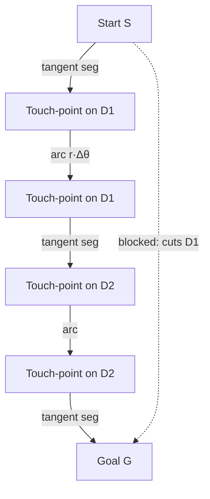
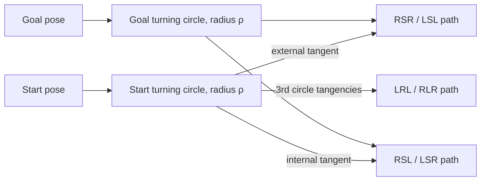
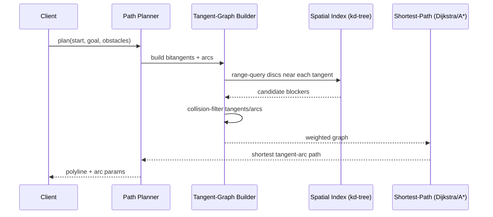

# Circle Tangents — Senior Level

> **One-line summary:** Circle tangents are the *edges* of motion-planning graphs. The shortest path that avoids circular obstacles is a sequence of **straight tangent segments** and **arcs along circle boundaries**; a **tangent graph** wires every tangent between obstacles (and start/goal) into a weighted graph that Dijkstra then searches. **Dubins paths** specialize this to a car with a turning-radius constraint, where every optimal path is a tangent-and-arc combination of at most three pieces. At scale the hard part is not the `O(1)` math but **robustness near degeneracy** and keeping the `O(n²)` tangent build fast.

---

## Table of Contents

1. [Introduction](#introduction)
2. [Tangent Graphs for Shortest Paths Around Circles](#tangent-graphs)
3. [Dubins Paths — Tangents Under a Turning Constraint](#dubins-paths)
4. [Belt, Pulley, and Wrapping Problems](#belt-and-pulley-problems)
5. [Comparison with Alternatives](#comparison-with-alternatives)
6. [Architecture Patterns](#architecture-patterns)
7. [Code Examples](#code-examples)
8. [Robustness Near Degeneracy](#robustness-near-degeneracy)
9. [Worked Example: An RSR Dubins Path](#worked-example-an-rsr-dubins-path)
10. [Worked Example: A Two-Obstacle Tangent Graph](#worked-example-a-two-obstacle-tangent-graph)
11. [Observability](#observability)
12. [Beyond Dubins: Reeds–Shepp and Continuous-Curvature Paths](#beyond-dubins-reedsshepp-and-continuous-curvature-paths)
13. [Failure Modes](#failure-modes)
14. [Summary](#summary)

---

## Introduction

> Focus: "How do I build real systems on top of tangents?"

A junior knows the tangent-length formula; a middle engineer can produce all four common tangents robustly. A senior uses tangents as the **building block of larger algorithms** — chiefly *shortest paths in the presence of round obstacles*. The key realization:

> When obstacles (or robot inflation) are **disks**, the shortest collision-free path is made of **straight tangent segments** between disks and **circular arcs** hugging disk boundaries. Nothing curves except along a circle; nothing is straight except along a tangent.

This is the continuous analogue of the **visibility graph** for polygonal obstacles. There, shortest paths bend only at polygon vertices, so you connect mutually visible vertices and run Dijkstra. With circular obstacles, "vertices" become **tangent touch-points** and the visible connections become **common tangents** — this is the **tangent graph** (a.k.a. the *reduced visibility graph for discs*).

Two flagship applications anchor this file:

1. **Tangent graphs / shortest path among disc obstacles** — robotics, games, GIS routing around circular no-go zones.
2. **Dubins paths** — the shortest path for a vehicle that can only turn with a bounded radius (a car, a fixed-wing UAV). Every optimal Dubins path is a concatenation of tangent lines and minimum-radius arcs.

We also cover the classic **belt/pulley** length computation (sum of tangent segments plus wrap arcs) because it is the cleanest standalone use of tangents and a frequent interview/system question.

---

## Tangent Graphs

### The construction

Given start `S`, goal `G`, and disc obstacles `D₁..Dₙ` (center `Cᵢ`, radius `rᵢ`):

1. **Nodes:** `S`, `G`, plus the tangent touch-points on each disc.
2. **Edges of two kinds:**
   - **Tangent (straight) edges:** every valid common tangent between two discs, and every tangent from `S` (or `G`, a radius-0 disc) to each disc. These are the "bitangent" segments. Weight = segment length.
   - **Arc edges:** along each disc's boundary, connecting touch-points that lie on the same disc. Weight = arc length `r·Δθ`.
3. **Collision filtering:** discard any tangent segment that passes through the interior of *another* disc, and any arc that would over-wrap. This is the expensive part.
4. **Search:** run Dijkstra (or A* with a Euclidean heuristic — see *11-graphs/04-dijkstra* and *11-graphs/09-a-star*) from `S` to `G`.



### Which tangents become edges

Only certain common tangents are usable, depending on whether the path wraps a disc clockwise or counter-clockwise:

| Path turns at disc 1 | Path turns at disc 2 | Tangent type to use |
|----------------------|----------------------|---------------------|
| CCW | CCW | one external (left–left) |
| CW | CW | the other external (right–right) |
| CCW | CW | one internal |
| CW | CCW | the other internal |

So each ordered pair of discs contributes up to **four** candidate bitangents, matching the four `(σ1, σ2)` sign-pairs from `middle.md` — but now each is tagged with the *orientation* of the wrap at each end. The arc edges then connect the "incoming" touch-point to the "outgoing" touch-point on the same disc, going the correct way around.

### Complexity

- Building all pairwise tangents: `O(n²)` pairs × `O(1)` each = `O(n²)` candidate edges.
- Collision-checking each tangent against all discs naively: `O(n)` per edge → `O(n³)` total. With spatial indexing (a *kd-tree*, sibling *04-kd-tree*, or a grid) this drops toward `O(n² log n)`.
- Dijkstra on the resulting graph with `V = O(n)` nodes and `E = O(n²)` edges: `O(n² log n)`.

Net: a practical tangent-graph planner is roughly `O(n²)`–`O(n³)` to build and `O(n² log n)` to search.

---

## Dubins Paths

A **Dubins vehicle** moves forward only, at constant speed, and can turn left or right with a **minimum turning radius** `ρ` (it cannot turn sharper). Given start pose `(x₀, y₀, θ₀)` and goal pose `(x₁, y₁, θ₁)`, the shortest path was characterized by **Lester Dubins (1957)**:

> Every shortest Dubins path is one of exactly six types, each a sequence of at most three segments drawn from **{Left-turn arc, Right-turn arc, Straight line}**: the four "CSC" types `LSL, LSR, RSL, RSR` and the two "CCC" types `LRL, RLR`.

The `S` (straight) segment is a **common tangent** between the two minimum-radius **turning circles** — one tangent to the start pose, one to the goal pose:

- At the start, the vehicle is on a circle of radius `ρ` to its left (for an `L` start) or right (`R`).
- At the goal, similarly.
- The straight middle segment is the **common tangent** connecting the start turning-circle to the goal turning-circle. `LSL`/`RSR` use **external** tangents; `LSR`/`RSL` use **internal** tangents.

So Dubins path planning is *literally* a circle-tangent problem: enumerate the (up to) six candidate paths, compute the relevant tangent for each, total the arc + tangent + arc lengths, and take the minimum that is geometrically valid.



The `CCC` (`LRL`, `RLR`) types arise when start and goal are close: a third tangent circle is wedged between the two turning circles, tangent to both, and the path rides arcs of all three. These dominate only when `dist(centers) < 4ρ`.

Dubins paths are the foundation of **Reeds–Shepp paths** (which also allow reversing) and of lattice planners for autonomous driving. The tangent computation here is the same signed-distance machinery from `middle.md`, applied to circles of equal radius `ρ` — note the equal-radius case, where external tangents are **parallel**, is exactly the common one, so the robustness lessons matter.

---

## Belt and Pulley Problems

Compute the length of a belt wrapping two pulleys of radii `r1, r2` whose centers are `d` apart.

- **Open (external) belt** — the usual flat belt, stays outside both pulleys:
  ```
  external tangent length  Lₑ = sqrt(d² − (r1 − r2)²)
  wrap angle on pulley 1    α  = π + 2·asin((r1 − r2) / d)
  wrap angle on pulley 2    β  = π − 2·asin((r1 − r2) / d)
  belt length = 2·Lₑ + r1·α + r2·β
  ```
- **Crossed (internal) belt** — figure-eight, passes between the pulleys:
  ```
  internal tangent length  Lᵢ = sqrt(d² − (r1 + r2)²)     (needs d ≥ r1 + r2)
  each pulley wrap          γ  = π + 2·asin((r1 + r2) / d)
  belt length = 2·Lᵢ + (r1 + r2)·γ
  ```

The "wrap arcs" are the arcs *between the touch-points of the two tangents on the same pulley* — exactly the arc edges of a tangent graph. This generalizes to a belt over `n` pulleys (a *convex rubber-band* / *Minkowski* problem): the belt is the convex hull of the discs, alternating external-tangent segments and boundary arcs. That is the rotating-calipers / convex-hull-of-discs problem (siblings *01-convex-hull*, *06-rotating-calipers*).

---

## Comparison with Alternatives

For **shortest path among obstacles**:

| Approach | Obstacle shape | Path shape | Build | Query | Optimal? |
|----------|----------------|------------|-------|-------|:--------:|
| Visibility graph | Polygons | Straight segments, bends at vertices | `O(n² log n)` | Dijkstra `O(n² log n)` | Exact |
| **Tangent graph** | **Discs** | **Tangents + arcs** | `O(n²)`–`O(n³)` | `O(n² log n)` | **Exact** |
| Dubins / Reeds–Shepp | Free space, kinodynamic | Arcs + tangents | `O(1)` per pose pair | — | Exact (no obstacles) |
| Grid / A* | Any (rasterized) | Grid-aligned, then smoothed | `O(grid)` | `O(grid)` | Resolution-bounded |
| RRT* / PRM | Any | Sampled, asymptotically optimal | incremental | incremental | Asymptotic |

**Choose tangent graphs when:** obstacles are genuinely circular (inflated point robots, round buildings, keep-out zones), `n` is modest (hundreds), and you need a *provably shortest* path. **Choose sampling (RRT*/PRM) when:** the configuration space is high-dimensional or obstacles are arbitrary; the exact tangent geometry no longer applies.

For the **tangent computation method** at scale, the `middle.md` comparison still holds: signed-distance-`r` is the robust default; homothety-center breaks on the equal-radius circles that Dubins planning produces constantly.

---

## Architecture Patterns

A planning service that uses tangents:



Patterns that matter in production:

- **Inflate then plan.** Treat the robot as a point by inflating every obstacle disc by the robot radius (a Minkowski sum, sibling *10-minkowski-sum*). Tangents are then computed against inflated discs.
- **Cache the static tangent graph.** If obstacles are fixed and only `S`/`G` change, precompute the disc-to-disc tangent graph once; per query you only add `S`/`G` tangents — `O(n)` per query instead of `O(n²)`.
- **Lazy collision checking.** Defer the expensive "does this tangent cut another disc?" test until Dijkstra actually tries to relax that edge (lazy shortest path / lazy PRM).
- **Exact predicates at the boundary.** Use the integer-exact orientation/incircle predicates (sibling *01-convex-hull*) to decide *which side* of a tangent a center is on, avoiding sign flips near degeneracy.

---

## Code Examples

### Example: Thread-safe tangent-graph edge builder (disc-to-disc bitangents)

#### Go

```go
package main

import (
	"math"
	"sync"
)

type Pt struct{ X, Y float64 }
type Disc struct {
	C Pt
	R float64
}
type Edge struct {
	From, To Pt
	Len      float64
}

// BitangentEdges builds straight tangent edges between every pair of discs,
// filtered to those that do not cut any other disc. Concurrency-safe builder.
type BitangentEdges struct {
	mu    sync.Mutex
	edges []Edge
}

func (b *BitangentEdges) addPair(discs []Disc, i, j int) {
	for _, t := range commonTangents(discs[i], discs[j]) {
		if b.clearOfOthers(t.T1, t.T2, discs, i, j) {
			b.mu.Lock()
			b.edges = append(b.edges, Edge{t.T1, t.T2, dist(t.T1, t.T2)})
			b.mu.Unlock()
		}
	}
}

// Build runs the O(n²) pair loop across goroutines.
func (b *BitangentEdges) Build(discs []Disc) []Edge {
	var wg sync.WaitGroup
	for i := range discs {
		for j := i + 1; j < len(discs); j++ {
			wg.Add(1)
			go func(i, j int) { defer wg.Done(); b.addPair(discs, i, j) }(i, j)
		}
	}
	wg.Wait()
	return b.edges
}

func (b *BitangentEdges) clearOfOthers(p, q Pt, discs []Disc, i, j int) bool {
	for k := range discs {
		if k == i || k == j {
			continue
		}
		if segDiscDist(p, q, discs[k].C) < discs[k].R-1e-9 {
			return false // tangent segment cuts disc k
		}
	}
	return true
}

func dist(a, b Pt) float64 { return math.Hypot(a.X-b.X, a.Y-b.Y) }

// segDiscDist: distance from disc center to the tangent segment p..q.
func segDiscDist(p, q, c Pt) float64 {
	vx, vy := q.X-p.X, q.Y-p.Y
	wx, wy := c.X-p.X, c.Y-p.Y
	t := (wx*vx + wy*vy) / (vx*vx + vy*vy)
	t = math.Max(0, math.Min(1, t))
	fx, fy := p.X+t*vx, p.Y+t*vy
	return math.Hypot(c.X-fx, c.Y-fy)
}

// commonTangents and its Tangent type reuse the middle.md implementation.
type Tangent struct{ T1, T2 Pt }

func commonTangents(a, b Disc) []Tangent { /* signed-distance method, see middle.md */ return nil }
```

#### Java

```java
import java.util.*;
import java.util.concurrent.*;

public class TangentGraph {
    record Pt(double x, double y) {}
    record Disc(Pt c, double r) {}
    record Edge(Pt from, Pt to, double len) {}

    // Build straight tangent edges between all disc pairs, collision-filtered.
    static List<Edge> build(List<Disc> discs) throws InterruptedException {
        var edges = Collections.synchronizedList(new ArrayList<Edge>());
        var pool = Executors.newWorkStealingPool();
        for (int i = 0; i < discs.size(); i++) {
            for (int j = i + 1; j < discs.size(); j++) {
                final int fi = i, fj = j;
                pool.submit(() -> {
                    for (var t : commonTangents(discs.get(fi), discs.get(fj))) {
                        if (clearOfOthers(t[0], t[1], discs, fi, fj))
                            edges.add(new Edge(t[0], t[1], dist(t[0], t[1])));
                    }
                });
            }
        }
        pool.shutdown();
        pool.awaitTermination(1, TimeUnit.MINUTES);
        return edges;
    }

    static boolean clearOfOthers(Pt p, Pt q, List<Disc> discs, int i, int j) {
        for (int k = 0; k < discs.size(); k++) {
            if (k == i || k == j) continue;
            if (segDiscDist(p, q, discs.get(k).c()) < discs.get(k).r() - 1e-9) return false;
        }
        return true;
    }

    static double dist(Pt a, Pt b) { return Math.hypot(a.x()-b.x(), a.y()-b.y()); }

    static double segDiscDist(Pt p, Pt q, Pt c) {
        double vx = q.x()-p.x(), vy = q.y()-p.y();
        double wx = c.x()-p.x(), wy = c.y()-p.y();
        double t = Math.max(0, Math.min(1, (wx*vx+wy*vy)/(vx*vx+vy*vy)));
        return Math.hypot(c.x()-(p.x()+t*vx), c.y()-(p.y()+t*vy));
    }

    // Reuse the middle.md signed-distance tangent solver here.
    static Pt[][] commonTangents(Disc a, Disc b) { return new Pt[0][]; }
}
```

#### Python

```python
import math
from concurrent.futures import ThreadPoolExecutor


def build_tangent_edges(discs, common_tangents):
    """Straight bitangent edges between all disc pairs, collision-filtered."""
    edges = []
    n = len(discs)

    def pair(i, j):
        out = []
        for t1, t2 in common_tangents(discs[i], discs[j]):
            if clear_of_others(t1, t2, discs, i, j):
                out.append((t1, t2, math.dist(t1, t2)))
        return out

    with ThreadPoolExecutor() as pool:
        futures = [pool.submit(pair, i, j) for i in range(n) for j in range(i + 1, n)]
        for f in futures:
            edges.extend(f.result())
    return edges


def clear_of_others(p, q, discs, i, j):
    for k, (c, r) in enumerate(discs):
        if k in (i, j):
            continue
        if seg_disc_dist(p, q, c) < r - 1e-9:
            return False
    return True


def seg_disc_dist(p, q, c):
    vx, vy = q[0] - p[0], q[1] - p[1]
    wx, wy = c[0] - p[0], c[1] - p[1]
    t = max(0.0, min(1.0, (wx * vx + wy * vy) / (vx * vx + vy * vy)))
    fx, fy = p[0] + t * vx, p[1] + t * vy
    return math.dist((fx, fy), c)
```

**What it does:** builds the straight tangent edges of a tangent graph between all disc pairs, in parallel, dropping any tangent that cuts another disc.
**Run:** `go run .` | `javac TangentGraph.java && java TangentGraph` | `python tg.py`

---

## Robustness Near Degeneracy

This is where senior engineering lives. The math is `O(1)`, but floating-point makes the *boundaries* treacherous. The degeneracies that bite in tangent code:

| Degeneracy | Symptom | Mitigation |
|------------|---------|------------|
| Circles nearly tangent (`d ≈ r1±r2`) | `h = sqrt(d²−g²)` flickers between 0 and tiny; count jumps 2↔3 frame to frame | Use an **epsilon band**; snap to the tangent case; `sqrt(max(0,·))`. |
| Equal radii (`r1 ≈ r2`) | External homothety center → ∞; slopes overflow | Use signed-distance method (no center); externals come out parallel correctly. |
| Point on circle (`d ≈ r`) | Tangent length `≈ 0`; touch-points collapse onto `P` | Treat as the single-tangent case; do not divide by `L`. |
| Collinear centers + start/goal | Tangent graph degeneracies; ties in Dijkstra | Symbolic perturbation (Simulation of Simplicity) or consistent tie-break. |
| Nearly-touching obstacles | A tangent "just" clears a third disc; collision test is on the knife-edge | Inflate obstacles by a safety margin `ε` before planning; plan with conservative radii. |
| Two discs almost identical | Tangent set ill-defined; duplicates explode | Merge near-duplicate discs in a preprocessing pass. |

Two structural defenses:

1. **Exact predicates where the *decision* matters.** Whether a center is left/right of a tangent, or whether a tangent clears a disc, is a *sign* decision. Compute that sign with integer or extended-precision arithmetic (orientation/incircle predicates) even if you compute coordinates in `double`. This is the same lesson as in convex hull (*01-convex-hull*): geometry breaks at *combinatorial* decisions, not at coordinates.
2. **Conservative inflation.** In a planner, inflate obstacles by `ε` so "barely clears" becomes "comfortably clears." You trade a slightly longer path for a path that is *actually* collision-free under floating-point.

---

## Worked Example: An RSR Dubins Path

Concrete numbers make the tangent-as-Dubins-segment idea click. Start pose `(0, 0, 90°)` (heading north), goal pose `(10, 0, 90°)` (also north), turning radius `ρ = 2`. We compute the `RSR` path (turn right, go straight, turn right).

```text
Step 1. Right-turn circle at the start.
        Turning right from heading 90° means the center is 90° clockwise of
        the heading, i.e. to the east: C_start = (0,0) + ρ·(cos0°, sin0°) = (2, 0).
        Wait — center is at distance ρ perpendicular-right of the pose:
        right of "north" is "east" → C_start = (2, 0).

Step 2. Right-turn circle at the goal.
        Same offset: C_goal = (10, 0) + (2, 0) = (12, 0).

Step 3. The straight segment is the EXTERNAL common tangent of the two
        EQUAL-radius circles (both ρ=2). Equal radii ⇒ external tangents are
        PARALLEL to the center line C_start–C_goal (the x-axis), offset by ρ.
        The RSR-relevant external tangent is the lower one (both turns CW):
        it runs from (2, −2) to (12, −2)  (touch-points at the bottom of each
        circle), straight length L = dist = 10.

Step 4. Arc lengths. Both turning circles are radius ρ=2; the heading must
        rotate from entry to the tangent and from the tangent back to the goal
        heading. With aligned start/goal headings and parallel tangent, both
        arcs are ~0 here (degenerate aligned case) → total ≈ straight 10.
```

The key senior insight: **every Dubins straight segment is a common tangent between two equal-radius circles**, so the equal-radius parallel-tangent case — the one that *breaks* the homothety method — is not an edge case in Dubins planning, it is the *only* case. Production Dubins libraries (e.g. OMPL's `DubinsStateSpace`) compute these tangents with the signed-distance / direct trigonometric forms for exactly this reason.

## Worked Example: A Two-Obstacle Tangent Graph

Start `S = (0, 0)`, goal `G = (20, 0)`, two disc obstacles: `D₁ = ((8, 1), 2)`, `D₂ = ((13, −1), 2)`.

```text
1. Nodes: S, G, and the touch-points of all tangents.
2. Tangents from S to D₁ and D₂ (S is a radius-0 disc): 2 each.
   Tangents from G likewise: 2 each.
   Common tangents D₁↔D₂: classify d = dist((8,1),(13,-1)) = sqrt(25+4) = √29 ≈ 5.39.
   r₁+r₂ = 4, |r₁−r₂| = 0  ⇒  d > r₁+r₂  ⇒  4 common tangents (separate).
3. Arc edges: on each disc, connect the incoming touch-point to the outgoing
   one, weight = ρ·Δθ along the correct (CW/CCW) wrap.
4. Collision filter: the straight S→G segment passes near (8,1) and (13,-1);
   check seg-disc distance. If it clears both, S→G direct is the shortest.
   If a disc blocks it, the path detours: S → tangent → arc on D₁ →
   tangent (D₁↔D₂) → arc on D₂ → tangent → G.
5. Dijkstra over the graph returns the shortest tangent-arc polyline.
```

The number of candidate edges is `O(n²)` (here `n = 2` obstacles plus S, G), and the dominant cost in a real map is the per-edge collision filter, which spatial indexing reduces from `O(n)` to roughly `O(log n)` per edge.

### Dubins RSR length in code (tangent-driven)

The RSR length is `arc1 + tangent + arc2`, where the tangent is the external common tangent of two equal-radius (`ρ`) turning circles. Because the radii are equal, the external tangent is parallel to the center line and its length equals the center distance — a direct, robust computation with no homothety center.

#### Python

```python
import math

def rsr_length(start, goal, rho):
    """start, goal = (x, y, heading_rad). Returns RSR Dubins length."""
    # Right-turn circle center is rho to the RIGHT of the heading.
    def right_center(x, y, h):
        return (x + rho * math.cos(h - math.pi / 2),
                y + rho * math.sin(h - math.pi / 2))
    c1 = right_center(*start)
    c2 = right_center(*goal)
    d = math.dist(c1, c2)
    straight = d                      # equal radii ⇒ external tangent ∥ centers, length d
    # arc lengths: heading change from entry tangent to exit tangent (CW = right)
    theta = math.atan2(c2[1] - c1[1], c2[0] - c1[0])
    a1 = (start[2] - theta) % (2 * math.pi)   # CW arc on start circle
    a2 = (theta - goal[2]) % (2 * math.pi)    # CW arc on goal circle
    return rho * a1 + straight + rho * a2

if __name__ == "__main__":
    print(rsr_length((0, 0, math.pi/2), (10, 0, math.pi/2), 2.0))  # ≈ 10 (aligned)
```

The Go and Java versions are mechanical translations of the same four steps (two centers, one tangent length = center distance, two CW arcs); the equal-radius simplification (`straight = d`) is what keeps them branch-free and robust.

## Observability

| Metric | Why | Alert / target |
|--------|-----|----------------|
| `tangent_solve_ns` | Detect pathological inputs (near-degenerate pairs that loop or NaN) | p99 > 10× median |
| `degenerate_pair_rate` | Fraction of pairs hitting the epsilon band | Rising → numerical instability upstream |
| `nan_tangents_total` | Any NaN line escaping the solver | Must be **0** |
| `tangent_graph_build_ms` | `O(n²)` build cost for the planner | Grows with `n²`; cap obstacle count |
| `path_collision_violations` | Output path that actually intersects an obstacle | Must be **0** (else inflate `ε`) |
| `dijkstra_expanded_nodes` | Search effort over the tangent graph | A* heuristic should cut this sharply |

Log, per planning request: obstacle count, number of tangent edges before/after collision filtering, the chosen path's segment/arc breakdown, and whether any epsilon-band events fired.

---

## Beyond Dubins: Reeds–Shepp and Continuous-Curvature Paths

Dubins assumes forward-only motion. A **Reeds–Shepp** vehicle can also reverse, which doubles the move alphabet (forward/backward arcs and lines) and yields up to 48 candidate path words, of which a known set of 48 patterns covers all optimal paths. Crucially, the *geometric primitives are unchanged*: every straight segment is still a **common tangent** between two minimum-radius circles, and every curved segment is a minimum-radius **arc**. The tangent computation in this topic is exactly what those planners call internally — the only added bookkeeping is direction-of-travel signs on the segments.

```text
Dubins word set:        { LSL, RSR, LSR, RSL, LRL, RLR }              (6, forward only)
Reeds–Shepp word set:   adds reversals → up to 48 patterns, e.g.
                        L+ S+ L+,  L+ R− L+,  ... (± = forward/backward)
Shared primitive:       the S (straight) piece = common tangent of two ρ-circles.
```

A practical refinement, **continuous-curvature (CC) paths**, replaces instantaneous curvature jumps (a car cannot snap its steering wheel) with *clothoid* transitions between the straight tangent and the arc. The tangent geometry still anchors the straight middle segment; the clothoids are spliced at the touch-points. So even the most realistic car-like planners reduce, at their core, to the circle-tangent computation developed here — which is why getting the equal-radius, near-degenerate tangent math *robust* is a senior-level production concern, not an academic nicety.

The cost hierarchy to remember:

| Planner | Reverses? | Curvature continuous? | Tangent primitive |
|---------|:---------:|:---------------------:|-------------------|
| Dubins | No | No | external/internal tangent of ρ-circles |
| Reeds–Shepp | Yes | No | same tangent, with travel-direction signs |
| Continuous-curvature | Yes | Yes | same tangent + clothoid splices at touch-points |

## Failure Modes

- **Phantom internal tangents** for overlapping obstacles — emitting `0..4` blindly without the `|g| ≤ d` check produces NaN lines that corrupt the graph. *Fix:* honor the existence test per sign-pair.
- **Path clips an obstacle** — a tangent passed the collision filter due to an `ε` that was too tight, or the wrap arc went the wrong way around a disc. *Fix:* conservative inflation; verify arc orientation (CW/CCW) against the bitangent tag.
- **Equal-radius planner blow-up** — Dubins turning circles always share radius `ρ`; a homothety-based tangent routine divides by zero on *every* call. *Fix:* signed-distance method only.
- **`O(n³)` collision filter dominates** — naive all-pairs blocker test on large maps. *Fix:* spatial index (kd-tree/grid) to query only nearby discs per tangent.
- **Tie-induced non-determinism** — collinear configurations give equal-length paths; Dijkstra returns different ones across runs, breaking replayability. *Fix:* deterministic tie-break (lexicographic on node id).
- **Cumulative arc/segment rounding** — long paths over many discs accumulate length error; a "shortest" path is reported slightly wrong. *Fix:* Kahan summation or compute arc lengths from exact angles.

---

## Summary

At senior level, circle tangents are the **edges of motion-planning graphs**. Shortest paths among disc obstacles are tangent segments stitched with boundary arcs — the **tangent graph**, searched by Dijkstra/A*, the disc analogue of the polygon visibility graph. **Dubins paths** specialize this to bounded-turn vehicles: every optimal path is `CSC` or `CCC`, where the straight `S` is a common tangent (external for `LSL`/`RSR`, internal for `LSR`/`RSL`) between two minimum-radius turning circles — equal-radius circles, so the signed-distance method is mandatory. **Belt/pulley** length is the cleanest standalone tangent application: tangent segments plus wrap arcs. The senior craft is not the `O(1)` formula but **robustness near degeneracy** (epsilon bands, exact sign predicates, conservative inflation) and keeping the `O(n²)`–`O(n³)` build fast with spatial indexing.

---

**Next step:** [professional.md](./professional.md) — full derivation of the tangent-point and common-tangent formulas, a rigorous proof of the 0–4 count by circle relationship, the homothety/external-internal-center structure, and a formal treatment of degeneracy and exact predicates.
