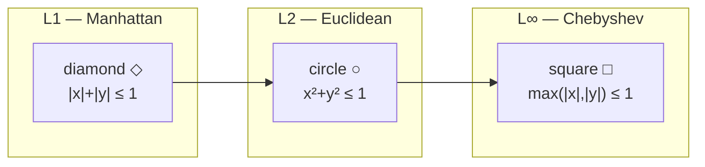
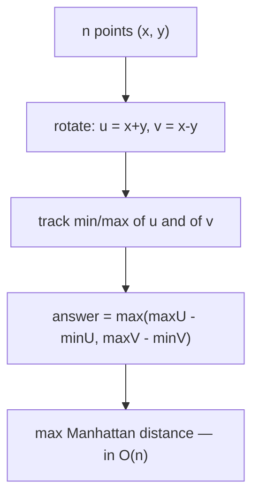

# Manhattan & Chebyshev Distances — Junior Level

> **One-line summary:** Manhattan distance is `|dx| + |dy|` (the L1 metric — how a taxi drives on a grid), Chebyshev distance is `max(|dx|, |dy|)` (the L∞ metric — how a chess king moves). Their unit "balls" are a diamond and a square. The magic trick is that rotating coordinates 45° with `u = x + y, v = x - y` turns Manhattan distance into Chebyshev distance, which makes many hard "diamond" problems easy.

---

## Table of Contents

1. [Introduction](#introduction)
2. [Prerequisites](#prerequisites)
3. [Glossary](#glossary)
4. [Core Concepts](#core-concepts)
5. [Big-O Summary](#big-o-summary)
6. [Real-World Analogies](#real-world-analogies)
7. [Pros & Cons](#pros--cons)
8. [Step-by-Step Walkthrough](#step-by-step-walkthrough)
9. [Code Examples](#code-examples)
10. [Coding Patterns](#coding-patterns)
11. [Error Handling](#error-handling)
12. [Performance Tips](#performance-tips)
13. [Best Practices](#best-practices)
14. [Edge Cases & Pitfalls](#edge-cases--pitfalls)
15. [Common Mistakes](#common-mistakes)
16. [Cheat Sheet](#cheat-sheet)
17. [Visual Animation](#visual-animation)
18. [Summary](#summary)
19. [Further Reading](#further-reading)

---

## Introduction

When you measure the distance between two points, you usually reach for the **straight-line distance** — the one Pythagoras taught you, `√(dx² + dy²)`. That is called the **Euclidean** distance, or the **L2** metric. But it is not the only way to measure distance, and in many computing problems it is not even the *right* way.

Imagine you are a taxi driving in a city laid out as a grid of streets. You cannot drive diagonally through buildings — you can only go east-west and north-south. To get from one corner to another that is 3 blocks east and 4 blocks north, you drive `3 + 4 = 7` blocks, no matter which streets you pick. That is the **Manhattan distance** (named after the grid-shaped streets of Manhattan), also called the **L1** metric or **taxicab** distance. The formula is dead simple:

```
manhattan((x1, y1), (x2, y2)) = |x1 - x2| + |y1 - y2|
```

Now imagine a different rule. On a chessboard, a **king** can move one square in any of the eight directions — including diagonally — and a diagonal move counts the same as a straight move. To move 3 columns and 4 rows, the king needs `max(3, 4) = 4` moves (it travels diagonally for 3 of them, covering both column and row at once, then 1 more straight). That is the **Chebyshev distance**, also called the **L∞** metric or the **chessboard distance**:

```
chebyshev((x1, y1), (x2, y2)) = max(|x1 - x2|, |y1 - y2|)
```

So we have **three ways** to measure distance, and they answer three different physical questions:

| Metric | Formula (in 2D) | "How far is it if you move like…" |
|--------|-----------------|-----------------------------------|
| **L1 — Manhattan** | `|dx| + |dy|` | …a taxi on a grid (no diagonals) |
| **L2 — Euclidean** | `√(dx² + dy²)` | …a bird flying straight |
| **L∞ — Chebyshev** | `max(|dx|, |dy|)` | …a chess king (diagonals are free) |

These are not just trivia. Manhattan distance is the natural cost model for grid pathfinding, VLSI chip routing, and "facility location" problems. Chebyshev distance shows up in image processing and game AI. And — this is the part that makes the whole topic worth its own folder — there is a **beautiful coordinate trick** that connects the two and turns awkward diamond-shaped problems into easy square-shaped ones. We will meet it in this file and study it deeply at the middle level.

---

## Prerequisites

Before reading this file you should be comfortable with:

- **Coordinates** — points `(x, y)` on a 2D plane, and the absolute value `|x|`.
- **Basic arithmetic** — addition, subtraction, `max`, `min`.
- **Arrays/loops** — iterating over a list of points in any of Go/Java/Python.
- **Big-O notation** — `O(1)`, `O(n)`, `O(n²)`.

Optional but helpful:

- A vague memory of the Euclidean distance formula and the Pythagorean theorem.
- Having seen a 2D grid (chessboard, pixel image, spreadsheet) — any of those works as a mental model.

You do **not** need trigonometry, linear algebra, or any prior geometry-algorithm experience.

---

## Glossary

| Term | Meaning |
|------|---------|
| **Metric / distance function** | A rule `d(p, q)` that gives a non-negative "distance" between two points. |
| **L1 / Manhattan / taxicab distance** | `|dx| + |dy|`. Sum of the axis differences. |
| **L2 / Euclidean distance** | `√(dx² + dy²)`. The familiar straight-line distance. |
| **L∞ / Chebyshev / chessboard distance** | `max(|dx|, |dy|)`. The larger of the two axis differences. |
| **Lp norm** | The general family: `(|dx|^p + |dy|^p)^(1/p)`. L1, L2, L∞ are special cases (`p = 1, 2, ∞`). |
| **Unit ball** | The set of all points at distance ≤ 1 from the origin. Its shape reveals the metric's "personality." |
| **Diamond** | The unit ball of L1 — a square rotated 45° (vertices on the axes). |
| **Square (axis-aligned)** | The unit ball of L∞ — a `2×2` square with sides parallel to the axes. |
| **The 45° rotation trick** | The transform `u = x + y`, `v = x - y` that converts Manhattan distance into Chebyshev distance. |
| **Rotated coordinates** | The new coordinates `(u, v) = (x + y, x - y)` after applying the trick. |
| **dx, dy** | Shorthand for `x1 - x2` and `y1 - y2` (the per-axis differences). |
| **Separable** | A property of L1: it is the *sum* of independent per-axis terms, so each axis can be handled on its own. |

---

## Core Concepts

### 1. A "distance" is just a rule for measuring closeness

In geometry class, distance means *one* thing: the straight-line length. In computing, "distance" is whatever cost model fits your problem. A **metric** is any rule `d(p, q)` that behaves sensibly:

- it is never negative, and is `0` only when `p = q`,
- it is symmetric: `d(p, q) = d(q, p)`,
- it obeys the **triangle inequality**: `d(p, r) ≤ d(p, q) + d(q, r)` (no shortcut by detouring).

L1, L2, and L∞ are all metrics — all three obey these rules. They just *measure* differently. Choosing the right metric is half the battle: if your robot moves on a grid, measuring its travel cost with Euclidean distance would be **wrong**.

### 2. Manhattan distance (L1): add the two axis differences

```
L1((x1,y1),(x2,y2)) = |x1 - x2| + |y1 - y2|
```

Each axis contributes *independently*, and you **add** the contributions. This "add independent per-axis costs" property is called **separability**, and it is the secret behind one of L1's superpowers: the point that minimizes the *total* Manhattan distance to a set of points is found by taking the **median** of the x-coordinates and the **median** of the y-coordinates, completely independently. (More on that at the middle level — it is why hospitals and warehouses get placed at "medians.")

### 3. Chebyshev distance (L∞): take the larger axis difference

```
L∞((x1,y1),(x2,y2)) = max(|x1 - x2|, |y1 - y2|)
```

Here the axes do *not* add — the bigger one **dominates**, and the smaller one comes "for free." This is exactly the chess king: moving diagonally lets you cover one row *and* one column in a single move, so the limiting factor is whichever direction is farther.

### 4. The unit balls reveal the personality

The clearest way to *see* a metric is to draw its **unit ball** — every point within distance 1 of the origin.

- **L1 (Manhattan):** `|x| + |y| ≤ 1` is a **diamond** (a square standing on its corner, vertices at `(±1, 0)` and `(0, ±1)`).
- **L2 (Euclidean):** `x² + y² ≤ 1` is a **circle**.
- **L∞ (Chebyshev):** `max(|x|, |y|) ≤ 1` is an **axis-aligned square** (corners at `(±1, ±1)`).



Notice the nesting: the diamond fits *inside* the circle fits *inside* the square. That is no accident — for any point, `L∞ ≤ L2 ≤ L1`. The diamond is the "tightest," the square the "loosest."

### 5. The 45° rotation trick (preview)

Here is the headline result of this whole topic, stated simply now and proven later:

> If you replace every point `(x, y)` with `(u, v) = (x + y, x - y)`, then the **Manhattan** distance between two original points equals the **Chebyshev** distance between their transformed points.

```
|x1 - x2| + |y1 - y2|  =  max(|u1 - u2|, |v1 - v2|)
                          where u = x + y, v = x - y
```

In plain words: **rotate the plane by 45°, and diamonds become squares.** Why is that useful? Because squares are *axis-aligned* — you can handle the x-direction and the y-direction independently with simple sorting and min/max. Problems like "find the two points that are farthest apart in Manhattan distance" become almost trivial after the rotation. This single idea is the reason competitive programmers love this topic.

---

## Big-O Summary

| Operation | Complexity | Notes |
|-----------|-----------|-------|
| Compute L1 between two points | O(1) | One subtraction, two abs, one add. |
| Compute L∞ between two points | O(1) | Two abs, one max. |
| Compute L2 between two points | O(1) | Needs a square root (slower constant). |
| Rotate one point `(x,y) → (x+y, x-y)` | O(1) | Two additions. |
| Max Manhattan distance over `n` points (naive) | O(n²) | Check all pairs. |
| Max Manhattan distance via rotation | **O(n)** | Rotate, then take max−min on each axis. |
| Sum of L1 distances from a chosen point | O(n) | Per candidate point. |
| Best meeting point (1D median) | O(n) or O(n log n) | Median via quickselect or sort. |

> The whole reason the rotation trick matters is in this table: it collapses an `O(n²)` pairwise search into an `O(n)` scan.

---

## Real-World Analogies

| Concept | Analogy |
|---------|---------|
| Manhattan / L1 | A taxi in a grid city: you can only drive along streets, never through buildings, so you add the east-west blocks to the north-south blocks. |
| Chebyshev / L∞ | A chess king: a diagonal step covers a row *and* a column at once, so the number of moves is just the larger of the two gaps. |
| Euclidean / L2 | A bird (or a drone) flying in a straight line, ignoring streets entirely. |
| Unit ball shape | The "reachable in one step" region. A taxi's is a diamond; a king's is a square; a bird's is a circle. |
| Separability of L1 | Two separate odometers, one for east-west and one for north-south; the total trip is their sum. |
| The 45° rotation | Tilting your head 45° so the diamond on the table now looks like an upright square — same shape, easier to reason about. |
| Median minimizes L1 | The fairest place to put a shared mailbox on a street: stand where half the houses are on each side. |

Where the analogies break: a real taxi deals with one-way streets and traffic (asymmetric costs), but pure L1 is symmetric. A real king is confined to an 8×8 board; the metric has no such bounds.

---

## Pros & Cons

| Pros | Cons |
|------|------|
| L1 and L∞ are integer-only — no square roots, no floating-point error. | They are not rotation-invariant: rotating the world changes distances (unlike Euclidean). |
| Both are `O(1)` and faster to compute than Euclidean. | L1 paths are not unique — many equal-cost routes exist, which can complicate tie-breaking. |
| L1 is *separable* — each axis handled independently (enables the median trick). | The diamond shape makes "farthest pair" awkward *until* you rotate. |
| The 45° rotation links them, collapsing `O(n²)` problems to `O(n)`. | Beginners confuse which of `+` and `max` belongs to which metric. |
| Perfect cost models for grids, chips, and city logistics. | The `u = x+y, v = x-y` transform doubles distances by `√2`; you must remember the scale factor in some uses. |
| Median-optimality gives exact, closed-form facility-location answers. | Generalizing the rotation trick to 3D and beyond is much harder (no clean 45° analogue). |

**When to use L1:** grid pathfinding cost, VLSI/PCB wire-length estimation, robust statistics (L1 is less sensitive to outliers than L2), facility/median placement.

**When to use L∞:** chessboard-style movement, image dilation/erosion (king-move neighborhoods), bounding-box "is it within k in every dimension?" checks.

**When NOT to use them:** when physical straight-line distance genuinely matters (radio range, gravity, collision) — that is Euclidean's job.

---

## Step-by-Step Walkthrough

Let us work the **max Manhattan distance** problem by hand, both the slow way and the fast (rotation) way.

**Points:** `P1 = (1, 1)`, `P2 = (4, 5)`, `P3 = (6, 2)`, `P4 = (2, 8)`.
**Goal:** find the largest `|dx| + |dy|` over all pairs.

### Slow way: check all 6 pairs

```
P1–P2: |1-4| + |1-5| = 3 + 4 = 7
P1–P3: |1-6| + |1-2| = 5 + 1 = 6
P1–P4: |1-2| + |1-8| = 1 + 7 = 8
P2–P3: |4-6| + |5-2| = 2 + 3 = 5
P2–P4: |4-2| + |5-8| = 2 + 3 = 5
P3–P4: |6-2| + |2-8| = 4 + 6 = 10   <-- maximum
```

The answer is **10** (between `P3` and `P4`). For `n` points this took `O(n²)` work — fine for 4 points, hopeless for a million.

### Fast way: rotate, then take ranges

Transform each point with `u = x + y`, `v = x - y`:

```
P1 (1,1) -> u=2,  v=0
P2 (4,5) -> u=9,  v=-1
P3 (6,2) -> u=8,  v=4
P4 (2,8) -> u=10, v=-6
```

Now the **max Manhattan distance** equals the larger of (range of `u`) and (range of `v`):

```
u-values: 2, 9, 8, 10   -> max - min = 10 - 2 = 8
v-values: 0, -1, 4, -6  -> max - min = 4 - (-6) = 10
answer = max(8, 10) = 10   ✓  matches!
```

We got the same **10** with a single pass over the points (compute `u, v`, track four running min/max values) — `O(n)` instead of `O(n²)`. *That* is the power of turning the diamond into a square: on a square, the farthest pair is simply determined by the widest spread along each axis.



---

## Code Examples

### Example 1: The three distance functions

#### Go

```go
package main

import (
	"fmt"
	"math"
)

func absInt(x int) int {
	if x < 0 {
		return -x
	}
	return x
}

func maxInt(a, b int) int {
	if a > b {
		return a
	}
	return b
}

// L1 / Manhattan: sum of axis differences.
func manhattan(x1, y1, x2, y2 int) int {
	return absInt(x1-x2) + absInt(y1-y2)
}

// L-infinity / Chebyshev: larger axis difference.
func chebyshev(x1, y1, x2, y2 int) int {
	return maxInt(absInt(x1-x2), absInt(y1-y2))
}

// L2 / Euclidean: straight-line distance (returns float).
func euclidean(x1, y1, x2, y2 int) float64 {
	dx := float64(x1 - x2)
	dy := float64(y1 - y2)
	return math.Sqrt(dx*dx + dy*dy)
}

func main() {
	fmt.Println("Manhattan:", manhattan(1, 1, 4, 5)) // 7
	fmt.Println("Chebyshev:", chebyshev(1, 1, 4, 5)) // 4
	fmt.Printf("Euclidean: %.3f\n", euclidean(1, 1, 4, 5)) // 5.000
}
```

#### Java

```java
public class Distances {

    // L1 / Manhattan: sum of axis differences.
    static int manhattan(int x1, int y1, int x2, int y2) {
        return Math.abs(x1 - x2) + Math.abs(y1 - y2);
    }

    // L-infinity / Chebyshev: larger axis difference.
    static int chebyshev(int x1, int y1, int x2, int y2) {
        return Math.max(Math.abs(x1 - x2), Math.abs(y1 - y2));
    }

    // L2 / Euclidean: straight-line distance.
    static double euclidean(int x1, int y1, int x2, int y2) {
        double dx = x1 - x2, dy = y1 - y2;
        return Math.sqrt(dx * dx + dy * dy);
    }

    public static void main(String[] args) {
        System.out.println("Manhattan: " + manhattan(1, 1, 4, 5)); // 7
        System.out.println("Chebyshev: " + chebyshev(1, 1, 4, 5)); // 4
        System.out.printf("Euclidean: %.3f%n", euclidean(1, 1, 4, 5)); // 5.000
    }
}
```

#### Python

```python
import math


def manhattan(p, q):
    """L1: sum of axis differences."""
    return abs(p[0] - q[0]) + abs(p[1] - q[1])


def chebyshev(p, q):
    """L-infinity: larger axis difference."""
    return max(abs(p[0] - q[0]), abs(p[1] - q[1]))


def euclidean(p, q):
    """L2: straight-line distance."""
    return math.hypot(p[0] - q[0], p[1] - q[1])


if __name__ == "__main__":
    a, b = (1, 1), (4, 5)
    print("Manhattan:", manhattan(a, b))   # 7
    print("Chebyshev:", chebyshev(a, b))   # 4
    print(f"Euclidean: {euclidean(a, b):.3f}")  # 5.000
```

**What it does:** computes all three distances between `(1,1)` and `(4,5)`. Note `7 ≥ 5 ≥ 4`, matching the `L1 ≥ L2 ≥ L∞` ordering.
**Run:** `go run main.go` | `javac Distances.java && java Distances` | `python distances.py`

### Example 2: The 45° rotation and its inverse

#### Go

```go
package main

import "fmt"

// rotate maps (x, y) -> (u, v) = (x+y, x-y). L1 in (x,y) becomes L-inf in (u,v).
func rotate(x, y int) (int, int) {
	return x + y, x - y
}

// unrotate maps (u, v) back to (x, y). Note x=(u+v)/2, y=(u-v)/2.
func unrotate(u, v int) (int, int) {
	return (u + v) / 2, (u - v) / 2
}

func main() {
	x, y := 6, 2
	u, v := rotate(x, y)
	fmt.Printf("(%d,%d) -> (%d,%d)\n", x, y, u, v) // (6,2) -> (8,4)
	bx, by := unrotate(u, v)
	fmt.Printf("back -> (%d,%d)\n", bx, by) // back -> (6,2)
}
```

#### Java

```java
public class Rotate {
    // Returns {u, v} = {x+y, x-y}.
    static int[] rotate(int x, int y) {
        return new int[]{x + y, x - y};
    }

    // Returns {x, y} from {u, v}. x=(u+v)/2, y=(u-v)/2.
    static int[] unrotate(int u, int v) {
        return new int[]{(u + v) / 2, (u - v) / 2};
    }

    public static void main(String[] args) {
        int[] r = rotate(6, 2);
        System.out.println("(6,2) -> (" + r[0] + "," + r[1] + ")"); // (8,4)
        int[] back = unrotate(r[0], r[1]);
        System.out.println("back -> (" + back[0] + "," + back[1] + ")"); // (6,2)
    }
}
```

#### Python

```python
def rotate(x, y):
    """(x, y) -> (u, v) = (x+y, x-y).  L1 becomes L-infinity."""
    return x + y, x - y


def unrotate(u, v):
    """(u, v) -> (x, y).  x=(u+v)/2, y=(u-v)/2."""
    return (u + v) // 2, (u - v) // 2


if __name__ == "__main__":
    x, y = 6, 2
    u, v = rotate(x, y)
    print(f"({x},{y}) -> ({u},{v})")   # (6,2) -> (8,4)
    print("back ->", unrotate(u, v))    # back -> (6, 2)
```

**What it does:** rotates a point and rotates it back. The inverse divides by 2 — that is fine for integers when `u + v` is even, which it always is here because `u + v = 2x`.
**Run:** `go run main.go` | `javac Rotate.java && java Rotate` | `python rotate.py`

---

## Coding Patterns

### Pattern 1: Verify the rotation identity on a pair

**Intent:** convince yourself `L1(p, q) == L∞(rotate(p), rotate(q))`.

```python
def check_identity(p, q):
    L1 = abs(p[0]-q[0]) + abs(p[1]-q[1])
    pu, pv = p[0]+p[1], p[0]-p[1]
    qu, qv = q[0]+q[1], q[0]-q[1]
    Linf = max(abs(pu-qu), abs(pv-qv))
    return L1, Linf, (L1 == Linf)

print(check_identity((1, 1), (4, 5)))  # (7, 7, True)
```

Run it on a few random pairs — it always holds. The proof is in `professional.md`.

### Pattern 2: Max Manhattan distance in O(n)

**Intent:** the headline application — farthest pair under L1, without checking all pairs.

```python
def max_manhattan(points):
    # max over pairs of |dx|+|dy| == max(range of x+y, range of x-y)
    us = [x + y for x, y in points]
    vs = [x - y for x, y in points]
    return max(max(us) - min(us), max(vs) - min(vs))
```

### Pattern 3: Closest meeting point on one axis (median)

**Intent:** the point minimizing total L1 distance is the per-axis median.

```python
def best_meeting_distance(points):
    xs = sorted(p[0] for p in points)
    ys = sorted(p[1] for p in points)
    mx = xs[len(xs) // 2]   # median x
    my = ys[len(ys) // 2]   # median y
    return sum(abs(x - mx) + abs(y - my) for x, y in points)
```

```mermaid
graph TD
    A[Points in L1 world] --> B{What do you need?}
    B -->|farthest pair| C[rotate -> max range per axis]
    B -->|best meeting point| D[median of x, median of y]
    B -->|raw distance| E["|dx| + |dy|"]
    C --> F[O(n)]
    D --> F
```

---

## Error Handling

| Error | Cause | Fix |
|-------|-------|-----|
| Wrong metric used | Confusing `+` (L1) with `max` (L∞). | Memorize: **Manhattan = add**, **Chebyshev = max**. |
| Integer overflow in `x + y` | Coordinates near `INT_MAX`. | Use 64-bit ints (`int64`, `long`) for `u = x + y`. |
| `unrotate` gives wrong point | `(u + v)` is odd. | Only valid when the rotated point came from integer `(x, y)`; then `u + v = 2x` is always even. |
| Forgot the `√2` scale factor | Mixing the rotated metric back into a length. | Remember: `L1(x,y)` equals the *Chebyshev* value in `(u,v)` exactly, but Euclidean lengths scale by `√2` under this transform. |
| Negative result | Forgot the absolute value. | Always wrap axis differences in `abs`. |
| Off-by-one in median index | Even number of points. | Any value between the two middle elements is optimal; `n//2` works. |

---

## Performance Tips

- **Prefer L1/L∞ over L2** when the problem allows — no `sqrt`, integer-exact, faster.
- **Use the rotation** to turn any "max Manhattan distance" or "Manhattan farthest pair" into an `O(n)` scan over `u` and `v` ranges.
- **Avoid recomputing `abs`** in tight loops — cache `dx` and `dy`.
- **Batch the rotation**: compute all `u = x+y` and `v = x-y` once, then reuse for multiple queries.
- For **k-dimensional** Chebyshev/Manhattan, the per-axis structure still holds; loop over dimensions and `sum` (L1) or `max` (L∞).

---

## Best Practices

- State *which metric* your problem uses in a comment — silent metric confusion is the #1 bug here.
- Keep coordinates as integers when you can; both L1 and L∞ stay integer, avoiding float drift.
- When you rotate, name the new axes `u` and `v` clearly so reviewers know you switched frames.
- Test the rotation identity on random points as a unit test — it is a one-line invariant that catches mistakes.
- Use 64-bit arithmetic for `u = x + y` if coordinates can be large.

---

## Edge Cases & Pitfalls

- **Single point** — every distance is `0`; max Manhattan distance over one point is `0`.
- **Duplicate points** — distance `0`; harmless.
- **Collinear points on an axis** — one of `dx, dy` is `0`; L1, L2, L∞ may coincide.
- **All points equal** — all ranges are `0`; the rotation still returns `0`.
- **Negative coordinates** — fine; `abs` handles them. But watch overflow in `x + y` when both are large negatives.
- **Points exactly on the diagonal** (`x = y`) — `v = x - y = 0`; the v-range collapses, leaving the u-range to decide.

---

## Common Mistakes

1. **Swapping the formulas** — using `max` for Manhattan or `+` for Chebyshev. Burn the diamond (add) and square (max) images into memory.
2. **Forgetting `abs`** — `dx + dy` (without abs) is not a distance and can be negative.
3. **Comparing raw rotated coordinates as if they were the original distances** — the rotation changes the *metric*, not the points' identities; reconvert if you need actual `(x, y)`.
4. **Overflow on `x + y`** — large coordinates need 64-bit accumulators.
5. **Using `√2`-scaled values inconsistently** — decide once whether you keep the exact integer relationship (L1↔L∞) or the geometric `√2` scaling.
6. **Assuming the median is unique** — for even `n` an interval of points all minimize L1; any works.

---

## Cheat Sheet

| Metric | Formula | Unit ball | Mental model |
|--------|---------|-----------|--------------|
| L1 Manhattan | `|dx| + |dy|` | diamond ◇ | taxi on a grid |
| L2 Euclidean | `√(dx² + dy²)` | circle ○ | bird flying |
| L∞ Chebyshev | `max(|dx|, |dy|)` | square □ | chess king |

**The trick (memorize):**

```
u = x + y,  v = x - y
L1 in (x, y)  ==  L∞ in (u, v)

inverse:  x = (u + v) / 2,  y = (u - v) / 2
```

**Max Manhattan distance over n points:**

```
answer = max( max(x+y) - min(x+y),
              max(x-y) - min(x-y) )      # O(n)
```

**Best meeting point (min sum of L1):** median of x's, median of y's (independently).

---

## Visual Animation

> See [`animation.html`](./animation.html) for an interactive visual animation of Manhattan and Chebyshev distances.
>
> The animation demonstrates:
> - The L1 **diamond** and L∞ **square** unit balls side by side
> - The 45° rotation `u = x+y, v = x-y` morphing a diamond into a square
> - A **max-Manhattan-distance** example solved by the rotation, step by step
> - Controls to add points, toggle the rotation, and read the per-axis ranges
> - A Big-O panel and an operation log

---

## Summary

Manhattan (L1, `|dx|+|dy|`, a diamond, a taxi) and Chebyshev (L∞, `max(|dx|,|dy|)`, a square, a chess king) are two integer-friendly distance metrics that sit on either side of Euclidean (L2, a circle, a bird). Their unit balls — diamond, circle, square — capture their personalities, and the ordering `L∞ ≤ L2 ≤ L1` falls right out of those nested shapes. The single most important idea is the **45° rotation** `u = x + y, v = x - y`, which turns Manhattan distance into Chebyshev distance — diamonds into axis-aligned squares — and thereby collapses an `O(n²)` farthest-pair search into an `O(n)` scan. Remember three things and you own the junior level: **Manhattan adds, Chebyshev maxes, and the rotation links them.**

---

## Further Reading

- *Computational Geometry: Algorithms and Applications* (de Berg et al.) — metrics and the L1 plane.
- cp-algorithms.com — "Manhattan distance" and the rotation trick.
- *Introduction to Algorithms* (CLRS) — median selection (used in the facility-location result).
- Wikipedia: "Taxicab geometry," "Chebyshev distance," "Lp space."
- Sibling topics: *10-a-star* (Manhattan/Chebyshev as grid heuristics), *07-closest-pair-of-points*, *05-sweep-line*.

**Next step:** continue to [`middle.md`](./middle.md) to learn *why* the rotation works, how it powers max-Manhattan-distance at scale, and why the median minimizes total L1 distance.
