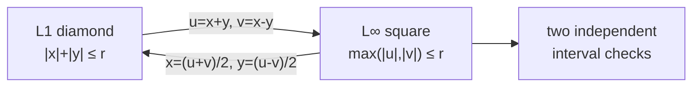
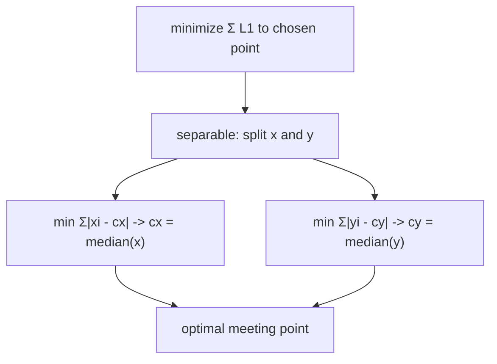

# Manhattan & Chebyshev Distances — Middle Level

> **One-line summary:** The 45° rotation `u = x + y, v = x - y` is an *isometry* between the L1 plane and the L∞ plane — it converts "diamond" reasoning into "axis-aligned square" reasoning. Because L∞ is separable per axis and L1 is separable per axis, both farthest-pair (`max distance`) and meeting-point (`min sum`) problems decompose into independent 1-D problems, giving `O(n)` and median solutions where the naive approach is `O(n²)`.

---

## Table of Contents

1. [Introduction](#introduction)
2. [Deeper Concepts](#deeper-concepts)
3. [The 45° Rotation Trick in Depth](#the-45-rotation-trick-in-depth)
4. [Comparison with Alternatives](#comparison-with-alternatives)
5. [Application: Max Manhattan Distance](#application-max-manhattan-distance)
6. [Application: Median Minimizes Sum of L1](#application-median-minimizes-sum-of-l1)
7. [Advanced Patterns](#advanced-patterns)
8. [Code Examples](#code-examples)
9. [Error Handling](#error-handling)
10. [Performance Analysis](#performance-analysis)
11. [Best Practices](#best-practices)
12. [Visual Animation](#visual-animation)
13. [Summary](#summary)

---

## Introduction

> Focus: "Why does the rotation work?" and "When do I reach for it?"

At the junior level you learned three formulas and the headline trick. Now we ask the deeper questions a working engineer needs:

- *Why* does `u = x + y, v = x - y` convert Manhattan into Chebyshev? (It is not magic — it is a clean algebraic identity, and seeing it once makes it permanent.)
- *When* is the rotation the right tool? (Whenever the diamond shape of L1 is getting in your way — farthest pair, all-pairs maxima, range queries under L1.)
- *Why* does the **median** minimize total Manhattan distance, and why does that fact split cleanly across axes?

The unifying theme is **separability**. L1 is a *sum* of per-axis terms; L∞ is a *max* of per-axis terms. Sums and maxes both decompose across coordinates. The rotation lets you move a problem from "sum-separable" (L1) into "max-separable" (L∞) form, and the max-separable form is often the one where the answer is a simple range `max − min`. Master separability and the rotation, and a whole class of geometry problems becomes routine.

---

## Deeper Concepts

### Invariant: a metric's separability shape

Write the per-axis differences as `a = |x1 - x2|` and `b = |y1 - y2|`. Then:

```
L1  = a + b          (sum-separable)
L∞  = max(a, b)      (max-separable)
L2  = sqrt(a² + b²)  (NOT separable — the sqrt couples the axes)
```

The reason L1 and L∞ admit `O(n)` tricks while L2 does not is exactly this: `sum` and `max` distribute over coordinates, but `sqrt(a² + b²)` does not. Any algorithm that "handles x and y independently" is secretly exploiting separability. This is why Euclidean farthest-pair needs rotating calipers (`O(n log n)`, sibling *06-rotating-calipers*) while Manhattan farthest-pair needs only an `O(n)` scan.

### The L1 ↔ L∞ duality

There is a pleasing symmetry. The rotation `u = x + y, v = x - y` maps **L1 to L∞**. The *same kind* of rotation maps **L∞ back to L1**. In 2D the two metrics are duals of each other under a 45° turn (with a `√2` scale). Concretely:

```
Manhattan(x,y)   ->  Chebyshev(x+y, x-y)
Chebyshev(x,y)   ->  Manhattan((x+y)/2, (x-y)/2)
```

So you can pick whichever side is easier for your problem and translate freely. (In 3-D and higher this clean duality **breaks** — there is no single rotation linking L1 and L∞ in `d ≥ 3`. That caveat matters; we revisit it in `senior.md`.)

### Why "diamond becomes square" is the geometric picture

An L1 ball `|x| + |y| ≤ r` is a diamond. After `u = x + y, v = x - y`, the constraint becomes `max(|u|, |v|) ≤ r` — an axis-aligned square of half-side `r`. The diamond's four *vertices* (which point along the axes) become the square's four *edge midpoints*, and the diamond's *edges* (the four slanted sides) become the square's *corners*. Rotating by 45° literally stands the diamond upright into a square. Once it is a square, "is this point within distance `r`?" becomes two independent interval checks `|u| ≤ r` and `|v| ≤ r` — trivially parallelizable and indexable.



### Recurrence/decomposition view

There is no recursion here, but there is a clean *decomposition*:

```text
max over pairs of L1(pi, pj)
  = max over pairs of L∞(rotate(pi), rotate(pj))         [rotation identity]
  = max over pairs of max(|ui - uj|, |vi - vj|)          [definition of L∞]
  = max( max over pairs |ui - uj|, max over pairs |vi - vj| )   [max splits]
  = max( range(u), range(v) )                            [1-D farthest = range]
```

Each `=` is a justified step. The final line is computable in one linear pass — that is the whole algorithm.

---

## The 45° Rotation Trick in Depth

Let us prove the identity at a level appropriate for middle (the fully formal `√2` orthogonal-matrix treatment is in `professional.md`).

**Claim:** `|x1 - x2| + |y1 - y2| = max(|u1 - u2|, |v1 - v2|)` where `u = x + y, v = x - y`.

Let `dx = x1 - x2`, `dy = y1 - y2`. Then:

```
du = u1 - u2 = (x1 + y1) - (x2 + y2) = dx + dy
dv = v1 - v2 = (x1 - y1) - (x2 - y2) = dx - dy
```

Now compute the right-hand side:

```
max(|du|, |dv|) = max(|dx + dy|, |dx - dy|)
```

**Key fact:** for any two reals `a, b`, `max(|a + b|, |a - b|) = |a| + |b|`.

Why? Consider the signs. If `a` and `b` have the **same sign**, then `|a + b| = |a| + |b|` (it is the bigger of the two), so the max is `|a| + |b|`. If they have **opposite signs**, then `|a - b| = |a| + |b|` is the bigger one, so again the max is `|a| + |b|`. Either way `max(|a+b|, |a-b|) = |a| + |b|`. Setting `a = dx, b = dy`:

```
max(|dx + dy|, |dx - dy|) = |dx| + |dy| = L1.   ∎
```

That four-line argument is the entire heart of this topic. Internalize the lemma `max(|a+b|, |a-b|) = |a| + |b|` and the trick is yours forever.

### The √2 scaling caveat

The map `(x, y) → (x + y, x - y)` is a rotation by 45° **combined with a scaling by √2** (the rows `(1,1)` and `(1,-1)` have length `√2`, not 1). So:

- L1 in `(x,y)` equals L∞ in `(u,v)` **exactly** (no scale — the identity above is exact).
- But Euclidean *lengths* in `(u,v)` are `√2` times those in `(x,y)`.

If you only care about the L1↔L∞ relationship (which is the usual case), ignore the `√2`. If you mix in Euclidean reasoning, remember it. To get a *pure* rotation (no scaling), divide by `√2`: `u = (x+y)/√2, v = (x-y)/√2` — but then you lose integer coordinates, so most competitive code keeps the unscaled integer version.

---

## Comparison with Alternatives

| Attribute | L1 / Manhattan | L2 / Euclidean | L∞ / Chebyshev |
|-----------|----------------|----------------|----------------|
| Formula (2D) | `|dx| + |dy|` | `√(dx²+dy²)` | `max(|dx|,|dy|)` |
| Unit ball | diamond | circle | square |
| Separable? | yes (sum) | no | yes (max) |
| Integer-exact? | yes | no (sqrt) | yes |
| Farthest pair | **O(n)** via rotation | O(n log n) rotating calipers | **O(n)** (range per axis) |
| Closest pair | O(n log n) sweep | O(n log n) | O(n log n) |
| Min-sum point | per-axis **median** | geometric median (no closed form) | (max-based, less common) |
| Rotation-invariant? | no | yes | no |
| Typical use | grids, VLSI, robust stats | physics, geometry | chess AI, image morphology |

**Choose L1 when:** movement is grid-constrained, you want robustness to outliers, or wire-length matters.
**Choose L∞ when:** diagonal moves are free (king), or you check "within k in every dimension."
**Choose the rotation when:** an L1 problem has the diamond shape blocking a clean separable solution — convert to L∞ and the axes decouple.

---

## Application: Max Manhattan Distance

**Problem:** given `n` points, find `max over i,j of |xi - xj| + |yi - yj|`.

Naive is `O(n²)`. The rotation gives `O(n)`:

```
1. For each point, compute u = x + y and v = x - y.
2. Track minU, maxU, minV, maxV in one pass.
3. answer = max(maxU - minU, maxV - minV).
```

**Why it works:** by the rotation identity the answer equals `max over pairs of max(|du|, |dv|)`. Because `max` distributes, this splits into `max(max |du|, max |dv|)`. On a single axis the largest absolute difference is just `max − min` (range). Done.

This generalizes to **k dimensions**: there are `2^(k-1)` sign patterns `±x ± y ± z …` (fix the first sign to `+`). For each pattern compute the signed sum, track its range, and the answer is the max range over all `2^(k-1)` patterns. In 2D that is `2^1 = 2` patterns: `x + y` and `x − y` — exactly `u` and `v`.

---

## Application: Median Minimizes Sum of L1

**Problem (1-D):** choose `c` to minimize `f(c) = Σ |xi - c|`.

**Claim:** any **median** of the `xi` minimizes `f`.

**Argument (the slope view):** `f` is piecewise-linear in `c`. Its derivative at a non-data point is `(# points below c) − (# points above c)`. When `c` is below the median, more points are above, so the slope is negative — moving right decreases `f`. When `c` is above the median, the slope is positive — moving left decreases `f`. The minimum is where the slope crosses zero: where equally many points lie on each side, i.e. the median. For even `n`, the slope is `0` across the whole interval between the two middle points — every point there is optimal.

**Why it splits across axes:** Manhattan distance is separable:

```
Σ (|xi - cx| + |yi - cy|) = Σ|xi - cx| + Σ|yi - cy|
```

The two sums share no variable, so you minimize each independently: `cx` = median of x's, `cy` = median of y's. This is why a single facility minimizing total taxi-travel sits at the *coordinate-wise median*, not the centroid. (The centroid minimizes the sum of **squared** L2 distances — a different objective.)

> Contrast: the point minimizing total **Euclidean** distance is the *geometric median*, which has **no closed form** and needs iterative methods (Weiszfeld's algorithm). L1's separability is what gives it a clean median answer — a real practical advantage of the metric.



---

## Advanced Patterns

### Pattern: Max Manhattan distance to a query point

After rotating to `(u, v)`, the farthest point from a query under L1 is the one maximizing `max(|qu - ui|, |qv - vi|)`. Precompute the bounding box `[minU, maxU] × [minV, maxV]`; the farthest is determined by which corner is farther, giving `O(1)` queries after `O(n)` preprocessing.

### Pattern: Chebyshev ↔ Manhattan for movement counting

In a game where a unit moves like a king (8 directions, diagonals free), the number of moves to a target is the **Chebyshev** distance. If you instead rotate the board 45°, king moves become rook-on-a-grid (Manhattan) moves — sometimes simplifying region/flood-fill logic.

### Pattern: Manhattan distance with obstacles

The rotation only helps with *raw* metric distances. The moment obstacles appear, you are doing **grid pathfinding** (BFS/Dijkstra/A*), and Manhattan distance becomes an admissible **heuristic** rather than the true cost. (See sibling *10-a-star*; senior level covers this.)

### Pattern: Lexicographic tie-break on L1

L1 distances tie often (the diamond has flat sides). When you need a unique nearest neighbor, break ties by a secondary key (e.g. smaller Euclidean distance, or lexicographic coordinate order). Decide the tie-break explicitly.

### Pattern: Closest pair under L1 via the rotation

Closest pair is harder than farthest pair — you cannot read it off a single range. But the rotation still helps: under L∞, "closest pair" becomes a problem on axis-aligned squares, amenable to a plane sweep with a balanced BST keyed on `v`, ordered by `u`. You sweep in `u`-order and, for each point, only compare against points whose `v` lies within the current best distance — the classic sweep-line strategy (sibling *05-sweep-line*). The rotation is what makes the "within distance" region a clean axis-aligned band instead of a diagonal strip. Complexity stays `O(n log n)`.

### Pattern: Range "within Manhattan radius r" as a rotated box

"Which points are within Manhattan distance `r` of a query `q`?" is a *diamond* range query in `(x, y)` — annoying for most index structures, which prefer axis-aligned rectangles. Rotate everything to `(u, v)`; the diamond becomes the **axis-aligned square** `[qu−r, qu+r] × [qv−r, qv+r]`. Now a standard 2-D range tree, k-d tree, or BIT-on-sorted-coordinates answers it directly. This is the single most common production use of the rotation: it makes L1 radius queries indexable.

```text
diamond query   |x−qx| + |y−qy| ≤ r        (hard to index)
   rotate u=x+y, v=x−y
square  query   |u−qu| ≤ r  AND  |v−qv| ≤ r  (two interval tests — easy)
```

### Pattern: Manhattan distance is the L∞ of "diagonal coordinates"

A mental reframing that pays off: think of every point as carrying two *diagonal* coordinates `u = x+y` (its "/" diagonal index) and `v = x−y` (its "\" diagonal index). Then Manhattan distance is simply "how many diagonals apart are they, in the worse of the two diagonal directions" — i.e. `max(|Δu|, |Δv|)`. Many grid problems (counting diagonals, bishop moves on a chessboard, anti-diagonal sums) become trivial once you index cells by `(u, v)` instead of `(x, y)`. Bishop moves, in fact, are *rook moves* in `(u, v)` space — the same rotation idea applied to a different piece.

---

## Code Examples

### Max Manhattan distance — the rotation in three languages

#### Go

```go
package main

import "fmt"

// maxManhattan returns the largest |xi-xj| + |yi-yj| over all pairs, in O(n).
func maxManhattan(pts [][2]int) int {
	if len(pts) < 2 {
		return 0
	}
	const NEG = int(-1e18)
	const POS = int(1e18)
	minU, maxU := POS, NEG
	minV, maxV := POS, NEG
	for _, p := range pts {
		u := p[0] + p[1] // x + y
		v := p[0] - p[1] // x - y
		if u < minU {
			minU = u
		}
		if u > maxU {
			maxU = u
		}
		if v < minV {
			minV = v
		}
		if v > maxV {
			maxV = v
		}
	}
	ru := maxU - minU
	rv := maxV - minV
	if ru > rv {
		return ru
	}
	return rv
}

func main() {
	pts := [][2]int{{1, 1}, {4, 5}, {6, 2}, {2, 8}}
	fmt.Println(maxManhattan(pts)) // 10
}
```

#### Java

```java
public class MaxManhattan {
    // O(n): rotate to (u, v) = (x+y, x-y), answer is the larger axis range.
    static long maxManhattan(int[][] pts) {
        if (pts.length < 2) return 0;
        long minU = Long.MAX_VALUE, maxU = Long.MIN_VALUE;
        long minV = Long.MAX_VALUE, maxV = Long.MIN_VALUE;
        for (int[] p : pts) {
            long u = (long) p[0] + p[1];
            long v = (long) p[0] - p[1];
            minU = Math.min(minU, u); maxU = Math.max(maxU, u);
            minV = Math.min(minV, v); maxV = Math.max(maxV, v);
        }
        return Math.max(maxU - minU, maxV - minV);
    }

    public static void main(String[] args) {
        int[][] pts = {{1, 1}, {4, 5}, {6, 2}, {2, 8}};
        System.out.println(maxManhattan(pts)); // 10
    }
}
```

#### Python

```python
def max_manhattan(points):
    """Largest |dx|+|dy| over all pairs, in O(n) via the 45-degree rotation."""
    if len(points) < 2:
        return 0
    us = [x + y for x, y in points]
    vs = [x - y for x, y in points]
    return max(max(us) - min(us), max(vs) - min(vs))


if __name__ == "__main__":
    pts = [(1, 1), (4, 5), (6, 2), (2, 8)]
    print(max_manhattan(pts))  # 10
```

**What it does:** finds the farthest pair under Manhattan distance in linear time. The naive `O(n²)` double loop gives the same `10` but does not scale.

### Best meeting point (minimize total L1) — median per axis

#### Go

```go
package main

import (
	"fmt"
	"sort"
)

func absInt(x int) int {
	if x < 0 {
		return -x
	}
	return x
}

// minTotalManhattan returns the minimum total L1 distance from one chosen point.
func minTotalManhattan(pts [][2]int) int {
	n := len(pts)
	xs := make([]int, n)
	ys := make([]int, n)
	for i, p := range pts {
		xs[i] = p[0]
		ys[i] = p[1]
	}
	sort.Ints(xs)
	sort.Ints(ys)
	mx := xs[n/2] // median x
	my := ys[n/2] // median y
	total := 0
	for _, p := range pts {
		total += absInt(p[0]-mx) + absInt(p[1]-my)
	}
	return total
}

func main() {
	pts := [][2]int{{0, 0}, {0, 1}, {1, 0}, {1, 2}, {2, 2}}
	fmt.Println(minTotalManhattan(pts)) // 6
}
```

#### Java

```java
import java.util.Arrays;

public class MinTotalManhattan {
    static int minTotalManhattan(int[][] pts) {
        int n = pts.length;
        int[] xs = new int[n], ys = new int[n];
        for (int i = 0; i < n; i++) { xs[i] = pts[i][0]; ys[i] = pts[i][1]; }
        Arrays.sort(xs);
        Arrays.sort(ys);
        int mx = xs[n / 2], my = ys[n / 2];     // per-axis medians
        int total = 0;
        for (int[] p : pts)
            total += Math.abs(p[0] - mx) + Math.abs(p[1] - my);
        return total;
    }

    public static void main(String[] args) {
        int[][] pts = {{0, 0}, {0, 1}, {1, 0}, {1, 2}, {2, 2}};
        System.out.println(minTotalManhattan(pts)); // 6
    }
}
```

#### Python

```python
def min_total_manhattan(points):
    """Minimum total L1 distance from a single chosen point (per-axis median)."""
    xs = sorted(p[0] for p in points)
    ys = sorted(p[1] for p in points)
    mx, my = xs[len(xs) // 2], ys[len(ys) // 2]
    return sum(abs(x - mx) + abs(y - my) for x, y in points)


if __name__ == "__main__":
    pts = [(0, 0), (0, 1), (1, 0), (1, 2), (2, 2)]
    print(min_total_manhattan(pts))  # 6
```

**What it does:** places one facility to minimize total taxi-travel from all points. The median per axis is provably optimal (slope argument above). Using `sort` is `O(n log n)`; quickselect makes it `O(n)`.

---

## Error Handling

| Scenario | What goes wrong | Correct approach |
|----------|----------------|-----------------|
| Overflow in `x + y` | Coordinates near 32-bit max | Use 64-bit for `u, v` (`long`, `int64`). |
| Used mean instead of median | Minimizes squared L2, not L1 | For L1 always use the **median**. |
| Applied rotation but forgot `max` splits | Wrong farthest pair | After rotating, take `max(range(u), range(v))`, not their sum. |
| Mixed Euclidean length with rotated coords | Off by `√2` | Keep L1↔L∞ exact; only Euclidean lengths scale by `√2`. |
| `unrotate` on a non-lattice point | Non-integer `(x,y)` | `(u+v)` and `(u-v)` must be even; they are when source was integer. |
| Tie in nearest neighbor | Non-deterministic result | Add an explicit secondary tie-break key. |

---

## Performance Analysis

| Task | Naive | With the trick |
|------|-------|----------------|
| Max Manhattan distance (n points) | O(n²) pairs | **O(n)** rotate + range |
| Max Manhattan distance to a query | O(n) per query | O(1) after O(n) box |
| Min total L1 (meeting point) | O(n²) trying each point | **O(n)** median via quickselect |
| All-pairs max in k-D | O(k·n²) | O(2^k · n) |

#### Python micro-benchmark sketch

```python
import random, time

def naive_max(points):
    best = 0
    for i in range(len(points)):
        for j in range(i + 1, len(points)):
            d = abs(points[i][0]-points[j][0]) + abs(points[i][1]-points[j][1])
            best = max(best, d)
    return best

def fast_max(points):
    us = [x + y for x, y in points]
    vs = [x - y for x, y in points]
    return max(max(us) - min(us), max(vs) - min(vs))

pts = [(random.randint(0, 10**6), random.randint(0, 10**6)) for _ in range(4000)]
t = time.time(); naive_max(pts); print("naive:", time.time() - t)
t = time.time(); fast_max(pts);  print("fast: ", time.time() - t)
# naive grows ~quadratically; fast stays flat.
```

At `n = 4000`, the naive loop does ~8M iterations; the fast version does ~4000. The gap widens to thousands-fold at `n = 10^5`.

---

## Best Practices

- **Reach for the rotation** the instant you see "maximize Manhattan distance" or "diamond-shaped" constraints.
- **Use medians, not means,** for L1 facility placement; document why.
- **Keep integer arithmetic**: both metrics and the rotation preserve integers (use 64-bit for the rotated sum).
- **Name the rotated frame** `(u, v)` and comment `u = x+y, v = x-y` so reviewers track the change of coordinates.
- **Generalize carefully**: the 2D L1↔L∞ duality does *not* extend cleanly to 3D+ — the `2^(k-1)` sign-pattern method does, but the single-rotation picture does not.
- **Add a unit test** asserting `L1(p,q) == L∞(rotate(p), rotate(q))` on random pairs.

---

## When the Rotation Helps and When It Does Not

A decision checklist, because reaching for the rotation reflexively can waste effort:

| Situation | Use the rotation? | Why |
|-----------|-------------------|-----|
| Max Manhattan distance / L1 diameter | **Yes** | Diamond → square; answer is a per-axis range. |
| "Within Manhattan radius r" range queries | **Yes** | Diamond → axis-aligned box, indexable. |
| Manhattan MST | **Yes** | Nearest-per-octant via sorted `x+y` + range-min on `x−y`. |
| Sum of L1 distances / median placement | **No** | L1 is already sum-separable in `(x, y)`; rotating adds no value. |
| Single pairwise L1 distance | **No** | Just compute `|dx| + |dy|`; rotation is pointless overhead. |
| L1 shortest path *with obstacles* | **No** | That is grid BFS/Dijkstra/A*; the metric is only a heuristic. |
| 3-D or higher max-L1 | **No (not as one rotation)** | Use `2^{k−1}` sign patterns instead. |

The rule of thumb: rotate when the **diamond geometry itself** is the obstacle (diameter, radius queries, nearest-neighbor cones). Do not rotate when the problem is already separable in the original axes (sum/median) or when the metric is just a cost label inside a graph search.

## A Subtle Point: Parity of Rotated Coordinates

After `u = x + y, v = x − y`, the rotated points live on the **even sublattice**: `u + v = 2x` and `u − v = 2y` are always even, so `(u, v)` always has `u ≡ v (mod 2)`. Two consequences matter in practice:

- **Inverting is exact**: `x = (u+v)/2` and `y = (u−v)/2` are integers — never a fractional surprise — *provided* the rotated point genuinely came from integer `(x, y)`.
- **Half the lattice is unused**: the rotated points cannot land on cells where `u + v` is odd. If you build a grid/array indexed by `(u, v)` you will leave a checkerboard of empty cells; compress coordinates (rank them) rather than allocating the full `(u, v)` range, or you waste half the memory.

This parity is the discrete shadow of the `√2` scaling: the rotation stretches the lattice, so the image is a coarser (rotated) lattice covering only every other cell.

## Worked Comparison: median vs mean vs rotation on one dataset

Take `pts = [(0,0), (10,0), (0,10), (10,10), (3,4)]`.

```
Centroid (mean):  ( (0+10+0+10+3)/5 , (0+0+10+10+4)/5 ) = (4.6, 4.8)
                  minimizes Σ L2²  — NOT our objective.

Median per axis:  median of x = sorted[0,0,3,10,10][2] = 3
                  median of y = sorted[0,0,4,10,10][2] = 4
                  meeting point (3, 4)  — minimizes Σ L1.  ✓

Max Manhattan via rotation:
  u = x+y: 0, 10, 10, 20, 7   → range 20−0 = 20
  v = x−y: 0, 10, −10, 0, −1  → range 10−(−10) = 20
  answer = max(20, 20) = 20  (corners (0,0)–(10,10) OR (10,0)–(0,10))
```

Notice all three "centers" differ, and the median `(3,4)` happens to coincide with a data point — common but not required. The takeaway: **state your objective**, then pick mean (L2²), geometric median (L2), or coordinate median (L1) accordingly.

## Visual Animation

> See [`animation.html`](./animation.html) for interactive visualization.
>
> Middle-level highlights:
> - Side-by-side L1 diamond and L∞ square unit balls
> - Live morph of the 45° rotation turning a diamond into a square
> - A max-Manhattan-distance example solved via the rotation, with the winning axis range highlighted
> - Per-axis range readouts (`range(u)`, `range(v)`) and the chosen maximum

---

## Summary

The middle level is about *why* and *when*. The rotation `u = x + y, v = x - y` works because of one lemma — `max(|a+b|, |a-b|) = |a| + |b|` — which turns the L∞ of rotated coordinates into the L1 of originals. Geometrically it stands a diamond up into a square; algorithmically it converts a sum-separable metric into a max-separable one whose farthest pair is just a per-axis range, collapsing `O(n²)` to `O(n)`. Separability also explains why the **median** (not the mean) minimizes total Manhattan distance, splitting cleanly across axes — a closed-form facility-location answer that Euclidean distance cannot offer. Keep the `√2` scaling caveat in mind, and remember the duality is a 2-D gift that does not survive intact into higher dimensions.

---

**Next step:** continue to [`senior.md`](./senior.md) for grid-pathfinding heuristics, VLSI and facility-location at scale, and the Manhattan-MST 8-octant sweep.
