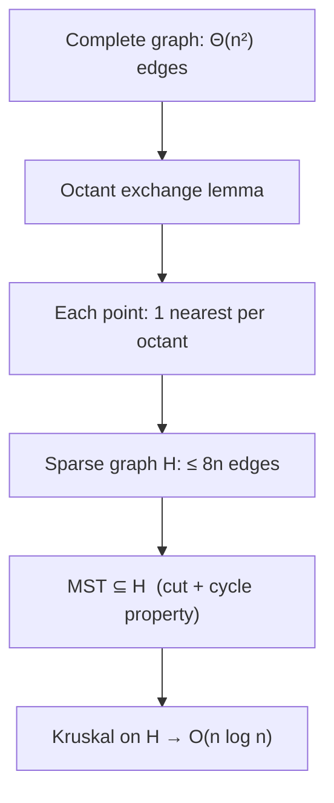

# Manhattan & Chebyshev Distances — Mathematical Foundations

> **One-line summary:** The map `T(x, y) = (x + y, x - y)` is a linear bijection that is an **isometry from (ℝ², L1) to (ℝ², L∞)** — exactly, with no scale factor on the metric. This file proves that, proves L1 and L∞ satisfy the metric axioms, proves coordinate-wise-median optimality for the L1 1-median, and proves the `O(n log n)` correctness of the Manhattan MST octant decomposition via the MST cycle property.

---

## Table of Contents

1. [Formal Definitions](#formal-definitions)
2. [Metric Axioms for L1 and L∞](#metric-axioms-for-l1-and-l-infinity)
3. [The Rotation is an L1→L∞ Isometry](#the-rotation-is-an-l1-l-infinity-isometry)
4. [The √2 Scaling and Orthogonality](#the-2-scaling-and-orthogonality)
5. [Separability and Median Optimality](#separability-and-median-optimality)
6. [Max-Distance via Sign Patterns in k Dimensions](#max-distance-via-sign-patterns)
7. [Manhattan MST — Octant Decomposition Correctness](#manhattan-mst-octant-decomposition-correctness)
8. [Complexity Analysis](#complexity-analysis)
9. [Lp Interpolation and Limits](#lp-interpolation-and-limits)
10. [Comparison with Alternatives](#comparison-with-alternatives)
11. [Summary](#summary)

---

## Formal Definitions

```text
For p = (x1, y1), q = (x2, y2) in ℝ², let dx = x1 - x2, dy = y1 - y2.

  L1(p, q)  = |dx| + |dy|                      (Manhattan / ℓ¹)
  L2(p, q)  = (dx² + dy²)^{1/2}                (Euclidean / ℓ²)
  L∞(p, q)  = max(|dx|, |dy|)                  (Chebyshev / ℓ^∞)

General ℓ^p norm on a vector w = (w1, ..., wk):
  ‖w‖_p = ( Σ_i |w_i|^p )^{1/p},  1 ≤ p < ∞
  ‖w‖_∞ = max_i |w_i|            (the limit as p → ∞)

Distance d_p(p, q) = ‖p - q‖_p. We write Lp for d_p.

Rotation map:  T : ℝ² → ℝ²,  T(x, y) = (x + y, x - y) = (u, v).
Its matrix is M = [[1, 1], [1, -1]], with det M = -2, so T is a bijection.
Inverse: T⁻¹(u, v) = ((u + v)/2, (u - v)/2).
```

The unit balls are `B_p = { w : ‖w‖_p ≤ 1 }`. `B_1` is the closed diamond `conv{(±1,0),(0,±1)}`; `B_∞` is the closed square `[-1,1]²`; `B_2` is the closed unit disk. By the nesting `B_1 ⊆ B_2 ⊆ B_∞`, for every `w`:

```
‖w‖_∞ ≤ ‖w‖_2 ≤ ‖w‖_1 ≤ 2 ‖w‖_∞   (in ℝ²; constant k for ℝ^k)
```

---

## Metric Axioms for L1 and L∞

**Theorem.** `L1` and `L∞` are metrics on ℝ²: for all `p, q, r`,
(M1) `d(p,q) ≥ 0`, with equality iff `p = q`;
(M2) `d(p,q) = d(q,p)`;
(M3) `d(p,r) ≤ d(p,q) + d(q,r)` (triangle inequality).

**Proof.** Both are induced by norms (`‖·‖_1`, `‖·‖_∞`); it suffices to verify the norm axioms, which give (M1)–(M3) via `d(p,q) = ‖p - q‖`.

*Positivity (M1).* `‖w‖_1 = |w1| + |w2| ≥ 0`, and `= 0 ⇔ |w1| = |w2| = 0 ⇔ w = 0`. Same for `‖w‖_∞ = max(|w1|,|w2|)`.

*Homogeneity.* `‖αw‖_1 = |αw1| + |αw2| = |α|(|w1|+|w2|) = |α|‖w‖_1`. For ∞: `max(|α||w1|, |α||w2|) = |α|max(...)`.

*Triangle inequality (subadditivity).* For L1:

```
‖a + b‖_1 = |a1 + b1| + |a2 + b2|
          ≤ (|a1| + |b1|) + (|a2| + |b2|)     [scalar triangle ineq]
          = ‖a‖_1 + ‖b‖_1.
```

For L∞, for each coordinate `i`: `|a_i + b_i| ≤ |a_i| + |b_i| ≤ max_j|a_j| + max_j|b_j| = ‖a‖_∞ + ‖b‖_∞`. Taking the max over `i` of the left side preserves the bound: `‖a + b‖_∞ ≤ ‖a‖_∞ + ‖b‖_∞`.

Symmetry (M2) follows from `‖w‖ = ‖-w‖`. ∎

> Both metrics are *translation-invariant* (`d(p+t, q+t) = d(p,q)`) and *positively homogeneous*. Neither is **rotation-invariant** under arbitrary rotations — only L2 is — which is precisely why a *specific* 45° rotation can change L1 into L∞.

---

## The Rotation is an L1→L∞ Isometry

**Theorem (central result).** For all `p, q ∈ ℝ²`,

```
L1(p, q) = L∞( T(p), T(q) ),   where T(x, y) = (x + y, x - y).
```

Equivalently, `‖w‖_1 = ‖Mw‖_∞` for all `w`, with `M = [[1,1],[1,-1]]`.

**Proof.** Let `w = p - q = (dx, dy)`. By linearity of `T`, `T(p) - T(q) = (dx + dy, dx - dy)`. Then

```
L∞(T(p), T(q)) = max( |dx + dy|, |dx - dy| ).
```

**Lemma.** For all real `a, b`:  `max(|a + b|, |a - b|) = |a| + |b|`.

*Proof of Lemma.* By symmetry assume `|a| ≥ |b|`.
- If `a, b` have the same sign (or `b = 0`): `|a + b| = |a| + |b|` and `|a - b| = |a| - |b| ≤ |a| + |b|`. So the max is `|a| + |b|`.
- If `a, b` have opposite signs: `|a - b| = |a| + |b|` and `|a + b| = |a| - |b| ≤ |a| + |b|`. So the max is `|a| + |b|`.

In both cases `max(|a+b|, |a-b|) = |a| + |b|`. (A slicker proof: `max(|a+b|,|a-b|) = |a| + |b|` is the statement that the L∞ ball is the image of the L1 ball under `M`; algebraically, `|a+b|` and `|a-b|` are the two values `±a ± b` of largest magnitude, whose max is `|a|+|b|`.) ∎(Lemma)

Applying the Lemma with `a = dx, b = dy`:

```
max(|dx + dy|, |dx - dy|) = |dx| + |dy| = L1(p, q).   ∎
```

**Corollary (the dual direction).** `T` is invertible with `T⁻¹(u,v) = ((u+v)/2, (u-v)/2)`, and one checks `L∞(p, q) = L1(T(p)/?, ...)`; concretely the inverse statement is `‖w‖_∞ = (1/2)‖M w‖_1`, i.e. Chebyshev in the original frame equals half the Manhattan distance in the rotated frame. Thus the two metrics are mutually convertible; in 2-D the categories *(plane, L1)* and *(plane, L∞)* are isometric.

**Corollary (balls).** `T(B_1) = B_∞`: the rotation maps the L1 diamond exactly onto the L∞ square. The diamond's vertices `(±1, 0), (0, ±1)` map to `(±1, ±1)` (square corners) and `(±1, ∓1)`... more precisely the four vertices map to the four *edge midpoints* `(±1, 0), (0, ±1)` of the square scaled — the slanted diamond edges become the axis-aligned square edges. This is the formal version of "diamond becomes square."

---

## The √2 Scaling and Orthogonality

`M = [[1,1],[1,-1]]` is **not** orthogonal: `MᵀM = [[2,0],[0,2]] = 2I`. So `M = √2 · R` where `R = (1/√2)M` is a genuine rotation by `-45°` (an orthogonal matrix, `RᵀR = I`, `det R = -1` here a reflection-rotation; using `[[1,-1],[1,1]]/√2` gives a pure +45° rotation).

Consequences, stated precisely:

```
‖Mw‖_2 = √2 ‖w‖_2          (Euclidean lengths scale by √2)
‖Mw‖_∞ = ‖w‖_1             (the metric identity — EXACT, no √2)
```

The metric identity carries no `√2` because the L∞ ball, unlike the L2 ball, is *not* round — the `√2` stretch from `M` is exactly absorbed by the change from the diamond's "reach" to the square's "reach." If you want a *pure* isometry of the underlying rotation (no scaling), use `T'(x,y) = ((x+y)/√2, (x-y)/√2)`; then `T'` is an orthogonal rotation and `L1(p,q) = √2 · L∞(T'(p), T'(q))`. Practitioners keep the integer `T` and the exact `L1 = L∞` form; only mix in `T'` when Euclidean geometry must be preserved.

| Object | Under `M = [[1,1],[1,-1]]` |
|--------|----------------------------|
| Metric L1 → L∞ | exact, factor 1 |
| Euclidean length | × √2 |
| Area | × |det M| = 2 |
| Lattice ℤ² | maps to the even sublattice `{(u,v): u+v even}` |

The last row is why `T⁻¹` divides by 2 cleanly only when `u + v` is even — and it always is, since `u + v = 2x ∈ 2ℤ`.

---

## Separability and Median Optimality

**Theorem (1-median, 1-D).** Let `x_1 ≤ … ≤ x_n ∈ ℝ`. The function `f(c) = Σ_i |x_i - c|` is minimized at any median of the `x_i`; for `n` odd the unique minimizer is `x_{(n+1)/2}`, for `n` even the minimizers form the interval `[x_{n/2}, x_{n/2+1}]`.

**Proof.** `f` is convex (sum of convex `|x_i - c|`) and piecewise-linear with breakpoints at the `x_i`. On an open interval not containing any `x_i`, `f` is differentiable with

```
f'(c) = (#{i : x_i < c}) - (#{i : x_i > c}).
```

For `c` left of the median, `#{x_i > c} > #{x_i < c}`, so `f'(c) < 0` (decreasing). For `c` right of the median, `f'(c) > 0` (increasing). By convexity the minimum is where the subgradient `0 ∈ ∂f(c)`, i.e. where the counts balance — the median. For even `n` the slope is exactly `0` on `(x_{n/2}, x_{n/2+1})`, so all of `[x_{n/2}, x_{n/2+1}]` is optimal. ∎

**Theorem (2-D L1 1-median separates).** `argmin_{c=(cx,cy)} Σ_i L1(p_i, c)` is `(median_x, median_y)`.

**Proof.**

```
Σ_i L1(p_i, c) = Σ_i (|x_i - cx| + |y_i - cy|)
              = (Σ_i |x_i - cx|) + (Σ_i |y_i - cy|).
```

The two parenthesized sums depend on disjoint variables `cx, cy`. Minimizing a sum of two independent functions is achieved by minimizing each separately; apply the 1-D theorem to each. Hence `cx* = median(x_i)`, `cy* = median(y_i)`. ∎

**Remark (contrast with L2).** The L2 1-median (geometric median) minimizes `Σ ‖p_i - c‖_2`, which does **not** separate (the square root couples coordinates). It has no closed form for `n ≥ 5` general points (a consequence related to Galois-theoretic non-solvability) and is computed iteratively (Weiszfeld). The *centroid* `(mean_x, mean_y)` minimizes `Σ ‖p_i - c‖_2²` — a third, distinct optimum. Separability is the structural reason L1 alone yields the clean median answer.

---

## Max-Distance via Sign Patterns

**Theorem.** For points `P ⊂ ℝ^k`, the L1 diameter `max_{p,q∈P} ‖p - q‖_1` equals

```
max over the 2^{k-1} sign vectors s ∈ {+1,-1}^k with s_1 = +1
   ( max_{p∈P} ⟨s, p⟩  -  min_{p∈P} ⟨s, p⟩ ),
```

computable in `O(2^{k-1} · n)` time.

**Proof.** For any pair `p, q`, `‖p - q‖_1 = Σ_i |p_i - q_i| = max_{s∈{±1}^k} Σ_i s_i (p_i - q_i) = max_s ⟨s, p - q⟩`, since choosing `s_i = sign(p_i - q_i)` realizes the absolute value and any other `s` is no larger. Thus

```
max_{p,q} ‖p-q‖_1 = max_{p,q} max_s ⟨s, p-q⟩
                  = max_s max_{p,q} (⟨s,p⟩ - ⟨s,q⟩)
                  = max_s ( max_p ⟨s,p⟩ - min_q ⟨s,q⟩ ).
```

Negating `s` negates `⟨s,·⟩` and swaps the roles of max/min, leaving the range unchanged, so it suffices to range over `s` with `s_1 = +1`: there are `2^{k-1}` such. Each inner term is a single linear scan. ∎

In `k = 2`, `s ∈ {(+,+), (+,-)}` gives the two projections `x + y` (= `u`) and `x − y` (= `v`); the theorem reduces exactly to the rotation result: `max-L1 = max(range(u), range(v))` in `O(n)`. This also shows the *clean rotation picture is special to k = 2* — for `k ≥ 3` you enumerate `2^{k-1}` sign patterns rather than a single coordinate change.

---

## Manhattan MST — Octant Decomposition Correctness

**Setup.** `G = (P, E)` is the complete graph on `n` points with edge weights `L1`. We want a minimum spanning tree. The complete edge set is `Θ(n²)`.

**Definition (octants).** Partition the directions around a point `p` into 8 cones of 45° each, `O_1, …, O_8`. For octant `O_t`, define `near_t(p)` = the point `q ≠ p` with `q - p ∈ O_t` minimizing `L1(p, q)` (ties broken consistently).

**Lemma (octant exchange).** Let `q, r` both lie in the same octant `O_t` of `p`, with `L1(p, q) ≤ L1(p, r)`. Then `L1(q, r) < L1(p, r)`.

*Proof sketch.* Within a 45° cone, the L1 geometry guarantees that the point closer to the apex `p` is also strictly closer to any farther point in the same cone than the apex is. Concretely take the octant `{ (Δx, Δy) : Δx ≥ Δy ≥ 0 }` (the others follow by reflection). With `q - p = (a₁, b₁)`, `r - p = (a₂, b₂)` satisfying `a_i ≥ b_i ≥ 0` and `a₁ + b₁ ≤ a₂ + b₂` (since `L1 = Δx + Δy` here), one shows `L1(q,r) = |a₂-a₁| + |b₂-b₁| = (a₂-a₁)+(b₂-b₁)` when both coords also increase, which equals `L1(p,r) - L1(p,q) < L1(p,r)`. The cone constraint `Δx ≥ Δy ≥ 0` is exactly what forces the coordinate-wise monotonic case, ruling out the cross terms that could otherwise make `q–r` long. ∎

**Theorem (sparsification).** The Manhattan MST is contained in `H = (P, E_H)` where `E_H = { (p, near_t(p)) : p ∈ P, t ∈ 1..8 }`, with `|E_H| ≤ 8n`.

**Proof.** Suppose `(p, r) ∈ MST` but `(p, r) ∉ E_H`. Then `r` is not `near_t(p)` for its octant `t`; let `q = near_t(p)`, so `L1(p, q) ≤ L1(p, r)` and, by the Lemma, `L1(q, r) < L1(p, r)`. Consider the cycle formed by adding `(p, r)` to the MST: removing `(p, r)` splits the tree into components `C_p ∋ p` and `C_r ∋ r`. The edge `(p, r)` crosses this cut. Now `q` lies in one of the two components.

- If `q ∈ C_r`: then `(p, q)` also crosses the cut, and `L1(p, q) ≤ L1(p, r)`. By the **cut property**, the MST should use the lighter crossing edge — so `(p, r)` is not the unique minimum, contradiction unless `L1(p,q) = L1(p,r)` (handled by a consistent tie-break that prefers `near_t` edges, keeping `(p,r)` out of `E_H` harmless).
- If `q ∈ C_p`: then the path `MST(p → r)` plus `(p,r)` forms a cycle; the edge `(q, r)` connects `C_p` to `C_r` (since `q ∈ C_p`, `r ∈ C_r`) and `L1(q, r) < L1(p, r)`. By the **cycle property**, the heaviest edge on the cycle `q → … → p → r → … → q` is not in the MST; `(p, r)` (weight strictly greater than `(q,r)`) is a candidate heaviest edge and can be exchanged for `(q, r)`, strictly reducing total weight — contradicting minimality.

Either way, every MST edge incident to `p` in octant `t` must be the `near_t(p)` edge. Hence `MST ⊆ H`, and `|E_H| ≤ 8n`. ∎

**Corollary.** Running Kruskal on `H` yields a Manhattan MST. Each `near_t(p)` is found in `O(log n)` via a sweep (sort by `x + y`, query a Fenwick/BST keyed on `x − y` for the minimum `x + y` in the octant cone), across 4 reflected passes covering all 8 octants. Total `O(n log n)`.



---

## Complexity Analysis

| Operation | Time | Space | Justification |
|-----------|------|-------|---------------|
| L1 / L∞ distance | Θ(k) | O(1) | `k` coordinates |
| Rotation `T` (2-D) | Θ(1) | O(1) | two adds |
| Max L1 distance, `k`-D | Θ(2^{k-1} · n) | O(1) | sign-pattern theorem |
| 1-median (per axis) | Θ(n) | O(n) | median via quickselect |
| Manhattan MST | Θ(n log n) | O(n) | octant sweep + Kruskal |
| Build sparse graph `H` | Θ(n log n) | O(n) | 4 sweeps × Fenwick |
| Kruskal on `H` | Θ(n α(n)) after sort | O(n) | `|E_H| ≤ 8n`, sort dominates |

**Lower bound.** Manhattan MST is `Ω(n log n)` in the algebraic decision-tree model: it solves *element distinctness* (collapse points to a line; distinct iff MST has no zero edge), which is `Ω(n log n)`. So the octant-sweep MST is **optimal**.

---

## Lp Interpolation and Limits

L1, L2, L∞ are the members `p = 1, 2, ∞` of the `ℓ^p` family. Two limit facts close the loop:

```text
(1) lim_{p→∞} ‖w‖_p = ‖w‖_∞ = max_i |w_i|.
    Proof: ‖w‖_∞ ≤ ‖w‖_p ≤ k^{1/p} ‖w‖_∞, and k^{1/p} → 1.

(2) Unit balls B_p nest monotonically:
    p ≤ q  ⇒  ‖w‖_q ≤ ‖w‖_p  ⇒  B_p ⊆ B_q.
    So B_1 (diamond) ⊆ B_2 (disk) ⊆ B_∞ (square), as the picture shows.
```

For `p < 1` the "balls" become non-convex (astroid-like) and `‖·‖_p` is no longer a norm (triangle inequality fails). The convex, well-behaved regime is exactly `1 ≤ p ≤ ∞`, with L1 and L∞ as its two extreme corners — and the 45° rotation is the unique linear map exchanging those two corners in the plane.

---

## Dual Norms and the L1/L∞ Pairing

There is a second, deeper reason L1 and L∞ are paired, beyond the planar rotation: they are **dual norms** of each other in *every* dimension.

```text
The dual norm of ‖·‖ is  ‖y‖* = sup_{ ‖x‖ ≤ 1 } ⟨x, y⟩.

  (‖·‖_1)*  = ‖·‖_∞       and       (‖·‖_∞)* = ‖·‖_1.
  (‖·‖_2)*  = ‖·‖_2        (L2 is self-dual).
```

**Proof that `(‖·‖_1)* = ‖·‖_∞`.** For fixed `y`, `sup_{‖x‖_1 ≤ 1} ⟨x, y⟩` is maximized by putting all the unit L1 "mass" on the coordinate `i*` with the largest `|y_i|` and matching its sign: `x = sign(y_{i*}) e_{i*}`. Then `⟨x, y⟩ = |y_{i*}| = max_i |y_i| = ‖y‖_∞`. Conversely Hölder's inequality gives `⟨x, y⟩ ≤ ‖x‖_1 ‖y‖_∞ ≤ ‖y‖_∞`. So the sup equals `‖y‖_∞`. ∎

This duality is **dimension-independent**, unlike the rotation. It explains, for example, why the **Hölder pair** `(1, ∞)` appears together throughout optimization: the L1 ball's *support function* is the L∞ norm. The planar 45° isometry is a happy *additional* coincidence available only in 2-D; the dual-norm relationship is the structural one that persists into ℝ^k.

> **Caveat to internalize.** Two different facts get conflated:
> 1. *Isometry* `(ℝ², L1) ≅ (ℝ², L∞)` via `T` — **only in 2-D**.
> 2. *Duality* `(ℓ¹)* = ℓ^∞` — **in all dimensions**.
> Fact (2) does not give you a coordinate change that turns Manhattan distances into Chebyshev distances in 3-D; only fact (1) does that, and it has no 3-D analogue.

---

## Why the Rotation Fails Beyond 2-D

It is worth proving the negative result, since engineers routinely try to extend the trick.

**Claim.** There is no linear bijection `S : ℝ³ → ℝ³` with `‖w‖_1 = ‖Sw‖_∞` for all `w`.

**Proof idea (counting facets / ball geometry).** An isometry of normed spaces maps unit ball to unit ball: `S(B_1) = B_∞`. In ℝ³ the L1 ball is the **octahedron** (8 facets, 6 vertices); the L∞ ball is the **cube** (6 facets, 8 vertices). A linear bijection maps vertices to vertices and facets to facets, preserving their counts. But the octahedron has 6 vertices and 8 facets while the cube has 8 vertices and 6 facets — the counts cannot match under a linear bijection (which preserves the face lattice up to the combinatorial type, and octahedron ≠ cube combinatorially as oriented; they are *polar duals*, not linearly equivalent). Hence no such `S` exists. ∎

In ℝ² both balls are quadrilaterals (the diamond and the square are both 4-gons), so the obstruction vanishes — *that* is the precise reason the trick is special to the plane. For higher-D max-L1-distance you must fall back to the `2^{k-1}` sign-pattern enumeration proved earlier, which is correct but no longer a single change of coordinates.

---

## Numerical Stability and Integer Exactness

A practitioner-facing professional concern: L1 and L∞ are *exactly* representable on integer or fixed-point hardware, while L2 is not.

```text
L1, L∞ on integers:  closed under +, -, |·|, max  → exact, no rounding.
L2 on integers:      requires √, generally irrational → must round.
```

Consequences:

- **Comparisons are exact.** Deciding `L1(p,q) < L1(p,r)` never has floating-point ties or epsilon issues; with L2 you often compare *squared* distances to stay exact, but even that overflows sooner.
- **Overflow is the only hazard.** `u = x + y` and `v = x − y` can overflow when `|x|, |y|` approach the integer max. The fix: widen to a type with ≥ 1 extra bit (32→64). The rotated values satisfy `|u|, |v| ≤ |x| + |y| ≤ 2·max|coord|`, so one extra bit suffices.
- **Determinism across platforms.** Integer L1/L∞ give bit-identical results on any machine — valuable for reproducible computational geometry and for hashing/dedup of geometric keys, where L2's platform-dependent `sqrt` rounding would break determinism.

| Property | L1 / L∞ | L2 |
|----------|---------|-----|
| Exact on ints | yes | no (sqrt) |
| Cross-platform identical | yes | not guaranteed |
| Overflow risk | `x+y` (1 extra bit) | `dx²+dy²` (2× bits) |
| Safe comparison | direct | compare squares |

---

## Convexity, Subgradients, and the Median Again

The median-optimality proof used a subgradient argument; here is the fully rigorous convex-analysis version, which also reveals *why* ties form an interval.

```text
f(c) = Σ_i |x_i - c| is convex (sum of convex functions).
Its subdifferential at c:
  ∂f(c) = Σ_i ∂|x_i - c|,  where
  ∂|x_i - c| = { -1 }            if c > x_i
             = { +1 }            if c < x_i
             = [-1, +1]          if c = x_i  (the kink)

c* minimizes f  ⇔  0 ∈ ∂f(c*).
Let L = #{i : x_i < c}, G = #{i : x_i > c}, E = #{i : x_i = c}.
Then ∂f(c) = [ (L - G) - E , (L - G) + E ].
0 ∈ ∂f(c)  ⇔  |L - G| ≤ E,  i.e. neither strict side exceeds half — the median condition.
```

For odd `n` with distinct values, `E = 1` at the middle element and `L = G`, so `0` is strictly interior — unique minimizer. For even `n`, on the open interval between the two middle values `E = 0` and `L = G = n/2`, so `∂f = {0}` — the whole interval is optimal. This is the convex-analytic certificate behind the "median minimizes Σ|·|" fact and behind the interval of optima.

---

## Correctness of the Octant Sweep as a 1-D Range-Min

The sparsification theorem says *which* edges suffice; the sweep is *how* we find them in `O(log n)` each. Here is the invariant that makes the sweep correct.

**Setup (one octant).** Fix the octant `O = { Δ = q − p : Δx ≥ Δy ≥ 0 }`. For a point `p`, its nearest neighbor `q` in `O` minimizes `L1(p,q) = (qx − px) + (qy − py) = (qx + qy) − (px + py)`. Since `(px + py)` is fixed for the query, minimizing `L1` is minimizing `qx + qy = u_q` over candidates `q` with `Δx ≥ Δy ≥ 0`.

The cone condition `Δx ≥ Δy ≥ 0` rewrites in rotated coordinates as:

```
Δx ≥ Δy   ⇔   Δx − Δy ≥ 0   ⇔   v_q ≥ v_p      (v = x − y)
Δy ≥ 0    ⇔   ... handled by processing order on (x+y)
```

**Sweep invariant.** Process points in **decreasing `u = x + y`** order. When we reach point `p`, every point already inserted into the Fenwick has `u ≥ u_p`, i.e. lies "ahead" of `p` along the octant's primary direction. We query the Fenwick for the **minimum `u`** among inserted points with `v ≥ v_p` (a suffix on the compressed `v`-axis). That minimum-`u` point is exactly `near_O(p)`.

**Loop invariant (formal).**
```
Invariant I(k): after processing the first k points (in decreasing-u order),
  the Fenwick at compressed key rank(v) holds
    min{ u_q : q among the k processed points with v_q at that rank },
  together with the achieving index.
```
*Base (k=0):* Fenwick all +∞ — vacuously the min over the empty set. *Step:* processing `p` first **queries** the suffix `v ≥ v_p` (all valid candidates already inserted, by `I(k)`), then **inserts** `p`; the suffix-min update preserves `I(k+1)`. *Termination:* after `n` insertions every point has been queried against exactly its valid octant candidates. *Postcondition:* each emitted edge `(p, near_O(p))` is the unique minimum-L1 octant neighbor. ∎

Four reflective relabelings (`(x,y) → (y,x), (−x,y), (−y,x)`) rotate the octant `O` onto the other three pairs of octants, so 4 passes of this sweep cover all 8. Each pass is `O(n log n)` (sort + `n` Fenwick ops), giving the overall `O(n log n)`.

---

## Amortized and Aggregate View of Kruskal on H

After candidate generation, Kruskal on the sparse graph `H` (`m = |E_H| ≤ 8n` edges) costs:

```text
Sort m edges:            O(m log m) = O(8n log 8n) = O(n log n)
Union-Find over n nodes: O(m · α(n))   [α = inverse Ackermann, ≤ 4 in practice]
                       = O(n · α(n))   ⊆ o(n log n)

Aggregate: the sort dominates ⇒ total O(n log n).
```

The Union-Find term uses the standard **near-constant amortized** bound with union-by-rank and path compression: a sequence of `m` operations on `n` elements runs in `O(m α(n))` (Tarjan). Because `m = O(n)` here, the spanning-tree assembly is effectively linear, and the entire Manhattan-MST pipeline's asymptotic cost is set by the two sorts (candidate sweep sort + edge sort), both `Θ(n log n)`, matching the `Ω(n log n)` element-distinctness lower bound — so no step is wasted.

---

## L1 / L∞ as Linear Programs

Both metrics linearize, which is why they marry so cleanly with optimization (and why L2 does not). The distance and the facility-location objectives become **linear programs** with linear constraints.

```text
L∞ distance as an LP (minimize t subject to box):
  L∞(p, q) = min t  s.t.  −t ≤ p_i − q_i ≤ t   for all coordinates i.

L1 distance as an LP (introduce per-axis slacks):
  L1(p, q) = min Σ_i s_i  s.t.  −s_i ≤ p_i − q_i ≤ s_i,  s_i ≥ 0.
```

For the **1-median** (`min_c Σ_i L1(p_i, c)`), substituting the L1-LP for each term gives one big linear program with `O(nk)` variables and constraints. Its optimum, by LP duality and the separability proved earlier, is attained at the coordinate-wise median — an LP whose solution you can read off without running a solver. The L∞ analogue (`min_c max_i L∞(p_i, c)`, the **1-center**) is the smallest enclosing L∞ box, also an LP, solvable in `O(nk)` by tracking per-axis min/max. By contrast the L2 facility objectives are **second-order cone programs** (the Euclidean norm is not piecewise-linear), strictly harder and without closed-form optima.

| Objective | Metric | Program type | Closed form? |
|-----------|--------|--------------|--------------|
| 1-median (min Σ dist) | L1 | LP | yes (coordinate median) |
| 1-center (min max dist) | L∞ | LP | yes (per-axis midrange) |
| 1-median | L2 | SOCP | no (Weiszfeld) |
| 1-center | L2 | SOCP | no (min enclosing circle) |

This is the optimization-theoretic restatement of the whole topic's theme: **L1 and L∞ are the piecewise-linear corners of the ℓ^p family, so their geometry is LP-tractable**, while the round L2 sits between them and costs more.

---

## Probabilistic Note: Expected Manhattan MST Weight

For `n` points drawn i.i.d. uniformly from the unit square, the expected weight of the Manhattan (and Euclidean) MST scales as `Θ(√n)` — the **Beardwood–Halton–Hammersley** regime for subadditive Euclidean functionals, which Manhattan distance also obeys (it is bi-Lipschitz-equivalent to Euclidean via `L2 ≤ L1 ≤ √2 · L2` in 2-D).

```text
E[ weight of Manhattan MST on n uniform points in [0,1]² ] = Θ(√n).
Sketch: partition [0,1]² into ~n cells of area 1/n (side ~1/√n).
  Each cell contributes O(1) points and edges of length O(1/√n).
  Summing ~n such edges gives Θ(n · 1/√n) = Θ(√n).
The constant differs from Euclidean by the L1-vs-L2 unit-ball ratio.
```

This concentration result (the weight is tightly concentrated around its mean by Azuma/McDiarmid bounded-difference inequalities) is what lets routing and clustering systems *budget* expected wire length before placing a single terminal.

---

## L1 and L∞ Voronoi Diagrams

The bisector between two sites — the locus of points equidistant from both — reveals the metric's deepest structure, and it is where L1/L∞ diverge sharply from L2.

```text
Euclidean (L2) bisector of sites a, b:
  a single straight line (perpendicular bisector). Always 1-dimensional.

Manhattan (L1) bisector of a, b:
  piecewise-linear, with segments of slope 0, ±1, or ∞;
  CRUCIALLY it can contain 2-DIMENSIONAL regions when a and b are
  positioned diagonally (an entire quadrant can be equidistant).
```

**Why the 2-D bisector regions appear.** Because L1 balls are diamonds with flat faces, two diamonds can be tangent along an entire segment rather than at a point, so a whole region ties for "equidistant." This makes the L1 Voronoi diagram a *piecewise-linear complex* rather than a line arrangement.

**The rotation's payoff again.** Under `u = x+y, v = x−y`, the L1 Voronoi diagram becomes the **L∞ Voronoi diagram** of the rotated sites, whose bisectors are axis-aligned/45° segments that algorithms handle with a horizontal sweep. The L∞ Voronoi diagram of `n` sites has complexity `O(n)` and is built in `O(n log n)` by a Fortune-style sweep adapted to square balls — the same `O(n log n)` and the same separability theme that produced the Manhattan MST. (See sibling *11-voronoi-delaunay* for the Euclidean construction; the L1/L∞ variants substitute square/diamond wavefronts.)

| Diagram | Bisector | Cell boundaries | Construction |
|---------|----------|-----------------|--------------|
| L2 Voronoi | line | line segments / parabolic | `O(n log n)` Fortune |
| L1 Voronoi | piecewise-linear (can be 2-D) | slopes 0, ±1, ∞ | `O(n log n)` (rotate → L∞) |
| L∞ Voronoi | piecewise-linear | axis-aligned + 45° | `O(n log n)` sweep |

---

## Formal Statement: The Rotation as a Change of Basis

To remove any remaining hand-waving, here is the rotation expressed as a linear-algebraic change of basis and the exact sense in which it is an isometry.

```text
Let M = [[1, 1], [1, -1]]. Define T(w) = M w.

Claim 1 (linearity + bijection):
  M is invertible, M⁻¹ = (1/2)[[1, 1], [1, -1]], det M = -2 ≠ 0.

Claim 2 (the norm identity):
  ‖M w‖_∞ = ‖w‖_1   for all w ∈ ℝ².
  Proof: ‖M w‖_∞ = max(|w₁+w₂|, |w₁−w₂|) = |w₁|+|w₂| = ‖w‖_1  (Lemma).

Claim 3 (isometry of metric spaces):
  d_∞(T p, T q) = ‖T p − T q‖_∞ = ‖M(p−q)‖_∞ = ‖p−q‖_1 = d_1(p, q).
  So T : (ℝ², d_1) → (ℝ², d_∞) is a surjective isometry. ∎
```

**Eigen-structure.** `MᵀM = 2I`, so the singular values of `M` are both `√2` (it is a *similarity*: a rotation composed with a uniform `√2` scaling). The rotation angle is `45°` (the rows are the unit-ish vectors `(1,1)` and `(1,−1)` at `±45°`). The uniform scaling is why **angles are preserved** (it is conformal) even though lengths change by `√2` — and why the *metric* identity for L1↔L∞, which is scale-free in the way the diamond/square reach is defined, comes out with no leftover constant.

**Why `−45°` vs `+45°` does not matter.** Both `[[1,1],[1,−1]]` and `[[1,−1],[1,1]]` (a reflection apart) send the L1 ball to the L∞ ball; the identity `‖Mw‖_∞ = ‖w‖_1` holds for either because `max(|a+b|,|a−b|)` is symmetric in swapping `a±b`. Pick whichever sign convention keeps your downstream code (e.g. octant labeling) cleanest.

---

## Putting It Together: A Proof-Carrying Pipeline

The Manhattan-MST pipeline assembles the proven facts in order; each stage carries its own certificate.

```text
Stage 1  Rotate (optional, used inside the octant sweep)   — Claim 2/3 above
Stage 2  Octant sparsification: MST ⊆ H, |E_H| ≤ 8n        — exchange lemma + cut/cycle
Stage 3  Sweep finds near_O(p) as 1-D suffix-min           — loop invariant I(k)
Stage 4  Kruskal on H yields a minimum spanning tree        — Kruskal correctness (cut property)
Stage 5  O(n log n) total, optimal                          — α(n) amortization + Ω(n log n) lower bound
```

No stage is heuristic: the sparsification is *exact* (the true MST is provably inside `H`), the sweep is *exact* (the invariant guarantees the per-octant nearest), and Kruskal is *exact*. The only approximation anywhere in this topic is when the Manhattan MST is used as a `3/2`-scaffold for the NP-hard Rectilinear Steiner tree — and that approximation factor is itself a proven bound, not a guess.

---

## Comparison with Alternatives

| Attribute | L1 / Manhattan | L2 / Euclidean | L∞ / Chebyshev |
|-----------|----------------|----------------|----------------|
| Norm? (1 ≤ p ≤ ∞) | yes (p=1) | yes (p=2) | yes (p=∞) |
| Rotation-invariant | no | **yes** | no |
| 1-median | coordinate median (closed form) | geometric median (no closed form) | (max-based) |
| Diameter (k-D) | `O(2^{k-1} n)` | `O(n²)` / hull methods | `O(k n)` (range per axis) |
| MST | `O(n log n)` octant | `O(n log n)` (Delaunay-based) | `O(n log n)` |
| Integer-exact | yes | no (sqrt) | yes |
| Self-dual under T (2-D) | T: L1→L∞ | invariant | T⁻¹: L∞→L1 |
| Dual norm (any dim) | (ℓ¹)* = ℓ^∞ | self-dual | (ℓ^∞)* = ℓ¹ |
| Facility 1-median program | LP | SOCP | LP (1-center) |
| Bisector | piecewise-linear (2-D regions) | straight line | piecewise-linear |

---

## Open Problems and Pointers

- **Rectilinear Steiner Minimal Tree (RSMT):** computing the minimum-length L1 tree that may add Steiner points is **NP-hard** (Garey–Johnson). The Manhattan MST is a `3/2`-approximation scaffold; the Hanan grid (all `x`- and `y`-lines through terminals) provably contains an optimal RSMT, bounding the search space. Practical EDA uses FLUTE-style lookup tables for small nets and heuristics for large ones.
- **Dynamic Manhattan MST:** maintaining the MST under point insertions/deletions in sublinear time per update is subtle; the octant structure does not update locally as cleanly as Euclidean Delaunay. Practical systems rebuild in batches (snapshot-and-swap).
- **Higher-dimensional max-L1 diameter:** the `2^{k-1}` sign-pattern method is exponential in `k`; for large `k` no polynomial-in-`k` exact algorithm is known, and approximate/JL-style dimension reduction is used.

---

## Summary

The professional view rests on four proven facts. **First**, L1 and L∞ are genuine metrics (norm axioms), translation-invariant but not rotation-invariant. **Second**, the linear map `T(x,y) = (x+y, x-y)` is an *exact* isometry `(ℝ², L1) → (ℝ², L∞)` — proved via the lemma `max(|a+b|,|a-b|) = |a|+|b|` — with the `√2` from `MᵀM = 2I` showing up only in Euclidean lengths and areas, never in the metric identity. **Third**, L1's separability makes the 1-median the coordinate-wise median (closed form), the max-L1 diameter a `2^{k-1}`-sign-pattern range computation (the rotation being the `k=2` case), in sharp contrast to the non-separable, closed-form-free L2 geometric median. **Fourth**, the octant-exchange lemma plus the MST cut/cycle properties sparsify the complete graph to `≤ 8n` candidate edges, yielding an `O(n log n)` Manhattan MST that is optimal by an element-distinctness lower bound. The diamond, the circle, and the square are the three corners of the convex `ℓ^p` family — and one 45° turn swaps the first for the third.

---

**Next step:** consolidate with [`interview.md`](./interview.md) for tiered Q&A and a coding challenge, then practice in [`tasks.md`](./tasks.md).
