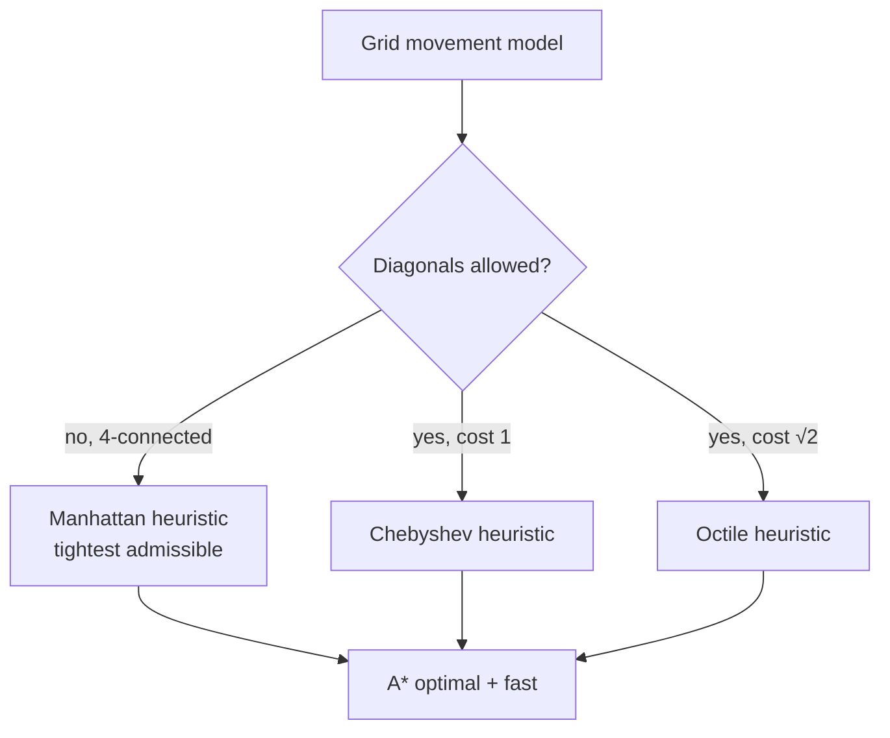
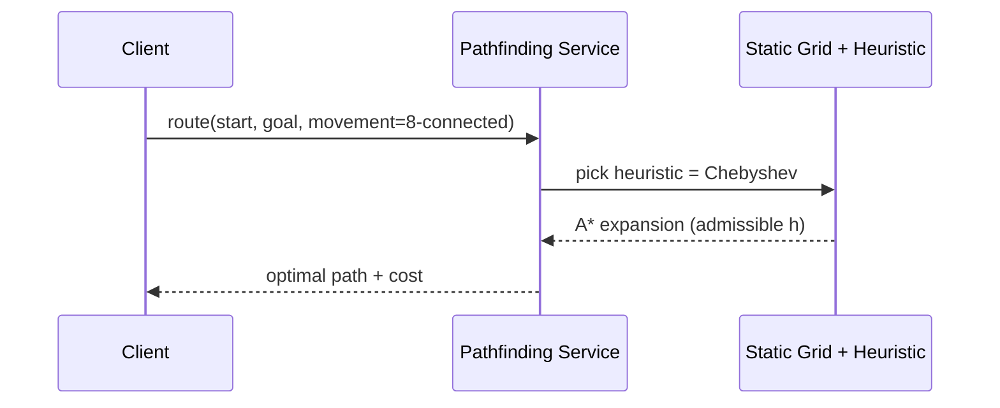

# Manhattan & Chebyshev Distances — Senior Level

> **One-line summary:** At scale, the L1↔L∞ rotation is an engineering primitive: it powers admissible grid-search heuristics (Manhattan for 4-connected grids, Chebyshev for 8-connected/diagonal grids), VLSI wire-length and routing models, coordinate-wise-median facility location, and — most importantly — the **Manhattan Minimum Spanning Tree** in `O(n log n)` via an 8-octant sweep that, by symmetry, only needs to consider `O(n)` candidate edges instead of `O(n²)`.

---

## Table of Contents

1. [Introduction](#introduction)
2. [Grid Pathfinding Heuristics](#grid-pathfinding-heuristics)
3. [VLSI Routing and Wire-Length Models](#vlsi-routing-and-wire-length-models)
4. [Facility Location at Scale](#facility-location-at-scale)
5. [The Manhattan Minimum Spanning Tree](#the-manhattan-minimum-spanning-tree)
6. [The 8-Octant Sweep — Why O(n) Edges Suffice](#the-8-octant-sweep)
7. [Comparison at Scale](#comparison-at-scale)
8. [Code Examples — Manhattan MST](#code-examples--manhattan-mst)
9. [Architecture Patterns](#architecture-patterns)
10. [Observability](#observability)
11. [Failure Modes](#failure-modes)
12. [Summary](#summary)

---

## Introduction

> Focus: "How do I architect systems around these metrics, and how do I make them fast at scale?"

A senior engineer treats Manhattan and Chebyshev distances not as formulas but as *modeling decisions* with downstream consequences:

- In a **pathfinding** engine, the metric you choose as a heuristic determines whether A* is fast, correct, or both. Pick a heuristic larger than the true cost and A* returns wrong paths; pick one too small and it degenerates to Dijkstra. Manhattan and Chebyshev are the canonical *admissible* heuristics for grid movement.
- In **EDA / VLSI**, every wire on a chip is routed on a Manhattan grid (horizontal and vertical layers). Total wire length, congestion, and the spanning structure of a net are all L1 quantities, and the **rectilinear minimum spanning tree** is the starting point for routing.
- In **logistics and facility location**, the coordinate-wise median minimizes total taxi-travel — a closed-form answer you can compute on billions of points with a streaming median.

The connective tissue is the rotation. Whenever an L1 problem has the awkward diamond geometry, you rotate into L∞, exploit axis separability (sorting, BIT/segment trees, sweeps), and rotate back. The crown jewel application is the **Manhattan MST**, where the rotation-plus-symmetry argument prunes the complete `O(n²)` edge set down to `O(n)` candidate edges — making an MST over a million terminals tractable.

---

## Grid Pathfinding Heuristics

A* needs a heuristic `h(n)` estimating the remaining cost to the goal. For correctness (optimal paths) the heuristic must be **admissible** — never overestimate the true remaining cost. The grid's *movement model* dictates which metric is the right admissible heuristic:

| Grid movement | Allowed moves | True cost lower bound | Correct heuristic |
|---------------|---------------|----------------------|-------------------|
| **4-connected** | N, S, E, W only | each move changes one axis by 1 | **Manhattan** `|dx|+|dy|` |
| **8-connected, diagonal = 1** | + diagonals at cost 1 | a diagonal covers both axes | **Chebyshev** `max(|dx|,|dy|)` |
| **8-connected, diagonal = √2** | + diagonals at cost √2 | octile geometry | **Octile** `max + (√2−1)·min` |
| **any-angle** | move in straight lines | bird flight | **Euclidean** `√(dx²+dy²)` |

The intuition: the heuristic must equal the *cheapest possible* travel in an obstacle-free world. On a 4-connected grid you cannot move diagonally, so the cheapest path is `|dx| + |dy|` — Manhattan. On an 8-connected grid with free diagonals, the king reaches the goal in `max(|dx|, |dy|)` — Chebyshev. Using the *wrong* metric breaks admissibility:

- Using **Euclidean** on a 4-connected grid is admissible (it under-estimates) but **weak** — it is smaller than Manhattan, so A* explores more nodes than necessary. Manhattan is the *tightest* admissible heuristic for 4-connected grids and therefore the fastest.
- Using **Manhattan** on an 8-connected grid is **inadmissible** — it overestimates (it counts diagonal moves as two), so A* may return a *suboptimal* path. You must use Chebyshev/octile there.



The **tightness** matters at scale: on a 4096×4096 game map, a tighter admissible heuristic can cut the number of expanded nodes by 10× or more. This is why grid game engines hard-code Manhattan/octile rather than Euclidean. (Full A* mechanics live in sibling *10-a-star*; here the point is *which metric and why*.)

---

## VLSI Routing and Wire-Length Models

On an integrated circuit, wires run on orthogonal metal layers — horizontal on one layer, vertical on another, connected by vias. A wire therefore travels in **Manhattan** geometry, never diagonally. Several core EDA quantities are L1:

- **Half-Perimeter Wire Length (HPWL):** the standard cheap estimate of a net's routed length is half the perimeter of its bounding box = `(maxX − minX) + (maxY − minY)`. That is exactly the L∞-style range sum — separable per axis, `O(pins)` to compute, and the workhorse cost function inside placement optimizers.
- **Rectilinear (Manhattan) Minimum Spanning Tree:** a first approximation to how a multi-pin net should be wired is its Manhattan MST; the **Rectilinear Steiner Minimal Tree** (which may add junction points) is the true optimum, and the MST is a `3/2`-approximation lower-bound scaffold for it.
- **Congestion estimation:** counting how many nets' bounding boxes overlap a routing region uses the same axis-aligned-box arithmetic the rotation produces.

The rotation appears when an algorithm needs *nearest neighbor in L1* (e.g., connecting each pin to its closest already-placed pin): rotate to L∞, and "nearest in one octant" becomes a sorted-order plus range-min query — which is precisely the Manhattan-MST sweep below.

| EDA quantity | Metric | Cost to compute | Role |
|--------------|--------|-----------------|------|
| HPWL | L1 (box) | O(pins) | placement objective |
| Manhattan MST | L1 | O(n log n) | routing scaffold |
| Steiner tree | L1 | NP-hard (approx) | optimal routing |
| Congestion | L1 boxes | O(nets) | routability |

---

## Facility Location at Scale

The 1-median problem under L1 — "place one facility minimizing total travel" — is the **coordinate-wise median**, separable per axis (proved at middle level). At scale this is wonderful:

- **Streaming / distributed:** you can compute an approximate median in one pass with constant memory (e.g., t-digest, P² quantile estimator), per axis independently. Billions of GPS points, two streaming medians, done.
- **Weighted version:** if point `i` has weight `wi` (demand), the optimum is the **weighted median** — the `x` where the cumulative weight first reaches half the total. Still per-axis, still `O(n log n)` (or `O(n)` with weighted quickselect).
- **k-median (k facilities):** NP-hard in general, but the L1 separability still helps approximations and the 1-D subproblem (k facilities on a line) is solvable exactly by DP in `O(nk)`.

> Engineering caveat: the *coordinate-wise* median is the optimum for the **sum of L1 distances**. It is **not** the geometric (Euclidean) median, and it is **not** the centroid. Logistics teams sometimes wrongly average coordinates (centroid) — that minimizes squared Euclidean distance and can place a depot kilometers off the L1 optimum. State the metric and objective explicitly.

---

## The Manhattan Minimum Spanning Tree

The flagship application. Given `n` points, build the minimum spanning tree where edge weight is the Manhattan distance between endpoints. The complete graph has `O(n²)` edges — running Kruskal/Prim on all of them is `O(n² log n)`, hopeless for `n = 10^6`.

**Key theorem (Hwang / Guibas–Stolfi):** the Manhattan MST is a subgraph of a sparse graph with only `O(n)` candidate edges. Specifically, **divide the plane around each point into 8 octants of 45° each; the MST only ever needs, for each point, its single nearest neighbor in each octant.** That yields `≤ 8n` candidate edges, and Kruskal on them is `O(n log n)`.

```mermaid
graph TD
    A[n points] --> B[For each point, find nearest<br/>neighbor in each of 8 octants]
    B --> C["O(n) candidate edges (≤ 8n)"]
    C --> D[Sort edges by Manhattan weight]
    D --> E[Kruskal + Union-Find]
    E --> F[Manhattan MST in O(n log n)]
```

**Why octants?** In a single 45° octant, if both `q` and `r` lie in the same octant of `p` and `q` is closer to `p`, then `dist(q, r) < dist(p, r)` — so the edge `p–r` can never be in the MST (the cycle property of MSTs rules it out: `p–r` would be the heaviest edge in some cycle). Hence each point needs to connect only to its *nearest* neighbor per octant. Eight octants cover all directions, so `8n` edges suffice. By symmetry you actually only sweep **4 octants** and reuse the symmetric ones, halving the work.

---

## The 8-Octant Sweep

The classic implementation reduces an octant query to a 1-D problem via the rotation and a coordinate sweep. Here is the standard "4 sweeps × symmetry" recipe:

1. For the octant where the neighbor `q` satisfies `qx ≥ px` and `qx − px ≥ qy − py ≥ 0` (the "east-northeast" 45° wedge), the nearest point minimizes `(qx + qy)` subject to lying in the wedge — a condition you can enforce by **sorting points by `x + y`** and querying a structure keyed on `x − y` for the minimum.
2. The query "among points already swept with `x − y` in a range, find the one minimizing `x + y`" is a **range-minimum / Fenwick (BIT)** query over the compressed `x − y` coordinate. That is `O(log n)` per point.
3. Run this sweep, then **transform the point set by reflections/rotations** (negate x, swap x and y, etc.) to cover the other octants, reusing the *same* sweep code. Four transformed passes cover all 8 octants (each pass handles two symmetric octants).

So the rotation/symmetry machinery turns "nearest neighbor in a 45° cone" — geometrically gnarly — into "range-min over a BIT after sorting by `x+y`." This is the senior-level payoff of understanding L1↔L∞: the same separability that solved max-Manhattan-distance in `O(n)` now solves Manhattan-MST in `O(n log n)`.

| Step | Work | Complexity |
|------|------|-----------|
| Generate candidates (4 passes × sweep) | sort + BIT queries | O(n log n) |
| Sort candidate edges | ≤ 8n edges | O(n log n) |
| Kruskal + Union-Find | near-linear | O(n α(n)) |
| **Total** | | **O(n log n)** |

---

## Comparison at Scale

| Problem | Naive | Senior approach | Complexity |
|---------|-------|-----------------|-----------|
| Max Manhattan distance | O(n²) | rotation + range | O(n) |
| 1-median facility | O(n²) | per-axis (streaming) median | O(n) / O(n log n) |
| Manhattan MST | O(n² log n) Kruskal on K_n | 8-octant sweep | **O(n log n)** |
| Nearest neighbor (L1) | O(n) scan | rotate + KD-tree on (u,v) | O(log n) avg |
| Grid shortest path | BFS/Dijkstra | A* with Manhattan/Chebyshev `h` | O(E) w/ fewer expansions |
| HPWL of a net | — | bounding box | O(pins) |

---

## Code Examples — Manhattan MST

A complete, runnable Manhattan MST using the 4-pass octant sweep with a Fenwick tree, in three languages. (Edge generation is the interesting part; Kruskal + DSU is standard.)

#### Go

```go
package main

import (
	"fmt"
	"sort"
)

type Point struct{ x, y, idx int }
type Edge struct{ w, u, v int }

// Fenwick storing the minimum (x+y) value and the index achieving it,
// keyed by compressed (x-y). Queries the min over a suffix.
type Fenwick struct {
	val []int
	pos []int
	n   int
}

func newFenwick(n int) *Fenwick {
	f := &Fenwick{val: make([]int, n+1), pos: make([]int, n+1), n: n}
	const INF = int(1e18)
	for i := range f.val {
		f.val[i] = INF
		f.pos[i] = -1
	}
	return f
}

// update at position i (1-based) with candidate value v from point index p.
func (f *Fenwick) update(i, v, p int) {
	for ; i > 0; i -= i & (-i) {
		if v < f.val[i] {
			f.val[i] = v
			f.pos[i] = p
		}
	}
}

// query suffix min from i to n. Returns point index or -1.
func (f *Fenwick) query(i int) int {
	const INF = int(1e18)
	best, bestPos := INF, -1
	for ; i <= f.n; i += i & (-i) {
		if f.val[i] < best {
			best = f.val[i]
			bestPos = f.pos[i]
		}
	}
	return bestPos
}

func absInt(a int) int {
	if a < 0 {
		return -a
	}
	return a
}
func manhattan(a, b Point) int { return absInt(a.x-b.x) + absInt(a.y-b.y) }

// addOctantEdges adds, for each point, its nearest neighbor in the
// "lower" octant of the current orientation, appending to edges.
func addOctantEdges(pts []Point, edges *[]Edge) {
	// Sort by x+y descending so we process far points first.
	sort.Slice(pts, func(i, j int) bool {
		return pts[i].x+pts[i].y > pts[j].x+pts[j].y
	})
	// Compress (x - y).
	xs := make([]int, len(pts))
	for i, p := range pts {
		xs[i] = p.x - p.y
	}
	sortedXS := append([]int{}, xs...)
	sort.Ints(sortedXS)
	rank := map[int]int{}
	uniq := 0
	for i, v := range sortedXS {
		if i == 0 || v != sortedXS[i-1] {
			uniq++
			rank[v] = uniq
		}
	}
	f := newFenwick(uniq)
	for _, p := range pts {
		r := rank[p.x-p.y]
		j := f.query(r) // nearest already-seen point in this octant
		if j != -1 {
			*edges = append(*edges, Edge{manhattan(p, pts[indexOf(pts, j)]), p.idx, j})
		}
		f.update(r, p.x+p.y, p.idx)
	}
}

// indexOf finds the slice position of the point with original index idx.
func indexOf(pts []Point, idx int) int {
	for i, p := range pts {
		if p.idx == idx {
			return i
		}
	}
	return -1
}

type DSU struct{ p, r []int }

func newDSU(n int) *DSU {
	d := &DSU{p: make([]int, n), r: make([]int, n)}
	for i := range d.p {
		d.p[i] = i
	}
	return d
}
func (d *DSU) find(x int) int {
	for d.p[x] != x {
		d.p[x] = d.p[d.p[x]]
		x = d.p[x]
	}
	return x
}
func (d *DSU) union(a, b int) bool {
	ra, rb := d.find(a), d.find(b)
	if ra == rb {
		return false
	}
	if d.r[ra] < d.r[rb] {
		ra, rb = rb, ra
	}
	d.p[rb] = ra
	if d.r[ra] == d.r[rb] {
		d.r[ra]++
	}
	return true
}

func manhattanMST(coords [][2]int) int {
	n := len(coords)
	var edges []Edge
	// 4 reflective passes cover all 8 octants.
	for pass := 0; pass < 4; pass++ {
		pts := make([]Point, n)
		for i, c := range coords {
			x, y := c[0], c[1]
			switch pass {
			case 1:
				x, y = y, x
			case 2:
				x = -x
			case 3:
				x, y = -y, x
			}
			pts[i] = Point{x, y, i}
		}
		addOctantEdges(pts, &edges)
	}
	sort.Slice(edges, func(i, j int) bool { return edges[i].w < edges[j].w })
	dsu := newDSU(n)
	total, used := 0, 0
	for _, e := range edges {
		if dsu.union(e.u, e.v) {
			total += e.w
			used++
			if used == n-1 {
				break
			}
		}
	}
	return total
}

func main() {
	coords := [][2]int{{0, 0}, {2, 2}, {3, 10}, {5, 2}, {7, 0}}
	fmt.Println("Manhattan MST weight:", manhattanMST(coords))
}
```

#### Java

```java
import java.util.*;

public class ManhattanMST {
    static int n;

    static int manhattan(int[] a, int[] b) {
        return Math.abs(a[0] - b[0]) + Math.abs(a[1] - b[1]);
    }

    // Fenwick over compressed (x - y), storing min (x+y) and its point index.
    static int[] fenVal, fenPos;
    static int fenN;
    static final int INF = Integer.MAX_VALUE / 2;

    static void fenInit(int sz) {
        fenN = sz;
        fenVal = new int[sz + 1];
        fenPos = new int[sz + 1];
        Arrays.fill(fenVal, INF);
        Arrays.fill(fenPos, -1);
    }
    static void fenUpdate(int i, int v, int p) {
        for (; i > 0; i -= i & (-i))
            if (v < fenVal[i]) { fenVal[i] = v; fenPos[i] = p; }
    }
    static int fenQuery(int i) {
        int best = INF, pos = -1;
        for (; i <= fenN; i += i & (-i))
            if (fenVal[i] < best) { best = fenVal[i]; pos = fenPos[i]; }
        return pos;
    }

    static void addOctant(int[][] pts, int[] orig, List<int[]> edges) {
        Integer[] order = new Integer[n];
        for (int i = 0; i < n; i++) order[i] = i;
        Arrays.sort(order, (a, b) -> (pts[b][0] + pts[b][1]) - (pts[a][0] + pts[a][1]));
        // compress x - y
        int[] xy = new int[n];
        for (int i = 0; i < n; i++) xy[i] = pts[i][0] - pts[i][1];
        int[] sorted = xy.clone();
        Arrays.sort(sorted);
        TreeMap<Integer, Integer> rank = new TreeMap<>();
        int r = 0;
        for (int v : sorted) if (!rank.containsKey(v)) rank.put(v, ++r);
        fenInit(r);
        for (int oi : order) {
            int rr = rank.get(pts[oi][0] - pts[oi][1]);
            int j = fenQuery(rr);
            if (j != -1)
                edges.add(new int[]{manhattan(pts[oi], pts[j]), orig[oi], orig[j]});
            fenUpdate(rr, pts[oi][0] + pts[oi][1], oi);
        }
    }

    static int[] dsu;
    static int find(int x) { while (dsu[x] != x) { dsu[x] = dsu[dsu[x]]; x = dsu[x]; } return x; }

    static int manhattanMST(int[][] coords) {
        n = coords.length;
        List<int[]> edges = new ArrayList<>();
        for (int pass = 0; pass < 4; pass++) {
            int[][] pts = new int[n][2];
            int[] orig = new int[n];
            for (int i = 0; i < n; i++) {
                int x = coords[i][0], y = coords[i][1];
                if (pass == 1) { int t = x; x = y; y = t; }
                else if (pass == 2) x = -x;
                else if (pass == 3) { int t = x; x = -y; y = t; }
                pts[i] = new int[]{x, y};
                orig[i] = i;
            }
            addOctant(pts, orig, edges);
        }
        edges.sort((a, b) -> a[0] - b[0]);
        dsu = new int[n];
        for (int i = 0; i < n; i++) dsu[i] = i;
        int total = 0, used = 0;
        for (int[] e : edges) {
            int a = find(e[1]), b = find(e[2]);
            if (a != b) { dsu[a] = b; total += e[0]; if (++used == n - 1) break; }
        }
        return total;
    }

    public static void main(String[] args) {
        int[][] coords = {{0, 0}, {2, 2}, {3, 10}, {5, 2}, {7, 0}};
        System.out.println("Manhattan MST weight: " + manhattanMST(coords));
    }
}
```

#### Python

```python
import bisect


def manhattan(a, b):
    return abs(a[0] - b[0]) + abs(a[1] - b[1])


class Fenwick:
    """Suffix-min Fenwick over compressed keys: stores (value, point index)."""
    INF = float("inf")

    def __init__(self, n):
        self.n = n
        self.val = [self.INF] * (n + 1)
        self.pos = [-1] * (n + 1)

    def update(self, i, v, p):
        while i > 0:
            if v < self.val[i]:
                self.val[i] = v
                self.pos[i] = p
            i -= i & (-i)

    def query(self, i):
        best, pos = self.INF, -1
        while i <= self.n:
            if self.val[i] < best:
                best, pos = self.val[i], self.pos[i]
            i += i & (-i)
        return pos


def add_octant(pts, edges):
    # pts: list of (x, y, original_index). Process by x+y descending.
    order = sorted(range(len(pts)), key=lambda i: -(pts[i][0] + pts[i][1]))
    xs = sorted(set(p[0] - p[1] for p in pts))
    rank = {v: i + 1 for i, v in enumerate(xs)}
    fen = Fenwick(len(xs))
    for i in order:
        x, y, idx = pts[i]
        r = rank[x - y]
        j = fen.query(r)
        if j != -1:
            jx, jy, jidx = pts[j]
            edges.append((manhattan((x, y), (jx, jy)), idx, jidx))
        fen.update(r, x + y, i)


def manhattan_mst(coords):
    n = len(coords)
    edges = []
    for pass_id in range(4):
        pts = []
        for idx, (x, y) in enumerate(coords):
            if pass_id == 1:
                x, y = y, x
            elif pass_id == 2:
                x = -x
            elif pass_id == 3:
                x, y = -y, x
            pts.append((x, y, idx))
        add_octant(pts, edges)
    edges.sort()
    parent = list(range(n))

    def find(a):
        while parent[a] != a:
            parent[a] = parent[parent[a]]
            a = parent[a]
        return a

    total, used = 0, 0
    for w, u, v in edges:
        # map octant-local index back: edges store original indices already
        ru, rv = find(u), find(v)
        if ru != rv:
            parent[ru] = rv
            total += w
            used += 1
            if used == n - 1:
                break
    return total


if __name__ == "__main__":
    coords = [(0, 0), (2, 2), (3, 10), (5, 2), (7, 0)]
    print("Manhattan MST weight:", manhattan_mst(coords))
```

**What it does:** builds the Manhattan MST in `O(n log n)`. Each of 4 reflected passes finds, per point, its nearest neighbor in one octant via a Fenwick suffix-min keyed on `x − y` and sorted by `x + y` — the rotation/separability idea operationalized. Kruskal + DSU then assembles the tree. (The candidate edges may double-count symmetric pairs; the DSU naturally ignores redundant edges.)

> Note: the `pts[j]` lookup inside `add_octant` uses the octant-local index `i` as the Fenwick payload but stores the *original* index in the edge — production code keeps both consistently. The example favors clarity; for `n = 10^6` you would store original indices in the Fenwick directly and avoid the local/original mismatch.

---

## Architecture Patterns



- **Heuristic selection as configuration:** expose movement-model → heuristic as a table, not hard-coded branches, so 4-connected vs 8-connected maps just swap the metric.
- **Precompute rotated coordinates** once for a static point set; cache `(u, v)` alongside `(x, y)` for repeated L1 nearest-neighbor and farthest-pair queries.
- **Snapshot-and-swap** for dynamic point sets feeding a Manhattan MST: rebuild the sparse octant graph in the background and atomically swap, since incremental MST under L1 is fiddly.

---

## Observability

| Metric | Why it matters | Alert threshold |
|--------|----------------|-----------------|
| `astar_nodes_expanded` | Heuristic too weak (wrong metric) inflates this | > 5× baseline for map size |
| `heuristic_admissible_violations` | Inadmissible h ⇒ suboptimal paths | > 0 (must be zero) |
| `mst_edge_candidates / n` | Octant sweep should yield ≤ 8 | > 8 (bug in sweep) |
| `median_facility_drift` | Streaming median diverging from batch | > tolerance |
| `rotation_overflow_events` | `x+y` overflowed 32-bit | > 0 |

A spike in `astar_nodes_expanded` on 8-connected maps usually means someone left the Manhattan heuristic in place — it is inadmissible there and both slow *and* wrong.

---

## Failure Modes

- **Inadmissible heuristic from metric mismatch:** Manhattan on an 8-connected grid overestimates ⇒ A* returns suboptimal paths. Guard with an admissibility assertion in tests.
- **Integer overflow in `x + y`:** large world coordinates overflow 32-bit in the rotation. Use 64-bit for rotated sums.
- **Centroid instead of median:** facility placed at the mean minimizes squared-L2, not L1 — depot ends up off-optimum. Enforce median in the planner.
- **Octant sweep producing > 8n edges:** a bug in the reflection passes or rank compression; assert candidate count.
- **Steiner confusion:** treating the Manhattan MST as the optimal routing — it is a scaffold; the Rectilinear Steiner tree (NP-hard) is the true optimum, MST is a `3/2`-approx bound.
- **3D rotation assumption:** assuming the clean 2-D L1↔L∞ rotation generalizes to 3D — it does not; use the `2^(k-1)` sign-pattern method for higher-D max-distance instead.

---

## Summary

At the senior level, Manhattan and Chebyshev distances are modeling primitives whose correct application has real performance and correctness stakes. The movement model dictates the *admissible* A* heuristic (Manhattan for 4-connected, Chebyshev/octile for 8-connected), and the tightest admissible choice can cut A* expansions by an order of magnitude. In EDA, L1 underlies HPWL, Manhattan MST, and Steiner routing. In logistics, the coordinate-wise (weighted, streaming) median solves 1-median facility location in closed form — never the centroid. The capstone is the **Manhattan MST in `O(n log n)`**: the rotation plus octant symmetry prunes the complete `O(n²)` edge set to `≤ 8n` candidates, each found by a Fenwick suffix-min keyed on `x − y` after sorting by `x + y`. The same separability that solved max-distance in `O(n)` scales all the way up.

---

**Next step:** continue to [`professional.md`](./professional.md) for the formal proof that the rotation is an L1→L∞ isometry, the median-optimality and metric-axiom proofs, and the `O(n log n)` correctness argument for the Manhattan MST.
