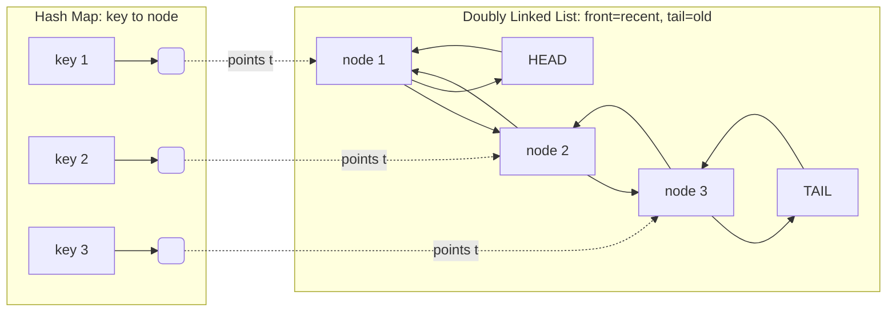

# LRU Cache — Junior Level

## Table of Contents

1. [Introduction](#introduction)
2. [What is a Cache?](#what-is-a-cache)
3. [What is an LRU Cache?](#what-is-an-lru-cache)
4. [Real-World Analogies](#real-world-analogies)
5. [Core Operations](#core-operations)
   - [get(key)](#getkey)
   - [put(key, value)](#putkey-value)
6. [The Two Data Structures Inside](#the-two-data-structures-inside)
   - [The Hash Map](#the-hash-map)
   - [The Doubly Linked List](#the-doubly-linked-list)
   - [Why Both Together?](#why-both-together)
7. [A Small Worked Example](#a-small-worked-example)
8. [How Each Operation Works Step by Step](#how-each-operation-works-step-by-step)
9. [Operations and Complexity](#operations-and-complexity)
10. [Full Implementation](#full-implementation)
    - [Go](#go-implementation)
    - [Java](#java-implementation)
    - [Python](#python-implementation)
11. [Common Mistakes](#common-mistakes)
12. [Summary](#summary)

---

## Introduction

An **LRU cache** (Least Recently Used cache) is one of the most famous data-structure design problems in computer science. It is asked in interviews constantly (it is **LeetCode 146**), and — more importantly — it is used in real systems everywhere: operating-system page caches, database buffer pools, web browsers, CDNs, and the memoization layers inside many libraries.

The goal of an LRU cache is simple to state:

> Store a limited number of key-value pairs. When the cache is full and a new item must be added, **throw away the item that was used the longest time ago**. Make both reading and writing take **constant time, O(1)**.

The clever part — and the reason this topic is worth studying carefully — is that achieving O(1) for *both* "look up a value" *and* "find the least recently used item to evict" requires combining **two** data structures: a **hash map** and a **doubly linked list**. Neither one alone can do it. This pairing is a pattern you will reuse many times in your career.

By the end of this page you will be able to build a working LRU cache from scratch in Go, Java, and Python, and explain exactly why it is fast.

---

## What is a Cache?

A **cache** is a small, fast store that holds copies of data so you do not have to recompute or re-fetch that data from a slower source.

```
Slow source (database, disk, network, expensive computation)
        ^
        | on a "miss", go fetch it (slow)
        |
   +---------+
   |  CACHE  |  <-- small, fast (in memory)
   +---------+
        |
        | on a "hit", return instantly (fast)
        v
     Your program
```

- **Cache hit**: the data you asked for is already in the cache. Fast.
- **Cache miss**: the data is not in the cache. You must fetch it from the slow source, then (usually) store it in the cache for next time.

A cache is small *on purpose* — memory is limited and expensive. So the cache can only hold a fixed number of items. This number is called the **capacity**. Once the cache is full, adding a new item means an old item has to go. The rule for *which* item to remove is called the **eviction policy**.

LRU is one specific eviction policy: **remove the item that has not been used for the longest time.**

---

## What is an LRU Cache?

LRU stands for **Least Recently Used**. The policy is based on a simple, powerful assumption about how programs behave, called **temporal locality**:

> If you used something recently, you will probably use it again soon. If you have not touched something in a long time, you probably will not need it soon.

So when the cache is full and we must drop one item, LRU drops the one we have not touched in the longest time — the **least recently used** one. The items we used recently are kept, because they are the most likely to be needed again.

"Used" means either:
- We **read** the item (`get`), or
- We **wrote / updated** the item (`put`).

Every time we touch a key, it becomes the **most** recently used. The key that stays untouched the longest eventually becomes the **least** recently used and is the first to be evicted.

---

## Real-World Analogies

### 1. A Stack of Papers on Your Desk

Imagine a desk that only fits 5 sheets of paper. Every time you use a sheet, you put it back **on top** of the pile. When you need to add a 6th sheet but the desk is full, you remove the sheet at the **bottom** — the one you have not touched in the longest time. That bottom sheet is the *least recently used*. This is exactly LRU.

### 2. Your Phone's Recent Apps

When you switch apps, the most recent one goes to the front of the "recent apps" list. The phone keeps a limited number of apps in memory. When it runs low on memory, it closes the apps at the *back* of the list — the ones you have not opened in a while.

### 3. A Coat Closet with Limited Hooks

A closet has 10 hooks. Every time someone uses their coat, they re-hang it at the front. When the 11th coat arrives, the coat that has hung untouched the longest (at the very back) is moved to storage to make room.

### 4. Bookshelf "Return to Front"

You keep books you read on a shelf. Each time you read a book, you slide it back to the **left end** of the shelf. When the shelf is full and you buy a new book, you donate the one on the **far right** — it is the book you have not opened in the longest time.

In every analogy notice the two repeated ideas: **touch something → move it to the front**, and **need space → remove from the back**. That is the heart of LRU.

---

## Core Operations

An LRU cache supports exactly two operations.

### get(key)

```
get(key):
  if key is in the cache:
      mark it as "most recently used"
      return its value
  else:
      return "not found"  (often represented as -1)
```

A `get` is not a passive read — it *counts as using* the key, so the key must be promoted to most-recently-used.

### put(key, value)

```
put(key, value):
  if key already exists:
      update its value
      mark it as "most recently used"
  else:
      if the cache is full:
          evict the least-recently-used key
      insert the new key as "most recently used"
```

A `put` always makes the affected key the most recently used. If inserting a brand-new key overflows the capacity, we first evict the least recently used key.

---

## The Two Data Structures Inside

To make both `get` and `put` run in O(1), we combine two structures. Let us look at each, then see why we need both.

### The Hash Map

A **hash map** (Go `map`, Java `HashMap`, Python `dict`) gives us O(1) average lookup: given a key, find its data instantly. But a plain hash map does **not** remember the *order* in which keys were used. It cannot tell us "which key is the least recently used?" — it has no concept of order at all.

So the hash map solves the **"find by key fast"** problem but not the **"find the oldest item fast"** problem.

### The Doubly Linked List

A **doubly linked list** is a chain of nodes where each node knows both its **previous** and its **next** neighbor:

```
  HEAD                                                    TAIL
   |                                                       |
   v                                                       v
[ node ] <-> [ node ] <-> [ node ] <-> [ node ] <-> [ node ]
 (most                                              (least
 recently                                          recently
  used)                                              used)
```

We use the list to track **order of use**:
- **Front (head side)** = most recently used.
- **Back (tail side)** = least recently used.

Because it is *doubly* linked, we can:
- **Remove any node in O(1)** — just rewire its neighbors' pointers (we do not have to walk the list to find the previous node, because each node already stores its `prev`).
- **Add a node to the front in O(1)**.
- **Find the least-recently-used node in O(1)** — it is always at the tail.

A *singly* linked list would not work, because removing a node requires knowing the node *before* it, and a singly linked list does not store back-pointers — finding the previous node would take O(n).

### Why Both Together?

Here is the key insight. Each structure covers the other's weakness:

| Need | Hash Map alone | Linked List alone | Hash Map + Linked List |
|------|----------------|-------------------|------------------------|
| Look up a value by key | O(1) ✅ | O(n) ❌ (must scan) | O(1) ✅ |
| Know which key is least recently used | impossible ❌ | O(1) ✅ (tail) | O(1) ✅ |
| Move a touched key to "most recent" | impossible ❌ | O(1) if you have the node | O(1) ✅ |
| Evict the oldest | impossible ❌ | O(1) ✅ | O(1) ✅ |

The trick that makes them work together: **the hash map does not store the value directly — it stores a pointer to the node in the linked list.**

```
   Hash Map                    Doubly Linked List
+-----------+
| key 1 --> |--------------> [ node: key1, val ]
| key 2 --> |--------------> [ node: key2, val ]
| key 3 --> |--------------> [ node: key3, val ]
+-----------+
```

So given a key, the hash map jumps straight to its node in the list (O(1)), and from the node we can instantly unlink it and move it to the front (O(1), thanks to the back-pointers). Every operation is O(1).

Here is the same idea as a diagram — the hash map's values are *pointers into* the linked list:



---

## A Small Worked Example

Let us run an LRU cache with **capacity = 2**. We show the linked list from most-recent (left) to least-recent (right) after each step.

```
put(1, "A")        list: [1]                  cache has {1:A}
put(2, "B")        list: [2, 1]               cache has {1:A, 2:B}
get(1)  -> "A"     list: [1, 2]               (1 is touched, moves to front)
put(3, "C")        list: [3, 1]               capacity full -> evict 2 (the tail)
get(2)  -> miss    list: [3, 1]               (2 was evicted, not found)
put(4, "D")        list: [4, 3]               full again -> evict 1 (the tail)
get(1)  -> miss    list: [4, 3]               (1 was evicted)
get(3)  -> "C"     list: [3, 4]               (3 touched, moves to front)
get(4)  -> "D"     list: [4, 3]               (4 touched, moves to front)
```

Trace the eviction of key 2 carefully: after `get(1)`, key 1 became most-recent, so key 2 sank to the tail. When `put(3, "C")` overflowed the capacity, the tail (key 2) was the least recently used, so it was evicted. That is LRU doing its job.

---

## How Each Operation Works Step by Step

We use two **dummy nodes** (also called *sentinels*): a dummy `head` and a dummy `tail`. They never hold real data; they just remove edge cases (an empty list, inserting at the very front, removing the very last item). Real nodes always live *between* the dummies.

```
[dummy head] <-> (real nodes here) <-> [dummy tail]
   front side                              back side
   = most recent                          = least recent
```

**get(key):**
1. Look up `key` in the hash map.
2. If absent → return "not found".
3. If present → we have the node. Unlink it from its current position and move it right behind the dummy head (most recent). Return its value.

**put(key, value) — existing key:**
1. Look up the node, update its value.
2. Move it to the front (most recent).

**put(key, value) — new key:**
1. Create a new node, insert it right behind the dummy head.
2. Store `key → node` in the hash map.
3. If `size > capacity`: the node just before the dummy tail is the least recently used. Unlink it, and delete its key from the hash map.

Every step above is a constant number of pointer updates or one hash-map operation, so each is O(1).

---

## Operations and Complexity

| Operation | Time | Space |
|-----------|------|-------|
| `get(key)` | O(1) average | — |
| `put(key, value)` | O(1) average | — |
| Evict LRU | O(1) | — |
| Whole cache | — | O(capacity) |

- The "average" qualifier comes from the hash map: hash-map lookups are O(1) on average, O(n) only in the rare worst case of many collisions.
- The linked-list operations (unlink, insert-at-front, remove-tail) are **always** O(1) because we never scan the list — we always have a direct pointer to the node we need.

---

## Full Implementation

Below is a complete, working LRU cache in each language. They all use the same design: a hash map from key to node, plus a doubly linked list with dummy head and tail.

### Go Implementation

```go
package lru

// node is one entry in the doubly linked list.
type node struct {
	key, value int
	prev, next *node
}

// LRUCache is a fixed-capacity least-recently-used cache.
type LRUCache struct {
	capacity int
	cache    map[int]*node // key -> node
	head     *node         // dummy head (most-recent side)
	tail     *node         // dummy tail (least-recent side)
}

// New creates an LRU cache with the given capacity.
func New(capacity int) *LRUCache {
	head := &node{}
	tail := &node{}
	head.next = tail
	tail.prev = head
	return &LRUCache{
		capacity: capacity,
		cache:    make(map[int]*node),
		head:     head,
		tail:     tail,
	}
}

// removeNode unlinks a node from the list (O(1)).
func (c *LRUCache) removeNode(n *node) {
	n.prev.next = n.next
	n.next.prev = n.prev
}

// addToFront inserts a node right behind the dummy head (O(1)).
func (c *LRUCache) addToFront(n *node) {
	n.next = c.head.next
	n.prev = c.head
	c.head.next.prev = n
	c.head.next = n
}

// moveToFront marks a node as most recently used.
func (c *LRUCache) moveToFront(n *node) {
	c.removeNode(n)
	c.addToFront(n)
}

// Get returns the value for key, or -1 if absent. Marks key as most-recent.
func (c *LRUCache) Get(key int) int {
	if n, ok := c.cache[key]; ok {
		c.moveToFront(n)
		return n.value
	}
	return -1
}

// Put inserts or updates a key. Evicts the LRU entry on overflow.
func (c *LRUCache) Put(key, value int) {
	if n, ok := c.cache[key]; ok {
		n.value = value
		c.moveToFront(n)
		return
	}

	newNode := &node{key: key, value: value}
	c.cache[key] = newNode
	c.addToFront(newNode)

	if len(c.cache) > c.capacity {
		lru := c.tail.prev // least recently used = just before dummy tail
		c.removeNode(lru)
		delete(c.cache, lru.key)
	}
}

// Usage example:
// func main() {
//     cache := lru.New(2)
//     cache.Put(1, 1)
//     cache.Put(2, 2)
//     fmt.Println(cache.Get(1)) // 1
//     cache.Put(3, 3)           // evicts key 2
//     fmt.Println(cache.Get(2)) // -1
//     cache.Put(4, 4)           // evicts key 1
//     fmt.Println(cache.Get(1)) // -1
//     fmt.Println(cache.Get(3)) // 3
//     fmt.Println(cache.Get(4)) // 4
// }
```

### Java Implementation

```java
import java.util.HashMap;

/**
 * A fixed-capacity least-recently-used cache with O(1) get and put.
 */
public class LRUCache {

    /** One entry in the doubly linked list. */
    private static class Node {
        int key, value;
        Node prev, next;

        Node(int key, int value) {
            this.key = key;
            this.value = value;
        }

        Node() { } // for dummy head/tail
    }

    private final int capacity;
    private final HashMap<Integer, Node> cache;
    private final Node head; // dummy head (most-recent side)
    private final Node tail; // dummy tail (least-recent side)

    public LRUCache(int capacity) {
        this.capacity = capacity;
        this.cache = new HashMap<>();
        this.head = new Node();
        this.tail = new Node();
        head.next = tail;
        tail.prev = head;
    }

    /** Unlink a node from the list (O(1)). */
    private void removeNode(Node node) {
        node.prev.next = node.next;
        node.next.prev = node.prev;
    }

    /** Insert a node right behind the dummy head (O(1)). */
    private void addToFront(Node node) {
        node.next = head.next;
        node.prev = head;
        head.next.prev = node;
        head.next = node;
    }

    /** Mark a node as most recently used. */
    private void moveToFront(Node node) {
        removeNode(node);
        addToFront(node);
    }

    /** Return the value for key, or -1 if absent. Marks key as most-recent. */
    public int get(int key) {
        Node node = cache.get(key);
        if (node == null) {
            return -1;
        }
        moveToFront(node);
        return node.value;
    }

    /** Insert or update a key. Evicts the LRU entry on overflow. */
    public void put(int key, int value) {
        Node node = cache.get(key);
        if (node != null) {
            node.value = value;
            moveToFront(node);
            return;
        }

        Node newNode = new Node(key, value);
        cache.put(key, newNode);
        addToFront(newNode);

        if (cache.size() > capacity) {
            Node lru = tail.prev; // least recently used
            removeNode(lru);
            cache.remove(lru.key);
        }
    }

    // Usage example:
    // public static void main(String[] args) {
    //     LRUCache cache = new LRUCache(2);
    //     cache.put(1, 1);
    //     cache.put(2, 2);
    //     System.out.println(cache.get(1)); // 1
    //     cache.put(3, 3);                  // evicts key 2
    //     System.out.println(cache.get(2)); // -1
    //     cache.put(4, 4);                  // evicts key 1
    //     System.out.println(cache.get(1)); // -1
    //     System.out.println(cache.get(3)); // 3
    //     System.out.println(cache.get(4)); // 4
    // }
}
```

### Python Implementation

```python
"""LRU cache using a hash map plus a doubly linked list."""


class Node:
    """One entry in the doubly linked list."""

    __slots__ = ("key", "value", "prev", "next")

    def __init__(self, key: int = 0, value: int = 0):
        self.key = key
        self.value = value
        self.prev: "Node | None" = None
        self.next: "Node | None" = None


class LRUCache:
    """Fixed-capacity least-recently-used cache with O(1) get and put."""

    def __init__(self, capacity: int):
        self.capacity = capacity
        self.cache: dict[int, Node] = {}
        # Dummy head (most-recent side) and dummy tail (least-recent side).
        self.head = Node()
        self.tail = Node()
        self.head.next = self.tail
        self.tail.prev = self.head

    def _remove(self, node: Node) -> None:
        """Unlink a node from the list (O(1))."""
        node.prev.next = node.next
        node.next.prev = node.prev

    def _add_to_front(self, node: Node) -> None:
        """Insert a node right behind the dummy head (O(1))."""
        node.next = self.head.next
        node.prev = self.head
        self.head.next.prev = node
        self.head.next = node

    def _move_to_front(self, node: Node) -> None:
        """Mark a node as most recently used."""
        self._remove(node)
        self._add_to_front(node)

    def get(self, key: int) -> int:
        """Return the value for key, or -1 if absent."""
        if key not in self.cache:
            return -1
        node = self.cache[key]
        self._move_to_front(node)
        return node.value

    def put(self, key: int, value: int) -> None:
        """Insert or update a key. Evicts the LRU entry on overflow."""
        if key in self.cache:
            node = self.cache[key]
            node.value = value
            self._move_to_front(node)
            return

        new_node = Node(key, value)
        self.cache[key] = new_node
        self._add_to_front(new_node)

        if len(self.cache) > self.capacity:
            lru = self.tail.prev  # least recently used
            self._remove(lru)
            del self.cache[lru.key]


# Usage example:
# if __name__ == "__main__":
#     cache = LRUCache(2)
#     cache.put(1, 1)
#     cache.put(2, 2)
#     print(cache.get(1))  # 1
#     cache.put(3, 3)      # evicts key 2
#     print(cache.get(2))  # -1
#     cache.put(4, 4)      # evicts key 1
#     print(cache.get(1))  # -1
#     print(cache.get(3))  # 3
#     print(cache.get(4))  # 4
```

---

## Common Mistakes

| Mistake | Why It Is Wrong | Fix |
|---------|-----------------|-----|
| Forgetting to move on `get` | A read counts as "using" the key; if you do not promote it, the wrong key gets evicted later | Always `moveToFront` inside `get` on a hit |
| Using a singly linked list | Removing a node needs its predecessor; a singly list cannot find it in O(1) | Use a **doubly** linked list with `prev` and `next` |
| Storing the value directly in the map | Then you cannot find the node to unlink it in O(1) | Store `key → node pointer`, value lives in the node |
| Not deleting the evicted key from the map | The map keeps a dangling entry; size grows forever and lookups return stale nodes | After unlinking the tail, `delete` its key from the map |
| Checking capacity *before* inserting on update | Updating an existing key must not evict anything | Only consider eviction when inserting a **brand-new** key |
| No dummy head/tail | Inserting into an empty list or removing the last node needs special-case code | Use sentinel dummy nodes; real nodes always sit between them |
| Forgetting to update value on existing key | `put` on an existing key should overwrite, not skip | Update `node.value` before moving to front |

---

## Summary

| Concept | Key Point |
|---------|-----------|
| **LRU cache** | Fixed-capacity store that evicts the least recently used item |
| **Eviction policy** | The rule for what to remove when full; LRU = oldest-used-first |
| **Temporal locality** | Recently used → likely used again, the assumption LRU bets on |
| **Hash map** | Gives O(1) lookup by key, but knows nothing about use order |
| **Doubly linked list** | Tracks use order: front = most recent, tail = least recent |
| **Key → node pointer** | The map points at list nodes so we can unlink in O(1) |
| **Dummy head/tail** | Sentinels that remove empty-list and edge-case bugs |
| **get** | Look up, move node to front, return value (or -1) |
| **put** | Update or insert, move to front, evict the tail if over capacity |
| **Complexity** | O(1) average for both `get` and `put`; O(capacity) space |

You now understand the *what* and *how* of an LRU cache: two cooperating data structures that together give O(1) reads, writes, and evictions. The next level explains the *why* and *when* — how LRU compares to other eviction policies (LFU, FIFO), how `LinkedHashMap` gives you LRU almost for free in Java, and what it takes to make a cache thread-safe.

**Next step:** Continue to [`middle.md`](./middle.md) to learn eviction policies (LRU vs LFU vs FIFO), the `LinkedHashMap` access-order trick, when LRU is the wrong choice, and the basics of making a cache thread-safe.
