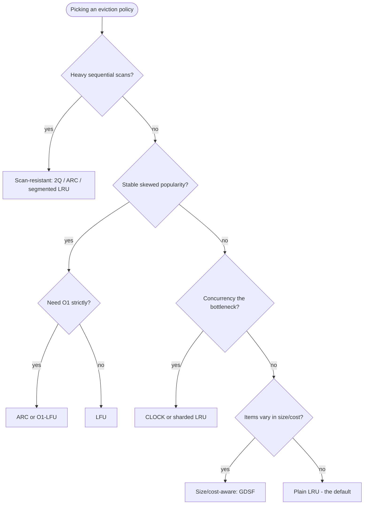
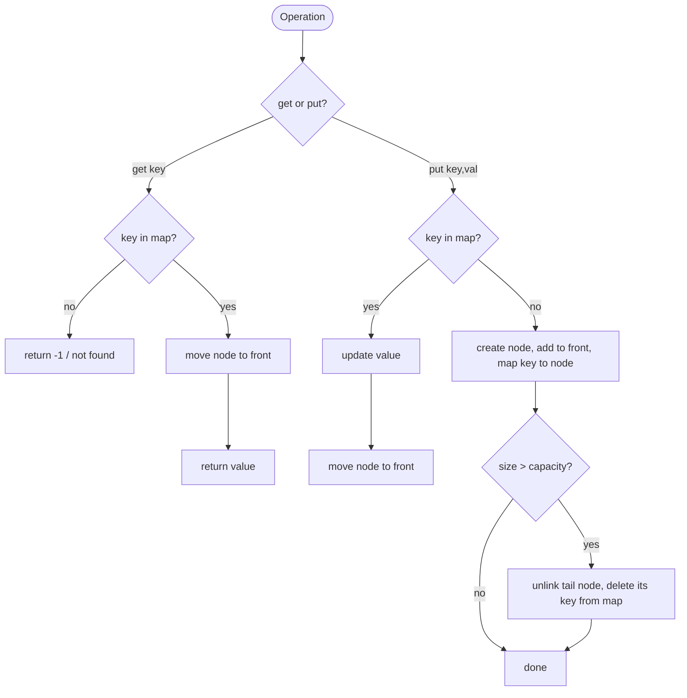

# LRU Cache — Middle Level

## Table of Contents

1. [Why LRU? The Locality Argument](#why-lru-the-locality-argument)
2. [Eviction Policies Compared](#eviction-policies-compared)
   - [FIFO](#fifo)
   - [LRU](#lru)
   - [LFU](#lfu)
   - [MRU and Random](#mru-and-random)
3. [When LRU Is the Wrong Choice](#when-lru-is-the-wrong-choice)
4. [The Scan / Sequential-Flooding Problem](#the-scan--sequential-flooding-problem)
5. [LinkedHashMap: LRU Almost for Free](#linkedhashmap-lru-almost-for-free)
6. [The accessOrder Mechanism in Detail](#the-accessorder-mechanism-in-detail)
7. [Capacity, Cost, and What "Item" Means](#capacity-cost-and-what-item-means)
8. [Diagram: The get/put State Machine](#diagram-the-getput-state-machine)
9. [Thread-Safety Basics](#thread-safety-basics)
10. [Implementation: LRU with a Cleaner API](#implementation-lru-with-a-cleaner-api)
    - [Go](#go)
    - [Java (LinkedHashMap)](#java-linkedhashmap)
    - [Python (OrderedDict)](#python-ordereddict)
11. [Key Takeaways](#key-takeaways)

---

## Why LRU? The Locality Argument

At the junior level we built an LRU cache. Now we ask *why* this particular eviction policy is so popular. The answer is **locality of reference** — an empirical property of nearly all real workloads.

- **Temporal locality**: data accessed recently is likely to be accessed again soon. (A loop variable, a hot database row, a popular web page.)
- **Spatial locality**: data near recently accessed data is likely to be accessed soon. (Sequential array scans, adjacent disk blocks.)

LRU exploits *temporal* locality directly: it keeps the recently touched items and discards the cold ones. Because most programs and most user behavior exhibit strong temporal locality, LRU achieves high hit ratios in practice while being cheap to implement (O(1) per operation). That combination — good hit ratio, low overhead, simple to reason about — is why LRU is the *default* choice and the baseline every other policy is measured against.

The single most important metric for any cache is the **hit ratio**:

```
hit ratio = hits / (hits + misses)
```

A higher hit ratio means fewer expensive trips to the slow backing store. Every eviction policy is, ultimately, a *guess* about which items will be reused. LRU's guess is "the recently used ones." Different policies make different guesses, and which guess wins depends on the workload.

---

## Eviction Policies Compared

A cache's behavior is defined by what it evicts when full. Here are the main policies.

### FIFO

**First In, First Out.** Evict the item that was *inserted* earliest, regardless of how often it has been used since. Implemented with a simple queue — no need to track accesses.

- **Pro**: trivial to implement, very low overhead, no per-access bookkeeping.
- **Con**: ignores usage. A frequently used item inserted long ago gets evicted even though it is hot. Vulnerable to **Bélády's anomaly** (adding cache capacity can *increase* misses — a famous counter-intuitive result unique to FIFO).

### LRU

**Least Recently Used.** Evict the item untouched for the longest time. A `get` *re-orders* the item to most-recent; FIFO does not.

- **Pro**: respects recency, strong on temporal-locality workloads, O(1), well understood.
- **Con**: pure recency ignores *frequency*. One item touched 1000 times and another touched once look identical if both were touched "just now." Vulnerable to large sequential scans (see below).

### LFU

**Least Frequently Used.** Evict the item with the *lowest access count*. Tracks how many times each key was used, not when.

- **Pro**: excellent when popularity is stable — a item accessed often stays cached even if it was idle for a moment.
- **Con**: needs frequency counters; a naive implementation is O(log n) per op (a min-heap on counts). It suffers from **cache pollution**: an item that was once extremely popular keeps a huge count and refuses to leave long after it went cold (this requires *aging* the counts). Building an O(1) LFU is itself a non-trivial design — see the sibling topic `21-lfu-cache`.

### MRU and Random

- **MRU (Most Recently Used)**: evict the *most* recent item. Counter-intuitive, but optimal for some scan patterns where the item you just touched is the one you are *least* likely to touch again (e.g., a one-pass scan over a large file).
- **Random**: evict a uniformly random item. No bookkeeping at all. Surprisingly competitive in some workloads and trivial to make concurrent. Used as a building block in some real caches (e.g., a 2-random-choices eviction).

### Side-by-side comparison

| Policy | Evicts | Tracks | Per-op cost | Best for | Weakness |
|--------|--------|--------|-------------|----------|----------|
| **FIFO** | oldest inserted | insertion order | O(1) | uniform access | ignores usage; Bélády's anomaly |
| **LRU** | oldest used | recency order | O(1) | temporal locality | scans; ignores frequency |
| **LFU** | least frequent | access counts | O(1)–O(log n) | stable popularity | cache pollution; needs aging |
| **MRU** | newest used | recency order | O(1) | one-pass scans | bad for normal reuse |
| **Random** | a random item | nothing | O(1) | concurrency-sensitive | no locality awareness |
| **ARC / 2Q** | adaptive | recency + frequency | O(1) | mixed/scan workloads | more state, more complex |

ARC (Adaptive Replacement Cache) and 2Q balance recency *and* frequency and resist scans — they are covered in the sibling topic `22-arc-2q-cache`. They are essentially "LRU done smarter."

### Choosing a Policy: A Decision Guide

To make this comparison actionable, here is how to choose in practice:

1. **Start with LRU.** It is the right default for the vast majority of workloads (temporal locality holds). Only deviate with evidence.
2. **Stable, skewed popularity** (a small hot set accessed for a long time) and you observe LRU evicting hot keys → consider **LFU** or **ARC**.
3. **Large sequential scans** (analytics, backups, full-table reads) polluting the cache → use a **scan-resistant** variant (segmented / 2Q / ARC) or an admission filter (TinyLFU).
4. **Concurrency is the bottleneck**, not hit ratio → use **CLOCK** or **sharded LRU**; accept a slightly approximate policy for throughput.
5. **Items vary wildly in size or recompute cost** (CDN, expensive memoization) → use a **size/cost-aware** policy (GDSF), not plain LRU.
6. **Cannot afford any per-access bookkeeping** → **FIFO** or **Random**, accepting a lower hit ratio.

The honest summary: LRU is the baseline everyone starts from, and every "better" policy solves a *specific* weakness of LRU at the cost of more state or complexity. Reach for them only when measurement shows LRU falling short.

### A Worked Hit-Ratio Comparison

Consider a tiny trace on capacity 3, access pattern `A B C A B C D A B C` (a hot set A, B, C plus a one-off D):

| Policy | Faults | Hit ratio | Why |
|--------|--------|-----------|-----|
| LRU | 5 | 50% | D evicts the LRU (C); the next C then faults, cascading |
| LFU | 4 | 60% | A, B, C accumulate counts; D (count 1) is evicted first, protecting the hot set |
| FIFO | 5 | 50% | evicts by insertion order — similar churn to LRU on this trace |

LFU wins here because the hot set has clear frequency dominance and the intruder D is a one-off. On a *recency-bursty* trace (where the hot set rotates over time) the result flips and LRU wins. This is the core lesson: **no policy dominates; the workload decides.**

---

### Policy Selection Flowchart



The default path — no scans, no extreme skew, no special concurrency or cost concerns — lands on plain LRU, which is where most workloads belong.

## When LRU Is the Wrong Choice

LRU is the right default, but it has clear failure modes:

1. **Frequency matters more than recency.** Consider a database where a handful of rows are read constantly and millions of rows are read once. LRU may evict a hot row simply because, for a brief moment, a flood of one-time rows pushed it toward the tail. LFU or ARC would protect the hot row.

2. **Large sequential scans.** A full-table scan or a streaming read touches each block exactly once. Under LRU, the scan evicts the entire working set and replaces it with blocks that will never be read again. This is **cache pollution by scan** (next section).

3. **Cyclic access just larger than the cache.** If a program loops over `N+1` items and the cache holds `N`, LRU evicts the *exact* item that is about to be needed next, every single time — a 0% hit ratio. (This pathological case is why theorists study LRU's *competitive ratio*; see the professional level.)

4. **Very small or very large capacity.** At tiny capacity, the bookkeeping overhead dominates; at huge capacity, even simple policies hit nearly everything and the policy barely matters.

---

## The Scan / Sequential-Flooding Problem

This deserves its own discussion because it is the classic LRU weakness exploited in interviews and real outages.

```
Working set (hot):   A B C D   (read repeatedly)
Cache capacity:      4

Now a one-time scan reads:  X1 X2 X3 X4 X5 ...

LRU after the scan:  X2 X3 X4 X5   <- the hot set A B C D is GONE
```

The scan items are each read once and never again, yet LRU dutifully promotes them and evicts the genuinely useful A, B, C, D. The cache's hit ratio collapses until the working set is re-loaded from the slow store.

**Real-world fixes:**
- **MySQL InnoDB** splits its LRU list into a *young* (hot) sublist and an *old* (probationary) sublist. New blocks enter the *old* end; only a block re-accessed after a delay is promoted to *young*. A one-pass scan fills only the old sublist and is evicted without disturbing the young hot set. This is the **midpoint-insertion LRU** (also called LRU-K-like / segmented LRU).
- **PostgreSQL** uses a **CLOCK / second-chance** variant (the buffer manager's `clock-sweep`) rather than strict LRU, partly for concurrency and partly because it degrades more gracefully under scans.
- **ARC / 2Q** explicitly separate "seen once" from "seen multiple times," so a scan cannot evict frequently used pages.

The lesson: **strict** LRU is rarely deployed unmodified in high-performance systems. It is the conceptual baseline; production systems use a scan-resistant approximation. The senior level covers CLOCK and segmented LRU in depth.

---

## LinkedHashMap: LRU Almost for Free

In Java you usually do *not* hand-roll the hash-map-plus-doubly-linked-list. The JDK already ships one: **`java.util.LinkedHashMap`**. It is a `HashMap` that *also* maintains a doubly linked list across all its entries — exactly the structure we built by hand.

`LinkedHashMap` has a constructor flag, `accessOrder`:
- `accessOrder = false` (default): the linked list keeps **insertion order**.
- `accessOrder = true`: every `get` and `put` moves the touched entry to the end of the list — i.e., **access order**. This is precisely LRU ordering.

Combined with the overridable hook `removeEldestEntry(...)`, you get a complete LRU cache in a few lines:

```java
LinkedHashMap<K, V> lru = new LinkedHashMap<>(16, 0.75f, true) {
    @Override
    protected boolean removeEldestEntry(Map.Entry<K, V> eldest) {
        return size() > CAPACITY; // evict the eldest (LRU) when over capacity
    }
};
```

`removeEldestEntry` is called after every insertion. If it returns `true`, the eldest entry (the head of the access-order list — the least recently used) is removed automatically.

Python's analogue is `collections.OrderedDict`, which supports `move_to_end(key)` and `popitem(last=False)` to pop the oldest entry. Go has no built-in equivalent, so in Go you implement the structure yourself (as in the junior level) or use a library such as `hashicorp/golang-lru`.

| Language | Built-in LRU helper | Mechanism |
|----------|---------------------|-----------|
| Java | `LinkedHashMap(.., accessOrder=true)` + `removeEldestEntry` | maintains an access-order linked list internally |
| Python | `collections.OrderedDict` (`move_to_end`, `popitem`) or `functools.lru_cache` | ordered dict / memoization decorator |
| Go | none built-in | hand-rolled map + list, or `container/list` + `map`, or a library |

`functools.lru_cache` in Python deserves a mention: it is a ready-made **memoization** decorator that caches a function's return values keyed by its arguments, evicting LRU when full. It is the most common everyday use of LRU most programmers ever touch.

---

## The accessOrder Mechanism in Detail

It is worth understanding what `accessOrder=true` actually does, because it is the same logic we wrote by hand.

`LinkedHashMap.Entry` extends `HashMap.Node` with two extra pointers, `before` and `after`, forming a doubly linked list across all entries. The map maintains `head` (eldest) and `tail` (newest).

- On `get(key)` with `accessOrder=true`, after finding the node, `afterNodeAccess(node)` is called, which unlinks the node and re-appends it at the `tail`. The eldest entry is therefore always at `head` — the LRU.
- On `put`, the same `afterNodeAccess` runs for existing keys; for new keys the node is appended at the tail, then `afterNodeInsertion(true)` runs, which calls `removeEldestEntry`. If that returns true, the `head` node is evicted.

So the JDK's LRU is byte-for-byte the design from the junior level, just hidden behind a clean API. Understanding the hand-rolled version means you understand `LinkedHashMap` — and you can debug it, extend it, or reimplement it in a language that lacks it.

One subtlety: with `accessOrder=true`, a *read* (`get`) **structurally modifies** the map (it reorders the list). That means iterating the map while another thread (or even the same thread) issues `get`s throws `ConcurrentModificationException`, and it means a `LinkedHashMap`-based LRU is **not** safe to read concurrently without external synchronization. This is the bridge to thread-safety.

---

## Memoization: The Everyday LRU

The most common use of LRU that programmers actually touch is **memoization** — caching the results of expensive, deterministic function calls so repeated calls are instant. The cache is keyed by the function's arguments; the value is the return.

```
result = cache.get(args)
if result is MISS:
    result = expensive_function(args)   # the slow path, run once
    cache.put(args, result)
return result
```

Bounding this cache with LRU prevents unbounded memory growth: keep the results for the most recently used argument sets, evict the rest. This is exactly what Python's `functools.lru_cache(maxsize=N)` does, and what Java's Caffeine `LoadingCache` does with its `build(loaderFunction)` form.

Two subtleties worth knowing:
- **The function must be pure** (same args → same result, no side effects), or the cache returns stale/incorrect values.
- **Arguments must be hashable** and cheap to hash; for methods, remember the receiver (`self`/`this`) is part of the key, which can accidentally pin object instances in memory.

Memoization is where "LRU cache" stops being an interview exercise and becomes a daily tool. Reach for the standard-library version (`lru_cache`, Caffeine) rather than hand-rolling it, unless you need custom eviction or TTL.

## Capacity, Cost, and What "Item" Means

In LeetCode the capacity is "number of keys." Real caches are richer:

- **Count-based capacity**: hold at most *N* entries. Simple, what we have used so far.
- **Size-based capacity**: hold at most *M* bytes. Each entry has a *weight* (its byte size). Eviction continues until the total weight fits. A 1 MB value and a 10-byte value are not equal "items." Libraries like Caffeine and Guava call this a **weigher**.
- **Cost-aware caching**: items have different *miss costs* (a value expensive to recompute should be kept longer than a cheap one). Pure LRU ignores cost; cost-aware policies (e.g., GDSF — Greedy-Dual-Size-Frequency, used in CDNs) factor it in.

For the rest of this page we keep count-based capacity, but remember that "evict the LRU" in production often means "evict LRU entries *until the byte budget fits*," which can remove more than one entry per insert.

---

## Diagram: The get/put State Machine



Every path through this machine touches a constant number of nodes and one hash-map operation — that is the visual proof of O(1).

---

## Common Implementation Pitfalls (Middle Edition)

Now that you can build an LRU and pick a policy, here are the bugs that bite people at this level — the ones that pass the LeetCode tests but fail in review or production:

| Pitfall | Symptom | Correct approach |
|---------|---------|------------------|
| `get` does not promote | Wrong key evicted under mixed read/write load; hit ratio mysteriously low | Always reorder on a hit |
| Eviction on update | Capacity briefly drops below intended; a valid key vanishes | Evict only when inserting a *new* key over capacity |
| Map not cleaned on evict | Memory grows without bound; stale nodes returned | Delete the evicted key from the map |
| Iterating a live access-order map | `ConcurrentModificationException` (Java) / surprising reorder | Snapshot first, or use a non-access-order view for iteration |
| Reusing node objects incorrectly after eviction | Dangling pointers / aliasing bugs | Create a fresh node per insert; drop references on evict |
| Assuming `functools.lru_cache` is per-instance | Shared cache across instances leaks memory / wrong results | It is keyed by *all* args incl. `self`; be deliberate, or use a per-instance cache |
| Treating capacity as a soft limit | OOM under bursty inserts | Enforce the cap synchronously inside `put` |

A useful review heuristic: **every code path that removes a node must also remove its map entry, and every code path that touches a key must reorder it (or deliberately not).** If you can point at where each of those happens, the cache is probably correct.

## Thread-Safety Basics

The hand-rolled LRU (and `LinkedHashMap`) is **not thread-safe**. Two concurrent operations can interleave their pointer updates and corrupt the list (a node lost, a cycle created, or a dangling map entry). Because *every* operation — even `get` — mutates the structure (it reorders the list), there are **no read-only operations** to optimize; you cannot use a simple read-write lock and let readers run free.

The simplest correct fix is a single mutex around the whole cache:

```
lock()
   do get/put
unlock()
```

This is correct but serializes *all* access — a bottleneck under high concurrency, since even reads block each other. Three standard improvements:

1. **One global lock (coarse-grained).** Correct, simple, but limited throughput. Fine for low contention.
2. **Sharding (lock striping).** Split the cache into *S* independent shards by `hash(key) % S`, each with its own lock and its own LRU list. Operations on different shards run fully in parallel. Eviction is per-shard, so the global LRU order is only *approximate* — usually an acceptable trade for big throughput gains. This is how most production concurrent caches (Caffeine, Guava, `hashicorp/golang-lru`'s sharded variant) scale.
3. **Concurrent approximations.** Maintain the hash map with a lock-free / fine-grained concurrent map and *approximate* the LRU order (e.g., CLOCK or a sampled "TinyLFU"-style policy) so that reads do not require moving a node under a lock. Caffeine famously buffers reads and replays them asynchronously so the read path is nearly lock-free.

We expand all three at the senior and professional levels. The key takeaway here: **the read path mutating shared state is what makes a concurrent LRU hard.** Sharding sidesteps it by shrinking each lock's scope; approximations sidesteps it by not reordering on every read.

### A Minimal Thread-Safe Wrapper

The simplest correct concurrent LRU just guards every operation with one mutex. Here it is in each language, built on the cleaner APIs above:

```go
type SafeLRU struct {
	mu sync.Mutex
	c  *Cache // the container/list LRU from above
}

func (s *SafeLRU) Get(key int) (int, bool) {
	s.mu.Lock()
	defer s.mu.Unlock()
	return s.c.Get(key)
}

func (s *SafeLRU) Put(key, value int) {
	s.mu.Lock()
	defer s.mu.Unlock()
	s.c.Put(key, value)
}
```

```java
// Java: wrap the LinkedHashMap LRU
Map<K, V> safe = Collections.synchronizedMap(new LinkedHashLRU<>(capacity));
// NOTE: iteration still needs `synchronized (safe) { ... }` around the loop.
```

```python
# Python: a lock around an OrderedDict-based cache
import threading

class SafeLRU:
    def __init__(self, capacity):
        self._lock = threading.Lock()
        self._c = LRUCache(capacity)  # the OrderedDict LRU above

    def get(self, key):
        with self._lock:
            return self._c.get(key)

    def put(self, key, value):
        with self._lock:
            self._c.put(key, value)
```

This is correct and often *good enough*. The reason to go further (sharding, approximations) is throughput: the single lock serializes every operation, so under heavy concurrency it becomes the bottleneck. Measure first — many services never need more than this wrapper.

---

## Implementation: LRU with a Cleaner API

### Go

This version uses Go's standard `container/list` (a doubly linked list) to avoid hand-managing pointers, and supports generic-ish int keys with a contains check.

```go
package lru

import "container/list"

// entry is what we store inside each list element.
type entry struct {
	key, value int
}

// Cache is a non-thread-safe LRU cache built on container/list.
type Cache struct {
	capacity int
	ll       *list.List           // front = most recent, back = least recent
	items    map[int]*list.Element // key -> list element
}

func NewCache(capacity int) *Cache {
	return &Cache{
		capacity: capacity,
		ll:       list.New(),
		items:    make(map[int]*list.Element),
	}
}

func (c *Cache) Get(key int) (int, bool) {
	if el, ok := c.items[key]; ok {
		c.ll.MoveToFront(el) // mark most recently used
		return el.Value.(*entry).value, true
	}
	return 0, false
}

func (c *Cache) Put(key, value int) {
	if el, ok := c.items[key]; ok {
		c.ll.MoveToFront(el)
		el.Value.(*entry).value = value
		return
	}

	el := c.ll.PushFront(&entry{key: key, value: value})
	c.items[key] = el

	if c.ll.Len() > c.capacity {
		c.evict()
	}
}

func (c *Cache) evict() {
	el := c.ll.Back() // least recently used
	if el == nil {
		return
	}
	c.ll.Remove(el)
	delete(c.items, el.Value.(*entry).key)
}

func (c *Cache) Len() int { return c.ll.Len() }
```

### Java (LinkedHashMap)

The idiomatic Java LRU. Note how little code is needed once we lean on `LinkedHashMap`.

```java
import java.util.LinkedHashMap;
import java.util.Map;

/**
 * LRU cache built on LinkedHashMap's access-order mode.
 * Not thread-safe; wrap with Collections.synchronizedMap for a coarse lock.
 */
public class LinkedHashLRU<K, V> extends LinkedHashMap<K, V> {

    private final int capacity;

    public LinkedHashLRU(int capacity) {
        // initialCapacity, loadFactor, accessOrder = true
        super(16, 0.75f, true);
        this.capacity = capacity;
    }

    @Override
    protected boolean removeEldestEntry(Map.Entry<K, V> eldest) {
        return size() > capacity; // evict the eldest (LRU) when over capacity
    }

    // Usage example:
    // public static void main(String[] args) {
    //     LinkedHashLRU<Integer, Integer> cache = new LinkedHashLRU<>(2);
    //     cache.put(1, 1);
    //     cache.put(2, 2);
    //     cache.get(1);              // 1 becomes most recent
    //     cache.put(3, 3);           // evicts key 2 (least recently used)
    //     System.out.println(cache.containsKey(2)); // false
    //     System.out.println(cache.get(1));         // 1
    // }
}
```

### Python (OrderedDict)

```python
"""LRU cache built on collections.OrderedDict."""

from collections import OrderedDict


class LRUCache:
    """Not thread-safe; wrap operations in a lock for concurrent use."""

    def __init__(self, capacity: int):
        self.capacity = capacity
        self._store: "OrderedDict[int, int]" = OrderedDict()

    def get(self, key: int) -> int:
        if key not in self._store:
            return -1
        # Move the key to the most-recent end.
        self._store.move_to_end(key)
        return self._store[key]

    def put(self, key: int, value: int) -> None:
        if key in self._store:
            self._store.move_to_end(key)
        self._store[key] = value
        if len(self._store) > self.capacity:
            # popitem(last=False) removes the least recently used (oldest) item.
            self._store.popitem(last=False)


# A memoization example using the standard-library decorator:
#
# from functools import lru_cache
#
# @lru_cache(maxsize=128)
# def fib(n: int) -> int:
#     return n if n < 2 else fib(n - 1) + fib(n - 2)
#
# fib(50)            # computed once per argument, cached thereafter
# print(fib.cache_info())  # hits, misses, maxsize, currsize
```

---

## Key Takeaways

1. **LRU wins because of temporal locality** — recently used data tends to be reused. The hit ratio is the metric that matters.
2. **Policies are guesses.** FIFO ignores usage, LRU bets on recency, LFU bets on frequency, ARC/2Q adapt between them. Pick the policy that matches your access pattern.
3. **Strict LRU has real weaknesses** — sequential scans and cyclic-just-over-capacity patterns are pathological. Production systems use scan-resistant variants (segmented/midpoint LRU, CLOCK, ARC, 2Q).
4. **`LinkedHashMap` with `accessOrder=true` is hand-rolled LRU in disguise** — and `OrderedDict` / `functools.lru_cache` give you the same in Python. Knowing the internals lets you debug and extend them.
5. **Capacity can be count-based or byte-based**, and cost-aware policies exist for CDNs and recompute-expensive values.
6. **Every LRU operation mutates shared state (even `get`)**, which is exactly why concurrent LRU is hard. The pragmatic answers are a global lock (simple), sharding (scalable), or an approximation like CLOCK (lock-light).

**Next step:** Continue to [`senior.md`](./senior.md) to see LRU inside real systems — database buffer pools, CDN edge caches, sharded/concurrent LRU, the CLOCK (second-chance) approximation, TTL and expiry, and how to measure hit ratio and other production metrics.
