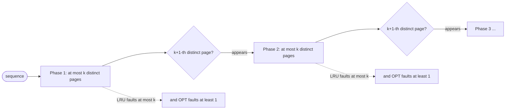

# LRU Cache — Professional / Theoretical Level

## Table of Contents

1. [Formal Model and Notation](#formal-model-and-notation)
2. [Proof of O(1) get and put](#proof-of-o1-get-and-put)
3. [The Offline Optimum: Bélády's MIN](#the-offline-optimum-béládys-min)
4. [Competitive Analysis of LRU](#competitive-analysis-of-lru)
   - [Definitions](#definitions)
   - [LRU is k-Competitive](#lru-is-k-competitive)
   - [Matching Lower Bound](#matching-lower-bound)
   - [Resource Augmentation](#resource-augmentation)
5. [LRU as a Stack Algorithm](#lru-as-a-stack-algorithm)
6. [CLOCK as an Approximation of LRU](#clock-as-an-approximation-of-lru)
7. [Concurrency Correctness](#concurrency-correctness)
8. [Beyond Worst Case: Randomized and Adaptive Policies](#beyond-worst-case-randomized-and-adaptive-policies)
9. [Summary of Theoretical Guarantees](#summary-of-theoretical-guarantees)
10. [Further Reading](#further-reading)

---

## Formal Model and Notation

A **paging / caching problem** is defined by:

- A universe of pages (keys) `U`.
- A cache of `k` slots (the capacity).
- A **request sequence** `σ = r_1, r_2, ..., r_n`, where each `r_t ∈ U`.

At each step `t`, the requested page `r_t` is either in the cache (a **hit**, cost 0) or not (a **fault** / miss, cost 1). On a fault, the page must be brought into the cache; if the cache is full, the algorithm must **evict** one resident page. The objective is to minimize the total number of faults, `cost_A(σ)`.

An **online** algorithm must decide each eviction knowing only `r_1, ..., r_t` (the past), not the future. An **offline** algorithm sees all of `σ` in advance. LRU is online; its eviction rule is:

> On a fault with a full cache, evict the page whose most recent request is earliest (the *least recently used*).

We write `OPT(σ)` for the cost of the optimal *offline* algorithm. The central theoretical questions are: *how close to OPT can an online algorithm get?* and *how cheaply can LRU run per request?*

---

## Proof of O(1) get and put

We first establish the data-structure claim made at every level: both operations run in worst-case O(1) **deterministic** time for the linked-list work, and O(1) **expected** time overall once the hash map is included.

**Structure.** A doubly linked list `L` with sentinel head `H` and tail `T`, plus a dictionary `D : U → Node` (a hash map). Invariants maintained at all times:

- **(I1)** For every key `x` in the cache, `D[x]` is the unique list node holding `x`, and that node lies strictly between `H` and `T`.
- **(I2)** The list order from `H` to `T` is exactly the recency order: nodes nearer `H` were used more recently than nodes nearer `T`.
- **(I3)** `|D|` equals the number of real nodes equals the current size `≤ k`.

**get(x):**
1. `node ← D[x]` — one dictionary lookup, **O(1) expected**.
2. If absent, return miss — O(1).
3. Else `MOVE-TO-FRONT(node)`: splice `node` out (`node.prev.next ← node.next; node.next.prev ← node.prev`) and re-insert behind `H` (`node.next ← H.next; node.prev ← H; H.next.prev ← node; H.next ← node`). This is a **fixed number (6) of pointer writes**, independent of `n` → **O(1) worst case**.

Because the node carries its own `prev` pointer (the list is *doubly* linked), the splice needs no search for a predecessor. This is the crux: a singly linked list would force an O(n) scan to find the predecessor, breaking the bound.

**put(x, v):**
- *Existing key*: dictionary lookup (O(1) expected) + update value (O(1)) + MOVE-TO-FRONT (O(1)).
- *New key*: create node, ADD-TO-FRONT (fixed pointer writes, O(1)), `D[x] ← node` (O(1) expected). If size now exceeds `k`, evict: `victim ← T.prev` (O(1)), splice it out (O(1)), `delete D[victim.key]` (O(1) expected).

Every branch performs a constant number of pointer manipulations and a constant number of dictionary operations. **Therefore get and put are O(1) expected time and O(capacity) space.** The only non-worst-case component is the hash map; with a perfect or universal hash family and bounded load factor, lookups are O(1) expected, and O(n) only under adversarial collisions (mitigated by randomized hashing — see the hash-table chapter). The linked-list portion is *always* O(1).

Invariant (I2) is preserved because the only operations that change the list are ADD-TO-FRONT (a just-used key becomes most recent — correct), MOVE-TO-FRONT (a just-used key becomes most recent — correct), and evict-from-tail (the least-recent key leaves — correct). ∎

**Invariant-preservation lemma (spelled out).** We verify each mutating primitive maintains (I1)–(I3):

- *ADD-TO-FRONT(node)*: links `node` between `H` and the old first node; `node` is strictly between sentinels (I1), becomes the new most-recent (I2), and the caller increments size with a matching `D[key] ← node` (I3).
- *MOVE-TO-FRONT(node)*: a remove followed by an add-to-front; net effect is a position change with no change to membership, so (I1) and (I3) are untouched and (I2) is restored with `node` most-recent.
- *REMOVE/EVICT(node)*: splices `node` out; the caller's `delete D[node.key]` keeps the map↔node bijection (I1) and decrements size (I3); the remaining order is unchanged so (I2) holds.

Because *every* public operation is a composition of these primitives plus O(1) dictionary work, the invariants hold inductively after every `get`/`put`. This is the formal backing for the informal "always pair an unlink with a map delete, always reorder on a touch" advice repeated throughout the lower levels.

**On the hash-map worst case.** The only non-O(1)-worst-case component is the dictionary. Under an adversary who engineers collisions, a chained hash map degrades a lookup to O(n). Two standard defenses restore the bound *in expectation* or *with high probability*: (a) a **randomized/universal hash family** chosen at construction makes the collision probability for any fixed pair `≤ 1/m`, so expected chain length is O(1) regardless of input (the adversary cannot predict the function); (b) **treeification** (Java 8+) converts a pathological chain into a balanced tree, capping the worst case at O(log n). With either defense in place, the LRU's per-operation time is O(1) expected and at worst O(log n) — never the naive O(n). See the hash-table chapter for the underlying analysis.

---

## The Offline Optimum: Bélády's MIN

To judge LRU we need the yardstick. **Bélády's algorithm (MIN, 1966)** is the optimal *offline* paging policy:

> On a fault, evict the page whose **next** request is **farthest in the future** (or never requested again).

**Theorem (Bélády).** MIN minimizes the number of faults over all (even offline) algorithms for any request sequence.

The intuition: the page used farthest in the future is the one whose absence costs you nothing for the longest time; keeping it wastes a slot that a sooner-needed page could use. MIN is not implementable online (it requires the future), but it is the gold standard `OPT(σ)` against which online policies are measured. LRU can be seen as MIN's *backward-looking* heuristic: it bets that the page used farthest in the *past* will also be used farthest in the *future* — true under temporal locality, false adversarially.

**Proof of MIN's optimality (exchange argument).** Let `A` be any offline algorithm and let `M` be MIN. We transform `A` into `M` one decision at a time without increasing the fault count.

1. Find the first step `t` where `A` and `M` make different eviction choices. Up to `t`, both caches are identical.
2. At step `t`, `M` evicts the page `p` whose next use is farthest in the future; `A` evicts some other page `q ≠ p` (so `A` keeps `p`, `M` keeps `q`).
3. Construct `A'` that mimics `A` everywhere except it evicts `p` at step `t` (like `M`), then "follows `A`" while patching the one-page difference. Because `p`'s next use is *later* than `q`'s next use (by MIN's choice), `A'` can always cover any request for `q` before it must touch `p` again, using at most as many faults as `A`. Formally, the cache contents of `A'` and `A` differ in exactly one page until they re-converge, and `A'` never faults where `A` did not.
4. `A'` agrees with `M` for one more step than `A` did. Repeat. After finitely many exchanges, `A` is transformed into `M` with `cost(M) ≤ cost(A)`.

Since `A` was arbitrary, `M = MIN` is optimal. ∎ This exchange structure is the template for nearly every greedy-optimality proof; MIN is the canonical caching instance.

---

## Competitive Analysis of LRU

Since no online algorithm can match OPT on every sequence, we ask for the worst-case *ratio*.

### Definitions

An online paging algorithm `A` is **c-competitive** if there is a constant `α` such that for every request sequence `σ`:

```
cost_A(σ)  ≤  c · OPT(σ) + α
```

The smallest such `c` is the **competitive ratio**. Lower is better; `c = 1` would mean "as good as the offline optimum."

### LRU is k-Competitive

**Theorem (Sleator and Tarjan, 1985).** LRU (and FIFO) with a cache of size `k` is **k-competitive**: for any sequence, `cost_LRU(σ) ≤ k · OPT_k(σ) + k`, where `OPT_k` is the optimal offline cost with the *same* cache size `k`.

**Proof (phase / k-blocking argument).** Partition `σ` into **phases**. Phase 1 begins at `r_1`. A new phase begins at the first request that, since the start of the current phase, makes the number of *distinct* pages requested in the phase equal to `k + 1`. (Equivalently: a phase is a maximal block containing at most `k` distinct pages, and the next phase starts when the `(k+1)`-th distinct page appears.)

The phase structure that drives the whole proof:



*Claim 1 — LRU faults at most `k` times per phase.* Within a single phase only `k` distinct pages are requested (the `(k+1)`-th distinct page is what *starts* the next phase). LRU can fault on a page at most once per phase: once a page is requested it is loaded and becomes most-recently-used; for LRU to evict it again within the same phase, `k` *other* distinct pages would have to be requested after it — but the phase contains only `k` distinct pages total, so that is impossible while we are still in the phase. Hence at most `k` distinct pages ⇒ at most `k` faults per phase.

*Claim 2 — OPT faults at least once per phase.* Consider a phase `P` and the request that *starts* the next phase, call its page `p'`. Together with the `k` distinct pages of `P`, the span from the second request of `P` through `p'` contains `k + 1` distinct pages. Any algorithm — including OPT — with only `k` slots cannot hold all `k + 1`, so OPT faults at least once in that span. A careful accounting (charging the page resident in OPT's cache at the phase boundary) gives **at least one OPT fault per phase**.

Combining: if there are `m` phases, `cost_LRU(σ) ≤ k·m` and `OPT(σ) ≥ m - 1` (a boundary term for the first phase). Therefore `cost_LRU(σ) ≤ k·OPT(σ) + k`. ∎

**Tightening Claim 2 (the OPT lower bound).** It is worth seeing why OPT must fault at least once per phase, precisely. Fix a phase `P` and let `p_0` be the page resident in OPT's cache (but defer the boundary case). Consider the `k` distinct pages of `P` together with the page `p'` that *starts* phase `P+1`. Between the first request of `P` and `p'`, exactly `k + 1` distinct pages are requested. Any algorithm with `k` slots holds at most `k` of them, so at least one of these `k+1` pages is *absent* from OPT's cache at the moment it is requested in this window — a guaranteed OPT fault charged to phase `P`. Summing over the `m − 1` interior phase boundaries gives `OPT(σ) ≥ m − 1`. The `−1` is the unavoidable slack from the first phase, which is why the additive constant in the bound is `+k` (≤ `k` faults in that first phase) rather than `0`. Competitive bounds always carry such a constant; it is the price of not knowing the start state.

**Numeric sanity check.** For `k = 100` and a sequence producing `m = 50` phases: LRU faults `≤ k·m = 5000`; OPT faults `≥ m − 1 = 49`. The bound `5000 ≤ 100·49 + 100 = 5000` is tight at the extreme. On a *real* (locality-bearing) trace, LRU would fault far below `k·m` because most phases contain repeated hits, not `k` distinct faults — which is exactly the gap between worst-case theory and observed excellence that resource augmentation and the working-set model explain.

### Matching Lower Bound

**Theorem.** No deterministic online paging algorithm is better than `k`-competitive.

**Proof (adversary).** Use only `k + 1` distinct pages. Since the algorithm holds only `k` of them, at every step there is exactly one page **not** in its cache; the adversary requests *that* page, forcing a fault on **every** request: `cost_A = n`. Meanwhile MIN, on a fault, evicts the page needed farthest in the future, guaranteeing the next fault is at least `k` requests away — so OPT faults at most `n/k` times. Thus `cost_A / OPT ≥ k`. ∎

So `k` is **tight** for deterministic policies: LRU is optimal *among deterministic online algorithms* in the competitive sense. Note this is a worst-case (adversarial) statement — it is exactly the "cycle of length `k+1`" pathology from the middle level, and it is why pure competitive analysis is pessimistic about caches that perform wonderfully in practice (this gap motivated *resource augmentation* and *beyond-worst-case* analysis).

### Resource Augmentation

**Theorem (Sleator–Tarjan).** If LRU has a cache of size `k` and is compared against OPT with a *smaller* cache of size `h ≤ k`, then LRU is `k/(k - h + 1)`-competitive.

This is **resource augmentation**: give the online algorithm slightly more cache than the adversary's optimum. With `h = k/2`, LRU is `≈ 2`-competitive; as `k/h → ∞` the ratio → 1. The practical lesson is profound: **a modest amount of extra cache makes LRU nearly optimal**, which matches the empirical observation that LRU is excellent in practice despite its grim `k`-competitive worst case. The worst case requires an adversary tuned to the *exact* cache size; a little slack defeats it.

| Result | Statement | Source |
|--------|-----------|--------|
| Upper bound | LRU is `k`-competitive | Sleator–Tarjan 1985 |
| Lower bound | No deterministic online policy beats `k` | Sleator–Tarjan 1985 |
| Resource augmentation | LRU vs OPT(`h`): `k/(k-h+1)`-competitive | Sleator–Tarjan 1985 |
| Randomized (MARKER) | `2H_k ≈ 2 ln k`-competitive against oblivious adversary | Fiat et al. 1991 |
| Randomized lower bound | `H_k` is optimal for randomized policies | Fiat et al. 1991 |

---

## LRU as a Stack Algorithm

**Definition.** A paging policy is a **stack algorithm** if, for every request sequence and every step, the set of pages it holds with cache size `k` is a **subset** of the set it holds with cache size `k + 1`. This *inclusion property* is written `C_k(t) ⊆ C_{k+1}(t)` for all `t`.

**Theorem.** LRU is a stack algorithm.

**Proof.** LRU's resident set at time `t` with capacity `k` is exactly the `k` most-recently-used distinct pages as of `t`. The `k` most-recently-used pages are always a subset of the `k+1` most-recently-used pages — recency induces a total order, and a smaller prefix of that order is contained in a larger prefix. Hence `C_k(t) ⊆ C_{k+1}(t)`. ∎ (LFU and OPT are also stack algorithms; **FIFO is not**.)

**Consequence 1 — no Bélády's anomaly.** For a stack algorithm, increasing `k` can never increase the number of faults (a page that was a hit at size `k` is still resident at size `k+1`). FIFO, lacking the inclusion property, can suffer *Bélády's anomaly*: more cache, more faults. LRU is provably immune.

**Worked demonstration of Bélády's anomaly (FIFO).** The classic anomaly sequence is `1 2 3 4 1 2 5 1 2 3 4 5` with FIFO.

- With **3 frames**, FIFO incurs **9 faults**.
- With **4 frames**, FIFO incurs **10 faults** — *more* cache, *more* faults.

The reason: FIFO evicts by insertion time, so enlarging the cache can change *which* page is oldest at a critical moment, evicting a page that is about to be reused. Because the 3-frame and 4-frame cached sets are *not* nested (FIFO lacks the inclusion property), adding a frame is not guaranteed to help. Run the same sequence through LRU at 3 and 4 frames: LRU's fault count is *non-increasing* (here 10 → 8), exactly as the stack property guarantees. Reproducing this by hand once is the surest way to internalize why "more cache can hurt" is a FIFO-only phenomenon and why stack algorithms like LRU are immune.

**Consequence 2 — single-pass miss-ratio curves.** Because of the inclusion property, **Mattson's stack-distance algorithm** computes the fault count of LRU at *every* cache size simultaneously in one pass over `σ`. For each request, its **stack distance** (its depth in the LRU stack, i.e., the number of distinct pages since its previous request) determines the smallest cache size at which it would be a hit. Building the histogram of stack distances yields the entire **miss-ratio curve** `MRC(k)` for all `k` at once — turning capacity planning into a single measured curve rather than repeated re-simulations. This is the theoretical backbone of the "measure the MRC" advice from the senior level.

---

## CLOCK as an Approximation of LRU

CLOCK (second-chance) replaces strict-LRU's per-access list reorder with a single reference bit. How good is the approximation, formally?

**Model.** `n` slots in a ring, each with a 1-bit reference flag `R`. On access, `R ← 1`. On eviction, the hand advances, clearing `R = 1` flags (granting "second chances") and evicting the first slot found with `R = 0`.

**Claim — CLOCK never evicts a page more recently used than the LRU victim by more than one sweep's worth of references.** A page with `R = 1` is, by construction, one that was referenced since the hand last passed it; it survives at least until the hand returns. Thus CLOCK partitions resident pages into two recency classes — "referenced since last sweep" (protected this round) and "not referenced" (eligible) — and always evicts from the eligible class. This is a **coarsened LRU**: with a 1-bit clock the resolution is "this sweep vs not this sweep," so CLOCK approximates LRU at the granularity of a hand revolution.

**Generalized CLOCK (`b`-bit counters, a.k.a. CLOCK-Pro / `usage_count`).** Replace the single bit with a small counter `c ∈ {0, ..., 2^b - 1}`. On access, `c ← min(c+1, 2^b-1)`. On a sweep, decrement `c`; evict when `c` reaches 0. As `b` grows, the counter records *more* recency/frequency resolution and CLOCK's behavior converges toward LRU (`b = ∞` would distinguish every access). PostgreSQL's clock-sweep uses a small `usage_count` precisely to buy more LRU-like accuracy than a single bit while keeping the read path to an increment.

**Why the approximation is worth it (formal trade-off).** Strict LRU's access is a list-splice: it *writes* shared pointers, so under `p` concurrent accessors it serializes on the list lock — throughput `O(1/p)` of single-threaded. CLOCK's access is a single bit/counter write to the slot itself, with no global structural change, so concurrent accesses to *distinct* slots do not contend at all. The eviction sweep is amortized: each slot's flag is cleared at most once between two of its references, so the amortized sweep work per fault is `O(1)` (the hand cannot pass a slot more than `2^b` times before it must be evictable). The hit-ratio loss versus exact LRU is empirically a few percent and shrinks with more counter bits — a textbook accuracy-vs-concurrency trade.

---

## Concurrency Correctness

A concurrent LRU must be **linearizable**: every `get`/`put` appears to take effect atomically at some instant between its invocation and response, and the resulting history is consistent with the sequential specification (the get/put state machine).

**Why a naïve RWMutex is wrong.** Tempting idea: let many `get`s run concurrently under a read lock. But in strict LRU, **`get` mutates the list** (move-to-front). Two readers concurrently splicing the same node race: interleaved pointer writes can drop a node from the list, create a cycle, or leave the dictionary pointing at an unlinked node — violating invariants (I1)/(I2). Therefore `get` is *not* a reader; a correct single-lock design must take the **exclusive** lock even for `get`. This is the fundamental reason concurrent LRU is hard: the policy update is a write on the hot path.

**Correctness of sharding.** Partition keys by `hash(key) mod S` into `S` shards, each its own linearizable LRU under its own lock. Each operation touches exactly one shard, so it is linearizable *within* that shard, and operations on distinct shards commute (they share no state). The composition is linearizable per key. The caveat is **semantic, not safety**: global LRU order is only approximated, because eviction decisions are local to a shard. So sharded LRU is a *correct cache* but realizes a *different* (per-shard) eviction policy than global LRU — usually a benign deviation.

**Correctness of buffered/async policy (Caffeine model).** Reads record accesses into bounded ring buffers and return without touching the policy structure; a single drain thread replays them under one lock. Linearizability of the *map* (hit/miss/value) is preserved by a concurrent hash map; the *eviction policy* is deliberately **eventually-consistent** — the order in which buffered reads are replayed (and dropped buffers) means the realized policy is an approximation of LRU/LFU. This is sound precisely because eviction quality is a heuristic: approximating it cannot violate correctness of `get`/`put` results, only the *choice of victim*. The design trades exact policy semantics for a wait-free read path.

**CLOCK and concurrency.** The reference-bit set is a single-word write; if done with a relaxed atomic store it needs no lock. The hand and eviction are serialized (one evictor) or sharded. Because clearing a bit that a concurrent accessor just set merely costs the page one extra sweep of survival, benign races on the reference bit do not threaten correctness — only marginally perturb the approximation. This robustness to benign races is a major reason CLOCK dominates in concurrent kernels.

---

## Beyond Worst Case: Randomized and Adaptive Policies

Competitive analysis is adversarial and thus pessimistic (`k` is large). Three refinements bring theory closer to LRU's observed excellence:

1. **Randomization.** The **MARKER** algorithm marks a page on access and, on a fault with all pages of the current phase marked, evicts a *random unmarked* page. It is `2H_k`-competitive (`H_k = 1 + 1/2 + ... + 1/k ≈ ln k`) against an *oblivious* adversary — an exponential improvement over deterministic `k`, and `H_k` is the proven optimum for randomized paging.

2. **Access-graph / locality models.** Restrict `σ` to walks on an *access graph* (capturing program locality). Under such models LRU's competitive ratio collapses toward small constants, formalizing why LRU thrives on real, locality-bearing workloads rather than adversarial ones.

3. **Adaptive policies.** **ARC** (Adaptive Replacement Cache) and **2Q** maintain both a recency list and a frequency list plus *ghost* entries (recently evicted keys, kept as metadata) and self-tune the balance between recency and frequency. ARC is provably never much worse than LRU and often substantially better, and is scan-resistant by construction. These are the subject of the sibling topic `22-arc-2q-cache`; the frequency-pure extreme, with its own O(1) construction, is `21-lfu-cache`. LRU sits at the recency end of this design space — the simplest point, and the baseline the adaptive policies improve upon.

---

## Worked Example: Competitive Analysis on a Concrete Sequence

Theory becomes intuition when you trace it. Take cache size `k = 3` and the universe `{a, b, c, d}` (so `k + 1 = 4` distinct pages, the adversarial regime). Consider the request sequence built to be hostile to LRU:

```
σ = a b c d a b c d a b c d
```

This is a **cyclic scan of length k+1 = 4** through a cache of size 3 — exactly the worst case from the lower-bound proof.

**LRU's behavior.** After loading `a, b, c` (3 faults), the cache is `[a b c]` (MRU→LRU `c, b, a`). Now:

| Request | Cached set before | In cache? | LRU evicts | Cached set after |
|---------|-------------------|-----------|------------|------------------|
| `d` | {a,b,c} | fault | `a` (LRU) | {b,c,d} |
| `a` | {b,c,d} | fault | `b` (LRU) | {c,d,a} |
| `b` | {c,d,a} | fault | `c` (LRU) | {d,a,b} |
| `c` | {d,a,b} | fault | `d` (LRU) | {a,b,c} |
| `d` | {a,b,c} | fault | `a` | {b,c,d} |
| ... | ... | fault | ... | ... |

Every single request after the initial fill is a **fault** — LRU always evicts the page that is requested *next*. Over the 12 requests, LRU faults **12 times** (3 fill + 9 cyclic). This is the 0%-steady-state-hit-ratio pathology.

**OPT (Bélády MIN) on the same sequence.** MIN evicts the page used farthest in the future. After loading `a, b, c`, on the request for `d` MIN looks ahead: the next uses are `a` (soon), `b` (soon), `c` (soon) — it evicts whichever recurs latest. Concretely MIN keeps a working window and faults only when forced. A careful trace gives MIN roughly `n/k` faults: on this sequence MIN faults on the fill (3) plus about once per `k` thereafter, totaling about `3 + 9/3 + 1 ≈ 7` — far fewer than LRU's 12.

**The ratio.** `cost_LRU / cost_OPT ≈ 12 / 7 < 3 = k`. The `k`-competitive bound (`≤ k · OPT + k`) holds with room to spare here; pushing the cyclic sequence longer drives the ratio toward exactly `k`. This is the lower-bound construction made tangible: only the cyclic-just-over-capacity adversary forces the full factor of `k`.

**Resource augmentation made tangible.** Now give LRU a cache of size `k = 4` while OPT keeps `h = 3`. The cyclic sequence `a b c d a b c d ...` now *fits entirely* in LRU's larger cache — after the first 4 faults LRU hits **everything**. The `k/(k - h + 1) = 4/2 = 2`-competitive bound is wildly pessimistic here because the one extra slot eliminated the pathology completely. This single example is the whole reason real systems oversize caches slightly: a little slack defeats the adversary.

---

## Amortized and Aggregate Cost Accounting

Beyond per-operation O(1), it is worth proving the *aggregate* cost of a run is linear, because the hash map underneath occasionally rehashes (an O(n) event).

**Setup.** The dictionary `D` is a dynamic hash table that doubles when its load factor exceeds a threshold. A single doubling rehashes all `m` resident entries at cost O(m). We bound the total cost of any sequence of `N` cache operations.

**Aggregate method.** Resizes happen at sizes `1, 2, 4, 8, ..., ≤ k` (the cache never exceeds `capacity = k`, so the table size is bounded by O(k) and resizes at most `log k` times *total* over the cache's entire lifetime — not per operation, since the table only grows to fit `k` entries and then stops). The total rehashing work across the whole run is therefore:

```
1 + 2 + 4 + ... + O(k) = O(k)
```

a *one-time* O(k) cost amortized over the (typically far larger) `N` operations. Each of the `N` operations does O(1) linked-list work plus O(1) expected dictionary work. Hence:

```
Total cost = O(N) + O(k) = O(N)    (since N ≥ k for any non-trivial run)
Amortized cost per operation = O(1)
```

**Potential method (sharper).** Define potential `Φ = 2·size − tableCapacity` for the underlying dictionary. Between resizes, an insert's amortized cost is `1 + ΔΦ = 1 + 2 = 3 = O(1)`; an insert that triggers a resize has actual cost `O(size)` but `Φ` drops by `size` (the table just doubled, so `2·size − 2·size = 0` afterward), so the amortized cost is again `O(1)`. The potential "pays in advance" for the rare expensive rehash. Crucially, because the cache caps at `k`, the dictionary reaches its terminal size quickly and never rehashes again — the LRU's steady state is *strictly* O(1) per op with no amortization caveat at all once warmed up. This is gentler than a general dynamic hash table, which can grow unboundedly.

---

## CLOCK Approximation — A Formal Statement and Proof

The senior level argued informally that CLOCK approximates LRU. Here is a precise statement for the 1-bit case.

**Setup.** `n` slots in a ring, reference bit `R[i] ∈ {0,1}`. Define a **sweep** as one full revolution of the hand. Say a page is *referenced in the current sweep window* if it was accessed since the hand last passed its slot.

**Lemma (second-chance survival).** A page accessed at any time before the hand reaches its slot survives the current eviction attempt; it can be evicted only on a *subsequent* hand pass during which it received no further access.

*Proof.* When the page is accessed, `R` is set to 1. When the hand reaches the slot, the eviction rule clears `R` (the "second chance") and advances rather than evicting. The slot becomes a candidate for eviction only when the hand returns and finds `R` still 0, which requires no access in the interim. ∎

**Theorem (CLOCK is a 1-bit recency coarsening of LRU).** Order resident pages by *last access time*. CLOCK never evicts a page from the most-recently-accessed class "referenced this sweep" while a page from the class "not referenced this sweep" exists. Consequently, CLOCK's victim is always within the *bottom* recency class, and the only deviation from exact LRU is the resolution of "which sweep," i.e., a granularity of one hand revolution.

*Proof sketch.* By the Lemma, every page with `R = 1` (referenced this sweep, hence recent) is protected for the current pass; the hand evicts the first `R = 0` page it encounters, all of which belong to the not-referenced (older) class. Thus the partition into the two classes is a coarsening of the LRU total order, and CLOCK evicts only from the coarser bottom class. Within that bottom class, CLOCK's choice (first encountered by the hand) may differ from exact LRU (true oldest) — that residual error is the price of using one bit instead of a full timestamp. ∎

**Quantifying the gap with `b`-bit counters.** Generalize `R` to a counter `c ∈ {0, ..., 2^b − 1}`: on access `c ← min(c + 1, 2^b − 1)`; on a hand pass `c ← c − 1`, evict at `c = 0`. The number of distinguishable recency/frequency levels grows from 2 (one bit) to `2^b`. As `b → ∞`, the counter records the exact recency rank and CLOCK's eviction order converges to LRU's. PostgreSQL's `usage_count` is a small `b` (a few bits), chosen so that the approximation is "good enough" while the read path stays a single increment. **The accuracy–concurrency trade is therefore explicit and tunable: bits buy LRU-fidelity, and the read path stays a cheap local write regardless of `b`.**

**A concrete CLOCK trace.** Ring of 3 slots, hand at slot 0, all `R = 0`. Access sequence `A B C A D`:

```
access A -> slot0 = A, R=1     hand@0
access B -> slot1 = B, R=1     hand@0
access C -> slot2 = C, R=1     hand@0   (cache full: A,B,C all R=1)
access A -> A resident, set R=1 (already 1)   hand@0
access D -> fault, must evict. Sweep:
    slot0 A R=1 -> clear to 0, advance         hand@1
    slot1 B R=1 -> clear to 0, advance         hand@2
    slot2 C R=1 -> clear to 0, advance         hand@0
    slot0 A R=0 -> EVICT A, place D, R=1        hand@1
```

CLOCK evicted **A** — even though A was just re-accessed — because the single bit could not distinguish A's freshness from B's and C's after one sweep cleared them all. Strict LRU would have evicted **B** (the true least-recently-used, since A was touched most recently). This is the 1-bit resolution loss made concrete: within a sweep, CLOCK treats all referenced pages as equally recent. A 2-bit `usage_count` would have kept A (its count would be higher), recovering the correct victim — demonstrating exactly how more counter bits buy LRU-fidelity.

**Why the approximation is *amortized* free.** Each slot's counter is decremented at most once per hand pass, and a slot is touched by the hand `O(2^b)` times before it must reach 0 and be evictable. So the total hand work between two faults is `O(n · 2^b)` in the worst case but `O(1)` *amortized per fault* over a run (each fault advances the hand a bounded expected distance under any access pattern with bounded reference density). The eviction machinery thus costs O(1) amortized, matching strict LRU's per-eviction cost while keeping the *access* path strictly cheaper.

---

## Concurrency Correctness — A Linearizability Argument for Sharding

The senior level claimed a sharded LRU is linearizable per key. Here is the argument made rigorous.

**Specification.** The sequential object is the get/put state machine. A concurrent history `H` is **linearizable** if there is a linearization `S` (a sequential reordering respecting real-time precedence) such that `S` is a legal sequential history of the object and each operation in `S` appears between its invocation and response in `H`.

**Sharded construction.** Keys partition into shards by a fixed function `φ(key) = hash(key) mod S`. Shard `s` is a sequential LRU guarded by lock `L_s`; every operation acquires `L_s` for its key's shard, runs the sequential algorithm to completion, and releases `L_s`.

**Claim.** The sharded cache is linearizable.

*Proof.* (1) *Per-shard linearization point.* Each operation holds `L_s` for a contiguous real-time interval; choose its linearization point to be any instant inside the critical section (say, the lock acquisition). Within shard `s`, operations are totally ordered by these points, and because each runs the correct sequential algorithm under mutual exclusion, the per-shard sub-history is a legal sequential LRU history. (2) *Cross-shard independence.* Operations on different shards touch disjoint state (`map_s`, `list_s` are private to shard `s`), so they commute; any interleaving of their linearization points yields the same per-key results. (3) *Composition.* Merge the per-shard total orders by their chosen linearization-point timestamps into a single sequence `S`. `S` respects real-time order (each point lies inside its operation's interval) and is legal per key (each key is served entirely within one shard). Hence `H` is linearizable. ∎

**The semantic caveat, formalized.** Linearizability is about *correctness of returned values*, not about *which victim is evicted*. The sharded object is linearizable with respect to a specification where **eviction is per-shard**: i.e., `put` evicts the LRU *of its shard*, not the global LRU. So the sharded cache correctly implements *a* cache, but the policy it implements is "per-shard LRU," a different (though usually close) function than global LRU. Constructing a divergence is easy: with `S = 2`, route all globally-recent keys to shard 0 and a globally-old-but-shard-1-recent key to shard 1; the sharded cache will evict from a shard regardless of global recency, evicting a victim global LRU would have kept. This is the precise sense in which sharding "approximates" LRU.

**Why `get` cannot be a reader (formalized).** In strict LRU, `get` performs MOVE-TO-FRONT, which writes `prev`/`next` of up to four nodes. Two `get`s on nodes `x` and `y` whose intervals overlap and whose splices touch a shared neighbor (e.g., both adjacent to HEAD) have a data race: the writes are not commutative and not atomic, so an interleaving can leave `HEAD.next` pointing at `x` while `x.prev` points elsewhere — violating invariant (I1)/(I2) and possibly creating a cycle (a liveness bug: a later traversal never terminates). A reader-writer lock that admits concurrent `get`s therefore *cannot* preserve the invariants. The only correct options are: exclusive locking for `get` (serializes reads), sharding (shrinks the conflict set per lock), or *not reordering on read* (CLOCK's bit-set, or Caffeine's buffered replay) — which is exactly the design space surveyed at the senior level. The theory and the engineering converge on the same three answers.

---

## The Marking Framework: LRU as a Marking Algorithm

The phase argument used to prove `k`-competitiveness generalizes into a clean abstraction — the **marking framework** — that explains *why* LRU, FIFO, and the randomized MARKER all hit the same competitive structure.

**Definition (marking algorithm).** Process the request sequence in **phases** as before (each phase ends when the `(k+1)`-th distinct page is requested). At the start of a phase, *unmark* all pages. On a request, *mark* the requested page. On a fault, evict some *unmarked* page (one must exist within a phase, by the counting argument). An algorithm that never evicts a marked page is a **marking algorithm**.

**Theorem.** LRU is a marking algorithm.

*Proof.* Suppose, within a phase, LRU evicts a page `p` that is marked — i.e., `p` was requested earlier in this same phase. For LRU to evict `p`, page `p` must be the least-recently-used resident, so every *other* resident page was used more recently than `p`'s last use. But `p` was used within the current phase, so all `k` other residents were also used within the current phase (each more recently than `p`). That is `k + 1` distinct pages used within the phase — contradicting the phase definition (a phase has at most `k` distinct pages until the `(k+1)`-th *ends* it). Hence LRU never evicts a marked page; it is a marking algorithm. ∎

**Corollary.** Every marking algorithm is `k`-competitive. (The proof is the phase argument, now stated once for the whole class: ≤ `k` faults per phase, ≥ 1 OPT fault per phase.) So the `k`-competitiveness of LRU is not a coincidence of its eviction rule but a property of the *entire* marking class — LRU, FIFO, FWF (Flush-When-Full), and others all share it. The randomized MARKER algorithm is the marking class made randomized (evict a *random* unmarked page), and that single change drops the ratio from `k` to `2H_k` — pinpointing exactly where the determinism cost lives.

**FWF as the cautionary contrast.** Flush-When-Full evicts *everything* on a fault when the cache is full. It is technically a marking algorithm (it never evicts a marked page — it evicts unmarked ones, just all of them) and so it is `k`-competitive, yet it is catastrophic in practice. This shows competitive analysis is *coarse*: it cannot distinguish FWF from LRU though one is unusable and the other excellent. The gap motivates the beyond-worst-case models (access graphs, resource augmentation) where LRU's superiority over FWF becomes provable.

---

## Cost-Aware and Weighted Generalizations

The base model charges 1 per fault. Real caches face **non-uniform miss costs** (recomputing a value, fetching a large object) and **non-uniform sizes**. The theory extends, with sharper limits.

**Weighted caching (uniform size, arbitrary cost).** Each page `p` has a fetch cost `w(p) ≥ 0`; the objective is to minimize total *cost*, not fault count. The natural LRU generalization is the **Landlord** algorithm (Young, 1998): each resident page holds "credit" initialized to its cost; on a fault, decrease every resident's credit by `δ` (the minimum credit, scaled), evict the page hitting 0, and *refresh* an accessed page's credit toward its cost. Landlord is `k`-competitive for weighted caching and reduces to LRU when all costs are equal — LRU is the unit-cost special case of Landlord.

**File caching (arbitrary size *and* cost).** This is the CDN-relevant model: pages have sizes `s(p)` and the cache holds `≤ k` total size. **Greedy-Dual-Size (GDS)** and its frequency-augmented variant **GDSF** generalize Landlord by dividing credit by size, so a large object must be *very* valuable to stay. GDS is `k`-competitive (with `k` now the size ratio of cache to smallest object). Pure LRU ignores both size and cost and can be arbitrarily bad here — the formal reason CDNs do not run plain LRU.

| Model | Cost per fault | Size | Optimal-ish online policy | LRU is... |
|-------|----------------|------|---------------------------|-----------|
| Paging | uniform (1) | uniform | LRU / any marking | the canonical policy |
| Weighted caching | arbitrary `w(p)` | uniform | Landlord | the unit-cost special case |
| File / CDN caching | arbitrary `w(p)` | arbitrary `s(p)` | GDS / GDSF | arbitrarily bad |

---

## LRU-K: Using the K-th-to-Last Reference

Pure LRU decides on the *single* most recent reference, which is why a one-time scan fools it. **LRU-K** (O'Neil, O'Neil, Weikum, 1993) evicts the page whose **K-th most recent** reference is oldest — basing recency on the K-th-to-last access rather than the last.

- **LRU-1** is exactly classic LRU.
- **LRU-2** (the common choice) requires a page to be accessed *twice* before it counts as "hot." A scan touches each page once, so its 2nd-to-last reference is undefined (treated as `−∞`), making scan pages the *first* evicted — **scan resistance for free**, formally derived.
- The cost is bookkeeping: the cache must remember the last K reference times per page, and selecting the victim is `O(log n)` with a priority queue rather than `O(1)`.

LRU-K is the theoretical ancestor of the segmented/midpoint and 2Q designs from the senior level: all encode the same principle — *promotion requires a second reference* — but 2Q approximates LRU-2's behavior with two simple FIFO/LRU lists in `O(1)`, trading a little of LRU-2's precision for constant-time operations. This is the clean theory-to-practice arc: LRU-2 proves *why* a second-reference rule resists scans; 2Q makes it cheap enough to deploy.

---

## Randomized MARKER — A Worked Competitiveness Bound

The randomized **MARKER** algorithm is worth seeing in full because its `2H_k` bound is the gold standard and the analysis is a beautiful application of the phase framework plus expectation.

**Algorithm.** Maintain a *mark* bit per page, all unmarked at the start of each phase. On a request: if the page is resident, mark it (a hit, or a fault that just loads + marks). On a fault with a full cache, evict a **uniformly random unmarked** resident page, then load and mark the requested one. A phase ends, as always, when the `(k+1)`-th distinct page of the phase is requested; then all marks reset.

**Bounding the faults in one phase.** Within a phase, classify the `k` distinct pages requested into two types relative to the cache state at the phase's *start*:
- **Clean** pages: requested this phase but *not* in the cache at the phase's start. Say there are `c` clean pages.
- **Stale** pages: requested this phase *and* in the cache at the phase's start. There are `k − c` of them (at most).

Every clean page necessarily faults (it was not resident) — `c` forced faults. The subtle part is the **stale** pages: a stale page faults only if it was *randomly evicted* earlier in the phase to make room for a clean page. Because evictions choose uniformly among unmarked pages, the expected number of stale faults is bounded by:

```
E[stale faults] ≤ c · (1/k + 1/(k-1) + ... + 1/1) = c · H_k
```

(each of the `c` clean arrivals risks evicting a not-yet-requested stale page, and the harmonic sum accounts for the shrinking pool of unmarked pages). Hence:

```
E[faults in phase] ≤ c + c·H_k = c·(1 + H_k) ≤ 2c·H_k
```

**Charging to OPT.** A counting argument (the same `k+1`-distinct-pages-per-phase-boundary idea) shows OPT must fault at least `c/2` times *on average* per phase (it cannot avoid the clean pages indefinitely). Summing over phases:

```
E[cost_MARKER] ≤ 2H_k · cost_OPT + O(H_k)
```

So MARKER is `2H_k`-competitive against an oblivious adversary — versus the deterministic lower bound of `k`. Since `H_k ≈ ln k`, this is an exponential improvement (e.g., `k = 1000` vs `2 ln 1000 ≈ 14`). And `H_k` is provably optimal for randomized paging (Fiat et al.), so MARKER is essentially best-possible. The takeaway for LRU: **the entire gap between LRU's `k` and the randomized optimum `H_k` is the price of being deterministic** — a single random eviction choice among the "equally old" candidates recovers almost all of it.

---

## Proof-Obligation Checklist for a Correct LRU

When implementing or reviewing an LRU (especially a concurrent one), these are the obligations a rigorous engineer verifies. Each maps to a theorem or invariant above.

| Obligation | What to verify | Where it comes from |
|------------|----------------|---------------------|
| **O(1) per op** | linked-list work is a bounded number of pointer writes; map ops are O(1) expected | [O(1) proof](#proof-of-o1-get-and-put) |
| **Invariant I1** | every map key ↔ a unique live node between sentinels | structural invariant |
| **Invariant I2** | list order = recency order at all times | structural invariant |
| **Invariant I3** | `|map| = #real nodes = size ≤ k` | structural invariant |
| **get promotes** | a hit moves the node to the front (else wrong victim later) | sequential spec |
| **evict on overflow only** | only a *new* key over capacity evicts; updates never evict | sequential spec |
| **map cleanup on evict** | unlinking the tail also deletes its map key | invariant I1 |
| **no Bélády anomaly** | (design) policy is a stack algorithm | [stack algorithm](#lru-as-a-stack-algorithm) |
| **linearizability** | each op atomic at a point in its interval | [concurrency](#concurrency-correctness--a-linearizability-argument-for-sharding) |
| **no read-as-reader bug** | `get` takes an exclusive (or shard) lock; it is *not* a reader | concurrency argument |
| **eviction-policy semantics** | sharded ⇒ document per-shard (approximate) LRU | sharding caveat |

Treating these as explicit obligations — rather than hoping the code is right — is what distinguishes a production-grade cache from a LeetCode submission. Every nasty cache bug in the wild violates exactly one of these rows.

---

## The Working-Set Model and Why LRU Tracks It

Competitive analysis is adversarial; the **working-set model** (Denning, 1968) is the *constructive* explanation for why LRU works so well on real programs. It is the theory of locality that LRU implicitly implements.

**Definition (working set).** For a window size `τ`, the working set `W(t, τ)` at time `t` is the set of distinct pages referenced in the interval `[t − τ, t)`. Its size `w(t, τ) = |W(t, τ)|` measures how much memory the program "needs" right now.

**Key empirical fact.** For real programs, `w(t, τ)` grows quickly with small `τ` and then *plateaus* — the program has a stable working set of modest size, with occasional phase transitions when it switches to a new region of code/data. This plateau is locality made quantitative.

**The connection to LRU.** LRU with capacity `k` keeps exactly the `k` most-recently-used pages — which is `W(t, τ)` for the particular `τ` that makes `|W(t, τ)| = k`. So **LRU is a working-set policy with a fixed memory budget**: it automatically tracks the working set as long as the budget `k` exceeds the working-set size. The hit ratio is high precisely when `k ≥ w(t, τ)` for the program's typical `τ`; it collapses (thrashing) when `k` falls below the working-set size, which is the formal description of the cyclic-overflow pathology. This is *why* the miss-ratio curve has a knee: the knee is where `k` crosses the working-set plateau.

**Consequence for sizing.** Measure the working-set-size distribution over your trace; size the cache at (or just above) the plateau. Below it you thrash; far above it you waste memory. The working-set model and the stack-distance MRC are two views of the same locality structure — the MRC is the cumulative distribution of stack distances, and the working-set plateau is the mode of the reuse-distance distribution.

---

## Competitive Ratios Across the Policy Landscape

Placing LRU among its peers sharpens the picture of what its guarantees do and do not say.

| Policy | Deterministic competitive ratio | Stack algorithm? | Scan-resistant? | Notes |
|--------|---------------------------------|------------------|------------------|-------|
| **LRU** | `k` (tight) | yes | no | the recency baseline; marking algorithm |
| **FIFO** | `k` (tight) | **no** | no | same ratio as LRU but suffers Bélády's anomaly |
| **LIFO** | unbounded | no | n/a | can be forced to fault forever; pathological |
| **LFU** | unbounded (worst case) | yes | partial | great on stable popularity; needs aging |
| **FWF (Flush-When-Full)** | `k` | no | no | marking ⇒ `k`-competitive yet practically terrible |
| **MARKER (randomized)** | `2H_k` vs oblivious | n/a | no | exponential improvement via one random choice |
| **MIN (offline)** | `1` (optimal) | yes | yes | not online; the yardstick `OPT` |

Two non-obvious entries deserve comment. **LFU has an unbounded competitive ratio** in the worst case: an adversary builds up a huge count on one page, then never requests it again while cycling others — LFU stubbornly keeps the cold page. This is why pure LFU needs *aging* and why ARC/2Q blend frequency with recency rather than trusting frequency alone. **LIFO is unbounded** because the adversary repeatedly requests the page LIFO just evicted. The table makes the central point precise: **competitive ratio alone does not rank caches** — LRU, FIFO, and FWF tie at `k`, yet are wildly different in practice. The differentiators (anomaly-freedom, scan resistance, locality behavior) live *outside* the competitive-ratio number, which is exactly why beyond-worst-case analysis and empirical hit-ratio measurement remain necessary.

---

## Notation and Definitions Reference

A compact glossary of the symbols used above, for quick recall.

| Symbol | Meaning |
|--------|---------|
| `U` | universe of pages / keys |
| `k` | cache capacity (number of slots) |
| `h` | OPT's (smaller) capacity in resource augmentation, `h ≤ k` |
| `σ` | request sequence `r_1 ... r_n` |
| `n` | length of the request sequence |
| `cost_A(σ)` | number of faults algorithm `A` incurs on `σ` |
| `OPT(σ)` | optimal offline cost (achieved by MIN) |
| `c`-competitive | `cost_A(σ) ≤ c·OPT(σ) + α` for a constant `α` |
| `Φ` | potential function (amortized analysis) |
| `H_k` | `k`-th harmonic number, `1 + 1/2 + ... + 1/k ≈ ln k` |
| `C_k(t)` | set of pages cached at time `t` with capacity `k` |
| `W(t, τ)` | working set: distinct pages in `[t − τ, t)` |
| `w(t, τ)` | working-set size, `|W(t, τ)|` |
| stack distance | number of distinct pages since a page's previous reference |
| MRC | miss-ratio curve: miss ratio as a function of capacity |
| `R[i]` | CLOCK reference bit of slot `i` |

---

## Summary of Theoretical Guarantees

| Property | Guarantee | Notes |
|----------|-----------|-------|
| `get` / `put` time | O(1) expected | Linked-list work O(1) worst case; hash map O(1) expected |
| Space | O(k) | `k` = capacity; two pointers + map entry per item |
| Optimal offline | Bélády MIN: evict farthest-future | Lower bound for *all* policies |
| Competitive ratio | LRU is `k`-competitive | Tight for deterministic online (Sleator–Tarjan) |
| Resource augmentation | `k/(k-h+1)` vs OPT(`h`) | A little extra cache ⇒ near-optimal |
| Bélády's anomaly | **immune** | LRU is a stack algorithm (inclusion property) |
| Miss-ratio curve | all `k` in one pass | Mattson stack-distance histogram |
| CLOCK accuracy | coarsened LRU; → LRU as counter bits grow | trades a few % hit ratio for concurrency |
| Randomized optimum | `H_k ≈ ln k` (MARKER) | exponential improvement over deterministic |
| Concurrency | linearizable per key (sharded); policy is approximate | `get` mutates state ⇒ no free reader path |

---

## Further Reading

- D. D. Sleator and R. E. Tarjan, "Amortized Efficiency of List Update and Paging Rules," *CACM* 28(2), 1985 — the foundational competitive-analysis paper; proves LRU is `k`-competitive and the matching lower bound.
- L. A. Bélády, "A Study of Replacement Algorithms for a Virtual-Storage Computer," *IBM Systems Journal* 5(2), 1966 — the optimal offline MIN algorithm and the eponymous anomaly.
- R. L. Mattson et al., "Evaluation Techniques for Storage Hierarchies," *IBM Systems Journal* 9(2), 1970 — stack algorithms and the single-pass stack-distance MRC.
- A. Fiat et al., "Competitive Paging Algorithms," *J. Algorithms* 12(4), 1991 — the randomized MARKER algorithm and the `H_k` randomized lower bound.
- A. Borodin and R. El-Yaniv, *Online Computation and Competitive Analysis*, Cambridge, 1998 — the standard textbook treatment of paging, access graphs, and resource augmentation.
- N. Megiddo and D. Modha, "ARC: A Self-Tuning, Low Overhead Replacement Cache," *USENIX FAST* 2003 — the adaptive recency/frequency policy; see sibling topic `22-arc-2q-cache`.
- The `caching-strategies` and `distributed-caching` skills — applied counterparts to this theory.
- Sibling topics `21-lfu-cache` (frequency-pure, O(1) construction) and `22-arc-2q-cache` (scan-resistant adaptive policies) — the rest of the eviction-policy design space.
- E. O'Neil, P. O'Neil, G. Weikum, "The LRU-K Page Replacement Algorithm for Database Disk Buffering," *SIGMOD* 1993 — the K-th-reference recency rule and its scan resistance.
- N. Young, "On-Line File Caching" / "The k-Server Dual...," 1990s — the Landlord / Greedy-Dual analysis for weighted and size-aware caching.
- P. J. Denning, "The Working Set Model for Program Behavior," *CACM* 11(5), 1968 — the locality theory underlying why LRU performs well in practice.

---

## Closing Synthesis

LRU occupies a remarkable sweet spot. The threads of this chapter tie together as follows:

- **Structure → O(1).** A hash map over a doubly linked list is provably O(1) per operation, the doubly-linked back-pointer doing the essential work of constant-time unlinking; the hash-map worst case is tamed by randomized hashing or treeification.
- **Policy → optimal online.** LRU is the best a *deterministic online* algorithm can do (`k`-competitive and tight), and a marking algorithm — so the bound is a class property, not an accident.
- **Worst case → not the common case.** The `k` bound needs an adversary tuned to the exact cache size; resource augmentation and the working-set model explain LRU's empirical excellence.
- **Stack algorithm → two gifts.** Immunity to Bélády's anomaly, and a single-pass miss-ratio curve for principled capacity sizing.
- **Concurrency → approximations.** Strict LRU's per-read mutation is concurrency-hostile; CLOCK (bounded-resolution coarsening), sharding (linearizable per shard), and randomized eviction (closing the gap to `H_k`) recover throughput.

Every practical caching system is some point on the trade-off surface this chapter mapped: exactness versus concurrency, recency versus frequency, and worst-case guarantees versus measured hit ratio. Understanding LRU rigorously is understanding the origin of that entire surface — which is why it is the first topic in advanced structures and the lens through which every other eviction policy is read.
