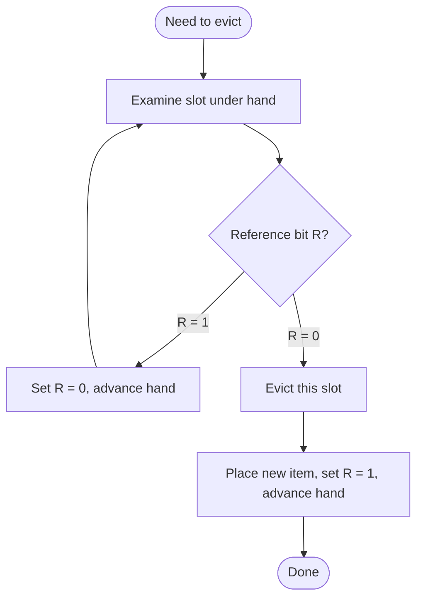
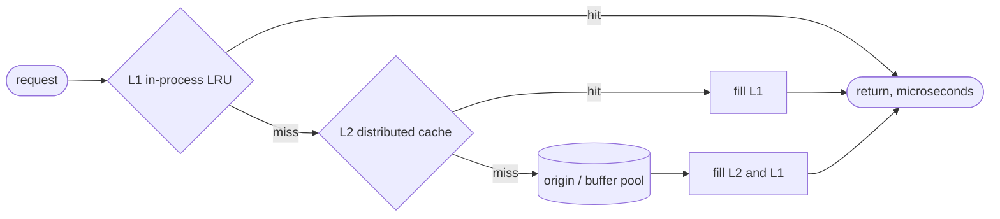

# LRU Cache — Senior Level

## Table of Contents

1. [LRU in Production Systems](#lru-in-production-systems)
   - [Database Buffer Pools](#database-buffer-pools)
   - [OS Page Cache](#os-page-cache)
   - [Web and CDN Caches](#web-and-cdn-caches)
   - [Memoization and Application Caches](#memoization-and-application-caches)
2. [The CLOCK / Second-Chance Approximation](#the-clock--second-chance-approximation)
3. [Segmented and Midpoint-Insertion LRU](#segmented-and-midpoint-insertion-lru)
4. [TTL and Expiry](#ttl-and-expiry)
5. [Concurrent LRU: Sharding](#concurrent-lru-sharding)
6. [Concurrent LRU: Buffered Reads (Caffeine-style)](#concurrent-lru-buffered-reads-caffeine-style)
7. [Metrics: Hit Ratio and Friends](#metrics-hit-ratio-and-friends)
8. [Cache Stampede and Coherence](#cache-stampede-and-coherence)
9. [Comparison of Approaches](#comparison-of-approaches)
10. [Implementations](#implementations)
    - [Go: Sharded Concurrent LRU](#go-sharded-concurrent-lru)
    - [Java: CLOCK Approximation](#java-clock-approximation)
    - [Python: LRU with TTL](#python-lru-with-ttl)
11. [Key Takeaways](#key-takeaways)

---

## LRU in Production Systems

The textbook LRU — a hash map plus a doubly linked list — is the *conceptual* model. Real systems rarely run strict LRU because of two pressures: **concurrency** (moving a node to the front on every read requires a write lock, which kills read throughput) and **scan resistance** (a sequential scan flushes the working set). Senior engineers must know how each major system bends LRU to cope.

### Database Buffer Pools

A **buffer pool** is the database's in-memory cache of disk pages. It is the single most important cache in a database: a buffer-pool miss means a disk read, which is orders of magnitude slower than RAM.

- **MySQL InnoDB** uses a **midpoint-insertion LRU**. The LRU list is split into a *young* (≈5/8) and an *old* (≈3/8) sublist. New pages are inserted at the *head of the old* sublist, not the global head. A page is promoted to the young sublist only if it is accessed again **after** a configurable delay (`innodb_old_blocks_time`, default 1000 ms). Effect: a one-pass scan fills only the old sublist and is evicted without touching the hot young set. This is InnoDB's answer to sequential flooding.
- **PostgreSQL** uses **CLOCK-sweep** (a CLOCK approximation, below), not strict LRU, for its shared buffers. Each buffer has a `usage_count`; the clock hand sweeps decrementing counts and evicts the first buffer whose count reaches zero. CLOCK avoids the per-read list reordering that would otherwise be a concurrency bottleneck.
- **Oracle** uses a touch-count algorithm conceptually similar to a hybrid LRU/LFU with hot and cold regions.

The recurring theme: **buffer pools approximate LRU rather than implement it exactly**, trading a little hit-ratio accuracy for huge concurrency and scan-resistance gains.

### OS Page Cache

The operating system caches disk pages in free RAM. The Linux page replacement algorithm is a **two-list (active/inactive) CLOCK-like** scheme with reference bits and a `PG_referenced` flag — again an LRU *approximation*, because maintaining strict LRU order across millions of pages under heavy concurrency is infeasible. Pages move between the *active* and *inactive* LRU lists based on reference bits set by the MMU on access; eviction (reclaim) scans the inactive list.

### Web and CDN Caches

- **CDNs (Akamai, Cloudflare, Fastly)** cache origin responses at edge nodes. Because objects vary wildly in size and miss cost, pure LRU is often replaced or augmented by **size-and-cost-aware** policies (e.g., **GDSF**, Greedy-Dual-Size-Frequency) so that one huge rarely-used video does not evict thousands of small popular assets. Many edges still use **LRU or segmented LRU** as the base because of its simplicity, then layer admission control (TinyLFU) so that one-hit-wonders never get admitted in the first place.
- **HTTP caches / Varnish / nginx proxy_cache** use LRU-like eviction combined with TTL (the `Cache-Control: max-age` of each object). TTL handles *correctness* (stale data) while LRU handles *capacity*.
- **Redis** offers configurable eviction including `allkeys-lru` and `allkeys-lfu`. Critically, Redis does **not** maintain a true LRU list (too expensive at scale). Instead it uses **sampled approximate LRU**: on eviction it samples a handful of keys (`maxmemory-samples`, default 5) and evicts the one with the oldest access timestamp. With 10 samples it is within ~1% of true LRU at a fraction of the memory cost.

### Memoization and Application Caches

At the application layer, LRU is the standard bound for memoization: cache the results of expensive pure functions, evict LRU when the cache exceeds a size limit. Python's `functools.lru_cache`, Java's **Caffeine** and **Guava** caches, and Go's `hashicorp/golang-lru` are the workhorses. Caffeine in particular is the modern reference implementation, using **Window-TinyLFU** admission plus an LRU-ish eviction — it routinely beats strict LRU's hit ratio while remaining near-lock-free.

---

## The CLOCK / Second-Chance Approximation

CLOCK is the most important LRU approximation to understand, because it appears in OS kernels and databases everywhere. The motivation: **strict LRU requires moving a node to the front on every access, which is a write — terrible for concurrent reads.** CLOCK replaces the per-access list move with a single cheap bit flip.

**The structure**: items are arranged in a **circular buffer** (like a clock face). Each slot has a **reference bit** (`R`), initially 0. A **clock hand** points at one slot.

```
        slot0(R=1)
   slot7(R=0)      slot1(R=1)
 slot6(R=1)          slot2(R=0)
   slot5(R=0)      slot3(R=1)
        slot4(R=1)
              ^
            HAND
```

**On access** (`get`/`put` hit): set that slot's reference bit `R = 1`. That is it — one bit, no list surgery. This is far cheaper and far more concurrency-friendly than LRU's move-to-front.

**On eviction** (need a free slot): the hand sweeps clockwise:
```
while true:
    look at the slot under the hand
    if R == 0:
        evict this slot      # it got no "second chance"
        place the new item here, set R = 1
        advance the hand
        return
    else:                    # R == 1
        set R = 0            # give it a second chance
        advance the hand
```

A slot with `R=1` is not evicted immediately; its bit is cleared and the hand moves on. Only on the *next* sweep, if it has still not been re-referenced (`R` is still 0), is it evicted. So a recently used item gets a "second chance" to survive — approximating "evict the least recently used" without an ordered list.



**Why CLOCK is preferred in systems:**
- **Read path is a single bit-set**, not a locked list move → far better under concurrency.
- **No per-item pointers** for an LRU list → less memory.
- **Quality**: CLOCK approximates LRU well; with a multi-bit `usage_count` (CLOCK-Pro / generalized CLOCK, as in PostgreSQL) it approaches LRU's hit ratio closely.

**CLOCK vs strict LRU:**

| Aspect | Strict LRU | CLOCK (second-chance) |
|--------|-----------|------------------------|
| On access | move node to list front (a **write**) | set reference bit (1 bit) |
| Concurrency | poor (every read mutates shared list) | good (bit set is cheap, contention-light) |
| Memory per item | 2 pointers (prev/next) | 1 reference bit (or a few bits) |
| Eviction accuracy | exact LRU order | approximate LRU |
| Used by | textbooks, small in-process caches | Linux, PostgreSQL, many DB buffer pools |

The professional level proves *how good* the CLOCK approximation is. For now: CLOCK is "LRU you can run concurrently and at scale."

---

## Segmented and Midpoint-Insertion LRU

To resist scans, split the LRU list into two (or more) segments:

- **Probationary (cold) segment**: new entries enter here. A scan lives entirely here.
- **Protected (hot) segment**: an entry is promoted here only on a *second* access (or after surviving a delay). Frequently used entries live here, shielded from scan-induced eviction.

This is the idea behind InnoDB's young/old split, the **2Q** algorithm (sibling topic `22-arc-2q-cache`), and the LRU-K family. The general principle: **distinguish "accessed once" from "accessed more than once."** A scan only ever accesses each block once, so it never reaches the protected segment, so it cannot evict the hot working set. This single idea — admission based on a second access — is the cheapest and most effective scan-resistance technique.

---

## TTL and Expiry

LRU governs **capacity** (what to drop when full). **TTL** (time-to-live) governs **freshness** (what to drop because it is stale). They are orthogonal and most real caches use both.

- **TTL**: each entry has an expiry timestamp. On read, if `now > expiry`, treat it as a miss (lazy expiration). A background sweeper or a min-heap/timing-wheel of expiries handles active expiration so memory is reclaimed even for keys never read again.
- **Combining with LRU**: an entry can be removed for *either* reason — it expired (TTL) *or* it was the least recently used and the cache overflowed (LRU). Redis combines `maxmemory` (LRU/LFU eviction) with per-key `EXPIRE` (TTL) exactly this way.
- **Lazy vs active expiration**: lazy (check on access) is cheap but leaks memory for unread expired keys; active (background scan / timing wheel) reclaims memory promptly at some CPU cost. Production caches do both — lazy for correctness on read, active in the background for memory.

A common refinement is **stale-while-revalidate**: serve the expired-but-present value immediately while one background task refreshes it, avoiding a latency spike on expiry. This trades a brief window of staleness for steady latency.

---

## Concurrent LRU: Sharding

The simplest scalable concurrent LRU is **sharding** (lock striping). Partition the key space into *S* independent shards; each shard is a complete, independently locked LRU cache.

```
            key  --hash--> shard index (hash(key) % S)

   Shard 0           Shard 1           Shard 2     ...   Shard S-1
 [lock + LRU]     [lock + LRU]      [lock + LRU]       [lock + LRU]
```

- **Throughput**: operations on different shards never contend. With *S* shards and uniform hashing, contention drops by ≈ *S*×.
- **Capacity**: total capacity is split across shards (e.g., `cap/S` each). Skewed key distributions can make one shard hot and evict more aggressively than a global LRU would — a known trade-off.
- **Approximation**: eviction is **per-shard**, so the *global* LRU order is not preserved exactly. A key that is globally the least recently used might survive because its shard is cold, while a more-recently-used key in a hot shard gets evicted. In practice this is an acceptable, often imperceptible, deviation.
- This is exactly how `hashicorp/golang-lru`'s sharded cache, Guava's `LocalCache` (16 segments by default), and Caffeine's striping operate.

Sharding is the pragmatic default for concurrent in-process caches: simple, predictable, and it scales with cores.

---

## Concurrent LRU: Buffered Reads (Caffeine-style)

Sharding still mutates a list under a lock on every access. The state-of-the-art (Caffeine) goes further: **decouple the read from the policy update.**

- A `get` records the access into a per-thread (or striped) **ring buffer** and returns immediately — no list move, no lock on the read path.
- A single thread later **drains** these buffers and replays the accesses against the eviction policy (reordering, updating frequency sketches) under one lock, in batches.
- If a buffer fills, the access is simply dropped — the policy is *approximate* anyway, so missing a few recordings is harmless.

This makes the read path effectively lock-free and wait-free while still maintaining a high-quality eviction policy. Combined with **Window-TinyLFU** admission (a compact frequency sketch that decides whether a new item is even *worth* admitting), Caffeine achieves hit ratios at or above ARC while staying near-lock-free. The senior takeaway: **at high concurrency, the winning move is to make reads cheap and the policy approximate/asynchronous**, not to make a perfect LRU faster.

---

## Metrics: Hit Ratio and Friends

You cannot tune a cache you do not measure. The metrics every senior engineer instruments:

| Metric | Definition | Why it matters |
|--------|-----------|----------------|
| **Hit ratio** | `hits / (hits + misses)` | The headline number; drives effective latency |
| **Miss ratio** | `1 - hit ratio` | Each miss = a slow backend call |
| **Eviction rate** | evictions per second | High rate ⇒ cache too small or thrashing |
| **Load/fill latency** | time to fetch on a miss | Determines the cost of a miss |
| **Average lookup latency** | weighted by hit/miss | The user-visible effect |
| **Working-set size** | distinct keys over a window | Helps right-size capacity |
| **Cost-weighted hit ratio** | hits weighted by miss cost | For cost-aware caches (CDN) |
| **Memory footprint** | bytes used | Overhead per entry can dominate for tiny values |

A subtle but vital point: the relationship between capacity and hit ratio is the **miss-ratio curve (MRC)** — usually a curve of diminishing returns. Doubling cache size rarely doubles the hit ratio; past the "knee" of the curve, more memory buys almost nothing. Tools like **Mattson's stack algorithm** can compute the full MRC for a stack-based policy like LRU in a single pass over the trace, telling you the hit ratio at *every* capacity at once. (LRU is a **stack algorithm** — its cached set at capacity `k` is always a subset of its cached set at `k+1`, which is precisely why it is immune to Bélády's anomaly and why the MRC is well-defined; see the professional level.)

---

## Cache Stampede and Coherence

Two operational hazards a senior engineer must handle:

1. **Cache stampede (thundering herd)**: a hot key expires (TTL) or is evicted, and many concurrent requests all miss and all hit the backend at once. Mitigations: a per-key lock so only one loader runs (others wait or get the stale value), **request coalescing / single-flight** (Go's `golang.org/x/sync/singleflight`), and **probabilistic early expiration** (refresh slightly before TTL with a small random chance, spreading the renewal load).

2. **Coherence / invalidation**: when the underlying data changes, cached copies become stale. Strategies: write-through (update cache and store together), write-behind (update cache now, store asynchronously), and explicit invalidation (delete-on-write). "There are only two hard things in Computer Science: cache invalidation and naming things" — and it is mostly true. LRU does not solve coherence; TTL and explicit invalidation do.

### A Worked Capacity-Tuning Example

Suppose a service caches database rows. You measure the miss-ratio curve and observe:

| Capacity (entries) | Hit ratio | Backend QPS (at 10k req/s) |
|--------------------|-----------|----------------------------|
| 1,000 | 72% | 2,800 |
| 10,000 | 91% | 900 |
| 50,000 | 96% | 400 |
| 100,000 | 96.5% | 350 |
| 500,000 | 97% | 300 |

The "knee" is around 50,000: going from 10k→50k cut backend QPS by more than half, but 50k→500k (10× the memory) bought almost nothing. The right size is *just past the knee* — here ~50,000 entries — where you capture the working set without paying for diminishing returns. This is exactly what the miss-ratio curve is for, and because LRU is a stack algorithm you can compute the whole table in a single pass over a request trace (see the professional level). Sizing a cache by guessing "more is better" wastes memory; sizing by the MRC is the senior move.

### Operational Runbook: Diagnosing a Misbehaving Cache

When a production cache underperforms, work through this checklist in order:

1. **Hit ratio dropped suddenly?** Look for a new scan/batch job polluting the cache, a deploy that changed key shape (cache keys no longer matching), or a TTL that is too short.
2. **Hit ratio fine but latency spiking?** Suspect a stampede on a hot key's expiry (add single-flight), lock contention on the cache structure (shard it), or expensive misses (instrument miss cost).
3. **Memory climbing past the cap?** A code path removes a node without deleting its map key, or TTL-expired entries are never actively purged (add a background sweeper).
4. **Eviction rate very high?** Cache is undersized for the working set (consult the MRC) or thrashing on a cyclic-just-over-capacity pattern (enlarge slightly, or switch to a scan-resistant policy).
5. **One node hot in a sharded/distributed cache?** Key skew — a few keys dominate one shard. Consider key salting, a larger shard count, or a small front "hot key" cache.

Each symptom maps to a concept from this page: locality, stampede, invariant violations, the MRC, and skew. A senior engineer reads the metrics and reaches for the right lever rather than blindly enlarging the cache.

---

## Multi-Tier and Distributed LRU

Large systems rarely have a single cache; they have a **hierarchy**, and LRU appears at several levels at once.

- **L1 (in-process)**: a small, fast, per-instance LRU (e.g., Caffeine) holding the hottest keys. Microsecond latency, no network. Sharded for concurrency.
- **L2 (distributed)**: a shared remote cache (Redis, Memcached) holding a larger working set, partitioned across nodes via **consistent hashing** so that adding/removing a node remaps only `K/N` keys instead of nearly all. Each node may run LRU/LFU eviction locally.
- **L3 (origin / database buffer pool)**: the slow store, itself fronted by its own LRU-approximating buffer pool.



Design tensions at each tier:
- **Inclusive vs exclusive**: should L2 hold a superset of L1 (simpler, more redundancy) or disjoint (more effective capacity)? Most CDNs and web stacks are loosely inclusive.
- **Promotion/demotion**: a key hot at L1 should ideally not be evicted from L2 at the same moment; some systems share access signals across tiers.
- **Coherence across tiers**: an invalidation must reach *every* tier holding the key, or a lower tier serves stale data — pub/sub invalidation or short TTLs handle this.

The single-node LRU you learned is the *building block*; production caching is composing these blocks across tiers with consistent-hashing routing and cross-tier invalidation.

## CDN Caching in Depth

CDNs are the most demanding LRU users because objects span six orders of magnitude in size and miss cost. Worth knowing for senior interviews:

- **Admission, not just eviction.** A CDN edge sees enormous numbers of **one-hit-wonders** (URLs requested exactly once). Admitting them pollutes the cache. **TinyLFU** admission uses a tiny count-min sketch to estimate an object's popularity and *refuses* to cache objects unlikely to be requested again — often more impactful than the eviction policy itself.
- **Size-aware eviction (GDSF).** Greedy-Dual-Size-Frequency assigns each object a priority `H = clock + frequency · cost / size`; the lowest-`H` object is evicted. A 4 GB video must earn its keep against thousands of small popular assets — pure LRU would let it evict them all.
- **Two-tier edge storage.** Hot objects in RAM (LRU), warm objects on local SSD (a second LRU/segmented list), cold objects fetched from origin. The RAM tier uses strict-ish LRU; the SSD tier optimizes for write amplification, not pure recency.
- **TTL-driven correctness.** Each object's `Cache-Control: max-age` sets its TTL; LRU handles capacity, TTL handles freshness, and **stale-while-revalidate** serves slightly stale content during refresh to avoid origin spikes.

The lesson: at CDN scale, **what you admit matters as much as what you evict**, and size/cost dominate pure recency — which is why CDNs are where plain LRU most clearly breaks down.

## Comparison of Approaches

| Approach | Read cost | Scan-resistant? | Concurrency | Hit ratio | Where used |
|----------|-----------|-----------------|-------------|-----------|------------|
| Strict LRU | list move (write) | no | poor | baseline | textbooks, small in-proc caches |
| CLOCK / second-chance | set 1 bit | partial | good | ≈ LRU | Linux, PostgreSQL buffers |
| Segmented / midpoint LRU | list move | **yes** | poor–medium | > LRU on scans | InnoDB buffer pool |
| Sampled approximate LRU | timestamp write | no | good | ≈ LRU (with ~10 samples) | Redis `allkeys-lru` |
| Sharded LRU | locked list move (per shard) | no | very good | ≈ LRU | Guava, golang-lru |
| 2Q / ARC | list ops | **yes** | medium | > LRU | ZFS (ARC), DB caches |
| Window-TinyLFU (Caffeine) | buffered, async | **yes** | excellent | ≥ ARC | Caffeine, modern caches |

The progression reads as: strict LRU → make reads cheap (CLOCK, buffered) → make it scan-resistant (segmented, 2Q, ARC) → make admission smart (TinyLFU). Each step trades a little exactness for a lot of throughput or hit ratio.

---

## Implementations

### Go: Sharded Concurrent LRU

A thread-safe sharded LRU: each shard is an independently locked LRU. This is the pragmatic production pattern.

```go
package lru

import (
	"container/list"
	"hash/fnv"
	"sync"
)

type entry struct {
	key   string
	value interface{}
}

// shard is one independently locked LRU cache.
type shard struct {
	mu       sync.Mutex
	capacity int
	ll       *list.List
	items    map[string]*list.Element
}

func newShard(capacity int) *shard {
	return &shard{
		capacity: capacity,
		ll:       list.New(),
		items:    make(map[string]*list.Element),
	}
}

func (s *shard) get(key string) (interface{}, bool) {
	s.mu.Lock()
	defer s.mu.Unlock()
	if el, ok := s.items[key]; ok {
		s.ll.MoveToFront(el)
		return el.Value.(*entry).value, true
	}
	return nil, false
}

func (s *shard) put(key string, value interface{}) {
	s.mu.Lock()
	defer s.mu.Unlock()
	if el, ok := s.items[key]; ok {
		s.ll.MoveToFront(el)
		el.Value.(*entry).value = value
		return
	}
	el := s.ll.PushFront(&entry{key: key, value: value})
	s.items[key] = el
	if s.ll.Len() > s.capacity {
		back := s.ll.Back()
		if back != nil {
			s.ll.Remove(back)
			delete(s.items, back.Value.(*entry).key)
		}
	}
}

// ShardedLRU is a concurrent LRU split across N independently locked shards.
type ShardedLRU struct {
	shards []*shard
	mask   uint32
}

// NewSharded creates a cache with numShards (must be a power of two) and the
// given total capacity, split evenly across shards.
func NewSharded(numShards, totalCapacity int) *ShardedLRU {
	shards := make([]*shard, numShards)
	per := totalCapacity / numShards
	if per < 1 {
		per = 1
	}
	for i := range shards {
		shards[i] = newShard(per)
	}
	return &ShardedLRU{shards: shards, mask: uint32(numShards - 1)}
}

func (c *ShardedLRU) shardFor(key string) *shard {
	h := fnv.New32a()
	h.Write([]byte(key))
	return c.shards[h.Sum32()&c.mask]
}

func (c *ShardedLRU) Get(key string) (interface{}, bool) {
	return c.shardFor(key).get(key)
}

func (c *ShardedLRU) Put(key string, value interface{}) {
	c.shardFor(key).put(key, value)
}
```

### Java: CLOCK Approximation

A fixed-capacity CLOCK (second-chance) cache. Note the read path only sets a bit.

```java
import java.util.HashMap;
import java.util.Map;

/**
 * A CLOCK (second-chance) cache: an LRU approximation whose read path is a
 * single reference-bit set, making it far more concurrency-friendly than
 * strict LRU. Not synchronized here; wrap or stripe for concurrent use.
 */
public class ClockCache<K, V> {

    private static final class Slot<K, V> {
        K key;
        V value;
        boolean referenced;
        boolean occupied;
    }

    private final Slot<K, V>[] slots;
    private final Map<K, Integer> index; // key -> slot position
    private int hand = 0;

    @SuppressWarnings("unchecked")
    public ClockCache(int capacity) {
        this.slots = new Slot[capacity];
        for (int i = 0; i < capacity; i++) {
            slots[i] = new Slot<>();
        }
        this.index = new HashMap<>(capacity * 2);
    }

    /** On a hit, just set the reference bit — the cheap CLOCK read path. */
    public V get(K key) {
        Integer pos = index.get(key);
        if (pos == null) {
            return null;
        }
        slots[pos].referenced = true;
        return slots[pos].value;
    }

    public void put(K key, V value) {
        Integer pos = index.get(key);
        if (pos != null) {
            slots[pos].value = value;
            slots[pos].referenced = true;
            return;
        }
        int free = findVictim(); // sweep the clock hand
        Slot<K, V> slot = slots[free];
        if (slot.occupied) {
            index.remove(slot.key); // evict the old occupant
        }
        slot.key = key;
        slot.value = value;
        slot.referenced = true;
        slot.occupied = true;
        index.put(key, free);
    }

    /** Sweep the hand: clear set bits (second chance), evict the first R=0. */
    private int findVictim() {
        while (true) {
            Slot<K, V> slot = slots[hand];
            if (!slot.occupied || !slot.referenced) {
                int victim = hand;
                hand = (hand + 1) % slots.length;
                return victim;
            }
            slot.referenced = false; // give a second chance
            hand = (hand + 1) % slots.length;
        }
    }
}
```

### Python: LRU with TTL

Combines LRU capacity bounds with per-entry TTL — the realistic production shape.

```python
"""LRU cache with per-entry TTL (lazy expiration)."""

import time
from collections import OrderedDict


class TTLLRUCache:
    def __init__(self, capacity: int, ttl_seconds: float):
        self.capacity = capacity
        self.ttl = ttl_seconds
        # key -> (value, expiry_timestamp)
        self._store: "OrderedDict[str, tuple]" = OrderedDict()

    def _now(self) -> float:
        return time.monotonic()

    def get(self, key: str):
        if key not in self._store:
            return None
        value, expiry = self._store[key]
        if self._now() > expiry:
            # Lazily expire on read: treat as a miss.
            del self._store[key]
            return None
        self._store.move_to_end(key)  # mark most recently used
        return value

    def put(self, key: str, value) -> None:
        expiry = self._now() + self.ttl
        if key in self._store:
            self._store.move_to_end(key)
        self._store[key] = (value, expiry)
        if len(self._store) > self.capacity:
            self._store.popitem(last=False)  # evict LRU

    def purge_expired(self) -> int:
        """Active expiration: drop all expired entries. Returns count removed."""
        now = self._now()
        expired = [k for k, (_, exp) in self._store.items() if now > exp]
        for k in expired:
            del self._store[k]
        return len(expired)
```

---

## Key Takeaways

1. **Production systems approximate LRU**, they rarely run it exactly — because strict LRU's per-read list move is a concurrency killer and it floods under scans.
2. **CLOCK / second-chance** is the canonical approximation: replace the move-to-front write with a single reference-bit set. It is what OS kernels and PostgreSQL actually use.
3. **Scan resistance comes from a second-access rule** — segmented/midpoint LRU (InnoDB), 2Q, and ARC all distinguish "seen once" from "seen many times."
4. **TTL and LRU are orthogonal**: TTL governs freshness, LRU governs capacity. Real caches combine both, with lazy + active expiration.
5. **Sharding (lock striping)** is the pragmatic concurrent LRU; **buffered/async policy updates** (Caffeine) are the state of the art when you need near-lock-free reads.
6. **Measure the hit ratio and the miss-ratio curve.** LRU is a *stack algorithm*, so its MRC is monotone and computable in one pass — capacity tuning is data-driven, not guesswork.
7. **Operate the cache**: handle stampedes (single-flight, probabilistic expiry) and coherence (write-through / invalidation). LRU alone solves neither.

**Next step:** Continue to [`professional.md`](./professional.md) for the formal theory — an O(1) correctness proof, LRU's *k-competitiveness* in the competitive-analysis model, why LRU is a stack algorithm (immune to Bélády's anomaly), a formal analysis of how well CLOCK approximates LRU, and the correctness conditions for concurrent variants.
