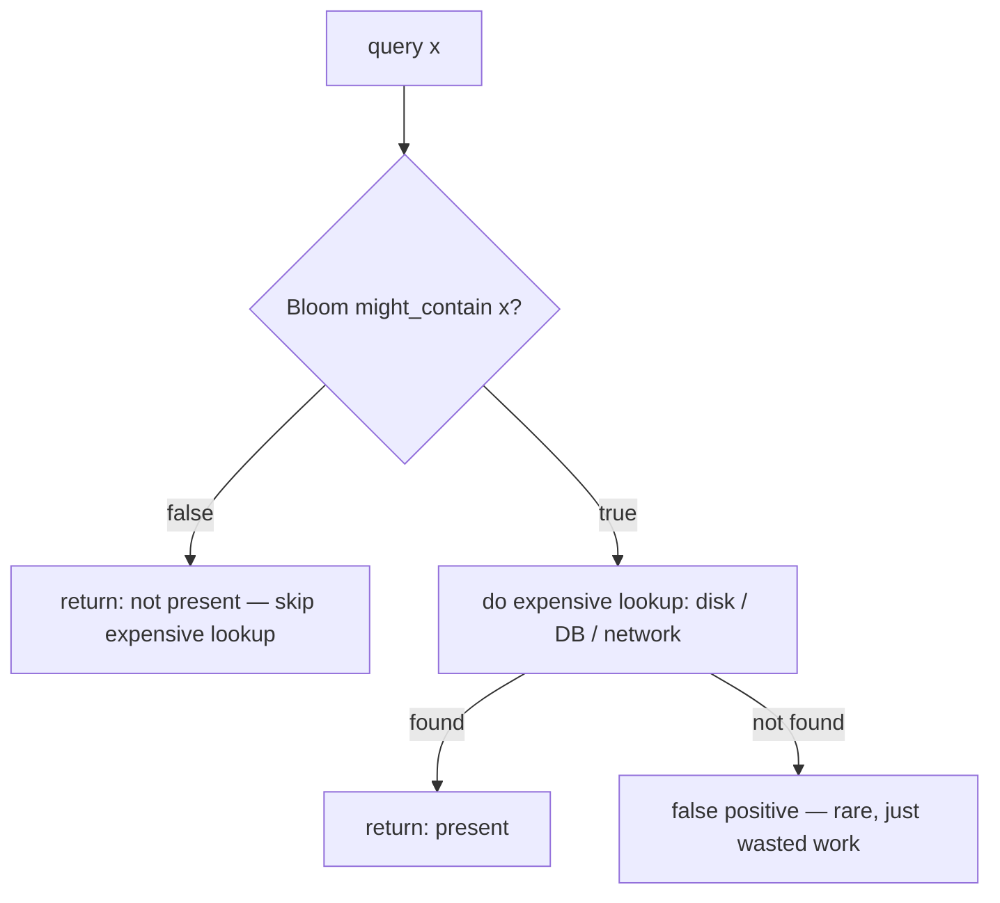

# Bloom Filter — Junior Level

> **One-line summary:** A Bloom filter is a tiny **bit array** plus **`k` hash functions**. To *insert* an item, hash it `k` ways and set those `k` bits to `1`. To *query* an item, hash it the same `k` ways and check whether **all** `k` bits are `1`. If any is `0`, the item is **definitely not** in the set; if all are `1`, the item is **probably** in the set. It can give a **false positive** but **never a false negative**.

---

## Table of Contents

1. [Introduction](#introduction)
2. [Prerequisites](#prerequisites)
3. [Glossary](#glossary)
4. [Core Concepts](#core-concepts)
5. [Big-O Summary](#big-o-summary)
6. [Real-World Analogies](#real-world-analogies)
7. [Pros & Cons](#pros--cons)
8. [Step-by-Step Walkthrough](#step-by-step-walkthrough)
9. [Code Examples](#code-examples)
10. [Coding Patterns](#coding-patterns)
11. [Error Handling](#error-handling)
12. [Performance Tips](#performance-tips)
13. [Best Practices](#best-practices)
14. [Edge Cases & Pitfalls](#edge-cases--pitfalls)
15. [Common Mistakes](#common-mistakes)
16. [Cheat Sheet](#cheat-sheet)
17. [Visual Animation](#visual-animation)
18. [Summary](#summary)
19. [Further Reading](#further-reading)

---

## Introduction

Imagine you are building a website and, every time a user picks a username, you want to answer one quick question: *"Has this username been seen before?"* The obvious tool is a **hash set** (Go's `map`, Java's `HashSet`, Python's `set`). It works perfectly, but it has a cost: it stores the **whole** username for every entry. With a hundred million usernames averaging 16 bytes each, that is over a gigabyte of memory just to answer yes/no.

A **Bloom filter** answers the same membership question — *"is `x` in the set?"* — using **dramatically less memory**, at the price of being occasionally, but only in one direction, wrong. Instead of storing the items themselves, a Bloom filter stores a fixed array of bits and remembers only a *fingerprint* of each item: the positions that the item's hash functions point to. Storing a hundred million items in a Bloom filter might take around **100–200 megabytes** (roughly 9–10 bits per item for a 1% error rate) instead of a gigabyte — and the per-item cost does not grow with the length of the username.

The catch is captured in one sentence you should memorize:

> A Bloom filter has **no false negatives** but may have **false positives**.

- **No false negatives:** if the filter says *"not present,"* the item is genuinely not in the set. Always. You can trust a "no."
- **Possible false positives:** if the filter says *"present,"* the item is *probably* in the set, but there is a small, tunable chance it was never inserted and the answer is wrong.

This one-sided error is exactly what makes Bloom filters so useful. In a huge number of real systems the expensive operation is the "yes" path (go read from disk, go ask the remote server), and the cheap path is the "no" path. If a fast, tiny structure can confidently say "definitely not here, don't bother," you skip the expensive work most of the time. A few false positives just mean you *occasionally* do the expensive work when you did not strictly need to — never that you *miss* something that was really there.

This file explains the bit array, the `k` hash functions, the insert and query procedures, why false negatives are impossible, and walks a tiny example by hand. The deeper math (how to size the filter, why you can't delete, how it compares to alternatives) is in [`middle.md`](./middle.md).

---

## Prerequisites

Before reading this file you should be comfortable with:

- **Arrays and indexing** — a bit array is just an array where each cell is `0` or `1`.
- **Hash functions** — a function that maps an item (string, number, bytes) to an integer; the same input always gives the same output. (See `05-basic-data-structures/05-hash-tables`.)
- **The modulo operator** — `h % m` reduces any hash to a valid index `0 .. m-1`.
- **Sets and membership** — the `is x in S?` question and how a `HashSet`/`set` answers it.
- **Big-O notation** — `O(1)`, `O(k)`, `O(n)`.

Optional but helpful:

- A glance at **bitwise operations** (`|`, `&`, `<<`) since real implementations pack bits into integer words.
- Familiarity with **probabilistic vs exact** data structures (a structure that is "usually right" vs "always right").

---

## Glossary

| Term | Meaning |
|------|---------|
| **Bloom filter** | A probabilistic set: supports *insert* and *might-contain*, using a bit array + `k` hashes. |
| **Bit array** (bitset) | An array of `m` bits, each `0` or `1`; the entire memory of the filter. |
| **`m`** | The number of bits in the array (the filter's size). |
| **`k`** | The number of hash functions used per item. |
| **`n`** | The number of items that have been (or will be) inserted. |
| **Hash function** | Maps an item to a bit position in `0 .. m-1` (often `hash(x) % m`). |
| **Insert (add)** | Set the `k` bits given by the `k` hashes of an item to `1`. |
| **Query (contains)** | Return *true* only if **all** `k` bits of the item are `1`. |
| **False positive** | The filter says "present" for an item that was never inserted. |
| **False negative** | The filter says "absent" for an item that *was* inserted — **impossible** in a Bloom filter. |
| **False-positive rate** (FPR, `p`) | The probability a query for a non-member returns "present." |
| **Load** | How "full" the bit array is — the fraction of bits set to `1`. |

---

## Core Concepts

### 1. The Bit Array

The entire filter is one array of `m` bits, all starting at `0`. There are no buckets holding keys, no linked lists, no stored strings — just bits. A bit being `1` means *"some inserted item's hash landed here."* Because each cell is a single bit, `m = 8,000,000` bits is only one megabyte. This compactness is the whole point: we trade the ability to store items for the ability to store *evidence* about items in almost no space.

### 2. The `k` Hash Functions

For each item we use `k` independent hash functions, `h₁, h₂, …, h_k`, each producing an index in `0 .. m-1`. You can think of each item as "lighting up" `k` specific bulbs in a long strip of `m` bulbs. Using several hash functions (rather than one) spreads each item across multiple positions, which makes accidental collisions — the cause of false positives — much rarer for the same amount of memory. (How to choose the best `k` is in [`middle.md`](./middle.md).)

### 3. Insert: set `k` bits

To insert item `x`: compute `h₁(x), h₂(x), …, h_k(x)`, and set each of those `k` bits to `1`. If a bit is already `1` (because another item hashed there), it just stays `1`. **Insertion never clears a bit** — the array only ever gains `1`s. This monotonic, never-reset behavior is exactly why deletion is impossible (covered in `middle.md`), and why false negatives can never occur.

### 4. Query: check `k` bits

To ask *"is `x` present?"*: compute the same `h₁(x), …, h_k(x)` and look at those `k` bits.

- If **any** of them is `0`, then `x` was definitely **never inserted** (because inserting `x` would have set *all* of them). Return **false** — and this answer is always correct.
- If **all** of them are `1`, return **true** — but those bits could have been set to `1` by *other* items, so this "true" might be a **false positive**.

### 5. Why No False Negatives

This is the defining property, and the reasoning is short. When you insert `x`, you set *all* `k` of its bits to `1`. Nothing ever turns a bit back to `0`. So when you later query `x`, those same `k` bits are still `1`, and the query returns **true**. There is no path by which an inserted item can later be reported absent. False negatives are structurally impossible.

### 6. Why False Positives Happen

A false positive occurs when an item `y` that was **never inserted** happens to have all `k` of *its* bit positions already set to `1` — not by `y`, but by the combined effect of the items that *were* inserted. The more items you insert, the more bits become `1`, and the easier it is for an innocent `y` to find all its bits "accidentally" lit. So the false-positive rate **rises as the filter fills up**, and falls as you make `m` bigger. The exact formula `p ≈ (1 − e^(−kn/m))^k` and how to choose `m` and `k` are derived in [`middle.md`](./middle.md) and [`professional.md`](./professional.md).

---

## Big-O Summary

| Operation | Time | Space | Notes |
|-----------|------|-------|-------|
| Insert | **O(k)** | — | Compute `k` hashes, set `k` bits. `k` is a small constant (~7). |
| Query (might-contain) | **O(k)** | — | Compute `k` hashes, read `k` bits; can stop early on the first `0`. |
| Delete | **not supported** | — | Cannot clear bits safely → see counting Bloom filter (`23-counting-bloom-filter`). |
| Whole structure | — | **O(m)** bits | `m` chosen from `n` and target error `p`; ~`10n` bits for `p = 1%`. |

Both `insert` and `query` are **constant time** — they do not depend on `n`, the number of items already stored. That is the same `O(1)`-per-operation feel as a hash set, but with far less memory and the one-sided error.

---

## Real-World Analogies

| Concept | Analogy |
|---------|---------|
| Bit array | A long strip of light bulbs, all off at first. |
| Inserting an item | An item flips on its own pattern of `k` bulbs. |
| Querying an item | You check whether *all* of that item's `k` bulbs are on. |
| "Any bulb off → not present" | If even one required bulb is off, the item was never here (no false negative). |
| False positive | All of a stranger's bulbs happen to be on already — lit by *other* items — so you wrongly think the stranger visited. |
| Filling up | The more visitors, the more bulbs glow, the more strangers look "familiar." |
| Can't delete | You can't turn a visitor's bulbs off — other visitors might share those bulbs. |

A second analogy: a Bloom filter is like a **bouncer's memory of faces** who only remembers a few features (hair, height, jacket) of everyone who entered. If a new person matches *none* of the remembered features, they definitely didn't enter. If they match *all* the remembered features, the bouncer says "I think you've been here" — possibly confusing them with someone else.

Where the analogies break: real bulbs and bouncers can be turned off or correct their memory; a plain Bloom filter's bits, once set, stay set.

---

## Pros & Cons

| Pros | Cons |
|------|------|
| Tiny memory: ~10 bits per item for 1% error, independent of item size. | Can report **false positives** (never false negatives). |
| Constant-time `insert` and `query`: `O(k)`, independent of `n`. | **Cannot delete** items (standard version). |
| Never misses a real member — a "no" is always trustworthy. | Cannot **list** the items it contains or recover them. |
| Great cheap pre-filter in front of an expensive lookup (disk, network). | Error rate **grows** as more items are added past the design point. |
| Simple to implement and easy to make concurrent (bits only go `0→1`). | Choosing `m` and `k` requires knowing (or estimating) `n` up front. |

**When to use:** as a fast "definitely-not-here" gate before an expensive check — disk reads, database lookups, network calls — where occasionally doing the expensive work needlessly is acceptable, but missing a real item is not.

**When NOT to use:** when you need exact membership, the ability to delete, the ability to enumerate items, or when a false "yes" would be dangerous rather than merely wasteful.

---

## Step-by-Step Walkthrough

Let us build a tiny filter with `m = 10` bits and `k = 2` hash functions. We'll use two toy hashes:

```
h1(x) = (sum of letter positions, a=1..z=26) % 10
h2(x) = (length of x * 7) % 10
```

Start: all bits `0`.

```
index:  0 1 2 3 4 5 6 7 8 9
bits:   0 0 0 0 0 0 0 0 0 0
```

**Insert "cat".**  letters c=3, a=1, t=20 → sum 24. `h1 = 24 % 10 = 4`. length 3 → `h2 = 21 % 10 = 1`.
Set bits 4 and 1:

```
index:  0 1 2 3 4 5 6 7 8 9
bits:   0 1 0 0 1 0 0 0 0 0
                ^=4   ^=1 set
```

**Insert "dog".**  d=4, o=15, g=7 → sum 26. `h1 = 26 % 10 = 6`. length 3 → `h2 = 21 % 10 = 1`.
Set bits 6 and 1 (bit 1 already `1`):

```
index:  0 1 2 3 4 5 6 7 8 9
bits:   0 1 0 0 1 0 1 0 0 0
```

**Query "cat".**  `h1 = 4`, `h2 = 1`. Bits 4 and 1 are both `1` → **present** (correct, true positive).

**Query "fish".**  f=6, i=9, s=19, h=8 → sum 42. `h1 = 42 % 10 = 2`. length 4 → `h2 = 28 % 10 = 8`.
Bit 2 is `0` → return **absent** immediately. Correct — `fish` was never inserted. This is the no-false-negative side at work: one `0` is enough to be sure.

**Query "owl" (a false-positive demo).**  o=15, w=23, l=12 → sum 50. `h1 = 50 % 10 = 0`. length 3 → `h2 = 21 % 10 = 1`. Bit 0 is `0` → absent. (No false positive here.) But suppose a word hashed to bits **4 and 6** — both already `1` from `cat` and `dog`. The filter would answer **present** even though that word was never inserted: a **false positive**, caused entirely by bits that *other* items set.

---

## Code Examples

### Example: A simple Bloom filter

We implement a filter with a bit array of `m` bits and `k` hash functions derived from two base hashes (the `g_i(x) = h1(x) + i·h2(x)` "double hashing" trick, explained fully in [`middle.md`](./middle.md)).

#### Go

```go
package main

import (
	"fmt"
	"hash/fnv"
)

type BloomFilter struct {
	bits []uint64 // packed bit array: m bits across len(bits)*64 slots
	m    uint64   // number of bits
	k    uint64   // number of hash functions
}

func NewBloomFilter(m, k uint64) *BloomFilter {
	return &BloomFilter{bits: make([]uint64, (m+63)/64), m: m, k: k}
}

func (b *BloomFilter) setBit(i uint64) { b.bits[i/64] |= 1 << (i % 64) }
func (b *BloomFilter) getBit(i uint64) bool {
	return b.bits[i/64]&(1<<(i%64)) != 0
}

// two base hashes via FNV-1a (64-bit), split into high/low halves.
func (b *BloomFilter) hashes(data []byte) (uint64, uint64) {
	h := fnv.New64a()
	h.Write(data)
	sum := h.Sum64()
	return sum & 0xffffffff, sum >> 32
}

func (b *BloomFilter) index(h1, h2, i uint64) uint64 {
	return (h1 + i*h2) % b.m // double hashing to derive k positions
}

func (b *BloomFilter) Add(data []byte) {
	h1, h2 := b.hashes(data)
	for i := uint64(0); i < b.k; i++ {
		b.setBit(b.index(h1, h2, i))
	}
}

func (b *BloomFilter) MightContain(data []byte) bool {
	h1, h2 := b.hashes(data)
	for i := uint64(0); i < b.k; i++ {
		if !b.getBit(b.index(h1, h2, i)) {
			return false // a 0 bit => definitely absent (no false negatives)
		}
	}
	return true // all bits set => probably present (maybe false positive)
}

func main() {
	bf := NewBloomFilter(100, 4)
	bf.Add([]byte("cat"))
	bf.Add([]byte("dog"))
	fmt.Println(bf.MightContain([]byte("cat")))  // true  (real member)
	fmt.Println(bf.MightContain([]byte("fish"))) // false (definitely absent)
}
```

#### Java

```java
import java.nio.charset.StandardCharsets;

public class BloomFilter {
    private final long[] bits;
    private final int m;
    private final int k;

    public BloomFilter(int m, int k) {
        this.m = m;
        this.k = k;
        this.bits = new long[(m + 63) / 64];
    }

    private void setBit(int i) { bits[i >>> 6] |= 1L << (i & 63); }
    private boolean getBit(int i) { return (bits[i >>> 6] & (1L << (i & 63))) != 0; }

    // FNV-1a 64-bit, split into two 32-bit base hashes.
    private long[] hashes(byte[] data) {
        long h = 0xcbf29ce484222325L;
        for (byte by : data) {
            h ^= (by & 0xff);
            h *= 0x100000001b3L;
        }
        return new long[]{ h & 0xffffffffL, (h >>> 32) & 0xffffffffL };
    }

    private int index(long h1, long h2, int i) {
        long combined = (h1 + (long) i * h2) % m;
        return (int) ((combined % m + m) % m); // keep non-negative
    }

    public void add(String s) {
        byte[] data = s.getBytes(StandardCharsets.UTF_8);
        long[] h = hashes(data);
        for (int i = 0; i < k; i++) setBit(index(h[0], h[1], i));
    }

    public boolean mightContain(String s) {
        byte[] data = s.getBytes(StandardCharsets.UTF_8);
        long[] h = hashes(data);
        for (int i = 0; i < k; i++) {
            if (!getBit(index(h[0], h[1], i))) return false; // no false negatives
        }
        return true;
    }

    public static void main(String[] args) {
        BloomFilter bf = new BloomFilter(100, 4);
        bf.add("cat");
        bf.add("dog");
        System.out.println(bf.mightContain("cat"));  // true
        System.out.println(bf.mightContain("fish")); // false
    }
}
```

#### Python

```python
class BloomFilter:
    def __init__(self, m, k):
        self.m = m
        self.k = k
        self.bits = bytearray((m + 7) // 8)  # m bits packed into bytes

    def _set_bit(self, i):
        self.bits[i >> 3] |= 1 << (i & 7)

    def _get_bit(self, i):
        return (self.bits[i >> 3] >> (i & 7)) & 1

    def _hashes(self, data):
        # two base hashes from one 64-bit hash, then double hashing
        h = hash(data) & 0xFFFFFFFFFFFFFFFF
        return h & 0xFFFFFFFF, (h >> 32) & 0xFFFFFFFF

    def _index(self, h1, h2, i):
        return (h1 + i * h2) % self.m

    def add(self, item):
        data = item.encode() if isinstance(item, str) else item
        h1, h2 = self._hashes(data)
        for i in range(self.k):
            self._set_bit(self._index(h1, h2, i))

    def might_contain(self, item):
        data = item.encode() if isinstance(item, str) else item
        h1, h2 = self._hashes(data)
        for i in range(self.k):
            if not self._get_bit(self._index(h1, h2, i)):
                return False  # a 0 bit => definitely absent
        return True  # probably present (maybe false positive)


if __name__ == "__main__":
    bf = BloomFilter(m=100, k=4)
    bf.add("cat")
    bf.add("dog")
    print(bf.might_contain("cat"))   # True
    print(bf.might_contain("fish"))  # False
```

**What it does:** packs `m` bits into machine words, derives `k` positions per item from two base hashes, sets bits on `add`, and checks bits on `might_contain`, returning `False` the instant it sees a `0`.
**Run:** `go run main.go` | `javac BloomFilter.java && java BloomFilter` | `python bloom.py`

---

## Coding Patterns

### Pattern 1: Early-exit query

**Intent:** When checking the `k` bits, return `false` immediately on the first `0` — no need to read the rest.

```python
def might_contain(self, item):
    h1, h2 = self._hashes(item.encode())
    for i in range(self.k):
        if not self._get_bit((h1 + i * h2) % self.m):
            return False          # one zero settles it
    return True
```

### Pattern 2: Double hashing to get `k` indices from 2 hashes

**Intent:** Computing `k` independent hashes is wasteful; instead derive them as `g_i(x) = h1(x) + i·h2(x)` from just two base hashes (Kirsch–Mitzenmacher). Full justification in [`middle.md`](./middle.md).

```python
def indices(h1, h2, k, m):
    return [(h1 + i * h2) % m for i in range(k)]
```

### Pattern 3: Bloom filter as a pre-filter

**Intent:** Use the filter to skip an expensive lookup whenever it confidently says "absent."



The filter turns most "absent" queries into a cheap in-memory `false`, and only the (rare) "present" answers — real members plus occasional false positives — pay the expensive cost.

---

## Error Handling

| Error | Cause | Fix |
|-------|-------|-----|
| Negative or out-of-range bit index | Hash value used without `% m`, or signed overflow. | Always reduce indices modulo `m`; keep them non-negative. |
| Far too many false positives | Filter is overfilled (`n` much larger than design `n`). | Size `m` and `k` for the real `n`; or use a scalable Bloom filter (see `senior.md`). |
| Always returns "present" | `m` too small or `k` too large → array saturated with `1`s. | Recompute `m, k` from `n` and target `p` (formulas in `middle.md`). |
| "Delete" corrupts the filter | Tried to clear bits, breaking shared bits of other items. | Don't delete; use a **counting Bloom filter** (`23-counting-bloom-filter`). |
| Different results across machines | Used a non-portable hash (e.g. Python's salted `hash()`). | Use a fixed, portable hash (FNV, MurmurHash) seeded identically. |

---

## Performance Tips

- **Stop early** on the first `0` bit during a query — most non-members fail on the very first or second bit.
- **Derive `k` indices from 2 hashes** (double hashing) instead of computing `k` full hashes — same accuracy, far less CPU.
- **Pack bits into 64-bit words**, not one `bool` per bit; this cuts memory 8–64× and improves cache behavior.
- **Use a fast non-cryptographic hash** (MurmurHash3, xxHash, FNV) — you don't need cryptographic strength, only good distribution.
- **Pick `k ≈ (m/n)·ln 2`** for the lowest error at a given size (derived in `middle.md`); a typical value is `k = 7` for `m/n ≈ 10`.

---

## Best Practices

- Decide your target items `n` and acceptable error `p` **first**, then compute `m` and `k` (see `middle.md`); don't guess sizes.
- Remember the contract: trust a **"no"** completely; treat a **"yes"** as "probably, go verify."
- Never expose "delete" on a plain Bloom filter — reach for a counting Bloom filter if you must remove items.
- Use the same hash functions and seeds everywhere a filter is shared or serialized.
- Always have a **truth source** behind the filter (disk, DB) to confirm the rare positive.
- Test your filter against a real `set` on small inputs: every "no" from the filter must be a real "no".

---

## Edge Cases & Pitfalls

- **Empty filter** — all bits `0`; every query correctly returns `false`.
- **Querying before any insert** — always `false` (cannot be a false positive when nothing is inserted).
- **Same item inserted twice** — harmless; the bits are already `1`, nothing changes.
- **`m` not a power of two** — fine, but `% m` is slower than masking; some implementations force `m` to a power of two.
- **Overfilling** — inserting far more than the design `n` pushes the FPR toward 1 (the filter says "yes" to almost everything).
- **Distinct items sharing all `k` bits** — the root cause of false positives; unavoidable, only tunable.
- **Non-deterministic hashing** — Python's built-in `hash()` of strings is randomized per process; use a fixed hash for persistence.

---

## Common Mistakes

1. **Believing a "yes" is certain.** A "yes" can be a false positive; only a "no" is guaranteed.
2. **Trying to delete by clearing bits.** This breaks other items that share those bits and *introduces false negatives*. Use a counting Bloom filter.
3. **Computing `k` separate hashes the slow way.** Use double hashing from two base hashes.
4. **Sizing without knowing `n`.** Too small → useless (everything "present"); too big → wasted memory.
5. **Forgetting `% m`.** Raw hash values index out of bounds or go negative.
6. **Using one bit per `bool`.** Wastes 8–64× the memory; pack bits into words.
7. **No backing truth source.** A Bloom filter alone can never *confirm* membership — it must front a real store.

---

## Cheat Sheet

| Question | Answer |
|----------|--------|
| What is it? | Bit array + `k` hashes answering approximate membership. |
| Insert | Set the `k` bits given by the item's `k` hashes. |
| Query | "Present" iff **all** `k` bits are `1`. |
| Says "no" | **Definitely** absent (no false negatives). |
| Says "yes" | **Probably** present (small false-positive chance). |
| Can it delete? | No → counting Bloom filter (`23-counting-bloom-filter`). |
| Insert/Query time | `O(k)`, independent of `n`. |
| Space | `O(m)` bits, ~`10n` for 1% error. |

Core algorithm:

```
add(x):
    h1, h2 = base_hashes(x)
    for i in 0 .. k-1:
        setBit((h1 + i*h2) % m)

mightContain(x):
    h1, h2 = base_hashes(x)
    for i in 0 .. k-1:
        if bit((h1 + i*h2) % m) == 0:
            return false        # certain: not present
    return true                 # probable: present
```

---

## Visual Animation

> See [`animation.html`](./animation.html) for an interactive visualization.
>
> The animation demonstrates:
> - The bit array, all `0` at first
> - Inserting an item lighting up its `k` bits
> - A query that *misses* (hits a `0` → definitely absent)
> - A query that *hits* (all `1`s → probably present)
> - A **false-positive** demonstration where a never-inserted item finds all its bits already set
> - A live false-positive-rate estimate and an operation log

---

## Summary

A Bloom filter is the smallest useful "have I seen this?" structure: an array of `m` bits plus `k` hash functions. **Insert** sets `k` bits; **query** returns "present" only if all `k` bits are `1`. Its defining behavior is one-sided error — **no false negatives, occasional false positives** — because bits are only ever turned on, never off. That is also why you cannot delete from it. In exchange you get constant-time operations and order-of-magnitude memory savings versus a hash set, which is why Bloom filters sit in front of expensive lookups across databases, caches, web crawlers, and networks. The next level shows how to *size* the filter (`m`, optimal `k`), why deletion is impossible, and how it stacks up against a plain hash set.

---

## Further Reading

- Bloom, B. H. (1970), *Space/Time Trade-offs in Hash Coding with Allowable Errors* — the original paper.
- Mitzenmacher & Upfal, *Probability and Computing* — Bloom filter analysis.
- Sibling topic `05-basic-data-structures/05-hash-tables` — the hashing machinery underneath.
- Sibling topic `23-counting-bloom-filter` — adds deletion via per-slot counters.
- Sibling topic `10-cuckoo-filter` — supports deletion and often better space at low error.
- cp-algorithms.com / Wikipedia "Bloom filter" — formulas and variants.

---

Next step: [middle.md](./middle.md) — sizing math (optimal `k`, `m`), double hashing, why you can't delete, and Bloom filter vs hash set.
