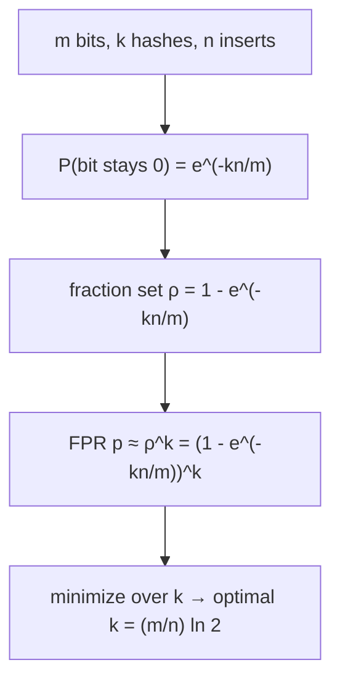
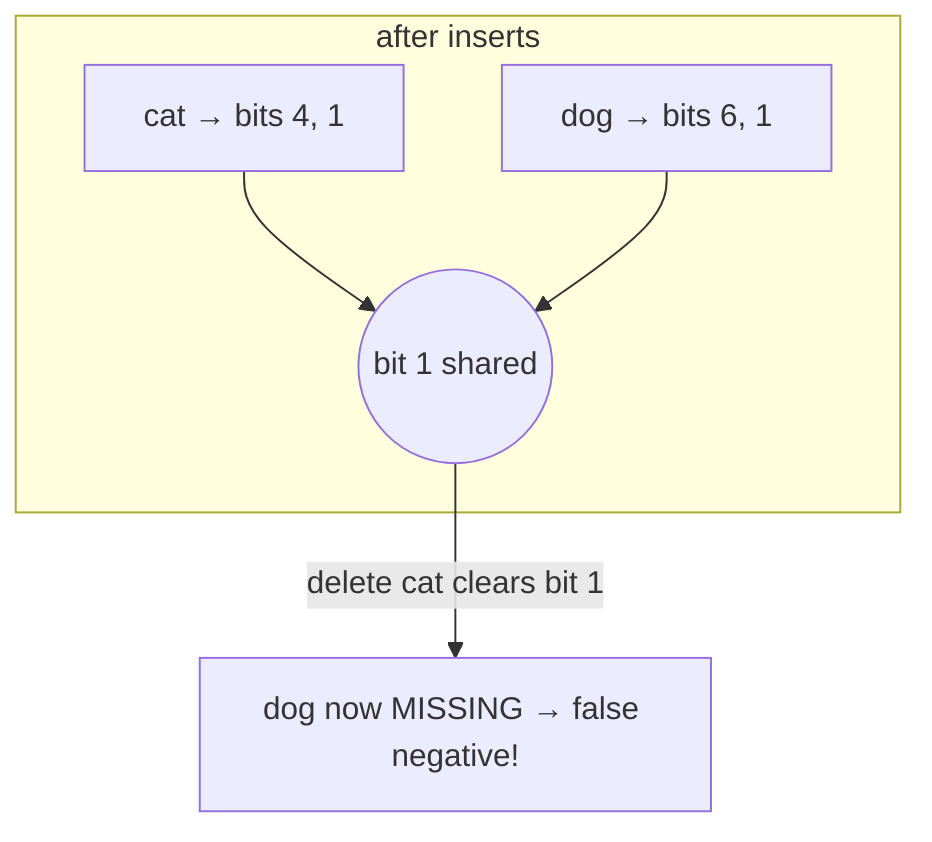

# Bloom Filter — Middle Level

> **One-line summary:** Given a target item count `n` and an acceptable false-positive rate `p`, you can *compute* the optimal filter size `m = −n·ln p / (ln 2)²` and the optimal number of hashes `k = (m/n)·ln 2`. The false-positive rate is `p ≈ (1 − e^(−kn/m))^k`. You never compute `k` separate hashes — **double hashing** (`g_i(x) = h1(x) + i·h2(x)`) derives all `k` from two. You **cannot delete** because bits are shared, which motivates the counting Bloom filter.

---

## Table of Contents

1. [Introduction](#introduction)
2. [Why It Works: The Probability Model](#why-it-works-the-probability-model)
3. [Sizing Math: Optimal k and m](#sizing-math-optimal-k-and-m)
4. [Double Hashing (Kirsch–Mitzenmacher)](#double-hashing-kirschmitzenmacher)
5. [Why You Cannot Delete](#why-you-cannot-delete)
6. [Comparison with Alternatives](#comparison-with-alternatives)
7. [When to Choose a Bloom Filter](#when-to-choose-a-bloom-filter)
8. [Code Examples](#code-examples)
9. [Error Handling](#error-handling)
10. [Performance Analysis](#performance-analysis)
11. [Best Practices](#best-practices)
12. [Visual Animation](#visual-animation)
13. [Summary](#summary)

---

## Introduction

> Focus: *"Why does it work?"* and *"When and how big should I make it?"*

At the junior level a Bloom filter is "a bit array and `k` hashes." That is enough to *use* one, but not to *design* one. The middle-level questions are quantitative:

- If I expect `n = 10` million items and can tolerate a `1%` false-positive rate, **how many bits** do I need and **how many hash functions** should I use?
- Why is there an *optimal* `k`? Surely more hashes is always better?
- How do I get `k` hash values cheaply without running `k` separate hash functions?
- Why exactly can't I remove an item, and what do I use instead?
- When is a Bloom filter actually the right call over a plain `HashSet`?

Every one of these has a clean, derivable answer. The whole design reduces to two formulas you plug `n` and `p` into. This file derives them, shows the double-hashing trick that makes the implementation fast, explains the deletion problem precisely, and compares the Bloom filter to the alternatives you'd reach for instead. The fully rigorous derivations (independence assumptions, variance, space lower bound) live in [`professional.md`](./professional.md); here we build correct intuition and usable formulas.

---

## Why It Works: The Probability Model

Set up the model. We have `m` bits, `k` hash functions assumed to behave like independent uniform choices over `0 .. m-1`, and we insert `n` items (so `kn` total bit-setting operations).

**Probability a specific bit is still `0` after all inserts.** One hash sets a given bit with probability `1/m`, so it *misses* it with probability `1 − 1/m`. Across all `kn` independent settings, the bit stays `0` with probability:

```
P(bit = 0) = (1 − 1/m)^(kn) ≈ e^(−kn/m)
```

using the standard approximation `(1 − 1/m)^m ≈ e^(−1)`. Therefore the probability a given bit is `1` is `≈ 1 − e^(−kn/m)`. Call the expected fraction of set bits `ρ = 1 − e^(−kn/m)`.

**False-positive probability.** A non-member `y` triggers a false positive only if **all** `k` of its bits are already `1`. Treating those `k` bits as independent each with probability `ρ` of being set:

```
p ≈ ρ^k = (1 − e^(−kn/m))^k          ← the false-positive-rate formula
```

This is the single most important equation for the topic. Read it as: error rises with `n` (more set bits), falls with `m` (more room), and depends on `k` in a non-obvious way — too few hashes means each bit is a weak signal; too many means the array saturates with `1`s. There is a sweet spot, which we find next.



---

## Sizing Math: Optimal k and m

**Optimal number of hash functions `k`.** Fix `m` and `n`; minimize `p(k) = (1 − e^(−kn/m))^k`. Minimizing `ln p` (easier) and differentiating, the minimum occurs when exactly **half the bits are set** (`ρ = 1/2`). Solving `1 − e^(−kn/m) = 1/2` gives `e^(−kn/m) = 1/2`, i.e. `kn/m = ln 2`, so:

```
k* = (m/n) · ln 2 ≈ 0.6931 · (m/n)
```

Round to the nearest integer. The intuition: you want the array exactly half full of `1`s. Fewer hashes underuses the bits; more hashes fills the array so densely that almost everything looks present.

**Minimum false-positive rate at optimal `k`.** Substituting `ρ = 1/2`:

```
p* = (1/2)^k* = 2^(−(m/n)·ln 2) = (0.6185)^(m/n)
```

So each extra bit-per-element (`m/n`) multiplies the error by about `0.6185`. Equivalently `ln p* = −(m/n)(ln 2)²`.

**Sizing the array `m` for a target `p`.** Invert the line above. From `ln p = −(m/n)(ln 2)²`:

```
m = −n · ln p / (ln 2)²       ≈ −2.081 · n · ln p
```

Then `bits per element = m/n = −ln p / (ln 2)² = −1.4427 · ln p`.

**Worked numbers** (the table every engineer memorizes):

| Target FPR `p` | bits/elem `m/n` | optimal `k` |
|---:|---:|---:|
| 10% (0.1) | 4.79 | 3.3 → 3 |
| 1% (0.01) | 9.59 | 6.6 → 7 |
| 0.1% (0.001) | 14.38 | 10.0 → 10 |
| 0.01% (0.0001) | 19.17 | 13.3 → 13 |

So the famous rule of thumb: **~10 bits per element buys ~1% error with 7 hash functions.** For `n = 10` million items at `1%`, `m ≈ 96` million bits ≈ **12 MB**, versus a `HashSet` that would store all 10M items themselves.

**Sizing recipe in code-friendly form:**

```text
given n (items), p (target FPR):
    m = ceil( -n * ln(p) / (ln 2)^2 )
    k = round( (m / n) * ln 2 )
```

---

## Double Hashing (Kirsch–Mitzenmacher)

Computing `k` independent strong hashes per item is expensive — for `k = 10` that's ten hash evaluations on every insert and query. The **Kirsch–Mitzenmacher** result shows you can get the same asymptotic false-positive rate using only **two** base hash functions, combining them as:

```
g_i(x) = (h1(x) + i · h2(x)) mod m,   for i = 0, 1, …, k-1
```

This is "double hashing." Their paper proves that as long as `h1` and `h2` are independent and uniform, the family `{g_i}` behaves well enough that the asymptotic FPR is unchanged — you pay for two hashes, not `k`.

**Practical recipe.** Take one strong 64-bit hash (MurmurHash3, xxHash, or two halves of a 128-bit hash), split it into two 32-bit halves `h1` and `h2`, then generate the `k` indices arithmetically. A common refinement (to avoid degenerate cases when `h2` is `0` or shares a factor with `m`) is the "enhanced double hashing" variant:

```
g_i(x) = (h1 + i·h2 + i²·c) mod m       # add a small quadratic term
```

but the plain linear form is what most production libraries use.

| Approach | Hash evaluations per op | FPR impact |
|---|---:|---|
| `k` independent hashes | `k` | baseline |
| Double hashing (`h1 + i·h2`) | 2 | negligible difference asymptotically |
| Enhanced double hashing (+ `i²c`) | 2 | slightly better spread, avoids cycles |

---

## Why You Cannot Delete

Deletion in a Bloom filter is not just "unsupported" — it is **unsafe**, and the reason is structural.

Suppose you inserted `cat` (setting bits 4 and 1) and `dog` (setting bits 6 and 1). Bit `1` is now **shared** by both items. If you "delete" `cat` by clearing its bits 4 and 1, you also clear bit `1` — which `dog` still needs. A later query for `dog` would find bit `1` cleared and answer **absent**. That is a **false negative**, and a false negative destroys the filter's one and only guarantee.



Because a plain Bloom filter stores a single bit per slot, it has no way to know *how many* items rely on a given bit. The fix is to store a small **counter** per slot instead of a single bit: increment on insert, decrement on delete. A slot is "set" if its counter is `> 0`. That is exactly the **counting Bloom filter** (`23-counting-bloom-filter`), which trades ~4× the memory (typically 4-bit counters) for the ability to delete. The **cuckoo filter** (`10-cuckoo-filter`) is another deletion-capable alternative that often uses less space at low error rates.

---

## Comparison with Alternatives

| Attribute | Bloom filter | Hash set | Counting Bloom | Cuckoo filter |
|-----------|:---:|:---:|:---:|:---:|
| Memory per item | ~10 bits @ 1% | item size + overhead (≫) | ~40 bits @ 1% | ~12 bits @ 1% |
| Insert / query time | O(k) | O(1) avg | O(k) | O(1) amortized |
| False positives | yes (tunable) | **no** | yes (tunable) | yes (tunable) |
| False negatives | **no** | no | no | no* |
| Delete supported | **no** | yes | **yes** | **yes** |
| Enumerate items | no | yes | no | no |
| Stores actual items | no | yes | no | only fingerprints |
| Resizes easily | no (scalable variant) | yes | no | partial |

\* A cuckoo filter can have false negatives only if you delete an item that was never inserted; used correctly it does not.

**Bloom vs hash set — the core trade.** A hash set is *exact* and supports delete and enumeration, but stores every item and its overhead. A Bloom filter stores none of the items, costs a fixed handful of bits each, and is constant-size regardless of item length — but it can lie "yes" and cannot delete or list. Choose the Bloom filter when memory is the binding constraint and a rare false "yes" is cheap to absorb.

---

## When to Choose a Bloom Filter

**Choose a Bloom filter when:**
- The set is large and memory matters more than exactness.
- The dominant cost is the "present" path (a disk/DB/network lookup) and you want to skip it for clear non-members.
- A false positive merely wastes a little work; it is never dangerous.
- You don't need to delete or enumerate.

**Choose a hash set when:**
- You need exact answers, deletion, or to iterate the items.
- The set is small enough that memory isn't a concern.
- A false "yes" would be incorrect, not merely wasteful.

**Choose a counting Bloom filter / cuckoo filter when:**
- You need approximate membership **and** deletion (e.g. a cache admission filter where entries expire).

---

## Worked Sizing Example

Let's design a filter end-to-end so the formulas stop being abstract. **Goal:** a username-availability pre-check for `n = 5,000,000` existing usernames, tolerating a `0.1%` false-positive rate (a false positive just means "occasionally we double-check the database for a name that's actually free").

**Step 1 — size the bit array.**

```
m = −n · ln p / (ln 2)²
  = −5,000,000 · ln(0.001) / (0.6931)²
  = −5,000,000 · (−6.9078) / 0.4805
  = 5,000,000 · 14.378
  ≈ 71,890,000 bits ≈ 8.99 MB
```

**Step 2 — pick `k`.**

```
k = (m/n) · ln 2 = 14.378 · 0.6931 = 9.966 → 10 hash functions
```

**Step 3 — sanity-check the achieved FPR** with the forward formula at `n = 5M`:

```
p = (1 − e^(−kn/m))^k = (1 − e^(−10·5e6/71.89e6))^10
  = (1 − e^(−0.6956))^10 = (1 − 0.4988)^10 = 0.5012^10 ≈ 0.00097 ✓
```

Right at the `0.1%` target, and `ρ = 0.5012` confirms the array is half full — the optimal-`k` signature. **Result:** ~9 MB and 10 hashes replace a `HashSet` that would store 5M strings (tens to hundreds of MB).

**Step 4 — what if we'd guessed `k` wrong?** Suppose we used `k = 4` instead of 10 (a common "fewer hashes is faster" mistake). Then `ρ = 1 − e^(−4·5e6/71.89e6) = 1 − e^(−0.278) = 0.243`, and `p = 0.243^4 ≈ 0.0035` — a `3.5×` worse FPR for the same memory. And `k = 20`? `ρ = 1 − e^(−1.39) = 0.751`, `p = 0.751^20 ≈ 0.0032` — also worse, because the array is now `75%` full. Both sides of the optimum hurt; `k = 10` is the floor.

This is the entire middle-level workflow: choose `n` and `p`, compute `m` and `k`, verify with the forward formula, and resist the urge to hand-tune `k` away from the optimum.

---

## Code Examples

### Full Implementation with Sizing

#### Go

```go
package main

import (
	"fmt"
	"hash/fnv"
	"math"
)

type BloomFilter struct {
	bits []uint64
	m    uint64
	k    uint64
}

// NewOptimal sizes m and k from expected n and target FPR p.
func NewOptimal(n int, p float64) *BloomFilter {
	m := uint64(math.Ceil(-float64(n) * math.Log(p) / (math.Ln2 * math.Ln2)))
	k := uint64(math.Round(float64(m) / float64(n) * math.Ln2))
	if k < 1 {
		k = 1
	}
	return &BloomFilter{bits: make([]uint64, (m+63)/64), m: m, k: k}
}

func (b *BloomFilter) hashes(data []byte) (uint64, uint64) {
	h := fnv.New64a()
	h.Write(data)
	s := h.Sum64()
	h1 := s & 0xffffffff
	h2 := (s >> 32) | 1 // ensure h2 is odd/non-zero for double hashing
	return h1, h2
}

func (b *BloomFilter) Add(data []byte) {
	h1, h2 := b.hashes(data)
	for i := uint64(0); i < b.k; i++ {
		idx := (h1 + i*h2) % b.m
		b.bits[idx/64] |= 1 << (idx % 64)
	}
}

func (b *BloomFilter) MightContain(data []byte) bool {
	h1, h2 := b.hashes(data)
	for i := uint64(0); i < b.k; i++ {
		idx := (h1 + i*h2) % b.m
		if b.bits[idx/64]&(1<<(idx%64)) == 0 {
			return false
		}
	}
	return true
}

// EstimatedFPR for the current fill, given items inserted.
func (b *BloomFilter) EstimatedFPR(n int) float64 {
	return math.Pow(1-math.Exp(-float64(b.k)*float64(n)/float64(b.m)), float64(b.k))
}

func main() {
	bf := NewOptimal(1000, 0.01)
	fmt.Printf("m=%d bits, k=%d hashes\n", bf.m, bf.k)
	bf.Add([]byte("alpha"))
	fmt.Println(bf.MightContain([]byte("alpha"))) // true
	fmt.Println(bf.MightContain([]byte("beta")))  // almost always false
	fmt.Printf("estimated FPR at n=1000: %.4f\n", bf.EstimatedFPR(1000))
}
```

#### Java

```java
import java.nio.charset.StandardCharsets;

public class BloomFilter {
    private final long[] bits;
    private final int m, k;

    public BloomFilter(int n, double p) {
        this.m = (int) Math.ceil(-n * Math.log(p) / (Math.log(2) * Math.log(2)));
        this.k = Math.max(1, (int) Math.round((double) m / n * Math.log(2)));
        this.bits = new long[(m + 63) / 64];
    }

    private long[] hashes(byte[] data) {
        long h = 0xcbf29ce484222325L;
        for (byte by : data) { h ^= (by & 0xff); h *= 0x100000001b3L; }
        long h1 = h & 0xffffffffL;
        long h2 = (h >>> 32) | 1L; // non-zero stride
        return new long[]{h1, h2};
    }

    public void add(String s) {
        long[] h = hashes(s.getBytes(StandardCharsets.UTF_8));
        for (int i = 0; i < k; i++) {
            int idx = (int) (((h[0] + (long) i * h[1]) % m + m) % m);
            bits[idx >>> 6] |= 1L << (idx & 63);
        }
    }

    public boolean mightContain(String s) {
        long[] h = hashes(s.getBytes(StandardCharsets.UTF_8));
        for (int i = 0; i < k; i++) {
            int idx = (int) (((h[0] + (long) i * h[1]) % m + m) % m);
            if ((bits[idx >>> 6] & (1L << (idx & 63))) == 0) return false;
        }
        return true;
    }

    public double estimatedFpr(int n) {
        return Math.pow(1 - Math.exp(-(double) k * n / m), k);
    }

    public static void main(String[] args) {
        BloomFilter bf = new BloomFilter(1000, 0.01);
        System.out.printf("m=%d, k=%d%n", bf.m, bf.k);
        bf.add("alpha");
        System.out.println(bf.mightContain("alpha")); // true
        System.out.println(bf.mightContain("beta"));  // usually false
    }
}
```

#### Python

```python
import math


class BloomFilter:
    def __init__(self, n, p):
        self.m = math.ceil(-n * math.log(p) / (math.log(2) ** 2))
        self.k = max(1, round(self.m / n * math.log(2)))
        self.bits = bytearray((self.m + 7) // 8)

    def _hashes(self, data):
        h = hash(data) & 0xFFFFFFFFFFFFFFFF
        h1 = h & 0xFFFFFFFF
        h2 = (h >> 32) | 1  # non-zero stride
        return h1, h2

    def add(self, item):
        data = item.encode() if isinstance(item, str) else item
        h1, h2 = self._hashes(data)
        for i in range(self.k):
            idx = (h1 + i * h2) % self.m
            self.bits[idx >> 3] |= 1 << (idx & 7)

    def might_contain(self, item):
        data = item.encode() if isinstance(item, str) else item
        h1, h2 = self._hashes(data)
        for i in range(self.k):
            idx = (h1 + i * h2) % self.m
            if not (self.bits[idx >> 3] >> (idx & 7)) & 1:
                return False
        return True

    def estimated_fpr(self, n):
        return (1 - math.exp(-self.k * n / self.m)) ** self.k


if __name__ == "__main__":
    bf = BloomFilter(n=1000, p=0.01)
    print(f"m={bf.m} bits, k={bf.k} hashes")
    bf.add("alpha")
    print(bf.might_contain("alpha"))  # True
    print(bf.might_contain("beta"))   # usually False
    print(f"estimated FPR: {bf.estimated_fpr(1000):.4f}")
```

**What it does:** sizes `m, k` from `n` and `p` with the derived formulas, uses double hashing for the `k` indices, and reports the analytic FPR for a given fill.
**Run:** `go run main.go` | `javac BloomFilter.java && java BloomFilter` | `python bloom.py`

---

## Error Handling

| Scenario | What goes wrong | Correct approach |
|----------|----------------|------------------|
| `h2 = 0` in double hashing | All `k` indices collapse to `h1` → effectively `k = 1`, error spikes | Force `h2` odd/non-zero (`h2 |= 1`). |
| Inserted far more than design `n` | FPR climbs toward 1; filter says "yes" to everything | Re-derive `m, k`, or use a scalable filter (`senior.md`). |
| Attempted delete | Shared bits cleared → false negatives | Use a counting Bloom filter instead. |
| `p` set to `0` | `m = -n·ln(0)/… = ∞` | Reject `p ≤ 0`; smallest meaningful `p` depends on `n`. |
| Mismatched hashes across nodes | Serialized filter gives different answers elsewhere | Pin hash function + seed; serialize `m, k` alongside the bits. |

---

## Performance Analysis

The work per operation is `O(k)` hash-derived bit accesses, independent of `n`. The realistic cost is **memory bandwidth and cache misses**: each of the `k` bit probes can land in a different cache line, so a query may incur up to `k` cache misses. That is why senior-level designs use **blocked Bloom filters** (confine all `k` bits to one cache line). The sizing formulas tell you the *space*; the access pattern tells you the *latency*.

#### Go

```go
import (
	"fmt"
	"time"
)

func benchmark() {
	for _, n := range []int{1000, 10000, 100000, 1000000} {
		bf := NewOptimal(n, 0.01)
		start := time.Now()
		for i := 0; i < n; i++ {
			bf.Add([]byte(fmt.Sprintf("item-%d", i)))
		}
		fmt.Printf("n=%7d: m=%d k=%d add=%v\n", n, bf.m, bf.k, time.Since(start))
	}
}
```

#### Java

```java
public static void benchmark() {
    for (int n : new int[]{1000, 10000, 100000, 1000000}) {
        BloomFilter bf = new BloomFilter(n, 0.01);
        long start = System.nanoTime();
        for (int i = 0; i < n; i++) bf.add("item-" + i);
        long ms = (System.nanoTime() - start) / 1_000_000;
        System.out.printf("n=%7d: add=%d ms%n", n, ms);
    }
}
```

#### Python

```python
import time

for n in (1000, 10000, 100000, 1000000):
    bf = BloomFilter(n, 0.01)
    start = time.perf_counter()
    for i in range(n):
        bf.add(f"item-{i}")
    print(f"n={n:>7}: m={bf.m} k={bf.k} add={time.perf_counter()-start:.3f}s")
```

---

## Quick Reference: Sizing at a Glance

Keep this card handy — it collapses the whole middle level into a lookup:

| You know… | Compute… | Formula |
|---|---|---|
| `n`, `p` | bits `m` | `m = −n·ln p / (ln 2)²` |
| `m`, `n` | hashes `k` | `k = (m/n)·ln 2` |
| `m`, `k`, `n` | FPR `p` | `p = (1 − e^(−kn/m))^k` |
| target `p` | bits/elem | `≈ 1.44·log₂(1/p)` |
| `m`, `k`, set bits `X` | inferred `n̂` | `n̂ = −(m/k)·ln(1 − X/m)` |

A second rule of thumb: **every extra bit per element multiplies the FPR by ≈ 0.62**, so going from 1% to 0.1% costs ~5 more bits/element (10 → 14.4).

---

## Best Practices

- **Always size from `n` and `p`**, never by eyeball: `m = −n·ln p/(ln 2)²`, `k = (m/n)·ln 2`.
- **Pick the integer `k` nearest the optimum**; off-by-one in `k` barely changes the FPR.
- **Use double hashing** from two strong base hashes; don't run `k` separate hashes.
- **Guard `h2 ≠ 0`** so the `k` indices don't collapse.
- **Don't overfill**: monitor the inserted count vs design `n`; if you'll exceed it, switch to a scalable Bloom filter.
- **Never delete** from a plain filter — reach for the counting variant.
- **Serialize `m`, `k`, and the hash seed** alongside the bits so the filter is portable.

---

## Visual Animation

> See [`animation.html`](./animation.html) for interactive visualization.
>
> Middle-level details to watch:
> - The fraction of set bits approaching `1/2` at the optimal `k`
> - The live FPR estimate climbing as you insert more items
> - A false positive triggered by shared bits — the same effect that makes deletion impossible

---

## Summary

The middle-level Bloom filter is a **design** problem with closed-form answers. The probability a bit stays `0` is `e^(−kn/m)`, giving the false-positive rate `p ≈ (1 − e^(−kn/m))^k`. Minimizing it sets half the bits and yields **`k = (m/n)·ln 2`**; inverting for a target error gives **`m = −n·ln p/(ln 2)²`** — about `10` bits per item for `1%`. Implementations avoid `k` real hashes via **double hashing** `g_i = h1 + i·h2`. You **cannot delete** because bits are shared — clearing one item's bits can erase another's and create the forbidden false negative — which is why the counting Bloom filter exists. Versus a hash set, the Bloom filter trades exactness, deletion, and enumeration for order-of-magnitude smaller, item-size-independent memory.

---

Next step: [senior.md](./senior.md) — Bloom filters in LSM/DB engines, CDNs, and networking; distributed and scalable Bloom filters; tuning FPR vs memory; cache-efficient blocked filters.
