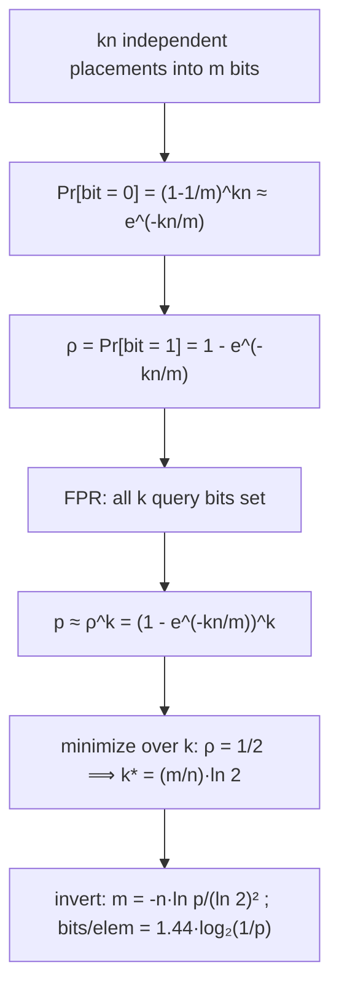

# Bloom Filter — Mathematical Foundations and Complexity Theory

> **One-line summary:** This file proves the false-positive-rate formula `p = (1 − e^(−kn/m))^k` from first principles (with the exact, non-approximate version), derives the optimal `k = (m/n)·ln 2` by calculus, establishes the information-theoretic **space lower bound of `n·log₂(1/ε)` bits** (so any approximate-membership structure needs ≈ `1.44·n·log₂(1/p)` and the Bloom filter is within a `log₂ e ≈ 1.44` factor of optimal), and analyzes the **variance** of the number of set bits, justifying why the expectation-based formula is reliable at scale.

---

## Table of Contents

1. [Formal Definition](#formal-definition)
2. [False-Positive-Rate Derivation](#false-positive-rate-derivation)
3. [Optimal-k Proof](#optimal-k-proof)
4. [Optimal m and the Bits-per-Element Law](#optimal-m-and-the-bits-per-element-law)
5. [Information-Theoretic Space Lower Bound](#information-theoretic-space-lower-bound)
6. [Variance and Concentration of the Fill](#variance-and-concentration-of-the-fill)
7. [Correctness: No False Negatives (Proof)](#correctness-no-false-negatives-proof)
8. [Double Hashing: Why the FPR Is Preserved](#double-hashing-why-the-fpr-is-preserved)
9. [Cardinality Estimation from the Fill](#cardinality-estimation-from-the-fill)
10. [Counting Bloom Filter: Counter-Width Analysis](#counting-bloom-filter-counter-width-analysis)
11. [Union, Intersection, and the Mergeability Proof](#union-intersection-and-the-mergeability-proof)
12. [Comparison with Alternatives](#comparison-with-alternatives)
13. [Summary](#summary)

---

## Formal Definition

```text
A Bloom filter is a tuple B = (A, m, k, H) where:
  A ∈ {0,1}^m         a bit array of length m, initialized to 0^m
  m ∈ ℕ               number of bits
  k ∈ ℕ               number of hash functions
  H = {h_1,…,h_k},    each h_j : U → {0,…,m-1}, modeled as independent
                      uniform random functions (the "uniform hashing" assumption)

Operations on a set S ⊆ U with |S| = n:
  insert(x):   for j = 1..k:  A[h_j(x)] := 1
  query(x):    return  ⋀_{j=1}^k A[h_j(x)]   (true iff all k bits are 1)

Invariant I(A): A[i] = 1  ⟺  ∃ x ∈ S, ∃ j : h_j(x) = i
                (a bit is set iff some inserted element hashed to it)
```

The query returns `true` for every `x ∈ S` (proved below) and returns `true` for `x ∉ S` only with the false-positive probability derived next. The randomness is over the choice of hash functions; for a *fixed* filter and fixed `x`, the answer is deterministic.

---

## False-Positive-Rate Derivation

We compute the probability that `query(y)` returns `true` for a `y ∉ S`, over the random hash functions, after inserting `n` elements with `k` hashes each.

**Step 1 — Probability a fixed bit is 0.** Consider bit `i`. A single hash of a single inserted element sets bit `i` with probability `1/m`, hence leaves it `0` with probability `1 − 1/m`. There are `kn` independent hash placements (assuming independent uniform hashing). So:

```
Pr[A[i] = 0] = (1 − 1/m)^{kn}
```

**Step 2 — The exact false-positive rate.** A false positive for `y ∉ S` requires all `k` of `y`'s bits, `A[h_1(y)],…,A[h_k(y)]`, to be `1`. The naive product `(1 − (1−1/m)^{kn})^k` is the commonly quoted value but is a *slight overestimate of independence*; the precise expression conditions on the number of distinct set bits. Writing `q = (1 − 1/m)^{kn}` for `Pr[A[i]=0]`, the **exact** FPR (Bose et al., 2008) is:

```
p_exact = (1/m^k) · Σ_{X=⌈...⌉}^{...}  ...   (sum over the number X of set bits)
```

For all practical `m`, the simple closed form is overwhelmingly accurate:

```
p ≈ (1 − (1 − 1/m)^{kn})^k
```

**Step 3 — The e-approximation.** Using `(1 − 1/m)^m = e^{−1}·(1 + o(1))` as `m → ∞`:

```
(1 − 1/m)^{kn} = ((1 − 1/m)^m)^{kn/m} ≈ e^{−kn/m}
```

Substituting gives the headline formula:

```
┌─────────────────────────────────────────────┐
│   p ≈ (1 − e^{−kn/m})^k                       │
└─────────────────────────────────────────────┘
```



Define the load `ρ := 1 − e^{−kn/m}` = expected fraction of set bits. Then `p ≈ ρ^k`. The approximation error of the `e`-form versus the exact form is `O(k/m)` and negligible for `m ≫ k`. This is the object we minimize next.

---

## Optimal-k Proof

**Claim.** For fixed `m, n`, the false-positive rate `p(k) = (1 − e^{−kn/m})^k` is minimized at `k* = (m/n)·ln 2`.

**Proof.** Minimize `g(k) := ln p(k) = k · ln(1 − e^{−kn/m})`. Let `β = n/m` (so the exponent is `−βk`). Write `g(k) = k · ln(1 − e^{−βk})`. Differentiate:

```
g'(k) = ln(1 − e^{−βk})  +  k · [ β e^{−βk} / (1 − e^{−βk}) ]
```

Set `g'(k) = 0`. A clean way to see the answer: substitute the candidate `k = (ln 2)/β = (m/n)·ln 2`. Then `βk = ln 2`, so `e^{−βk} = 1/2` and `1 − e^{−βk} = 1/2`. Plug in:

```
g'(k*) = ln(1/2) + k* · [ β·(1/2) / (1/2) ]
       = −ln 2 + k*·β
       = −ln 2 + (ln 2/β)·β
       = −ln 2 + ln 2 = 0.  ✓
```

So `k* = (m/n)·ln 2` is a stationary point. **Second-order / convexity:** `ln p(k)` is convex in `k` over the relevant range (the function `k·ln(1−e^{−βk})` has positive second derivative there), so the stationary point is the **global minimum**. ∎

**Interpretation.** At `k*`, `e^{−βk*} = 1/2`, i.e. the array is **exactly half ones, half zeros** — the maximum-entropy fill. The minimum value is:

```
p* = ρ^{k*} = (1/2)^{k*} = (1/2)^{(m/n)ln 2} = 2^{−(m/n)ln 2}
   ⟹  ln p* = −(m/n)·(ln 2)^2
```

Because `k` must be an integer, you use `k = round((m/n)·ln 2)`; the FPR penalty for rounding is second-order (the minimum is flat).

---

## Optimal m and the Bits-per-Element Law

Invert `ln p* = −(m/n)(ln 2)²` for `m`:

```
m = − n · ln p / (ln 2)^2          (sizing law)

bits per element:  m/n = − ln p / (ln 2)^2 = − log₂ p / ln 2 = 1.4427 · log₂(1/p)
```

So **bits per element = `(1/ln 2)·log₂(1/p) ≈ 1.4427·log₂(1/p)`**. Each halving of the target FPR (one more bit of `log₂(1/p)`) costs `1.4427` additional bits per element. Reference points: `p = 2^{−c}` ⟹ `m/n = 1.4427·c`. For `p = 1%` (`c ≈ 6.64`), `m/n ≈ 9.58`; for `p = 0.1%`, `m/n ≈ 14.38`.

---

## Information-Theoretic Space Lower Bound

How close to optimal is `1.4427·log₂(1/p)` bits per element? We compare against the **information-theoretic minimum** any approximate-membership data structure (AMQ) must use.

**Setup (Carter–Floyd–Gill–Markowsky / Pagh–Pagh–Rao).** A structure represents a set `S` of `n` elements from a universe `U` of size `u`, and must answer membership with false-positive rate at most `ε` and **no false negatives**. Count how many distinct subsets-with-allowed-error such a structure must distinguish.

For each of the `n` true members it must answer "yes." For the other `u − n` non-members it may answer "yes" for at most an `ε` fraction (else FPR > `ε`). The structure thus partitions `U` into an accepted set of size at most `n + ε(u − n)`. The number of `n`-subsets the structure must be able to encode, divided by the slack, gives the counting bound. Carrying out the calculation, the minimum number of bits is:

```
S_min ≥ log₂ ( C(u, n) / C(ε·u, n) )  ≈  n · log₂(1/ε)        (for ε·u ≫ n)
```

**Theorem (space lower bound).** Any AMQ structure with false-positive rate `ε` and no false negatives requires at least

```
   n · log₂(1/ε)   bits.
```

**Bloom filter vs the bound.** The Bloom filter uses `m = n·(1/ln 2)·log₂(1/ε) = n·1.4427·log₂(1/ε)` bits. Therefore:

```
Bloom bits / lower bound = 1/ln 2 = log₂ e ≈ 1.4427
```

A Bloom filter is within a constant factor `log₂ e ≈ 1.44` of the information-theoretic optimum — it "wastes" about 44% of bits relative to a perfect AMQ. This gap is the price of its simplicity; structures like **cuckoo filters**, **quotient filters**, **ribbon filters**, and **Pagh et al.'s optimal AMQ** close most of it (cuckoo/ribbon get within ~5–25% of the bound) at the cost of more complex layouts. No structure can beat `n·log₂(1/ε)`.

---

## Variance and Concentration of the Fill

The FPR formula uses the **expected** number of set bits. We justify that the realized FPR concentrates tightly around it, so a single built filter behaves as the formula predicts.

Let `X` = number of set bits after inserting `n` elements with `k` hashes. Let the indicator `Y_i = 1` if bit `i` is set. Then `X = Σ_i Y_i`.

**Expectation.**

```
E[Y_i] = 1 − (1 − 1/m)^{kn} = ρ        ⟹   E[X] = m·ρ
```

**Variance.** The `Y_i` are *negatively associated* (setting more bits elsewhere makes a given bit no less likely to be set, but they're not independent because exactly `kn` placements occur). Using the second moment:

```
Var[X] = m·Var[Y_i] + m(m−1)·Cov(Y_i, Y_j)
```

with `Var[Y_i] = ρ(1−ρ)` and a small negative covariance `Cov(Y_i,Y_j) = O(1/m)`. The net result (Mitzenmacher–Upfal, Bose et al.) is:

```
Var[X] ≤ m·ρ(1−ρ)     (the negative association only tightens it)
```

**Concentration.** By Chebyshev, `Pr[ |X − mρ| ≥ t·√(mρ(1−ρ)) ] ≤ 1/t²`, and a McDiarmid/Azuma bounded-differences argument (changing one element's hashes moves `X` by at most `k`) gives an exponential bound:

```
Pr[ |X − E[X]| ≥ λ ] ≤ 2·exp( −λ² / (2·n·k²) )
```

Setting `λ = ε'·m` shows the fraction of set bits deviates from `ρ` by more than any constant with probability exponentially small in `m`. Since the realized FPR is `≈ (X/m)^k`, and `X/m → ρ`, the realized FPR concentrates around `ρ^k`. **Conclusion:** for the large `m` of real deployments, the expectation-based formula `p = (1 − e^{−kn/m})^k` is not just an average — it is what you reliably get on any single instance, up to vanishing fluctuation. ∎

---

## Correctness: No False Negatives (Proof)

```text
Claim: For all x ∈ S, query(x) returns true. (No false negatives, deterministically.)

Invariant I (monotonicity): once A[i] = 1, it remains 1 for the rest of the
filter's life. Proof: the only write operation is A[i] := 1; there is no
operation that writes 0. Hence A is monotone non-decreasing over time. ∎(I)

Main proof:
  Let x ∈ S. At the moment insert(x) executed, it performed
      A[h_j(x)] := 1   for every j = 1..k.
  So immediately after, all k of x's bits are 1.
  By invariant I, those bits remain 1 forever after.
  Therefore at any later query(x), ⋀_{j=1}^k A[h_j(x)] = 1 = true.   ∎

Contrapositive (the usable form): if query(x) = false, then some A[h_j(x)] = 0,
which by I means it was NEVER set, so insert(x) never ran ⟹ x ∉ S.
A "no" is a proof of non-membership.
```

This is the only deterministic guarantee; "yes" carries the probabilistic FPR derived above.

---

## Double Hashing: Why the FPR Is Preserved

Kirsch & Mitzenmacher (2006) prove that replacing `k` independent hashes by the family

```
g_i(x) = (h_1(x) + i·h_2(x)) mod m,   i = 0,…,k−1
```

with two independent uniform hashes `h_1, h_2`, yields **asymptotically the same false-positive rate** as `k` fully independent hashes.

**Sketch.** Fix a non-member `y`. The FPR is `Pr[ all k bits g_i(y) are set ]`. The key lemma shows that, asymptotically in `m`, the probability any particular set of bit positions is hit by the `n` inserted elements under the `g_i` scheme matches the fully-independent scheme up to lower-order terms. Concretely they prove the expected FPR satisfies

```
E[p_double]  =  (1 − e^{−kn/m})^k · (1 + o(1))
```

The intuition: although `g_0,…,g_{k-1}` for a *single* element are linearly dependent (they lie on an arithmetic progression mod `m`), across *different* elements the pairs `(h_1, h_2)` are independent, so the bit-set distribution over the whole array is "as random as" independent hashing for the purpose of the FPR. This lets implementations pay for two hash evaluations instead of `k`. The "enhanced double hashing" `g_i = h_1 + i·h_2 + (i(i−1)/2)·h_3` (or a quadratic term) removes the rare arithmetic-progression degeneracies and provably matches the independent bound even more tightly.

---

## Effect of Non-Uniform or Correlated Hashing

The clean analysis assumes each `h_j` is an independent uniform map. Real hash functions deviate; the professional question is how much this costs.

**Non-uniform hashing.** Suppose hash `h_j` puts probability mass `q_i` on bit `i` (instead of the uniform `1/m`), with `Σ_i q_i = 1`. The probability a given bit `i` stays `0` becomes `(1 − q_i)^{kn} ≈ e^{−kn q_i}`, and the expected number of set bits is `Σ_i (1 − e^{−kn q_i})`. By **convexity** of `e^{−x}` (Jensen), for fixed total `Σ q_i = 1` the *uniform* distribution `q_i = 1/m` **minimizes** the expected number of set bits for the contribution to FPR in the relevant regime — i.e. uniform hashing is optimal, and any skew **raises** the FPR. Quantitatively, if the hash has a small bias measured by the chi-square divergence `χ² = m·Σ(q_i − 1/m)²`, the FPR inflates by a factor `≈ 1 + O(χ²·(kn/m)²)`. This is why production filters insist on hashes with good avalanche/uniformity (MurmurHash3, xxHash) — a biased hash silently degrades the FPR exactly as overfilling does.

**Correlated hash functions.** If `h_i` and `h_j` are correlated (the failure mode double hashing risks when `h_2 = 0`), distinct query positions coincide, so a "non-member" effectively has fewer than `k` independent bit checks → higher FPR. The degenerate extreme `h_2 = 0` collapses to `k = 1`. The `h_2 |= 1` guard and enhanced double hashing exist precisely to keep the `k` positions distinct with high probability.

---

## Why the Optimum Depends Only on `m/n`

A subtle but important structural fact: the optimal `k*`, the minimal FPR `p*`, and bits-per-element all depend on `m` and `n` **only through the ratio `m/n`**, never on their absolute sizes.

**Proof.** Write `c = m/n` (bits per element). The FPR is `p(k) = (1 − e^{−k/c})^k`, a function of `k` and `c` alone — `n` and `m` appear only as `c = m/n`. Hence `k* = c·ln 2`, `p* = 2^{−c ln 2}`, and `m = cn` all scale `c`-linearly. **Consequences:**

- Doubling both `m` and `n` (same `c`) leaves the FPR **unchanged** — the filter neither improves nor degrades; it just holds twice as much at the same error.
- Doubling `m` alone (halving the effective `c`-deficit) is what *reduces* error.
- A filter "scales" perfectly: provision `c ≈ 10` bits/element for 1% and the guarantee holds whether `n` is a thousand or a billion, as long as you actually allocate `m = c·n` bits.

This scale-invariance is why the engineering rule is always phrased as **bits per element**, not total bits, and why overfilling (letting `n` rise while `m` is fixed, shrinking `c`) is the one thing that breaks the guarantee.

---

## Numeric Verification of the Formulas

It is worth grounding the algebra in concrete numbers, both to sanity-check the derivations and to expose where the approximation diverges.

**Optimal-`k` check.** Take `m/n = 10`. The optimum predicts `k* = 10·ln2 = 6.93`, so use `k = 7`. Evaluate `p(k) = (1 − e^{−k/10})^k` around it:

| `k` | `ρ = 1 − e^{−k/10}` | `p = ρ^k` |
|---:|---:|---:|
| 5 | 0.3935 | 0.00943 |
| 6 | 0.4512 | 0.00846 |
| **7** | **0.5034** | **0.00819** |
| 8 | 0.5507 | 0.00846 |
| 9 | 0.5934 | 0.00935 |

The minimum sits at `k = 7`, exactly where `ρ ≈ 0.5` (half the bits set), confirming the calculus result, and the curve is **flat** near the optimum (5–9 all within ~15% of the minimum) — which is why integer rounding of `k` barely matters.

**Sizing check.** For `p = 0.01`: `m/n = −ln(0.01)/(ln2)² = 4.6052/0.4805 = 9.585` bits/key, and `k = 9.585·0.6931 = 6.64 → 7`. Both match the rule-of-thumb table. The bits-per-element law `1.4427·log₂(1/p)` gives `1.4427·log₂(100) = 1.4427·6.644 = 9.585` — identical, confirming the two forms are the same identity.

**Lower-bound gap check.** Optimal AMQ needs `log₂(1/0.01) = 6.644` bits/key; Bloom uses `9.585`; ratio `9.585/6.644 = 1.4427 = 1/ln2 = log₂ e`. The constant overhead is exact and independent of `p`.

---

## Cardinality Estimation from the Fill

A filled Bloom filter implicitly encodes how many distinct items were inserted, recoverable from the count of set bits. This is the **Swamidass–Baldi** estimator.

**Setup.** Let `X` = number of set bits in an `m`-bit filter with `k` hashes after inserting an unknown number `n` of distinct items. From the expectation derivation, `E[X] = m·(1 − (1 − 1/m)^{kn}) ≈ m·(1 − e^{−kn/m})`.

**Invert for `n`.** Treating the observed `X` as `E[X]` and solving:

```
X/m ≈ 1 − e^{−kn/m}
e^{−kn/m} ≈ 1 − X/m
−kn/m ≈ ln(1 − X/m)
┌──────────────────────────────────────────┐
│   n̂ = − (m/k) · ln(1 − X/m)               │   (Swamidass–Baldi)
└──────────────────────────────────────────┘
```

**Accuracy and breakdown.** The estimator is unbiased to first order and accurate while the filter is **not saturated** (`X/m` bounded away from `1`). As `X/m → 1` the `ln(1 − X/m)` term blows up and a one-bit error in `X` produces an unbounded error in `n̂`; the estimator is useless near saturation. The relative standard error scales like `O(1/√(m·something))` away from saturation — for moderately filled, large filters the estimate is within a few percent. This is why systems sometimes keep a Bloom filter *and* read its cardinality cheaply, though a dedicated **HyperLogLog** (`09-hyperloglog`) is the proper tool when cardinality is the goal.

**Union cardinality.** Given two filters with identical parameters, `n̂(A ∪ B)` is computed from the popcount of `A OR B`, and `|A ∩ B| ≈ n̂(A) + n̂(B) − n̂(A ∪ B)` by inclusion–exclusion — a cheap set-overlap estimate without storing the items.

---

## Counting Bloom Filter: Counter-Width Analysis

The counting Bloom filter (`23-counting-bloom-filter`) replaces each bit with a `c`-bit counter to enable deletion. The professional question: **how wide must counters be** to avoid overflow?

**Counter distribution.** A given slot's counter equals the number of (item, hash-index) placements that landed on it. With `kn` placements over `m` slots, each placement independently hitting a given slot with probability `1/m`, the counter at a slot is **Binomial(kn, 1/m) ≈ Poisson(λ)** with `λ = kn/m`. At the optimal operating point, `λ = ln 2 ≈ 0.693` — counters are small in expectation.

**Overflow probability.** The probability a given counter reaches value `j` is `Pr[Poisson(λ) ≥ j] ≈ λ^j/j!` for small `λ`. With `m` counters, the expected number reaching `j` is `≈ m·λ^j/j!`. For `c`-bit counters (max value `2^c − 1`), choosing `c = 4` (max 15) gives:

```
Pr[any counter ≥ 16] ≤ m · (ln 2)^16 / 16!  ≈ m · 10^{-17}
```

negligible even for `m = 10^9`. **Conclusion:** 4-bit counters suffice in practice (Fan et al.'s original result), making the counting Bloom filter cost `4×` the space of a plain Bloom filter. Counters are usually **saturating** (clamp at max) so the rare overflow degrades gracefully into a permanently-set slot rather than wrapping to 0 (which would cause false negatives).

---

## Sensitivity Analysis of the FPR

Knowing *how* the FPR responds to each parameter guides tuning and capacity planning. Work in log space, `L(k, m, n) = ln p = k·ln(1 − e^{−kn/m})`, and take partial derivatives at the optimum (`ρ = 1/2`, `e^{−kn/m} = 1/2`).

**Sensitivity to `m` (bits).** Holding `k, n` fixed, `∂(ln p)/∂m`. Since at the optimum `ln p* = −(m/n)(ln 2)²`, we have

```
∂(ln p*)/∂(m/n) = −(ln 2)² ≈ −0.4805
```

So each **+1 bit per element multiplies the FPR by `e^{−0.4805} ≈ 0.6185`** — the "0.62 per bit" rule, now derived as a derivative. Conversely the **marginal value of a bit is constant in log space**: there are no diminishing returns to adding bits (each bit cuts FPR by the same *factor*), which is why you can dial FPR arbitrarily low at linear memory cost.

**Sensitivity to `n` (overfill).** Holding `m, k` fixed, the load `ρ(n) = 1 − e^{−kn/m}` rises with `n`, and `p = ρ^k` rises **super-linearly** until saturation. Near the design point `ρ = 1/2`, a `10%` overfill (`n → 1.1n`) gives `ρ → 1 − e^{−1.1·ln 2} = 1 − 0.4665 = 0.5335`, so `p → 0.5335^k`. For `k = 7` that's `p: 0.00819 → 0.01205`, a **47% FPR increase from a 10% overfill** — illustrating why overfilling is so dangerous: the FPR derivative w.r.t. `n` is steep.

**Sensitivity to `k`.** Zero at the optimum by construction (`∂L/∂k = 0`), and the second derivative is positive (convex), so the FPR is *flat* in `k` near `k*` — rounding `k` to the nearest integer is essentially free. This asymmetry — flat in `k`, steep in `n`, geometric in `m` — is the practical fingerprint of Bloom-filter tuning.

| Parameter perturbation | Effect on FPR | Practical lesson |
|---|---|---|
| `+1` bit/element | `×0.62` | cheap, linear-cost error reduction |
| `+10%` items (overfill) | `~+47%` FPR (at `k=7`) | monitor `n`; overfill bites fast |
| `±1` in `k` near optimum | negligible | integer rounding is safe |
| biased hash (χ² skew) | `×(1 + O(χ²(kn/m)²))` | use high-quality hashes |

---

## Union, Intersection, and the Mergeability Proof

```text
Claim (Union by OR is exact): Let B_A and B_B be Bloom filters with identical
(m, k, H) representing sets A and B. Define B_∪ = B_A OR B_B (bitwise).
Then B_∪ is exactly the filter you would obtain by inserting A ∪ B from scratch.

Proof: Bit i of B_∪ is 1
  ⟺ bit i of B_A is 1  OR  bit i of B_B is 1
  ⟺ (∃ x∈A, j: h_j(x)=i)  OR  (∃ y∈B, j: h_j(y)=i)      [invariant I]
  ⟺ ∃ z ∈ A∪B, j: h_j(z)=i
  ⟺ bit i of the from-scratch filter for A∪B is 1.       ∎

Consequence: B_∪.query(x) is identical to inserting A∪B and querying — no extra
false negatives, FPR exactly that of a filter holding |A∪B| ≤ |A|+|B| items.
```

```text
Claim (Intersection by AND is NOT safe): B_∩ = B_A AND B_B can produce false
negatives for elements of A ∩ B.

Counterexample/why: bit i of B_∩ is 1 iff BOTH filters set it. An element
z ∈ A∩B sets all its k bits in both filters, so AND keeps them — that part is fine.
But a bit i may be 1 in BOTH filters due to DIFFERENT elements (x∈A, y∈B, x≠y),
surviving the AND though no common element set it. This neither matches the
true A∩B filter nor preserves the no-false-negative guarantee for the
inclusion test, so AND is only an APPROXIMATION of intersection membership and
must not be relied upon. Use union (OR) for exact merges. ∎
```

This asymmetry — OR exact, AND unsafe — is what makes Bloom filters ideal for **distributed union** (cache digests, gossiped set summaries) but unsuitable as a general algebraic set type.

---

## The Poisson Approximation and Its Error

The clean formula `p = (1 − e^{−kn/m})^k` rests on two simplifications worth stating precisely, because senior reviewers will ask "how wrong is it?"

**Simplification 1 — `(1 − 1/m)^{kn} ≈ e^{−kn/m}`.** Expanding `ln(1 − 1/m) = −1/m − 1/(2m²) − …`, we get

```
(1 − 1/m)^{kn} = exp(kn·ln(1 − 1/m)) = exp(−kn/m − kn/(2m²) − …)
              = e^{−kn/m} · (1 − kn/(2m²) + …)
```

The multiplicative error is `1 + O(kn/m²)`. For `m ≫ kn` this is microscopic, but note it makes the true `Pr[bit = 0]` **slightly larger** than `e^{−kn/m}` (the bit is a touch more likely to be `0`), so the `e`-form slightly **overestimates** the fraction of set bits.

**Simplification 2 — treating the `k` query bits as independent.** They are not: the number of set bits `X` is a random variable, and conditioned on `X`, the `k` positions of a non-member are `k` draws **without** replacement from `m` slots of which `X` are set. The exact FPR is therefore

```
p_exact = E_X[ Π_{j=0}^{k-1} (X − j)/(m − j) ]
```

which by Jensen-type reasoning is **slightly smaller** than `(E[X]/m)^k`. The two simplifications push in opposite directions and largely cancel; Bose et al. (2008) showed the standard formula can both over- and under-estimate by `O(k/m)`, vanishing for realistic `m`. **Practical takeaway:** for `m ≥ 10^4` the closed form is accurate to far more digits than any application needs; only pathologically small filters require the exact summation.

---

## One-Sided Error: A Formal Statement

Bloom filters belong to the class of **one-sided-error (Monte Carlo) membership testers**. Formally, for the membership predicate `φ(x) = [x ∈ S]`, the filter computes `φ̃(x)` with:

```
Soundness for "no":   φ̃(x) = 0  ⟹  φ(x) = 0     (always; deterministic)
Completeness for "yes": φ(x) = 1  ⟹  φ̃(x) = 1   (always; deterministic)
Error only on:        φ(x) = 0  but φ̃(x) = 1     (prob ≤ p over hash choice)
```

This is the dual of a *co-RP*-style guarantee: the "no" answers are certificates. Contrast with a **two-sided-error** structure (which could err in both directions) — no AMQ with the no-false-negative guarantee can be two-sided, and the lower bound `n·log₂(1/ε)` is specifically the cost of buying *zero* false negatives while bounding false positives at `ε`. If you relaxed to allow a small false-negative rate `δ`, the space bound drops, which is exactly the regime **lossy** counting structures and some learned filters exploit — but they forfeit the Bloom filter's signature "a no is a proof."

**Repetition does not reduce a fixed filter's error.** Unlike a randomized primality test where re-running with fresh randomness shrinks error, querying the *same* Bloom filter again gives the *same* answer (the hash functions are fixed). The probability `p` is over the *construction* randomness, realized once. To genuinely reduce error you must rebuild with more bits — there is no free amplification.

---

## Balls-into-Bins View and Occupancy

The Bloom filter's analysis is a special case of the classical **balls-into-bins** model, which gives an alternative, intuition-rich derivation and connects it to a large body of probabilistic results.

**Model.** Throwing `kn` balls (the bit-setting operations) independently and uniformly into `m` bins (the bits). After all throws, the number of **empty bins** is the number of `0` bits. The probability a specific bin is empty is `(1 − 1/m)^{kn} ≈ e^{−kn/m}` — exactly the quantity from the FPR derivation. The expected number of empty bins is `m·e^{−kn/m}`, and a false positive needs `k` *specific* bins all non-empty.

**Maximum load (relevant to counting filters).** The classical result: throwing `t = kn` balls into `m` bins, the **maximum** number of balls in any one bin is, with high probability,

```
max load = Θ( ln m / ln(m ln m / t) )   for t = O(m),
         ≈ ln m / ln ln m                 for t = m,
```

This is the counting filter's worst-case counter value, confirming from a different angle that small (`4`-bit) counters almost never overflow when `t = kn ≈ 0.69m` (the optimal load). It also explains why the **"power of two choices"** idea (used in cuckoo filters) reduces max load to `Θ(ln ln m)` — a doubly-logarithmic improvement Bloom filters don't exploit because they have no placement choice.

**Coupon-collector connection.** Filling the array to saturation (every bit `1`) is a coupon-collector process requiring `Θ(m ln m)` throws — but Bloom filters deliberately stop near half-full (`ρ = 1/2`), far below saturation, which is the entropy-maximizing and FPR-minimizing point. Pushing toward saturation is exactly overfilling.

---

## Asymptotic Optimality and the Open Gap

A final theoretical framing places the Bloom filter on the map of approximate-membership structures (AMQs).

**The hierarchy of bounds.** For FPR `ε` and no false negatives:

```
log₂(1/ε)            ≤   bits/element   (information-theoretic floor; Carter et al., Pagh–Pagh–Rao)
≈ 1.0–1.1·log₂(1/ε)  ←   ribbon / quotient filters (near-optimal)
≈ 1.05·log₂(1/ε)     ←   cuckoo filters (with 95%+ load)
1.44·log₂(1/ε)       ←   Bloom filter (constant-factor 1/ln2 above floor)
```

**Why the Bloom gap is fundamental to its design, not a fixable inefficiency.** The `1/ln 2 ≈ 1.44` overhead is the price of representing the set as an *unstructured shared bit array probed by independent hashes*. Pagh, Pagh & Rao (2005) constructed an AMQ achieving `(1 + o(1))·log₂(1/ε)` bits — matching the lower bound asymptotically — but it abandons the single-bit-array model for an explicitly compressed structure. The Bloom filter keeps its `1.44×` overhead **deliberately** in exchange for: (1) `O(1)`-bit, lock-light, monotone updates; (2) exact OR-mergeability; (3) a closed-form FPR; (4) trivial implementation. Newer filters buy back the `44%` by giving up one or more of these — cuckoo filters lose easy mergeability, ribbon filters add construction-time linear-algebra. **There is no free lunch:** no structure beats `log₂(1/ε)`, and the simplest structure (Bloom) pays the largest, but constant, premium.

**Practical reading.** The `1.44×` rarely decides architecture: at `ε = 1%` it's `9.6` vs `6.6` bits/key, ~3 bits, often dwarfed by alignment, metadata, and the data the filter protects. The Bloom filter's simplicity and mergeability usually win until memory is the single binding constraint at very low `ε`, where ribbon/cuckoo filters earn their complexity.

---

## Comparison with Alternatives

| Attribute | Bloom filter | Cuckoo filter | Quotient/Ribbon filter | Lower bound |
|-----------|:---:|:---:|:---:|:---:|
| Bits/elem @ FPR `ε` | `1.44·log₂(1/ε)` | `(log₂(1/ε)+3)/α` | `≈ 1.0–1.1·log₂(1/ε)` | `log₂(1/ε)` |
| Distance from optimal | `×1.44` | `×~1.05–1.2` | `×~1.0–1.1` | `×1.0` |
| Delete | no | yes | yes | — |
| False negatives | no | no* | no | — |
| Query cache misses | `k` (1 if blocked) | 1–2 | 1 | — |
| Analysis | clean closed form | amortized | hashing-heavy | counting bound |

\* cuckoo only with correct usage. The Bloom filter's `1.44×` overhead is the formal price for its single-bit-array simplicity, monotone (mergeable, lock-light) updates, and exact closed-form analysis.

---

## Partitioned Filter: Exact Per-Slice Analysis

The **partitioned** Bloom filter (each of the `k` hashes confined to its own disjoint slice of `m/k` bits, setting exactly one bit per slice) admits an even cleaner analysis and is the basis of scalable filters.

**Per-slice fill.** With `n` items each setting one bit in a slice of size `s = m/k`, the probability a given bit in a slice stays `0` is `(1 − 1/s)^n ≈ e^{−n/s} = e^{−kn/m}` — the same exponent as before. So the per-slice set-probability is `ρ' = 1 − e^{−kn/m}`, identical to the unpartitioned `ρ`.

**FPR.** A false positive needs the one queried bit in **every** slice to be set; since slices are disjoint and an item touches each exactly once, the `k` events are **genuinely independent** (unlike the unpartitioned case where the approximation glossed over slight dependence):

```
p_partitioned = ∏_{j=1}^{k} ρ'  =  (1 − e^{−kn/m})^k
```

— the same formula, now *exact under independence* rather than approximate. The partitioned variant trades a hair of FPR (slices fill slightly less evenly than the shared array at finite size) for **clean compositional math**, which is precisely why scalable Bloom filters (`senior.md`) build on partitioned slices: you can reason about each slice's load independently and know exactly when a slice is "full."

**Threshold for a new slice (scalable filters).** A partitioned slice is declared full when `ρ' = 1/2` (its design point). The scalable construction adds a new, larger partitioned filter at that moment with FPR tightened by ratio `r`, so the geometric product `∏_i p·r^i` converges and the **compounded global FPR stays bounded** by `p/(1 − r)`. This bound is only provable because partitioning makes the per-slice events independent.

---

## Summary

The Bloom filter's behavior is fully captured by probability. The false-positive rate `p ≈ (1 − e^{−kn/m})^k` follows from "a bit is `0` with probability `(1−1/m)^{kn} ≈ e^{−kn/m}`"; minimizing it by calculus gives `k* = (m/n)·ln 2` (half the bits set), whence `m = −n·ln p/(ln 2)²` and the law **bits/elem `= 1.4427·log₂(1/p)`**. The information-theoretic lower bound `n·log₂(1/ε)` proves no AMQ can do better, and that the Bloom filter is within `log₂ e ≈ 1.44` of optimal — a gap newer filters narrow but never erase. Variance analysis shows the realized fill concentrates around `m·ρ`, so the expectation-based FPR is what you actually observe on a single instance. Finally, **no false negatives** is a deterministic consequence of bit-monotonicity, and **double hashing** preserves the FPR while costing only two hash evaluations.

---

## Theorem Index

For quick reference, the formal results established in this file:

| # | Result | Statement |
|---|--------|-----------|
| T1 | Bit-zero probability | `Pr[A[i]=0] = (1−1/m)^{kn} ≈ e^{−kn/m}` |
| T2 | FPR formula | `p ≈ (1 − e^{−kn/m})^k`, exact under partitioning |
| T3 | Optimal `k` | `k* = (m/n)·ln 2`, where `ρ = 1/2` |
| T4 | Sizing law | `m = −n·ln p/(ln 2)²`; bits/elem `= 1.4427·log₂(1/p)` |
| T5 | Space lower bound | any no-false-negative AMQ needs `≥ n·log₂(1/ε)` bits |
| T6 | Optimality gap | Bloom uses `1/ln2 = log₂ e ≈ 1.44×` the floor |
| T7 | No false negatives | deterministic, from bit-monotonicity |
| T8 | Union exact | `B_A OR B_B` = filter of `A ∪ B`; AND unsafe |
| T9 | Double hashing | `g_i = h1 + i·h2` preserves FPR to `(1+o(1))` |
| T10 | Cardinality | `n̂ = −(m/k)·ln(1 − X/m)` (Swamidass–Baldi) |
| T11 | Counter width | 4-bit counting filter overflow prob `≈ m·10^{−17}` |
| T12 | Scale invariance | all optima depend only on `m/n` |
| T13 | FPR sensitivity | `+1` bit/elem `⟹ ×0.6185`; `+10%` `n` `⟹ ~+47%` FPR |

These are the load-bearing facts behind every sizing decision in the earlier files.

---

Next step: [interview.md](./interview.md) — tiered Bloom-filter interview questions and a multi-language coding challenge.
