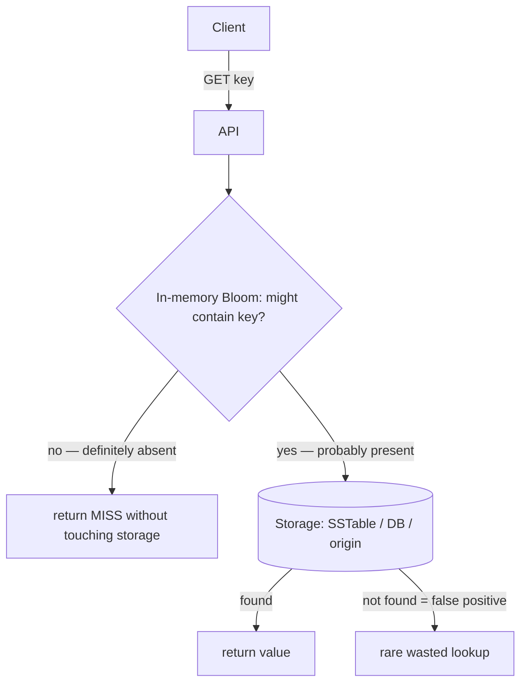
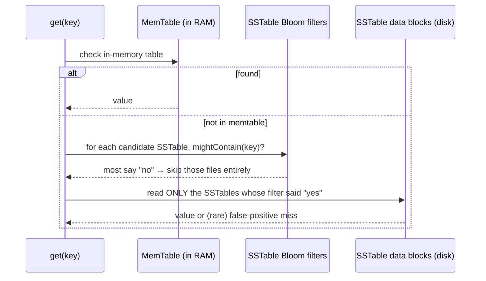
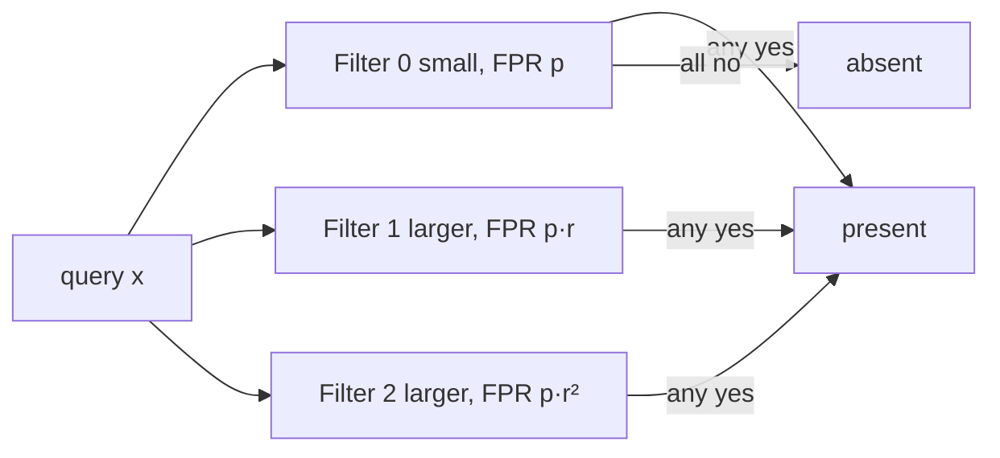
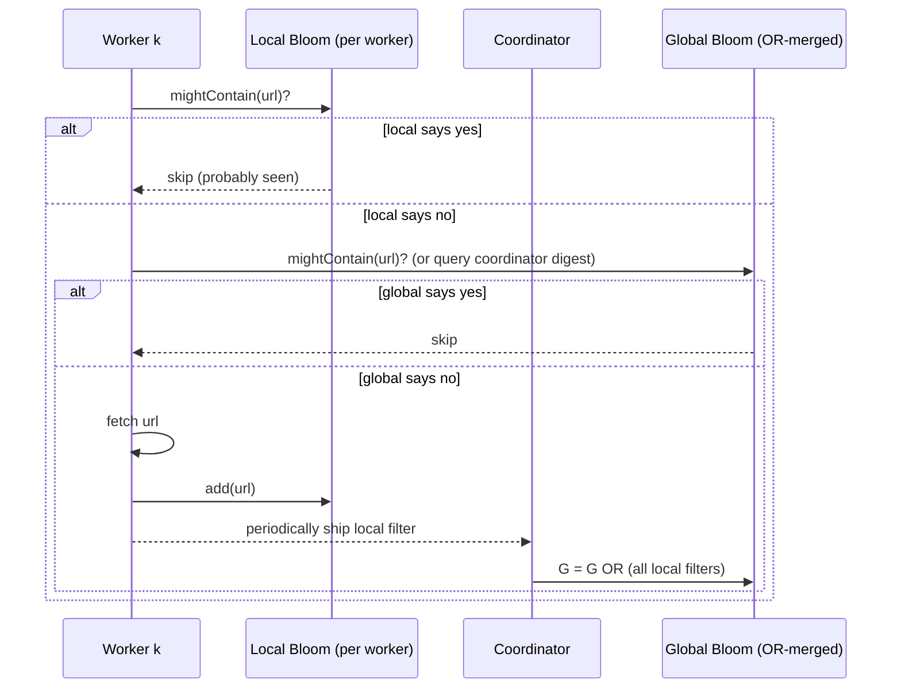
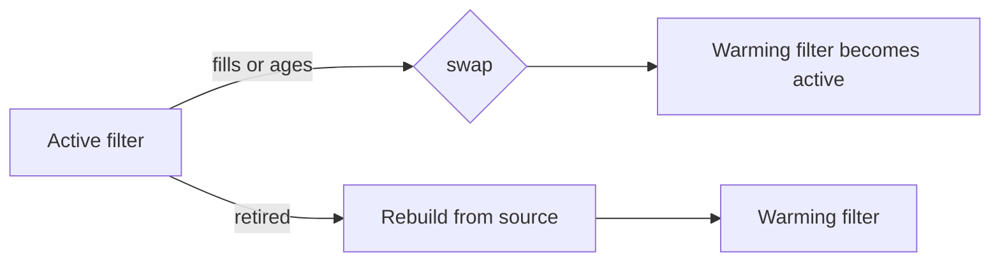

# Bloom Filter — Senior Level

> **One-line summary:** At system scale a Bloom filter is the cheap negative-lookup gate that saves the expensive one. LSM-tree storage engines (RocksDB, Cassandra, LevelDB, HBase) attach a per-SSTable Bloom filter so a point read skips files that *can't* hold the key; CDNs and caches use Bloom filters to dodge "one-hit-wonder" cache pollution; web crawlers dedup URLs; and networking gear uses them for routing and DDoS filtering. Senior work is **tuning FPR against memory and cache lines**, and choosing **blocked / scalable / partitioned / distributed** variants for the workload.

---

## Table of Contents

1. [Introduction](#introduction)
2. [System Design with Bloom Filters](#system-design-with-bloom-filters)
3. [LSM-Trees and Database Negative Lookups](#lsm-trees-and-database-negative-lookups)
4. [CDN and Cache Admission](#cdn-and-cache-admission)
5. [Web Crawling and Networking](#web-crawling-and-networking)
6. [Distributed and Scalable Bloom Filters](#distributed-and-scalable-bloom-filters)
7. [Cache-Efficiency: Blocked Bloom Filters](#cache-efficiency-blocked-bloom-filters)
8. [Tuning FPR vs Memory](#tuning-fpr-vs-memory)
9. [Worked Capacity Plan](#worked-capacity-plan)
10. [Real Engine Knobs](#real-engine-knobs)
11. [Comparison with Alternatives](#comparison-with-alternatives)
12. [Code Examples](#code-examples)
13. [Observability](#observability)
14. [Failure Modes](#failure-modes)
15. [Summary](#summary)

---

## Introduction

> Focus: *"How do I architect systems around a Bloom filter, and which variant?"*

A senior engineer doesn't ask "what is a Bloom filter" — they ask "where does a one-sided membership gate pay off in this system, what false-positive rate can I afford, and how much RAM and cache pressure will that cost?" The recurring pattern is the same everywhere:

> There is an **expensive** operation (disk read, network round-trip, cache insert) and an **in-memory** Bloom filter that says, for most non-members, *"don't bother."*

The filter never makes you *miss* a real member (no false negatives), so it is safe to gate the expensive path with it; it only occasionally lets a non-member through (a false positive), which costs one wasted expensive operation. The engineering is in (1) picking the FPR that balances filter RAM against wasted work, (2) keeping the `k` bit-probes cache-friendly, and (3) choosing a variant — blocked, scalable, partitioned, distributed — that matches how the set grows and where it lives. This file walks the canonical production uses and the tuning levers behind them.

---

## System Design with Bloom Filters



The Bloom filter sits **in front of** the slow tier. The win is measured in *avoided* expensive operations: if 95% of queries are for non-members and the filter has a 1% FPR, you eliminate roughly `0.95 × 0.99 ≈ 94%` of the slow lookups. The filter's memory cost (≈10 bits/key for 1% FPR) is almost always tiny next to the storage tier it protects.

---

## LSM-Trees and Database Negative Lookups

This is the textbook production use. An **LSM-tree** (Log-Structured Merge tree — RocksDB, LevelDB, Cassandra, HBase, ScyllaDB) stores data in many immutable on-disk files called **SSTables**, layered across levels. A point read `get(key)` may have to consult *several* SSTables because the key could live in any of them. Without help, that's many disk/SSD reads per lookup, most of which find nothing.

Each SSTable carries its own **Bloom filter over its keys**, held in memory (or page cache). On a read:



The Bloom filter converts a read that is **absent** in a file into a cheap in-RAM "no," skipping the disk read for that file. This is decisive for **read-heavy, miss-heavy** workloads (e.g. "does this user exist?" where most answers are no). RocksDB exposes this directly: `BlockBasedTableOptions.filter_policy = NewBloomFilterPolicy(bits_per_key)`, where `bits_per_key = 10` gives ~1% FPR. RocksDB also offers **partitioned** and **ribbon** filters, and per-level filter tuning (often *no* filter on the largest level, where the filter itself would consume too much RAM relative to its benefit).

**Why FPR matters here:** a false positive means one *unnecessary SSTable read*. At a 1% FPR with 5 candidate SSTables, you do about `0.05` extra reads per absent lookup — cheap. Dropping FPR to 0.1% costs ~50% more filter RAM for diminishing read savings, so most engines settle near `10 bits/key`.

---

## CDN and Cache Admission

CDNs and caches face the **one-hit-wonder** problem: a large fraction of requested objects are accessed exactly once. Caching them on first sight pollutes the cache and evicts genuinely hot objects. A common admission policy: **only cache an object on its second request.** A Bloom filter (or a counting/decaying variant) records "have I seen this key before?" cheaply:

- First request: filter says "no" → record it, **don't cache** the object yet.
- Second request: filter says "yes" → admit the object to the real cache.

This filters out the long tail of single-access objects without storing them, dramatically improving the hit ratio of the *real* cache for a few bits per seen key. Because the seen-set is unbounded and decays over time, production systems use a **counting Bloom filter** (so entries can age out) or rotate two Bloom filters periodically. (Cross-link: `23-counting-bloom-filter`.) Akamai-style and Redis-fronting designs use exactly this "Bloom filter as the bouncer for the cache" pattern.

---

## Web Crawling and Networking

**Web crawling — URL dedup.** A crawler must avoid re-fetching URLs it has already queued/visited. The "seen URL" set can reach billions of entries; storing full URLs is prohibitive. A Bloom filter answers "have I seen this URL?" in a few bits each. A false positive means the crawler *skips* a URL it hasn't actually seen — an acceptable, rare loss of coverage — while a false negative (re-crawl) is impossible, so it never loops. Google's early crawler and many open-source crawlers (Scrapy with `scrapy-bloom`, Apache Nutch) use this.

**Networking.** Bloom filters appear throughout packet processing:
- **Distributed caching / Squid** uses **cache digests** (Bloom-filter summaries of cache contents) so peers know what each other holds without querying.
- **Routers / switches** use Bloom filters for fast longest-prefix and multicast forwarding decisions, and for **per-flow state** that must fit in fast SRAM.
- **DDoS / packet filtering** uses Bloom filters to recognize known-bad sources or to detect duplicate/seen packets at line rate.
- **Network security** uses them in intrusion detection to pre-screen payloads against signature sets before an exact (expensive) match.

The common thread: line-rate decisions demand a structure that fits in tiny fast memory and answers in constant time — a Bloom filter's exact strengths.

**Cache digests in detail.** In a cooperative cache mesh (Squid's ICP successor, CDN peer fabrics), each node periodically publishes a **Bloom filter of the object keys it currently holds** — its "cache digest." When node A gets a miss, instead of broadcasting a query to every peer (expensive, chatty), it consults the locally-held digests of its peers: if peer B's digest says "maybe has it," A fetches from B; if all digests say "no," A goes straight to the origin. The digest is a few hundred KB summarizing a cache of millions of objects, refreshed every few minutes. False positives cost one wasted peer fetch (the peer responds "actually I don't have it"); false negatives are impossible, so A never *fails* to find a cached object that a digest would have revealed. The bandwidth math is decisive: a 1 MB digest replaces what would otherwise be thousands of per-object peer queries per second.

**Why Bloom and not an exact index for digests.** An exact key index would be too large to ship and refresh across the mesh every few minutes; the Bloom digest is `~10` bits/object regardless of key length, mergeable, and cheap to diff. The occasional wasted peer fetch is far cheaper than the bandwidth an exact index would consume.

---

## Distributed and Scalable Bloom Filters

**Distributed Bloom filters.** Because inserts only ever flip bits `0→1`, two Bloom filters of the **same `m`, `k`, and hash seeds** can be **merged with a bitwise OR**. This makes them trivial to distribute: each node builds a local filter; a coordinator ORs them into a global filter; the merged filter answers membership over the union. (Intersection via AND is *not* exact — it can introduce false negatives — so only union/OR is safe.) This is how cache digests and distributed dedup propagate set summaries cheaply across a cluster.

**Scalable Bloom filters (SBF).** A plain filter requires knowing `n` up front; overfilling wrecks the FPR. A **scalable Bloom filter** (Almeida et al.) sidesteps this by maintaining a *list* of Bloom filters: when the current one fills to its target load, you add a **new, larger** filter with a **tighter** per-filter FPR (each new slice gets FPR `p·r^i` for ratio `r < 1`, typically `r = 0.9`), so the compounded error stays below the global target. Queries check **all** filters (a "yes" from any → present); inserts go into the newest. This gives unbounded growth with a bounded overall FPR, at the cost of `O(number_of_slices)` probes per query.



**Partitioned Bloom filters.** Instead of all `k` hashes ranging over the whole `m`-bit array, split the array into `k` equal **slices** of `m/k` bits, with hash `i` setting one bit in slice `i`. Each item sets **exactly one bit per slice**. This makes the fill of each slice predictable, simplifies the scalable-filter math (you know a slice is "full" at a clean threshold), and is the basis of the scalable construction above. The FPR is `(1 − e^(−n/(m/k)))^k`, essentially the same as the unpartitioned filter.

---

## Cache-Efficiency: Blocked Bloom Filters

The hidden cost of a large Bloom filter is **cache misses**: a standard filter spreads its `k` bits across the whole `m`-bit array, so a single query can touch up to `k` different cache lines — up to `k` cache misses on a filter far larger than L3.

A **blocked Bloom filter** fixes this: partition the array into **blocks the size of one cache line** (typically 512 bits = 64 bytes). The first hash picks a *block*; the remaining `k−1` hashes set bits **within that one block**. Now every insert and query touches **exactly one cache line → one cache miss**, often a 2–4× latency win on large filters. The trade-off is a slightly higher FPR for the same `m` (because confining `k` bits to a 512-bit block raises local collision probability), so you compensate with a few extra bits per key. This is the variant high-performance systems (RocksDB's block-based filter, ClickHouse, Impala/Parquet) actually deploy.

| Variant | Cache lines touched / op | Relative FPR (same m) | Use case |
|---|:---:|:---:|---|
| Standard Bloom | up to `k` | baseline | small filters, fits in cache |
| Blocked Bloom | **1** | slightly higher | large filters, latency-critical |
| Register-blocked | 1 (SIMD within word) | higher | extreme throughput (SIMD) |

---

## Tuning FPR vs Memory

The lever is `m/n` (bits per key), which sets FPR via `p* = 0.6185^(m/n)`. Each added bit/key multiplies FPR by `~0.6185`. The right operating point balances two costs:

```text
Total cost ≈ filter_RAM_cost(m)  +  FPR × cost_of_one_wasted_expensive_op × query_rate
```

- If the expensive op is a **cheap local SSD read**, accept a higher FPR (fewer bits) — e.g. `7–10 bits/key`, FPR ~1–2%.
- If the expensive op is a **cross-datacenter RPC or a cache-fill stampede**, drive FPR lower (`14–20 bits/key`, 0.1–0.01%).
- If RAM is the binding constraint (filters must fit in page cache across millions of SSTables), accept higher FPR or **drop the filter on the largest LSM level** (RocksDB's `optimize_filters_for_hits`).

| bits/key | FPR | typical use |
|---:|---:|---|
| 5 | ~9% | coarse pre-filter, RAM-starved |
| 8 | ~2% | balanced default |
| 10 | ~1% | RocksDB/Cassandra default |
| 14 | ~0.1% | expensive backing lookups |
| 20 | ~0.01% | network RPC / stampede-sensitive |

---

## Worked Capacity Plan

Concrete sizing is a senior interview staple. **Scenario:** a key-value store holds **2 billion** keys spread across SSTables; reads are 80% for keys that **don't exist** (a typical "does this account exist?" workload). Budget the Bloom filters.

**Step 1 — pick the FPR.** A false positive costs one unnecessary SSTable read (local NVMe, ~100 µs). At 80% absent reads, a 1% FPR means `0.8 × 0.01 = 0.8%` of reads do one wasted NVMe read — negligible. Choose `p = 1%` → `10` bits/key.

**Step 2 — total filter RAM.** `m = 10 bits × 2×10⁹ = 2×10¹⁰ bits = 2.5 GB`. That fits in the page cache of a single large node, and it eliminates ~`0.8 × 0.99 = 79%` of all read I/O. The 2.5 GB is trivial next to the terabytes of SSTable data it guards.

**Step 3 — per-level decision.** In an LSM, the **largest level** holds most keys (say 90% of the 2B). Its filter alone is ~2.25 GB. If RAM is tight, RocksDB's `optimize_filters_for_hits` *drops the filter on the bottom level*: reads that reach the bottom level are mostly hits anyway (they passed all upper filters), so the bottom filter saves little. Dropping it reclaims ~2.25 GB at the cost of slightly more bottom-level reads for the rare absent key that reaches it.

**Step 4 — restate the win.** `reads_avoided ≈ absent_fraction × (1 − FPR) × read_rate`. At 200k reads/s, that's `200k × 0.8 × 0.99 ≈ 158k` disk reads/s eliminated — the difference between a healthy and an I/O-bound cluster, bought with a few GB of RAM.

```text
Cheat formula for capacity planning:
  RAM (bytes)        = bits_per_key × n / 8
  reads_avoided/s    = absent_frac × (1 − FPR) × qps
  wasted_reads/s     = absent_frac × FPR × qps
  pick FPR so wasted_reads/s × cost_per_read ≪ value of RAM saved
```

---

## Real Engine Knobs

| Engine | Knob | Effect |
|--------|------|--------|
| **RocksDB** | `NewBloomFilterPolicy(bits_per_key)` | bits/key → FPR; 10 ≈ 1% |
| **RocksDB** | `optimize_filters_for_hits` | drop bottom-level filter to save RAM |
| **RocksDB** | partitioned / ribbon filters | lower memory, multi-level filter blocks |
| **Cassandra** | `bloom_filter_fp_chance` (per table) | target FPR per SSTable filter |
| **Cassandra** | larger fp_chance on big tables | trades read I/O for less heap |
| **LevelDB** | `options.filter_policy` | enable per-SSTable Bloom |
| **HBase** | `BLOOMFILTER => 'ROW'/'ROWCOL'` | filter granularity (row vs row+col) |
| **Parquet/ORC** | column Bloom filters | skip row groups on predicate pushdown |
| **PostgreSQL** | `bloom` extension (index AM) | multi-column equality pre-filter index |

The recurring senior judgment call: filters on **upper/smaller** levels pay off most (they gate the most reads per byte of RAM); filters on the **largest** level cost the most RAM for the least benefit and are the first to drop under memory pressure.

---

## SLO-Driven Tuning

Tie the FPR choice to an actual service-level objective rather than a default. Suppose a read path has a **p99 latency SLO of 5 ms**, an in-memory hit returns in `0.1 ms`, and a backing-store miss-read costs `8 ms`. A false positive forces the expensive `8 ms` path for a key that isn't there.

```text
expected_extra_latency = absent_frac × FPR × 8 ms
```

To keep false-positive-induced work from threatening the p99, you bound the *frequency* of the expensive path. If `1%` of reads can tolerate the `8 ms` path before p99 is at risk and `absent_frac = 0.7`, then:

```
0.7 × FPR ≤ 0.01  ⟹  FPR ≤ 0.0143  ⟹  ~6.7 bits/key
```

So a `~7 bits/key`, ~1.4% filter already satisfies the SLO; spending 14 bits/key for 0.1% would be over-provisioning memory with no SLO benefit. The discipline: **derive FPR from the latency/throughput budget, then derive bits/key from FPR** — don't pick bits/key by habit.

When the backing op is a *cross-datacenter RPC* (`80 ms`) or risks a *cache stampede* (one miss triggering thousands of origin hits), the tolerable FPR plummets and `14–20 bits/key` becomes justified. The same filter math, a different cost constant.

| Backing-op cost | Tolerable FPR | bits/key |
|---|---:|---:|
| local NVMe read (~0.1 ms) | ~2–5% | 5–8 |
| local SSD / page miss (~1 ms) | ~1% | 10 |
| cross-DC RPC (~80 ms) | ~0.1% | 14 |
| stampede-prone origin fill | ~0.01% | 20 |

## Comparison with Alternatives

| Attribute | Bloom (blocked) | Cuckoo filter | Counting Bloom | Exact index (B-tree/hash) |
|-----------|:---:|:---:|:---:|:---:|
| Bits/key @ 1% | ~10–12 | ~12 | ~40 | item-size (≫) |
| Delete | no | **yes** | **yes** | yes |
| Cache misses/op | **1** | 1–2 | up to k | log n / 1 |
| Mergeable (union) | **yes (OR)** | no (easily) | yes | no |
| Used in | RocksDB, Cassandra, CDNs | TiKV, some caches | cache admission | primary indexes |

**When Bloom still wins over cuckoo:** mergeability (distributed OR), simpler concurrency (bits only go up), and slightly better space at *high* FPR. **When cuckoo wins:** you need deletion and a low FPR with tight space, and you don't need merging.

---

## Code Examples

### Thread-Safe Blocked Bloom Filter (sketch)

#### Go

```go
package main

import (
	"hash/fnv"
	"sync/atomic"
)

const blockBits = 512 // one cache line = 64 bytes = 512 bits

type BlockedBloom struct {
	blocks [][8]uint64 // each block = 512 bits
	nBlk   uint64
	k      uint64
}

func NewBlocked(nBlocks, k uint64) *BlockedBloom {
	return &BlockedBloom{blocks: make([][8]uint64, nBlocks), nBlk: nBlocks, k: k}
}

func basehash(data []byte) (uint64, uint64) {
	h := fnv.New64a()
	h.Write(data)
	s := h.Sum64()
	return s & 0xffffffff, (s >> 32) | 1
}

func (b *BlockedBloom) Add(data []byte) {
	h1, h2 := basehash(data)
	blk := h1 % b.nBlk // first hash chooses the block (one cache line)
	for i := uint64(0); i < b.k; i++ {
		bit := (h1 + i*h2) % blockBits
		// atomic OR for concurrent inserts (bits only go 0->1)
		atomic.OrUint64(&b.blocks[blk][bit/64], 1<<(bit%64))
	}
}

func (b *BlockedBloom) MightContain(data []byte) bool {
	h1, h2 := basehash(data)
	blk := h1 % b.nBlk
	for i := uint64(0); i < b.k; i++ {
		bit := (h1 + i*h2) % blockBits
		if atomic.LoadUint64(&b.blocks[blk][bit/64])&(1<<(bit%64)) == 0 {
			return false
		}
	}
	return true
}
```

#### Java

```java
import java.util.concurrent.atomic.AtomicLongArray;
import java.nio.charset.StandardCharsets;

public class BlockedBloom {
    private static final int BLOCK_WORDS = 8; // 512 bits
    private final AtomicLongArray words;       // nBlocks * 8 longs
    private final int nBlocks, k;

    public BlockedBloom(int nBlocks, int k) {
        this.nBlocks = nBlocks;
        this.k = k;
        this.words = new AtomicLongArray(nBlocks * BLOCK_WORDS);
    }

    private long[] base(byte[] d) {
        long h = 0xcbf29ce484222325L;
        for (byte b : d) { h ^= (b & 0xff); h *= 0x100000001b3L; }
        return new long[]{ h & 0xffffffffL, (h >>> 32) | 1L };
    }

    public void add(String s) {
        long[] h = base(s.getBytes(StandardCharsets.UTF_8));
        int blk = (int) Long.remainderUnsigned(h[0], nBlocks);
        for (int i = 0; i < k; i++) {
            int bit = (int) Long.remainderUnsigned(h[0] + (long) i * h[1], 512);
            int wi = blk * BLOCK_WORDS + bit / 64;
            long mask = 1L << (bit & 63);
            long cur;
            do { cur = words.get(wi); } while (!words.compareAndSet(wi, cur, cur | mask));
        }
    }

    public boolean mightContain(String s) {
        long[] h = base(s.getBytes(StandardCharsets.UTF_8));
        int blk = (int) Long.remainderUnsigned(h[0], nBlocks);
        for (int i = 0; i < k; i++) {
            int bit = (int) Long.remainderUnsigned(h[0] + (long) i * h[1], 512);
            int wi = blk * BLOCK_WORDS + bit / 64;
            if ((words.get(wi) & (1L << (bit & 63))) == 0) return false;
        }
        return true;
    }
}
```

#### Python

```python
import threading
import hashlib


class BlockedBloom:
    BLOCK_BITS = 512

    def __init__(self, n_blocks, k):
        self.n_blocks = n_blocks
        self.k = k
        self.blocks = [bytearray(self.BLOCK_BITS // 8) for _ in range(n_blocks)]
        self.lock = threading.Lock()  # coarse lock; per-block locks for more parallelism

    def _base(self, data):
        d = hashlib.blake2b(data, digest_size=8).digest()
        h = int.from_bytes(d, "little")
        return h & 0xFFFFFFFF, (h >> 32) | 1

    def add(self, item):
        data = item.encode() if isinstance(item, str) else item
        h1, h2 = self._base(data)
        blk = h1 % self.n_blocks
        with self.lock:
            block = self.blocks[blk]
            for i in range(self.k):
                bit = (h1 + i * h2) % self.BLOCK_BITS
                block[bit >> 3] |= 1 << (bit & 7)

    def might_contain(self, item):
        data = item.encode() if isinstance(item, str) else item
        h1, h2 = self._base(data)
        block = self.blocks[h1 % self.n_blocks]
        for i in range(self.k):
            bit = (h1 + i * h2) % self.BLOCK_BITS
            if not (block[bit >> 3] >> (bit & 7)) & 1:
                return False
        return True
```

**What it does:** confines every operation to a single 512-bit block (one cache line), using atomic OR / CAS so concurrent inserts are safe without a global lock — the structure high-throughput engines actually ship.
**Run:** `go run main.go` | `javac BlockedBloom.java && java BlockedBloom` | `python blocked.py`

---

## Worked System: Distributed Crawl Dedup

A canonical senior design: a fleet of `W` crawler workers must collectively avoid re-fetching any of billions of URLs, with no single worker holding the whole seen-set in RAM.



**Why it works.** Each worker keeps a small local filter for its recent URLs (fast, no network). Periodically every local filter is shipped to a coordinator that **ORs** them into a global filter — legal because Bloom union is exact bitwise OR (proof in `professional.md`). The merged global filter is broadcast back so workers share knowledge without sharing the raw URLs. A false positive means a *unique* URL is occasionally skipped (minor coverage loss); a false negative — re-crawling — is impossible, so the crawl never loops. This is the production shape of Google-scale and Apache-Nutch-style dedup, and it depends entirely on the OR-mergeability that distinguishes Bloom filters from cuckoo filters.

**Tuning.** Size each worker's filter for its *local* throughput between merges; size the global filter for the *total* expected `n`. If `n` is unknown and unbounded, make the global filter **scalable** so it grows without an FPR cliff.

## Lifecycle, Rebuild, and Rotation

A production Bloom filter is rarely "build once and forget." Because it cannot delete and degrades when overfilled, you must plan its lifecycle:

- **Immutable filters (LSM SSTables).** Built once when the SSTable is written, frozen for the file's life, discarded when the SSTable is compacted away. No rebuild needed — the filter's lifetime equals the file's. This is the cleanest model and why Bloom filters fit LSM so naturally: the underlying set never changes after the file is sealed.
- **Mutable/growing sets (seen-URL, dedup).** The set only grows and `n` is unknown → use a **scalable Bloom filter**, or periodically **rebuild** a right-sized filter from the canonical store during off-peak hours.
- **Sets with deletions (cache admission, membership with TTL).** A plain Bloom filter can't reflect removals → use a **counting Bloom filter** with periodic decrement/reset, or **double-buffering**: keep two filters (active + warming), atomically swap when the active one fills or ages out, and rebuild the retired one. This bounds staleness without ever clearing shared bits.



The double-buffer pattern gives you "delete by expiry" semantics on top of a structure that can't delete, which is how CDNs implement time-windowed seen-sets.

## Anti-Patterns

- **Using a Bloom filter as the source of truth.** It can only say "maybe" — it must always front a real store that confirms positives. A standalone Bloom filter that returns "present" without verification will serve phantom data on every false positive.
- **Sizing for today's `n` on a growing set.** The filter silently rots as `n` overshoots design; FPR creeps from 1% to 50% with no error, just degraded behavior. Monitor fill ratio.
- **Sharing a filter across processes with mismatched hash seeds.** Serialize and pin `(m, k, seed)`; a seed mismatch makes a deserialized filter answer nonsense.
- **Reaching for AND to intersect two filters.** Only OR (union) is exact; AND can manufacture false negatives. (Proof in `professional.md`.)
- **Unblocked multi-GB filters in the hot path.** `k` cache misses per probe dominates latency at scale — use blocked filters.

## Observability

| Metric | Why it matters | Alert threshold |
|--------|----------------|-----------------|
| `bloom_fpr_observed` (false-positive checks ÷ negative lookups) | Detects overfilled filters drifting above design FPR | > 2× target FPR |
| `bloom_fill_ratio` (set bits ÷ `m`) | Should hover near 0.5 at design `n`; > 0.5 means overfilled | > 0.6 |
| `bloom_inserted_count` vs design `n` | Overfill warning before FPR degrades | > 0.9·design `n` |
| `bloom_useful_negative_rate` (queries skipped by filter) | Justifies the filter's RAM | < 50% → reconsider |
| `bloom_memory_bytes` | Capacity planning vs page cache | > budget |
| `bloom_probe_cache_miss_rate` | Detects unblocked-filter cache thrash on hot path | rising p99 |

Wire the observed FPR by sampling: of the queries that returned "present," what fraction the backing store then reported as *absent* — that ratio **is** the realized false-positive rate, computed for free from traffic you already serve. Alert when it exceeds ~2× the design target.

If the observed FPR climbs above target, the filter is overfilled — rebuild larger, or switch to a scalable filter.

---

## Deployment Checklist

Before shipping a Bloom filter to production, confirm:

- [ ] **Sizing** derived from real `n` and an SLO-justified `p`, not a default.
- [ ] **Growth plan**: fixed set → static filter; growing → scalable; with deletes → counting/double-buffer.
- [ ] **Hash**: high-quality, non-cryptographic for trusted input; **keyed/secret** for untrusted input.
- [ ] **Blocked** layout if the filter exceeds last-level cache and sits on the hot path.
- [ ] **Backing truth source** present — the filter never answers "present" authoritatively.
- [ ] **Monitoring**: fill ratio, observed FPR, inserted-count vs design `n`, useful-negative rate.
- [ ] **Serialization** pins `(m, k, seed)` so the filter is portable and merge-safe.
- [ ] **Rebuild/rotation** scheduled if the underlying set changes.

## Failure Modes

- **Overfill → FPR explosion.** Inserting past design `n` saturates bits; the filter says "yes" to nearly everything and the gate stops saving work. Mitigation: scalable Bloom filter, or rebuild on a size trigger.
- **Stale filter after deletes upstream.** A plain Bloom filter can't reflect deletions in the backing store, so deleted keys keep returning "maybe present." Mitigation: periodic rebuild from the live keyset, or a counting Bloom filter with TTL rotation.
- **Hash-seed mismatch on merge/serialize.** ORing filters with different `m/k`/seeds yields garbage. Mitigation: version and pin filter parameters in the serialized header.
- **Cache thrash from unblocked filters.** A multi-gigabyte standard filter causes `k` cache misses per probe, dominating read latency. Mitigation: blocked Bloom filters.
- **Adversarial false positives.** An attacker who knows the hash seeds can craft keys that all collide, spiking the effective FPR. Mitigation: keyed/secret hash seeds.
- **Split-brain merge.** ORing filters built with different `(m, k, seed)` silently produces a garbage filter that still "works" (answers come back) but with meaningless FPR. Mitigation: version the filter header and refuse mismatched merges.
- **Cardinality drift on rotation.** During a double-buffer swap, briefly both filters are queried; a query in the gap can see a stale "yes." Mitigation: query the union of active+warming during the swap window so no member is ever missed.

---

## Security Considerations

Bloom filters in untrusted-input paths (public APIs, network filtering) have a specific attack surface:

- **Adversarial false positives.** If the hash seeds are guessable (default seeds, leaked config), an attacker crafts inputs that collide on already-set bits, forcing the expensive backing path on demand — a Bloom-filter-amplified DoS. **Mitigation:** keyed hashes (SipHash) with a secret, per-deployment seed, never the library default.
- **Membership inference / privacy.** A Bloom filter leaks probabilistic membership: an observer with the filter can test whether a candidate is "maybe present." For sensitive sets (e.g. a filter of breached passwords or user IDs), this is an information leak. **Mitigation:** don't ship raw filters of sensitive sets; consider differentially-private or salted variants.
- **Saturation as a side channel.** A filter that has been driven toward saturation answers "yes" to almost everything — an attacker who can flood inserts can neutralize the filter's protective value. **Mitigation:** rate-limit inserts; rebuild/rotate; bound `n`.

The unifying point: the FPR is a *probabilistic* guarantee over the hash choice, and an adversary who controls or learns that randomness can defeat it. Treat hash seeds as secrets in hostile environments.

## Summary

At senior scale the Bloom filter is the universal **cheap "no" gate** in front of an expensive "yes." LSM engines attach one per SSTable to skip disk reads for absent keys; CDNs use it as a cache-admission bouncer against one-hit-wonders; crawlers dedup URLs; networking gear filters flows and packets at line rate. The architecture is always the same — in-memory filter, expensive backing tier, FPR-tuned to trade RAM for wasted work. The variants matter: **blocked** filters cut `k` cache misses to one; **scalable/partitioned** filters handle unbounded, unknown `n`; **distributed** filters merge by bitwise OR. Tuning lives in `m/n` (bits per key), where each bit multiplies FPR by `~0.6185`, set against the cost of the operation the filter is protecting.

---

## Senior Takeaways

- The Bloom filter is a **cheap "no" gate** in front of an expensive "yes"; it pays off on miss-heavy paths and is wasted on hit-heavy ones.
- **Derive FPR from an SLO/cost budget**, then bits/key from FPR — never default blindly.
- Pick the **variant for the workload**: blocked (cache), scalable/partitioned (unknown `n`), counting/double-buffer (deletes), distributed-OR (clusters).
- **Mergeability by OR** is the Bloom filter's distributed superpower; it's why it beats cuckoo filters for cache digests and crawl dedup.
- **Overfill is the silent killer** — no error, just a creeping FPR; monitor fill ratio and inserted count.

---

Next step: [professional.md](./professional.md) — formal false-positive-rate derivation, the optimal-`k` proof, the `~1.44·log₂(1/p)` bits-per-element space lower bound, and variance of the fill.
