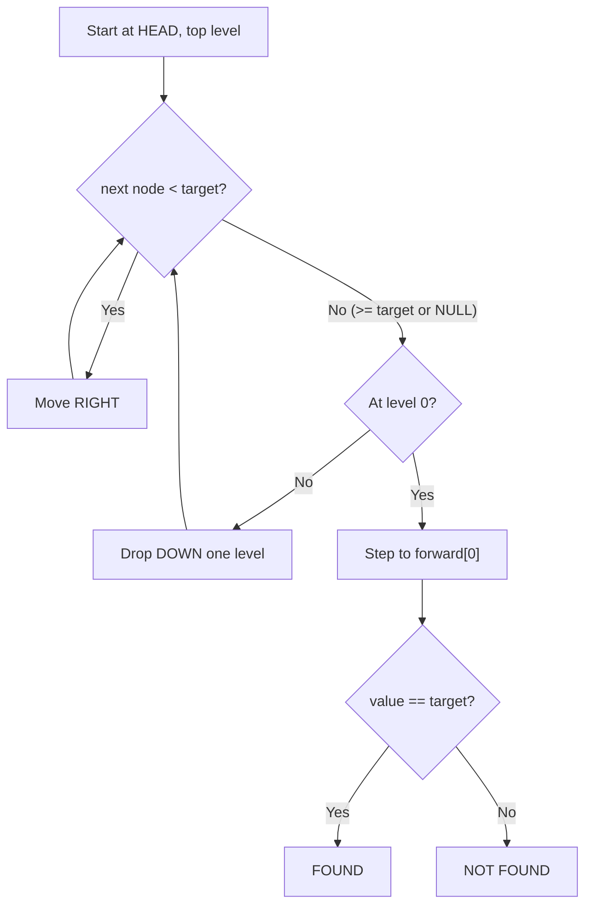
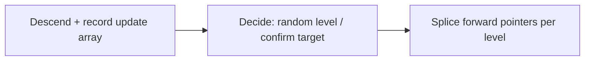

# Skip List — Junior Level

> **Read time: ~35 minutes** · **Audience:** Engineers who know linked lists, arrays, and basic Big-O and want to learn the data structure that gives you sorted, searchable order in expected O(log n) time without writing a single rotation.

A **skip list** is a sorted, layered linked list. The bottom layer is an ordinary sorted singly linked list that contains every element. On top of it sit one or more **express lanes** — sparser linked lists that let you skip over large stretches of nodes the way an express train skips local stops. To search, you start in the topmost (sparsest) lane and move right until the next node would overshoot your target; then you drop down one lane and repeat. Because each higher lane contains roughly half as many nodes as the one below it, you eliminate about half the remaining search space at every level — exactly the behavior that makes binary search O(log n).

The skip list was invented by **William Pugh** in 1989 (published in *Communications of the ACM*, 1990, "Skip Lists: A Probabilistic Alternative to Balanced Trees"). Pugh's insight was radical for its time: instead of carefully rebalancing a tree with rotations to guarantee O(log n) — which is what AVL trees and red-black trees do, at the cost of fiddly, bug-prone code — you can flip a coin to decide how tall each node is, and the **probability** that the structure stays balanced is overwhelmingly high. No rotations, no color bits, no rebalancing logic. The randomness does the balancing for you. The result is a structure that is dramatically simpler to implement correctly, performs as well as a balanced BST in practice, and is far friendlier to concurrent access.

That last point is why skip lists are everywhere in real systems. **Redis** uses a skip list for its sorted sets (`ZSET`). **Java**'s `ConcurrentSkipListMap` and `ConcurrentSkipListSet` are the standard lock-free ordered concurrent collections. **LevelDB** and **RocksDB** use a skip list for their in-memory write buffer (the "memtable"). **Apache Lucene**, **HBase**, and **Cassandra** all use skip-list ideas. You will meet this structure in interviews and in production.

This document teaches you the skip list **so thoroughly** that you understand why the express lanes give O(log n), why a coin flip decides each node's height, how a search descends and moves right, and how an insert picks a random level — all by hand on a small example before you ever touch the code.

---

## Table of Contents

1. [Introduction — Sorted Linked List With Express Lanes](#introduction)
2. [Prerequisites — Linked Lists and Coin Flips](#prerequisites)
3. [Glossary](#glossary)
4. [Core Concepts — Layers, Levels, and the Search Path](#core-concepts)
5. [Big-O Summary](#big-o-summary)
6. [Real-World Analogies](#analogies)
7. [Pros and Cons vs Sorted Array and Balanced BST](#pros-and-cons)
8. [Step-by-Step Walkthrough — Search and a Small Example](#walkthrough)
9. [Code Examples — Go, Java, Python](#code-examples)
10. [Coding Patterns — The Update Array](#patterns)
11. [Error Handling — Sentinels and Empty Lists](#errors)
12. [Performance Tips](#performance-tips)
13. [Best Practices](#best-practices)
14. [Edge Cases](#edge-cases)
15. [Common Mistakes](#common-mistakes)
16. [Cheat Sheet](#cheat-sheet)
17. [Visual Animation Reference](#animation)
18. [Summary](#summary)
19. [Further Reading](#further-reading)

---

<a name="introduction"></a>
## 1. Introduction — Sorted Linked List With Express Lanes

Imagine a plain sorted singly linked list:

```
HEAD -> 3 -> 7 -> 12 -> 19 -> 23 -> 37 -> 48 -> 55 -> NULL
```

It keeps elements in order, which is nice, but **searching is O(n)**. To find 48 you must walk every node from the front: 3, 7, 12, 19, 23, 37, 48. There is no way to jump ahead, because a linked list has no random access — you cannot binary-search it the way you can binary-search a sorted array.

A skip list fixes this by adding **express lanes** above the base list. Picture a second linked list that contains only every other node, and a third that contains only every fourth node:

```
L2:  HEAD ----------------> 19 ------------------------> 55 -> NULL
L1:  HEAD ------> 12 -----> 19 ------> 37 ------> 55 ---> NULL
L0:  HEAD -> 3 -> 7 -> 12 -> 19 -> 23 -> 37 -> 48 -> 55 -> NULL
```

Now to search for 48: start at the top-left (`HEAD` of L2). The next node in L2 is 19, which is ≤ 48, so move right to 19. The next L2 node is 55, which is > 48, so we would overshoot — **drop down** to L1 at node 19. The next L1 node is 37 ≤ 48, move right to 37. The next L1 node is 55 > 48, drop down to L0 at 37. The next L0 node is 48 — found it. We touched `HEAD, 19, 37, 48` instead of all eight nodes. The express lanes let us **skip** large runs of the base list.

If every higher lane has half the nodes of the one below, then there are about `log₂ n` lanes, and at each lane we move right only a constant number of steps before dropping down. Total work: **O(log n)** expected. That is the whole idea.

The one problem with the picture above is keeping those lanes perfectly halved as you insert and delete. Rebalancing "every other node" on every insert would be painfully expensive — it is exactly the bookkeeping that makes balanced trees complicated. Pugh's trick: **don't try to keep it perfect**. When you insert a node, flip a fair coin repeatedly to decide its height. Heads → promote it to the next lane up and flip again; tails → stop. A node reaches level `k` with probability `1/2^k`. On average half the nodes live only on L0, a quarter reach L1, an eighth reach L2, and so on. The lanes are not perfectly halved, but they are *approximately* halved with very high probability — and that is enough to make search **expected** O(log n). No rotations, no rebalancing. The coin does the work.

---

<a name="prerequisites"></a>
## 2. Prerequisites — Linked Lists and Coin Flips

You need three things:

1. **Singly linked lists.** A node holds a value and a pointer to the next node. You can walk forward but not backward. The base layer of a skip list is exactly this, kept in sorted order.

2. **Nodes with multiple forward pointers.** A skip-list node is not a plain list node. A node of height `h` has an array `forward[0..h-1]` of `h` next-pointers — one for each lane it participates in. `forward[0]` is its next-pointer in the base list; `forward[1]` is its next-pointer in lane 1; and so on. This array is the single most important structural idea in the implementation.

3. **A coin flip / random number.** Insertion uses randomness to pick a node's height. In code this is `rand.Float64() < 0.5` (Go), `Math.random() < 0.5` (Java), or `random.random() < 0.5` (Python). The probability `p = 1/2` is the classic choice; some implementations use `p = 1/4` (Redis does) to trade a little extra search work for less memory. We will use `p = 1/2` for the examples.

The randomness deserves a word of comfort: a skip list is a **randomized data structure**, but it is *not* approximate. It always stores and returns the exact correct elements in exact sorted order. The randomness affects only the *shape* (how tall nodes are), which affects only *performance*, never *correctness*. Even in the astronomically unlikely worst case where every coin comes up heads forever, the list still answers every query correctly — it just degrades toward O(n) speed. We will quantify "astronomically unlikely" in `professional.md`.

---

<a name="glossary"></a>
## 3. Glossary

| Term | Definition |
|---|---|
| **Skip list** | A sorted, multi-level linked list giving expected O(log n) search, insert, and delete. |
| **Level / lane** | One of the linked lists stacked on top of each other. Level 0 is the base list containing every element; higher levels are sparser express lanes. |
| **Node height** | The number of levels a node participates in. A node of height `h` has `h` forward pointers and appears in levels `0..h-1`. |
| **`forward[i]`** | The pointer from a node to the next node at level `i`. Every node has `forward[0]`; taller nodes have more. |
| **Promotion** | Including a node in the next level up. Decided by a coin flip at insert time. |
| **Probability `p`** | The chance a node is promoted to the next level. Typically `1/2`; Redis uses `1/4`. |
| **Geometric distribution** | The distribution of node heights. `P(height = k) = (1-p) · p^{k-1}`. Mean height = `1/(1-p)` ≈ 2 for `p = 1/2`. |
| **Head / sentinel** | A special left-boundary node of maximum level holding no value. Every search starts at the head. Simplifies edge cases. |
| **Search path** | The sequence of nodes visited during a search: move right within a level until the next node would overshoot, then drop down. |
| **Update array** | An array `update[0..maxLevel-1]` recording, for each level, the last node before the search position. Used by insert and delete to splice pointers. |
| **`maxLevel`** | The cap on how tall any node may be, chosen as roughly `log₁/ₚ(n)`. Bounds the height and the memory per node. |
| **Level of the list** | The height of the tallest node currently present. Searches start here, not at `maxLevel`. |
| **Tombstone-free** | Unlike some structures, a skip-list delete physically unlinks the node at each level; no lazy markers needed in the classic single-threaded version. |

---

<a name="core-concepts"></a>
## 4. Core Concepts — Layers, Levels, and the Search Path

### 4.1 A node is a tower of pointers

The mental model that unlocks the skip list: **a node is a vertical tower of forward pointers**. A node storing value 19 with height 3 looks like:

```
        +-------+
 L2 --> |  19   | --> forward[2]
        |       |
 L1 --> |       | --> forward[1]
        |       |
 L0 --> |       | --> forward[0]
        +-------+
```

`forward[0]` participates in the base list, `forward[1]` in lane 1, `forward[2]` in lane 2. The node *occupies* levels 0, 1, and 2. A height-1 node (the common case — half of all nodes) has only `forward[0]` and lives solely in the base list.

The whole skip list is a collection of these towers, all sharing a single tall **head sentinel** on the left:

```
level 3:  HEAD --------------------------------> NULL
level 2:  HEAD ------------> 19 ---------------> NULL
level 1:  HEAD ----> 12 --> 19 ------> 37 -----> NULL
level 0:  HEAD ->3->7->12->19->23->37->48->55--> NULL
```

The head is a sentinel of `maxLevel` height holding no real value; its forward pointers are the entry points into each lane.

### 4.2 Search: move right, then drop down

Search is two nested motions. You always hold a "current" node, starting at the head, and a "current level," starting at the top.

```
search(target):
    x = head
    for level from top down to 0:
        while x.forward[level] != NULL and x.forward[level].value < target:
            x = x.forward[level]        # move RIGHT
        # x.forward[level] is now >= target; can't go further at this level
    # drop DOWN (loop decrements level)
    x = x.forward[0]                    # one step into base list
    return x if x != NULL and x.value == target else NOT_FOUND
```

The rule at every level: **move right while the next node is strictly less than the target.** The moment the next node is ≥ target (or NULL), you have gone as far right as you safely can on this level, so you drop down one level and continue from the same `x`. When you drop off the bottom, one more step in the base list lands on the candidate. Check whether it equals the target.

This is binary-search-like because each higher level halves the population: a constant number of right-moves per level, `O(log n)` levels, gives `O(log n)` total.



### 4.3 Random level: flipping the coin

When inserting, we decide the new node's height **before** linking it:

```
randomLevel():
    lvl = 1
    while random() < p and lvl < maxLevel:
        lvl = lvl + 1
    return lvl
```

Start at height 1 (every node is at least in the base list). Flip a fair coin (`p = 1/2`). Heads → grow one taller and flip again. Tails → stop. The probabilities:

| Height | Probability (`p=1/2`) | Meaning |
|---|---|---|
| 1 | 1/2 | only in base list |
| 2 | 1/4 | in L0 and L1 |
| 3 | 1/8 | up to L2 |
| 4 | 1/16 | up to L3 |
| k | 1/2^k | up to L(k-1) |

This is a **geometric distribution**. On average, half of all nodes are height 1, a quarter height 2, an eighth height 3. That is precisely the "half the nodes per lane" property we wanted — achieved without any global bookkeeping, one independent coin flip per node.

### 4.4 The update array: where to splice

To insert (or delete) a node, search needs to remember, **at every level**, the last node it passed before stopping — because that is the node whose forward pointer must be rewired. We capture this in an `update` array during the descent:

```
update[level] = the node at this level just before the insertion point
```

After the search, `update[i]` is the predecessor of the new node at level `i`. Insertion then becomes pure pointer splicing: for each level `i` of the new node's height, do
```
newNode.forward[i] = update[i].forward[i]
update[i].forward[i] = newNode
```
This is the classic singly-linked-list insertion, repeated once per level the new node occupies. We will see the full code in section 9.

---

<a name="big-o-summary"></a>
## 5. Big-O Summary

| Operation | Expected | Worst Case | Notes |
|---|---|---|---|
| Search | O(log n) | O(n) | worst case requires astronomically unlucky coin flips |
| Insert | O(log n) | O(n) | search to find position, then O(level) splicing |
| Delete | O(log n) | O(n) | search, then unlink at each occupied level |
| Min / Max | O(1) / O(n) | — | min = `head.forward[0]`; max needs a walk or a stored pointer |
| Successor / Predecessor | O(1) at L0 / O(log n) | — | successor is `node.forward[0]` |
| Range query [lo, hi] | O(log n + k) | O(n) | find lo, then walk L0 for `k` results |
| Space | O(n) expected | O(n log n) | expected total pointers = `n/(1-p)` ≈ 2n for `p=1/2` |

The "worst case O(n)" entries are real but practically irrelevant: the probability of search exceeding `c·log n` steps drops faster than any polynomial in `n` (`professional.md` proves it). In practice a skip list behaves like a balanced tree.

---

<a name="analogies"></a>
## 6. Real-World Analogies

### 6.1 Express and local subway trains

The clearest analogy, and the one Pugh himself used. A subway has **local** trains that stop at every station and **express** trains that stop only at major hubs. To travel a long distance you ride the express to the nearest major hub before your destination, then transfer down to the local for the last few stops. The base list is the local line; each express lane is a faster train that skips stations. You ride the fastest train as far as you can without overshooting, then transfer to a slower one. That "ride fast, then transfer down" is exactly "move right, then drop down."

### 6.2 Skimming a sorted phone book by thumb-tabs

A printed dictionary or phone book has thumb-tabs cut into the page edges (A, B, C, …). To find "Mango" you first jump to the "M" tab (a coarse express lane), then flip pages within M (a finer lane), then scan the page (the base list). Each level of granularity narrows the search by a large factor. A skip list automates the same multi-resolution skip.

### 6.3 A coin-flip tournament bracket

Imagine each new arrival flips a coin repeatedly: every heads earns a promotion to a higher "VIP tier." Half stay in tier 1, a quarter reach tier 2, an eighth tier 3. The tiers naturally thin out by half at each level — no organizer manually balances them. The skip list's level structure is exactly this self-organizing tier system, and the coin is the only mechanism keeping it balanced.

### 6.4 Where the analogies break down

Subway express lines are designed once and fixed; skip-list lanes are *random and dynamic*, re-rolled per node at insert time. And unlike a subway, you can only ever move *forward* (right) and *down* — never backward or up — during a search. Keep those two differences in mind.

---

<a name="pros-and-cons"></a>
## 7. Pros and Cons vs Sorted Array and Balanced BST

### Pros of a skip list

- **Simple to implement correctly.** No rotations, no rebalancing, no color bits. Search/insert/delete are short and follow directly from the "move right, drop down" rule. This is the headline advantage over red-black and AVL trees.
- **Expected O(log n)** for search, insert, delete — matching balanced BSTs.
- **Fast, ordered iteration.** Walking `forward[0]` yields all elements in sorted order in O(n). Range queries are O(log n + k).
- **Naturally concurrent.** Because operations touch a localized set of pointers, lock-free and fine-grained-locking variants are far easier to build than for balanced trees. This is why Java and Redis use skip lists for concurrent / high-throughput ordered structures.
- **Tunable.** Lowering `p` (e.g., to 1/4) trades a little extra search work for less memory; you can dial the space/time balance.

### Cons of a skip list

- **Probabilistic guarantees, not worst-case.** A pathological run of coin flips can degrade to O(n). Adversaries who can see your random seed could, in theory, force bad behavior (mitigated by a good RNG).
- **Extra memory for pointers.** Each node carries multiple forward pointers (≈2 on average for `p=1/2`), more than a singly linked list or a sorted array.
- **No O(1) random access by index** in the basic version (a sorted array gives that). An *indexable* skip list adds span counters to recover O(log n) rank/select.
- **Cache behavior is worse than a sorted array.** Pointer-chasing jumps around memory; a contiguous array streams through cache.

### When to use which

| Need | Best choice |
|---|---|
| Static data, search only | Sorted array + binary search (O(1) space overhead, cache-friendly) |
| Ordered map/set with frequent insert/delete | Skip list or balanced BST |
| Concurrent ordered map | **Skip list** (lock-free variants are practical) |
| Redis-style sorted set with rank queries | **Skip list** (indexable, with hash map for O(1) score lookup) |
| In-memory write buffer for an LSM tree | **Skip list** (LevelDB/RocksDB memtable) |
| Strict worst-case O(log n) guarantee required | Balanced BST (red-black / AVL) |
| Random access by index, no inserts | Sorted array |

---

<a name="walkthrough"></a>
## 8. Step-by-Step Walkthrough — Search and a Small Example

We build a small skip list and trace a search by hand. Elements: `{3, 6, 7, 9, 12, 17, 19, 21, 25, 26}`. Suppose the coin flips gave these heights:

```
value:  3  6  7  9  12  17  19  21  25  26
height: 1  3  1  1   2   1   2   2   1   1
```

The resulting structure (head sentinel has `maxLevel` = 3 here):

```
L2:  HEAD -------------> 6 ---------------------------------------------> NULL
L1:  HEAD -------------> 6 ----------> 12 -------> 19 ----> 21 ---------> NULL
L0:  HEAD -> 3 -> 6 -> 7 -> 9 -> 12 -> 17 -> 19 -> 21 -> 25 -> 26 ------> NULL
```

### 8.1 Search for 19

Start at `HEAD`, top level L2.

```
Level 2: x=HEAD. forward[2]=6. Is 6 < 19? Yes -> move right to 6.
         x=6.    forward[2]=NULL. NULL, stop right. Drop to L1.
Level 1: x=6.    forward[1]=12. Is 12 < 19? Yes -> move right to 12.
         x=12.   forward[1]=19. Is 19 < 19? No (not strictly <). Stop. Drop to L0.
Level 0: x=12.   forward[0]=17. Is 17 < 19? Yes -> move right to 17.
         x=17.   forward[0]=19. Is 19 < 19? No. Stop. Drop off bottom.
Step:    x = x.forward[0] = 19. Is 19 == 19? YES -> FOUND.
```

Nodes touched: `HEAD, 6, 12, 17, 19` — five nodes instead of walking all ten in a plain list. The express lanes carried us most of the way.

### 8.2 Search for 18 (a miss)

```
Level 2: HEAD -> 6 (6<18). forward[2]=NULL. drop.
Level 1: 6 -> 12 (12<18). forward[1]=19 (19<18? no). drop.
Level 0: 12 -> 17 (17<18). forward[0]=19 (19<18? no). drop off.
Step:    x.forward[0] = 19. 19 == 18? NO -> NOT FOUND.
```

The search correctly reports 18 is absent. Notice the path is essentially identical to the search for 19 — a miss costs the same as a hit.

### 8.3 Insert 15 with a random level of 2

Search for 15 while recording the `update` array (predecessor at each level):

```
Level 2: HEAD -> 6. forward[2]=NULL. update[2] = 6.
Level 1: 6 -> 12. forward[1]=19 (>=15). update[1] = 12.
Level 0: 12. forward[0]=17 (>=15). update[0] = 12.
```

So `update = [12, 12, 6]`. We flip coins for 15 and get height 2 (it occupies L0 and L1). Splice at levels 0 and 1:

```
newNode(15).forward[0] = update[0].forward[0] = 17;  update[0].forward[0] = 15
newNode(15).forward[1] = update[1].forward[1] = 19;  update[1].forward[1] = 15
```

Result:

```
L2:  HEAD -------------> 6 ---------------------------------------------------> NULL
L1:  HEAD -------------> 6 ----------> 12 --> 15 --> 19 ----> 21 -------------> NULL
L0:  HEAD -> 3 -> 6 -> 7 -> 9 -> 12 -> 15 -> 17 -> 19 -> 21 -> 25 -> 26 ------> NULL
```

15 is now reachable from L1 (because it rolled height 2). Note that `update[2] = 6` was recorded but unused, because 15's height is only 2 — we splice only at levels `0..height-1`.

### 8.4 Delete 12

Search for 12 recording predecessors: `update[0]=9, update[1]=6, update[2]=6`. Node 12 has height 2, so unlink it at levels 0 and 1:

```
update[0].forward[0] = node12.forward[0]   # 9.forward[0] = 15
update[1].forward[1] = node12.forward[1]   # 6.forward[1] = 15
```

12 is gone from every lane it occupied; no other pointers change. That locality — touching only the predecessors at the node's own levels — is what makes skip-list deletes cheap and concurrency-friendly.

---

<a name="code-examples"></a>
## 9. Code Examples — Go, Java, Python

A complete, single-threaded skip list of `int` keys. All three share the same design: a `Node` with a `forward` slice/array sized to its height, a head sentinel of `maxLevel`, and an `update` array used by insert and delete.

### 9.1 Go

```go
package skiplist

import "math/rand"

const (
    maxLevel = 16   // supports up to ~2^16 elements comfortably for p=0.5
    p        = 0.5
)

type node struct {
    value   int
    forward []*node // forward[i] = next node at level i; len = node height
}

type SkipList struct {
    head  *node
    level int // current highest level in use (1-based count of levels)
    size  int
}

func New() *SkipList {
    return &SkipList{
        head:  &node{value: 0, forward: make([]*node, maxLevel)},
        level: 1,
    }
}

// randomLevel returns a height >= 1 from a geometric distribution.
func randomLevel() int {
    lvl := 1
    for rand.Float64() < p && lvl < maxLevel {
        lvl++
    }
    return lvl
}

// Search returns true if value is present. O(log n) expected.
func (s *SkipList) Search(value int) bool {
    x := s.head
    for i := s.level - 1; i >= 0; i-- {
        for x.forward[i] != nil && x.forward[i].value < value {
            x = x.forward[i] // move right
        }
        // drop down (loop decrements i)
    }
    x = x.forward[0]
    return x != nil && x.value == value
}

// Insert adds value (ignores duplicates). O(log n) expected.
func (s *SkipList) Insert(value int) {
    update := make([]*node, maxLevel)
    x := s.head
    for i := s.level - 1; i >= 0; i-- {
        for x.forward[i] != nil && x.forward[i].value < value {
            x = x.forward[i]
        }
        update[i] = x
    }
    // duplicate check
    if next := x.forward[0]; next != nil && next.value == value {
        return
    }
    lvl := randomLevel()
    if lvl > s.level {
        for i := s.level; i < lvl; i++ {
            update[i] = s.head // new higher levels start from the head
        }
        s.level = lvl
    }
    n := &node{value: value, forward: make([]*node, lvl)}
    for i := 0; i < lvl; i++ {
        n.forward[i] = update[i].forward[i]
        update[i].forward[i] = n
    }
    s.size++
}

// Delete removes value if present. O(log n) expected.
func (s *SkipList) Delete(value int) bool {
    update := make([]*node, maxLevel)
    x := s.head
    for i := s.level - 1; i >= 0; i-- {
        for x.forward[i] != nil && x.forward[i].value < value {
            x = x.forward[i]
        }
        update[i] = x
    }
    target := x.forward[0]
    if target == nil || target.value != value {
        return false
    }
    for i := 0; i < s.level; i++ {
        if update[i].forward[i] != target {
            break // target does not reach this level
        }
        update[i].forward[i] = target.forward[i]
    }
    // shrink the list level if top lanes became empty
    for s.level > 1 && s.head.forward[s.level-1] == nil {
        s.level--
    }
    s.size--
    return true
}
```

### 9.2 Java

```java
import java.util.Random;

public class SkipList {
    private static final int MAX_LEVEL = 16;
    private static final double P = 0.5;
    private final Random rng = new Random();

    private static final class Node {
        final int value;
        final Node[] forward; // length = node height
        Node(int value, int height) {
            this.value = value;
            this.forward = new Node[height];
        }
    }

    private final Node head = new Node(Integer.MIN_VALUE, MAX_LEVEL);
    private int level = 1; // number of levels currently in use
    private int size = 0;

    private int randomLevel() {
        int lvl = 1;
        while (rng.nextDouble() < P && lvl < MAX_LEVEL) lvl++;
        return lvl;
    }

    /** O(log n) expected. */
    public boolean search(int value) {
        Node x = head;
        for (int i = level - 1; i >= 0; i--) {
            while (x.forward[i] != null && x.forward[i].value < value) {
                x = x.forward[i];
            }
        }
        x = x.forward[0];
        return x != null && x.value == value;
    }

    public void insert(int value) {
        Node[] update = new Node[MAX_LEVEL];
        Node x = head;
        for (int i = level - 1; i >= 0; i--) {
            while (x.forward[i] != null && x.forward[i].value < value) {
                x = x.forward[i];
            }
            update[i] = x;
        }
        Node next = x.forward[0];
        if (next != null && next.value == value) return; // no duplicates

        int lvl = randomLevel();
        if (lvl > level) {
            for (int i = level; i < lvl; i++) update[i] = head;
            level = lvl;
        }
        Node n = new Node(value, lvl);
        for (int i = 0; i < lvl; i++) {
            n.forward[i] = update[i].forward[i];
            update[i].forward[i] = n;
        }
        size++;
    }

    public boolean delete(int value) {
        Node[] update = new Node[MAX_LEVEL];
        Node x = head;
        for (int i = level - 1; i >= 0; i--) {
            while (x.forward[i] != null && x.forward[i].value < value) {
                x = x.forward[i];
            }
            update[i] = x;
        }
        Node target = x.forward[0];
        if (target == null || target.value != value) return false;
        for (int i = 0; i < level; i++) {
            if (update[i].forward[i] != target) break;
            update[i].forward[i] = target.forward[i];
        }
        while (level > 1 && head.forward[level - 1] == null) level--;
        size--;
        return true;
    }

    public int size() { return size; }
}
```

### 9.3 Python

```python
import random


class _Node:
    __slots__ = ("value", "forward")

    def __init__(self, value, height):
        self.value = value
        self.forward = [None] * height  # forward[i] = next at level i


class SkipList:
    MAX_LEVEL = 16
    P = 0.5

    def __init__(self):
        self.head = _Node(float("-inf"), self.MAX_LEVEL)
        self.level = 1   # levels currently in use
        self.size = 0

    def _random_level(self):
        lvl = 1
        while random.random() < self.P and lvl < self.MAX_LEVEL:
            lvl += 1
        return lvl

    def search(self, value):
        """O(log n) expected."""
        x = self.head
        for i in range(self.level - 1, -1, -1):
            while x.forward[i] is not None and x.forward[i].value < value:
                x = x.forward[i]          # move right
            # drop down
        x = x.forward[0]
        return x is not None and x.value == value

    def insert(self, value):
        update = [None] * self.MAX_LEVEL
        x = self.head
        for i in range(self.level - 1, -1, -1):
            while x.forward[i] is not None and x.forward[i].value < value:
                x = x.forward[i]
            update[i] = x
        nxt = x.forward[0]
        if nxt is not None and nxt.value == value:
            return                          # no duplicates

        lvl = self._random_level()
        if lvl > self.level:
            for i in range(self.level, lvl):
                update[i] = self.head
            self.level = lvl
        node = _Node(value, lvl)
        for i in range(lvl):
            node.forward[i] = update[i].forward[i]
            update[i].forward[i] = node
        self.size += 1

    def delete(self, value):
        update = [None] * self.MAX_LEVEL
        x = self.head
        for i in range(self.level - 1, -1, -1):
            while x.forward[i] is not None and x.forward[i].value < value:
                x = x.forward[i]
            update[i] = x
        target = x.forward[0]
        if target is None or target.value != value:
            return False
        for i in range(self.level):
            if update[i].forward[i] is not target:
                break
            update[i].forward[i] = target.forward[i]
        while self.level > 1 and self.head.forward[self.level - 1] is None:
            self.level -= 1
        self.size -= 1
        return True

    def __iter__(self):
        x = self.head.forward[0]
        while x is not None:
            yield x.value
            x = x.forward[0]


if __name__ == "__main__":
    sl = SkipList()
    for v in [3, 6, 7, 9, 12, 17, 19, 21, 25, 26]:
        sl.insert(v)
    print(list(sl))            # sorted order
    print(sl.search(19))       # True
    print(sl.search(18))       # False
    sl.delete(12)
    print(list(sl))            # 12 removed
```

**Run:** `go test ./...` | `javac SkipList.java && java SkipList` | `python skiplist.py`

---

<a name="patterns"></a>
## 10. Coding Patterns — The Update Array

Every mutating skip-list operation follows the **same three-phase template**:

1. **Descend and record.** Walk the list top-to-bottom with the search rule (move right while next `<` value). At each level, store the node you stop at in `update[i]`.
2. **Decide.** For insert, roll a random level and check duplicates. For delete, confirm `forward[0]` is the target.
3. **Splice.** Rewire `update[i].forward[i]` for each affected level. Insert points the new node's pointers at the old successors; delete points predecessors past the deleted node.

If you internalize the update array, you have internalized the skip list. Both insert and delete are *the same search* followed by a different splice. The search alone (no update array) is the read path.



A subtle but critical detail: when an insert's random level *exceeds* the list's current level, the brand-new higher lanes have no predecessor yet, so you set `update[i] = head` for those levels and raise `s.level`. Forgetting this leaves the new tall node unreachable from the top.

---

<a name="errors"></a>
## 11. Error Handling — Sentinels and Empty Lists

### 11.1 Always use a head sentinel

A head sentinel of `maxLevel` height with a value of `-∞` (or `Integer.MIN_VALUE`, `float("-inf")`) removes nearly every special case. Without it, you would need separate logic for inserting before the first element, an empty list, and updating the list's entry pointers at each level. With it, the head is *always* a valid predecessor: every search starts at the head, and every level's first real node hangs off `head.forward[i]`.

### 11.2 Empty list

On an empty list, `head.forward[i] == nil` for all `i`. Search immediately drops through every level without moving right and lands on `head.forward[0] == nil` → not found. Insert sees all `update[i] = head` and splices the first node directly. No special-casing needed.

### 11.3 Duplicate keys

Decide your policy explicitly. The code above **ignores duplicates** (set semantics). If you want a multiset, drop the duplicate check and allow equal keys; if you want a map, store a `(key, value)` pair and *update the value* when the key already exists. Be deliberate — silent duplicate insertion is a common bug.

### 11.4 Level shrinking after delete

After deleting the only tall node, the top lanes may become empty (`head.forward[level-1] == nil`). If you do not shrink `s.level`, searches still start too high and waste a few steps — correct but slightly slower. The shrink loop in `Delete` keeps `level` tight. Forgetting it is a performance bug, not a correctness bug.

### 11.5 `maxLevel` too small

If `maxLevel` is smaller than `log₁/ₚ(n)`, many nodes pile up at the top level and search degrades. Rule of thumb: `maxLevel = ⌈log₂ expectedMaxN⌉`. For up to ~65,000 elements, `maxLevel = 16` is plenty. The `randomLevel` cap prevents the rare runaway tower.

---

<a name="performance-tips"></a>
## 12. Performance Tips

1. **Cap the random level.** `while rand < p and lvl < maxLevel` prevents a freak run of heads from allocating an absurdly tall tower.

2. **Start searches at `s.level`, not `maxLevel`.** Iterating empty top lanes wastes steps. Track the current highest level in use.

3. **Reuse the `update` buffer.** Allocating a fresh `update` array on every insert/delete adds GC pressure. In hot paths, reuse a preallocated buffer (single-threaded only).

4. **Tune `p` for memory.** `p = 1/2` gives ≈2 pointers per node and ~`log₂ n` levels. `p = 1/4` (Redis's choice) gives ≈1.33 pointers per node — less memory — at the cost of slightly more right-moves per level. Lower `p` = sparser = less space, more horizontal scanning.

4. **Seed the RNG well, but not predictably.** A weak or fixed seed lets an adversary craft worst-case input. Use a per-instance seeded RNG.

5. **Object pooling for nodes.** In allocation-sensitive systems (Go, Java), pooling node objects reduces GC churn under high insert/delete rates.

6. **Cache-conscious layout.** Pointer-chasing hurts. Some production skip lists pack node values into contiguous arenas to improve locality (RocksDB's arena-allocated memtable does this).

---

<a name="best-practices"></a>
## 13. Best Practices

- **Use a head sentinel of `maxLevel`.** It eliminates boundary cases.
- **Keep the search rule strict (`<`, not `<=`).** Moving right only while strictly less guarantees you stop at the predecessor, which is what insert and delete need.
- **Record the `update` array during the same descent** you would do for a search — never search twice.
- **Decide your duplicate policy up front** (set / multiset / map) and encode it explicitly.
- **Shrink `level` after deletes** so searches start at the right height.
- **Test against a sorted reference** (e.g., a `TreeSet` or sorted list): apply the same random operations to both and assert identical contents and query answers.
- **Pin the RNG per instance** to avoid global-RNG contention and to make tests reproducible with a fixed seed.

---

<a name="edge-cases"></a>
## 14. Edge Cases

| Case | Behavior |
|---|---|
| Empty list search | Drops through all levels, lands on `nil` → not found. |
| Insert into empty list | All `update[i] = head`; first node splices off the head. |
| Search value smaller than all | No right-moves at any level; `forward[0]` is the first node ≠ target → not found. |
| Search value larger than all | Right-moves to the last node at each level; `forward[0]` after it is `nil` → not found. |
| Duplicate insert | Detected via `forward[0].value == value`; ignored (set policy). |
| Delete absent value | `forward[0]` ≠ target → returns false, no mutation. |
| Delete last/only element | List becomes empty; `level` shrinks back to 1. |
| Single element | `head.forward[0]` is the node; `level` is its height. |
| Random level exceeds list level | Set `update[i] = head` for the new top levels, raise `s.level`. |

---

<a name="common-mistakes"></a>
## 15. Common Mistakes

1. **Using `<=` instead of `<` in the search loop.** With `<=` you step *past* the target and the equality check in search fails — and insert splices in the wrong place.
2. **Forgetting to record the `update` array.** Then insert/delete have no predecessor to splice against. Don't search, then search again — record on the single descent.
3. **Not handling random level > current level.** The new tall node never gets wired from the top, so it is invisible to future searches that start high.
4. **Allocating `forward` of size `maxLevel` for every node.** Wastes memory; a node only needs `height` pointers. Size `forward` to the rolled level.
5. **No head sentinel.** Forces special cases for empty lists and front insertions, multiplying bugs.
6. **Not shrinking `level` after deletes.** Slowly degrades performance as searches start too high.
7. **Sharing a global RNG across threads** in a concurrent skip list — causes contention and, worse, can desync randomness.
8. **Treating the worst case as the expected case.** Skip lists are O(log n) *expected*; quoting O(n) as "the" complexity misreads the structure.
9. **Inserting duplicates silently** when set semantics were intended.
10. **Off-by-one between "level count" and "max index."** `s.level` is a count of levels; valid indices are `0 .. s.level-1`. Mixing the two corrupts the descent.

---

<a name="cheat-sheet"></a>
## 16. Cheat Sheet

```
NODE
    value
    forward[0 .. height-1]      # one next-pointer per level occupied

HEAD: sentinel of MAX_LEVEL height, value = -infinity

RANDOM_LEVEL()                  # geometric, p = 0.5
    lvl = 1
    while random() < p and lvl < MAX_LEVEL: lvl += 1
    return lvl

SEARCH(value)                   # O(log n) expected
    x = head
    for i in level-1 .. 0:
        while x.forward[i] and x.forward[i].value < value:
            x = x.forward[i]    # move right
    x = x.forward[0]            # drop off bottom, step once
    return x and x.value == value

INSERT(value)                   # O(log n) expected
    descend recording update[i] = last node < value at level i
    if forward[0] == value: return        # no duplicate
    lvl = random_level()
    if lvl > level: update[level..lvl-1] = head; level = lvl
    new node n height lvl
    for i in 0 .. lvl-1:
        n.forward[i] = update[i].forward[i]
        update[i].forward[i] = n

DELETE(value)                   # O(log n) expected
    descend recording update[i]
    target = forward[0]; if target != value: return false
    for i in 0 .. level-1:
        if update[i].forward[i] != target: break
        update[i].forward[i] = target.forward[i]
    shrink level while top lane empty

COMPLEXITY
    search/insert/delete: O(log n) expected, O(n) worst
    space: O(n) expected (~2n pointers at p=0.5)
```

---

<a name="animation"></a>
## 17. Visual Animation Reference

See `animation.html` in this folder. It renders the multi-level linked list with the base lane at the bottom and express lanes stacked above, each node drawn as a tower whose height matches its rolled level. The **Search** control animates the descent: it highlights the current node, moves right (yellow) while the next node is less than the target, then drops down a level, until it either lands on the target (green = found) or overshoots (red = not found). The **Insert** control first shows a sequence of **coin flips** picking a random level, then animates the descent recording the update array, and finally splices the new tower into each lane it occupies (green = new node). A live info panel narrates each step, a Big-O table shows expected vs worst complexity, and an operation log records every move.

Watching a search "ride the express lane and transfer down" on a 12-node list is the fastest way to feel why the structure is O(log n).

---

<a name="summary"></a>
## 18. Summary

- A **skip list** is a sorted linked list with stacked express lanes; the base lane holds every element, and each higher lane holds roughly half the nodes of the one below.
- **Search** moves right while the next node is `< target`, then drops down a level; `O(log n)` expected because each level halves the population.
- **Node height** is chosen by repeated coin flips — a geometric distribution with `P(height = k) = p^{k-1}(1-p)`. For `p = 1/2`, half the nodes are height 1.
- **Insert and delete** are the same descent as search, recording an `update` array of predecessors, followed by O(level) pointer splicing. No rotations, ever.
- A **head sentinel** of `maxLevel` height eliminates boundary cases.
- Skip lists match balanced BSTs on expected complexity but are far **simpler to implement** and **friendlier to concurrency** — which is why Redis sorted sets, Java's `ConcurrentSkipListMap`, and LevelDB/RocksDB memtables all use them.
- The guarantees are **probabilistic** (expected O(log n), worst O(n)), but the bad case is astronomically unlikely — quantified in `professional.md`.

Once you can trace a search and an insert by hand on a ten-node list, the code writes itself. Memorize the "move right, drop down" rule and the three-phase update-array template.

---

<a name="further-reading"></a>
## 19. Further Reading

- **Pugh, W.** (1990). *Skip Lists: A Probabilistic Alternative to Balanced Trees.* Communications of the ACM, 33(6), 668–676. The original paper — short and very readable.
- **Pugh, W.** (1989). *Concurrent Maintenance of Skip Lists.* Technical Report, University of Maryland. The basis for lock-free variants.
- **CLRS**, *Introduction to Algorithms* — problem set on skip lists (it is an exercise, not a chapter).
- **Redis source** — `t_zset.c` and `server.h` (`zskiplist`). Production skip list with span counters for rank queries. See `senior.md`.
- **Java** — `java.util.concurrent.ConcurrentSkipListMap` source and Javadoc.
- **LevelDB source** — `db/skiplist.h`. A clean, lock-friendly memtable skip list.
- **LeetCode 1206** — *Design Skiplist.* Implement one from scratch.
- Continue with `middle.md` for insert/delete depth, the role of `p`, the expected-analysis intuition, and a head-to-head comparison with balanced BSTs and treaps.

---

**Next step:** [middle.md](./middle.md) — why the coin flip works, choosing `p`, insert/delete in depth, skip list vs balanced BST, and the intuition behind the expected O(log n) analysis.
