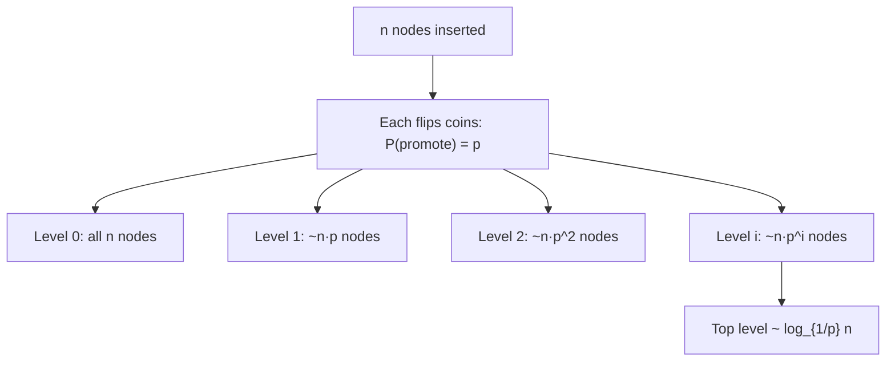
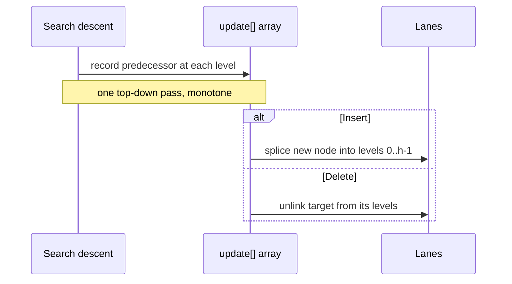

# Skip List — Middle Level

> **Read time: ~38 minutes** · **Audience:** Engineers who can already trace a skip-list search and insert by hand (see `junior.md`) and now want to understand *why* the randomization works, *how* to pick `p`, and *when* to choose a skip list over a balanced BST or a treap.

At the junior level a skip list is "a sorted linked list with express lanes, balanced by coin flips." That description is operationally complete but leaves the interesting questions unanswered: Why does flipping a coin produce a balanced structure instead of a lopsided mess? What exactly does the probability `p` control, and why does Redis pick `1/4` while textbooks pick `1/2`? How do insert and delete maintain the structure without rotations? When is a skip list genuinely the right choice versus a red-black tree or a treap?

This document answers those questions. We will derive the expected number of levels and the expected search cost with intuition (the formal proofs live in `professional.md`), build robust insert and delete, analyze the space–time trade-off controlled by `p`, and place the skip list precisely against its closest relatives. The skip list and the **treap** are siblings — both are randomized search structures that abandon worst-case guarantees for simplicity — so we cross-reference `22-randomized-algorithms/04-treap` where the comparison sharpens.

---

## Table of Contents

1. [Introduction — From "It Works" to "Why It Works"](#introduction)
2. [Deeper Concepts — The Geometric Level Distribution](#deeper-concepts)
3. [Why Search Is Expected O(log n) — The Intuition](#why-logn)
4. [Choosing p — The Space–Time Trade-off](#choosing-p)
5. [Insert and Delete in Depth](#insert-delete)
6. [Comparison with Balanced BST and Treap](#comparison)
7. [Advanced Patterns — Indexable Skip List and Range Queries](#advanced-patterns)
8. [Code Examples — Rank Queries and a Map Variant](#code-examples)
9. [Error Handling](#error-handling)
10. [Performance Analysis](#performance-analysis)
11. [Best Practices](#best-practices)
12. [Visual Animation](#visual-animation)
13. [Summary](#summary)

---

<a name="introduction"></a>
## 1. Introduction — From "It Works" to "Why It Works"

The most surprising claim about skip lists is that **independent local coin flips produce a globally balanced structure** with no coordination. Contrast this with a red-black tree, where every insert must inspect its neighborhood, possibly recolor nodes, and possibly rotate — a global invariant maintained by local repair. A skip list maintains *no* invariant about its shape. A node's height is decided once, at birth, by a coin, and never touched again. There is no repair, no rebalancing, no invariant to violate.

How can that possibly give O(log n)? The answer is **expectation over randomness**. Any *single* skip list might be lopsided. But the *probability* of a lopsided one is vanishingly small, and the *expected* cost over the coin flips is O(log n). The structure trades a worst-case guarantee (which BSTs provide via complex code) for an expected-case guarantee (which the coin provides for free). For almost all real workloads this is an excellent trade: you get balanced-tree performance with linked-list-level code complexity.

To make this concrete we need to understand two random quantities: **how tall the list gets** (the number of levels) and **how far each search walks** (the search cost). Both follow from the geometric distribution of node heights. We develop the intuition here and prove the bounds rigorously in `professional.md`.

---

<a name="deeper-concepts"></a>
## 2. Deeper Concepts — The Geometric Level Distribution

### 2.1 The height of one node

When we insert a node we call `randomLevel`: start at height 1, and while a coin with success probability `p` comes up "promote," increase the height. The probability that a node reaches **exactly** height `k` is the probability of `k-1` promotions followed by one stop:

```
P(height = k) = p^{k-1} · (1 - p)
```

This is the **geometric distribution**. Its expected value — the average node height — is:

```
E[height] = 1 / (1 - p)
```

For `p = 1/2`: `E[height] = 2`. For `p = 1/4`: `E[height] = 4/3 ≈ 1.33`. So with `p = 1/2` an average node carries 2 forward pointers; with `p = 1/4`, about 1.33. This directly determines the memory overhead.

### 2.2 How many nodes reach level i?

A node reaches level `i` (0-indexed) if it had at least `i` promotions, which happens with probability `p^i`. So the *expected* number of nodes present at level `i` is:

```
E[nodes at level i] = n · p^i
```

Level 0 has all `n` nodes. Level 1 has `n·p`. Level 2 has `n·p²`. The lanes shrink geometrically — exactly the "half the nodes per lane" picture from the junior level, now expressed as `n·p^i` rather than an exact halving.

### 2.3 How many levels are there?

The list's height is the maximum node height. The expected number of nodes at level `i` is `n·p^i`, which drops below 1 when `i > log₁/ₚ n`. Beyond that level you expect *fewer than one* node, so the list almost never grows taller than about:

```
L = log₁/ₚ n
```

For `p = 1/2`, `L = log₂ n`. For `n = 1,000,000`, that is ~20 levels. For `p = 1/4`, `L = log₄ n = (log₂ n)/2` ≈ 10 levels for the same `n`. Lower `p` means fewer but sparser levels.

| `p` | E[height] (ptrs/node) | Expected levels for n=10⁶ | Memory factor |
|---|---|---|---|
| 1/2 | 2.00 | ~20 | 2.0× pointers |
| 1/4 | 1.33 | ~10 | 1.33× pointers |
| 1/e ≈ 0.368 | ~1.58 | ~13 | ~1.58× (theoretically optimal time) |

### 2.4 The level distribution as a Mermaid picture



---

<a name="why-logn"></a>
## 3. Why Search Is Expected O(log n) — The Intuition

Here is the clean, backward-walking argument (Pugh's own), which makes the O(log n) obvious without heavy algebra. The full proof is in `professional.md`; this is the intuition every engineer should carry.

**Think of the search path in reverse.** Instead of starting at the head and going right-then-down, imagine standing on the found node at level 0 and retracing the path *backward and upward* to the head. At each node on this reverse path you are at some level `i`, and you ask: "did I arrive here by going *up* (the node is taller, so I dropped into it from above) or by going *left* (I moved right to reach it from a same-level predecessor)?"

- If the current node has height > current level, I could have come from **above** — i.e., the forward search dropped down here. Going up costs one level. The probability a node extends to the next level up is `p`.
- Otherwise I came from the **left** — the forward search moved right into it. That costs one horizontal step. Probability `1 - p`.

So retracing the path is a sequence of "up" moves (probability `p` each) and "left" moves (probability `1-p` each). To climb from level 0 to the top level `L = log₁/ₚ n`, we need about `L` successful "up" moves. Because each level requires on average `1/p` trials to get one "up," the expected number of steps to climb one level is constant, and the expected total path length is:

```
E[search cost] = O(L / p) = O(log₁/ₚ n) = O(log n)
```

The horizontal steps are bounded too: at any level the expected number of left-moves before the next up-move is `(1-p)/p = O(1)` for fixed `p`. So you take a **constant number of horizontal steps per level**, across `O(log n)` levels → **O(log n)** total. That is the entire intuition: constant work per level, logarithmically many levels.

This is exactly why the express-lane picture works. Each level you climb covers (in expectation) `1/p` times as much ground as the level below, so `log₁/ₚ n` levels span the whole list, and you spend only O(1) at each.

---

<a name="choosing-p"></a>
## 4. Choosing p — The Space–Time Trade-off

`p` is the single tuning knob. It trades **memory** (more pointers per node) against **horizontal scanning** (more right-moves per level).

- **Pointers per node** = `1/(1-p)`. Larger `p` → taller nodes → more memory.
- **Levels** = `log₁/ₚ n`. Larger `p` → more levels.
- **Horizontal steps per level** = `1/p` on average. Larger `p` → fewer horizontal steps.
- **Total comparisons** ≈ `(1/p) · log₁/ₚ n = (log₂ n) / (p · log₂(1/p))`.

Minimizing total comparisons over `p` gives the theoretically optimal `p = 1/e ≈ 0.368`. But the curve is flat near the optimum, and other factors dominate in practice:

| `p` | Pointers/node | Comparisons/search | Who uses it |
|---|---|---|---|
| 1/2 | 2.00 | baseline | Textbooks, simplicity |
| 1/e ≈ 0.37 | 1.58 | minimal (theory) | rarely, awkward to compute |
| 1/4 | 1.33 | ~slightly more than 1/2 | **Redis** (`ZSKIPLIST_P = 0.25`) |

**Redis chooses `p = 1/4`** deliberately. Sorted sets can hold tens of millions of members, and the 33% reduction in pointer memory (1.33 vs 2.0 per node) matters at that scale. The extra horizontal scanning is cheap because the right-moves stay within the same cache-resident region. Redis also caps levels at 32 (`ZSKIPLIST_MAXLEVEL`), enough for `4^32` ≈ 1.8×10¹⁹ elements.

**Practical guidance:**
- Memory-constrained, huge datasets → `p = 1/4`.
- Latency-sensitive, memory is cheap → `p = 1/2`.
- Don't agonize: anywhere in `[1/4, 1/2]` is fine; the difference is a small constant factor.

The key insight: `p` never affects **correctness** — only the constant factors of time and space. You can change it without touching any logic except `randomLevel`.

---

<a name="insert-delete"></a>
## 5. Insert and Delete in Depth

### 5.1 Insert — the invariant being maintained

The only invariant a skip list maintains is: **at every level, nodes appear in sorted order, and a node present at level `i` is also present at all levels below `i`.** (Equivalently: `forward[i]` chains are sorted, and they are subsequences of `forward[i-1]`.) Insert must preserve this.

The descent records `update[i]` = the rightmost node at level `i` whose value is `< the new value`. By the search invariant, `update[i].value < newValue ≤ update[i].forward[i].value`, so splicing the new node between them at every level it occupies keeps each lane sorted. Crucially, `update` is recorded *top-down in one pass*, and `update[i+1]` is always at or to the left of `update[i]` (higher lanes are sparser), so the descent is monotone — no backtracking.

The subtle case: when the rolled level exceeds the list's current level. The new lanes above the old top have *no nodes yet*, so their predecessor is the head. We set `update[i] = head` for those levels and raise the list level. Skip this and the tall part of the new node dangles, unreachable from the top.

### 5.2 Delete — locality is the prize

Delete runs the identical descent, recording `update`. It then checks `update[0].forward[0]` is the target, and if so unlinks the target at every level it occupies: `update[i].forward[i] = target.forward[i]`. We stop early the moment `update[i].forward[i] != target`, because the target does not reach higher than its own height.

What makes delete attractive — especially for concurrency — is **locality**: it touches only the target's predecessors at the target's own levels. A balanced-tree delete can trigger rotations propagating toward the root, touching nodes far from the deletion point. Skip-list mutations stay local, which is why lock-free skip lists are tractable while lock-free red-black trees are research-grade hard.

### 5.3 Worked insert/delete is in junior.md §8

Re-read junior §8.3–8.4 if the splice mechanics are fuzzy. Here we add the reasoning: the **same descent** powers search (read), insert (record + splice in), and delete (record + splice out). One traversal pattern, three operations.



---

<a name="comparison"></a>
## 6. Comparison with Balanced BST and Treap

The skip list lives in a family of ordered dictionaries. Its closest competitors are the **balanced BST** (red-black / AVL) and the **treap** — a randomized BST. Understanding the differences tells you when to reach for each.

| Attribute | Skip List | Red-Black / AVL Tree | Treap |
|---|---|---|---|
| Search (avg) | O(log n) **expected** | O(log n) **worst** | O(log n) **expected** |
| Search (worst) | O(n) (improbable) | O(log n) guaranteed | O(n) (improbable) |
| Insert / Delete | O(log n) expected, no rotations | O(log n), rotations | O(log n) expected, rotations |
| Balancing mechanism | random node heights | color/height invariant + rotations | random priorities + rotations |
| Implementation complexity | **Low** | High (RB) / Medium (AVL) | Medium |
| Ordered iteration | O(n), walk `forward[0]` | O(n), in-order traversal | O(n), in-order |
| Range query | O(log n + k) | O(log n + k) | O(log n + k) |
| Concurrency | **Excellent** (local, lock-free feasible) | Hard (rotations span paths) | Hard (rotations) |
| Memory overhead | ~2 ptrs/node (p=1/2) | 2 ptrs + color bit + parent | 2 ptrs + priority + parent |
| Cache behavior | pointer-chase | pointer-chase | pointer-chase |
| Determinism | randomized | deterministic | randomized |

**Skip list vs balanced BST.** Both give O(log n) for ordered operations. The BST gives a *worst-case* guarantee; the skip list gives an *expected* one. The skip list wins decisively on **implementation simplicity** (no rotation/recoloring code) and **concurrency** (local mutations). Choose the balanced BST when you need a hard worst-case bound (e.g., real-time systems where a rare O(n) is unacceptable) or when the language/runtime already ships a great one (Java's `TreeMap`, C++'s `std::map`).

**Skip list vs treap.** Both are randomized and abandon worst-case guarantees for simplicity. The treap is a **binary tree** with random priorities maintaining a heap order; the skip list is a **linked structure** with random heights. They have nearly identical expected complexity. Differences:
- The skip list has **simpler, rotation-free** mutations and is **easier to make concurrent**.
- The treap supports **split** and **merge** (join) in O(log n) elegantly — splitting a skip list at a key is more awkward.
- The treap stores one priority per node; the skip list stores a variable-length pointer array per node.

If you need split/merge (e.g., implicit treaps for sequence operations, rope-like editing), reach for the treap — see `22-randomized-algorithms/04-treap`. If you need a concurrent ordered map or an LSM memtable, reach for the skip list.

**Choose skip list when:** you want a simple ordered map/set, especially concurrent; you're building an LSM memtable; you're matching Redis ZSET semantics.
**Choose balanced BST when:** you need worst-case O(log n) guarantees, or a battle-tested library map exists.
**Choose treap when:** you need split/merge / sequence operations, or you like recursive BST code.

---

<a name="advanced-patterns"></a>
## 7. Advanced Patterns — Indexable Skip List and Range Queries

### 7.1 Indexable skip list (rank / select)

A plain skip list cannot answer "what is the element at index `k`?" or "what is the rank of value `v`?" in O(log n) — you would walk the base list in O(k). The fix: store a **span** on each forward pointer, the number of base-level nodes it skips over. During the descent you accumulate spans; when you have accumulated `k`, you have found the `k`-th element. This is exactly how **Redis ZSET** answers `ZRANGE`, `ZRANK`, and `ZREVRANK` in O(log n).

```
forward[i] now carries (nextNode, span)
select(k):  descend, adding span whenever moving right without overshooting k
rank(v):    descend toward v, accumulating spans along the way
```

Insert and delete must maintain spans: when splicing at a level, the new node splits an existing span into two; when unlinking, two spans merge. The bookkeeping is mechanical but must be exact. We show code in §8.

### 7.2 Range query [lo, hi]

Find the first node `≥ lo` via the standard descent (O(log n)), then walk `forward[0]` collecting nodes until you pass `hi` (O(k) for `k` results). Total O(log n + k). This is the bread-and-butter operation for sorted sets: "give me all members with score between A and B."

### 7.3 Successor / predecessor

The successor of a present node is simply `node.forward[0]` — O(1). Predecessor needs either a backward pointer (a *doubly linked* skip list, which Redis uses: each base node has a `backward` pointer for reverse iteration) or a fresh O(log n) search. Redis's skip list is doubly linked at level 0 precisely to support `ZREVRANGE` efficiently.

---

<a name="code-examples"></a>
## 8. Code Examples — Rank Queries and a Map Variant

### 8.1 Indexable skip list with spans (rank/select)

The headline production feature. We extend each forward link with a span.

#### Go

```go
package indexskip

import "math/rand"

const (
    maxLevel = 16
    p        = 0.5
)

type link struct {
    to   *inode
    span int // number of base-level nodes between owner and 'to' (inclusive of 'to')
}

type inode struct {
    value   int
    forward []link
}

type IndexSkipList struct {
    head  *inode
    level int
    size  int
}

func New() *IndexSkipList {
    return &IndexSkipList{
        head:  &inode{forward: make([]link, maxLevel)},
        level: 1,
    }
}

func randomLevel() int {
    lvl := 1
    for rand.Float64() < p && lvl < maxLevel {
        lvl++
    }
    return lvl
}

// Insert adds value and maintains spans. O(log n) expected.
func (s *IndexSkipList) Insert(value int) {
    update := make([]*inode, maxLevel)
    rank := make([]int, maxLevel) // rank[i] = position of update[i] from head
    x := s.head
    for i := s.level - 1; i >= 0; i-- {
        if i == s.level-1 {
            rank[i] = 0
        } else {
            rank[i] = rank[i+1]
        }
        for x.forward[i].to != nil && x.forward[i].to.value < value {
            rank[i] += x.forward[i].span
            x = x.forward[i].to
        }
        update[i] = x
    }
    lvl := randomLevel()
    if lvl > s.level {
        for i := s.level; i < lvl; i++ {
            rank[i] = 0
            update[i] = s.head
            s.head.forward[i].span = s.size // head spans the whole list at new top levels
        }
        s.level = lvl
    }
    n := &inode{value: value, forward: make([]link, lvl)}
    for i := 0; i < lvl; i++ {
        n.forward[i].to = update[i].forward[i].to
        n.forward[i].span = update[i].forward[i].span - (rank[0] - rank[i])
        update[i].forward[i].to = n
        update[i].forward[i].span = (rank[0] - rank[i]) + 1
    }
    // levels above the new node's height: their spans grow by 1
    for i := lvl; i < s.level; i++ {
        update[i].forward[i].span++
    }
    s.size++
}

// Select returns the k-th smallest value (0-indexed). O(log n) expected.
func (s *IndexSkipList) Select(k int) (int, bool) {
    if k < 0 || k >= s.size {
        return 0, false
    }
    x := s.head
    pos := -1 // head sits at position -1
    for i := s.level - 1; i >= 0; i-- {
        for x.forward[i].to != nil && pos+x.forward[i].span <= k {
            pos += x.forward[i].span
            x = x.forward[i].to
        }
    }
    return x.value, true
}
```

#### Java

```java
import java.util.Random;

public class IndexSkipList {
    private static final int MAX_LEVEL = 16;
    private static final double P = 0.5;
    private final Random rng = new Random();

    private static final class Node {
        final int value;
        final Node[] forward;
        final int[] span;
        Node(int value, int height) {
            this.value = value;
            this.forward = new Node[height];
            this.span = new int[height];
        }
    }

    private final Node head = new Node(Integer.MIN_VALUE, MAX_LEVEL);
    private int level = 1;
    private int size = 0;

    private int randomLevel() {
        int lvl = 1;
        while (rng.nextDouble() < P && lvl < MAX_LEVEL) lvl++;
        return lvl;
    }

    public void insert(int value) {
        Node[] update = new Node[MAX_LEVEL];
        int[] rank = new int[MAX_LEVEL];
        Node x = head;
        for (int i = level - 1; i >= 0; i--) {
            rank[i] = (i == level - 1) ? 0 : rank[i + 1];
            while (x.forward[i] != null && x.forward[i].value < value) {
                rank[i] += x.span[i];
                x = x.forward[i];
            }
            update[i] = x;
        }
        int lvl = randomLevel();
        if (lvl > level) {
            for (int i = level; i < lvl; i++) {
                rank[i] = 0;
                update[i] = head;
                head.span[i] = size;
            }
            level = lvl;
        }
        Node n = new Node(value, lvl);
        for (int i = 0; i < lvl; i++) {
            n.forward[i] = update[i].forward[i];
            n.span[i] = update[i].span[i] - (rank[0] - rank[i]);
            update[i].forward[i] = n;
            update[i].span[i] = (rank[0] - rank[i]) + 1;
        }
        for (int i = lvl; i < level; i++) update[i].span[i]++;
        size++;
    }

    /** k-th smallest, 0-indexed. O(log n) expected. */
    public Integer select(int k) {
        if (k < 0 || k >= size) return null;
        Node x = head;
        int pos = -1;
        for (int i = level - 1; i >= 0; i--) {
            while (x.forward[i] != null && pos + x.span[i] <= k) {
                pos += x.span[i];
                x = x.forward[i];
            }
        }
        return x.value;
    }
}
```

#### Python

```python
import random


class _Node:
    __slots__ = ("value", "forward", "span")

    def __init__(self, value, height):
        self.value = value
        self.forward = [None] * height
        self.span = [0] * height


class IndexSkipList:
    MAX_LEVEL = 16
    P = 0.5

    def __init__(self):
        self.head = _Node(float("-inf"), self.MAX_LEVEL)
        self.level = 1
        self.size = 0

    def _random_level(self):
        lvl = 1
        while random.random() < self.P and lvl < self.MAX_LEVEL:
            lvl += 1
        return lvl

    def insert(self, value):
        update = [None] * self.MAX_LEVEL
        rank = [0] * self.MAX_LEVEL
        x = self.head
        for i in range(self.level - 1, -1, -1):
            rank[i] = 0 if i == self.level - 1 else rank[i + 1]
            while x.forward[i] is not None and x.forward[i].value < value:
                rank[i] += x.span[i]
                x = x.forward[i]
            update[i] = x

        lvl = self._random_level()
        if lvl > self.level:
            for i in range(self.level, lvl):
                rank[i] = 0
                update[i] = self.head
                self.head.span[i] = self.size
            self.level = lvl

        node = _Node(value, lvl)
        for i in range(lvl):
            node.forward[i] = update[i].forward[i]
            node.span[i] = update[i].span[i] - (rank[0] - rank[i])
            update[i].forward[i] = node
            update[i].span[i] = (rank[0] - rank[i]) + 1
        for i in range(lvl, self.level):
            update[i].span[i] += 1
        self.size += 1

    def select(self, k):
        """k-th smallest, 0-indexed. O(log n) expected."""
        if k < 0 or k >= self.size:
            return None
        x = self.head
        pos = -1
        for i in range(self.level - 1, -1, -1):
            while x.forward[i] is not None and pos + x.span[i] <= k:
                pos += x.span[i]
                x = x.forward[i]
        return x.value


if __name__ == "__main__":
    s = IndexSkipList()
    for v in [50, 10, 30, 20, 40]:
        s.insert(v)
    print([s.select(k) for k in range(s.size)])  # [10, 20, 30, 40, 50]
```

### 8.2 Map variant (key → value)

To turn the set into a map, store a `value` payload alongside the key and, on duplicate-key insert, update the payload instead of skipping. Redis goes one step further: it pairs the skip list (ordered by score) with a **hash map** (member → score) so that `ZSCORE` is O(1) while `ZRANGE`/`ZRANK` stay O(log n). The two structures are kept in sync on every write. We cover that dual-index design in `senior.md`.

---

<a name="error-handling"></a>
## 9. Error Handling

| Scenario | What goes wrong | Correct approach |
|---|---|---|
| Forgetting span maintenance on insert | `select`/`rank` return wrong indices | Update spans at every spliced level *and* increment spans on higher untouched levels |
| Off-by-one in `rank` accumulation | Selected element is neighbor of the right one | Initialize head position to -1; spans count inclusive of destination |
| Duplicate keys in a map | Two nodes with same key, ambiguous lookup | Detect equal key at `forward[0]`, update payload |
| Comparator inconsistency (in generic versions) | Sorted order breaks, search misses | Ensure a total order; ties broken deterministically (Redis breaks score ties by member string) |
| Not raising `level` on tall insert | New node unreachable from top | Set `update[i]=head` and raise `level` for new top levels |

---

<a name="performance-analysis"></a>
## 10. Performance Analysis

Empirically, a skip list with `p = 1/2` performs within a small constant factor of a red-black tree for search and insert, and often *beats* it for concurrent workloads. Benchmark template:

#### Go

```go
package main

import (
    "fmt"
    "math/rand"
    "time"
)

func benchmark(insert func(int), search func(int) bool) {
    sizes := []int{1000, 10000, 100000, 1000000}
    for _, n := range sizes {
        for i := 0; i < n; i++ {
            insert(rand.Intn(n * 10))
        }
        start := time.Now()
        hits := 0
        for i := 0; i < 100000; i++ {
            if search(rand.Intn(n * 10)) {
                hits++
            }
        }
        elapsed := time.Since(start)
        fmt.Printf("n=%8d: %.1f ns/search (%d hits)\n",
            n, float64(elapsed.Nanoseconds())/100000.0, hits)
    }
}
```

#### Java

```java
public static void benchmark(java.util.function.IntConsumer insert,
                             java.util.function.IntPredicate search) {
    int[] sizes = {1000, 10000, 100000, 1000000};
    java.util.Random r = new java.util.Random();
    for (int n : sizes) {
        for (int i = 0; i < n; i++) insert.accept(r.nextInt(n * 10));
        long start = System.nanoTime();
        for (int i = 0; i < 100000; i++) search.test(r.nextInt(n * 10));
        long elapsed = System.nanoTime() - start;
        System.out.printf("n=%8d: %.1f ns/search%n", n, elapsed / 100000.0);
    }
}
```

#### Python

```python
import random
import time


def benchmark(insert, search):
    for n in (1_000, 10_000, 100_000):
        for _ in range(n):
            insert(random.randint(0, n * 10))
        start = time.perf_counter()
        for _ in range(100_000):
            search(random.randint(0, n * 10))
        elapsed = time.perf_counter() - start
        print(f"n={n:>8}: {elapsed / 100_000 * 1e9:.1f} ns/search")
```

**What you will observe:** search time grows logarithmically (each 10× in `n` adds a roughly constant number of comparisons). The constant factor is larger than a sorted-array binary search (pointer-chasing vs contiguous memory) but competitive with a balanced BST. With `p=1/4` you trade slightly more comparisons for ~33% less memory.

---

<a name="best-practices"></a>
## 11. Best Practices

- **Pick `p` for your constraint:** `1/4` to save memory at scale (Redis), `1/2` for fewer comparisons.
- **Maintain spans only if you need rank/select.** They add bookkeeping cost on every write; skip them for a plain ordered set.
- **Pair with a hash map for O(1) point lookups** when you also need fast `contains`/`score` by key (the Redis pattern).
- **Make level 0 doubly linked** if you need efficient reverse iteration or predecessor.
- **Test rank/select against a sorted array reference** — span bugs are silent and easy to miss.
- **Break ties deterministically** when keys can be equal under your comparator (e.g., compare a secondary field).
- **Don't reach for a skip list when a sorted array suffices** (static data) or when you specifically need worst-case guarantees (use a balanced BST).

---

<a name="visual-animation"></a>
## 12. Visual Animation

> See [`animation.html`](./animation.html) for the interactive visualization.
>
> Middle-level focus while using the animation:
> - Watch the **coin-flip sequence** before each insert and note how often it stops at height 1 (≈ half the time for `p=1/2`) — the geometric distribution made visible.
> - Count horizontal steps per level during a search and confirm it stays small (≈ `1/p`) regardless of `n`.
> - Insert many elements and observe the level counts shrink by roughly `p` per lane — `n`, `n·p`, `n·p²`, …
> - Compare a search path's length to `log₂ n` and see them track.

---

<a name="summary"></a>
## 13. Summary

- Node heights follow a **geometric distribution**: `P(height=k) = p^{k-1}(1-p)`, with mean `1/(1-p)` pointers per node and `~n·p^i` nodes at level `i`.
- The list has about `log₁/ₚ n` levels, and search does **constant work per level** (≈ `1/p` horizontal steps), giving **expected O(log n)** — provable via the backward-path argument.
- **`p` is a space–time knob**, not a correctness knob. `1/2` minimizes comparisons-per-memory simply; `1/4` (Redis) trades scanning for 33% less pointer memory; `1/e` is the theoretical time optimum.
- **Insert and delete** are the same descent as search, recording an `update` array, then splicing — no rotations. Delete's **locality** is what makes concurrent skip lists practical.
- Versus a **balanced BST**: same expected complexity, far simpler code, better concurrency, but only *expected* (not worst-case) guarantees. Versus a **treap**: nearly identical, but the skip list is simpler and more concurrent while the treap shines at split/merge (see `22-randomized-algorithms/04-treap`).
- **Indexable skip lists** add span counters for O(log n) `rank`/`select` — the basis of Redis `ZRANGE`/`ZRANK`.

You now understand *why* the coin flip balances the structure and *when* to choose it. Next, scale it into real systems.

---

**Next step:** [senior.md](./senior.md) — Redis ZSET internals, concurrent and lock-free skip lists, the LSM-tree memtable, memory layout, and operating skip lists at production scale.
