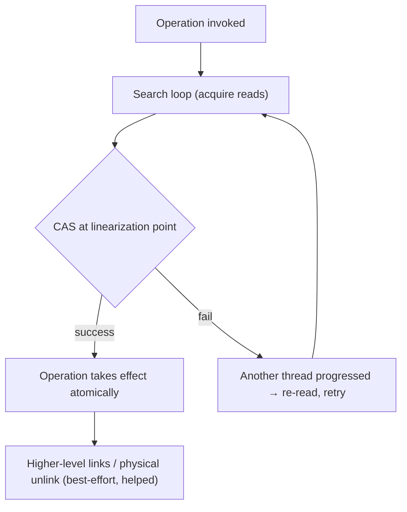

# Skip List — Mathematical Foundations and Probabilistic Analysis

> **Read time: ~40 minutes** · **Audience:** Engineers and students who want the rigorous probabilistic analysis behind the skip list — the expected-O(log n) search proof, the expected level and space bounds, the high-probability (Chernoff/tail) bounds, and the linearizability argument for the lock-free variant.

A skip list is a **randomized data structure**: its shape is a random variable determined by the coin flips assigned to nodes, independent of the keys themselves. This is what lets us prove *distribution-free* bounds — the analysis holds for *any* sequence of keys and *any* insertion order, because the randomness lives in the structure, not the input. (Contrast a quicksort with a fixed pivot, whose bad case depends on the input; a randomized skip list has no bad *input*, only bad *luck*, and bad luck is provably rare.)

This document proves four things rigorously:

1. **Expected number of levels** is `O(log n)`.
2. **Expected search cost** is `O(log n)` (the backward-path proof).
3. **Expected space** is `O(n)`.
4. A **high-probability** bound: search exceeds `c·log n` with probability at most `n^{-α}` — degradation is super-polynomially rare.

We close with the **linearizability / lock-freedom** correctness argument for the concurrent variant.

Throughout, `n` is the number of elements, `p ∈ (0,1)` is the promotion probability, and `q = 1 - p`. We use `lg = log₂` and `log₁/ₚ x = (lg x)/(lg(1/p))`.

---

## Table of Contents

1. [Formal Definition](#formal-definition)
2. [The Level Distribution and Expected Maximum Level](#level-distribution)
3. [Correctness — The Search Invariant](#correctness)
4. [Expected Search Cost — The Backward-Path Proof](#search-proof)
5. [Expected Space Analysis](#space)
6. [High-Probability Bounds (Tail Bounds)](#high-probability)
7. [Concurrency Correctness — Linearizability and Lock-Freedom](#concurrency)
8. [A Worked Numeric Analysis](#numeric)
9. [Deterministic Skip Lists and the Randomness Question](#deterministic)
10. [Comparison with Alternatives](#comparison)
11. [Variance, Concentration, and the Cost of a Sequence](#advanced-bounds)
12. [Summary](#summary)

---

<a name="formal-definition"></a>
## 1. Formal Definition

A skip list `S` over a totally ordered key universe `(U, <)` is a tuple `(N, H, head, level)` where:

```
N        = finite set of nodes, each node v carries key(v) ∈ U
H : N → ℤ⁺   height function. H(v) = number of levels v occupies.
             H(v) is an i.i.d. random variable with
                 Pr[H(v) = k] = q · p^{k-1}      (geometric, mean 1/q)
head     = sentinel node with key = -∞ and H(head) = maxLevel
level    = max over v of H(v)  (current number of populated levels)
```

For each level `i ∈ {0, …, level-1}`, define list `Lᵢ` = the subsequence of nodes `v` with `H(v) > i`, linked in increasing key order via `forward[i]`. The structural **invariants**:

```
I1 (sortedness):   within each Lᵢ, keys strictly increase.
I2 (containment):  Lᵢ ⊇ L_{i+1}  as a set of keys (a node at level i+1 is at level i).
I3 (heights):      H(v) is fixed at insertion and never changes.
```

I2 is what makes the express-lane picture valid: every higher lane is a sub-list of the one below. I1 makes each lane a valid search list. I3 says we never rebalance — the randomness is "frozen" at birth.

A key fact we will use repeatedly: **the heights `H(v)` are mutually independent and independent of the keys.** This is the engine of the entire analysis.

---

<a name="level-distribution"></a>
## 2. The Level Distribution and Expected Maximum Level

### 2.1 Per-node height

By definition `Pr[H(v) = k] = q·p^{k-1}` (the geometric distribution: `k-1` promotions then a stop). Two immediate consequences:

```
Pr[H(v) > i] = p^i          (need at least i promotions)
E[H(v)] = Σ_{k≥1} k·q·p^{k-1} = 1/q = 1/(1-p)
```

So the expected node height — equivalently the expected number of forward pointers per node — is `1/(1-p)`. For `p=1/2`, that is 2; for `p=1/4`, `4/3`.

### 2.2 Number of nodes at level i

Let `Nᵢ = #{v : H(v) > i}` be the count of nodes reaching level `i`. By linearity of expectation and `Pr[H(v) > i] = p^i`:

```
E[Nᵢ] = n · p^i
```

The lanes shrink geometrically: `n, np, np², …`. This is the precise form of "half the nodes per lane."

### 2.3 Expected maximum level

**Theorem 1.** The expected number of levels `L = max_v H(v)` satisfies `E[L] ≤ log₁/ₚ n + 1/(1-p) = O(log n)`.

**Proof.** Let `Lₘₐₓ` be the maximum height. We bound it via the level counts. Define `L* = log₁/ₚ n`. For levels `i ≥ L*`, the expected count `E[Nᵢ] = n·p^i ≤ n·p^{L*} = 1`. The probability that level `i` is nonempty is, by Markov / union bound,

```
Pr[Nᵢ ≥ 1] ≤ E[Nᵢ] = n·p^i.
```

The maximum height exceeds `L* + j` only if some node reaches that level:

```
Pr[Lₘₐₓ > L* + j] ≤ E[N_{L*+j}] = n·p^{L*+j} = p^j   (since n·p^{L*} = 1).
```

Therefore, summing the survival probabilities (E[X] = Σ Pr[X ≥ k]):

```
E[Lₘₐₓ] ≤ L* + Σ_{j≥0} Pr[Lₘₐₓ > L* + j] ≤ L* + Σ_{j≥0} p^j = L* + 1/(1-p).
```

Hence `E[Lₘₐₓ] ≤ log₁/ₚ n + 1/(1-p) = O(log n)`. ∎

For `p=1/2`, `E[Lₘₐₓ] ≤ lg n + 2`. The list almost never grows taller than `lg n` plus a small constant — which is why `maxLevel = 32` suffices for `n` up to `4^32` at `p=1/4` (Redis).

---

<a name="correctness"></a>
## 3. Correctness — The Search Invariant

Before analyzing cost we must show search is **correct** regardless of the random heights. Correctness depends only on invariants I1–I2, never on the distribution.

**Claim.** `search(t)` returns the node with key `t` if present, else reports absence.

**Loop invariant `J`.** At the start of processing level `i`, the current node `x` satisfies `key(x) < t`, and every node with key `≥ t` reachable in the list lies at or after `x` in every level `≤ i`. Equivalently: `x` is the rightmost node at level `i` (so far) whose key is `< t`, and no node with key `< t` lies between `x` and `t`'s position at any level we have finished.

```
Base case (i = level-1): x = head, key(head) = -∞ < t. Trivially the rightmost
    sub-(-∞) node we know of; nothing skipped because we start at the far left.

Maintenance: at level i we move right while forward[i] exists and key(forward[i]) < t.
    Each move keeps key(x) < t. We stop when forward[i] is NULL or key(forward[i]) ≥ t.
    By I2 (Lᵢ ⊇ L_{i+1}) and I1 (sorted), the predecessor of t at level i-1 is at or
    to the right of x — so dropping to level i-1 from x cannot skip past t's position.
    Thus J holds at level i-1.

Termination: levels strictly decrease from level-1 to 0; the loop runs exactly
    'level' times. After level 0, x is the rightmost node with key < t in the base list.

Postcondition: x.forward[0] is the first node with key ≥ t (or NULL). We test it:
    if key(x.forward[0]) == t, found; else t is absent. Correct by I1 on L₀ (the
    base list contains every element in sorted order). QED
```

The crucial step is the maintenance argument's use of **I2**: because each higher lane is a subset of the lane below, descending from `x` never overshoots `t`. Correctness is *deterministic*; only **cost** is random.

**Concrete trace of the invariant.** Take keys `{3, 9, 12, 19, 25}` and search `t = 19`. Suppose `19` and `12` have height 2 and the rest height 1, so `L₁ = [head, 12, 19]` and `L₀ = [head, 3, 9, 12, 19, 25]`. The descent:

```
i=1: x=head (key -∞ < 19, J holds). forward[1]=12, 12<19 → x=12.
     forward[1]=19, 19<19? no → stop. J at i=0: x=12 is rightmost-known < 19,
     and by I2 every node ≥ 19 in L₀ is at or right of 12. Drop to L₀.
i=0: x=12. forward[0]=19, 19<19? no → stop. J: x=12 rightmost < 19 in L₀.
Post: x.forward[0]=19, key 19 == t → FOUND.
```

At no point did the descent pass `19`, precisely because `J` (via I2) guaranteed `x` stayed left of `t`'s position. Notice the heights were arbitrary — had `12` been height 1, the descent would visit `9` at L₀ instead, still landing correctly on `19`. The *path* changed with the random heights; the *result* did not. This is the formal content of "randomness affects cost, not correctness."

---

<a name="search-proof"></a>
## 4. Expected Search Cost — The Backward-Path Proof

This is Pugh's elegant argument, made rigorous. We bound the expected number of nodes visited by a search.

**Setup.** Trace the search path *backward*: start at the node found at level 0 and walk back toward the head, reversing each move. A forward "move right at level i" becomes a backward "move left at level i"; a forward "drop from level i+1 to level i" becomes a backward "climb from level i to level i+1." The backward path therefore consists of *left* and *up* moves; its length equals the forward search cost (number of pointer traversals).

**Key probabilistic observation.** Consider the backward walk currently sitting at some node `w` at level `i`, where `w ≠ head`. The next backward move is determined by whether `w` extends above level `i`:

- If `H(w) > i+1` (i.e., `w` has a pointer at level `i+1`), the forward search must have *dropped into* `w` from level `i+1` — so the backward move is **up**. This occurs iff `w` was promoted past level `i`, which (given `w` exists at level `i`) happens with probability **`p`**.
- Otherwise (`H(w) = i+1`, `w` does not extend higher), the forward search *moved right* into `w` from a level-`i` predecessor — backward move is **left**, probability **`q = 1-p`**.

Because heights are independent, each backward step is an independent trial: "up" with prob `p`, "left" with prob `q`. (This independence is exactly why the proof is clean — knowing we are at level `i` tells us nothing about the heights of nodes still to our left.)

**Counting climbs.** Let `C(i)` = expected number of backward steps to climb from level 0 up to level `i` (or reach the head, whichever first). Conditioning on the first step:

```
C(i) = 1 + p·C(i-1) + q·C(i)        [up with prob p reduces remaining climb by 1;
                                      left with prob q stays at the same target level]
```

**Solving the recurrence.** From `C(i) = 1 + p·C(i-1) + q·C(i)` we isolate `C(i)`:

```
C(i) - q·C(i) = 1 + p·C(i-1)
p·C(i)        = 1 + p·C(i-1)            (since 1 - q = p)
C(i)          = 1/p + C(i-1).
```

This is a simple arithmetic recurrence with `C(0) = 0`, giving the **exact closed form**:

```
C(i) = i/p.
```

So the expected number of backward steps to climb `i` levels is exactly `i/p`. Each level costs `1/p` expected steps — the `1/p` factor is the average number of trials (one horizontal "left" or one vertical "up") needed to register a single "up" success at probability `p`. (This is the cleanest derivation: no series to sum, just a linear recurrence.) To climb `L = O(log₁/ₚ n)` levels:

```
E[backward path length] ≤ (number of levels) · (expected steps per level)
                        = L · (1/p)
                        = (1/p) · log₁/ₚ n
                        = O(log n)        for fixed p.
```

**Capping the top.** The argument above climbs to level `L = log₁/ₚ n`. Above `L`, Theorem 1 showed the expected number of *additional* levels (and hence additional horizontal nodes at the top, all linked off the head) is `O(1/(1-p)) = O(1)`. Adding this constant:

```
E[search cost] ≤ (1/p)·log₁/ₚ n + 1/q + O(1) = O(log n).
```

**Theorem 2.** The expected number of nodes visited by `search`, `insert`, or `delete` in a skip list of `n` elements is `O(log n)`. (Insert/delete do the same descent plus `O(H(new node)) = O(1/(1-p)) = O(1)` expected splicing work.) ∎

**Remark on the constant.** Total comparisons ≈ `(1/p)·log₁/ₚ n = (lg n)/(p·lg(1/p))`. Minimizing over `p` gives `p = 1/e ≈ 0.368`, the theoretically optimal promotion probability (as noted in `middle.md`). The function is flat near the optimum, so `p ∈ [1/4, 1/2]` are all near-optimal in practice.

**Lemma (insert/delete splice cost).** Beyond the descent, an insert splices the new node at each of its `H(new)` levels — `E[H(new)] = 1/(1-p) = O(1)` pointer writes — and a delete unlinks the target at its `H(target)` levels, also `O(1)` expected. Crucially, both touch *only* the predecessors recorded in `update[i]` at the node's own levels, so the splice work is **independent of `n`**. Total cost = descent `O(log n)` + splice `O(1)` = `O(log n)` expected. The `O(1)` splice term is also why the **locality** argument of `senior.md` holds: a mutation's footprint is a constant number of pointers near one node, never a path-to-root propagation. ∎

---

<a name="space"></a>
## 5. Expected Space Analysis

**Theorem 3.** The expected total number of forward pointers (the dominant space cost) is `n/(1-p) = O(n)`.

**Proof.** Each node `v` contributes `H(v)` forward pointers. By linearity of expectation and `E[H(v)] = 1/(1-p)`:

```
E[total pointers] = Σ_{v} E[H(v)] = n · 1/(1-p) = n/(1-p).
```

For `p=1/2` this is `2n`; for `p=1/4`, `(4/3)n`. Adding `O(1)` per node for the key/value payload, total space is `Θ(n)`. ∎

**Worst-case space.** In the (vanishingly unlikely) event all nodes are very tall, space could reach `O(n·maxLevel) = O(n log n)` if `maxLevel = Θ(log n)`. But by Theorem 1 the expected and high-probability height is `O(log n)` *total across all nodes summed appropriately*; per Theorem 3 the *expected* space is strictly `O(n)`. The `O(n log n)` figure is a worst-case artifact of the `maxLevel` cap, never realized in expectation.

**Variance.** The total pointer count is a sum of `n` i.i.d. geometric variables, each with variance `p/(1-p)²`. The total has variance `n·p/(1-p)² = O(n)`, so by Chebyshev the space concentrates tightly around `n/(1-p)`: deviations beyond `O(√n)` are improbable. Space is not just `O(n)` in expectation — it is `O(n)` with high probability.

**Per-level pointer accounting (alternative derivation).** A second route to the same total cross-checks it. Level `i` holds `Nᵢ` nodes, each contributing one pointer at that level, so total pointers = `Σ_{i≥0} Nᵢ`. Taking expectations and using `E[Nᵢ] = n·p^i`:

```
E[total pointers] = Σ_{i≥0} E[Nᵢ] = Σ_{i≥0} n·p^i = n · 1/(1-p) = n/(1-p).
```

The geometric series `Σ p^i = 1/(1-p)` reproduces Theorem 3 exactly — the per-node view (sum of heights) and the per-level view (sum of lane sizes) agree, as they must, since both count the same pointers. This per-level decomposition is also the cleanest way to *implement* a memory estimator: report `Σ Nᵢ` directly from the live lane sizes.

**A note on the `maxLevel` cap's effect.** Truncating heights at `maxLevel = M` replaces the geometric tail beyond `M` with a point mass: `Pr[H = M] = p^{M-1}` (all would-be-taller nodes pile at `M`). For `M ≥ log₁/ₚ n + Θ(1)`, the displaced probability mass is `≤ p^{M} ≤ 1/n`, contributing `≤ 1` extra pointer in expectation across all `n` nodes. So the cap is asymptotically free: it bounds the worst case at `O(n·M)` without measurably inflating the *expected* `n/(1-p)`. Choosing `M = 32` (Redis) makes the displaced mass `4^{-32} ≈ 5×10^{-20}` — utterly negligible for any realistic `n`.

---

<a name="high-probability"></a>
## 6. High-Probability Bounds (Tail Bounds)

Expectation alone does not rule out occasional bad searches. We now show that exceeding the expected cost by a constant factor is *super-polynomially* unlikely — the practical justification for treating the skip list as "always O(log n)."

### 6.1 Maximum level concentration

**Theorem 4.** For any constant `c > 1`, `Pr[Lₘₐₓ > c·log₁/ₚ n] ≤ n^{-(c-1)}`.

**Proof.** From §2.3, `Pr[Lₘₐₓ > L* + j] ≤ p^j` with `L* = log₁/ₚ n`. Set `c·L* = L* + j`, i.e., `j = (c-1)·L* = (c-1)·log₁/ₚ n`. Then

```
Pr[Lₘₐₓ > c·log₁/ₚ n] ≤ p^{(c-1)·log₁/ₚ n} = (p^{log₁/ₚ n})^{c-1} = (1/n)^{c-1} = n^{-(c-1)}.
```

(using `p^{log₁/ₚ n} = p^{(ln n)/(ln(1/p))} = e^{-ln n} = 1/n`.) ∎

So for `c = 3`, the list exceeds `3·log₁/ₚ n` levels with probability `≤ 1/n²`. For `n = 10⁶`, that is `≤ 10^{-12}` — effectively impossible.

### 6.2 Search-cost tail bound via Chernoff

**Theorem 5.** With high probability, every search costs `O(log n)` steps. Precisely, the search cost exceeds `3·(1/p)·log₁/ₚ n` with probability at most `n^{-α}` for some constant `α > 0`.

**Proof sketch.** The backward path climbs `L = O(log n)` levels, each requiring a geometric number of "up" trials with success probability `p`. The total number of steps is a sum of `L` independent geometric variables, or equivalently the number of Bernoulli(`p`) trials needed to accumulate `L` successes — a **negative binomial** variable `X`. Its mean is `μ = L/p`. By a Chernoff bound on the number of successes in `m = 3μ = 3L/p` trials: the expected number of successes in `m` trials is `pm = 3L`, and the probability of fewer than `L` successes (i.e., failing to climb `L` levels within `3μ` steps) is

```
Pr[Binomial(m, p) < L] = Pr[Binomial(3L/p, p) < L]
                       ≤ exp(-(2/3)²·(3L)/2)         (Chernoff lower tail, δ=2/3)
                       = exp(-(2/3)·L) = e^{-Θ(log n)} = n^{-Θ(1)}.
```

So `Pr[search cost > 3L/p] ≤ n^{-α}`. Combining with Theorem 4 (the top of the list is also `O(log n)` w.h.p.) gives: **every** operation is `O(log n)` with probability `≥ 1 - n^{-α}`. ∎

### 6.3 Union bound over all operations

If we perform `m = poly(n)` operations, a union bound over Theorem 5 shows that **all** of them are `O(log n)` with probability `≥ 1 - m·n^{-α} = 1 - n^{-(α - O(1))}`. By choosing the constant in the `O(log n)` large enough, the entire *workload* — not just one operation — runs in `O(log n)` per op with high probability. This is the formal sense in which "skip lists are O(log n)": not merely in expectation, but with overwhelming probability across an entire polynomial-length sequence of operations.

| Bound | Statement | Probability of violation |
|---|---|---|
| Expected level | `E[Lₘₐₓ] ≤ log₁/ₚ n + O(1)` | — (expectation) |
| Level tail | `Lₘₐₓ ≤ c·log₁/ₚ n` | `≤ n^{-(c-1)}` |
| Expected search | `E[cost] = O(log n)` | — (expectation) |
| Search tail | `cost ≤ 3(1/p)log₁/ₚ n` | `≤ n^{-α}` |
| Whole workload (poly ops) | all ops `O(log n)` | `≤ n^{-α'}` |

### 6.4 Why the union bound is the right tool, and its cost

The union bound (Boole's inequality) trades tightness for generality: `Pr[∪ Eⱼ] ≤ Σ Pr[Eⱼ]`. Here each `Eⱼ` is "operation `j` is slow," with `Pr[Eⱼ] ≤ n^{-α}`. For `m` operations, `Pr[any slow] ≤ m·n^{-α}`. To keep this below, say, `n^{-1}`, we need `m·n^{-α} ≤ n^{-1}`, i.e., the per-operation exponent `α` must exceed `1 + log_n m`. We *buy* a larger `α` by enlarging the constant `c` in the `c·log n` step bound (Theorem 5 gives `α` growing with `c`). So: **for any polynomial workload `m = n^{O(1)}`, a sufficiently large constant in the `O(log n)` makes every operation simultaneously fast with probability `1 - o(1)`.** The price is only a constant factor in the latency bound — never an asymptotic one. This is the rigorous justification for the engineering claim "skip lists are just O(log n)."

### 6.5 Contrast with expectation-only structures

It is worth stressing what the high-probability bound buys *over* the expectation bound. A structure with `E[cost] = O(log n)` could still have, say, a `1/log n` fraction of operations costing `Θ(n)` — the average would survive, but tail latency (p99, p99.9) would be catastrophic. The skip list's tail bound rules this out: not only is the *mean* `O(log n)`, the *entire distribution* is concentrated there, so **p99 and even p99.99 latencies are `O(log n)`**. This distinction — mean versus tail — is exactly what a senior engineer cares about for SLAs, and it is the skip list's quiet strength: its randomness produces tight tails, not just good averages.

---

<a name="concurrency"></a>
## 7. Concurrency Correctness — Linearizability and Lock-Freedom

The concurrent skip list (Java `ConcurrentSkipListMap`, Harris/Lea design from `senior.md`) must satisfy two correctness conditions: **linearizability** (every operation appears to take effect atomically at some point between its invocation and response, consistent with a sequential skip list) and **lock-freedom** (some thread always makes progress; no global blocking).

### 7.1 Linearization points

Define a single atomic step in each operation as its **linearization point**:

```
search(t):  the atomic read of forward[0] that yields the candidate node.
            If that node has key t and is unmarked → present; else absent.
insert(t):  the successful CAS that links the new node at LEVEL 0.
            (Higher-level links are an optimization; level-0 link is authoritative.)
delete(t):  the successful CAS that MARKS the target node's forward[0] pointer
            (logical deletion). Physical unlinking is a later, helping step.
```

**Lemma (linearizability).** Each operation appears atomic at its linearization point.

**Argument.** The base list `L₀` is the authoritative copy of the set; higher levels are an *index* that only accelerates search and never holds elements the base list lacks (by I2, maintained even concurrently because a node is linked at level 0 *before* readers depend on it, and marked deleted at level 0 as the act of removal).

- A `search` that linearizes at time `τ` reads `forward[0]` reflecting exactly the inserts/deletes whose level-0 CAS committed before `τ`. By I1 on `L₀` it returns the correct membership at `τ`.
- An `insert`'s level-0 CAS makes the key visible to all subsequent base-list reads atomically; before it, no reader sees the key.
- A `delete`'s **mark** CAS atomically renders the node logically absent: any reader subsequently reaching it treats the marked node as deleted (and helps physically unlink). The physical unlink is invisible to membership — it only reclaims the index slot.

Thus the concurrent execution is equivalent to a sequential one in which each operation occurs at its linearization point. ∎

### 7.2 The marking invariant (why deletion is safe)

The danger: a thread inserts `Y` right after `X` while another deletes `X`, linking `Y` off a removed node. Prevention rests on:

```
INVARIANT M: once a node's forward[i] pointer is marked, it is immutable forever.
```

Inserting after `X` is a CAS on `X.forward[i]` from `old` to `new`. If `X` is being deleted, its `forward[i]` is *marked* first; the inserter's CAS expects an unmarked pointer, so it **fails**, and the inserter re-searches and links off the live predecessor instead. No node is ever linked off a logically deleted node. This is **Harris's lock-free linked-list deletion** lifted to each level of the skip list. Correctness of the whole structure reduces to correctness of Harris's list at level 0 (authoritative) plus best-effort index maintenance at higher levels.

### 7.3 Lock-freedom

**Claim.** The algorithm is lock-free: at all times, some thread completes an operation in a finite number of its own steps regardless of other threads' scheduling.

**Argument.** Every operation is a search loop punctuated by CAS attempts. A CAS fails only if *another* thread succeeded in modifying the same pointer — i.e., another thread made progress. So a failed CAS witnesses global progress. There is no lock to hold and no thread whose suspension blocks others; a stalled thread leaves the structure in a consistent (marked or linked) state that others can navigate and **help** complete. Hence the system as a whole never stalls — lock-freedom holds. (It is not *wait*-free: an individual thread can be starved by repeated CAS failures, but the system always advances.) ∎

### 7.4 Memory reclamation

A subtlety glossed over by the high-level argument: physically unlinked nodes cannot be freed while another thread may still hold a reference. Production lock-free skip lists use **epoch-based reclamation**, **hazard pointers**, or a GC (the JVM's, for `ConcurrentSkipListMap`) to defer freeing until no thread can observe the node. The correctness proofs above assume safe reclamation; getting it wrong yields use-after-free, the most common bug in hand-rolled lock-free skip lists.



---

<a name="numeric"></a>
## 8. A Worked Numeric Analysis

Abstract bounds become trustworthy once you plug in numbers. Take `p = 1/2` and `n = 1,048,576 = 2²⁰` (a clean power of two). We compute every quantity the theory predicts and sanity-check it.

### 8.1 Expected levels

```
L* = log₁/ₚ n = lg n = 20.
E[Lₘₐₓ] ≤ L* + 1/(1-p) = 20 + 2 = 22.
```

So the list is expected to be about 20 levels tall, never realistically more than ~22. A `maxLevel` of 24 or 32 is comfortable.

### 8.2 Nodes per level

`E[Nᵢ] = n·p^i = 2²⁰ · 2^{-i} = 2^{20-i}`:

| Level i | Expected nodes | |
|---|---|---|
| 0 | 1,048,576 | all elements |
| 1 | 524,288 | half |
| 5 | 32,768 | n/32 |
| 10 | 1,024 | n/1024 |
| 15 | 32 | |
| 19 | 2 | |
| 20 | 1 | last reachable level |
| 21 | 0.5 | usually empty |

The geometric thinning is exact: each level holds half the previous. The top of the list flickers around level 20–22.

### 8.3 Expected search cost

The backward-path bound gives `E[cost] ≈ (1/p)·log₁/ₚ n = 2·20 = 40` node visits. Compare a linear scan of `2²⁰` elements: ~1,048,576 visits. The skip list is ~26,000× fewer steps — the difference between instant and unusable.

### 8.4 Expected space

`E[total pointers] = n/(1-p) = 2·n = 2,097,152` pointers. At 8 bytes each that is ~16 MB of pointers, plus ~8 MB of `int64` values, ~24 MB total — comfortably L3-resident for a few-million-element set. At `p = 1/4` the pointer total drops to `(4/3)·n ≈ 1.4M` pointers (~11 MB), the 33% saving Redis exploits.

### 8.5 High-probability check

By Theorem 4, `Pr[Lₘₐₓ > 3·lg n] = Pr[Lₘₐₓ > 60] ≤ n^{-2} = 2^{-40} ≈ 9×10⁻¹³`. By Theorem 5, the chance any single search exceeds `3·(1/p)·lg n = 120` steps is `n^{-α}` for some `α > 0` — negligible. Even across a billion operations the union bound keeps the probability of *any* slow operation astronomically small. This is the quantitative meaning of "skip lists are O(log n) in practice."

---

<a name="deterministic"></a>
## 9. Deterministic Skip Lists and the Randomness Question

A natural professional question: *can we remove the randomness and keep O(log n) as a worst-case guarantee?* Yes — these are **deterministic skip lists** (Munro, Papadakis, Sedgewick, 1992), which enforce a structural rule on consecutive same-height runs.

### 9.1 The 1-2-3 deterministic skip list

The rule: between any two nodes of height `≥ h+1`, there are **at most 3** (and at least 1) nodes of height exactly `h`. This "gap balance" is maintained on insert/delete by *promoting* or *demoting* a node when a gap would otherwise grow to 4 or shrink to 0 — analogous to a 2-3-4 tree's node splitting. The result:

```
Worst-case search/insert/delete: O(log n)  — a hard guarantee, no probability.
```

The deterministic skip list is, in fact, **isomorphic to a B-tree / (2,4)-tree**: the height-balance rule is the B-tree's fan-out rule in disguise. This explains why both achieve worst-case O(log n) — they are the same structure viewed through different lenses.

### 9.2 Why randomization usually wins anyway

Given a deterministic O(log n) variant exists, why do Redis, the JDK, and LevelDB all use the *randomized* one?

1. **Simplicity.** The promote/demote rebalancing of a deterministic skip list reintroduces exactly the case-analysis complexity (and the global propagation of rebalancing) that the randomized version was designed to avoid. You are back to B-tree-level code.
2. **Concurrency.** Deterministic rebalancing propagates structural changes, hurting the locality that makes the randomized skip list lock-free-friendly. Randomized inserts/deletes stay local.
3. **The probabilistic bound is enough.** As §8.5 (the high-probability check) shows, the chance of a slow operation is `≤ n^{-α}` — for `n = 10⁶` that is below `10⁻¹²` per op. The high-probability bound is indistinguishable from a guarantee for any real workload. Paying simplicity and concurrency to convert `n^{-α}` failure probability into a hard `0` is rarely worth it.

There is also a **theoretical equivalence** worth internalizing: the deterministic 1-2-3 skip list, the (2,4)-tree, the 2-3-4 tree, and the red-black tree are all the *same* balanced search structure expressed differently, all achieving worst-case `O(log n)` via the same fan-out invariant. The randomized skip list is the lone outlier — it achieves the bound *probabilistically*, with no invariant to maintain, which is exactly why it stands apart on simplicity and concurrency. Knowing they are one family (deterministic) plus one outlier (randomized) organizes the entire landscape of balanced ordered dictionaries.

The lesson: randomization is not a *limitation* worked around but a deliberate *design choice* trading an essentially-never-observed worst case for large gains in simplicity and concurrency. A deterministic guarantee matters only in hard real-time settings (avionics, certain trading systems), where a balanced BST or deterministic skip list is the right call.

| Variant | Bound | Rebalancing | Concurrency | Used by |
|---|---|---|---|---|
| Randomized skip list | O(log n) **expected / w.h.p.** | none (frozen heights) | excellent | Redis, JDK, LevelDB |
| Deterministic (1-2-3) skip list | O(log n) **worst** | promote/demote on gaps | poor | rare |
| Red-black tree | O(log n) **worst** | rotations + recolor | poor | std libs |

**A decision heuristic.** Reach for the *randomized* skip list unless you can articulate a *hard* worst-case requirement — a number, in milliseconds, that a single operation may never exceed even once in the system's lifetime. Real-time control loops and certain low-latency trading paths can state such a number; web services, databases, and caches almost never can, because their tail SLAs (p99/p99.9) are comfortably met by the high-probability bound. If you cannot name the hard deadline, the randomized structure's simplicity and concurrency are strictly the better engineering trade. This single question — "is there a *hard* deadline, or just a tail SLA?" — resolves the randomized-vs-deterministic choice in nearly every real system.

---

<a name="comparison"></a>
## 10. Comparison with Alternatives

| Attribute | Skip List | Red-Black Tree | Treap | Sorted Array |
|---|---|---|---|---|
| Search | O(log n) expected, O(n) w.c. (prob n^{-α}) | O(log n) **worst** | O(log n) expected | O(log n) worst |
| Insert/Delete | O(log n) expected, no rotations | O(log n) worst, rotations | O(log n) expected, rotations | O(n) |
| Space | n/(1-p) ptrs, Θ(n) expected | 2 ptrs + parent + color | 2 ptrs + parent + priority | 0 overhead |
| Balancing | random heights (frozen) | invariant + rotations | random priorities + rotations | n/a |
| Determinism | randomized | deterministic | randomized | deterministic |
| Concurrency | lock-free feasible (Harris) | very hard | hard | immutable only |
| Cache I/O | O(log n) misses (pointer chase) | O(log n) misses | O(log n) misses | O(log_B n) (B-tree better) |
| Worst-case guarantee | probabilistic only | hard guarantee | probabilistic only | hard for search |

**Key theoretical distinction.** The skip list and treap give **expected** and **high-probability** bounds; the red-black tree gives a **deterministic worst-case** bound. For applications that cannot tolerate even an `n^{-α}`-probability slow operation (hard real-time), use the deterministic structure. For everything else, the skip list's high-probability bound is indistinguishable from a guarantee, at a fraction of the code and far better concurrency.

**Lower bound context.** Any comparison-based ordered dictionary needs `Ω(log n)` per operation (the comparison/decision-tree lower bound: `n!` orderings require depth `Ω(n log n)` total, `Ω(log n)` per search). The skip list matches this in expectation, so it is **asymptotically optimal** among comparison-based ordered dictionaries.

**On beating the comparison bound.** Structures that escape `Ω(log n)` — van Emde Boas trees (`O(log log U)`), y-fast tries, fusion trees — do so by exploiting the *bit structure* of integer keys, not comparisons. A skip list, being purely comparison-based, cannot beat `Ω(log n)`, and does not try to; its value is matching the optimum with minimal code and maximal concurrency, not lowering the exponent. If your keys are bounded integers and you need sub-logarithmic operations, a van Emde Boas layout or a y-fast trie is the structure to study — at a large cost in implementation complexity that the skip list deliberately avoids.

---

<a name="advanced-bounds"></a>
## 11. Variance, Concentration, and the Cost of a Sequence

The expectation bounds say the *average* operation is `O(log n)`; the high-probability bounds say *one* operation is rarely slow. Two further questions complete the professional picture: how *tightly* does cost concentrate, and what is the cost of a whole *sequence* of operations?

### 11.1 Variance of search cost

The search cost is (essentially) the number of steps to climb `L = log₁/ₚ n` levels, a **negative binomial** variable `X` = number of Bernoulli(`p`) trials to reach `L` successes. Its variance is:

```
Var[X] = L · (1-p) / p²
```

For `p = 1/2`, `Var[X] = 2L = 2·log₂ n`, so the standard deviation is `Θ(√log n)`. Relative to the mean `E[X] = L/p = 2 log₂ n`, the spread is `Θ(√log n)/Θ(log n) = Θ(1/√log n) → 0`. **Search cost concentrates** around its mean: for large `n`, almost every search takes essentially `(1/p)·log₁/ₚ n` steps, with deviations of only `O(√log n)`. This is why benchmarked skip-list latencies are remarkably stable, not spiky.

### 11.2 Cost of a sequence of m operations (aggregate analysis)

Consider an arbitrary interleaving of `m` operations (insert/delete/search) on a skip list that never exceeds `n` elements. By **linearity of expectation** over the `m` operations, each `O(log n)` in expectation:

```
E[ total cost of m operations ] = Σ_{j=1}^{m} E[ cost of op j ] ≤ m · c · log n = O(m log n).
```

Unlike amortized analysis for, say, a dynamic array (where individual ops vary wildly but average out), the skip list needs *no* amortization argument: **every** operation is `O(log n)` in expectation *individually*, so the sequence cost follows directly from linearity. There is no "expensive resize" hiding in the average. This is a cleaner cost model than a balanced tree whose rebalancing cost, while `O(log n)` worst-case, can cluster.

### 11.3 Why the randomness need not be re-rolled

A subtle correctness-adjacent point: the heights are **frozen at insertion** (invariant I3). One might worry that a long sequence "uses up" good luck and drifts toward a bad configuration. It does not. Because each node's height is an *independent* draw and never re-rolled, the structure after any sequence of operations is distributed *exactly* as if its current `n` elements had been inserted fresh — the height distribution is **memoryless** with respect to operation history. (Deletions remove a node and its frozen height; remaining nodes keep their independent heights.) So the expected and high-probability bounds hold at *every* point in the sequence, not just at the start. There is no degradation over time, no need for periodic rebuild — a property balanced trees achieve only through continual rebalancing.

### 11.4 The adversary model and its limits

The bounds are **distribution-free over inputs** but **assume the adversary cannot see the coin flips**. Formally, the skip list is an *oblivious* randomized structure: against an adversary that chooses the operation sequence *without* knowledge of the internal RNG, all bounds hold. Against an *adaptive* adversary that can observe node heights (e.g., by timing searches to infer structure), the guarantees weaken — a known issue shared by all hash tables and randomized structures. *Mitigation in practice:* a cryptographically strong, unobservable RNG, or periodic reseeding. This is the precise theoretical statement behind the senior-level "adversarial RNG" failure mode.

### 11.5 Practical synthesis

Combining §11.1–11.4: a skip list's operation cost is `O(log n)` in expectation, concentrated to within `O(√log n)` of its mean (tight tails), holds at every point in any oblivious operation sequence without re-rolling or rebuild, and degrades only under an adaptive adversary who observes the RNG. For the working engineer this collapses to one sentence: **with an unobservable RNG, a skip list delivers balanced-tree latency — mean *and* tail — for the lifetime of the workload, with no rebalancing machinery.** That is the complete probabilistic case for the structure, and the reason it underpins Redis, the JDK, and every major LSM engine.

---

<a name="summary"></a>
## 12. Summary

- A skip list's randomness lives in **i.i.d. geometric node heights** (`Pr[H=k]=q p^{k-1}`), independent of keys — giving **distribution-free** bounds that hold for any input.
- **Correctness** (Theorem of §3) is deterministic, resting only on invariants I1 (sorted lanes) and I2 (lane containment); the random heights affect only cost.
- **Expected levels** `E[Lₘₐₓ] ≤ log₁/ₚ n + O(1)` (Theorem 1); **expected search/insert/delete** `O(log n)` via the **backward-path proof** (Theorem 2); **expected space** `n/(1-p) = Θ(n)` (Theorem 3).
- **High-probability bounds**: levels exceed `c·log₁/ₚ n` with prob `≤ n^{-(c-1)}` (Theorem 4); search exceeds `3(1/p)log₁/ₚ n` with prob `≤ n^{-α}` (Theorem 5, Chernoff). A union bound extends this to an entire polynomial-length workload — so the skip list is `O(log n)` per op **with overwhelming probability**, not merely in expectation.
- The optimal promotion probability for comparison count is `p = 1/e ≈ 0.368`; practical choices `1/4`–`1/2` are near-optimal.
- The **concurrent** skip list is **linearizable** (level-0 CAS as linearization point) and **lock-free** (failed CAS witnesses others' progress), with deletion safety guaranteed by Harris's **marking invariant** and safe **memory reclamation**.
- Skip lists are **asymptotically optimal** among comparison-based ordered dictionaries, trading a deterministic worst-case (which red-black trees provide) for simplicity and concurrency, with a high-probability bound that is, for all practical purposes, a guarantee.
- **Cost concentrates** (variance `Θ(log n)`, std-dev `Θ(√log n)`): not just the mean but the **entire latency distribution** — including p99 and p99.9 tails — is `O(log n)`, and it stays that way for the whole workload with no rebuild, because frozen-height randomness is memoryless over operation history.
- The deterministic balanced structures (1-2-3 skip list, (2,4)-tree, red-black tree) form **one family**; the randomized skip list is the **outlier** that reaches the same bound without any invariant — the source of its simplicity and concurrency edge.

---

**Next step:** [interview.md](./interview.md) — tiered interview questions (junior → professional) with model answers, plus a multi-part skip-list coding challenge in Go, Java, and Python.
