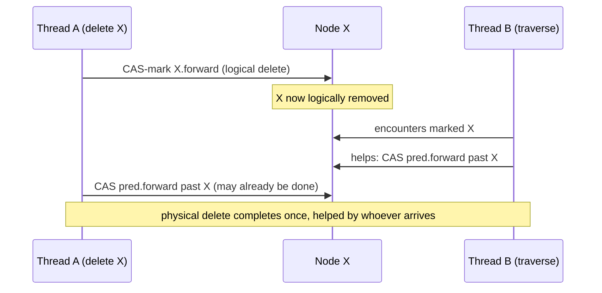
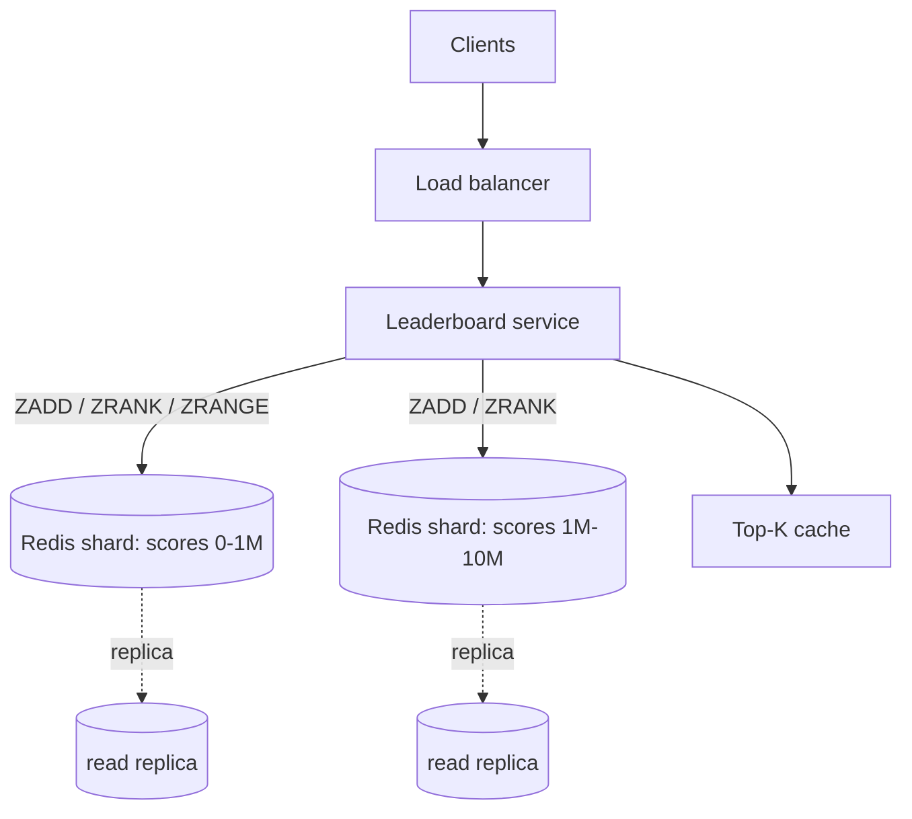

# Skip List — Senior Level

> **Read time: ~40 minutes** · **Audience:** Engineers designing or operating systems that embed a skip list — Redis sorted sets, concurrent ordered maps, LSM-tree memtables — who need to reason about concurrency, memory layout, and failure modes, not just the textbook algorithm.

At the senior level the question is no longer "how does a skip list work" but "why did three of the most important storage systems in the industry — Redis, LevelDB/RocksDB, and the JDK concurrency library — all independently choose a skip list for their ordered, high-throughput data path?" The answer is the same in every case: the skip list's mutations are **local** and **pointer-only**, which makes it uniquely friendly to concurrency and to append-heavy workloads, while still delivering balanced-tree query performance with a fraction of the implementation risk.

This document dissects three production embeddings — **Redis ZSET**, **lock-free / concurrent skip lists** (Java `ConcurrentSkipListMap` and the Herlihy–Lev–Luchangco–Shavit design), and the **LSM-tree memtable** (LevelDB/RocksDB) — then covers memory layout, observability, and the failure modes you must design around.

---

## Table of Contents

1. [Introduction — Why Systems Choose Skip Lists](#introduction)
2. [Case Study: Redis ZSET](#redis-zset)
3. [Concurrent and Lock-Free Skip Lists](#concurrent)
4. [Case Study: LSM-Tree Memtable (LevelDB / RocksDB)](#lsm)
5. [Comparison of Production Embeddings](#comparison)
6. [Memory Layout and Cache Behavior](#memory)
7. [Code: A Concurrent Skip List](#code)
8. [Design Scenario — A Real-Time Leaderboard](#design-scenario)
9. [Observability](#observability)
10. [Failure Modes](#failure-modes)
11. [Summary](#summary)

---

<a name="introduction"></a>
## 1. Introduction — Why Systems Choose Skip Lists

A senior engineer selects a data structure by its **system properties**, not its asymptotic complexity alone. Three properties make the skip list a recurring winner in storage and concurrency:

1. **Local, rotation-free mutations.** An insert or delete touches only the predecessors of one node at that node's own levels. Nothing far away changes. A balanced BST's rotations propagate up the tree, potentially touching the root on every write. Locality is the prerequisite for fine-grained locking and lock-free designs.

2. **Pointer-only updates.** A mutation is a handful of pointer writes. With careful ordering (and atomic CAS), other threads always observe a *consistent* structure — either before or after the splice, never a torn intermediate. This is the foundation of lock-free skip lists.

3. **Sorted order with cheap range scans.** Walking `forward[0]` yields sorted order; range queries are O(log n + k). LSM trees need exactly this: flush the memtable to disk as a sorted run.

```mermaid
graph TD
    SL["Skip List properties"] --> A["Local mutations"]
    SL --> B["Pointer-only writes"]
    SL --> C["Sorted iteration + range scans"]
    A --> R1["Fine-grained / lock-free concurrency"]
    B --> R1
    A --> R2["Redis ZSET: ordered set with rank"]
    C --> R3["LSM memtable: flush as sorted run"]
    R1 --> S1["Java ConcurrentSkipListMap"]
    R3 --> S2["LevelDB / RocksDB"]
```



We now examine each embedding.

---

<a name="redis-zset"></a>
## 2. Case Study: Redis ZSET

### 2.1 The dual-index design

A Redis **sorted set** (`ZSET`) maps each *member* (a string) to a *score* (a double) and keeps members ordered by score. It must answer two very different queries fast:

- `ZSCORE member` — given a member, return its score. A **point lookup by key**.
- `ZRANGE`, `ZRANK`, `ZREVRANGE` — given a rank or score range, return members in order. **Ordered / range queries.**

No single structure does both well. A hash map gives O(1) `ZSCORE` but no order. A skip list gives ordered queries but O(log n) `ZSCORE`. Redis uses **both, in sync**:

```
typedef struct zset {
    dict     *dict;       // member -> score   (hash map, O(1) ZSCORE)
    zskiplist *zsl;       // score  -> member   (skip list, ordered queries)
} zset;
```

Every `ZADD` writes both structures; every `ZREM` removes from both. The skip list is ordered by `(score, member)` — ties on score are broken by lexicographic member order, giving a total order so the structure stays a proper search structure even with duplicate scores.

> **Optimization:** for small sorted sets (default ≤ 128 entries, each ≤ 64 bytes), Redis skips the skip list entirely and uses a compact **listpack** (formerly ziplist) — a flat, cache-friendly array — because for tiny `n` the skip list's pointer overhead and allocation cost are not worth it. It promotes to the dict+skiplist representation once thresholds are exceeded. This is a classic small-n optimization every senior engineer should recognize.

### 2.2 Why a skip list and not a balanced tree?

Antirez (Redis's author) gave three reasons, all senior-grade:

1. **Simplicity and maintainability.** A skip list is far less code than a red-black tree and far less likely to harbor a subtle rebalancing bug in a database that millions rely on.
2. **Range queries are natural.** `ZRANGEBYSCORE` is a descent plus a forward walk — trivial on a skip list.
3. **Memory is tunable.** Redis sets `p = 1/4` (`ZSKIPLIST_P 0.25`), cutting per-node pointers to ~1.33 versus ~2 at `p=1/2` — meaningful when a ZSET holds tens of millions of members. `ZSKIPLIST_MAXLEVEL = 32` caps height.

### 2.3 Span counters and the backward pointer

Redis's skip-list node carries, per level, both a `forward` pointer and a `span` (number of nodes the pointer skips) — the indexable-skip-list trick from `middle.md` §7. Spans make `ZRANK`/`ZREVRANK` O(log n). Each base-level node also has a single `backward` pointer, making level 0 a **doubly linked list** so `ZREVRANGE` can walk backward without an extra search.

```
typedef struct zskiplistNode {
    sds        ele;        // member string
    double     score;
    struct zskiplistNode *backward;          // level-0 reverse pointer
    struct zskiplistLevel {
        struct zskiplistNode *forward;
        unsigned long span;                  // for O(log n) rank
    } level[];                               // flexible array, height = node level
} zskiplistNode;
```

This is the canonical production skip list: **dict + doubly-linked, span-annotated skip list**, `p=1/4`, max level 32, listpack for small sets.

---

<a name="concurrent"></a>
## 3. Concurrent and Lock-Free Skip Lists

### 3.1 Why skip lists are concurrency-friendly

The locality property pays off here. Because a mutation touches only a few pointers near one node, concurrent operations on *different* parts of the list rarely conflict, and the few that do can be coordinated with per-pointer atomics rather than a global lock. Compare a balanced tree: a single insert may rotate up to the root, so concurrent inserts contend on the root — a serialization bottleneck. Lock-free *balanced* trees are notoriously hard; lock-free *skip lists* are a solved, shipped problem.

### 3.2 Java `ConcurrentSkipListMap`

The JDK's `java.util.concurrent.ConcurrentSkipListMap` (and `...Set`) is a **lock-free** skip list, based on the Lea/Harris design. Key techniques:

- **CAS-based splicing.** Inserting a node at level 0 is a single `compareAndSet` on the predecessor's `next` pointer. If a competing thread changed it first, the CAS fails and the operation retries from the search.
- **Logical then physical deletion.** Deletion is two phases: first mark the node logically deleted (Harris's *marker node* / a marked reference), then physically unlink it. Other threads that encounter a marked node help unlink it and retry — *helping* is a hallmark of lock-free algorithms.
- **No locks, no blocking.** Threads never wait on each other; a stalled thread cannot block others (lock-freedom). This gives excellent scalability on many cores.

The result: a thread-safe, ordered `NavigableMap` with O(log n) expected operations and no global lock — the go-to concurrent sorted map in Java.

### 3.3 The lock-free deletion problem

The hard part of any lock-free linked structure is deletion, because unlinking a node is a two-pointer dance that another thread can interleave with. The classic bug: thread A unlinks node X while thread B is inserting Y right after X — B's CAS succeeds against X's now-stale `next`, and Y is lost (linked off a removed node).

The **Harris solution** (used by the JDK): mark X's `next` pointer with a "deleted" bit *before* unlinking. Now any CAS that tries to splice off X's `next` sees the mark and fails, forcing the inserter to retry against the live predecessor. Deletion thus becomes: (1) CAS-mark the node's forward pointer, (2) CAS the predecessor past it. If step 2 races, another traversal *helps* complete it. Correctness rests on the invariant that **a marked pointer is immutable** — once marked deleted, it never changes, so readers can trust what they see.



### 3.4 Fine-grained locking alternative

If lock-freedom is overkill, a **lazy skip list** with per-node locks (Herlihy & Shavit, *The Art of Multiprocessor Programming*, ch. 14) is simpler and nearly as scalable: a search is wait-free and unsynchronized; an insert/delete locks only the predecessors it must splice, validates they are still adjacent and unmarked, then commits. This is easier to reason about than full lock-freedom and is a common production choice.

---

<a name="lsm"></a>
## 4. Case Study: LSM-Tree Memtable (LevelDB / RocksDB)

### 4.1 The memtable's job

A **log-structured merge tree** (LSM) — the engine behind LevelDB, RocksDB, Cassandra, HBase, and many time-series DBs — turns random writes into sequential ones. Writes first go to an in-memory **memtable**; when it fills, it is flushed to disk as an immutable, sorted **SSTable**. The memtable must support:

- **Fast concurrent inserts** (the write hot path).
- **Point and range reads** (to serve gets before flush).
- **Sorted iteration** (to flush as a sorted run in one pass).

A skip list nails all three. LevelDB's `db/skiplist.h` is a clean, **insert-only**, single-writer / many-reader skip list:

- Only inserts and reads — never deletes (deletes are tombstone *inserts*; actual removal happens at compaction on disk). This drastically simplifies concurrency: with no deletion, there is no unlink race.
- **One writer, many concurrent readers** with no read locks. Inserts use atomic stores with release semantics; readers use acquire loads. A reader either sees a fully linked new node or doesn't see it at all — never a torn one. This is achieved by publishing `forward[0]` *last* with a memory-ordering barrier.
- Arena allocation: nodes are bump-allocated from a contiguous arena for locality and cheap bulk free on flush.

### 4.2 Why not a B-tree memtable?

A B-tree would force readers to take locks (node splits move keys around) and would not flush as cleanly. The skip list's insert-only + single-writer model gives **lock-free reads** essentially for free — a major throughput win on read-during-write workloads. RocksDB keeps the skip-list memtable as the default but also offers a hash-skip-list and a vector memtable for specialized workloads.

### 4.3 The memory-ordering trick (the heart of LevelDB's skip list)

```
Insert publishes a new node by writing forward[i] pointers bottom-up,
storing forward[0] LAST with a release barrier.
Readers load forward[i] with an acquire barrier.

Guarantee: if a reader observes the new node via forward[0],
it also observes all the node's fields (value, higher pointers),
because the release/acquire pair orders those writes before the publish.
```

This is why LevelDB needs no read locks: the single writer's release-store on `forward[0]` is the linearization point, and acquire-loads ensure readers see a consistent node. It is the cleanest illustration of why "pointer-only mutation" makes skip lists concurrency-friendly.

---

<a name="comparison"></a>
## 5. Comparison of Production Embeddings

| Aspect | Redis ZSET | Java `ConcurrentSkipListMap` | LevelDB/RocksDB memtable |
|---|---|---|---|
| Concurrency model | Single-threaded (Redis event loop) | Lock-free (CAS + helping) | Single-writer, lock-free readers |
| Deletes | Yes (sync dict + skiplist) | Yes (mark + unlink) | **No** (tombstone insert; removed at compaction) |
| `p` | 1/4 | 1/2 (effective) | 1/4 (branching factor 4) |
| Max level | 32 | 31/32 | 12 (configurable) |
| Extra per-node | span (rank) + backward (reverse) | mark bit / marker nodes | none (insert-only) |
| Paired structure | hash dict (O(1) ZSCORE) | — | — |
| Small-n optimization | listpack ≤ 128 entries | — | — |
| Allocation | jemalloc per-node | GC objects | arena (bump allocator) |
| Why chosen | simple + range + tunable mem | local mutation → lock-free | insert-only → lock-free reads |

The through-line: each system exploits **a different consequence of the same locality property**. Redis exploits simplicity and range queries; the JDK exploits CAS-able local splices; LevelDB exploits the single-writer publish point.

---

<a name="memory"></a>
## 6. Memory Layout and Cache Behavior

### 6.1 Per-node memory

A node's memory is the value plus a variable-length `forward` array of `height` pointers. With `p`:

```
expected pointers per node = 1 / (1 - p)
   p = 1/2  -> 2.0 pointers
   p = 1/4  -> 1.33 pointers
```

Total pointer memory ≈ `n / (1 - p)` pointers. For 10M members at `p = 1/4` and 8-byte pointers: ~10M × 1.33 × 8 ≈ 107 MB of pointers, plus values and overhead. This is why Redis chose `p = 1/4` — the savings are real at scale.

### 6.2 Cache behavior — the skip list's weakness

A skip list **chases pointers**, so each level hop can be a cache miss. A sorted array (binary search) and a cache-conscious B-tree stream through contiguous memory and have far better cache locality. Mitigations production systems use:

- **Arena allocation** (LevelDB): bump-allocate nodes contiguously so spatially-near insertions land near each other in memory, improving locality during scans.
- **Lower `p`**: fewer levels means fewer hops per search (at the cost of more horizontal scanning within a cache-resident region).
- **Node packing**: store the value inline in the node (not behind another pointer) to save a dereference.
- **Unrolled / blocked skip lists**: store several keys per node so each hop covers more ground — a hybrid toward B-tree locality.

The honest senior take: if your data is **read-mostly and static**, a sorted array or B-tree will beat a skip list on cache-bound throughput. The skip list wins when you need **concurrent writes** or **simple ordered mutation**, where its locality (for concurrency) outweighs its poor spatial locality (for cache).

### 6.3 Comparison table

| Structure | Memory/elem | Cache locality | Concurrency | Worst-case |
|---|---|---|---|---|
| Skip list (p=1/2) | ~2 ptrs | poor (pointer chase) | excellent | O(n) improbable |
| Skip list (p=1/4) | ~1.33 ptrs | poor | excellent | O(n) improbable |
| Red-black tree | 2 ptrs + parent + color | poor | hard | O(log n) |
| Sorted array | 0 overhead | excellent | n/a (immutable) | O(log n) search, O(n) insert |
| B+-tree | fanout-dependent | excellent | medium (page locks) | O(log n) |

---

<a name="code"></a>
## 7. Code: A Concurrent Skip List

A fine-grained-locking concurrent skip list. Search is lock-free; insert/delete lock only the predecessors they splice. (Production lock-free versions add Harris marking; this lazy version is correct and far easier to follow.)

### 7.1 Go (mutex-guarded, RWMutex for read scalability)

```go
package concurrentskip

import (
    "math/rand"
    "sync"
)

const (
    maxLevel = 16
    p        = 0.5
)

type node struct {
    value   int
    forward []*node
}

type ConcurrentSkipList struct {
    mu    sync.RWMutex
    head  *node
    level int
}

func New() *ConcurrentSkipList {
    return &ConcurrentSkipList{head: &node{forward: make([]*node, maxLevel)}, level: 1}
}

func randomLevel() int {
    lvl := 1
    for rand.Float64() < p && lvl < maxLevel {
        lvl++
    }
    return lvl
}

// Search takes only a read lock — many searches run in parallel.
func (s *ConcurrentSkipList) Search(value int) bool {
    s.mu.RLock()
    defer s.mu.RUnlock()
    x := s.head
    for i := s.level - 1; i >= 0; i-- {
        for x.forward[i] != nil && x.forward[i].value < value {
            x = x.forward[i]
        }
    }
    x = x.forward[0]
    return x != nil && x.value == value
}

// Insert takes a write lock.
func (s *ConcurrentSkipList) Insert(value int) {
    s.mu.Lock()
    defer s.mu.Unlock()
    update := make([]*node, maxLevel)
    x := s.head
    for i := s.level - 1; i >= 0; i-- {
        for x.forward[i] != nil && x.forward[i].value < value {
            x = x.forward[i]
        }
        update[i] = x
    }
    if nx := x.forward[0]; nx != nil && nx.value == value {
        return
    }
    lvl := randomLevel()
    if lvl > s.level {
        for i := s.level; i < lvl; i++ {
            update[i] = s.head
        }
        s.level = lvl
    }
    n := &node{value: value, forward: make([]*node, lvl)}
    for i := 0; i < lvl; i++ {
        n.forward[i] = update[i].forward[i]
        update[i].forward[i] = n
    }
}
```

### 7.2 Java (use the JDK's lock-free implementation)

```java
import java.util.concurrent.ConcurrentSkipListMap;
import java.util.concurrent.ConcurrentSkipListSet;

public class ConcurrentExample {
    public static void main(String[] args) {
        // Lock-free, ordered, thread-safe — backed by a skip list.
        ConcurrentSkipListMap<Integer, String> map = new ConcurrentSkipListMap<>();
        map.put(10, "a");
        map.put(30, "c");
        map.put(20, "b");

        System.out.println(map.firstKey());        // 10  (O(1))
        System.out.println(map.ceilingKey(15));    // 20  (O(log n))
        System.out.println(map.subMap(15, 35));    // {20=b, 30=c}  range query

        // Concurrent ordered set
        ConcurrentSkipListSet<Integer> set = new ConcurrentSkipListSet<>();
        // Safe to call put/remove/contains from many threads with no external locking.
    }
}
```

### 7.3 Python (lock-guarded; CPython's GIL plus a lock)

```python
import random
import threading


class _Node:
    __slots__ = ("value", "forward")

    def __init__(self, value, height):
        self.value = value
        self.forward = [None] * height


class ConcurrentSkipList:
    MAX_LEVEL = 16
    P = 0.5

    def __init__(self):
        self.head = _Node(float("-inf"), self.MAX_LEVEL)
        self.level = 1
        self._lock = threading.RLock()

    def _random_level(self):
        lvl = 1
        while random.random() < self.P and lvl < self.MAX_LEVEL:
            lvl += 1
        return lvl

    def search(self, value):
        # Reads are consistent under the GIL; lock guards against concurrent writers.
        with self._lock:
            x = self.head
            for i in range(self.level - 1, -1, -1):
                while x.forward[i] is not None and x.forward[i].value < value:
                    x = x.forward[i]
            x = x.forward[0]
            return x is not None and x.value == value

    def insert(self, value):
        with self._lock:
            update = [None] * self.MAX_LEVEL
            x = self.head
            for i in range(self.level - 1, -1, -1):
                while x.forward[i] is not None and x.forward[i].value < value:
                    x = x.forward[i]
                update[i] = x
            nxt = x.forward[0]
            if nxt is not None and nxt.value == value:
                return
            lvl = self._random_level()
            if lvl > self.level:
                for i in range(self.level, lvl):
                    update[i] = self.head
                self.level = lvl
            node = _Node(value, lvl)
            for i in range(lvl):
                node.forward[i] = update[i].forward[i]
                update[i].forward[i] = node
```

> Note: in Python, true parallelism is limited by the GIL, so a single coarse lock is fine. In Go and Java the lock granularity matters; for high contention prefer the JDK's lock-free map or a Harris-style lock-free Go implementation.

---

<a name="design-scenario"></a>
## 8. Design Scenario — A Real-Time Leaderboard

To see the senior decisions come together, design a **gaming leaderboard** for 50 million players: write a player's score, read the top-K, and ask "what rank am I?" and "who is around me (±25 ranks)?" Latency target: p99 under 5 ms; updates can spike to 200k/s during events.

### 8.1 Why a skip list is the core

The query mix is exactly a sorted set's: ordered by score, with rank and range. A hash map alone can't rank; a sorted array can't take 200k inserts/s (O(n) shifts). A skip list with **span counters** gives:

- `submitScore(player, score)` → O(log n) insert/update.
- `rank(player)` → O(log n) via accumulated spans.
- `topK()` → O(log n + K) descend to rank 0, walk K nodes.
- `around(player, ±25)` → O(log n + 50) find player, walk the doubly-linked base list both directions.

This is precisely Redis ZSET, so the pragmatic answer is often **"use Redis."** The senior value-add is knowing *why* it fits and where it strains.

### 8.2 Where it strains, and the fixes

| Strain | Cause | Fix |
|---|---|---|
| 200k/s writes on one key | single-threaded Redis instance saturates | shard by score range or region; merge at read time |
| 50M members × pointers | ~16 MB×... memory at p=1/2 | use `p=1/4` (Redis default) → 33% less; or partition |
| Frequent score updates churn the list | each update = delete + reinsert (2× O(log n)) | batch updates; only re-rank on a debounce window |
| "Top-K" hammered by every client | repeated O(log n + K) descents | cache the top-K, invalidate on writes that cross the boundary |
| Tie-breaking on equal scores | nondeterministic order | break ties by player ID (total order), as Redis does |

### 8.3 The architecture



Each Redis shard is a dict + span-annotated, doubly-linked skip list. Reads of rank/range hit replicas; writes go to primaries. The top-K cache absorbs the hottest read. Sharding by score range keeps `around(player)` cheap (a player's neighbors share its shard), but global rank must sum offsets across shards — a known cross-shard cost you design for explicitly.

### 8.4 The senior judgment call

The interesting trade-off: **global exact rank** across shards is expensive (sum spans from every shard on each query). If the product can tolerate *approximate* global rank (e.g., "top 0.1%"), you keep per-shard exact rank and estimate globally from shard sizes — turning an O(shards · log n) cross-shard query into O(log n) local. Choosing approximate-where-acceptable is the kind of decision that separates a working system from a fast one.

---

<a name="observability"></a>
## 9. Observability

What to monitor when a skip list is on a hot path:

| Metric | Why it matters | Alert threshold |
|---|---|---|
| `skiplist_level` (current height) | Should track `log₁/ₚ n`; a spike hints at a bad RNG or memory waste | > `2·log₁/ₚ n` |
| `search_steps_p99` | Detects degradation toward O(n) | > `c·log n` for chosen `c` |
| `node_count` / `size` | Capacity planning; drives flush in LSM | > memtable budget |
| `memory_bytes` | Pointer overhead grows with `1/(1-p)` | > 80% of budget |
| `insert_retries` (lock-free) | High retries = contention hot spot | rising trend |
| `cas_failures` (lock-free) | Same — points at a contended key range | rising trend |
| `range_scan_len_p99` | Long scans dominate latency | workload-dependent |

For an LSM memtable, also watch **flush frequency** (memtable full → flush) and **write stall** events (flush can't keep up). For Redis, `INFO` exposes `zset` counts; large ZSETs with frequent `ZRANGEBYSCORE` are the latency drivers.

**Quick capacity sizing.** A back-of-envelope for a skip list holding `n` 16-byte entries (8-byte key + 8-byte value):

| n | p | pointers/node | pointer bytes | + payload | total |
|---|---|---|---|---|---|
| 1M | 1/2 | 2.0 | 16 MB | 16 MB | ~32 MB |
| 1M | 1/4 | 1.33 | ~11 MB | 16 MB | ~27 MB |
| 10M | 1/4 | 1.33 | ~107 MB | 160 MB | ~267 MB |
| 50M | 1/4 | 1.33 | ~533 MB | 800 MB | ~1.3 GB |

The `p=1/4` rows show why Redis defaults there: at 50M members the pointer saving alone is ~270 MB. Add per-node allocator overhead (jemalloc rounds up) and span/backward fields for an indexable, doubly-linked node, and real usage runs ~20–40% above these floors.

---

<a name="failure-modes"></a>
## 10. Failure Modes

- **Adversarial / weak RNG.** If an attacker can predict your level-assignment RNG (e.g., a fixed seed, or a low-entropy source), they can craft an insertion order that forces tall towers and O(n) searches — a denial-of-service vector. *Mitigation:* per-instance, well-seeded RNG; avoid exposing the seed; in security-sensitive contexts use a hardened RNG.

- **Lock-free deletion races (the classic bug).** Unlinking without logical marking lets a concurrent insert link a node off a removed predecessor, losing data. *Mitigation:* Harris marking — mark the forward pointer before physical unlink; readers/inserters help complete and retry. Never roll your own lock-free skip list without this.

- **Memory ordering bugs (LevelDB-style).** On weakly-ordered architectures (ARM), publishing a new node without a release barrier lets a reader see the link before the node's fields are written → torn read. *Mitigation:* publish `forward[0]` last with release semantics; read with acquire.

- **Unbounded growth.** A memtable or ZSET with no eviction grows until OOM. *Mitigation:* LSM flushes at a size threshold; Redis applies `maxmemory` policies and per-key limits.

- **Level not shrinking after bulk deletes.** Searches keep starting at a stale high level, wasting steps. *Mitigation:* shrink `level` when top lanes empty (single-threaded), or accept the minor cost in lock-free versions.

- **`maxLevel` too small for actual `n`.** Towers pile at the top, search degrades toward O(n/maxLevel·...). *Mitigation:* size `maxLevel ≈ log₁/ₚ(expected max n)`; Redis uses 32, supporting `4^32` elements.

- **Cache thrashing on read-mostly workloads.** Pointer-chasing kills throughput when the dataset doesn't fit cache and writes are rare. *Mitigation:* if writes are rare, reconsider — a sorted array or B+-tree may be the better structure. Choose the skip list for its concurrency, not its cache behavior.

---

<a name="summary"></a>
## 11. Summary

- Three flagship systems chose skip lists for the **same reason**: **local, pointer-only mutations** enable simple range queries (Redis), lock-free concurrency (Java `ConcurrentSkipListMap`), and lock-free reads under a single writer (LevelDB/RocksDB memtable).
- **Redis ZSET** = hash dict (`ZSCORE` O(1)) + span-annotated, doubly-linked skip list (`ZRANGE`/`ZRANK` O(log n)), `p=1/4`, max level 32, listpack for small sets.
- **Concurrent skip lists** lean on locality: CAS-spliced inserts, Harris mark-then-unlink deletes with helping (lock-free), or per-node locks with validation (lazy). Deletion is the hard part everywhere.
- **LSM memtables** use an insert-only, single-writer skip list; publishing `forward[0]` with a release barrier gives **lock-free reads** — the cleanest demonstration of why pointer-only mutation matters.
- **Memory** is ~`1/(1-p)` pointers per node; `p=1/4` saves a third at scale. **Cache behavior is the weakness** — pointer-chasing loses to contiguous structures on read-mostly workloads; arena allocation and lower `p` mitigate.
- **Operate** by watching list height, p99 search steps, memory, and (lock-free) retry/CAS-failure rates. **Design around** adversarial RNGs, deletion races, memory ordering, and unbounded growth.

The senior lesson: pick the skip list when **concurrency or implementation simplicity** dominates; pick a contiguous structure when **cache-bound read throughput** dominates.

---

**Next step:** [professional.md](./professional.md) — the formal expected-O(log n) proof, expected-level and expected-space analysis, the high-probability (Chernoff) bound, and a correctness argument for the concurrent (linearizable, lock-free) variant.
