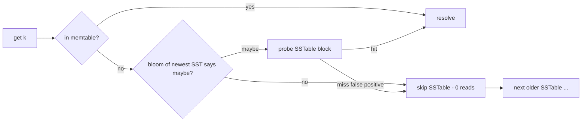

# LSM-Tree — Interview Preparation

> **Audience:** Candidates preparing for systems, database, storage, and distributed-systems interviews. Prerequisites: `junior.md` (memtable/SSTable/flush/read path), `middle.md` (compaction strategies, bloom/sparse index, WAL, tombstones), `senior.md` (RocksDB/Cassandra ops), `professional.md` (amplification derivations).

The LSM-tree is one of the most common "explain a real storage engine" topics in systems interviews, especially for roles touching databases, key-value stores, search, time-series, and anything write-heavy. Below are **54 tiered questions with model answers**, followed by **two coding challenges** (a tiny memtable + SSTable + merge `get`, then a bloom-filtered `get`) in Go, Java, and Python.

The questions are tiered so you can calibrate to the role: **Junior** checks vocabulary and the read/write paths; **Middle** checks the *why* behind compaction, bloom filters, and durability; **Senior** checks operations at scale (stalls, rate limiting, hot shards); **Professional** checks the formal bounds and proofs. Interviewers commonly start broad ("what is an LSM-tree?") and drill down until you stop knowing the answer — so the depth you reach in this list roughly predicts the level you'll be slotted into.

---

## Junior Questions (What / How)

**Q1. What is an LSM-tree in one sentence?**
A write-optimized storage structure that buffers writes in an in-memory memtable, flushes full memtables to immutable sorted on-disk SSTables, and merges/compacts SSTables in the background; reads check the memtable then SSTables newest-first.

**Q2. What are the four core components?**
Memtable (in-memory sorted buffer), SSTable (immutable sorted on-disk file), WAL (write-ahead log for durability), and compaction (background merge of SSTables).

**Q3. Why is an LSM-tree faster at writes than a B-tree?**
It turns random in-place updates into **sequential** I/O: writes go to an in-memory memtable plus a sequential WAL append, and full memtables are flushed as one big sequential write. Sequential I/O is 10–200× faster than the random writes a B-tree does to update leaf pages in place.

**Q4. Walk through a single write.**
Append `(key, value)` to the WAL and fsync (durability), insert into the memtable (sorted, in RAM), acknowledge. When the memtable fills, freeze it and flush it to a new SSTable in the background.

**Q5. Walk through a single read.**
Check the memtable first; if absent, check SSTables **newest to oldest**. For each SSTable, ask its bloom filter "could the key be here?"; if no, skip it; if maybe, use the sparse index to read one block and binary-search it. Return the first value found (a tombstone means "not found").

**Q6. What is an SSTable?**
A Sorted String Table: an immutable file of key-value pairs sorted by key, written sequentially. Once written it is never modified — only read, merged into new SSTables, or deleted.

**Q7. What is a memtable usually implemented as, and why?**
A skip list. It supports fast ordered inserts and lock-friendly concurrent reads without the rebalancing of a balanced tree, and it's already sorted so flushing it produces a valid SSTable directly.

**Q8. What is a flush?**
Converting a full, frozen memtable into a new on-disk SSTable via a sequential write; afterward a fresh empty memtable takes new writes and the covered WAL is truncated.

**Q9. What is compaction at a high level?**
A background process that merges several SSTables into fewer/larger ones, keeping only the newest value per key and dropping obsolete versions and (eventually) tombstones, reclaiming space and bounding read cost.

**Q10. How are deletes handled?**
By writing a **tombstone** — a marker that the key is deleted. The data isn't removed immediately; the tombstone (being newest) shadows older values on reads and is physically removed later during compaction.

**Q11. Why not just delete the key from disk?**
Older SSTables may still hold the key. There's no cheap way to find and erase every copy on a delete, so we write a newest-wins tombstone and let compaction clean up.

**Q12. What does "newest wins" mean?**
When the same key exists in multiple sources, the most recently written version is authoritative. Reads consult sources newest-first and stop at the first hit; compaction keeps the newest version on a tie.

**Q13. Name three systems that use an LSM-tree.**
RocksDB, LevelDB, Cassandra (also ScyllaDB, HBase, InfluxDB).

**Q14. What is the time complexity of a write?**
O(1) amortized: an in-memory memtable insert plus a sequential WAL append. The heavy work (compaction) is deferred to the background.

**Q15. Is an LSM-tree better for reads or writes?**
Writes. It accepts higher read and space cost to win write throughput. B-trees are the read-optimized counterpart.

---

## Middle Questions (Why / When)

**Q16. Compare size-tiered and leveled compaction.**
Size-tiered groups SSTables into tiers by size and merges same-size tiers; low write amplification but high read and space amplification (overlapping ranges, many runs per key). Leveled organizes SSTables into levels with non-overlapping ranges per level; low read and space amplification (≤1 SSTable per level) but high write amplification (`~L·T`).

**Q17. When would you pick size-tiered over leveled?**
Write-heavy / ingest-heavy workloads where SSD write endurance or write bandwidth is the bottleneck — size-tiered's lower write amplification wins. Time-series with TTL → TWCS (a tiered variant).

**Q18. When would you pick leveled?**
Read-heavy or space-constrained workloads — leveled bounds read amplification (one SSTable per level) and keeps space amplification ~1.1×.

**Q19. What are the three amplifications?**
Write amplification (bytes written to disk ÷ user bytes), read amplification (disk reads per logical read), space amplification (bytes stored ÷ live bytes). They trade off against each other.

**Q20. How does a bloom filter help reads?**
Each SSTable has a bloom filter over its keys. On a lookup, if the filter says "definitely not present," the SSTable is skipped with zero disk reads. Bloom filters have no false negatives, so a "no" is always safe; they make missing-key reads nearly free.

**Q21. Can a bloom filter help range scans? Why or why not?**
No. A bloom filter answers point membership for a single key; a range isn't a single key. Range scans must merge across all overlapping sources regardless. (Prefix bloom filters partially help prefix scans.)

**Q22. How do you size a bloom filter?**
Bits per key ≈ `1.44·log2(1/p)` for false-positive rate `p`. ~10 bits/key gives ~1% FP (RocksDB default). More bits → fewer false positives but more RAM.

**Q23. What is a sparse index and why use it over a dense one?**
A sparse index stores one entry (first key + offset) per disk block, not per key, so it stays small enough to live in RAM. A lookup binary-searches the index, reads one block, then searches within it. A dense index would be too large to keep resident.

**Q24. What is the WAL and why is it needed?**
The write-ahead log: an append-only on-disk log written before the memtable is updated. Because the memtable is in volatile RAM, the WAL provides durability — on crash, replaying the WAL rebuilds the memtable.

**Q25. What is the ordering rule for the WAL?**
Append to WAL → fsync → apply to memtable → acknowledge. Acking before the fsync risks losing an acknowledged write on crash.

**Q26. How does crash recovery work?**
On restart, replay the WAL front-to-back into a fresh memtable, reconstructing the pre-crash state. Half-written SSTables from a crash-during-flush are discarded (the WAL still has the data).

**Q27. What is the tombstone life cycle?**
Birth (delete writes a tombstone), shadowing (reads hit it first and return not-found), migration (compaction carries it down, erasing older copies), death (dropped at the bottom level after a grace period).

**Q28. Why a grace period before dropping tombstones (e.g. gc_grace_seconds)?**
In a replicated store, a tombstone must survive long enough to propagate to every replica via repair. Drop it too early while a replica is offline holding the old value, and the deleted key resurrects when that replica returns.

**Q29. Compare LSM-tree vs B-tree across writes, reads, and space.**
LSM: out-of-place, sequential writes (fast), higher read amp (multiple SSTables), higher space amp (obsolete versions). B-tree: in-place, random writes (slower), lower read amp (single path), lower space amp. LSM wins writes; B-tree wins reads and space.

**Q30. Why are SSTables immutable, and what does that buy you?**
Once written they're never modified. This enables lock-free concurrent reads, trivial caching, simple checksums, and safe sharing across readers and compactions — at the cost of needing background compaction to clean up.

**Q31. What is read amplification's worst case and how is it mitigated?**
A missing-key read could touch every SSTable. Mitigations: bloom filters (skip SSTables that can't contain the key) and leveled compaction (one SSTable per level via non-overlapping ranges).

**Q32. What is the RUM conjecture?**
You can optimize at most two of Read, Update, and Memory/space overhead; improving one forces a cost on another. The LSM-tree minimizes update overhead and slides between read and space cost via its compaction strategy.

**Q33. Why does a bigger memtable reduce write amplification?**
Fewer, larger flushes mean data is consolidated more before hitting disk, so it's rewritten fewer times by compaction. The cost is more RAM and longer crash-recovery replay.

**Q34. What is a sequence number used for?**
A monotonically increasing stamp on every write. Sorting by (key asc, seq desc) makes "newest wins" a sort property and enables snapshot/MVCC reads (read as of a sequence number).

---

## Senior Questions (Scale / Operations)

**Q35. What is a write stall and what causes it?**
The engine throttles or blocks writes when compaction debt crosses thresholds (too many L0 files, too many pending compaction bytes). Cause: ingest rate exceeds the rate compaction can pay down debt. Fix: more compaction threads, raise the rate limit, larger memtable, or shed write load.

**Q36. Why and how do you rate-limit compaction?**
Compaction competes with foreground reads/writes for disk bandwidth and CPU. A rate limiter (e.g. RocksDB's RateLimiter, token bucket) caps compaction write bandwidth so foreground traffic always has headroom; auto-tuning raises the cap when debt grows.

**Q37. Which two metrics are the leading indicators of trouble?**
`pending_compaction_bytes` (compaction debt) and `l0_file_count`. When either climbs steadily, compaction is losing the race — intervene before the write stall.

**Q38. How would you tune a write-amplification-bound (SSD endurance) workload?**
Switch to size-tiered/universal compaction (lower WA), increase memtable size (fewer flushes), larger SSTable target sizes, lower fanout — accept higher read/space amp in exchange.

**Q39. How would you tune a read-latency-bound workload?**
Leveled compaction, more/bigger bloom filters (10→14 bits/key), larger block cache, reduce L0 file count — accept higher write amp.

**Q40. What is a tombstone storm and how do you avoid it?**
Heavy deletes or TTL'd rows accumulate tombstones faster than compaction collects them; range scans then read thousands of tombstones to return few live rows, spiking latency. Avoid with TWCS for time-series, tuning gc_grace, and not using queue-like delete patterns.

**Q41. Describe RocksDB's architecture briefly.**
Active memtable (skip list) + immutable memtable queue + shared WAL; flush threads write L0 SSTables; compaction threads merge levels (leveled by default); block cache for hot data blocks; per-key bloom filters; column families for per-data-class tuning; write stalls protect against compaction debt.

**Q42. How does Cassandra's deletion/replication interaction differ from a single-node store?**
Deletes are tombstones that must survive `gc_grace_seconds` (default 10 days) so they propagate to all replicas via repair; otherwise an offline replica resurrects the deleted data. Compaction strategy is per-table (STCS/LCS/TWCS).

**Q43. Why run compaction reads without polluting the block cache?**
Compaction reads cold data; if it fills the block cache, it evicts hot foreground data and read p99 rises. Engines mark compaction iterators to bypass the cache (`fill_cache=false`).

**Q44. A node's compaction can't keep up while peers idle. Diagnosis?**
A hot shard/partition — the partition key concentrates writes on one node. Fix at the system layer: rebalance, choose a better hash key, or salt the hot key.

**Q45. Capacity planning: a node ingests 50 MB/s of new data under leveled compaction (T=10, ~5 levels). What disk write bandwidth must the SSD sustain?**
Not 50 MB/s — that's the user rate. The disk sees `W_user × WA` where `WA ≈ L·T ≈ 50`, so `≈ 50 × 49 ≈ 2.45 GB/s` of compaction-driven writes. If the SSD sustains only ~2 GB/s, leveled will stall at this ingest. Mitigations: switch to size-tiered (`WA ≈ L ≈ 5` → ~250 MB/s), enlarge the memtable, or shard across more nodes. The lesson: **the disk-bandwidth budget is driven by user-rate × write-amplification, not the user rate.**

**Q46. Why must you keep 20–30% of the disk free on an LSM node?**
Compaction writes its merged output *before* deleting the input SSTables, so it needs scratch headroom — size-tiered big merges can transiently need a full extra copy of the merged data. A disk at ~95% can **deadlock compaction**: it can't free space because it has no space to write the output that would let it free space. This is one of the nastiest LSM outages, so alert on `disk_used_percent > 80%`.

**Q47. How does ScyllaDB avoid most of the manual compaction tuning Cassandra needs?**
A shard-per-core (thread-per-core) architecture — each CPU core owns a shard with its own memtable/SSTables and runs compaction locally, eliminating lock contention — plus **controllers** that automatically rate-limit compaction and memtable flush against a foreground-latency target. Effectively it automates the senior control-loop (keep debt bounded, shape background I/O) that an operator otherwise tunes by hand.

---

## Professional Questions (Proofs / Bounds)

**Q48. Derive the point-read I/O cost of a leveled LSM-tree.**
Number of levels `L = Θ(log_T n)` (level `i` holds `m·T^i` entries). In leveled compaction each level ≥1 has non-overlapping ranges, so at most one SSTable per level can hold a key; with an in-RAM sparse index, each level costs one block read. Total `O(L) = O(log_T n)`. With bloom filters of FP rate `p`, a missing-key read costs `≤ L·p` expected wasted I/Os ≈ O(1).

**Q49. Derive leveled write amplification.**
Each entry is rewritten ~`T` times per level (merged with ~T overlapping neighbors when moving down) across `L` levels, so `WA = Θ(L·T)`. Size-tiered rewrites once per tier: `Θ(L)`. The read×write product `Θ(T·L·log_T n)` is conserved — you redistribute it, not reduce it. This is the RUM conjecture in arithmetic.

**Q50. Prove the WAL protocol is durable.**
A write is acknowledged only after its WAL append is fsynced, so at ack time it's durably in the append-only WAL. On crash, replay reads the whole WAL and re-applies it. If its memtable was flushed, the SSTable is live (atomic flush) and the WAL segment was truncated only after; otherwise the WAL still holds it. Either way the write survives. ∎

**Q51. When can a tombstone be physically dropped, and why is dropping it early a bug?**
Only when the compaction includes the oldest run that could hold the key (bottom level), so no un-merged older copy survives — plus a replication grace period. Drop it earlier and an older copy in an un-merged SSTable (or offline replica) resurfaces on the next read, violating newest-wins correctness.

**Q52. What does the conserved read×write product `Θ(T·L·log_T n)` mean for tuning, and what request does it let you reject?**
It means **no** compaction strategy, fanout, or bloom allocation can reduce reads *and* writes simultaneously — those choices only redistribute the fixed product along the RUM `RU↔MU` edge. So a request to "make reads, writes, and space all cheaper at once" is asking to beat the RUM conjecture; you reject it with a proof, not an opinion. The legitimate moves are: pick which of read/update/space the workload can sacrifice and move to that RUM corner, or *change the workload* (shard to shrink `n`, hence `L`).

**Q53. Explain the Monkey result and why it changes bloom-filter sizing.**
Uniform bits/key is suboptimal under a fixed memory budget. A missing-key lookup pays `Σ p_i` expected wasted I/O across levels, but achieving FP rate `p_i` at level `i` costs RAM proportional to `n_i·log(1/p_i)`, and `n_i ∝ T^i`. So the deep levels (most keys) are expensive to keep at low `p` while contributing the same per-level term to the sum. Lagrangian optimization front-loads bits onto the smaller/newer levels, dropping worst-case lookup cost from `O(L·p)` to `O(p)` — independent of `L` — for the same total memory. Practically: give the bottom level (≈90% of keys) *fewer* bits, the top levels *more*. RocksDB exposes per-level bloom configuration for exactly this.

**Q54. Why is concurrency on an LSM-tree relatively easy to make linearizable?**
SSTables are **immutable** once published, so a reader that snapshots the source list sees a stable set for its whole read — nothing it scans can change underneath it. Writes carry monotonic **sequence numbers**, so a reader fixes a snapshot seq `S` and ignores newer entries; compaction is a refinement that preserves `value_S(k)` for every snapshot, so it can run concurrently without changing read results. Each write linearizes at its WAL fsync, each read at its source-set snapshot; the WAL totally orders writes, giving single-key linearizability. Files a reader still needs are kept alive by epoch/refcount reclamation (the RCU pattern at file granularity).

---

## Coding Challenge — Tiny Memtable + SSTable + Merge Get

> **Problem.** Implement a minimal LSM-tree supporting `put(key, value)`, `delete(key)`, and `get(key)`. The memtable flushes to an immutable sorted SSTable after `flushAt` entries. `delete` writes a tombstone. `get` must resolve **newest-first** across the memtable and all SSTables, and a tombstone must return "not found." Also implement `compact()` that merges all SSTables into one (newest wins, tombstones dropped). Use binary search inside each SSTable.
>
> Expected for the §11 trace: after `put(b,1) put(d,2) put(a,3)` (flush), `put(c,4) del(b) put(d,5)` (flush): `get(b)=NOT_FOUND`, `get(d)=5`, `get(a)=3`. After `compact()`: `a=3, c=4, d=5, b=NOT_FOUND`.

### Go

```go
package main

import (
	"fmt"
	"sort"
)

const tombstone = "<<TOMB>>"

type entry struct{ key, val string }

type sstable []entry // immutable, sorted by key

func (t sstable) get(k string) (string, bool) {
	i := sort.Search(len(t), func(i int) bool { return t[i].key >= k })
	if i < len(t) && t[i].key == k {
		return t[i].val, true
	}
	return "", false
}

type LSM struct {
	mem     map[string]string
	flushAt int
	ssts    []sstable // index 0 = newest
}

func New(flushAt int) *LSM { return &LSM{mem: map[string]string{}, flushAt: flushAt} }

func (l *LSM) Put(k, v string) {
	l.mem[k] = v
	if len(l.mem) >= l.flushAt {
		l.flush()
	}
}
func (l *LSM) Delete(k string) { l.Put(k, tombstone) }

func (l *LSM) flush() {
	es := make([]entry, 0, len(l.mem))
	for k, v := range l.mem {
		es = append(es, entry{k, v})
	}
	sort.Slice(es, func(i, j int) bool { return es[i].key < es[j].key })
	l.ssts = append([]sstable{es}, l.ssts...) // newest at front
	l.mem = map[string]string{}
}

func (l *LSM) Get(k string) (string, bool) {
	if v, ok := l.mem[k]; ok {
		return resolve(v)
	}
	for _, t := range l.ssts { // newest first
		if v, ok := t.get(k); ok {
			return resolve(v)
		}
	}
	return "", false
}

func resolve(v string) (string, bool) {
	if v == tombstone {
		return "", false
	}
	return v, true
}

func (l *LSM) Compact() {
	m := map[string]string{}
	for i := len(l.ssts) - 1; i >= 0; i-- { // old -> new
		for _, e := range l.ssts[i] {
			m[e.key] = e.val
		}
	}
	es := make([]entry, 0, len(m))
	for k, v := range m {
		if v == tombstone {
			continue
		}
		es = append(es, entry{k, v})
	}
	sort.Slice(es, func(i, j int) bool { return es[i].key < es[j].key })
	l.ssts = []sstable{es}
}

func main() {
	db := New(3)
	db.Put("b", "1"); db.Put("d", "2"); db.Put("a", "3")
	db.Put("c", "4"); db.Delete("b"); db.Put("d", "5")
	fmt.Println(db.Get("b")) //  false  (tombstone)
	fmt.Println(db.Get("d")) //  5 true
	fmt.Println(db.Get("a")) //  3 true
	db.Compact()
	fmt.Println(db.Get("a"), db.Get("c"), db.Get("d"), db.Get("b"))
}
```

### Java

```java
import java.util.*;

public class LSM {
    static final String TOMB = "<<TOMB>>";
    private TreeMap<String, String> mem = new TreeMap<>();
    private final int flushAt;
    private final List<TreeMap<String, String>> ssts = new ArrayList<>(); // 0 = newest

    public LSM(int flushAt) { this.flushAt = flushAt; }

    public void put(String k, String v) {
        mem.put(k, v);
        if (mem.size() >= flushAt) flush();
    }
    public void delete(String k) { put(k, TOMB); }

    private void flush() { ssts.add(0, new TreeMap<>(mem)); mem = new TreeMap<>(); }

    public Optional<String> get(String k) {
        if (mem.containsKey(k)) return resolve(mem.get(k));
        for (TreeMap<String, String> t : ssts)        // newest first
            if (t.containsKey(k)) return resolve(t.get(k));
        return Optional.empty();
    }
    private Optional<String> resolve(String v) {
        return TOMB.equals(v) ? Optional.empty() : Optional.of(v);
    }

    public void compact() {
        TreeMap<String, String> m = new TreeMap<>();
        for (int i = ssts.size() - 1; i >= 0; i--) m.putAll(ssts.get(i)); // old->new
        m.values().removeIf(TOMB::equals);
        ssts.clear();
        ssts.add(m);
    }

    public static void main(String[] args) {
        LSM db = new LSM(3);
        db.put("b","1"); db.put("d","2"); db.put("a","3");
        db.put("c","4"); db.delete("b"); db.put("d","5");
        System.out.println(db.get("b")); // Optional.empty
        System.out.println(db.get("d")); // Optional[5]
        System.out.println(db.get("a")); // Optional[3]
        db.compact();
        System.out.println(db.get("a") + " " + db.get("c") + " " + db.get("d") + " " + db.get("b"));
    }
}
```

### Python

```python
import bisect

TOMB = "<<TOMB>>"

class SSTable:
    def __init__(self, items):                # items: sorted list of (k, v)
        self.keys = [k for k, _ in items]
        self.vals = [v for _, v in items]
    def get(self, k):
        i = bisect.bisect_left(self.keys, k)
        if i < len(self.keys) and self.keys[i] == k:
            return True, self.vals[i]
        return False, None

class LSM:
    def __init__(self, flush_at):
        self.mem = {}
        self.flush_at = flush_at
        self.ssts = []                        # index 0 = newest

    def put(self, k, v):
        self.mem[k] = v
        if len(self.mem) >= self.flush_at:
            self._flush()
    def delete(self, k):
        self.put(k, TOMB)

    def _flush(self):
        self.ssts.insert(0, SSTable(sorted(self.mem.items())))
        self.mem = {}

    def _resolve(self, v):
        return None if v == TOMB else v

    def get(self, k):
        if k in self.mem:
            return self._resolve(self.mem[k])
        for t in self.ssts:                   # newest first
            found, v = t.get(k)
            if found:
                return self._resolve(v)
        return None

    def compact(self):
        m = {}
        for t in reversed(self.ssts):         # old -> new
            for k, v in zip(t.keys, t.vals):
                m[k] = v
        live = sorted((k, v) for k, v in m.items() if v != TOMB)
        self.ssts = [SSTable(live)]

if __name__ == "__main__":
    db = LSM(3)
    for k, v in [("b","1"),("d","2"),("a","3")]: db.put(k, v)
    db.put("c","4"); db.delete("b"); db.put("d","5")
    print(db.get("b"))  # None
    print(db.get("d"))  # 5
    print(db.get("a"))  # 3
    db.compact()
    print(db.get("a"), db.get("c"), db.get("d"), db.get("b"))  # 3 4 5 None
```

**Follow-up extensions the interviewer may ask:**
- Add a per-SSTable **bloom filter** so `get` skips SSTables that can't contain the key (and measure the false-positive rate). *(implemented below as Challenge 2)*
- Implement a **range scan** as a k-way merge across memtable + SSTables, emitting tombstones internally to suppress older values, then filtering them out.
- Add **sequence numbers** and snapshot reads (read as of seq `S`).
- Convert flat SSTables to **leveled** organization with non-overlapping ranges per level and a cascading compaction.
- Add a **WAL** and demonstrate crash recovery by replaying it into a fresh memtable.

---

## Coding Challenge 2 — Bloom-Filtered SSTable Get

> **Problem.** Extend each SSTable with a **bloom filter** built at flush time over its keys, so `get` skips an SSTable entirely when the filter says "definitely not present" — turning a missing-key read from "probe every SSTable" into "probe ≈ `L·p` SSTables." Implement a small bit-array bloom filter with `k` hash functions and wire it into the read path. The filter must have **no false negatives** (a key that was inserted always tests positive); false positives merely cost a wasted block read. This is the single most common LSM follow-up in interviews because it exercises hashing, the read path, and the read-amplification trade-off at once.

This is the structure being added on top of Challenge 1's read path:



### Go

```go
package main

import (
	"fmt"
	"hash/fnv"
)

type bloom struct {
	bits []uint64
	k    int
	m    uint64 // number of bits
}

func newBloom(n, bitsPerKey int) *bloom {
	m := uint64(n*bitsPerKey + 1)
	return &bloom{bits: make([]uint64, (m+63)/64), k: 7, m: m}
}

// two independent hashes -> k hashes via double hashing (Kirsch–Mitzenmacher).
func (b *bloom) hashes(key string) (uint64, uint64) {
	h := fnv.New64a()
	h.Write([]byte(key))
	x := h.Sum64()
	return x, (x >> 17) | (x << 47)
}

func (b *bloom) add(key string) {
	h1, h2 := b.hashes(key)
	for i := 0; i < b.k; i++ {
		idx := (h1 + uint64(i)*h2) % b.m
		b.bits[idx/64] |= 1 << (idx % 64)
	}
}

func (b *bloom) mayContain(key string) bool {
	h1, h2 := b.hashes(key)
	for i := 0; i < b.k; i++ {
		idx := (h1 + uint64(i)*h2) % b.m
		if b.bits[idx/64]&(1<<(idx%64)) == 0 {
			return false // no false negatives: a missing bit means "definitely not present"
		}
	}
	return true // "maybe": probe the SSTable
}

func main() {
	b := newBloom(3, 10)
	for _, k := range []string{"a", "b", "c"} {
		b.add(k)
	}
	fmt.Println(b.mayContain("a")) // true  (present)
	fmt.Println(b.mayContain("z")) // usually false (absent -> skip SSTable)
}
```

### Java

```java
public final class Bloom {
    private final long[] bits;
    private final int k = 7;
    private final long m;

    public Bloom(int n, int bitsPerKey) {
        this.m = (long) n * bitsPerKey + 1;
        this.bits = new long[(int) ((m + 63) / 64)];
    }

    private long[] hashes(String key) {           // double hashing from one 64-bit hash
        long x = 1125899906842597L;               // FNV-ish seed
        for (int i = 0; i < key.length(); i++) x = 31 * x + key.charAt(i);
        long h1 = x, h2 = (x >>> 17) | (x << 47);
        return new long[]{h1, h2};
    }

    public void add(String key) {
        long[] h = hashes(key);
        for (int i = 0; i < k; i++) {
            long idx = Long.remainderUnsigned(h[0] + (long) i * h[1], m);
            bits[(int) (idx / 64)] |= 1L << (idx % 64);
        }
    }

    public boolean mayContain(String key) {
        long[] h = hashes(key);
        for (int i = 0; i < k; i++) {
            long idx = Long.remainderUnsigned(h[0] + (long) i * h[1], m);
            if ((bits[(int) (idx / 64)] & (1L << (idx % 64))) == 0) return false; // definitely absent
        }
        return true; // maybe present -> probe SSTable
    }

    public static void main(String[] args) {
        Bloom b = new Bloom(3, 10);
        for (String k : new String[]{"a", "b", "c"}) b.add(k);
        System.out.println(b.mayContain("a")); // true
        System.out.println(b.mayContain("z")); // usually false
    }
}
```

### Python

```python
class Bloom:
    def __init__(self, n, bits_per_key=10, k=7):
        self.m = n * bits_per_key + 1
        self.k = k
        self.bits = bytearray((self.m + 7) // 8)

    def _idxs(self, key):
        x = hash(key) & ((1 << 64) - 1)          # one 64-bit hash...
        h1, h2 = x, ((x >> 17) | (x << 47)) & ((1 << 64) - 1)
        for i in range(self.k):                  # ...double-hashed into k indices
            yield (h1 + i * h2) % self.m

    def add(self, key):
        for idx in self._idxs(key):
            self.bits[idx >> 3] |= 1 << (idx & 7)

    def may_contain(self, key):
        for idx in self._idxs(key):
            if not (self.bits[idx >> 3] >> (idx & 7)) & 1:
                return False                     # no false negatives -> skip SSTable
        return True                              # maybe -> probe SSTable

if __name__ == "__main__":
    b = Bloom(3, bits_per_key=10)
    for k in ("a", "b", "c"):
        b.add(k)
    print(b.may_contain("a"))  # True
    print(b.may_contain("z"))  # usually False
```

**Wiring it in:** at flush time build a `Bloom` sized to the memtable's key count and `add` every key; store it alongside the SSTable (in RAM). In `get`, before touching an SSTable's data, call `mayContain(key)` — if `false`, skip the SSTable with **zero** disk reads. The expected wasted probes on a missing key drop from `O(#SSTables)` to `≈ L·p`, where `p ≈ (1/2)^{(bits/key)·ln2}` — the exact read-amplification win derived in `professional.md`. Note the asymmetry the interviewer will probe for: a `false` is **always** correct (no false negatives), but a `true` may be a false positive, so you must still confirm with the actual block read.

---

## Quick-Reference Answer Cheatsheet

```
LSM = memtable (RAM, sorted) + SSTables (disk, immutable, sorted) + WAL + compaction
WRITE  = WAL append (fsync) -> memtable insert -> ack ; flush when full (sequential)
READ   = newest-first: memtable -> SSTables newest..oldest ; bloom skip + sparse index
DELETE = tombstone (not removal); GC at bottom level after grace period
COMPACT= k-way merge, newest wins, drop tombstones at bottom level
SIZE-TIERED = low write amp, high read/space amp (write-heavy)
LEVELED     = low read/space amp, high write amp (read-heavy / space-tight)
AMP: write ~L·T (leveled), read O(log_T n) (leveled), space ~1.1× (leveled)
RUM: optimize 2 of {read, update, space}; LSM minimizes update, slides read<->space
vs B-TREE: LSM seq/out-of-place (write-fast); B-tree random/in-place (read-fast)
USED BY: RocksDB, LevelDB, Cassandra, HBase, ScyllaDB
```

---

## How to Use This Set

Work the questions top-down and stop where you stall — the tier you reach predicts the level you'll interview at. Pair each answer with the supporting structures the LSM-tree is built from, since interviewers love to pivot into them:

- **Memtable internals** → `03-skip-list/interview.md` (why a skip list, concurrent reads).
- **Read filter** → `02-bloom-filter/interview.md` (sizing, FP math, the no-false-negatives guarantee used in Challenge 2).
- **The read-optimized counterpart** → `09-trees/11-b-tree/interview.md` (the B-tree side of every "LSM vs B-tree" question).

Next step: revisit `professional.md` for the formal derivations behind Q48–Q54, then drill the supporting structures above so you can answer the inevitable "and how does the memtable / bloom filter actually work?" follow-ups without hesitation.
