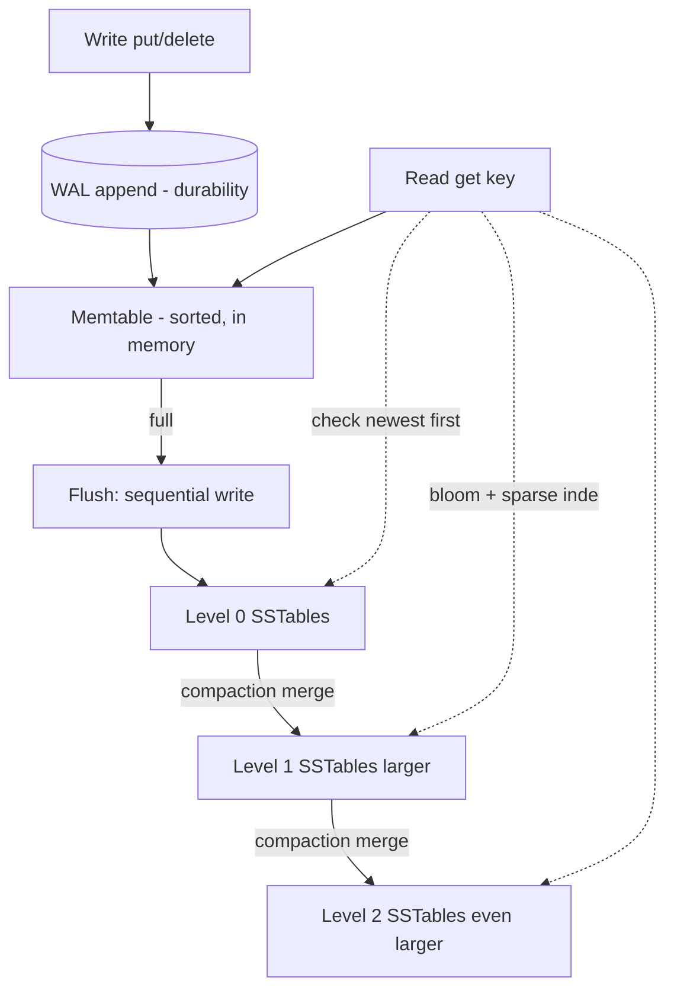
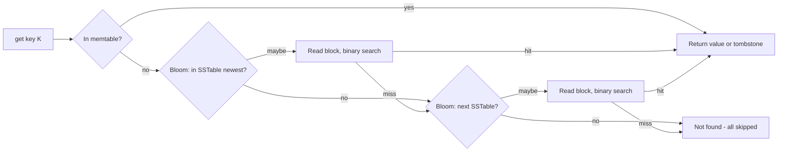

# LSM-Tree (Log-Structured Merge Tree) — Junior Level

> **Read time: ~45 minutes** · **Audience:** Engineers who know basic data structures (arrays, sorted lists, hash maps) and want to understand the storage engine behind RocksDB, Cassandra, LevelDB, HBase, and ScyllaDB — the write-optimized cousin of the B-tree.

A **Log-Structured Merge tree** (LSM-tree) is the data structure that powers most modern write-heavy databases. Whenever you write to Cassandra, ScyllaDB, HBase, a RocksDB-backed service, an embedded LevelDB store, or a time-series database like InfluxDB, your write lands in an LSM-tree. Its central trick is the opposite of the B-tree's: instead of updating data *in place* on disk — which forces a slow random write per change — the LSM-tree **buffers writes in memory, then flushes them to disk in big sequential batches**, and cleans up later in the background. This turns thousands of tiny random writes into a handful of large sequential ones, and sequential I/O is 100–1000× faster than random I/O on both spinning disks and SSDs.

This document teaches you the classic LSM-tree as introduced by Patrick O'Neil and colleagues in 1996 and refined by Google's LevelDB/Bigtable: the in-memory **memtable**, the immutable on-disk **SSTables**, the **flush** that moves one to the other, **compaction** that merges them, and the **read path** that stitches them back together. By the end you can implement a tiny LSM-tree from memory and explain why your database picks it over a B-tree for an ingest-heavy workload.

---

## Table of Contents

1. [Introduction — Why In-Place Updates Are Slow](#introduction)
2. [History — From O'Neil 1996 to RocksDB](#history)
3. [Prerequisites](#prerequisites)
4. [Glossary](#glossary)
5. [Core Concepts — Memtable, SSTable, Flush, Compaction](#core-concepts)
6. [The Write Path](#write-path)
7. [The Read Path](#read-path)
8. [Big-O Summary](#big-o)
9. [Real-World Analogies](#analogies)
10. [Pros and Cons vs B-Tree](#pros-cons)
11. [Step-by-Step Walkthrough — A Tiny LSM-Tree](#walkthrough)
12. [Code Examples — Go, Java, Python](#code-examples)
13. [Coding Patterns — Newest-First Merge](#patterns)
14. [Error Handling](#errors)
15. [Performance Tips](#performance-tips)
16. [Best Practices](#best-practices)
17. [Edge Cases](#edge-cases)
18. [Common Mistakes](#common-mistakes)
19. [Cheat Sheet](#cheat-sheet)
20. [Visual Animation Reference](#animation)
21. [Summary](#summary)
22. [Further Reading](#further-reading)

---

<a name="introduction"></a>
## 1. Introduction — Why In-Place Updates Are Slow

Suppose you are building a key-value store and you need to handle a flood of writes: a sensor network pushing millions of readings per second, a logging pipeline, a social feed, a write-ahead event stream. You reach for the obvious tool, a **B-tree** (see `09-trees/11-b-tree/`), because that is what every relational database uses. You quickly hit a wall.

A B-tree stores keys in sorted order on disk and updates them **in place**. When you write key `K`, the engine must:

1. Find the leaf page that owns `K` (a few disk reads — usually cached, so cheap).
2. Modify that page in memory.
3. Write the page **back to its exact location on disk** — a **random write**.

The problem is step 3. Each unrelated write touches a *different* leaf page in a *different* place on disk. A million writes to a million scattered keys means a million random disk writes. On a spinning disk, a random write costs ~10 ms; on an SSD it costs ~100 µs *and* slowly wears out the flash through write amplification. Random I/O is the enemy of write throughput.

The LSM-tree flips the model. Instead of "find the right place and overwrite it," it says: **"Don't overwrite anything. Append. Sort later. Merge in the background."** Concretely:

- New writes go into a small **in-memory sorted structure** (the memtable) — no disk I/O at all on the hot path, just an append to a sequential log for crash safety.
- When the memtable fills up, it is **flushed** to disk as one big **sorted file** written sequentially front to back — one fast sequential write, not a million random ones.
- Old values are not deleted immediately. They pile up across many sorted files and are cleaned up later by a background **compaction** process that merges files and discards superseded data.

Here is the cost difference that drives the whole design:

| Medium | Sequential write | Random write | Ratio |
|---|---|---|---|
| HDD (7200 RPM) | ~150 MB/s | ~0.7 MB/s (random 4 KB) | ~200× |
| SATA SSD | ~500 MB/s | ~40 MB/s (random 4 KB) | ~12× |
| NVMe SSD | ~3000 MB/s | ~300 MB/s (random 4 KB) | ~10× |

By converting random writes into sequential ones, the LSM-tree achieves write throughput that a B-tree simply cannot match. The price you pay is on the **read** side and in **background work** (compaction), which we will examine carefully. That trade — give up some read and space efficiency to win write efficiency — is the heart of the LSM-tree, and it is why write-heavy systems choose it.

---

<a name="history"></a>
## 2. History — From O'Neil 1996 to RocksDB

The LSM-tree was introduced in the 1996 paper **"The Log-Structured Merge-Tree (LSM-Tree)"** by **Patrick O'Neil, Edward Cheng, Dieter Gawlick, and Elizabeth O'Neil** (Acta Informatica 33). Their motivation was history-table workloads (like transaction logs) with extremely high insert rates, where a B-tree's random I/O cost dominated. Their original design used multiple "components" — an in-memory `C0` tree and one or more on-disk `C1`, `C2`, ... trees — and a "rolling merge" that pushed data from each component to the next.

The ideas trace back further to **log-structured filesystems** (Rosenblum & Ousterhout, 1991), which first argued that writing everything as an append-only log and cleaning up later beats in-place updates for write-heavy loads.

The design became dominant when **Google** built **Bigtable** (2006) on a memtable + SSTable architecture, and then open-sourced the single-node engine as **LevelDB** (2011), written by Jeff Dean and Sanjay Ghemawat. LevelDB introduced **leveled compaction** — organizing SSTables into size-tiered levels with non-overlapping key ranges per level — which bounds read cost much better than the original design.

**Facebook** forked LevelDB into **RocksDB** (2012), hardening it for server workloads (multi-threaded compaction, column families, tunable compaction, rate limiting, prefix bloom filters). RocksDB is now embedded in CockroachDB, TiKV, Kafka Streams, Flink, MySQL (MyRocks), and countless internal services.

Meanwhile **Apache Cassandra** (2008) and later **ScyllaDB** (a C++ rewrite) adopted the memtable + SSTable + compaction model at distributed scale, and **HBase** brought it to the Hadoop ecosystem. Today, the LSM-tree is the default storage engine for write-optimized and NoSQL databases, while the B-tree remains the default for read-optimized relational systems.

---

<a name="prerequisites"></a>
## 3. Prerequisites

Before reading further, you should be comfortable with:

1. **Sorted arrays and binary search** (`08-search-algorithms/02-binary-search/`). SSTables are sorted; we binary-search inside them.
2. **Hash maps / dictionaries.** The memtable is a sorted map; you should know the difference between a hash map (unordered) and a sorted map (ordered).
3. **The disk-I/O cost model.** As with B-trees, the cost that matters is the number of *pages read/written* and especially **random vs sequential** I/O, not raw CPU comparisons.
4. **Merge of sorted lists** (the merge step of merge sort, `12-sorting/`). Compaction is a k-way merge of sorted SSTables.
5. **Helpful but not required:** skip lists (`03-skip-list/`) — the usual memtable implementation — and bloom filters (`02-bloom-filter/`) — used to skip SSTables on reads. We introduce both at a basic level here.

---

<a name="glossary"></a>
## 4. Glossary

| Term | Definition |
|---|---|
| **Memtable** | An in-memory sorted structure (usually a skip list or balanced tree) that buffers recent writes. |
| **SSTable (Sorted String Table)** | An immutable on-disk file holding key-value pairs sorted by key. Once written, never modified. |
| **Flush** | The operation that converts a full memtable into a new on-disk SSTable, written sequentially. |
| **WAL (Write-Ahead Log)** | An append-only log written *before* the memtable is updated, so a crash cannot lose acknowledged writes. |
| **Compaction** | A background process that merges several SSTables into fewer/larger ones, dropping superseded values and deletes. |
| **Tombstone** | A special marker recording that a key was *deleted*. Deletes do not remove data immediately; they add a tombstone that wins over older values. |
| **Bloom filter** | A compact probabilistic set used to answer "is key `K` possibly in this SSTable?" — lets reads skip SSTables that definitely don't contain `K`. |
| **Sparse index** | A small in-memory index storing the key + file offset of every Nth entry (e.g. one per disk block), so a lookup binary-searches the index then scans one block. |
| **Level** | A tier of the on-disk structure. Level 0 holds freshly flushed SSTables; deeper levels hold larger, merged SSTables. |
| **Write amplification** | Bytes written to disk ÷ bytes written by the user. Compaction rewrites data multiple times, so this is > 1. |
| **Read amplification** | Disk reads per logical read. A key may be searched for across many SSTables. |
| **Space amplification** | Bytes stored on disk ÷ bytes of live data. Obsolete versions and tombstones inflate this. |

---

<a name="core-concepts"></a>
## 5. Core Concepts — Memtable, SSTable, Flush, Compaction

An LSM-tree has exactly four moving parts. Understand these four and you understand the structure.

### 5.1 The memtable (in memory)

All writes — puts and deletes — first go into the **memtable**, a sorted in-memory map. "Sorted" matters: when we later flush it, we want the output file already in key order so it becomes a valid SSTable for free, and so future merges are cheap. In production the memtable is almost always a **skip list** (see `03-skip-list/`) because skip lists support fast ordered inserts and concurrent reads without rebalancing. For learning, an ordinary balanced sorted map (`TreeMap`, Python `sortedcontainers`, or even a dict you sort on flush) works fine.

A delete does *not* remove a key from the memtable. It inserts a **tombstone** — a marker that says "this key is deleted as of now." We will see why in §7.

### 5.2 The SSTable (on disk, immutable)

When the memtable reaches a size threshold (say 64 MB in RocksDB), it is frozen and written to disk as an **SSTable**: a single file containing every key-value pair in sorted order, written **sequentially**. Because it is sorted, we can binary-search it; because it is immutable, we never have to worry about concurrent modification, and we can safely cache it, checksum it, and share it across readers.

Each SSTable typically carries two companions:
- A **sparse index** (key → file offset for every Nth key), so a lookup finds the right disk block fast.
- A **bloom filter** over all its keys, so a lookup that will *miss* can skip the file entirely without any disk read.

### 5.3 The flush (memtable → SSTable)

The **flush** is the one-way trip from memory to disk. The current memtable is made immutable and a fresh empty memtable takes over incoming writes (so the system never blocks). The frozen memtable is streamed to a new SSTable at the newest/top level, and once it is durably on disk, the WAL entries it covers can be discarded. Flush is a **sequential write** — the whole reason the LSM-tree is write-fast.

### 5.4 Compaction (merge SSTables)

Over time, flushes pile up many SSTables. Each holds a *snapshot* of writes from one time window, so the same key can appear in several SSTables with different values (newest wins). Reads get slower the more SSTables exist, and obsolete values waste space. **Compaction** fixes both: it reads several SSTables, **merges** them by key (a k-way merge), keeps only the newest value for each key, drops tombstoned keys once they can't shadow anything older, and writes the result as new, larger SSTables — then deletes the inputs. Compaction is the LSM-tree's housekeeping, and tuning it is the central operational skill (covered in `senior.md`).



---

<a name="write-path"></a>
## 6. The Write Path

A single `put(key, value)` does this:

1. **Append to the WAL.** Write `(key, value)` to the end of the write-ahead log file and `fsync` (or batch-`fsync`). This is sequential and cheap, and it is what makes the write **durable**: if the process crashes a microsecond later, recovery replays the WAL to rebuild the memtable.
2. **Insert into the memtable.** Update the in-memory sorted map. No disk seek.
3. **Acknowledge the write.** Done. The user sees a fast write.

A `delete(key)` is identical except step 2 inserts a **tombstone** instead of a value.

When the memtable crosses its size threshold:

4. **Freeze and flush.** The full memtable becomes immutable; a new empty memtable accepts further writes. A background thread streams the frozen memtable to a new SSTable.
5. **Discard WAL segment.** Once the SSTable is durably written, the WAL entries it covers are no longer needed and can be truncated.

The key property: **the only synchronous disk I/O on the write path is the sequential WAL append.** Everything else — the flush, the compaction — happens in the background, off the critical path. This is why LSM-trees ingest so fast.

---

<a name="read-path"></a>
## 7. The Read Path

A `get(key)` must find the **newest** value for `key`, which could live in the memtable or in any SSTable. The rule is **newest first**: check the most recently written source first and stop at the first hit.

1. **Check the active memtable.** If `key` is there (value or tombstone), return it. If it's a tombstone, return "not found."
2. **Check any immutable (frozen, not-yet-flushed) memtables**, newest to oldest.
3. **Check SSTables, newest to oldest.** For each SSTable, from the most recent:
   - Ask its **bloom filter**: "could `key` be here?" If the bloom filter says *no*, skip this SSTable entirely — **zero disk reads**. (A bloom filter never produces a false negative, so a "no" is always safe.)
   - If the bloom filter says *maybe*, use the **sparse index** to find the right disk block, read that one block, and binary-search it. If found, return the value (or tombstone → "not found").
4. If no source has the key, return "not found."

The crucial insight: because a key can be in many SSTables, a *miss* could in principle touch every SSTable — that is **read amplification**. Bloom filters cut it down dramatically (a miss usually skips almost every SSTable), and **leveled compaction** bounds the number of SSTables that must be checked per level to one (since within a level key ranges don't overlap). Reads of an LSM-tree are inherently more expensive than reads of a B-tree, but bloom filters + sparse indexes + good compaction keep them fast.



**Why deletes are tombstones, not removals:** an older SSTable may still hold the old value of a key. If a delete simply removed the key from the memtable, the read path would fall through to the old SSTable and resurrect the deleted value. The tombstone, being *newer*, shadows the old value during reads and is only physically dropped during compaction once no older SSTable can hold that key.

---

<a name="big-o"></a>
## 8. Big-O Summary

Let `n` = number of live keys, `L` = number of levels, `T` = the size ratio (fanout) between adjacent levels (e.g. 10).

| Operation | Cost | Notes |
|---|---|---|
| **Write (put/delete)** | O(1) amortized memtable insert + O(1) WAL append | The fast path. Real cost is the background write amplification (~`L·T` over the data's lifetime). |
| **Point read (leveled)** | O(L) SSTable lookups in the worst case, ≈ O(1) typical with bloom filters | One SSTable per level may be probed; bloom filters skip most. |
| **Point read (size-tiered)** | O(number of SSTables) worst case | More SSTables to check → higher read amplification. |
| **Range scan [lo,hi]** | O(L + k) merge across levels for k results | Must merge-iterate all levels; no bloom-filter shortcut. |
| **Flush** | O(memtable size), sequential | One big sequential write. |
| **Compaction (one merge)** | O(total bytes merged), sequential | Background; the source of write amplification. |
| **Space** | O(live data × space-amplification factor) | Obsolete versions + tombstones inflate it until compacted. |

Leveled LSM-trees give **O(L) ≈ O(log_T n) reads** (one probe per level, `L ≈ log_T n`) and **write amplification ≈ L·T**. We derive these in `professional.md`.

---

<a name="analogies"></a>
## 9. Real-World Analogies

### 9.1 The desk inbox tray

You don't file every incoming paper into the right folder in the cabinet the moment it arrives — that's slow (walk to the cabinet, find the folder, insert). Instead you drop papers into an **inbox tray** on your desk (the memtable). When the tray is full, you sort the whole stack once and move it to the cabinet as a labeled batch (the flush → SSTable). Periodically you consolidate folders, throwing out superseded drafts (compaction). To *find* a paper you check the inbox first (newest), then the most recent batches.

### 9.2 Newspaper editions

A newspaper prints a new **edition** every day; it never edits yesterday's printed copies (SSTables are immutable). To find the latest stock price you read today's paper first, then yesterday's, etc. A correction in today's edition overrides yesterday's wrong number (newest wins). Periodically the archive is consolidated into bound volumes, dropping duplicate stories (compaction).

### 9.3 Git commits

Git never rewrites old commits; each change is a new immutable snapshot layered on top (like SSTables). To find the current state of a file you read the newest commit that touched it. `git gc` packs and prunes unreachable objects — the moral equivalent of compaction.

### 9.4 Restaurant order tickets

Orders are jotted on tickets and spiked in arrival order (the WAL). The kitchen works from an in-memory board of active orders (the memtable). A "cancel table 4" note is a **tombstone** — the original ticket isn't erased; the cancel just overrides it. At closing the tickets are reconciled and the day's stale ones discarded (compaction).

> Where the analogies break down: real LSM-trees keep the *sorted* property at every layer and rely on bloom filters and sparse indexes for fast lookup — your inbox tray isn't sorted and has no bloom filter.

---

<a name="pros-cons"></a>
## 10. Pros and Cons vs B-Tree

The LSM-tree and the B-tree are the two great storage-engine families, and they sit on opposite ends of a trade-off. Here is the head-to-head:

| Attribute | LSM-Tree | B-Tree |
|---|---|---|
| **Update strategy** | Out-of-place (append + merge) | In-place |
| **Write pattern** | Sequential (fast) | Random (slow) |
| **Write throughput** | Very high | Moderate |
| **Point read** | Slower — may probe several SSTables | Fast — one root-to-leaf path |
| **Range scan** | Good, but must merge across levels | Excellent — leaves are linked/contiguous |
| **Write amplification** | Higher (compaction rewrites data) | Lower (~ once per page modification) |
| **Read amplification** | Higher (multiple SSTables) | Lower (single tree walk) |
| **Space amplification** | Higher (old versions + tombstones until compacted) | Lower (in-place, ~fragmentation only) |
| **Background work** | Compaction (CPU + I/O spikes) | Minimal (occasional page splits) |
| **Best for** | Write-heavy, ingest, time-series, logs | Read-heavy, OLTP, range-scan-heavy |
| **Used by** | RocksDB, LevelDB, Cassandra, HBase, ScyllaDB | PostgreSQL, MySQL (InnoDB), Oracle, SQLite |

### LSM-tree pros
- **Outstanding write throughput** via sequential I/O — the headline benefit.
- **Compression-friendly:** immutable sorted blocks compress well and are written once.
- **No in-place fragmentation:** files are written whole, then deleted whole.
- **Crash-safe by construction:** the WAL + immutable files make recovery a replay.

### LSM-tree cons
- **Read amplification:** a key may live in many SSTables; mitigated by bloom filters and leveled compaction but never zero.
- **Write amplification from compaction:** the same byte gets rewritten several times as it sinks through levels.
- **Space amplification:** obsolete versions and tombstones occupy disk until compaction removes them.
- **Compaction is operationally tricky:** it competes with foreground traffic for CPU, disk bandwidth, and cache; needs rate limiting and tuning (see `senior.md`).

**When to use an LSM-tree:** write-heavy and ingest-heavy workloads — event logs, metrics/time-series, message queues, write-amplification-sensitive SSD deployments, large NoSQL key-value stores.
**When NOT to use it:** read-latency-critical OLTP where a B-tree's single-tree-walk read wins, or workloads dominated by random point reads of *missing* keys without good bloom filters.

---

<a name="walkthrough"></a>
## 11. Step-by-Step Walkthrough — A Tiny LSM-Tree

Let us run a tiny LSM-tree where the memtable flushes after **3 entries**. We'll process this sequence of operations:

```
put(b, 1), put(d, 2), put(a, 3),   -- memtable now has 3 → flush
put(c, 4), del(b),    put(d, 5),   -- memtable now has 3 → flush
get(b), get(d), get(a)
```

### Step 1 — `put(b,1), put(d,2), put(a,3)`

Each write appends to the WAL and inserts into the memtable (kept sorted):

```
WAL:      [b=1, d=2, a=3]
Memtable: {a:3, b:1, d:2}        ← 3 entries = threshold → FLUSH
```

### Step 2 — Flush memtable to SSTable-0

The memtable is frozen and streamed to disk, in sorted order, as the newest SSTable. The memtable empties; the covered WAL is truncated.

```
SSTable-0 (newest): [a=3, b=1, d=2]
Memtable:           {}
```

### Step 3 — `put(c,4), del(b), put(d,5)`

`del(b)` inserts a **tombstone** for `b`. Note `b` still lives as `b=1` in SSTable-0 — the tombstone will shadow it.

```
Memtable: {b:TOMBSTONE, c:4, d:5}    ← 3 entries → FLUSH
```

### Step 4 — Flush memtable to SSTable-1

```
SSTable-1 (newest): [b=TOMBSTONE, c=4, d=5]
SSTable-0 (older):  [a=3, b=1, d=2]
Memtable:           {}
```

### Step 5 — `get(b)` → newest first

- Memtable: empty, miss.
- SSTable-1 (newest): bloom says "maybe", read block → found **TOMBSTONE** → return **not found**. Stop. We never even look at SSTable-0's `b=1`. The tombstone did its job.

### Step 6 — `get(d)`

- Memtable: miss.
- SSTable-1 (newest): found `d=5` → return **5**. Stop. (SSTable-0's stale `d=2` is correctly ignored — newest wins.)

### Step 7 — `get(a)`

- Memtable: miss.
- SSTable-1: bloom says "no" (a isn't here) → skip, zero disk reads.
- SSTable-0: bloom says "maybe", read block → found `a=3` → return **3**.

### Step 8 — What compaction would do

If we now compacted SSTable-0 and SSTable-1 into one, the merge would:
- Keep `a=3` (only version).
- Drop `b=1` and the `b` tombstone (the tombstone shadowed the only older copy and, if this is the bottom level, nothing older exists, so it can be dropped entirely).
- Keep `c=4`.
- Keep `d=5` (newest), drop `d=2`.

```
Compacted SSTable: [a=3, c=4, d=5]     ← smaller, no obsolete data, no tombstone
```

This is the whole life cycle: buffer → flush → merge. Reads always honor "newest wins"; compaction reclaims the space.

---

<a name="code-examples"></a>
## 12. Code Examples — Go, Java, Python

Below is a minimal-but-faithful LSM-tree: a sorted memtable, immutable sorted SSTables (as in-memory sorted slices for clarity), tombstones, flush, newest-first get, and a merge-compaction. Real engines persist SSTables to files with bloom filters and sparse indexes; we keep them in memory so the algorithm is visible.

### 12.1 Go

```go
package lsm

import "sort"

// tombstone marks a deleted key.
const tombstone = "<<TOMBSTONE>>"

type entry struct {
	key, val string
}

// SSTable is an immutable, sorted slice of entries (newest tables come first in the slice).
type SSTable []entry

func (t SSTable) get(key string) (string, bool) {
	// binary search the sorted table
	i := sort.Search(len(t), func(i int) bool { return t[i].key >= key })
	if i < len(t) && t[i].key == key {
		return t[i].val, true
	}
	return "", false
}

type LSM struct {
	memtable map[string]string // key -> val (val may be tombstone)
	flushAt  int
	ssts     []SSTable // index 0 = newest
}

func New(flushAt int) *LSM {
	return &LSM{memtable: map[string]string{}, flushAt: flushAt}
}

func (l *LSM) Put(key, val string) {
	// (a real engine appends to the WAL here first)
	l.memtable[key] = val
	if len(l.memtable) >= l.flushAt {
		l.flush()
	}
}

func (l *LSM) Delete(key string) { l.Put(key, tombstone) }

func (l *LSM) flush() {
	es := make([]entry, 0, len(l.memtable))
	for k, v := range l.memtable {
		es = append(es, entry{k, v})
	}
	sort.Slice(es, func(i, j int) bool { return es[i].key < es[j].key })
	// prepend so newest SSTable is checked first
	l.ssts = append([]SSTable{SSTable(es)}, l.ssts...)
	l.memtable = map[string]string{}
}

// Get returns the newest value, honoring newest-first and tombstones.
func (l *LSM) Get(key string) (string, bool) {
	if v, ok := l.memtable[key]; ok {
		if v == tombstone {
			return "", false
		}
		return v, true
	}
	for _, t := range l.ssts { // newest first
		if v, ok := t.get(key); ok {
			if v == tombstone {
				return "", false
			}
			return v, true
		}
	}
	return "", false
}

// Compact merges all SSTables into one, keeping newest values, dropping tombstones.
func (l *LSM) Compact() {
	merged := map[string]string{}
	// iterate oldest -> newest so newer overwrites older
	for i := len(l.ssts) - 1; i >= 0; i-- {
		for _, e := range l.ssts[i] {
			merged[e.key] = e.val
		}
	}
	es := make([]entry, 0, len(merged))
	for k, v := range merged {
		if v == tombstone {
			continue // drop tombstones at the bottom level
		}
		es = append(es, entry{k, v})
	}
	sort.Slice(es, func(i, j int) bool { return es[i].key < es[j].key })
	l.ssts = []SSTable{SSTable(es)}
}
```

### 12.2 Java

```java
import java.util.*;

public final class LSM {
    static final String TOMBSTONE = "<<TOMBSTONE>>";

    private TreeMap<String, String> memtable = new TreeMap<>();
    private final int flushAt;
    // index 0 = newest SSTable; each SSTable is a sorted key->value map
    private final List<TreeMap<String, String>> ssts = new ArrayList<>();

    public LSM(int flushAt) { this.flushAt = flushAt; }

    public void put(String key, String val) {
        // (a real engine appends to the WAL here first)
        memtable.put(key, val);
        if (memtable.size() >= flushAt) flush();
    }

    public void delete(String key) { put(key, TOMBSTONE); }

    private void flush() {
        ssts.add(0, new TreeMap<>(memtable)); // newest at front
        memtable = new TreeMap<>();
    }

    /** Newest-first get, honoring tombstones. */
    public Optional<String> get(String key) {
        if (memtable.containsKey(key)) return resolve(memtable.get(key));
        for (TreeMap<String, String> t : ssts) {       // newest first
            if (t.containsKey(key)) return resolve(t.get(key));
        }
        return Optional.empty();
    }

    private Optional<String> resolve(String v) {
        return TOMBSTONE.equals(v) ? Optional.empty() : Optional.of(v);
    }

    /** Merge all SSTables, newest wins, drop tombstones. */
    public void compact() {
        TreeMap<String, String> merged = new TreeMap<>();
        for (int i = ssts.size() - 1; i >= 0; i--) merged.putAll(ssts.get(i)); // old->new
        merged.values().removeIf(TOMBSTONE::equals);
        ssts.clear();
        ssts.add(merged);
    }
}
```

### 12.3 Python

```python
import bisect

TOMBSTONE = "<<TOMBSTONE>>"

class SSTable:
    """Immutable, sorted list of (key, value) pairs."""
    def __init__(self, items):
        self.keys = [k for k, _ in items]
        self.vals = [v for _, v in items]

    def get(self, key):
        i = bisect.bisect_left(self.keys, key)
        if i < len(self.keys) and self.keys[i] == key:
            return True, self.vals[i]
        return False, None

class LSM:
    def __init__(self, flush_at):
        self.memtable = {}          # key -> value (value may be TOMBSTONE)
        self.flush_at = flush_at
        self.ssts = []              # index 0 = newest

    def put(self, key, val):
        # (a real engine appends to the WAL here first)
        self.memtable[key] = val
        if len(self.memtable) >= self.flush_at:
            self._flush()

    def delete(self, key):
        self.put(key, TOMBSTONE)

    def _flush(self):
        items = sorted(self.memtable.items())
        self.ssts.insert(0, SSTable(items))   # newest at front
        self.memtable = {}

    def get(self, key):
        if key in self.memtable:
            v = self.memtable[key]
            return None if v == TOMBSTONE else v
        for t in self.ssts:                   # newest first
            found, v = t.get(key)
            if found:
                return None if v == TOMBSTONE else v
        return None

    def compact(self):
        merged = {}
        for t in reversed(self.ssts):         # old -> new so newest wins
            for k, v in zip(t.keys, t.vals):
                merged[k] = v
        live = sorted((k, v) for k, v in merged.items() if v != TOMBSTONE)
        self.ssts = [SSTable(live)]

if __name__ == "__main__":
    db = LSM(flush_at=3)
    for k, v in [("b","1"), ("d","2"), ("a","3")]:
        db.put(k, v)
    db.put("c", "4"); db.delete("b"); db.put("d", "5")
    print(db.get("b"))   # None  (tombstone shadows old b=1)
    print(db.get("d"))   # 5     (newest wins over d=2)
    print(db.get("a"))   # 3
    db.compact()
    print(db.get("a"), db.get("c"), db.get("d"), db.get("b"))  # 3 4 5 None
```

**What it does:** builds the tiny LSM-tree from §11, flushes twice, and demonstrates newest-first reads, tombstones, and compaction.
**Run:** `go test ./...` (wrap in a test) | `javac LSM.java && java LSM` | `python lsm.py`

---

<a name="patterns"></a>
## 13. Coding Patterns — Newest-First Merge

The single most important pattern in any LSM-tree code is **newest-first resolution**. Whenever the same key can exist in multiple sources, you must consult them in newest-to-oldest order and stop at the first hit — *including* when that first hit is a tombstone (which means "deleted, stop, return not-found").

```text
GET(key):
    for source in [memtable, immutable_memtables..., sstables newest..oldest]:
        result = source.lookup(key)
        if result is TOMBSTONE: return NOT_FOUND   # stop — do not fall through
        if result is a value:   return result      # stop — newest wins
    return NOT_FOUND
```

The mirror pattern is the **k-way merge** used by compaction and by range scans. Open an iterator on each source, repeatedly emit the smallest key across all iterators, and when several iterators sit on the *same* key, keep only the entry from the newest source and advance all of them past that key:

```text
MERGE(sources newest..oldest):
    heap = min-heap of (current_key, source_rank, iterator)   # rank: 0 = newest
    while heap not empty:
        key = peek smallest key in heap
        winner = the entry for `key` with the smallest source_rank (newest)
        advance every iterator currently on `key`
        if winner is not a tombstone (or we are above the bottom level):
            emit winner
```

This range/compaction merge is exactly the merge step of merge sort generalized to *k* sorted inputs with a "newest wins on ties" rule. Getting these two patterns right — point-get newest-first, and k-way merge with newest-wins-on-ties — is 80% of an LSM-tree implementation.

---

<a name="errors"></a>
## 14. Error Handling

| Error | Cause | Mitigation |
|---|---|---|
| Lost write after crash | Acknowledged a write before the WAL was durably `fsync`ed | Append to WAL and `fsync` (or group-commit) *before* ack. |
| Deleted key reappears | Delete removed the key instead of writing a tombstone | Always insert a tombstone; only physical-delete during compaction. |
| Stale value returned | Read consulted an old SSTable before a newer one | Strictly enforce newest-first ordering; new SSTables go to the front. |
| Reads slow to a crawl | Too many un-compacted SSTables (read amplification) | Trigger compaction; add/size bloom filters; check compaction isn't stalled. |
| Disk fills up | Compaction can't keep up; obsolete versions pile up (space amplification) | Rate-limit writes, add compaction threads, monitor space-amp. |
| Corrupt SSTable read | Bit rot / torn write | Store per-block CRC checksums; verify on read; recover from replica/WAL. |
| Tombstone never dropped | Tombstone garbage-collected too early resurrects data on lower levels | Only drop a tombstone once compaction reaches the bottom level (no older data possible). |

---

<a name="performance-tips"></a>
## 15. Performance Tips

1. **Size the memtable to amortize flushes.** Bigger memtable → fewer, larger flushes → less write amplification, but more memory and longer crash-recovery replay. RocksDB defaults to 64 MB.
2. **Always put a bloom filter on each SSTable.** A ~10-bits-per-key bloom filter (~1% false positive) turns most missing-key reads from O(levels) disk reads into ~zero. This is the single biggest read-path win.
3. **Use a sparse index, not a dense one.** One index entry per disk block (e.g. per 4 KB) keeps the index small enough to stay in RAM; you binary-search the index, then scan one block.
4. **Choose the compaction strategy to match the workload.** Leveled compaction → low read/space amplification, higher write amplification (good for read-heavy). Size-tiered → low write amplification, higher read/space amplification (good for write-heavy). Details in `middle.md`.
5. **Compress SSTable blocks.** They're immutable and sorted, so block compression (LZ4, Zstd) is cheap and effective; sorted keys share prefixes.
6. **Keep the memtable a skip list** (`03-skip-list/`) for concurrent ordered inserts without locking the whole structure.
7. **Batch the WAL fsync (group commit)** to trade a little latency for much higher write throughput.

---

<a name="best-practices"></a>
## 16. Best Practices

- **Treat SSTables as strictly immutable.** Never mutate one in place. All change happens by writing a *new* SSTable and deleting the old. This is what makes concurrency, caching, and checksums trivial.
- **Make deletes tombstones, always.** And document that a delete is a *write*, not a free space reclaim — space comes back only at compaction.
- **Write the WAL before the memtable, fsync before ack.** Durability is a property of *ordering*; get it wrong and you silently lose acknowledged data.
- **Encapsulate "newest-first" in one place.** A single `lookup(key)` that walks sources in order prevents the classic "stale read" bug from leaking across the codebase.
- **Add an invariant checker for tests:** every SSTable is sorted; newer SSTables are searched first; a tombstone shadows all older versions; after compaction no obsolete versions remain.
- **Test against a `dict`/`map` oracle.** Apply the same put/delete stream to a plain map and to your LSM-tree; every `get` must agree.
- **For learning, flush at tiny thresholds (3–5 entries)** so flushes and compactions are visible and easy to reason about.

---

<a name="edge-cases"></a>
## 17. Edge Cases

| Case | Behavior |
|---|---|
| `get` on never-written key | Bloom filters skip all SSTables; return "not found" with ~zero disk reads. |
| Delete a key that doesn't exist | Still writes a tombstone (harmless); compaction later drops it. |
| Overwrite same key many times | Many versions across SSTables; newest wins on read; compaction collapses to one. |
| Memtable exactly at threshold | Flush triggers; new empty memtable accepts the next write without blocking. |
| Crash between WAL append and ack | On restart, WAL replay rebuilds the memtable; the write is durable (it was logged). |
| Crash during flush | The half-written SSTable is discarded (not yet registered); WAL still has the data → replay. |
| Tombstone at the bottom level | Can be physically dropped — nothing older exists to resurrect. |
| Tombstone above the bottom level | Must be kept until compaction merges it down past all older copies. |
| Empty memtable flush | No-op (skip writing an empty SSTable). |
| Range scan with deletes | The merge must emit tombstones internally to suppress older values, then filter them from the output. |

---

<a name="common-mistakes"></a>
## 18. Common Mistakes

1. **Removing keys on delete instead of tombstoning.** The single most common bug: an old SSTable resurrects the "deleted" value on the next read.
2. **Searching SSTables oldest-first.** Returns stale values. Newest must always win.
3. **Forgetting to flush before the WAL is reused.** Truncating WAL segments that the memtable hasn't durably flushed loses data on crash.
4. **Dropping a tombstone too early.** If a tombstone is removed while an older SSTable still holds the key, the key comes back to life. Only the bottom level may drop tombstones.
5. **No bloom filter → every miss reads every SSTable.** Read amplification explodes on workloads that query absent keys.
6. **Letting compaction fall arbitrarily behind.** SSTables pile up (read amp) and obsolete data accumulates (space amp), eventually exhausting disk. Compaction must keep pace with ingest.
7. **Acking the write before the `fsync`.** Trades durability for speed silently — a crash loses "successful" writes.
8. **Mutating an SSTable in place.** Breaks immutability assumptions used by concurrent readers and caching.
9. **Using a dense index that doesn't fit in RAM.** Defeats the point; use a *sparse* index (one entry per block).

---

<a name="cheat-sheet"></a>
## 19. Cheat Sheet

```
FOUR PARTS
    Memtable   in-memory sorted map (skip list); absorbs writes
    SSTable    immutable, sorted on-disk file; never modified
    WAL        append-only log; durability before memtable update
    Compaction background merge of SSTables; reclaims space, bounds reads

WRITE PATH (put / delete)
    1. append (key, value-or-tombstone) to WAL, fsync
    2. insert into memtable
    3. ack
    when memtable full -> freeze, flush to a new newest SSTable, truncate WAL

READ PATH (get)  --  NEWEST FIRST, stop at first hit (incl. tombstone)
    memtable -> immutable memtables -> SSTables newest..oldest
    per SSTable: bloom filter ("maybe?") -> sparse index -> read 1 block -> binary search
    tombstone  => return NOT FOUND   |   value => return value

DELETE = write a TOMBSTONE (not a removal). Physical removal happens at compaction.

COMPACTION = k-way merge of SSTables, newest wins on ties, drop tombstones at bottom level.

AMPLIFICATION (the three costs you trade)
    write amp  = bytes written to disk / bytes written by user      (~ levels * fanout)
    read amp   = disk reads per logical read                        (cut by bloom filters)
    space amp  = bytes on disk / bytes of live data                 (obsolete versions + tombstones)

LSM vs B-TREE
    LSM   = write-optimized, sequential I/O, out-of-place, higher read/space amp
    B-tree= read-optimized,  random I/O,    in-place,     lower amp, slower writes
```

---

<a name="animation"></a>
## 20. Visual Animation Reference

See `animation.html` in this folder. It shows the four parts of the LSM-tree live: writes fill a memtable (a row of sorted cells), a **flush** drops the full memtable down as a new SSTable at Level 0, **leveled compaction** merges overlapping SSTables into a larger one at the next level (newest values win, tombstones dropped), and a **read** walks newest-first, consulting each SSTable's bloom filter (green = "maybe, must read" / grey = "definitely absent, skipped") before touching disk. The info panel narrates each step; the Big-O table and operation log update live; controls let you put/delete/get, force a flush, force a compaction, and adjust the flush threshold.

Try the §11 sequence: `put(b,1) put(d,2) put(a,3)` (auto-flush), `put(c,4) del(b) put(d,5)` (auto-flush), then `get(b)` (tombstone → not found), `get(d)` (→ 5), `get(a)` (skips SSTable-1 via bloom, hits SSTable-0). Finally hit **Compact** and watch the two SSTables collapse into one with no obsolete data.

---

<a name="summary"></a>
## 21. Summary

- An **LSM-tree** is a write-optimized storage structure: buffer writes in an in-memory **memtable**, flush full memtables to immutable sorted **SSTables**, and **compact** them in the background.
- It wins on writes by converting random in-place updates into **sequential** appends and batched flushes — 10–200× cheaper I/O than a B-tree's random writes.
- The **WAL** provides durability (replayed on crash); **deletes are tombstones**, not removals; reads resolve **newest-first** and physical cleanup happens at compaction.
- The **read path** consults memtable → SSTables newest-first, accelerated by **bloom filters** (skip SSTables that can't contain the key) and **sparse indexes** (find the one block to read).
- The trade-off vs the B-tree is captured by three amplifications: LSM-trees accept higher **read** and **space** amplification (and background **write** amplification from compaction) to win **write throughput**.
- Used by **LevelDB, RocksDB, Cassandra, HBase, ScyllaDB** and most write-heavy NoSQL and time-series stores. The B-tree remains the read-optimized default for OLTP.

Next step: [middle.md](./middle.md) — why and when to choose an LSM-tree: size-tiered vs leveled compaction, sizing bloom filters and sparse indexes, the WAL and tombstone life cycle in depth, and a precise comparison with the B-tree (`09-trees/11-b-tree/`).

---

<a name="further-reading"></a>
## 22. Further Reading

- **O'Neil, P., Cheng, E., Gawlick, D., & O'Neil, E.** (1996). *The Log-Structured Merge-Tree (LSM-Tree).* Acta Informatica 33. The original paper.
- **Rosenblum, M., & Ousterhout, J.** (1991). *The Design and Implementation of a Log-Structured File System.* The intellectual ancestor.
- **Chang, F. et al.** (2006). *Bigtable: A Distributed Storage System for Structured Data.* Google — the memtable + SSTable design.
- **LevelDB / RocksDB documentation** — `github.com/google/leveldb`, `github.com/facebook/rocksdb/wiki`. The canonical engines; the wiki is a goldmine.
- **Petrov, A.** *Database Internals*, O'Reilly 2019, Chapters 6–7 ("LSM Trees", "Log-Structured Storage"). The best modern treatment.
- **Kleppmann, M.** *Designing Data-Intensive Applications*, Chapter 3 — the clearest high-level explanation of LSM vs B-tree.
- **Luo, C., & Carey, M.** (2020). *LSM-based Storage Techniques: A Survey.* VLDB Journal — comprehensive academic survey.
- Cross-links: `03-skip-list/` (memtable), `02-bloom-filter/` (read-path filter), `09-trees/11-b-tree/` (the read-optimized counterpart).
- Continue with `middle.md`.
