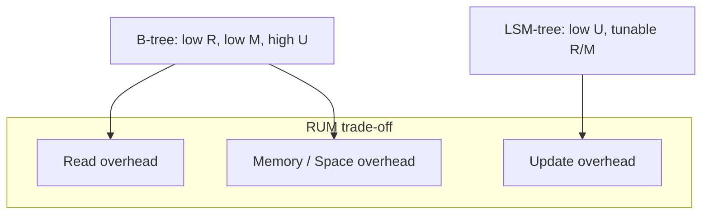
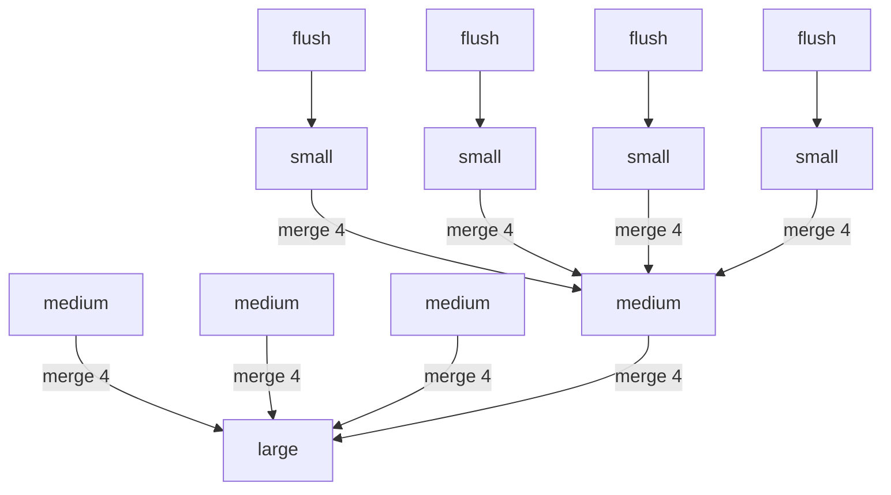
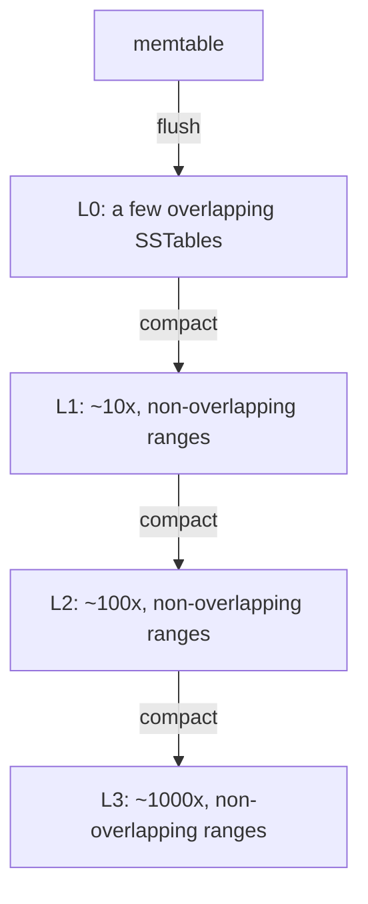
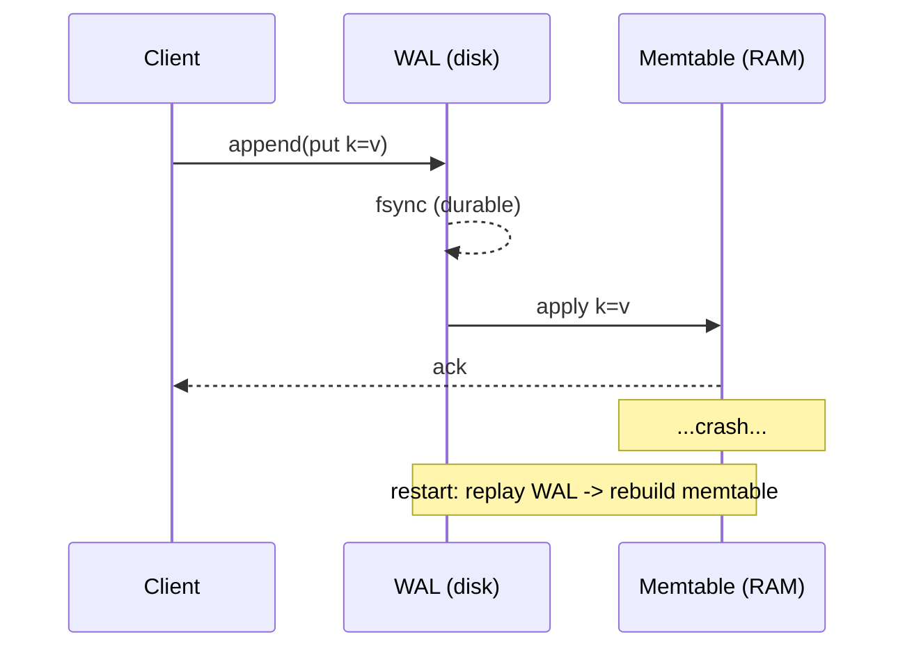

# LSM-Tree — Middle Level

> **Read time: ~50 minutes** · **Audience:** Engineers who have read `junior.md` and can implement a basic memtable + SSTable + flush + newest-first get. Here we answer *why* the pieces are shaped the way they are and *when* to choose each option.

At the junior level you learned the four parts of an LSM-tree and how a write and a read flow through them. At the middle level we go beneath the surface: the two great **compaction strategies** (size-tiered vs leveled) and how each one trades the three amplifications; how to **size a bloom filter** and a **sparse index** so reads stay fast without burning memory; the **WAL** mechanics that make writes durable and recoverable; the full **tombstone life cycle** and the grace-period subtlety that prevents resurrected data; and a precise, mechanism-by-mechanism **comparison with the B-tree** so you can defend a storage-engine choice in a design review.

---

## Table of Contents

1. [Introduction — The RUM Trade-off in One Picture](#introduction)
2. [Deeper Concepts — The Three Amplifications](#deeper-concepts)
3. [Compaction Strategies — Size-Tiered vs Leveled](#compaction)
4. [Bloom Filters on the Read Path](#bloom)
5. [Sparse Indexes and SSTable File Layout](#sparse-index)
6. [The Write-Ahead Log (WAL)](#wal)
7. [Tombstones and the Deletion Life Cycle](#tombstones)
8. [Comparison with the B-Tree](#comparison)
9. [Advanced Patterns](#patterns)
10. [Code Examples — Leveled Compaction](#code-examples)
11. [Error Handling](#errors)
12. [Performance Analysis](#performance)
13. [Best Practices](#best-practices)
14. [Visual Animation](#animation)
15. [Summary](#summary)

---

<a name="introduction"></a>
## 1. Introduction — The RUM Trade-off in One Picture

Every read-write storage structure is pinned somewhere on a three-way trade-off called the **RUM conjecture** (Athanassoulis et al., 2016): you can optimize at most two of **R**ead overhead, **U**pdate overhead, and **M**emory/space overhead — improving one of the three forces a cost on at least one of the others.



A B-tree sits in the "low read, low space, high update" corner — fast reads, compact storage, but expensive random updates. An LSM-tree sits in the "low update" corner and then *slides along the R↔M edge depending on its compaction strategy*: leveled compaction trades more update cost for lower read and space cost; size-tiered compaction trades more read and space cost for lower update cost. The compaction strategy is therefore not an implementation detail — it is the knob that decides *where on the RUM triangle your database lives*. The rest of this document is, in effect, a tour of that knob and its supporting machinery.

---

<a name="deeper-concepts"></a>
## 2. Deeper Concepts — The Three Amplifications

The behavior of an LSM-tree is governed by three ratios. You must be able to reason about all three.

### 2.1 Write amplification (WA)

```text
WA = total bytes written to storage / bytes written by the application
```

A single user write of 100 bytes is written to the WAL (1×), flushed in an SSTable (1×), and then **re-written every time compaction moves it to a deeper level**. If data passes through `L` levels and each level's compaction rewrites it ~`T` times (where `T` is the level size ratio / fanout), write amplification is roughly `WA ≈ L · T` for leveled compaction. For `L = 5, T = 10`, a byte can be physically written ~50 times over its lifetime. This is the dominant cost on SSDs (it consumes write endurance and bandwidth).

### 2.2 Read amplification (RA)

```text
RA = storage reads performed / logical read requested
```

A point lookup may have to consult the memtable plus one SSTable per level (leveled) or many SSTables (size-tiered). Without bloom filters, a *miss* is the worst case: it checks everything. Bloom filters knock RA for misses down toward 1 by skipping SSTables that can't contain the key. Range scans can't use bloom filters, so their RA is inherently the number of overlapping sources.

### 2.3 Space amplification (SA)

```text
SA = bytes on storage / bytes of live (current) data
```

Obsolete versions of updated keys and not-yet-collected tombstones occupy disk until compaction removes them. Leveled compaction keeps SA close to ~1.1× (at most one full copy of obsolete data, concentrated in the upper levels). Size-tiered compaction can momentarily *double* space usage during a big merge (it needs room for inputs + output) and holds more obsolete versions, giving SA ~2× or worse.

### 2.4 You can't win all three

These three are in tension — exactly the RUM conjecture instantiated. Leveled compaction lowers RA and SA by paying more WA. Size-tiered does the opposite. The tuning question is always: *which amplification is your bottleneck — SSD write endurance (WA), read latency (RA), or disk capacity (SA)?* — and pick the strategy and parameters that relieve it.

---

<a name="compaction"></a>
## 3. Compaction Strategies — Size-Tiered vs Leveled

Compaction is the background merge that keeps the LSM-tree healthy. The two dominant strategies organize SSTables differently and therefore land in different corners of the RUM triangle.

### 3.1 Size-tiered compaction (STCS)

SSTables are grouped into **tiers by size**. New flushes produce small SSTables. When enough SSTables of *similar size* accumulate (e.g. 4), they are merged into one larger SSTable, which then waits in the next size tier until enough of *its* peers accumulate, and so on.



- **Pros:** Low **write amplification** — each SSTable is merged only when its tier fills, so data is rewritten relatively few times. Great for write-heavy ingest.
- **Cons:** High **read amplification** — many same-size SSTables can hold the same key, and their key ranges *overlap*, so a read may probe several per tier. High **space amplification** — a big merge needs room for inputs + output simultaneously (can transiently double disk use), and obsolete versions linger across tiers.
- **Used by:** Cassandra's default historically; good for write-dominant, append-mostly workloads (time-series, logs).

### 3.2 Leveled compaction (LCS)

SSTables are organized into **levels** `L0, L1, L2, ...`. Each level (except L0) is `T×` larger than the one above (`T` is the fanout, typically 10). The crucial invariant: **within each level ≥ 1, SSTables have non-overlapping key ranges** — the level is effectively one big sorted run split into fixed-size files. L0 is special: it holds freshly flushed SSTables which *can* overlap each other (so L0 needs to be probed as a group).

When a level exceeds its size budget, one SSTable from it is picked and merged with the *overlapping* SSTables in the next level, producing new non-overlapping SSTables in that next level.



- **Pros:** Low **read amplification** — at most **one SSTable per level** can contain a given key (non-overlapping ranges), so a point read probes ~`L` files; with bloom filters, usually ~1 disk read. Low **space amplification** — ~1.1× (obsolete data concentrated in upper levels).
- **Cons:** High **write amplification** — moving a key down a level rewrites it together with ~`T` overlapping files, so `WA ≈ L · T`. Harder on SSD endurance.
- **Used by:** LevelDB and RocksDB default; great for read-heavy or space-constrained workloads.

### 3.3 The comparison table

| Property | Size-Tiered (STCS) | Leveled (LCS) |
|---|---|---|
| Organization | Tiers by size; ranges overlap | Levels by size; non-overlapping per level (except L0) |
| Write amplification | **Low** (~ number of tiers) | **High** (~ `L · T`) |
| Read amplification | **High** (probe many same-tier SSTables) | **Low** (≤ 1 SSTable per level) |
| Space amplification | **High** (~2×, big-merge transient + obsolete versions) | **Low** (~1.1×) |
| Best workload | Write-heavy / ingest / append-mostly | Read-heavy / range-scan / space-constrained |
| Transient disk need during merge | Large (inputs + output) | Small (one file + overlap) |

### 3.4 Hybrids

RocksDB also offers **universal compaction** (a tuned size-tiered variant minimizing write amp) and **FIFO** (drop oldest, for pure TTL caches). Cassandra adds **TWCS** (Time-Window Compaction Strategy) for time-series, which buckets SSTables by time window so whole windows expire together. The point: there is no single best strategy — you pick based on which amplification hurts.

---

<a name="bloom"></a>
## 4. Bloom Filters on the Read Path

A **bloom filter** (see `02-bloom-filter/`) is a compact bit array + `k` hash functions that answers set-membership with **no false negatives** and a tunable **false-positive rate** `p`. Each SSTable carries a bloom filter over its keys. On a read:

- Bloom says **"definitely not present"** → skip the SSTable entirely (zero disk reads). Always correct (no false negatives).
- Bloom says **"possibly present"** → consult the sparse index and read the block. If the key isn't actually there, that was a *false positive* — a wasted block read.

### Sizing the filter

For `n` keys and target false-positive rate `p`, the optimal bit count and hash count are:

```text
bits per key  m/n = -ln(p) / (ln 2)^2 ≈ 1.44 * log2(1/p)
hash count    k   = (m/n) * ln 2

p = 1%   -> ~9.6 bits/key,  k ≈ 7
p = 0.1% -> ~14.4 bits/key, k ≈ 10
```

RocksDB defaults to **10 bits/key (~1% FP)**. The win: on a missing-key lookup across an `L`-level tree, instead of `L` block reads you expect `≈ L · p` false-positive block reads — for `p = 1%, L = 6`, that is ~0.06 reads on average. Bloom filters are *the* read-path optimization for LSM-trees; without them, missing-key reads are catastrophic.

> **Limitation:** bloom filters answer *point* membership only. **Range scans cannot use them** (a range isn't a single key), so a scan must merge across all overlapping sources regardless. Prefix bloom filters (RocksDB) partially help prefix scans.

---

<a name="sparse-index"></a>
## 5. Sparse Indexes and SSTable File Layout

A real SSTable is not just a flat sorted list — it is a structured file:

```text
SSTable file layout:
  +-----------------------------------------------------+
  | Data Block 0   (sorted KV pairs, compressed)        |
  | Data Block 1                                        |
  | ...                                                 |
  | Data Block N                                        |
  +-----------------------------------------------------+
  | Index Block    (first key + offset of each block)   |  <- the sparse index
  +-----------------------------------------------------+
  | Filter Block   (bloom filter over all keys)         |
  +-----------------------------------------------------+
  | Footer         (offsets of index + filter blocks)   |
  +-----------------------------------------------------+
```

The **sparse index** stores one entry per *data block* (not per key): the block's first key and its file offset. To look up key `K`:

1. Binary-search the (in-RAM) index to find the block whose range covers `K`.
2. Read that **one** data block from disk.
3. Binary-search (or scan) within the block.

This keeps the index small enough to stay resident in memory: a 1 GB SSTable with 4 KB blocks has ~256K blocks; at ~32 bytes/index-entry that's ~8 MB of index — affordable. A *dense* index (one entry per key) would be far larger and largely defeat the purpose. The trade-off: sparse index means one block read per lookup instead of pinpointing the exact key offset — a worthwhile deal because a block read is one I/O regardless.

| Index type | Entries | Memory | Lookup cost |
|---|---|---|---|
| Dense (per key) | `n` | Large | binary search → exact key |
| **Sparse (per block)** | `n / keys_per_block` | Small (fits RAM) | binary search → 1 block read → in-block search |

---

<a name="wal"></a>
## 6. The Write-Ahead Log (WAL)

The memtable lives in volatile RAM. If the process crashes, an un-flushed memtable is gone. The **WAL** (also "commit log" in Cassandra) is the durability mechanism: **before** a write touches the memtable, it is appended to an on-disk log and made durable. The ordering rule is absolute:

```text
1. append (key, value/tombstone, sequence#) to WAL
2. fsync the WAL (or group-commit a batch)
3. apply to memtable
4. acknowledge to the client
```

If you ack before the fsync, a crash can lose an acknowledged write — a correctness bug. Because the WAL is an **append-only sequential** file, this fsync is cheap, and group-commit (batching many writes into one fsync) amortizes it further.

### Recovery

On restart, the engine **replays the WAL**: it reads the log front-to-back and re-applies each entry to a fresh memtable, reconstructing the exact pre-crash state. Once a memtable is flushed to an SSTable, the WAL segment covering it is obsolete and can be deleted (so the log doesn't grow unbounded). A half-written final SSTable from a crash-during-flush is simply discarded — the WAL still holds that data and replay rebuilds it.



**Durability vs latency knob:** synchronous per-write fsync = strongest durability, highest latency; group-commit = small durability window (a few ms), much higher throughput; async/no-fsync = fastest, but a crash loses the last few writes (acceptable only for caches).

---

<a name="tombstones"></a>
## 7. Tombstones and the Deletion Life Cycle

A delete in an LSM-tree cannot physically remove the key, because older copies may sit in lower SSTables that the delete operation never touches. Instead it writes a **tombstone** — a marker `(key, DELETED, sequence#)` — that, being the newest version, shadows all older copies during reads.

### Life cycle

1. **Birth:** `delete(k)` writes a tombstone into the memtable (and WAL).
2. **Shadowing:** every read for `k` hits the tombstone first (newest-first) and returns "not found"; older `k=...` copies are correctly ignored.
3. **Migration:** flushes and compactions carry the tombstone *downward*, merging it with — and erasing — older copies of `k` it meets along the way.
4. **Death:** once the tombstone reaches the **bottom level** (or a level below which no copy of `k` can exist) and a configured **grace period** (Cassandra's `gc_grace_seconds`, default 10 days) has elapsed, compaction physically drops it. The key is now truly gone, reclaiming space.

### Why the grace period matters (distributed systems)

In a replicated store (Cassandra), a tombstone must survive long enough to propagate to *every* replica via hinted handoff / repair. If a tombstone were dropped too early on node A while node B was offline and still holds the old value, then when B comes back, the un-shadowed old value could **resurrect the deleted key**. The grace period guarantees the tombstone outlives the repair window. Drop tombstones too early and you get zombie data; keep them too long and you accumulate **tombstone bloat**, which slows reads and scans (a range scan must wade through tombstones).


> **Operational hazard — tombstone overload:** workloads that delete heavily or write many TTL'd rows can pile up tombstones faster than compaction collects them. Range scans then read thousands of tombstones to return few live rows — a classic Cassandra latency incident. Mitigations: TWCS for time-series, tuning `gc_grace_seconds`, avoiding queue-like delete patterns.

---

<a name="comparison"></a>
## 8. Comparison with the B-Tree

The B-tree (`09-trees/11-b-tree/`) is the LSM-tree's opposite number. Knowing exactly *where* they differ — and why — is the core of a storage-engine design discussion.

| Dimension | LSM-Tree | B-Tree |
|---|---|---|
| Update model | Out-of-place: append to memtable, merge later | In-place: modify the leaf page |
| Disk write pattern | **Sequential** (WAL append, batched flush, merge) | **Random** (write the modified leaf back) |
| Write amplification | High (compaction rewrites; `~L·T`) but sequential | Lower (~ once per modified page) but random |
| Point read | Probe memtable + ≤1 SSTable/level; bloom + sparse index | One root-to-leaf path; almost always cached internal nodes |
| Read amplification | Higher (multiple sources) | Lower (single path) |
| Range scan | Merge across levels (overlapping sources) | Linked leaves — sequential, excellent |
| Space amplification | Higher (obsolete versions, tombstones) | Lower (in-place; ~fragmentation) |
| Concurrency | Immutable SSTables → lock-free reads; memtable needs concurrency | Latch coupling / B-link locking on pages |
| Crash recovery | WAL replay → rebuild memtable | WAL/redo log → roll forward pages |
| Sweet spot | Write/ingest-heavy, SSD-endurance-sensitive, NoSQL | Read-heavy OLTP, range-scan-heavy, strong single-key latency |
| Examples | RocksDB, LevelDB, Cassandra, HBase, ScyllaDB | PostgreSQL, InnoDB, Oracle, SQLite, LMDB |

### The one-sentence mental model

> **A B-tree pays on the write (random in-place) to stay cheap on the read; an LSM-tree pays on the read and space (multiple immutable runs) to stay cheap on the write (sequential, batched).** Choose by which side of that bargain your workload needs.

A subtle but important point: an LSM-tree's writes are *amplified more in bytes* but each byte is written *sequentially*, while a B-tree's writes are *amplified less in bytes* but written *randomly*. On modern SSDs the byte-level write amplification matters for endurance, which is why write-endurance-sensitive deployments often still prefer LSM-trees despite higher WA — sequential writes age flash more gracefully and the engine controls the rewrite pattern.

---

<a name="patterns"></a>
## 9. Advanced Patterns

### 9.1 Sequence numbers for MVCC and ordering

Real engines stamp every write with a monotonically increasing **sequence number**. The stored key is effectively `(user_key, seq#)`, sorted by `user_key` ascending then `seq#` descending, so the newest version of a key sorts first. This makes "newest wins" a *sort property* rather than a separate ordering pass, and it enables **snapshot reads** (read as of sequence `S`: skip any version with `seq# > S`).

### 9.2 Block cache

Because data blocks are immutable, they cache trivially. Engines keep an LRU **block cache** of recently read (and decompressed) SSTable blocks, turning hot reads into RAM hits. Separately, the OS page cache holds raw file pages. Tuning the split between block cache and memtable memory is a key knob.

### 9.3 Read-modify-write via merge operators

Instead of read-then-write (two operations, a race), RocksDB offers **merge operators**: you append a partial update (e.g. `+5`) as a write; reads and compaction fold the partial updates into the base value. This keeps counters and append-heavy values write-fast.

### 9.4 Leveled compaction picking

A practical leveled-compaction implementation must pick *which* SSTable in a level to compact next (e.g. round-robin, or the one overlapping the fewest next-level files to minimize write amp) and handle the special overlapping L0 separately.

---

<a name="code-examples"></a>
## 10. Code Examples — Leveled Compaction

Below is a compact leveled-compaction core: levels with size budgets, the non-overlapping invariant per level, and a merge that pushes a level's overflow into the next level keeping newest-wins. (Persistence, bloom filters, and sparse indexes are omitted for clarity; the *structure* is the point.)

### 10.1 Go

```go
package lsm

import "sort"

type kv struct{ key, val string }

// Level is a set of SSTables. For level>0 we keep it as one sorted run
// (non-overlapping ranges) for simplicity.
type Level struct {
	run    []kv // sorted by key
	budget int  // max entries before it overflows
}

type Leveled struct {
	memtable map[string]string
	flushAt  int
	levels   []*Level
	fanout   int
}

func NewLeveled(flushAt, fanout, l0budget, depth int) *Leveled {
	ls := make([]*Level, depth)
	b := l0budget
	for i := range ls {
		ls[i] = &Level{budget: b}
		b *= fanout
	}
	return &Leveled{memtable: map[string]string{}, flushAt: flushAt, levels: ls, fanout: fanout}
}

func (l *Leveled) Put(k, v string) {
	l.memtable[k] = v
	if len(l.memtable) >= l.flushAt {
		l.flushToL0()
	}
}

func (l *Leveled) flushToL0() {
	es := make([]kv, 0, len(l.memtable))
	for k, v := range l.memtable {
		es = append(es, kv{k, v})
	}
	l.memtable = map[string]string{}
	l.levels[0].run = mergeRuns(es, l.levels[0].run) // es is newer
	sort.Slice(l.levels[0].run, func(i, j int) bool { return l.levels[0].run[i].key < l.levels[0].run[j].key })
	l.cascade(0)
}

// cascade pushes overflow from level i into level i+1, newest-wins.
func (l *Leveled) cascade(i int) {
	if i >= len(l.levels)-1 {
		return
	}
	if len(l.levels[i].run) <= l.levels[i].budget {
		return
	}
	upper := l.levels[i].run // newer
	lower := l.levels[i+1].run
	l.levels[i].run = nil
	l.levels[i+1].run = mergeRuns(upper, lower)
	l.cascade(i + 1)
}

// mergeRuns merges two sorted runs; newer (first arg) wins on key ties.
func mergeRuns(newer, older []kv) []kv {
	m := map[string]string{}
	for _, e := range older {
		m[e.key] = e.val
	}
	for _, e := range newer { // overwrite -> newest wins
		m[e.key] = e.val
	}
	out := make([]kv, 0, len(m))
	for k, v := range m {
		out = append(out, kv{k, v})
	}
	sort.Slice(out, func(i, j int) bool { return out[i].key < out[j].key })
	return out
}

func (l *Leveled) Get(key string) (string, bool) {
	if v, ok := l.memtable[key]; ok {
		return v, true
	}
	for _, lvl := range l.levels { // L0 newest .. deepest
		i := sort.Search(len(lvl.run), func(i int) bool { return lvl.run[i].key >= key })
		if i < len(lvl.run) && lvl.run[i].key == key {
			return lvl.run[i].val, true
		}
	}
	return "", false
}
```

### 10.2 Java

```java
import java.util.*;

public final class Leveled {
    private TreeMap<String, String> memtable = new TreeMap<>();
    private final int flushAt, fanout;
    private final List<TreeMap<String, String>> levels = new ArrayList<>(); // 0 = newest
    private final int[] budget;

    public Leveled(int flushAt, int fanout, int l0budget, int depth) {
        this.flushAt = flushAt; this.fanout = fanout;
        this.budget = new int[depth];
        int b = l0budget;
        for (int i = 0; i < depth; i++) { levels.add(new TreeMap<>()); budget[i] = b; b *= fanout; }
    }

    public void put(String k, String v) {
        memtable.put(k, v);
        if (memtable.size() >= flushAt) flushToL0();
    }

    private void flushToL0() {
        merge(levels.get(0), memtable);   // memtable is newer
        memtable = new TreeMap<>();
        cascade(0);
    }

    private void cascade(int i) {
        if (i >= levels.size() - 1) return;
        if (levels.get(i).size() <= budget[i]) return;
        merge(levels.get(i + 1), levels.get(i)); // upper (newer) wins
        levels.set(i, new TreeMap<>());
        cascade(i + 1);
    }

    // merge newer into target so target ends with newest-wins
    private void merge(TreeMap<String, String> target, TreeMap<String, String> newer) {
        TreeMap<String, String> result = new TreeMap<>(target); // older base
        result.putAll(newer);                                   // newer overrides
        target.clear();
        target.putAll(result);
    }

    public Optional<String> get(String key) {
        if (memtable.containsKey(key)) return Optional.of(memtable.get(key));
        for (TreeMap<String, String> lvl : levels)
            if (lvl.containsKey(key)) return Optional.of(lvl.get(key));
        return Optional.empty();
    }
}
```

### 10.3 Python

```python
import bisect

class Leveled:
    def __init__(self, flush_at, fanout, l0_budget, depth):
        self.memtable = {}
        self.flush_at = flush_at
        self.fanout = fanout
        self.levels = [[] for _ in range(depth)]      # each level: sorted list of (k, v)
        self.budget = [l0_budget * (fanout ** i) for i in range(depth)]

    def put(self, k, v):
        self.memtable[k] = v
        if len(self.memtable) >= self.flush_at:
            self._flush_to_l0()

    def _merge(self, newer, older):
        m = dict(older)        # older base
        m.update(newer)        # newer overrides -> newest wins
        return sorted(m.items())

    def _flush_to_l0(self):
        self.levels[0] = self._merge(list(self.memtable.items()), self.levels[0])
        self.memtable = {}
        self._cascade(0)

    def _cascade(self, i):
        if i >= len(self.levels) - 1:
            return
        if len(self.levels[i]) <= self.budget[i]:
            return
        self.levels[i + 1] = self._merge(self.levels[i], self.levels[i + 1])  # upper newer
        self.levels[i] = []
        self._cascade(i + 1)

    def get(self, key):
        if key in self.memtable:
            return self.memtable[key]
        for lvl in self.levels:               # newest level first
            keys = [k for k, _ in lvl]
            i = bisect.bisect_left(keys, key)
            if i < len(keys) and keys[i] == key:
                return lvl[i][1]
        return None
```

---

<a name="errors"></a>
## 11. Error Handling

| Scenario | What goes wrong | Correct approach |
|---|---|---|
| Compaction can't keep up | SSTable count grows; read amp + space amp spike | Add compaction threads; rate-limit writes; alert on pending-compaction bytes |
| Tombstone bloat | Range scans read thousands of tombstones | Tune `gc_grace_seconds`; use TWCS; avoid queue-like delete patterns |
| Bloom filter too small | High false-positive rate → wasted block reads | Increase bits/key (10 → 14); verify FP rate metric |
| WAL grows unbounded | Forgot to truncate after flush | Truncate WAL segment once its memtable is durably flushed |
| Wrong newest-wins on tie | Compaction kept older value | Sort by (key asc, seq# desc); first occurrence per key wins |
| Space doubles during merge | Size-tiered big merge needs inputs+output room | Reserve headroom; prefer leveled if disk-constrained |

---

<a name="performance"></a>
## 12. Performance Analysis

The amplifications follow directly from the structure. With fanout `T` and `L` levels:

| Strategy | Write amp | Read amp (point) | Read amp (miss, with bloom) | Space amp |
|---|---|---|---|---|
| Size-tiered | `~L` | `~L · tier_count` | `~L · tier_count · p` | `~2×` |
| Leveled | `~L · T` | `~L` (≤1 per level) | `~L · p` | `~1.1×` |

For leveled with `T = 10`, the number of levels for `n` keys with memtable size `M` is `L ≈ log_T(n·entry_size / M)` — typically 4–7 levels for terabyte datasets. So leveled point reads touch ~4–7 SSTables (one per level), and with a 1% bloom filter a *miss* costs ~`0.04–0.07` false-positive block reads on average. The derivations and bounds (`read = O(L) = O(log_T n)`, `write amp = Θ(L·T)`) are proven in `professional.md`.

**Benchmark intuition:** on a write-saturated SSD, an LSM-tree (size-tiered) commonly sustains several× the write throughput of a B-tree; on a random-point-read workload with good bloom filters the gap narrows; on a missing-key-heavy or tombstone-heavy workload without tuning, the LSM-tree can fall behind. Always benchmark with *your* read/write/delete mix.

---

<a name="best-practices"></a>
## 13. Best Practices

- **Pick the compaction strategy from the bottleneck:** WA-bound (SSD endurance) → size-tiered/universal; RA- or SA-bound → leveled; time-series with TTL → TWCS/FIFO.
- **Always carry a bloom filter (~10 bits/key)** and monitor its false-positive rate; it is the read-path lifeline.
- **Keep the sparse index in RAM**; one entry per block, not per key.
- **Fsync the WAL before ack**, and use group-commit to recover throughput.
- **Watch the three amplifications as first-class metrics**; they tell you which knob to turn.
- **Treat tombstone GC as a correctness-and-performance balance:** long enough to outlive repair, short enough to avoid bloat.
- **Benchmark with realistic delete and miss ratios**, not just puts and hits.

---

<a name="animation"></a>
## 14. Visual Animation

> See [`animation.html`](./animation.html). The middle-level lens: toggle between **size-tiered** and **leveled** compaction and watch how SSTables are organized (overlapping tiers vs non-overlapping levels), how a flush lands at L0, and how a compaction merges runs while bloom-filter checks light up on reads. The amplification readouts (write/read/space) update so you can *see* the RUM trade-off shift as you change strategy and fanout.

---

<a name="summary"></a>
## 15. Summary

- The LSM-tree's behavior is the **RUM trade-off** made concrete: you trade **read** and **space** amplification to win **write** amplification, and the **compaction strategy** chooses where on that trade-off you sit.
- **Size-tiered** compaction = low write amp, high read/space amp (write-heavy). **Leveled** compaction = low read/space amp (≤1 SSTable per level via non-overlapping ranges), high write amp (read-heavy / space-constrained).
- **Bloom filters** (~10 bits/key, ~1% FP) make missing-key reads nearly free; **sparse indexes** (one entry per block) keep the index in RAM and bound a read to one block.
- The **WAL** makes writes durable (fsync before ack; replay on restart); **tombstones** implement deletes and must survive until the bottom level + grace period to avoid resurrecting data.
- Versus the **B-tree**: sequential-out-of-place vs random-in-place; LSM wins writes, B-tree wins reads and space. Choose by workload.

Next step: [senior.md](./senior.md) — RocksDB and Cassandra in production: tuning compaction, rate limiting, monitoring the amplifications, sizing the block cache, and the failure modes of compaction at scale.

---

## Further Reading

- **Athanassoulis, M. et al.** (2016). *Designing Access Methods: The RUM Conjecture.* EDBT.
- **RocksDB Wiki** — Compaction, Leveled, Universal, RocksDB tuning guide.
- **Cassandra docs** — Compaction strategies (STCS, LCS, TWCS), tombstones and `gc_grace_seconds`.
- **Luo & Carey** (2020). *LSM-based Storage Techniques: A Survey.* VLDB Journal.
- `09-trees/11-b-tree/middle.md` for the read-optimized counterpart; `02-bloom-filter/` and `03-skip-list/`.
- Continue with `senior.md`.
