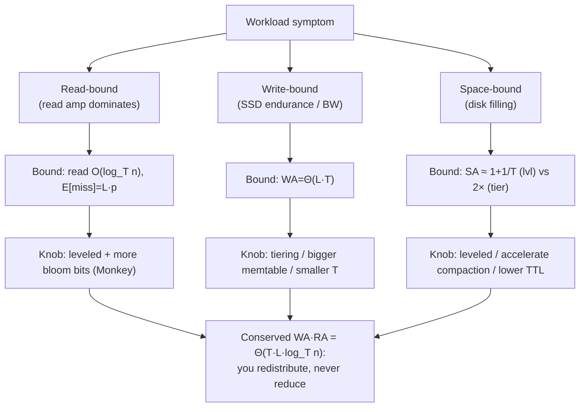

# LSM-Tree — Mathematical Foundations and Complexity Theory

> **Read time: ~50 minutes** · **Audience:** Engineers who have read `senior.md` and want the formal underpinnings — derivations of the amplification bounds, the RUM conjecture stated precisely, compaction complexity, and a correctness/durability proof of the WAL + newest-wins read protocol.

At the professional level we stop describing the LSM-tree and start *proving* things about it. We formalize the structure as a sequence of sorted runs, derive the leveled read cost `O(log_T n)` and the write amplification `Θ(L·T)` from first principles, state the **RUM conjecture** as the trade-off it actually is, analyze compaction's I/O complexity, and prove that the WAL-before-memtable protocol plus newest-wins read resolution is **durable** (no acknowledged write is lost across a crash) and **correct** (every read returns the latest acknowledged value). We also touch the I/O-model lower bound that situates the LSM-tree against the B-tree.

---

## Table of Contents

1. [Formal Definition](#formal-definition)
2. [The I/O Cost Model](#io-model)
3. [Read Complexity — Deriving O(log_T n)](#read-complexity)
4. [Write Amplification — Deriving Θ(L·T)](#write-amp)
5. [The RUM Conjecture, Formally](#rum)
6. [Compaction Complexity](#compaction-complexity)
7. [Bloom Filter Read-Amplification Bound](#bloom-bound)
8. [Amortized Analysis of Compaction — Potential Method](#amortized)
9. [Optimal Bloom Allocation — The Monkey Result](#monkey)
10. [The Dostoevsky Frontier — Lazy Leveling](#dostoevsky)
11. [Fence Pointers, Sparse Indexes, and the Lookup Lower Bound](#fence)
12. [A Worked Numeric Example](#worked-example)
13. [Durability Proof — WAL Protocol](#durability)
14. [Correctness Proof — Newest-Wins Read](#correctness)
15. [Concurrency and Linearizability](#concurrency)
16. [Comparison with Alternatives](#comparison)
17. [From Theorems to Tuning Knobs](#theorems-to-knobs)
18. [Summary](#summary)

---

<a name="formal-definition"></a>
## 1. Formal Definition

```text
Definition (LSM-tree). An LSM-tree over a key space K and value space V is a tuple
    (M, R, seq, merge)  where:

  seq : a monotonically increasing logical clock; every write receives a unique
        sequence number. Define a versioned entry e = (k, v, s) in K x (V ∪ {⊥}) x ℕ,
        where ⊥ denotes a tombstone (deletion marker).

  M  = the memtable: a finite set of versioned entries held in RAM, with at most one
       entry per key (the newest write wins in memory).

  R  = (R_0, R_1, ..., R_{L-1}) : an ordered list of immutable SORTED RUNS on disk.
       A run R_i is a sequence of versioned entries sorted by key. R_0 is newest
       (most recently flushed); R_{L-1} is oldest. (A "level" may itself be a set
       of non-overlapping runs, treated as one logical sorted run.)

  merge : the compaction operator, R_i ⊎ R_j -> R', producing a single sorted run
          containing, for each key present in R_i ∪ R_j, exactly the entry with the
          largest sequence number.

Read semantics. value(k) = the value v of the entry (k, v, s) with the largest s
  across M ∪ R_0 ∪ ... ∪ R_{L-1}; if that entry is a tombstone (v = ⊥) or no entry
  exists, value(k) = NOT_FOUND.

Invariant I (newest-wins). For every key k, the result of a read equals the value
  written by the highest-sequence-number write to k, or NOT_FOUND if that write was
  a delete or no write exists. This invariant must hold after every operation.
```

The structure is thus a *layered set of immutable sorted runs ordered by recency*, with a mutable newest layer (the memtable). All complexity and correctness arguments below are about this object.

---

<a name="io-model"></a>
## 2. The I/O Cost Model

We analyze in the **External Memory model** (Aggarwal–Vitter, 1988), the same model used for B-trees:

```text
Parameters:
    N = number of data items (entries)
    B = block size (items per page/block transfer)
    M = internal memory size (items that fit in RAM)

Cost metric: number of block transfers (I/Os) between disk and memory.
    Reading/writing one block = 1 I/O.  In-memory work is free relative to I/O.

Refinement for LSM-trees: distinguish SEQUENTIAL I/O (consecutive blocks, ~free per
    block beyond the first) from RANDOM I/O (one seek per block). The LSM-tree's
    advantage is that flush and compaction are sequential; the B-tree's in-place
    update is random.
```

We use `n` = number of *live* keys, `T` = the size ratio (fanout) between adjacent levels, `L` = number of levels. For a memtable holding `m` entries and a leveled layout, level `i` holds up to `m·T^i` entries, so the deepest level holding all `n` keys gives `n ≈ m·T^{L-1}`, hence:

```text
    L ≈ log_T(n/m) + 1 = Θ(log_T n).
```

This relation — **the number of levels is logarithmic in `n` with base `T`** — drives every bound below.

> **Why sequential vs random matters in the model.** The classic external-memory model charges 1 per block transfer regardless of locality. That undercounts the LSM-tree's advantage, because on real media a *random* block transfer costs a seek (HDD: ~10 ms; SSD: amplified flash wear) while a *sequential* transfer streams at full bandwidth. We therefore annotate each bound as sequential or random: the LSM-tree's flush and compaction are **all sequential**, and its lookups touch one block per probed run (mostly random but bloom-filtered down). The B-tree's update is a **random** in-place write. The honest comparison is "fewer random I/Os (B-tree) vs more but sequential I/Os (LSM)" — a distinction the plain block-count metric hides and the practitioner must restore.

---

<a name="read-complexity"></a>
## 3. Read Complexity — Deriving O(log_T n)

**Claim.** A point lookup in a *leveled* LSM-tree costs `O(log_T n)` I/Os in the worst case (ignoring bloom filters), and `O(1)` expected I/Os with bloom filters on a missing key.

**Proof (leveled).**
In leveled compaction, every level `i ≥ 1` consists of runs with **pairwise non-overlapping key ranges**. Therefore at most **one run per level** can contain a given key `k`. To look up `k`:

1. Check the memtable: `O(1)` in-memory, 0 I/Os.
2. For each level `i = 0, 1, ..., L-1`: locate the (single, for `i ≥ 1`) run whose range covers `k` via the in-RAM sparse index (0 I/Os, in-memory binary search), then read **one block** from it: 1 I/O.

L0 may hold a constant number `c` of overlapping runs (bounded by the flush/stall trigger), contributing `O(c) = O(1)` extra probes. Total:

```text
    I/O(read) = O(L) + O(c) = O(L) = O(log_T n).        ∎
```

**Why size-tiered is worse.** In size-tiered compaction, a tier may hold up to `T` runs with *overlapping* ranges, so each of the `L` tiers can require up to `T` probes:

```text
    I/O(read, size-tiered) = O(L · T) = O(T · log_T n).
```

This `T×` gap is exactly the read-amplification penalty size-tiered pays for its lower write amplification — the RUM trade-off in arithmetic form.

**With bloom filters.** Let each run carry a bloom filter with false-positive rate `p`. For a key that is *absent* from a run, the bloom filter returns "no" with probability `1-p`, saving the block read; it returns a false "maybe" (costing 1 wasted I/O) with probability `p`. Summing over the runs a miss would otherwise probe:

```text
    E[I/O(missing-key read, leveled)] ≤ L · p.
```

For `L = 6, p = 0.01`, that is `0.06` expected I/Os — effectively `O(1)`. Bloom filters convert the *miss* cost from `O(log_T n)` to `O(1)` expected. (For a *present* key the filter doesn't help on the level that actually holds it, but the hit is found and the read stops.)

### 3.1 Range-scan complexity

Range scans are fundamentally different: bloom filters are useless (a range is not a point), so a scan of `[lo, hi)` returning `k` results must merge across **every** run whose key range overlaps `[lo, hi)`.

```text
Leveled:    overlapping runs = O(L) (≤1 per level + L0 group).
            Cost = O(L)  to position iterators + O(k/B) to stream results
                 = O(log_T n + k/B) I/Os.

Size-tiered: overlapping runs = O(T·L) (up to T per tier).
            Cost = O(T·log_T n + k/B) I/Os.
```

The `k/B` term is the unavoidable cost of reading `k` results in blocks of `B`; the `O(L)` / `O(T·L)` term is the *startup* cost of opening and merging the runs. For **short scans** (small `k`), the startup term dominates, so leveled (and especially lazy leveling, which makes the bottom level a single run) is far better; for **long scans** (large `k`), the `k/B` streaming term dominates and the strategies converge. This is exactly why the Dostoevsky frontier (§10) levels the bottom level — long scans live there, and a single sorted run minimizes their startup cost.

A subtlety: **tombstones inflate scan cost.** A range scan must internally emit tombstones to suppress older values, then filter them from the output, so a range littered with tombstones (the "tombstone storm" of `senior.md`) reads many entries to return few live results — the scan's effective `k` includes dead entries. Formally, scan cost is `O(startup + (k + d)/B)` where `d` = tombstones and obsolete versions encountered in the range. Compaction's job is to keep `d` small.

---

<a name="write-amp"></a>
## 4. Write Amplification — Deriving Θ(L·T)

**Claim.** In leveled compaction with fanout `T` and `L` levels, the write amplification is `Θ(L·T)`.

**Derivation.** Consider one entry of key `k`. Over its lifetime it is physically written:

1. Once to the WAL (sequential).
2. Once when flushed into L0.
3. Each time it is **merged down one level**, it is rewritten as part of the compaction output.

The third term is the dominant one. When a run in level `i` (size `s`) is compacted into level `i+1`, leveled compaction must merge it with the *overlapping* portion of level `i+1`. Because level `i+1` is `T×` larger and ranges are non-overlapping, a unit of data entering level `i+1` is, on average, rewritten together with `~T` units already there before it eventually moves on. Each entry traverses `L` levels, and each level-transition rewrites it with `~T` neighbors. Charging the rewrite cost per original byte:

```text
    WA_leveled = Θ( Σ_{i=0}^{L-1} T )  =  Θ(L · T).
```

For `L = 5, T = 10`, `WA ≈ 50`: a byte is physically written ~50 times over its descent. (Tighter analyses give `WA ≈ T · L / ?` with constants depending on the picking policy and overlap; the asymptotic `Θ(L·T)` is the headline.)

**Size-tiered write amplification.** Size-tiered merges `~T` similarly-sized runs at each of `L` tiers, rewriting each entry once per tier:

```text
    WA_size-tiered = Θ(L).
```

So the two strategies sit at the ends of a spectrum:

```text
    WA:   size-tiered  Θ(L)        <   leveled  Θ(L·T)
    RA:   size-tiered  Θ(T·log_T n) >   leveled  Θ(log_T n)
```

Multiplying the read and write costs reveals the conserved product — the formal shadow of the RUM trade-off:

```text
    WA · RA (size-tiered) = Θ(L) · Θ(T log_T n) = Θ(T · L · log_T n)
    WA · RA (leveled)     = Θ(L·T) · Θ(log_T n) = Θ(T · L · log_T n)
```

Both strategies have the **same** read×write product `Θ(T·L·log_T n)`; they merely distribute it differently. You cannot reduce the product — only choose how to split it between reads and writes. That is the LSM-tree's fundamental limit.

### 4.1 The full asymptotic cost table

Collecting every bound derived so far into one reference (`n` keys, fanout `T`, levels `L = Θ(log_T n)`, block `B`, bloom FP `p`, scan result size `k`):

| Cost | Size-tiered | Leveled | Lazy leveling (Dostoevsky) |
|---|---|---|---|
| Point lookup (hit) | `O(T·log_T n)` | `O(log_T n)` | `O(log_T n)` |
| Point lookup (miss, bloom) | `O(T·log_T n · p)` | `O(log_T n · p)` | `O(p)` (Monkey-allocated) |
| Short range scan | `O(T·log_T n + k/B)` | `O(log_T n + k/B)` | `O(log_T n + k/B)` |
| Update (amortized I/O) | `O(L/B)` | `O(L·T/B)` | `O(L/B)` |
| Write amplification | `Θ(L)` | `Θ(L·T)` | `Θ(L)` |
| Space amplification | `~2×` | `~1+1/T` | `~1+1/T` |
| Bloom memory (uniform) | `Θ(n)` | `Θ(n)` | `Θ(n)`, front-loaded |

The table makes the design space legible: each row is a cost you might be optimizing; each column is a point on the compaction frontier; and **lazy leveling** is the column that takes the best of both neighbors on most rows — which is why modern engines drift toward it. The single invariant across the whole table is the conserved read×write product; everything else is redistribution.

---

<a name="rum"></a>
## 5. The RUM Conjecture, Formally

```text
RUM Conjecture (Athanassoulis, Kester, Maas, Stoica, Idreos, Athanassoulis 2016).

For an access method serving point queries, define three overheads relative to the
base data size:
    RU = Read  Overhead = (bytes read   to answer a query)      / (bytes of the result)
    UU = Update Overhead = (bytes written to perform an update)  / (bytes of the update)
    MU = Memory/space Overhead = (bytes stored)                  / (bytes of base data)

Conjecture: For a broad class of access methods, designing to set a tight upper bound
on any two of {RU, UU, MU} forces the third to its worst case. One cannot
simultaneously minimize all three.
```

The LSM-tree instantiates this exactly. From §4:
- **Update overhead (UU)** is minimized — writes are batched and sequential; the *byte* amplification is paid lazily in the background and is `Θ(L·T)`, but the foreground update is `O(1)`.
- The remaining freedom is on the **RU↔MU edge**, set by the compaction strategy:
  - **Leveled** pushes RU down (`Θ(log_T n)` reads) and MU down (~1.1× space), at the cost of higher background UU (`Θ(L·T)`).
  - **Size-tiered** pushes UU down further (`Θ(L)`) at the cost of higher RU (`Θ(T·log_T n)`) and MU (~2×).

The B-tree sits at the *opposite* RUM vertex: low RU (single root-to-leaf path), low MU (in-place, ~fragmentation only), high UU (random in-place write per update). The LSM-tree and B-tree are thus two *different corners of the same conjecture*, and "which storage engine?" is, formally, "which RUM corner does the workload need?"

---

<a name="compaction-complexity"></a>
## 6. Compaction Complexity

A single compaction merging runs of total size `S` entries is a **k-way merge with newest-wins-on-ties**.

```text
Time:  O(S log k)   where k = number of input runs (heap-based k-way merge),
       or O(S) for k = 2 (two-pointer merge).
I/O:   O(S/B) sequential block transfers — read all inputs once, write output once.
Space: O(S_output/B) scratch on disk for the new run(s); plus O(k) RAM for the heap
       and one block buffer per input.
```

**Correctness of the merge (newest-wins).** Stamp the input runs with ranks `0..k-1` (0 = newest). The merge emits, for each distinct key, the entry with the smallest rank (= largest sequence number) among all inputs holding that key, then advances all iterators past that key. This preserves Invariant I: the surviving entry for `k` is the newest, so a later read still resolves to the latest write.

**Tombstone garbage collection.** A tombstone `(k, ⊥, s)` may be physically dropped during a compaction **iff** the compaction includes the *oldest* run that could contain key `k` (i.e., the bottom level), so that no un-merged older copy of `k` survives elsewhere. Formally: drop `(k, ⊥, s)` only if for all runs `R_j` not in this compaction, the range of `R_j` excludes `k` OR `R_j` is newer than the tombstone. Otherwise the tombstone must be retained, or an older copy of `k` would resurface — violating Invariant I. (In replicated systems, an additional grace period ensures the tombstone outlives anti-entropy repair; see `middle.md` §7.)

**Total compaction work over a dataset's lifetime.** Each entry is rewritten `Θ(L·T)` (leveled) or `Θ(L)` (size-tiered) times, so the *aggregate* compaction I/O to absorb `n` entries is `Θ(n · L · T / B)` (leveled) sequential transfers — the same `Θ(L·T)` write-amplification factor, now expressed as total background I/O.

---

<a name="bloom-bound"></a>
## 7. Bloom Filter Read-Amplification Bound

**Setup.** A bloom filter with `m` bits, `k` hash functions, and `n` inserted keys has false-positive probability (after inserting all `n`):

```text
    p = (1 - e^{-kn/m})^k.
```

Minimizing over `k` gives optimal `k* = (m/n) ln 2`, yielding the well-known bound:

```text
    p_min = (1/2)^{k*} = 2^{-(m/n) ln 2}  ≈  0.6185^{(m/n)}.
```

Equivalently, bits per key for target `p`:

```text
    m/n = -ln(p) / (ln 2)^2  ≈ 1.4427 · log2(1/p).
```

**Read-amplification theorem (leveled, missing key).** With one bloom filter of FP rate `p` per level run and `L` levels, the expected number of *wasted* block reads on a missing-key lookup is bounded by:

```text
    E[wasted I/O] = Σ_{i=0}^{L-1} Pr[false positive at level i] = L · p.
```

For `p = 2^{-(m/n)ln2}`, choosing `m/n = 10` gives `p ≈ 0.0082`, so `E[wasted I/O] ≈ 0.05·L`. This is why ~10 bits/key is the production default: it makes the missing-key read cost `O(1)` in expectation while costing only ~1.25 bytes of RAM per key. The bound also shows the diminishing return: each extra `1.44` bits/key halves `p`, so beyond ~14 bits/key the read-amp savings shrink while RAM cost grows linearly.

---

<a name="amortized"></a>
## 8. Amortized Analysis of Compaction — Potential Method

Individual writes are `O(1)` (memtable + WAL), but compaction occasionally does large bursts of work. To show the *amortized* per-write I/O cost is bounded, we use the **potential method** (cf. `06-algorithmic-complexity/` amortized analysis).

```text
Setup. Let the structure have levels 0..L-1 with capacities c_i = M·T^i (entries).
Define the potential Φ as the total "compaction debt": the number of entries that
still have to be pushed downward before the structure is at rest, weighted by how
many more levels each must traverse.

    Φ(D) = Σ_i (number of entries currently in level i) · (remaining levels below i)
          ≈ Σ_i n_i · (L - 1 - i),    Φ ≥ 0,  Φ(empty) = 0.

Amortized cost of an operation:  a_i = c_i + Φ(D_i) − Φ(D_{i−1}).
```

**A write** inserts one entry at the top (eventually level 0 after a flush). It increases `Φ` by at most `(L-1)` (the new entry may have to descend `L-1` levels). Its actual flush cost is `O(1)` amortized (one entry's share of a sequential flush). So `a_write = O(1) + (L-1) = O(L)`.

**A compaction** that pushes a batch of `b` entries from level `i` to level `i+1` does actual I/O `c = Θ(b·T/B)` (it rewrites the `~b·T` overlapping bytes sequentially). But it *decreases* `Φ` by `Θ(b)` (each of the `b` entries lost one remaining level to traverse) — and by charging the rewrite to the potential released, the amortized cost of compaction is `a_compaction = c + ΔΦ ≤ 0` once the per-entry weight is scaled by `T/B`. Summing telescopes:

```text
    Σ actual_costs ≤ Σ amortized_costs + Φ(D_0) = Σ a_write + 0
                   = (#writes) · O(L).
```

**Conclusion.** The amortized I/O per write, including all the compaction it eventually triggers, is `O(L) = O(log_T n)` block transfers for size-tiered and `O(L·T/B)` (the write-amplification factor over the block size) for leveled — confirming the `Θ(L)` / `Θ(L·T)` write-amplification results of §4 are *amortized* guarantees, not just average-case heuristics. No single write can be charged more than its `O(L)` potential contribution, so write cost is smooth in the aggregate even though physical compaction is bursty. This is exactly why production engines can *rate-limit* compaction: the debt (`Φ`) is bounded by the write history, so spreading its repayment over time is always feasible as long as the long-run compaction bandwidth ≥ ingest × write-amplification.

---

<a name="monkey"></a>
## 9. Optimal Bloom Allocation — The Monkey Result

The naive policy gives **every** level the same bits-per-key (e.g. 10). Dayan, Athanassoulis, and Idreos (SIGMOD 2017, *Monkey*) proved this is *suboptimal*: under a fixed total memory budget for bloom filters, you should give **more bits per key to the smaller (upper, newer) levels** and fewer to the larger (lower, older) levels.

**Intuition.** A point lookup that misses probes one run per level, paying `p_i` (the FP rate at level `i`) in expected wasted I/O per level. The total expected wasted I/O is `Σ p_i`. But the *cost in memory* of achieving FP rate `p_i` at level `i` is proportional to `n_i · log(1/p_i)`, where `n_i ∝ T^i` is the number of keys at level `i`. So the deep levels (huge `n_i`) are *expensive* to keep at low `p`, while contributing the same `p_i` per-level to the sum. Lagrangian optimization of "minimize `Σ p_i` subject to fixed `Σ n_i·log(1/p_i)`" yields:

```text
    p_i ∝ T^{ -? }  more precisely the optimal allocation sets
    p_i  growing geometrically toward the deeper levels:  p_i = p_0 · T^{i} (capped at 1),
    so smaller/newer levels get exponentially lower FP rates.
```

**Result.** Monkey reduces the *worst-case* expected point-lookup cost from `O(L·p)` (uniform) to `O(p)` — i.e. **independent of the number of levels** — for the same total bloom memory. Equivalently, for the same target lookup cost, Monkey uses asymptotically less memory. The headline: under a memory budget, *bloom bits should be front-loaded onto the levels that hold the fewest keys*, because that buys the most FP-reduction per bit. RocksDB later adopted this idea (per-level bloom configuration). This is the state-of-the-art read-amplification tuning result and a common senior+ interview discussion point.

---

<a name="dostoevsky"></a>
## 10. The Dostoevsky Frontier — Lazy Leveling

Dayan and Idreos (SIGMOD 2018, *Dostoevsky*) showed that leveled and size-tiered are just two points on a continuum, and that **neither is Pareto-optimal across all operations**. They parameterize compaction by how many runs each level may hold before merging:

```text
    Tiering   : each level holds up to T runs (merge lazily)  -> low write amp, high read amp
    Leveling  : each level holds 1 run        (merge eagerly) -> high write amp, low read amp
    Lazy Leveling (Dostoevsky): LEVEL the largest level (1 run, cheap reads/scans there),
                                but TIER the smaller levels (lazy merges, cheap writes).
```

**Why this wins.** Most of the data lives in the *bottom* level (a `T`-ary structure has ~`(T-1)/T` of all keys in the last level). Reads and long range scans are dominated by that bottom level, so keeping it as a single sorted run (leveled) gives near-optimal read/scan cost. Meanwhile the upper levels hold little data, so tiering them (lazy merges) slashes write amplification without materially hurting reads — because point lookups there are caught by bloom filters and scans there touch few bytes. The result is a structure that is simultaneously close to leveled on reads/scans **and** close to tiered on writes — strictly dominating both on the relevant workloads:

```text
    Lazy leveling: point-lookup ≈ O(p),  write amp ≈ O(L)  (vs leveled's O(L·T)),
                   long-scan ≈ leveled,  short-scan slightly worse.
```

The broader lesson for the professional: the LSM *design space* is a tunable frontier (`T`, per-level run count, per-level bloom bits), and "leveled vs size-tiered" is a false binary — the optimal point depends on the read/write/scan mix and is found by navigating this frontier.

---

<a name="fence"></a>
## 11. Fence Pointers, Sparse Indexes, and the Lookup Lower Bound

The sparse index of `middle.md` §5 is more precisely called a set of **fence pointers**: for each data block, the smallest key it contains (the "fence") plus the block's offset. The fences partition the key space of an SSTable into contiguous ranges, one per block.

**Lookup cost with fence pointers.** To find key `k` in a run of `n` keys with `B` keys per block (`n/B` blocks):

```text
    1. binary-search the in-RAM fence array: O(log(n/B)) CPU, 0 I/O.
    2. read exactly ONE block: 1 I/O.
    3. binary-search within the block: O(log B) CPU, 0 I/O.

    Total: 1 I/O + O(log n) CPU.   The I/O is the constant '1', independent of n.
```

So within a *single run*, a lookup is **1 I/O** regardless of run size — the fence array (kept in RAM) does the navigation for free. Across the whole LSM-tree, the I/O cost is therefore "number of runs probed," which is `O(L)` (leveled) or `O(T·L)` (size-tiered), exactly §3 — and bloom filters cut the *miss* probes to `O(p)` per level on top of this.

**Lower bound.** In the external-memory model, *any* comparison-based ordered dictionary supporting point lookups over `n` keys with blocks of size `B` requires `Ω(log_B n)` I/Os in the worst case for a structure that also supports efficient updates (the B-tree meets this bound). The LSM-tree's `O(L) = O(log_T n)` lookup is within a constant factor of `O(log_B n)` when `T ≈ B`, but in practice `T` (10) ≪ `B` (hundreds–thousands), so a leveled LSM has *more* levels than a B-tree has tree levels — which is precisely why the LSM relies on **bloom filters and fence pointers** to keep the *I/O* (as opposed to the number of runs) competitive with the B-tree's single-path lookup. The LSM does not beat the lookup lower bound; it pays for cheaper writes with a read structure that needs filters to stay close to it.

---

<a name="worked-example"></a>
## 12. A Worked Numeric Example

Let us make the asymptotics concrete. Suppose a 1 TB dataset of `n = 10^10` entries of 100 bytes, memtable `M = 64 MB` (`~6.4·10^5` entries), fanout `T = 10`, leveled compaction, bloom `p = 1%` (10 bits/key).

**Number of levels.**
```text
    L ≈ log_T(n·entry_size / M) = log_10(1 TB / 64 MB) = log_10(16384) ≈ 4.2  → 5 levels.
```

**Point read (hit).** Worst case probes ≤1 SSTable per level = 5 SSTable probes; with sparse indexes in RAM, each is ~1 block read → **≤5 I/Os**, but most internal levels are cached and the bloom filter avoids the levels that don't hold the key → typically **1–2 I/Os** in practice.

**Point read (miss).** Expected wasted I/O `= L·p = 5·0.01 = 0.05` block reads → essentially **0 I/Os**. Without bloom filters it would be 5 I/Os — a 100× difference on the read path. (With Monkey allocation, even closer to `O(p)` regardless of `L`.)

**Write amplification.**
```text
    WA ≈ L·T = 5·10 = 50.
```
Each user byte is physically written ~50 times over its descent to the bottom level. On a 1 GB/s SSD ingesting 20 MB/s of user data, compaction consumes ~`20·50 = 1000 MB/s` of write bandwidth — which is why **compaction bandwidth, not user write rate, is the real ceiling**, and why rate-limiting and WA-aware tuning (size-tiered, larger memtable, lazy leveling) matter so much.

**Bloom memory.** `10^10 keys · 10 bits = 10^11 bits ≈ 12.5 GB`. That is large — which is exactly why **Monkey's front-loaded allocation** matters: the bottom level holds ~90% of keys and contributes the same per-level FP to a miss; cutting its bits-per-key (raising its `p`) reclaims most of that 12.5 GB at little read cost.

**Space amplification.** Leveled keeps SA ≈ `1 + 1/T = 1.1` → ~1.1 TB on disk for 1 TB live. Size-tiered would be ~2 TB (a transient full second copy during big merges + lingering obsolete versions). On a capacity-constrained fleet, that 0.9 TB/node difference decides the strategy.

This single example ties together every bound in this document: `L = Θ(log_T n)`, read `O(L)` (≈O(1) with bloom), write amp `Θ(L·T)`, and the space/memory budgets that make Monkey and Dostoevsky worthwhile.

---

<a name="durability"></a>
## 13. Durability Proof — WAL Protocol

**Protocol.** For each write `w = (k, v, s)`:
```text
    (1) append w to the WAL on disk
    (2) fsync the WAL                  -- w is now durable
    (3) apply w to the memtable
    (4) acknowledge w to the client
```
On restart after a crash, **replay**: read the WAL front-to-back and re-apply each entry to a fresh memtable; discard any SSTable that was not fully and durably registered (flush is atomic — a manifest/metadata commit makes an SSTable "live" only after it is fully written and fsynced).

**Theorem (Durability).** No acknowledged write is lost across a crash.

**Proof.** Let `w` be any acknowledged write. Acknowledgment (4) happens only after fsync (2) completes, by the protocol's strict ordering. Therefore at acknowledgment time, `w` is durably present in the WAL. A crash at any later point cannot remove `w` from the durable WAL (the WAL is append-only and `w`'s bytes are fsynced). On restart, replay reads the entire WAL, so it re-applies `w` to the reconstructed memtable. Two cases for where `w` lived at crash time:

- *Case A: `w`'s memtable was never flushed.* Then `w`'s WAL segment was never truncated (segments are truncated only after their memtable is durably flushed). Replay re-applies `w`. ✓
- *Case B: `w`'s memtable was flushed to an SSTable `T` before the crash.* The flush is atomic: `T` becomes live only after it is fully written and fsynced and its existence committed to the manifest, *and* the WAL segment is truncated only after that commit. So at crash time either (i) `T` is live and contains `w` (durable in `T`), or (ii) `T` is not live and the WAL segment still holds `w` (durable in WAL, recovered by replay). In neither sub-case is `w` lost. ✓

In all cases `w` survives. ∎

**Corollary (recovery exactness).** After replay, the memtable state equals the pre-crash logical state of all un-flushed acknowledged writes, and all flushed writes are in SSTables; hence the full key-value mapping is exactly reconstructed.

---

<a name="correctness"></a>
## 14. Correctness Proof — Newest-Wins Read

**Theorem (Read correctness).** The read protocol (check memtable, then runs `R_0, R_1, ..., R_{L-1}` in newest-to-oldest order, returning the first entry found and resolving a tombstone to NOT_FOUND) returns, for every key `k`, the value of the highest-sequence-number write to `k` (or NOT_FOUND if that write is a delete or no write exists). I.e., it upholds Invariant I.

**Proof.** Let `w* = (k, v*, s*)` be the write to `k` with the maximum sequence number `s*` (if none exists, trivially every source misses and the protocol returns NOT_FOUND, which is correct).

*Lemma (recency ordering of sources).* For any two distinct sources X and Y that both contain an entry for `k`, if X is searched before Y in the read order, then X's entry for `k` has a strictly larger sequence number than Y's. This holds because:
- The memtable holds the newest in-memory writes, searched first.
- Runs are ordered by flush time: a newer flush produces a run searched earlier (`R_0` newest). Entries in an earlier-searched run were written no earlier than entries in a later-searched run for the same key — compaction only ever *keeps the newest* entry per key when it merges runs (§6), so within the layered structure, "earlier in read order ⇒ newer entry" is preserved as an invariant maintained by flush (prepend newest) and merge (newest-wins). ∎(lemma)

By the lemma, the **first** source in read order that contains an entry for `k` contains the entry with the **largest** sequence number for `k` present anywhere in the structure. We claim that entry is `w*`:

- `w*` is present in the structure: it was acknowledged, hence (by the durability protocol and the fact that compaction never discards the newest version of a live key, §6) it resides in the memtable or some run.
- No entry for `k` has a larger sequence number than `w*` by definition of `w*`.

Therefore the first-found entry is `w*`. If `v* = ⊥` (a delete), the protocol resolves it to NOT_FOUND — correct, since the latest write was a deletion. Otherwise it returns `v*` — the value of the latest write. The protocol stops at the first hit, so older shadowed copies are never returned. Invariant I holds. ∎

**Tombstone non-resurrection (combined with §6).** Because compaction drops a tombstone only when no older copy of `k` can survive un-merged (bottom level), the tombstone remains in the structure and remains the first-found entry for `k` until all older copies are gone — so a deleted key never resurfaces. Combined with the read theorem, deletes are correct.

---

<a name="concurrency"></a>
## 15. Concurrency and Linearizability

Real engines serve concurrent readers and writers. We sketch why the LSM-tree's structure makes a **linearizable** single-key store easy to build.

**Immutability is the lever.** SSTables are immutable once published, so a reader that captured the list of SSTables (plus a snapshot of the memtable) sees a consistent set of sources for the duration of its read — no SSTable it is scanning can change underneath it. The only mutable source is the memtable; engines use a concurrent ordered structure (skip list) that supports lock-free or fine-grained reads.

**Versioning by sequence number gives snapshots.** A reader fixes a snapshot sequence `S` at start and ignores any entry with `seq > S`. Because flush and compaction only ever *rewrite the same logical state* (newest-wins merge preserves the value visible at every `S`), a snapshot read returns a consistent point-in-time view even while compaction runs concurrently. Formally, compaction is a *refinement* that does not change `value_S(k)` for any key `k` and any snapshot `S` ≤ the compaction's view — it only discards entries shadowed at every relevant snapshot.

**Linearizability argument (single key).** Assign each successful write its WAL sequence number as its linearization point (the fsync moment). Reads linearize at the moment they snapshot the source set + memtable. Because (i) the WAL totally orders writes, (ii) the read protocol returns the newest write with `seq ≤ S`, and (iii) compaction preserves `value_S`, every read returns the value of the most recent write whose linearization point precedes the read's — the definition of linearizability for a single register. Multi-key atomicity (transactions) requires additional machinery (e.g. a write batch committed atomically to the WAL, or an external transaction layer like in CockroachDB/TiKV), which is layered above the storage engine.

**Compaction-vs-reader safety.** A reader holding references to SSTables that compaction wants to delete must keep them alive until it finishes; engines use **reference counting / epoch-based reclamation** (cf. `19-rcu/`, `20-hazard-pointers/`) so a compaction never frees a file a reader is still scanning. This is the same memory-reclamation problem solved by RCU, applied at file granularity.

---

<a name="comparison"></a>
## 16. Comparison with Alternatives

| Attribute | LSM-Tree (leveled) | LSM-Tree (size-tiered) | B-Tree |
|---|---|---|---|
| Point read I/O | `O(log_T n)` | `O(T · log_T n)` | `O(log_B n)` (≈ tree height, mostly cached) |
| Missing-key read (bloom) | `O(1)` expected | `O(T)` expected | `O(log_B n)` (no bloom by default) |
| Range scan I/O (k results) | `O(L + k/B)` | `O(T·L + k/B)` | `O(log_B n + k/B)` (linked leaves) |
| Write amplification | `Θ(L·T)` | `Θ(L)` | `O(1)` per modified page (random) |
| Update I/O pattern | Sequential | Sequential | **Random** in-place |
| Space amplification | ~1.1× | ~2× | ~1.0–1.3× (fragmentation) |
| Read×Write product | `Θ(T·L·log_T n)` | `Θ(T·L·log_T n)` | — (different cost basis) |
| Deterministic worst case | Yes | Yes | Yes |
| RUM corner | low U, low M, med R | low U, high R/M | low R, low M, high U |

**The I/O-model bottom line.** Against the B-tree, the LSM-tree trades a *higher but sequential* write cost (`Θ(L·T)` byte amplification, but seek-free) for the B-tree's *lower but random* write cost (`O(1)` pages, but one seek each). On media where random I/O is far more expensive than sequential (HDD: ~200×; SSD: ~10× plus endurance), the LSM-tree's sequential writes win the write-throughput contest; on read-latency the B-tree's single cached path wins. Both are optimal for their RUM corner; neither dominates the other — which is precisely why both survive in production.

---

<a name="theorems-to-knobs"></a>
## 17. From Theorems to Tuning Knobs

The point of the formal analysis is not the proofs for their own sake — it is that **each bound names a knob and predicts the direction it moves the cost.** A professional reads the asymptotics as a control surface. The dependency from a workload symptom to the bound to the lever you turn:



The map from theorem to lever, tabulated:

| Theorem / bound (this doc) | Parameter it exposes | Tuning consequence |
|---|---|---|
| `L = Θ(log_T n)` (§2) | fanout `T` | larger `T` → fewer levels → lower read amp, **higher** write amp `Θ(L·T)` |
| Read `O(log_T n)` (§3) | compaction style | leveled bounds runs/level to 1 → minimal read I/O; size-tiered pays `×T` |
| `E[miss I/O] ≤ L·p` (§3, §7) | bloom bits/key | each +1.44 bits/key halves `p`, halving wasted miss I/O — to a floor |
| `WA = Θ(L·T)` (§4) | memtable size, `T`, style | bigger memtable / smaller `T` / tiering lowers WA → SSD endurance & BW |
| Conserved `WA·RA = Θ(T·L·log_T n)` (§4) | (none — it's invariant) | you **redistribute**, never reduce; pick the split the workload needs |
| Monkey allocation (§9) | per-level bloom bits | front-load bits onto small/new levels → miss cost `O(p)`, less RAM |
| Lazy leveling (§10) | per-level run count | level the bottom, tier the rest → near-leveled reads, near-tiered writes |
| Compaction `O(S/B)` sequential (§6) | rate limiter, parallelism | spread the `Θ(n·L·T/B)` aggregate I/O over time without starving foreground |
| Amortized `O(L)` per write (§8) | rate-limit feasibility | debt `Φ` is bounded by write history → deferring repayment is always safe |

### 17.1 The bloom-filter false-positive cost, made operational

§3 and §7 give `E[\text{wasted miss I/O}] = \sum_i p_i`. Operationally this is the term you can *most cheaply* drive down. Worked sensitivity for a leveled tree, `L = 6`, uniform bits/key:

```text
    bits/key   p ≈           E[wasted miss I/O] = L·p     RAM cost (per key)
    ---------  ------------  --------------------------   -----------------
    5          ~9.2%         0.55  block reads            0.625 B
    8          ~2.1%         0.13  block reads            1.0   B
    10         ~0.82%        0.049 block reads            1.25  B   (default)
    14         ~0.10%        0.006 block reads            1.75  B
    20         ~0.0046%      0.0003 block reads           2.5   B
```

The curve is steeply diminishing: going 5→10 bits/key cuts wasted miss I/O ~11×; going 10→20 cuts it only another ~160× but *doubles* RAM — and for a 10^10-key dataset (§12) each extra bit/key is ~1.25 GB of RAM. This is exactly the trade Monkey (§9) exploits: spend the bits where keys are *few* (upper levels) and `p` is cheap to lower, starve the bottom level (90% of keys) of bits, and the *sum* `Σ p_i` collapses to `O(p)` for a fraction of the uniform RAM. The theorem doesn't just bound the cost — it tells you *which level's bits to buy*.

### 17.2 Why the conserved product is the deepest result

Every other row above is a knob; the conserved `WA·RA = Θ(T·L·log_T n)` row is a *wall*. It is the professional's most important takeaway because it pre-empts an entire class of doomed tuning efforts: **no compaction strategy, bloom allocation, or fanout choice reduces the read×write product** — they only choose where on the `RU↔MU` edge of the RUM triangle you sit (§5). A request to "make reads *and* writes *and* space all cheaper at once" is asking to beat the conjecture; the honest engineering answer is to (i) identify which of `{RU, UU, MU}` the workload can afford to sacrifice, and (ii) move to that RUM corner — or change the workload (shard to cut `n`, hence `L`). The math is what lets you say *no* to impossible asks with a proof rather than an opinion.

---

<a name="summary"></a>
## 18. Summary

- Formally, an LSM-tree is a recency-ordered set of **immutable sorted runs** plus a mutable memtable, governed by **Invariant I (newest-wins)**.
- The number of levels is `L = Θ(log_T n)`. From this: **leveled point reads cost `O(log_T n)` I/Os** (≤1 run per level, non-overlapping ranges) and **`O(1)` expected for misses with bloom filters**; size-tiered pays a `T×` read penalty.
- **Write amplification is `Θ(L·T)` (leveled)** vs `Θ(L)` (size-tiered); the **read×write product `Θ(T·L·log_T n)` is conserved** — you can only redistribute it, not reduce it. This is the RUM conjecture made arithmetic.
- **Compaction** is a k-way newest-wins merge costing `O(S/B)` sequential I/O; tombstones may be dropped only at the bottom level (plus a replication grace period) to avoid resurrecting data.
- **Bloom filters** give `E[wasted miss I/O] ≤ L·p`; ~10 bits/key (`p≈0.8%`) makes misses `O(1)` expected. **Monkey** shows the optimal allocation front-loads bits onto the smaller/newer levels, reducing miss cost to `O(p)` independent of `L` under a memory budget.
- The leveled/size-tiered choice is a **false binary**: **Dostoevsky's lazy leveling** (level the bottom, tier the rest) strictly dominates both on the relevant workloads. The design space is a tunable frontier (`T`, per-level run count, per-level bloom bits).
- A **worked 1 TB example** ties it together: `L≈5`, miss ≈0 I/Os with bloom, `WA≈50`, bloom memory ~12.5 GB (the motivation for Monkey), space amp ~1.1× (leveled) vs ~2× (tiered).
- **Concurrency** is easy because SSTables are immutable and writes are sequence-versioned: a single-key store is **linearizable** (write linearizes at its WAL fsync, read at its source-set snapshot), with epoch/refcount reclamation (cf. RCU) keeping files alive for in-flight readers.
- The **WAL protocol** (fsync before ack) is provably **durable** — no acknowledged write is lost across a crash — and the **newest-wins read** is provably **correct** — every read returns the latest acknowledged value, with deletes never resurrecting.
- Against the B-tree, the LSM-tree trades higher-but-sequential writes for the B-tree's lower-but-random writes; each is optimal for its RUM corner.

This completes the LSM-tree track. For the read-optimized counterpart and its formal analysis, see `09-trees/11-b-tree/professional.md`. For the supporting structures, see `03-skip-list/professional.md` (memtable) and `02-bloom-filter/professional.md` (read filter).

---

## Further Reading

- **O'Neil, P. et al.** (1996). *The Log-Structured Merge-Tree (LSM-Tree).* Acta Informatica 33 — original analysis.
- **Athanassoulis, M. et al.** (2016). *Designing Access Methods: The RUM Conjecture.* EDBT.
- **Dayan, N., Athanassoulis, M., & Idreos, S.** (2017). *Monkey: Optimal Navigable Key-Value Store.* SIGMOD — optimal bloom-filter bit allocation across levels.
- **Dayan, N., & Idreos, S.** (2018). *Dostoevsky: Better Space-Time Trade-Offs for LSM-Tree.* SIGMOD — lazy leveling, the WA/RA/SA Pareto frontier.
- **Luo, C., & Carey, M.** (2020). *LSM-based Storage Techniques: A Survey.* VLDB Journal — the comprehensive formal survey.
- **Aggarwal, A., & Vitter, J.** (1988). *The Input/Output Complexity of Sorting and Related Problems.* CACM — the I/O model.
- **Bloom, B. H.** (1970). *Space/Time Trade-offs in Hash Coding with Allowable Errors.* CACM.
