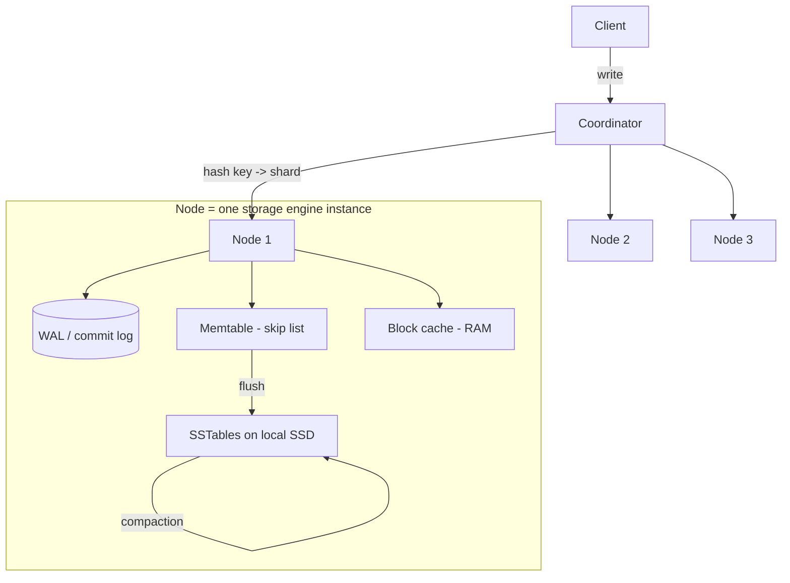
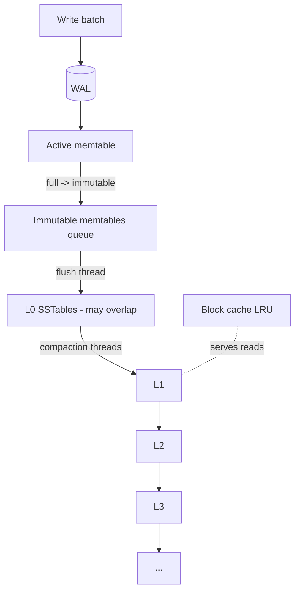
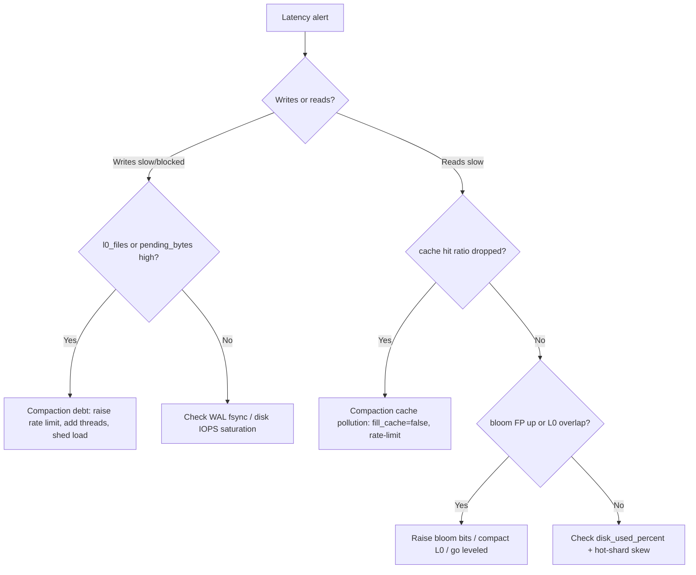

# LSM-Tree — Senior Level

> **Read time: ~50 minutes** · **Audience:** Engineers who have read `middle.md` and now need to *operate* LSM-tree engines (RocksDB, Cassandra, ScyllaDB, HBase) in production — tuning compaction, controlling amplification, rate-limiting background work, and monitoring the right metrics under real traffic and failures.

A junior knows the four parts; a middle engineer knows the strategies and amplifications. A senior engineer is the one paged at 3 a.m. because *write latency p99 just tripled and disk is 90% full*. This document is about that engineer: how the production engines (RocksDB and Cassandra above all) are architected, which knobs actually move the needle, how compaction competes with foreground traffic and how to keep it from starving reads/writes, what to put on the dashboard, and the canonical failure modes — write stalls, compaction debt, tombstone storms, hot shards — with their fixes.

---

## Table of Contents

1. [Introduction — Operating an LSM-Tree](#introduction)
2. [System Design with LSM-Trees](#system-design)
3. [RocksDB Architecture in Depth](#rocksdb)
4. [Cassandra / ScyllaDB / HBase at Scale](#cassandra)
5. [Comparison of Production Engines](#comparison)
6. [Tuning the Three Amplifications](#tuning)
7. [Compaction Tuning and Rate Limiting](#compaction-tuning)
8. [Capacity Planning — Back-of-Envelope](#capacity)
9. [Code Examples — Instrumented Compaction Scheduler](#code-examples)
10. [Observability](#observability)
11. [Failure Modes](#failure-modes)
12. [Incident Playbooks](#playbooks)
13. [Summary](#summary)

---

<a name="introduction"></a>
## 1. Introduction — Operating an LSM-Tree

The defining operational tension of an LSM-tree is that **useful work (foreground reads/writes) and housekeeping (compaction) share the same scarce resources**: CPU, disk bandwidth, IOPS, page cache, and memory. Foreground writes *create* compaction debt; compaction *pays it down* by consuming the very bandwidth foreground traffic wants. If compaction runs too aggressively it steals throughput from clients; if it runs too lazily, SSTables and obsolete data pile up until reads slow and disk fills, at which point the engine **throttles or stalls writes** to let compaction catch up — turning a background problem into a foreground outage.

Operating an LSM-tree well is therefore a control-loop problem: keep compaction debt bounded, keep its resource usage shaped (rate-limited) so it never overwhelms foreground traffic, and watch the leading indicators so you intervene *before* the write stall, not after. Everything below serves that goal.

---

<a name="system-design"></a>
## 2. System Design with LSM-Trees

LSM-trees almost never run alone; they are the single-node storage engine underneath a distributed system. A typical write-heavy service stacks them like this:



Design implications a senior must hold in mind:

- **The shard key controls write distribution.** An LSM-tree ingests fast *per node*; if your hash/partition key concentrates writes on one node (a hot partition), that node's compaction can't keep up while others idle. Distribution is a system-design concern layered on top of the per-node engine (see `database-sharding`).
- **Replication interacts with tombstones.** As covered in `middle.md`, the deletion grace period must outlive the repair/anti-entropy window so a returning replica doesn't resurrect deleted data.
- **The WAL is the durability boundary.** Replication can be synchronous (ack after N replicas durable) or async; the per-node WAL fsync policy sets the single-node durability floor.
- **Local SSD, not network storage, for the data files.** Compaction is bandwidth-hungry sequential I/O; running it over network-attached storage often becomes the bottleneck.

---

<a name="rocksdb"></a>
## 3. RocksDB Architecture in Depth

RocksDB is the most widely embedded LSM engine (CockroachDB, TiKV, Kafka Streams, Flink, MyRocks). Its architecture is the reference model.

### 3.1 The write path components



Key components and their knobs:

| Component | Purpose | Primary knobs |
|---|---|---|
| **Memtable** (skip list) | Absorb writes | `write_buffer_size` (default 64 MB), `max_write_buffer_number` |
| **WAL** | Durability | `sync` / `wal_bytes_per_sync`, group commit |
| **Flush threads** | Memtable → L0 | `max_background_flushes` |
| **Compaction threads** | Merge levels | `max_background_compactions`, `max_subcompactions` |
| **Block cache** | Cache decompressed data blocks | `block_cache` size (often the biggest RAM consumer) |
| **Bloom filter** | Skip SSTables on point reads | `bloom_bits` (default 10), whole-key vs prefix |
| **Compaction style** | RUM position | Leveled (default), Universal, FIFO |

### 3.2 Column families

RocksDB partitions a database into **column families**, each with its *own* memtable and SSTables but a *shared* WAL. This lets you tune compaction/bloom/compression per data class (e.g. hot metadata leveled, bulk events universal) while keeping a single recovery log.

### 3.3 Write stalls and the slowdown trigger

RocksDB protects itself by **slowing down or stopping writes** when compaction debt crosses thresholds — too many L0 files (`level0_slowdown_writes_trigger`, `level0_stop_writes_trigger`), too many pending compaction bytes, or too many immutable memtables awaiting flush. A write stall is RocksDB telling you compaction can't keep up; the fix is to give compaction more resources (threads, I/O budget) or reduce ingest, not to disable the trigger.

---

<a name="cassandra"></a>
## 4. Cassandra / ScyllaDB / HBase at Scale

### 4.1 Cassandra

Cassandra wraps a per-node LSM engine (memtable + SSTables, called the "commit log" for the WAL) inside a Dynamo-style distributed ring. Per-table you choose a **compaction strategy**:

- **STCS** (size-tiered) — default-ish; write-friendly, higher read/space amp.
- **LCS** (leveled) — read-friendly, bounded space, higher write amp; good for update-heavy or read-heavy tables.
- **TWCS** (time-window) — bucket SSTables by time window so whole windows of TTL'd time-series data expire and drop together; the right choice for metrics/events.

Cassandra-specific hazards: **tombstone overload** (a range scan that crosses `tombstone_warn_threshold`/`tombstone_failure_threshold` logs warnings or aborts), and **`gc_grace_seconds`** (default 10 days) which must exceed your repair cadence.

### 4.2 ScyllaDB

A C++ rewrite of Cassandra with a **shard-per-core (thread-per-core)** architecture: each CPU core owns a shard with its own memtable/SSTables and runs compaction on that core, eliminating lock contention. It adds **controllers** that *automatically* rate-limit compaction and memtable flush against foreground latency targets — effectively automating much of the senior tuning described here.

### 4.3 HBase

HBase runs the LSM model (MemStore = memtable, HFiles = SSTables) on top of HDFS. Compaction comes in two flavors: **minor** (merge a few recent HFiles) and **major** (merge *all* HFiles for a region into one, fully dropping tombstones/expired cells — expensive, often scheduled off-peak). Region splitting handles per-region growth.

---

<a name="comparison"></a>
## 5. Comparison of Production Engines

| Engine | Role | Default compaction | Concurrency model | Notable feature |
|---|---|---|---|---|
| **RocksDB** | Embedded engine | Leveled | Background thread pools | Column families, merge operators, rich tuning |
| **LevelDB** | Embedded (simpler) | Leveled | Single background thread | Origin of leveled compaction |
| **Cassandra** | Distributed DB | STCS (configurable) | Per-node thread pools | TWCS, tunable consistency, ring |
| **ScyllaDB** | Distributed DB | Size-tiered/ICS | Shard-per-core, no locks | Auto compaction controllers |
| **HBase** | Distributed DB on HDFS | Size-based minor/major | RegionServer threads | Major compaction, HDFS storage |

The shared DNA: memtable + WAL + immutable sorted files + background compaction + bloom filters. The differences are mostly *where compaction is scheduled* and *how rate-limiting/automation* is handled.

---

<a name="tuning"></a>
## 6. Tuning the Three Amplifications

Tuning is the art of moving along the RUM triangle to relieve whichever amplification is your bottleneck. Diagnose first, then turn the matching knob.

| Bottleneck symptom | Amplification | Levers (RocksDB-flavored) |
|---|---|---|
| SSD wearing out / write bandwidth saturated | **Write amp** | Switch to Universal/size-tiered; raise `write_buffer_size` (fewer flushes); larger SSTable target size; lower fanout |
| Read latency high, especially on misses | **Read amp** | Leveled compaction; more/bigger bloom filters (10→14 bits); larger block cache; reduce L0 file count |
| Disk filling, lots of obsolete data | **Space amp** | Leveled compaction; trigger/accelerate compaction; lower `gc_grace`/TTL; major compaction off-peak |
| Range scans slow | (read amp on scans) | Fewer overlapping SSTables (leveled); reduce tombstones; TWCS for time data |

Concrete levers and their second-order effects:

- **Memtable size** ↑ → fewer flushes → lower write amp, but more RAM and longer crash-recovery replay and bigger L0 files.
- **Fanout `T`** ↑ → fewer levels → lower read amp, but each compaction merges more data → higher write amp.
- **Bloom bits/key** ↑ → fewer false-positive block reads → lower read amp, but more RAM for filters.
- **Block cache** ↑ → more read hits from RAM → lower effective read amp, but less RAM for memtable/filters.
- **Compaction parallelism** ↑ → faster debt paydown → lower read/space amp, but more CPU/I/O contention with foreground.

The cardinal rule: **change one knob, measure the three amplifications + p99 latencies, repeat.** They are coupled; blind tuning makes things worse.

---

<a name="compaction-tuning"></a>
## 7. Compaction Tuning and Rate Limiting

Compaction is necessary but greedy. Left unbounded it will saturate disk and evict the block cache (compaction reads cold data, polluting cache), spiking foreground latency. Three controls keep it civil:

### 7.1 Rate limiting (I/O throttling)

RocksDB's `RateLimiter` caps compaction+flush write bandwidth (e.g. 200 MB/s) so foreground I/O always has headroom. It supports *auto-tuning* (raise the limit when compaction falls behind, lower it when it's caught up) and prioritizes foreground over background. ScyllaDB's controllers do this automatically against a latency target. The goal: **compaction uses leftover bandwidth, never the bandwidth reads/writes need.**

### 7.2 Parallelism and sub-compactions

`max_background_compactions` sets how many compactions run at once; `max_subcompactions` splits one big compaction across threads by key range. More parallelism pays debt faster but contends more — size it to leave cores/IOPS for foreground.

### 7.3 Scheduling and priority

- Prefer compactions that **reduce the most read/space amp per byte rewritten** (e.g. compact the level that's most over budget, or the SSTable overlapping the fewest next-level files).
- Schedule **major/full compactions off-peak**; they rewrite everything.
- Keep compaction reads from polluting the block cache (RocksDB: `fill_cache=false` for compaction iterators).

### 7.4 Avoiding the write stall

The whole point of rate-limiting *and* keeping enough parallelism is to keep compaction debt below the stall triggers. Monitor **pending-compaction-bytes** and **L0 file count** as the leading indicators; when they trend up, compaction is losing — add resources or shed write load before the stall hits.

---

<a name="capacity"></a>
## 8. Capacity Planning — Back-of-Envelope

Before deploying an LSM-tree fleet you must size disk, memory, and write bandwidth. The amplifications turn user-facing numbers into hardware requirements. Worked example for one node:

```text
Given:
  user write rate        W_user = 50 MB/s of new data
  live dataset per node  D_live = 2 TB
  compaction strategy    leveled, fanout T = 10  ->  L ≈ 5 levels
  bloom filters          10 bits/key, avg value 200 B -> ~50 bits/200B record overhead

Derived:
  write amplification    WA ≈ L·T = 50
  compaction write BW    = W_user · (WA - 1) ≈ 50 · 49 ≈ 2.45 GB/s   (!!)
        -> this is the real disk-bandwidth requirement, NOT the 50 MB/s user rate.
        -> if the SSD sustains ~2 GB/s writes, leveled at this ingest will STALL.
        -> mitigation: size-tiered (WA ≈ L = 5 -> 250 MB/s) OR shard across more nodes.

  disk capacity          = D_live · space_amp + headroom
                         = 2 TB · 1.1 (leveled) + 30% scratch ≈ 2.9 TB usable needed.

  bloom memory           = (D_live / avg_record) · 10 bits
                         = (2 TB / 200 B) · 10 bits ≈ 10^10 · 10 bits ≈ 12.5 GB RAM.
                         -> Monkey front-loading can cut this ~2-3× (see professional.md).

  block cache            = whatever RAM remains after bloom + memtable + OS; size to hit
                           > 90% block-cache hit ratio on the hot key set.
```

The single most important takeaway: **the disk-bandwidth budget is driven by `W_user · WA`, not `W_user`.** A "50 MB/s" ingest is really a 2.5 GB/s disk-write workload under leveled compaction. This is why senior engineers reach for size-tiered/universal or more shards on high-ingest systems, and why "just turn on leveled compaction" can silently halve your achievable throughput. Always compute `W_user · (WA-1)` against your storage's sustained write bandwidth *before* choosing a strategy.

A second takeaway: **keep 20–30% disk free.** Compaction needs scratch space to write the output before deleting the inputs (size-tiered big merges can transiently need a full extra copy). A disk that is 95% full can deadlock compaction — it can't make space because it has no space to make space — which is one of the nastiest LSM outages.

---

<a name="code-examples"></a>
## 9. Code Examples — Instrumented Compaction Scheduler

A production-grade compaction scheduler does three senior things at once: it runs in the **background**, it **rate-limits** its I/O, and it **emits metrics**. Below is a thread-safe, rate-limited compaction scheduler skeleton that decides *when* to compact (debt over threshold), throttles its byte rate, and records amplification metrics.

### 8.1 Go

```go
package lsm

import (
	"sync"
	"sync/atomic"
	"time"
)

// Metrics tracks the three amplifications plus compaction debt.
type Metrics struct {
	UserBytes    int64 // bytes written by clients
	DiskBytes    int64 // bytes written to disk (incl. compaction rewrites)
	LiveBytes    int64 // bytes of live data
	StoredBytes  int64 // bytes on disk (incl. obsolete + tombstones)
	PendingBytes int64 // compaction debt
}

func (m *Metrics) WriteAmp() float64 { return ratio(atomic.LoadInt64(&m.DiskBytes), atomic.LoadInt64(&m.UserBytes)) }
func (m *Metrics) SpaceAmp() float64 { return ratio(atomic.LoadInt64(&m.StoredBytes), atomic.LoadInt64(&m.LiveBytes)) }
func ratio(a, b int64) float64 {
	if b == 0 {
		return 1
	}
	return float64(a) / float64(b)
}

// RateLimiter caps compaction throughput (bytes/sec).
type RateLimiter struct {
	bytesPerSec int64
	mu          sync.Mutex
	allowance   float64
	last        time.Time
}

func NewRateLimiter(bps int64) *RateLimiter {
	return &RateLimiter{bytesPerSec: bps, allowance: float64(bps), last: time.Now()}
}

// Request blocks until `n` bytes of budget are available (token bucket).
func (r *RateLimiter) Request(n int64) {
	for {
		r.mu.Lock()
		now := time.Now()
		r.allowance += now.Sub(r.last).Seconds() * float64(r.bytesPerSec)
		if r.allowance > float64(r.bytesPerSec) {
			r.allowance = float64(r.bytesPerSec)
		}
		r.last = now
		if r.allowance >= float64(n) {
			r.allowance -= float64(n)
			r.mu.Unlock()
			return
		}
		r.mu.Unlock()
		time.Sleep(5 * time.Millisecond)
	}
}

// CompactionScheduler runs in the background and pays down debt under a rate cap.
type CompactionScheduler struct {
	debtThreshold int64
	limiter       *RateLimiter
	metrics       *Metrics
	stop          chan struct{}
	compactFn     func(limiter *RateLimiter, m *Metrics) int64 // returns bytes rewritten
}

func (s *CompactionScheduler) Run() {
	ticker := time.NewTicker(100 * time.Millisecond)
	defer ticker.Stop()
	for {
		select {
		case <-s.stop:
			return
		case <-ticker.C:
			if atomic.LoadInt64(&s.metrics.PendingBytes) > s.debtThreshold {
				rewritten := s.compactFn(s.limiter, s.metrics) // rate-limited inside
				atomic.AddInt64(&s.metrics.DiskBytes, rewritten)
				atomic.AddInt64(&s.metrics.PendingBytes, -rewritten)
			}
		}
	}
}
```

### 8.2 Java

```java
import java.util.concurrent.*;
import java.util.concurrent.atomic.AtomicLong;

public final class CompactionScheduler {
    static final class Metrics {
        final AtomicLong userBytes = new AtomicLong(), diskBytes = new AtomicLong();
        final AtomicLong liveBytes = new AtomicLong(), storedBytes = new AtomicLong();
        final AtomicLong pendingBytes = new AtomicLong();
        double writeAmp() { return ratio(diskBytes.get(), userBytes.get()); }
        double spaceAmp() { return ratio(storedBytes.get(), liveBytes.get()); }
        static double ratio(long a, long b) { return b == 0 ? 1.0 : (double) a / b; }
    }

    /** Token-bucket rate limiter for compaction I/O. */
    static final class RateLimiter {
        private final long bytesPerSec;
        private double allowance;
        private long last = System.nanoTime();
        RateLimiter(long bps) { bytesPerSec = bps; allowance = bps; }
        synchronized void request(long n) throws InterruptedException {
            while (true) {
                long now = System.nanoTime();
                allowance += (now - last) / 1e9 * bytesPerSec;
                allowance = Math.min(allowance, bytesPerSec);
                last = now;
                if (allowance >= n) { allowance -= n; return; }
                wait(5);
            }
        }
    }

    private final long debtThreshold;
    private final RateLimiter limiter;
    private final Metrics metrics = new Metrics();
    private final ScheduledExecutorService exec = Executors.newSingleThreadScheduledExecutor();
    private final java.util.function.ToLongFunction<RateLimiter> compactFn;

    public CompactionScheduler(long debtThreshold, long bytesPerSec,
                               java.util.function.ToLongFunction<RateLimiter> compactFn) {
        this.debtThreshold = debtThreshold;
        this.limiter = new RateLimiter(bytesPerSec);
        this.compactFn = compactFn;
    }

    public void start() {
        exec.scheduleAtFixedRate(() -> {
            if (metrics.pendingBytes.get() > debtThreshold) {
                long rewritten = compactFn.applyAsLong(limiter); // rate-limited inside
                metrics.diskBytes.addAndGet(rewritten);
                metrics.pendingBytes.addAndGet(-rewritten);
            }
        }, 0, 100, TimeUnit.MILLISECONDS);
    }
}
```

### 8.3 Python

```python
import threading, time

class Metrics:
    def __init__(self):
        self.user_bytes = 0
        self.disk_bytes = 0
        self.live_bytes = 0
        self.stored_bytes = 0
        self.pending_bytes = 0

    def write_amp(self):
        return self.disk_bytes / self.user_bytes if self.user_bytes else 1.0

    def space_amp(self):
        return self.stored_bytes / self.live_bytes if self.live_bytes else 1.0

class RateLimiter:
    """Token-bucket: cap compaction throughput to bytes_per_sec."""
    def __init__(self, bytes_per_sec):
        self.rate = bytes_per_sec
        self.allowance = float(bytes_per_sec)
        self.last = time.monotonic()
        self.lock = threading.Lock()

    def request(self, n):
        while True:
            with self.lock:
                now = time.monotonic()
                self.allowance = min(self.rate, self.allowance + (now - self.last) * self.rate)
                self.last = now
                if self.allowance >= n:
                    self.allowance -= n
                    return
            time.sleep(0.005)

class CompactionScheduler(threading.Thread):
    def __init__(self, debt_threshold, bytes_per_sec, compact_fn, metrics):
        super().__init__(daemon=True)
        self.debt_threshold = debt_threshold
        self.limiter = RateLimiter(bytes_per_sec)
        self.compact_fn = compact_fn       # compact_fn(limiter) -> bytes rewritten
        self.metrics = metrics
        self._stop = threading.Event()

    def run(self):
        while not self._stop.is_set():
            if self.metrics.pending_bytes > self.debt_threshold:
                rewritten = self.compact_fn(self.limiter)   # rate-limited inside
                self.metrics.disk_bytes += rewritten
                self.metrics.pending_bytes -= rewritten
            time.sleep(0.1)

    def stop(self):
        self._stop.set()
```

These skeletons capture the three senior concerns — background execution, rate limiting, and metric emission. A real engine plugs the actual k-way merge into `compact_fn`, calling `limiter.request(blockSize)` before each block write so compaction never exceeds its bandwidth budget.

---

<a name="observability"></a>
## 10. Observability

You cannot tune what you cannot see. The LSM-tree dashboard every senior should build:

| Metric | What it tells you | Alert threshold (example) |
|---|---|---|
| `write_amplification` | SSD endurance & write-bandwidth cost | trending > target (e.g. > 20 for leveled) |
| `read_amplification` | reads per logical get | sustained > levels + small slack |
| `space_amplification` | disk waste from obsolete data | > 1.5× (leveled) / > 2.5× (tiered) |
| `pending_compaction_bytes` | **compaction debt** (leading indicator) | rising for minutes / near stall trigger |
| `l0_file_count` | flush-vs-compaction balance | near `level0_slowdown_writes_trigger` |
| `write_stall_duration` | foreground impact of debt | any nonzero / rising |
| `flush_throughput` & `compaction_throughput` | background pipeline health | flush backlog growing |
| `bloom_filter_false_positive_rate` | wasted block reads | > configured target (e.g. > 1.5%) |
| `block_cache_hit_ratio` | effective read amp from cache | < 0.9 for hot data |
| `memtable_flush_pending` | flush backlog | > `max_write_buffer_number - 1` |
| `tombstones_scanned_per_read` | tombstone bloat | spikes on range queries |
| `disk_used_percent` | capacity headroom for compaction | > 80% (compaction needs scratch space) |

The two **leading indicators** to watch live: `pending_compaction_bytes` and `l0_file_count`. When either climbs steadily, compaction is losing the race; intervene (add threads, raise the rate limit, shed writes) *before* `write_stall_duration` goes nonzero.

---

<a name="failure-modes"></a>
## 11. Failure Modes

| Failure | Symptom | Root cause | Mitigation |
|---|---|---|---|
| **Write stall / stop** | Write latency spikes to seconds or writes blocked | Compaction debt crossed stall trigger (too many L0 files / pending bytes) | More compaction threads, raise rate limit, larger memtable, shed ingest |
| **Compaction debt spiral** | `pending_compaction_bytes` monotonically rising | Ingest rate > sustainable compaction rate | Rate-limit/shed writes, add CPU/IOPS, switch to lower-WA strategy |
| **Disk full during compaction** | Compaction aborts, can't reclaim space | No scratch headroom (esp. size-tiered big merges) | Keep ≥ 20–30% free; prefer leveled if tight; alert on `disk_used_percent` |
| **Tombstone storm** | Range-scan latency explodes; scans warn/abort | Heavy deletes / TTL with slow GC (queue-like pattern) | TWCS, tune `gc_grace`, redesign to avoid mass deletes, major compaction |
| **Hot shard/partition** | One node's compaction can't keep up, others idle | Skewed shard/partition key | Rebalance, better hash key, salt hot keys (see `database-sharding`) |
| **Block-cache thrash from compaction** | Read p99 rises during big compactions | Compaction reads evict hot data blocks | `fill_cache=false` for compaction; rate-limit; off-peak major compaction |
| **Bloom filter ineffective** | Missing-key reads do many block reads | Too few bits/key, or workload is range scans | Increase bits/key; remember bloom doesn't help range scans |
| **Slow crash recovery** | Long startup replaying WAL | Memtable too large → huge WAL to replay | Bound `write_buffer_size`; more frequent flushes; parallel WAL replay |
| **Slow point read on existing key** | get latency high even on hits | Too many overlapping SSTables (size-tiered) | Leveled compaction; compact L0; tune file counts |

The unifying theme: **almost every LSM-tree incident is compaction not keeping pace with the workload, or a tombstone/space problem compaction hasn't resolved yet.** Watch the leading indicators, keep compaction adequately resourced and rate-shaped, and most of these never page you.

---

<a name="playbooks"></a>
## 12. Incident Playbooks

Dashboards tell you *that* something is wrong; a playbook tells you *what to do next* without thinking at 3 a.m. Each playbook below is structured as **detect → confirm → mitigate → prevent**, mapping the failure modes of §11 to concrete on-call actions on RocksDB/Cassandra-class engines.

### 12.1 Playbook — Write stall in progress

```text
DETECT   write p99 jumps to seconds; write_stall_duration > 0; clients timing out.
CONFIRM  l0_file_count near level0_stop_writes_trigger, OR
         pending_compaction_bytes near soft/hard limit, OR
         memtable_flush_pending >= max_write_buffer_number.
MITIGATE 1. Raise compaction rate limit (give background more bandwidth NOW).
         2. Increase max_background_compactions / max_subcompactions if CPU/IOPS spare.
         3. If still stalling, SHED LOAD: throttle/redirect ingest at the app layer.
         4. Temporarily raise the stop trigger ONLY to buy time — never as a fix.
PREVENT  Right-size compaction parallelism + rate limit to ingest×WA;
         alert on pending_compaction_bytes trend BEFORE it reaches the trigger.
```

The single most common mistake here is disabling the stall trigger to "make the errors stop." That removes the engine's only back-pressure; debt then grows unbounded until the disk fills and you get a *worse*, unrecoverable outage. The trigger is a symptom, not the disease.

### 12.2 Playbook — Disk filling toward 100%

```text
DETECT   disk_used_percent climbing past 80% and rising.
CONFIRM  Is it live data growth (expected) or obsolete data (space-amp)?
         Check space_amplification and count of obsolete/overlapping SSTables.
MITIGATE 1. If space-amp high (tiered): trigger compaction to reclaim obsolete versions.
         2. Drop/lower TTLs or gc_grace if data is past retention.
         3. NEVER let it hit ~95%: compaction needs scratch space to write outputs
            before deleting inputs — a full disk DEADLOCKS compaction.
         4. Emergency: add capacity / move a shard off the node.
PREVENT  Keep 20-30% free as a hard floor; alert at 80%; prefer leveled if
         capacity-tight (SA ~1.1x vs tiered ~2x).
```

### 12.3 Playbook — Tombstone storm on a table

```text
DETECT   range-scan p99 explodes; tombstones_scanned_per_read spikes;
         Cassandra logs TombstoneOverwhelmingException / tombstone warnings.
CONFIRM  A queue-like or mass-delete/TTL access pattern on the offending table.
MITIGATE 1. Run a major/targeted compaction on the table to drop collectible
            tombstones at the bottom level (respecting gc_grace).
         2. Restrict scans to avoid the tombstone-heavy ranges.
MITIGATE 3. If TTL data: migrate to TWCS so whole expired windows drop as files.
PREVENT  Don't model queues on an LSM-tree; use TWCS for time-series;
         keep gc_grace ≥ repair cadence but no larger than necessary.
```

### 12.4 Playbook — Read p99 regressed, no write stall

```text
DETECT   read p99 up; writes fine; pending_compaction_bytes normal.
CONFIRM  block_cache_hit_ratio dropped? bloom_filter_false_positive_rate up?
         l0_file_count elevated (size-tiered overlap)?
MITIGATE 1. Cache thrash from a big compaction -> rate-limit + fill_cache=false.
         2. Bloom ineffective -> raise bits/key (10->14) on the hot CF/table.
         3. L0 overlap -> compact L0 / move toward leveled for that data class.
PREVENT  Size block cache to >90% hit on the hot set; per-CF bloom tuning;
         schedule major compactions off-peak.
```

The decision flow an on-call engineer walks, distilled:



The meta-skill is **reading the leading indicators first** (`pending_compaction_bytes`, `l0_file_count`, `block_cache_hit_ratio`, `disk_used_percent`) so you classify the incident in seconds, then apply the matching playbook rather than guessing. Every playbook's *prevent* step is the same lesson restated: resource and rate-shape compaction to `ingest × write-amplification`, and alert on the leading indicator's *trend*, not the lagging symptom.

---

<a name="summary"></a>
## 13. Summary

- Operating an LSM-tree is a **control-loop problem**: foreground writes create compaction debt; compaction pays it down using the same CPU/disk/cache foreground traffic needs. Keep debt bounded and compaction rate-shaped.
- **RocksDB** is the reference embedded engine (memtable + WAL + leveled compaction + block cache + bloom filters + column families); it protects itself with **write stalls** when debt crosses triggers. **Cassandra/ScyllaDB/HBase** wrap the same model in distributed rings, adding TWCS, shard-per-core auto-controllers, and minor/major compaction.
- **Tune by bottleneck:** WA-bound → size-tiered/universal, bigger memtable; RA-bound → leveled, more bloom bits, bigger block cache; SA-bound → leveled, accelerate compaction, lower TTL/grace.
- **Rate-limit compaction** so it uses only leftover bandwidth; size parallelism to leave headroom; schedule major compactions off-peak; don't let compaction pollute the block cache.
- **Monitor** the three amplifications plus the leading indicators `pending_compaction_bytes` and `l0_file_count`; intervene before the write stall.
- **Failure modes** nearly all reduce to "compaction can't keep up" or "tombstone/space debt": write stalls, debt spirals, disk-full, tombstone storms, hot shards.

Next step: [professional.md](./professional.md) — the formal analysis: deriving leveled read cost `O(log_T n)` and write amplification `Θ(L·T)`, the RUM conjecture stated precisely, compaction complexity, and a durability/correctness proof of the WAL + newest-wins read.

---

## Further Reading

- **RocksDB Tuning Guide & Wiki** — Write stalls, Rate Limiter, Leveled vs Universal, Statistics. The single best source for real knobs.
- **ScyllaDB docs** — Compaction controllers, shard-per-core architecture, Incremental Compaction Strategy (ICS).
- **Cassandra docs** — Compaction strategies, tombstones, `gc_grace_seconds`, repair.
- **Dong, S. et al.** (2017). *Optimizing Space Amplification in RocksDB.* CIDR.
- **Petrov, A.** *Database Internals*, O'Reilly — operational chapters.
- Cross-links: `monitoring-alerting`, `database-sharding`, `09-trees/11-b-tree/senior.md`.
- Continue with `professional.md`.
