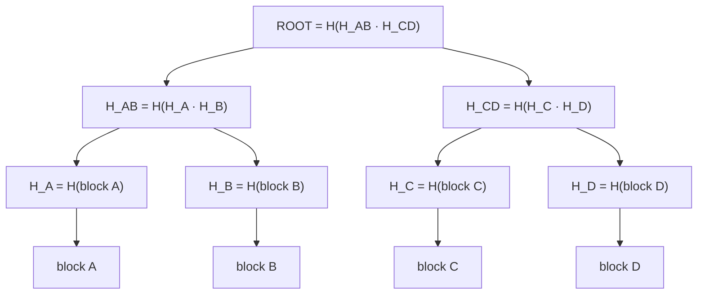
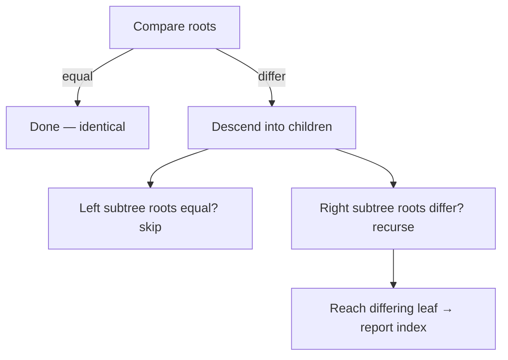

# Merkle Tree (Hash Tree) — Junior Level

> **Read time: ~45 minutes** · **Audience:** Programmers who know what a hash function is (or are willing to take "a function that turns any data into a fixed-size fingerprint" on faith), understand binary trees, and want to learn the data structure that lets Bitcoin, Git, IPFS, and Cassandra verify and compare gigabytes of data by exchanging a single 32-byte number.

A **Merkle tree** — also called a **hash tree** — is a binary tree in which **every leaf is the hash of a block of data**, and **every internal node is the hash of its two children's hashes concatenated together**. The single hash at the very top, the **root hash** (or **Merkle root**), is a fingerprint that commits to *all* of the underlying data at once. Change one bit anywhere in any block, and the root hash changes completely. That one property — a tiny, fixed-size value that summarizes an arbitrarily large dataset and detects any tampering — is what makes Merkle trees the backbone of blockchains, distributed databases, version control, and peer-to-peer file sharing.

This document builds a Merkle tree from scratch on a small example, shows how the root detects tampering, and introduces the single most important Merkle-tree operation: the **Merkle proof** (also called an **authentication path** or **inclusion proof**), which lets someone prove that a specific block is part of the tree by revealing only **O(log n)** hashes instead of the whole dataset.

---

## Table of Contents

1. [Introduction — One Number That Commits to Everything](#introduction)
2. [Prerequisites](#prerequisites)
3. [Glossary](#glossary)
4. [Core Concepts — Leaves, Parents, Root](#core-concepts)
5. [Big-O Summary](#big-o)
6. [Real-World Analogies](#analogies)
7. [Pros and Cons (vs a Flat Hash of Everything)](#pros-cons)
8. [Step-by-Step Walkthrough on Four Blocks](#walkthrough)
9. [Code Examples — Go, Java, Python](#code-examples)
10. [Coding Patterns — Build, Root, Tamper-Check](#patterns)
11. [Error Handling](#errors)
12. [Performance Tips](#performance-tips)
13. [Best Practices](#best-practices)
14. [Edge Cases & Pitfalls](#edge-cases)
15. [Common Mistakes](#common-mistakes)
16. [Cheat Sheet](#cheat-sheet)
17. [Visual Animation Reference](#animation)
18. [Summary](#summary)
19. [Further Reading](#further-reading)

---

<a name="introduction"></a>
## 1. Introduction — One Number That Commits to Everything

Suppose you download a 4 GB Linux ISO from a mirror you do not fully trust. How do you know you got the *right* bytes, with nothing corrupted or maliciously swapped? The classic answer is: the official site publishes a **SHA-256 hash** of the file, you hash your download, and you compare. If the two 32-byte hashes match, your copy is authentic.

That works, but it has two weaknesses:

1. **All-or-nothing.** If one bit is wrong, the hash tells you "something is wrong" but not *where*. You must re-download the entire 4 GB.
2. **No partial verification.** If you only have part of the file (say you are streaming it, or fetching it block-by-block from many peers like BitTorrent), you cannot verify any individual block until you have the whole thing.

A **Merkle tree** fixes both. Instead of hashing the whole file as one blob, we:

1. **Split the data into blocks** (e.g., 256 KB each).
2. **Hash each block** → these hashes become the **leaves**.
3. **Pair up the leaves and hash each pair** → these become the next level up.
4. **Repeat** until a single hash remains: the **Merkle root**.



Now the magic:

- **The root still commits to everything.** Flip one bit in block C and `H_C` changes, so `H_CD` changes, so the root changes. The official site only needs to publish the **root** (32 bytes), exactly like before.
- **But now you can verify any single block** with a tiny **proof**. To prove block C is genuine, you need only: block C itself, its sibling `H_D`, and the sibling on the next level `H_AB`. From those you recompute `H_C → H_CD → root` and check it against the trusted root. That is **3 hashes for 4 blocks**, and in general **log₂ n hashes for n blocks**. For a million blocks, that is **20 hashes** — not a million.

This is the core idea. The rest of this document makes it concrete in code, and the higher-level documents (`middle.md`, `senior.md`, `professional.md`) explain why blockchains, Git, IPFS, and distributed databases are built on exactly this.

The structure is named after **Ralph Merkle**, who patented it in 1979 as part of his work on digital signatures and hash-based cryptography.

> **Cross-link:** A close cousin, the **Merkle–Patricia trie**, combines this hashing idea with a radix/Patricia trie to allow *keyed* lookups (used in Ethereum). See `24-patricia-trie-radix` in this section and `senior.md` here.

---

<a name="prerequisites"></a>
## 2. Prerequisites

To follow along you should be comfortable with:

1. **Cryptographic hash functions (at a basic level).** A hash function like SHA-256 takes any input and produces a fixed-size output (256 bits = 32 bytes). The same input always yields the same output; different inputs almost certainly yield different outputs. You do **not** need to know how SHA-256 works internally.
2. **Binary trees.** Nodes, leaves, parents, children, height ≈ log₂ n for a balanced tree.
3. **Byte arrays / strings.** We concatenate and hash raw bytes. Knowing that `"ab" + "c"` differs from `"a" + "bc"` matters here.
4. **Arrays and recursion.** We store levels in arrays and occasionally recurse.

If hashing is brand-new, read the `05-hash-tables` junior file first for the intuition behind hash functions, then come back. We use hashing for *integrity* here, not for bucketing.

---

<a name="glossary"></a>
## 3. Glossary

| Term | Definition |
|------|-----------|
| **Hash function** | A function `H(x)` mapping arbitrary bytes to a fixed-size digest (e.g., 32 bytes for SHA-256). |
| **Digest / hash** | The fixed-size output of a hash function. |
| **Block / chunk** | One unit of the original data (e.g., a 256 KB slice of a file, or one transaction). |
| **Leaf** | A bottom node of the tree, holding the hash of one data block: `leaf = H(block)`. |
| **Internal node** | A non-leaf node holding `H(left_child_hash · right_child_hash)` where `·` means concatenation. |
| **Merkle root / root hash** | The single hash at the top; a fingerprint committing to all blocks. |
| **Merkle proof / authentication path / inclusion proof** | The set of sibling hashes needed to recompute the root from one leaf. |
| **Sibling** | The other child of a node's parent. Proofs are lists of siblings along the path to the root. |
| **Tamper detection** | Noticing that data changed because the recomputed root no longer matches the trusted root. |
| **Concatenation (`·`)** | Joining two byte strings end-to-end before hashing: `H(a · b)`. |
| **Domain separation** | Prefixing leaf vs internal hashes differently (e.g., `H(0x00 · block)` for leaves, `H(0x01 · l · r)` for nodes) to prevent certain attacks (see `senior.md`). |
| **Collision** | Two different inputs producing the same hash; assumed infeasible for a good hash. |
| **Balanced tree** | A tree where all leaves are at (about) the same depth; height ≈ log₂ n. |

---

<a name="core-concepts"></a>
## 4. Core Concepts — Leaves, Parents, Root

### 4.1 Leaves are hashes of data

The bottom level of a Merkle tree is **not** the data itself — it is the **hash of each block**:

```
leaf_i = H(block_i)
```

Why hash the blocks instead of storing them in the tree? Two reasons: hashes are small and fixed-size (so the tree is uniform), and hashing is what gives us tamper detection. If you stored raw blocks at the leaves you would just have... the original file, plus a tree on top.

### 4.2 Internal nodes hash their children

Every node above the leaves is the hash of its two children concatenated:

```
parent = H(left_child · right_child)
```

The `·` is **byte concatenation**, and **order matters**: `H(L · R)` is generally different from `H(R · L)`. This is why, when you build a proof, you must remember whether each sibling was on the **left** or the **right**.

### 4.3 The root commits to everything

Keep pairing and hashing until one node remains. That is the **Merkle root**. Because each hash feeds into the one above it, the root depends on every single block. This is called a **commitment**: publishing the root is a promise about the whole dataset that you cannot later wriggle out of, because you would need to find a hash collision to change any block without changing the root.

### 4.4 Tamper detection in one comparison

To check whether a dataset is intact:

1. Rebuild the Merkle tree from the (possibly tampered) blocks.
2. Compare the new root to the trusted root.
3. Equal → data is intact. Different → something changed.

And crucially, by **walking down** from the root comparing subtree hashes, you can **localize** which block changed in O(log n) comparisons — you do not have to scan every block. This is the basis of efficient **diff/sync** between two replicas (covered in `middle.md`).

### 4.5 Handling an odd number of leaves

What if you have 5 blocks, not a clean power of two? The pairing has a leftover. Two common conventions:

| Convention | Rule | Used by |
|---|---|---|
| **Duplicate last** | If a level has an odd count, duplicate the last node and pair it with itself. | Bitcoin |
| **Promote (carry up)** | An unpaired node is promoted unchanged to the next level. | Many libraries, Certificate Transparency (RFC 6962 uses a precise variant) |

We use **duplicate-last** in the junior examples because it keeps the tree perfectly binary and is the easiest to reason about. (Bitcoin's duplicate-last has a subtle security wrinkle we discuss in `professional.md`.)

### 4.6 The authentication path (preview)

To prove a leaf belongs to the tree, you provide every **sibling** along the path from that leaf up to the root. The verifier hashes the leaf, then folds in each sibling (left or right, in order) until they reach a root — and compares it to the trusted root. We dedicate most of `middle.md` to this; here we just plant the seed.

---

<a name="big-o"></a>
## 5. Big-O Summary

Let `n` = number of data blocks (leaves). Let `h` = output size of the hash (constant, e.g., 32 bytes). Treat one hash computation as O(1) "for the structure" (it is really O(block size), but that is independent of `n`).

| Operation | Time | Space | Notes |
|---|---|---|---|
| **Build tree** | O(n) hashes | O(n) | `n` leaf hashes + `n−1` internal hashes ≈ `2n` total |
| **Get root** | O(1) | — | It is already stored at the top after build |
| **Update one leaf** | O(log n) | O(1) extra | Re-hash only the path from that leaf to the root |
| **Generate proof for a leaf** | O(log n) | O(log n) | One sibling per level |
| **Verify a proof** | O(log n) | O(1) | Fold the leaf hash up through the siblings |
| **Compare two trees (find diffs)** | O(d · log n) | O(d) | `d` = number of differing leaves; descend only where roots differ |
| **Memory for the tree** | O(n) hashes | — | Roughly `2n · h` bytes |

The headline: **everything interesting is O(log n)** — proofs, updates, verification. For `n = 1,000,000` blocks, that is ~20 hashes. That logarithmic cost is the whole point.

---

<a name="analogies"></a>
## 6. Real-World Analogies

### 6.1 A family tree of fingerprints
Imagine every person has a fingerprint, and each parent's "fingerprint" is computed by smushing together their two children's fingerprints and re-fingerprinting the result. The single ancestor at the top has a fingerprint that depends on everyone below. If any descendant's fingerprint changes, the change ripples all the way up. To prove "this person is in the family," you only show the chain of fingerprints from them up to the known ancestor — not the whole family.

### 6.2 Tamper-evident packaging
A Merkle root is like the tamper-evident seal on a medicine bottle: tiny, cheap to check, and broken the instant anyone touches the contents. You do not inspect every pill; you glance at the seal.

### 6.3 Receipt with a checksum line
Some receipts print a final "verification code" computed from all the line items. If a fraudster edits one line, the code no longer matches. A Merkle proof goes further: it lets you prove *your specific line* is on the receipt by showing only a few intermediate codes, without revealing every other customer's purchases.

### 6.4 Where analogies break down
Real hash functions are **one-way** (you cannot reverse a fingerprint back to the person) and **collision-resistant** (you cannot find two people with the same fingerprint). Family fingerprints in real life are not. The security of Merkle trees rests entirely on those cryptographic properties — see `professional.md`.

---

<a name="pros-cons"></a>
## 7. Pros and Cons (vs a Flat Hash of Everything)

The natural alternative is a **flat hash**: just `H(block_0 · block_1 · … · block_{n−1})`, one digest over the concatenation of all blocks.

### Pros of a Merkle tree

- **Partial verification.** Prove any single block belongs with **O(log n)** hashes. A flat hash forces you to have *all* blocks to verify *anything*.
- **Cheap localized updates.** Change one block → re-hash only the **O(log n)** nodes on its path. A flat hash must be recomputed over **all n** blocks.
- **Efficient diff/sync.** Two replicas compare roots; if they differ, they recurse only into differing subtrees, exchanging **O(d log n)** hashes to find the `d` differences instead of streaming everything.
- **Streaming / out-of-order download.** Fetch and verify blocks from many peers independently (BitTorrent, IPFS).
- **Same 32-byte commitment.** The root is just as small as a flat hash, so you lose nothing on the "publish one fingerprint" front.

### Cons of a Merkle tree

- **More storage and computation up front.** You compute ~`2n` hashes and store ~`2n` digests, vs `1` hash for the flat approach.
- **More complex.** Tree construction, odd-leaf handling, left/right ordering, and proof generation are all places to get bugs.
- **Proof overhead per query.** Each proof is `log n` hashes (e.g., 20 × 32 bytes = 640 bytes for a million leaves). Cheap, but not free.

### Comparison table

| Property | Flat hash `H(all data)` | Merkle tree |
|---|---|---|
| Commitment size | 32 bytes | 32 bytes (the root) |
| Verify one block | Must have all data | O(log n) hashes |
| Update one block | Re-hash all n blocks | Re-hash log n nodes |
| Find diffs between two copies | All-or-nothing | O(d log n) |
| Build cost | O(n) (1 pass) | O(n) (~2n hashes) |
| Storage | O(1) | O(n) |
| Best for | "Is this whole file correct?" | "Prove/sync/update parts of a big dataset" |

**Use a Merkle tree when:** you need to verify, update, or synchronize *parts* of a large dataset, or let untrusting parties prove inclusion to each other.
**Use a flat hash when:** the data is small, always handled as one unit, and never partially verified.

---

<a name="walkthrough"></a>
## 8. Step-by-Step Walkthrough on Four Blocks

Let us use four blocks of data and a tiny **toy hash** so the numbers are readable. (In real systems the hash is SHA-256; the *structure* is identical.)

Toy hash for this section: `h(s) = (sum of byte values of s) mod 1000`, written as a 3-digit number. **Do not use this in production** — it is laughably weak. It only exists so you can do the arithmetic by hand.

Blocks: `A="a"`, `B="b"`, `C="c"`, `D="d"`.
Byte values: `'a'=97, 'b'=98, 'c'=99, 'd'=100`.

### 8.1 Hash the leaves

```
H_A = h("a") = 97
H_B = h("b") = 98
H_C = h("c") = 99
H_D = h("d") = 100
```

### 8.2 Hash the pairs (concatenate the digests as strings, then hash)

```
H_AB = h("097" + "098") = h("097098")
     = (0+9+7+0+9+8 as digit chars... )  -- for readability use char codes:
       '0'=48,'9'=57,'7'=55,'0'=48,'9'=57,'8'=56  → 321 → 321
H_CD = h("099" + "100") = h("099100")
       '0','9','9','1','0','0' = 48+57+57+49+48+48 = 307 → 307
```

(The exact digits do not matter; what matters is the *shape*.)

### 8.3 Hash the root

```
ROOT = h("321" + "307") = h("321307")
       '3','2','1','3','0','7' = 51+50+49+51+48+55 = 304 → 304
```

So our tree is:

```
                 ROOT = 304
                /          \
         H_AB = 321      H_CD = 307
          /     \          /     \
       H_A=97  H_B=98   H_C=99  H_D=100
        |        |        |        |
       "a"     "b"      "c"      "d"
```

### 8.4 Tamper detection

Now an attacker changes block C from `"c"` to `"x"` (`'x'=120`):

```
H_C' = h("x") = 120          (was 99)
H_CD' = h("120" + "100") = h("120100")
        '1','2','0','1','0','0' = 49+50+48+49+48+48 = 292 → 292   (was 307)
ROOT' = h("321" + "292") = h("321292")
        '3','2','1','2','9','2' = 51+50+49+50+57+50 = 307 → 307   (was 304)
```

The root changed from **304** to **307**. Anyone holding the trusted root **304** immediately sees the mismatch — **the data was tampered with**. And by walking down (`H_AB` still 321 ✓, `H_CD` now 292 ✗ → descend right; `H_C` now 120 ✗, `H_D` still 100 ✓), they pinpoint **block C** in 2 comparisons instead of scanning all four blocks.

### 8.5 A Merkle proof for block C

To prove block C is in the *original* tree (root 304), the prover supplies the **authentication path**: the siblings along C's route to the root.

- C's leaf hash sibling: `H_D = 100` (on the **right**)
- Next level sibling: `H_AB = 321` (on the **left**)

The verifier, who trusts root **304**, does:

```
step 0: hash C            → H_C  = h("c") = 99
step 1: sibling H_D (right) → H_CD = h("099" + "100") = 307
step 2: sibling H_AB (left) → ROOT = h("321" + "307") = 304
compare 304 == trusted 304 ✓  → block C is authentic
```

The verifier never saw blocks A, B, or D. They folded **2 sibling hashes** (= log₂ 4) to confirm inclusion. That is the Merkle proof, and it is the operation everything in `middle.md` builds on.

---

<a name="code-examples"></a>
## 9. Code Examples — Go, Java, Python

These use **real SHA-256**. The tree stores level-by-level. We use the **duplicate-last** convention for odd levels. Functions: build, root, generate proof, verify proof.

### 9.1 Go

```go
package merkle

import (
	"bytes"
	"crypto/sha256"
)

// hash returns SHA-256 of the input bytes.
func hash(b []byte) []byte {
	s := sha256.Sum256(b)
	return s[:]
}

// hashLeaf hashes a raw data block into a leaf digest.
func hashLeaf(block []byte) []byte { return hash(block) }

// hashPair hashes the concatenation of two child digests (order matters).
func hashPair(l, r []byte) []byte {
	return hash(append(append([]byte{}, l...), r...))
}

// Tree stores every level: levels[0] = leaves, last level = [root].
type Tree struct {
	levels [][][]byte
}

// Build constructs a Merkle tree from data blocks (duplicate-last for odd counts).
func Build(blocks [][]byte) *Tree {
	if len(blocks) == 0 {
		return &Tree{levels: [][][]byte{{hash([]byte{})}}}
	}
	leaves := make([][]byte, len(blocks))
	for i, b := range blocks {
		leaves[i] = hashLeaf(b)
	}
	levels := [][][]byte{leaves}
	for len(levels[len(levels)-1]) > 1 {
		cur := levels[len(levels)-1]
		var next [][]byte
		for i := 0; i < len(cur); i += 2 {
			left := cur[i]
			right := left // duplicate-last if odd
			if i+1 < len(cur) {
				right = cur[i+1]
			}
			next = append(next, hashPair(left, right))
		}
		levels = append(levels, next)
	}
	return &Tree{levels: levels}
}

// Root returns the Merkle root.
func (t *Tree) Root() []byte { return t.levels[len(t.levels)-1][0] }

// ProofStep is one sibling on the authentication path.
type ProofStep struct {
	Hash    []byte
	IsRight bool // true if the sibling sits to the RIGHT of the running hash
}

// Proof returns the authentication path for the leaf at index idx.
func (t *Tree) Proof(idx int) []ProofStep {
	var path []ProofStep
	for level := 0; level < len(t.levels)-1; level++ {
		cur := t.levels[level]
		var sibIdx int
		var isRight bool
		if idx%2 == 0 { // we are a left child; sibling is to the right
			sibIdx, isRight = idx+1, true
			if sibIdx >= len(cur) {
				sibIdx = idx // duplicate-last: sibling is ourselves
			}
		} else { // we are a right child; sibling is to the left
			sibIdx, isRight = idx-1, false
		}
		path = append(path, ProofStep{Hash: cur[sibIdx], IsRight: isRight})
		idx /= 2
	}
	return path
}

// Verify recomputes the root from a block and its proof, comparing to root.
func Verify(block []byte, proof []ProofStep, root []byte) bool {
	running := hashLeaf(block)
	for _, step := range proof {
		if step.IsRight {
			running = hashPair(running, step.Hash)
		} else {
			running = hashPair(step.Hash, running)
		}
	}
	return bytes.Equal(running, root)
}
```

### 9.2 Java

```java
import java.security.MessageDigest;
import java.util.ArrayList;
import java.util.Arrays;
import java.util.List;

public final class MerkleTree {
    private final List<List<byte[]>> levels = new ArrayList<>();

    private static byte[] sha256(byte[] b) {
        try {
            return MessageDigest.getInstance("SHA-256").digest(b);
        } catch (Exception e) {
            throw new RuntimeException(e);
        }
    }

    private static byte[] hashLeaf(byte[] block) { return sha256(block); }

    private static byte[] hashPair(byte[] l, byte[] r) {
        byte[] combined = new byte[l.length + r.length];
        System.arraycopy(l, 0, combined, 0, l.length);
        System.arraycopy(r, 0, combined, l.length, r.length);
        return sha256(combined);
    }

    /** Build a Merkle tree from data blocks (duplicate-last for odd counts). */
    public MerkleTree(List<byte[]> blocks) {
        List<byte[]> leaves = new ArrayList<>();
        if (blocks.isEmpty()) {
            leaves.add(sha256(new byte[0]));
        } else {
            for (byte[] b : blocks) leaves.add(hashLeaf(b));
        }
        levels.add(leaves);
        while (levels.get(levels.size() - 1).size() > 1) {
            List<byte[]> cur = levels.get(levels.size() - 1);
            List<byte[]> next = new ArrayList<>();
            for (int i = 0; i < cur.size(); i += 2) {
                byte[] left = cur.get(i);
                byte[] right = (i + 1 < cur.size()) ? cur.get(i + 1) : left;
                next.add(hashPair(left, right));
            }
            levels.add(next);
        }
    }

    public byte[] root() {
        List<byte[]> top = levels.get(levels.size() - 1);
        return top.get(0);
    }

    /** One sibling on the authentication path. */
    public record ProofStep(byte[] hash, boolean isRight) {}

    public List<ProofStep> proof(int idx) {
        List<ProofStep> path = new ArrayList<>();
        for (int level = 0; level < levels.size() - 1; level++) {
            List<byte[]> cur = levels.get(level);
            int sibIdx;
            boolean isRight;
            if (idx % 2 == 0) {
                sibIdx = idx + 1;
                isRight = true;
                if (sibIdx >= cur.size()) sibIdx = idx; // duplicate-last
            } else {
                sibIdx = idx - 1;
                isRight = false;
            }
            path.add(new ProofStep(cur.get(sibIdx), isRight));
            idx /= 2;
        }
        return path;
    }

    public static boolean verify(byte[] block, List<ProofStep> proof, byte[] root) {
        byte[] running = hashLeaf(block);
        for (ProofStep step : proof) {
            running = step.isRight()
                    ? hashPair(running, step.hash())
                    : hashPair(step.hash(), running);
        }
        return Arrays.equals(running, root);
    }
}
```

### 9.3 Python

```python
import hashlib
from dataclasses import dataclass


def sha256(b: bytes) -> bytes:
    return hashlib.sha256(b).digest()


def hash_leaf(block: bytes) -> bytes:
    return sha256(block)


def hash_pair(left: bytes, right: bytes) -> bytes:
    # Order matters: H(left || right) != H(right || left).
    return sha256(left + right)


@dataclass
class ProofStep:
    hash: bytes
    is_right: bool   # True if the sibling sits to the RIGHT of the running hash


class MerkleTree:
    """Merkle tree with duplicate-last handling for odd levels."""

    def __init__(self, blocks: list[bytes]):
        if not blocks:
            leaves = [sha256(b"")]
        else:
            leaves = [hash_leaf(b) for b in blocks]
        self.levels: list[list[bytes]] = [leaves]
        while len(self.levels[-1]) > 1:
            cur = self.levels[-1]
            nxt = []
            for i in range(0, len(cur), 2):
                left = cur[i]
                right = cur[i + 1] if i + 1 < len(cur) else left  # duplicate-last
                nxt.append(hash_pair(left, right))
            self.levels.append(nxt)

    def root(self) -> bytes:
        return self.levels[-1][0]

    def proof(self, idx: int) -> list[ProofStep]:
        path: list[ProofStep] = []
        for level in range(len(self.levels) - 1):
            cur = self.levels[level]
            if idx % 2 == 0:               # left child -> sibling on the right
                sib_idx, is_right = idx + 1, True
                if sib_idx >= len(cur):
                    sib_idx = idx           # duplicate-last: pair with self
            else:                           # right child -> sibling on the left
                sib_idx, is_right = idx - 1, False
            path.append(ProofStep(cur[sib_idx], is_right))
            idx //= 2
        return path


def verify(block: bytes, proof: list[ProofStep], root: bytes) -> bool:
    running = hash_leaf(block)
    for step in proof:
        if step.is_right:
            running = hash_pair(running, step.hash)
        else:
            running = hash_pair(step.hash, running)
    return running == root


if __name__ == "__main__":
    data = [b"alice", b"bob", b"carol", b"dave"]
    tree = MerkleTree(data)
    print("root:", tree.root().hex()[:16], "...")
    pf = tree.proof(2)                       # prove "carol"
    print("proof length:", len(pf))
    print("valid  :", verify(b"carol", pf, tree.root()))   # True
    print("tampered:", verify(b"eve", pf, tree.root()))    # False
```

**What it does:** builds a tree over four names, produces a proof that `"carol"` (index 2) is included, and verifies it. Swapping in `"eve"` fails verification because the recomputed root no longer matches.
**Run:** `go test ./...` (with a test) | `javac MerkleTree.java` | `python merkle.py`

---

<a name="patterns"></a>
## 10. Coding Patterns — Build, Root, Tamper-Check

### Pattern 1: Level-by-level build

**Intent:** Construct the tree bottom-up, one level at a time, until a single root remains.

```text
levels = [ [H(block) for each block] ]      # leaf level
while len(top level) > 1:
    pair adjacent nodes (duplicate last if odd)
    new level = [ H(left · right) for each pair ]
    append new level
root = levels[-1][0]
```

### Pattern 2: Fold-up verification

**Intent:** Verify a proof by starting at the leaf and folding in siblings until you reach a root.

```text
running = H(block)
for each (sibling, side) in proof:
    if side == RIGHT: running = H(running · sibling)
    else:             running = H(sibling · running)
return running == trusted_root
```

### Pattern 3: Tamper localization (binary descent)

**Intent:** Given two roots that differ, find *which* leaves differ in O(d log n).

```text
compare(nodeA, nodeB):
    if hash(nodeA) == hash(nodeB): return []     # identical subtree, skip
    if leaf: return [this index]                  # found a differing block
    return compare(left)  ++  compare(right)      # recurse only into mismatches
```



---

<a name="errors"></a>
## 11. Error Handling

| Error | Cause | Fix |
|---|---|---|
| Proof verifies for wrong data | Forgot left/right ordering | Store and honor `isRight` per step |
| Root mismatch on valid data | Inconsistent odd-leaf rule between builder and verifier | Both sides must use the **same** convention (duplicate-last vs promote) |
| Index out of range on `proof(idx)` | `idx >= n` or negative | Validate `0 <= idx < n` before generating |
| Empty input crash | Building over zero blocks | Define a convention (e.g., root = `H("")`) and special-case it |
| Different roots on identical data | Different hash function or encoding | Pin the exact hash (SHA-256) and byte encoding |
| Second-preimage trickery | No domain separation between leaf and node hashes | Prefix leaves/nodes differently (see `senior.md`) |

---

<a name="performance-tips"></a>
## 12. Performance Tips

1. **Hash blocks once and cache the leaves.** Rebuilding from raw data every time wastes the dominant cost.
2. **For a single changed leaf, update only its path** — O(log n) re-hashes — instead of rebuilding.
3. **Reuse a single hasher object** where the language allows (`MessageDigest`, `hashlib`) to avoid allocation churn.
4. **Pick a block size that balances** proof size (smaller blocks → more leaves → longer proofs) against per-block overhead.
5. **Avoid copying digests** unnecessarily; concatenate into a preallocated buffer when hashing pairs.
6. **Store levels as flat arrays** for cache locality if you build millions of trees.
7. **Parallelize the leaf-hashing pass** — leaf hashes are independent and embarrassingly parallel.

---

<a name="best-practices"></a>
## 13. Best Practices

- **Pin one hash function and one encoding** in writing. Interop bugs come from silent mismatches.
- **Use domain separation** (`senior.md`) for any tree exposed to adversaries — prefix leaf vs internal hashes.
- **Document the odd-leaf rule.** "Duplicate-last like Bitcoin" or "promote like RFC 6962" must be explicit.
- **Compare hashes in constant time** when verifying secrets-adjacent data, to avoid timing leaks.
- **Test proofs at boundaries:** first leaf, last leaf, single-leaf tree, odd counts.
- **Keep blocks immutable** once hashed; mutate-then-forget-to-rehash is a classic bug.
- **Verify against a trusted root only.** A proof against an attacker-supplied root proves nothing.

---

<a name="edge-cases"></a>
## 14. Edge Cases & Pitfalls

| Case | Input | Expected behavior |
|---|---|---|
| Single block | `[A]` | Root = `H(A)`; proof is empty; verify trivially passes |
| Two blocks | `[A, B]` | Root = `H(H(A) · H(B))`; one-step proof |
| Odd count | 5 blocks | Duplicate-last pads to even at each odd level |
| Empty input | `[]` | Use a defined sentinel root (e.g., `H("")`) |
| Duplicate blocks | `[A, A]` | Valid; both leaves equal `H(A)` |
| Verify wrong index proof | proof(2) used for block at index 1 | Fails (different siblings) |
| Tampered single bit | flip 1 bit in block | Root changes; descent localizes it |
| Very deep tree | n = 2^20 | Proof = 20 hashes; still tiny |

---

<a name="common-mistakes"></a>
## 15. Common Mistakes

1. **Ignoring left/right order.** `H(L · R) ≠ H(R · L)`; a proof must record which side each sibling is on.
2. **Mismatched odd-leaf conventions.** Builder duplicates, verifier promotes → roots never match.
3. **Hashing the raw block at internal nodes.** Internal nodes hash **child hashes**, not data.
4. **No domain separation.** Lets an attacker pass an internal node off as a leaf (second-preimage class attack).
5. **Trusting a proof against an untrusted root.** The root *is* the trust anchor; it must come from a trusted source.
6. **Rebuilding the whole tree on every update** instead of patching the O(log n) path.
7. **Encoding drift.** Hashing `"123"` (string) vs the bytes `0x01 0x02 0x03` gives different roots; pin it.
8. **Off-by-one when an odd level's last node has no sibling.** Decide duplicate vs promote and code it carefully.
9. **Assuming the tree is always a perfect power of two.** Real inputs rarely are.
10. **Comparing digests with `==` on objects** instead of byte-wise equality (language-dependent footgun).

---

<a name="cheat-sheet"></a>
## 16. Cheat Sheet

```
DEFINITIONS
    leaf_i      = H(block_i)
    parent      = H(left · right)          # · = concat, ORDER MATTERS
    root        = top of the tree (commits to all blocks)

BUILD  (duplicate-last)
    level = [H(b) for b in blocks]
    while len(level) > 1:
        level = [H(level[i] · level[i+1 or i]) for i in 0,2,4,...]
    root = level[0]

PROOF for leaf idx
    path = []
    for each level (bottom→top):
        sibling = idx XOR 1 (clamp to self if missing)
        path.append( (sibling_hash, idx is left ? RIGHT : LEFT) )
        idx //= 2

VERIFY
    h = H(block)
    for (sib, side) in path:
        h = side==RIGHT ? H(h · sib) : H(sib · h)
    return h == trusted_root

COMPLEXITY (n leaves)
    build  O(n)        update one leaf  O(log n)
    proof  O(log n)    verify           O(log n)
    diff   O(d log n)  memory           O(n)

CONVENTIONS TO PIN
    hash function (SHA-256), encoding, odd-leaf rule, domain separation
```

---

<a name="animation"></a>
## 17. Visual Animation Reference

See `animation.html` in this folder. It renders a Merkle tree on a dark canvas with leaves at the bottom and the root at the top, each node showing a short hash. You can:

- **Build** a tree from custom blocks and watch leaf hashes fold up into the root.
- **Tamper** with a leaf and watch the changed hashes propagate up the path to a new root (highlighted in red).
- **Prove** a leaf: the authentication-path siblings light up, and a side panel folds the running hash step-by-step until it matches (green) or fails to match (red) the trusted root.

A stat strip tracks the number of leaves, tree height, last operation, and hashes computed. Stepping through a proof once makes the O(log n) authentication path permanent in your memory.

---

<a name="summary"></a>
## 18. Summary

- A **Merkle tree** hashes data blocks into **leaves**, then repeatedly hashes pairs of hashes up to a single **root** that commits to all the data.
- Changing any block changes the root, giving cheap **tamper detection**; comparing subtree hashes **localizes** the change in O(log n).
- A **Merkle proof** (authentication path) proves a single block's inclusion using only **O(log n)** sibling hashes, without revealing the rest of the data.
- Build is **O(n)**; proof, verify, and single-leaf update are all **O(log n)**; storage is **O(n)**.
- Order matters (`H(L·R) ≠ H(R·L)`), odd-leaf conventions must be consistent, and adversarial use requires **domain separation**.
- Versus a flat hash, Merkle trees uniquely enable **partial verification, cheap updates, and efficient diff/sync** — which is why blockchains, Git, IPFS, and distributed databases all use them.

---

<a name="further-reading"></a>
## 19. Further Reading

- **Ralph C. Merkle**, *A Digital Signature Based on a Conventional Encryption Function* (CRYPTO '87) — the origin of the construction.
- **Satoshi Nakamoto**, *Bitcoin: A Peer-to-Peer Electronic Cash System* — Section 7, "Reclaiming Disk Space," uses a Merkle tree of transactions.
- **RFC 6962** — Certificate Transparency; a precise, security-reviewed Merkle tree spec with domain separation.
- **CP-Algorithms / Wikipedia "Merkle tree"** — accessible diagrams and variants.
- `24-patricia-trie-radix` in this section — the keyed cousin used in Ethereum's Merkle–Patricia trie.
- Continue with **`middle.md`** for Merkle proofs in depth, diff/sync (anti-entropy), the iterative proof generator, and Merkle-tree-vs-flat-hash trade-offs in production systems.

---

**Next step:** [middle.md](./middle.md) — Merkle proofs as authentication paths, O(log n) inclusion, efficient diff/sync between replicas, and when a Merkle tree beats a flat hash.
