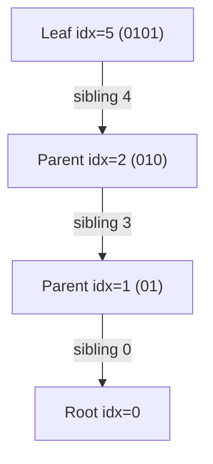
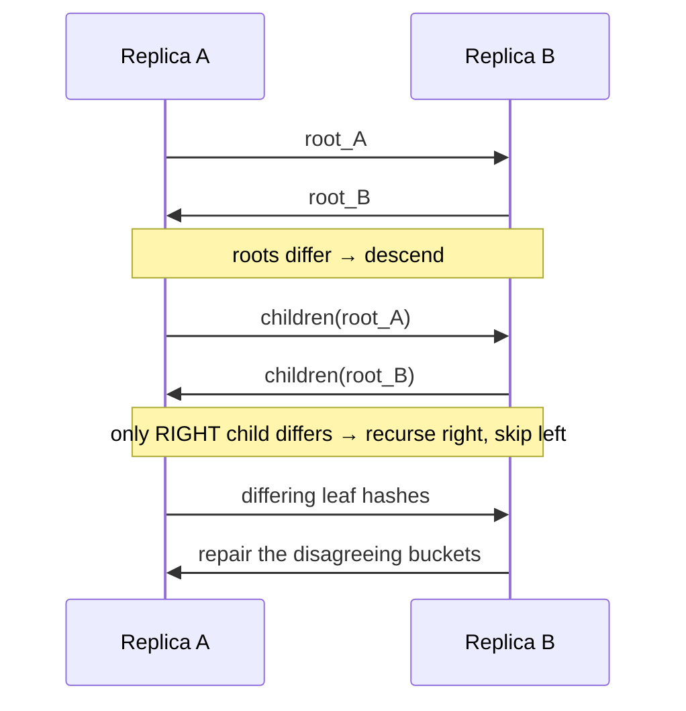
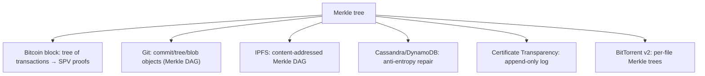

# Merkle Tree (Hash Tree) — Middle Level

> **Read time: ~55 minutes** · **Audience:** Engineers who can already build a Merkle tree and verify a proof (see `junior.md`), and now want to understand *why* the authentication path works, *when* a Merkle tree beats the alternatives, and *how* it powers efficient synchronization (anti-entropy) between replicas.

At the junior level a Merkle tree was "hash the blocks, pair-and-hash up to a root, compare roots to detect tampering." At the middle level we treat the tree as a **commitment scheme with cheap membership proofs**. The single most important consequence is the **Merkle proof** — an authentication path of `O(log n)` sibling hashes that lets a verifier holding only a trusted root confirm that a specific block is part of the dataset, without holding the rest of it. The second is **diff/sync**: two replicas that each have a Merkle tree can find exactly which blocks differ by exchanging `O(d log n)` hashes instead of streaming the entire dataset — the technique Cassandra and DynamoDB call **anti-entropy repair**.

---

## Table of Contents

1. [Introduction — From "Detect Tampering" to "Prove and Sync"](#introduction)
2. [Deeper Concepts — Commitment, Authentication Path, Soundness](#deeper-concepts)
3. [Comparison with Alternatives](#comparison)
4. [Merkle Proofs in Depth](#proofs)
5. [Efficient Diff / Sync (Anti-Entropy)](#diff-sync)
6. [Tree and Hashing Applications](#applications)
7. [Incremental Updates and Rebalancing](#updates)
8. [Code Examples — Go, Java, Python](#code-examples)
9. [Error Handling](#errors)
10. [Performance Analysis](#performance)
11. [Best Practices](#best-practices)
12. [Visual Animation Reference](#animation)
13. [Summary](#summary)

---

<a name="introduction"></a>
## 1. Introduction — From "Detect Tampering" to "Prove and Sync"

A Merkle tree solves three closely related problems that a flat hash cannot:

1. **Inclusion proof.** "Prove that block *X* is one of the committed blocks" — with a proof whose size is `O(log n)`, not `O(n)`.
2. **Incremental update.** "Block *X* changed; give me the new commitment" — touching only the `O(log n)` nodes on *X*'s path.
3. **Set reconciliation (anti-entropy).** "Two copies of a dataset drifted apart; find the differences cheaply" — exchanging `O(d log n)` hashes for `d` differing blocks.

The unifying insight is that the root is a **binding commitment**: under the assumption that the hash function is collision-resistant, you cannot produce two different datasets with the same root, and you cannot forge a proof for a block that is not actually in the committed set. So the root becomes a compact, transferable anchor of trust. A light client (a phone wallet, a CT auditor, a Git fetch) can hold *just the root* and still verify claims about a dataset that lives elsewhere.

This document makes the proof mechanism rigorous-enough-for-engineering, derives its `O(log n)` cost, and then applies the same machinery to diff/sync. The fully formal soundness argument (collision resistance ⇒ unforgeable proofs) is in `professional.md`; the systems that deploy these ideas at scale are in `senior.md`.

---

<a name="deeper-concepts"></a>
## 2. Deeper Concepts — Commitment, Authentication Path, Soundness

### 2.1 The Merkle tree as a commitment

A **commitment scheme** lets you publish a short value `c` that "locks in" some data `D`, such that later you can *open* `c` to reveal `D` and nobody can convince a verifier that `c` committed to some different `D'`. A Merkle root is exactly this:

- **Commit:** `c = MerkleRoot(D)` where `D = (block_0, …, block_{n−1})`.
- **Open one position:** reveal `block_i` plus its authentication path; the verifier recomputes the root and checks `== c`.

The scheme is **binding** because forging an opening for a value not in `D` would require a hash collision (two inputs with the same digest somewhere on the path). It is **not hiding** by default — leaf hashes can leak information, and revealed siblings expose neighbors' hashes — which matters for privacy and is addressed by salting/blinding (see `senior.md`).

### 2.2 The authentication path, precisely

For leaf at index `i` in a tree of height `H = ⌈log₂ n⌉`, the authentication path is the sequence of **siblings** of each node on the path from leaf `i` to the root:

```
path(i) = [ sibling(node at level 0 on path),
            sibling(node at level 1 on path),
            ...,
            sibling(node at level H-1 on path) ]
```

Each step also carries a **direction bit**: whether the sibling is the left or right child, so the verifier concatenates in the correct order. There are exactly `H` siblings, hence the proof has `H = O(log n)` hashes.

### 2.3 Why folding up recomputes the root

Define `fold(h, (sib, side))` as `H(sib · h)` if the sibling is on the left, else `H(h · sib)`. Starting from `h₀ = H(block_i)` and folding in each path element yields `h_H`. By construction of the tree, `h_k` equals the actual hash of the ancestor of leaf `i` at level `k`, **provided each sibling is genuine**. Therefore `h_H` equals the genuine root iff the block and all siblings are genuine.

### 2.4 Soundness intuition

If a cheating prover wants the verifier to accept a block `X` that is **not** the committed `block_i`, the fold must still arrive at the trusted root. But that means at some level the prover produced two distinct inputs hashing to the same value (one from the honest tree, one from the forged fold) — a **collision**. Under collision resistance, this is infeasible. Hence: **a proof verifies ⟹ the block really is the committed leaf** (except with negligible probability). The formal version is in `professional.md`.

### 2.5 Second-preimage and the need for domain separation

A naive tree where leaves and internal nodes are hashed identically lets an attacker present an **internal node's two children** as if they were a single "leaf block," because a leaf is `H(block)` and an internal node is `H(L · R)` — same function, no tag. This is a **second-preimage attack** on the tree shape. The fix is **domain separation**: hash leaves as `H(0x00 · block)` and internal nodes as `H(0x01 · L · R)`. We discuss attacks and defenses fully in `senior.md`; here, just know the proof's soundness depends on it.

---

<a name="comparison"></a>
## 3. Comparison with Alternatives

| Attribute | Merkle tree | Flat hash `H(all)` | Hash list (vector of per-block hashes) | Merkle–Patricia trie |
|---|---|---|---|---|
| Commitment size | O(1) (root) | O(1) | O(n) | O(1) (root) |
| Prove one block | O(log n) | impossible (need all) | O(1) but needs full list | O(log n) over key |
| Update one block | O(log n) | O(n) | O(1) local, but commitment is the whole list | O(log n) |
| Keyed lookup (by key, not index) | No (indexed) | No | No | **Yes** |
| Diff two copies | O(d log n) | all-or-nothing | O(n) compare | O(d log n) |
| Membership by content addressing | Yes (Merkle DAG) | No | No | Yes |
| Used by | Bitcoin, Git, IPFS, Cassandra | file checksums | rsync-style | Ethereum state |

**Choose a Merkle tree when:** the data is naturally an *ordered list* of blocks and you need inclusion proofs, cheap updates, or sync.
**Choose a flat hash when:** the dataset is tiny and always handled whole.
**Choose a hash list when:** you genuinely need O(1) per-block proofs and don't mind an O(n) commitment (rare).
**Choose a Merkle–Patricia trie when:** you need to prove inclusion *by key* (a map), not by position — e.g., account state. See `24-patricia-trie-radix` and `senior.md`.

---

<a name="proofs"></a>
## 4. Merkle Proofs in Depth

### 4.1 Anatomy of a proof

A proof for leaf `i` is a list of `(siblingHash, isRight)` pairs, bottom to top. `isRight = true` means "the sibling is the right child, so I am the left child, so concatenate as `H(running · sibling)`." Some libraries instead store the leaf index and derive direction from `index & 1` at each level — equivalent, and slightly smaller on the wire.

### 4.2 Proof size and cost

- **Size:** `H = ⌈log₂ n⌉` hashes. With SHA-256 and `n = 2²⁰`, that is `20 × 32 = 640` bytes. Plus a few bits for directions (or the index).
- **Generation:** O(log n) array lookups if the full tree is in memory.
- **Verification:** O(log n) hash computations, O(1) memory.

### 4.3 Consistency proofs (append-only logs)

Beyond inclusion, **Certificate Transparency** (RFC 6962) defines a **consistency proof**: given two roots of an append-only log at sizes `m < n`, prove that the size-`n` tree is an *extension* of the size-`m` tree (nothing was rewritten, only appended). This also costs `O(log n)` hashes and is what lets auditors trust that a log never deleted or altered past entries. We sketch it here and formalize in `professional.md`.

### 4.4 Iterative proof generation (no recursion, by index)

A clean way to generate a proof is to walk the stored levels and flip the low bit of the index at each level. The code in §8 does exactly this. The key identity: in a 0-indexed level, the sibling of index `j` is `j ^ 1` (XOR 1), and you ascend with `j >>= 1`.



### 4.5 Proof verification is the trust boundary

Verification must compare against a **trusted** root obtained out-of-band (e.g., baked into a binary, signed by a CA, or agreed by consensus). A proof verified against a root the attacker also supplied proves nothing — the attacker just builds a tree containing their forged block and hands you its root. **The root is the anchor; protect its provenance.**

---

<a name="diff-sync"></a>
## 5. Efficient Diff / Sync (Anti-Entropy)

### 5.1 The problem

Two replicas of a dataset (e.g., two Cassandra nodes owning the same token range) drift apart due to dropped writes, network partitions, or restarts. We must **reconcile** them — find and repair the differing rows — without shipping the entire dataset across the network.

### 5.2 The Merkle-tree solution

Each replica builds a Merkle tree over its data (often a tree over *ranges* of keys, where each leaf hashes a bucket of rows). To reconcile:

1. Exchange **roots**. Equal → done, the ranges are identical. Done in one round-trip with 32 bytes.
2. If roots differ, exchange the **two children** of the root. Recurse only into subtrees whose hashes differ; skip matching subtrees entirely.
3. Continue until you reach differing **leaves**, which name the buckets/rows that disagree. Repair only those.

The cost is `O(d log n)` hashes exchanged for `d` differing leaves — typically tiny, because drift is usually a handful of rows out of millions. This is exactly Cassandra's **`nodetool repair`** / anti-entropy, and the read-repair Merkle exchange in Dynamo-style systems.



### 5.3 Why a tree and not a sorted hash list?

A sorted list of per-bucket hashes also finds differences in `O(n)` comparison — but it requires shipping all `n` hashes. The tree prunes whole matching subtrees in one comparison, so when the two copies are *mostly* the same (the common case), it exchanges far less data: `O(d log n)` vs `O(n)`.

### 5.4 Practical knobs

- **Bucket granularity.** Coarse buckets (few leaves) → small tree, cheap to compare, but each differing leaf forces re-checking a large bucket. Fine buckets → precise diffs, bigger tree. Cassandra historically used a fixed tree depth (e.g., 15 levels → 32k leaf ranges).
- **Tree-over-ranges, not over-rows.** Hashing *ranges* of the key space keeps the tree size independent of row count and aligns with token ownership.

---

<a name="applications"></a>
## 6. Tree and Hashing Applications



- **Bitcoin SPV.** A light wallet holds block headers (which contain the Merkle root of transactions) and asks a full node for a Merkle proof that *its* transaction is in a block — verifying inclusion without downloading the block. (Senior covers this.)
- **Git.** Each commit points to a tree object; trees point to blobs and subtrees; every object is named by its hash. The commit hash transitively commits to the entire snapshot — a **Merkle DAG**. Two repos compare commit hashes to fetch only missing objects.
- **IPFS.** Files are split into chunks; chunks and directories form a content-addressed **Merkle DAG**; the root CID names the whole thing.
- **Anti-entropy.** As in §5.

---

<a name="updates"></a>
## 7. Incremental Updates and Rebalancing

### 7.1 Updating one leaf

Changing `block_i` only affects the `O(log n)` nodes on its root-path: re-hash the leaf, then re-hash each ancestor. Everything off the path is untouched. This is what makes Merkle trees viable for mutable state (Ethereum re-hashes only the touched paths after a block's transactions).

```text
update(i, new_block):
    levels[0][i] = H(new_block)
    j = i
    for level in 0 .. H-1:
        parent = j // 2
        left, right = children of parent at this level
        levels[level+1][parent] = H(left · right)
        j = parent
```

### 7.2 Appending leaves (Merkle Mountain Ranges, preview)

A plain Merkle tree is awkward to *grow* — adding a leaf can reshape the whole tree. **Merkle Mountain Ranges (MMRs)** solve append-only growth: maintain a forest of perfect binary trees (like binary counter "mountains") and bag their peaks into a single root. Appends are `O(log n)` amortized and never reshape existing subtrees. We formalize MMRs in `professional.md`; they are used by Grin, OpenTimestamps, and Mimblewimble.

### 7.3 Sparse Merkle trees (preview)

When the leaf space is huge but mostly empty (e.g., a tree indexed by 256-bit account hashes), a **sparse Merkle tree** represents the `2²⁵⁶` possible leaves implicitly: empty subtrees share precomputed "default" hashes, so storage is proportional to the *non-empty* leaves while still giving fixed-depth proofs of both inclusion **and non-inclusion**. Senior covers these; they underpin several Ethereum L2 state commitments.

---

<a name="code-examples"></a>
## 8. Code Examples — Go, Java, Python

Below: incremental single-leaf update, index-XOR proof generation, and an anti-entropy diff that returns the differing leaf indices. (Uses duplicate-last, real SHA-256.)

### 8.1 Go

```go
package merkle

import (
	"bytes"
	"crypto/sha256"
)

func h(b []byte) []byte { s := sha256.Sum256(b); return s[:] }
func hLeaf(b []byte) []byte { return h(append([]byte{0x00}, b...)) }            // domain-separated leaf
func hNode(l, r []byte) []byte {
	buf := make([]byte, 0, 1+len(l)+len(r))
	buf = append(buf, 0x01)                                                     // domain-separated node
	buf = append(buf, l...)
	buf = append(buf, r...)
	return h(buf)
}

type Tree struct{ levels [][][]byte }

func Build(blocks [][]byte) *Tree {
	leaves := make([][]byte, len(blocks))
	for i, b := range blocks {
		leaves[i] = hLeaf(b)
	}
	t := &Tree{levels: [][][]byte{leaves}}
	for len(t.levels[len(t.levels)-1]) > 1 {
		cur := t.levels[len(t.levels)-1]
		var next [][]byte
		for i := 0; i < len(cur); i += 2 {
			r := cur[i]
			if i+1 < len(cur) {
				r = cur[i+1]
			}
			next = append(next, hNode(cur[i], r))
		}
		t.levels = append(t.levels, next)
	}
	return t
}

func (t *Tree) Root() []byte { return t.levels[len(t.levels)-1][0] }

// Update re-hashes only the O(log n) path from leaf idx to the root.
func (t *Tree) Update(idx int, block []byte) {
	t.levels[0][idx] = hLeaf(block)
	j := idx
	for level := 0; level < len(t.levels)-1; level++ {
		cur := t.levels[level]
		parent := j / 2
		left := cur[2*parent]
		right := left
		if 2*parent+1 < len(cur) {
			right = cur[2*parent+1]
		}
		t.levels[level+1][parent] = hNode(left, right)
		j = parent
	}
}

type Step struct {
	Hash    []byte
	IsRight bool
}

// Proof uses the index-XOR-1 sibling rule, ascending with j>>=1.
func (t *Tree) Proof(idx int) []Step {
	var path []Step
	j := idx
	for level := 0; level < len(t.levels)-1; level++ {
		cur := t.levels[level]
		sib := j ^ 1
		isRight := j%2 == 0
		if sib >= len(cur) {
			sib = j // duplicate-last
		}
		path = append(path, Step{Hash: cur[sib], IsRight: isRight})
		j >>= 1
	}
	return path
}

func Verify(block []byte, proof []Step, root []byte) bool {
	run := hLeaf(block)
	for _, s := range proof {
		if s.IsRight {
			run = hNode(run, s.Hash)
		} else {
			run = hNode(s.Hash, run)
		}
	}
	return bytes.Equal(run, root)
}

// Diff returns the leaf indices whose subtrees differ between two trees of equal shape.
func Diff(a, b *Tree) []int {
	var out []int
	var rec func(level, idx int)
	rec = func(level, idx int) {
		if bytes.Equal(a.levels[level][idx], b.levels[level][idx]) {
			return // identical subtree — prune
		}
		if level == 0 {
			out = append(out, idx)
			return
		}
		rec(level-1, 2*idx)
		if 2*idx+1 < len(a.levels[level-1]) {
			rec(level-1, 2*idx+1)
		}
	}
	top := len(a.levels) - 1
	rec(top, 0)
	return out
}
```

### 8.2 Java

```java
import java.security.MessageDigest;
import java.util.*;

public final class MerkleTree {
    private final List<List<byte[]>> levels = new ArrayList<>();

    private static byte[] sha(byte[] b) {
        try { return MessageDigest.getInstance("SHA-256").digest(b); }
        catch (Exception e) { throw new RuntimeException(e); }
    }
    private static byte[] hLeaf(byte[] b) {
        byte[] x = new byte[b.length + 1]; x[0] = 0x00;
        System.arraycopy(b, 0, x, 1, b.length); return sha(x);
    }
    private static byte[] hNode(byte[] l, byte[] r) {
        byte[] x = new byte[1 + l.length + r.length]; x[0] = 0x01;
        System.arraycopy(l, 0, x, 1, l.length);
        System.arraycopy(r, 0, x, 1 + l.length, r.length);
        return sha(x);
    }

    public MerkleTree(List<byte[]> blocks) {
        List<byte[]> leaves = new ArrayList<>();
        for (byte[] b : blocks) leaves.add(hLeaf(b));
        levels.add(leaves);
        while (levels.get(levels.size() - 1).size() > 1) {
            List<byte[]> cur = levels.get(levels.size() - 1);
            List<byte[]> next = new ArrayList<>();
            for (int i = 0; i < cur.size(); i += 2) {
                byte[] r = (i + 1 < cur.size()) ? cur.get(i + 1) : cur.get(i);
                next.add(hNode(cur.get(i), r));
            }
            levels.add(next);
        }
    }

    public byte[] root() { return levels.get(levels.size() - 1).get(0); }

    public void update(int idx, byte[] block) {
        levels.get(0).set(idx, hLeaf(block));
        int j = idx;
        for (int level = 0; level < levels.size() - 1; level++) {
            List<byte[]> cur = levels.get(level);
            int parent = j / 2;
            byte[] left = cur.get(2 * parent);
            byte[] right = (2 * parent + 1 < cur.size()) ? cur.get(2 * parent + 1) : left;
            levels.get(level + 1).set(parent, hNode(left, right));
            j = parent;
        }
    }

    public record Step(byte[] hash, boolean isRight) {}

    public List<Step> proof(int idx) {
        List<Step> path = new ArrayList<>();
        int j = idx;
        for (int level = 0; level < levels.size() - 1; level++) {
            List<byte[]> cur = levels.get(level);
            int sib = j ^ 1;
            boolean isRight = (j % 2 == 0);
            if (sib >= cur.size()) sib = j;
            path.add(new Step(cur.get(sib), isRight));
            j >>= 1;
        }
        return path;
    }

    public static boolean verify(byte[] block, List<Step> proof, byte[] root) {
        byte[] run = hLeaf(block);
        for (Step s : proof)
            run = s.isRight() ? hNode(run, s.hash()) : hNode(s.hash(), run);
        return Arrays.equals(run, root);
    }

    /** Differing leaf indices between two equal-shape trees. */
    public static List<Integer> diff(MerkleTree a, MerkleTree b) {
        List<Integer> out = new ArrayList<>();
        diffRec(a, b, a.levels.size() - 1, 0, out);
        return out;
    }
    private static void diffRec(MerkleTree a, MerkleTree b, int level, int idx, List<Integer> out) {
        if (Arrays.equals(a.levels.get(level).get(idx), b.levels.get(level).get(idx))) return;
        if (level == 0) { out.add(idx); return; }
        diffRec(a, b, level - 1, 2 * idx, out);
        if (2 * idx + 1 < a.levels.get(level - 1).size())
            diffRec(a, b, level - 1, 2 * idx + 1, out);
    }
}
```

### 8.3 Python

```python
import hashlib
from dataclasses import dataclass


def sha(b: bytes) -> bytes:
    return hashlib.sha256(b).digest()


def h_leaf(b: bytes) -> bytes:
    return sha(b"\x00" + b)          # domain-separated leaf


def h_node(l: bytes, r: bytes) -> bytes:
    return sha(b"\x01" + l + r)      # domain-separated internal node


@dataclass
class Step:
    hash: bytes
    is_right: bool


class MerkleTree:
    def __init__(self, blocks: list[bytes]):
        leaves = [h_leaf(b) for b in blocks]
        self.levels: list[list[bytes]] = [leaves]
        while len(self.levels[-1]) > 1:
            cur = self.levels[-1]
            nxt = []
            for i in range(0, len(cur), 2):
                r = cur[i + 1] if i + 1 < len(cur) else cur[i]
                nxt.append(h_node(cur[i], r))
            self.levels.append(nxt)

    def root(self) -> bytes:
        return self.levels[-1][0]

    def update(self, idx: int, block: bytes) -> None:
        self.levels[0][idx] = h_leaf(block)
        j = idx
        for level in range(len(self.levels) - 1):
            cur = self.levels[level]
            parent = j // 2
            left = cur[2 * parent]
            right = cur[2 * parent + 1] if 2 * parent + 1 < len(cur) else left
            self.levels[level + 1][parent] = h_node(left, right)
            j = parent

    def proof(self, idx: int) -> list[Step]:
        path, j = [], idx
        for level in range(len(self.levels) - 1):
            cur = self.levels[level]
            sib = j ^ 1
            is_right = (j % 2 == 0)
            if sib >= len(cur):
                sib = j                  # duplicate-last
            path.append(Step(cur[sib], is_right))
            j >>= 1
        return path


def verify(block: bytes, proof: list[Step], root: bytes) -> bool:
    run = h_leaf(block)
    for s in proof:
        run = h_node(run, s.hash) if s.is_right else h_node(s.hash, run)
    return run == root


def diff(a: MerkleTree, b: MerkleTree) -> list[int]:
    """Differing leaf indices between two equal-shape trees, pruning matches."""
    out: list[int] = []

    def rec(level: int, idx: int) -> None:
        if a.levels[level][idx] == b.levels[level][idx]:
            return                       # identical subtree — prune
        if level == 0:
            out.append(idx)
            return
        rec(level - 1, 2 * idx)
        if 2 * idx + 1 < len(a.levels[level - 1]):
            rec(level - 1, 2 * idx + 1)

    rec(len(a.levels) - 1, 0)
    return out


if __name__ == "__main__":
    base = [f"row{i}".encode() for i in range(8)]
    a = MerkleTree(base)
    b = MerkleTree(base)
    b.update(5, b"row5-CHANGED")
    print("diff (expect [5]):", diff(a, b))
    pf = a.proof(3)
    print("proof len:", len(pf), "valid:", verify(b"row3", pf, a.root()))
```

**What it does:** builds two identical trees, mutates one leaf, and uses `diff` to pinpoint index 5 by exchanging only the hashes along the differing path — the anti-entropy pattern in miniature.

---

<a name="errors"></a>
## 9. Error Handling

| Scenario | What goes wrong | Correct approach |
|---|---|---|
| Diff on trees of different sizes | Index out of range / wrong pruning | Reconcile shapes first, or compare by key range, not index |
| Proof generated against stale tree | Verifies against old root only | Regenerate proofs after any update |
| Verifier uses untrusted root | Attacker forges inclusion | Anchor the root via signature/consensus/out-of-band |
| Mixed leaf/node hashing | Second-preimage attack | Domain-separate (`0x00` leaf, `0x01` node) |
| Concurrent update + proof | Torn read of the path | Snapshot or lock during proof generation |
| Bucket too coarse in anti-entropy | Repairs ship huge buckets | Tune leaf granularity to expected drift |

---

<a name="performance"></a>
## 10. Performance Analysis

### Cost model

| Operation | Hashes | Bytes on wire |
|---|---|---|
| Build (n leaves) | ~2n | — |
| Inclusion proof | log₂ n | log₂ n × 32 |
| Verify | log₂ n | — |
| Single-leaf update | log₂ n | — |
| Anti-entropy (d diffs) | O(d log n) | O(d log n) × 32 |

For `n = 2²⁰` (≈ 1M leaves): a proof is 20 hashes = **640 bytes**; reconciling `d = 10` differing rows exchanges on the order of `10 × 20 = 200` hashes ≈ **6.4 KB**, versus streaming the entire dataset for a naive sync.

#### Go (micro-benchmark sketch)

```go
import (
	"fmt"
	"time"
)

func benchProof() {
	for _, k := range []int{10, 14, 18, 20} {
		n := 1 << k
		blocks := make([][]byte, n)
		for i := range blocks {
			blocks[i] = []byte(fmt.Sprintf("b%d", i))
		}
		t := Build(blocks)
		root := t.Root()
		start := time.Now()
		for i := 0; i < 10000; i++ {
			p := t.Proof(i % n)
			_ = Verify(blocks[i%n], p, root)
		}
		fmt.Printf("n=2^%d: %.3f us/verify\n", k, float64(time.Since(start).Microseconds())/10000)
	}
}
```

#### Java

```java
public static void benchProof() {
    for (int k : new int[]{10, 14, 18, 20}) {
        int n = 1 << k;
        java.util.List<byte[]> blocks = new java.util.ArrayList<>();
        for (int i = 0; i < n; i++) blocks.add(("b" + i).getBytes());
        MerkleTree t = new MerkleTree(blocks);
        byte[] root = t.root();
        long start = System.nanoTime();
        for (int i = 0; i < 10000; i++) {
            var p = t.proof(i % n);
            MerkleTree.verify(blocks.get(i % n), p, root);
        }
        System.out.printf("n=2^%d: %.3f us/verify%n", k, (System.nanoTime() - start) / 10000 / 1000.0);
    }
}
```

#### Python

```python
import timeit

for k in (8, 10, 12, 14):
    n = 1 << k
    blocks = [f"b{i}".encode() for i in range(n)]
    t = MerkleTree(blocks)
    root = t.root()
    secs = timeit.timeit(lambda: verify(blocks[0], t.proof(0), root), number=2000)
    print(f"n=2^{k}: {secs / 2000 * 1e6:.2f} us/verify")
```

The key empirical observation: **proof/verify time grows logarithmically** — doubling `n` adds one hash, not double the work.

---

<a name="best-practices"></a>
## 11. Best Practices

- **Anchor the root.** Every proof is only as trustworthy as the root you compare against; sign or commit it.
- **Domain-separate** leaf and internal hashes for any adversarial setting.
- **Make proofs self-describing** (include directions or the index) so the verifier needs no extra state.
- **Update incrementally** — never rebuild the whole tree for one changed leaf.
- **Tune bucket size** for anti-entropy to the expected number of differences.
- **Snapshot for proofs** under concurrency to avoid reading a half-updated path.
- **Pin the spec** (hash, encoding, odd-leaf rule, domain tags) and version it; interop depends on byte-exact agreement.
- **Prefer keyed Merkle structures** (Patricia trie, sparse Merkle tree) when you need proofs *by key* or proofs of *non-membership*.

---

<a name="animation"></a>
## 12. Visual Animation Reference

See `animation.html`. At the middle level, focus on the **Prove** mode: pick a leaf and watch the authentication-path siblings highlight, while the info panel folds the running hash one sibling at a time and shows whether it lands on the trusted root. Then use **Tamper** mode to change a leaf and watch the diff/sync intuition — only the nodes on the changed path turn red, illustrating why reconciliation is `O(d log n)`.

---

<a name="summary"></a>
## 13. Summary

- A Merkle tree is a **commitment** whose root binds the whole dataset; **Merkle proofs** open one position with `O(log n)` sibling hashes.
- The proof works by **folding** the leaf hash up through its siblings (respecting left/right order) to recompute the root; soundness rests on collision resistance and requires **domain separation**.
- **Diff/sync (anti-entropy)** exploits the tree to reconcile two replicas in `O(d log n)`, exchanging only hashes along differing subtrees — the basis of Cassandra/DynamoDB repair.
- **Single-leaf updates** touch only the `O(log n)` path, making Merkle trees suitable for mutable state.
- Versus flat hashes and hash lists, Merkle trees uniquely give small commitments *and* small proofs *and* cheap updates; keyed variants (Patricia, sparse) add proofs by key and of non-membership.

---

**Next step:** [senior.md](./senior.md) — Merkle trees in blockchains, Git, IPFS, and anti-entropy at scale; sparse Merkle trees, Merkle–Patricia tries, Merkle Mountain Ranges; security model (second-preimage, domain separation) and operational scaling.
