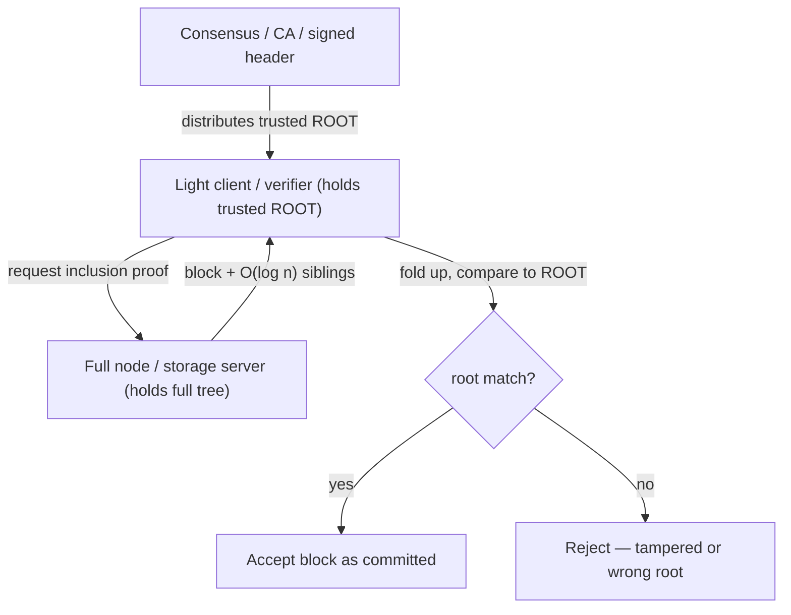
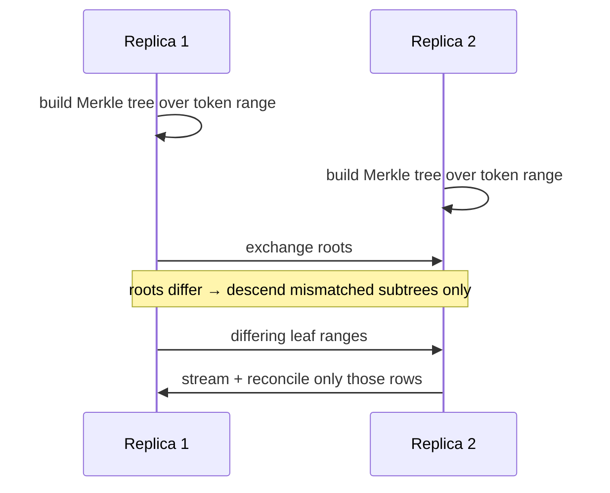
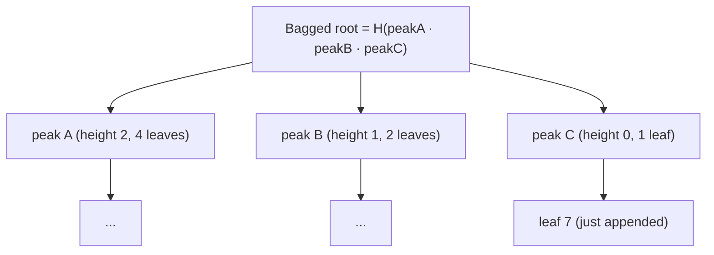

# Merkle Tree (Hash Tree) — Senior Level

> **Read time: ~60 minutes** · **Audience:** Engineers architecting systems that rely on Merkle trees — blockchains, distributed databases, content-addressed storage, transparency logs — who need to choose the right variant (plain, sparse, Patricia, MMR), reason about the security model, and operate these structures at scale.

At the senior level a Merkle tree stops being a single data structure and becomes a **family of commitment structures**, each tuned to a different access pattern: ordered lists (Bitcoin transactions, CT logs), key→value maps (Ethereum state via Merkle–Patricia tries), huge-sparse keyspaces (sparse Merkle trees), and append-only growth (Merkle Mountain Ranges). This document is organized around the real systems that deploy them — **Bitcoin/Ethereum, Git, IPFS, Cassandra/DynamoDB anti-entropy, Certificate Transparency, BitTorrent** — and around the two senior-level concerns those systems force on you: a precise **security model** (collision resistance, second-preimage, domain separation, length-extension, Bitcoin's duplicate-leaf flaw) and **scaling/operability** (proof size, state-trie I/O, snapshot/sync, hot paths).

---

## Table of Contents

1. [Introduction — A Family of Commitment Structures](#introduction)
2. [System Design with Merkle Trees](#system-design)
3. [Blockchains: Bitcoin SPV and Ethereum State](#blockchains)
4. [Git and IPFS: Merkle DAGs](#merkle-dag)
5. [Anti-Entropy at Scale (Cassandra / DynamoDB)](#anti-entropy)
6. [Variant Comparison](#variants)
7. [Sparse Merkle Trees and Merkle–Patricia Tries](#sparse-patricia)
8. [Merkle Mountain Ranges](#mmr)
9. [Security Model](#security)
10. [Code Examples — Go, Java, Python](#code-examples)
11. [Observability](#observability)
12. [Failure Modes](#failure-modes)
13. [Summary](#summary)

---

<a name="introduction"></a>
## 1. Introduction — A Family of Commitment Structures

Every Merkle structure answers the same question — "commit to a dataset with one short value, then prove things about parts of it" — but the *access pattern* dictates the shape:

| Access pattern | Structure | Example |
|---|---|---|
| Ordered list, prove by position | **Plain Merkle tree** | Bitcoin block, CT log, BitTorrent v2 |
| Key→value map, prove by key | **Merkle–Patricia trie** | Ethereum account/storage state |
| Huge sparse keyspace, prove inclusion *and absence* | **Sparse Merkle tree** | Some L2 state, revocation maps |
| Append-only, grow cheaply, prove consistency | **Merkle Mountain Range** | Grin, OpenTimestamps |
| Arbitrary DAG of content | **Merkle DAG** | Git, IPFS |

The senior skill is matching the structure to the system constraint and then reasoning about the resulting **proof sizes, write amplification, sync cost, and attack surface**. We work through each below.

---

<a name="system-design"></a>
## 2. System Design with Merkle Trees



The recurring architecture: a **full node** stores the entire tree and serves proofs; a **light client** stores only the root (obtained from a trustworthy channel — consensus, a signed header, or a baked-in value) and verifies proofs locally. This is the design pattern behind Bitcoin SPV wallets, CT auditors, and IPFS clients. The senior decisions are: where does the trusted root come from, how big are proofs, and how do you keep the full node's tree consistent under concurrent writes.

---

<a name="blockchains"></a>
## 3. Blockchains: Bitcoin SPV and Ethereum State

### 3.1 Bitcoin — a Merkle tree of transactions per block

Each Bitcoin block header contains a 32-byte **Merkle root** of that block's transactions. The header is ~80 bytes; the block body can be megabytes. A **Simplified Payment Verification (SPV)** client downloads only headers (validated by proof-of-work) and, to confirm "my transaction is in block H," asks a full node for the **Merkle branch** (authentication path) of that transaction. It folds the path up and checks it against the header's root. The client verifies inclusion with `O(log n)` hashes and never downloads the full block.

Bitcoin uses **double-SHA-256** (`SHA256(SHA256(x))`) and the **duplicate-last** odd convention. That duplicate convention has a known weakness (CVE-2012-2459) discussed in §9.

### 3.2 Ethereum — three Merkle–Patricia tries per block

Ethereum's block header commits to **three** roots, each the root of a **Merkle–Patricia trie (MPT)**:

- **State trie:** key = `keccak256(address)`, value = account (nonce, balance, storageRoot, codeHash). Each contract's storage is itself an MPT, whose root is embedded in the account.
- **Transactions trie:** key = RLP-encoded index, value = transaction.
- **Receipts trie:** key = index, value = receipt (logs, gas used).

Because the state trie is keyed, a light client can prove "account A has balance B at block H" with a Merkle–Patricia proof — a path of nodes from the state root down to A's leaf. Crucially, an MPT also proves **non-existence** (the path terminates without the key), which a plain indexed Merkle tree cannot. Ethereum re-hashes only the **touched paths** after each block's transactions, so a block that modifies 1,000 accounts updates ~`1000 × log(state size)` trie nodes, not the whole 200M-entry state. See §7 and `24-patricia-trie-radix`.

### 3.3 Why keyed vs indexed matters

| Need | Bitcoin (indexed) | Ethereum (keyed MPT) |
|---|---|---|
| "Is tx #5 in the block?" | trivial — proof by index | n/a |
| "What is account A's balance?" | impossible to prove directly | proof by key |
| Prove a key is **absent** | no | yes |
| Deterministic root regardless of insert order | yes (positions fixed) | yes (key-ordered) |

---

<a name="merkle-dag"></a>
## 4. Git and IPFS: Merkle DAGs

### 4.1 Git

Git is a content-addressed object store forming a **Merkle DAG**:

- **blob** = file contents, named by `SHA-1(header · content)` (migrating to SHA-256).
- **tree** = directory listing of (mode, name, hash) entries.
- **commit** = points to one root tree + parent commit(s) + metadata.

A commit hash transitively commits to the entire snapshot: change one byte in one file → new blob hash → new tree hashes up the directory chain → new root tree → new commit hash. Two repositories compare commit/tree/blob hashes during `fetch` and transfer **only objects the other side lacks** — Merkle-style diffing over a DAG. Branches are just movable pointers to commit hashes; integrity is automatic because every reference is a hash of content.

### 4.2 IPFS

IPFS splits files into chunks, hashes each chunk, and links them (and directory nodes) into a **Merkle DAG** whose nodes are addressed by **CID (Content IDentifier)**. Fetching `/ipfs/<root-CID>/path` walks the DAG, verifying each node's CID against its content as it goes — tamper-proof, deduplicated (identical chunks share a CID), and resumable. The DAG (rather than a strict binary tree) lets a node have many children and lets subtrees be shared across files.

### 4.3 DAG vs tree

A Merkle **DAG** generalizes the Merkle **tree**: nodes can have arbitrary fan-out and can be referenced by multiple parents (enabling deduplication), but the defining property is unchanged — each node is named by the hash of its content, so the root hash commits to everything reachable.

---

<a name="anti-entropy"></a>
## 5. Anti-Entropy at Scale (Cassandra / DynamoDB)

Dynamo-style systems use Merkle trees for **anti-entropy repair**: detecting and reconciling divergence between replicas of the same key range without streaming all the data.

- Each replica builds a Merkle tree over the **token ranges** it owns; leaves hash buckets of rows.
- During repair, replicas exchange roots, then descend only into subtrees whose hashes differ, ending at the differing buckets, which are then streamed and reconciled (last-write-wins or another conflict resolution).

Cassandra's `nodetool repair` builds these trees (historically to a fixed depth, e.g., 15 levels → 2¹⁵ leaf ranges per range). The senior concerns:

- **Validation compaction cost.** Building the tree reads the data; on huge SSTables this is I/O- and CPU-heavy. Incremental and subrange repair limit the scope.
- **Granularity vs precision.** Too-coarse leaves repair whole large buckets for a one-row diff (over-streaming); too-fine inflate the tree.
- **Clock/ordering for conflict resolution** is orthogonal to the tree but determines what "repair" writes.



---

<a name="variants"></a>
## 6. Variant Comparison

| Variant | Proof type | Proof size | Update cost | Proves absence? | Used by |
|---|---|---|---|---|---|
| **Plain Merkle tree** | inclusion (by index) | O(log n) | O(log n) | no | Bitcoin, CT, BitTorrent |
| **Merkle–Patricia trie** | inclusion (by key) | O(key length) ≈ O(log n) | O(log n) | **yes** | Ethereum state |
| **Sparse Merkle tree** | inclusion + non-inclusion | O(tree depth) (e.g. 256) | O(depth) | **yes** | L2 state, revocation maps |
| **Merkle Mountain Range** | inclusion + consistency | O(log n) | O(log n) amortized append | no | Grin, OpenTimestamps |
| **Merkle DAG** | path inclusion | O(path depth) | content-addressed (immutable) | no | Git, IPFS |
| **CT log (RFC 6962)** | inclusion + consistency | O(log n) | append | no | Certificate Transparency |

---

<a name="sparse-patricia"></a>
## 7. Sparse Merkle Trees and Merkle–Patricia Tries

### 7.1 Sparse Merkle tree (SMT)

An SMT is a **fixed-depth** Merkle tree over the entire key space — e.g., depth 256 for 256-bit keys, so there are `2²⁵⁶` conceptual leaves. Almost all are empty. The trick: an empty subtree at any level has a **deterministic default hash** (`defaultHash[level]`, precomputed by hashing the empty leaf up `level` times). So you only store the non-empty nodes; the rest are implied.

Properties:

- **Proof of non-inclusion:** to show key `k` is absent, give the path to where `k` would be and show it ends in the empty/default value — impossible with a plain Merkle tree.
- **Deterministic root** independent of insertion order (position is fixed by the key bits).
- **Cost:** proofs are `O(depth)` (256 for 256-bit keys); **optimizations** (compressed proofs that omit default-hash siblings) shrink this to roughly `O(log(non-empty))`.

```text
defaultHash[0]   = H(empty leaf)
defaultHash[i]   = H(defaultHash[i-1] · defaultHash[i-1])
node value       = stored if subtree non-empty, else defaultHash[level]
```

### 7.2 Merkle–Patricia trie (MPT)

An MPT combines a Patricia/radix trie (path-compressed, keyed by nibbles of `key`) with Merkle hashing (each node hashed; parents reference children by hash). It gives keyed inclusion/exclusion proofs with paths proportional to key length, and avoids the SMT's full-depth blowup by **compressing** chains of single-child nodes (extension nodes) — which is why Ethereum chose it for sparse, mutable, keyed state. The detailed node types (leaf, extension, branch) and RLP encoding live in `24-patricia-trie-radix`.

### 7.3 Choosing between them

- **SMT:** simplest mental model, uniform depth, easy non-inclusion proofs; pairs well with zero-knowledge circuits (fixed-shape).
- **MPT:** smaller for clustered keys, path-compressed, battle-tested in Ethereum, but more complex node types and proof format.

---

<a name="mmr"></a>
## 8. Merkle Mountain Ranges

An MMR is an **append-optimized** Merkle structure: a forest of perfect binary trees ("mountains") whose sizes correspond to the set bits of `n`. Appending a leaf is like incrementing a binary counter — when two mountains of equal height appear, they merge into one taller mountain. The single commitment ("bagging the peaks") hashes the mountain peaks together.

Why MMRs over a plain tree for logs:

- **O(log n) amortized append** that never reshapes existing nodes (existing subtree hashes are immutable once formed) — ideal for append-only logs and write-once storage.
- **Inclusion proofs** (leaf → its mountain peak → bagged root) and **consistency proofs** (old root is a prefix of new) both `O(log n)`.
- Used by **Grin/Mimblewimble** for the output set and by **OpenTimestamps** for scalable timestamp aggregation.



---

<a name="security"></a>
## 9. Security Model

A Merkle tree's guarantees reduce to properties of the hash function. Senior engineers must know exactly which property each defense needs.

### 9.1 Collision resistance ⇒ binding

If an adversary could find `x ≠ y` with `H(x) = H(y)`, they could swap a subtree without changing the root — breaking the commitment. So binding rests on **collision resistance**. SHA-1 is now considered broken for collision resistance (SHAttered, 2017), which is why Git is migrating to SHA-256 and new systems avoid SHA-1.

### 9.2 Second-preimage and domain separation

Without distinguishing leaves from internal nodes, an internal node `H(L · R)` is indistinguishable from a leaf `H(block)`, so an attacker can present a pair of subtree hashes as a "leaf," forging a different tree with the same root — a **second-preimage** attack on tree structure. **Domain separation** fixes it: tag leaves and nodes differently.

```text
leaf  = H(0x00 · block)
node  = H(0x01 · left · right)
```

RFC 6962 (Certificate Transparency) mandates exactly this.

### 9.3 Bitcoin's duplicate-leaf flaw (CVE-2012-2459)

Bitcoin's **duplicate-last** odd handling means a tree with an odd number of nodes at some level duplicates the last one. This allows distinct transaction lists to produce the **same Merkle root** (by appending a duplicate of the last transaction), which historically could be used to make a node consider a valid block invalid (a DoS). The lesson: odd-handling conventions are security-relevant; RFC 6962 avoids duplication by promoting unpaired nodes, and modern designs specify odd handling carefully.

### 9.4 Length-extension and hash choice

SHA-256 is vulnerable to **length-extension**: given `H(secret · m)` and `len`, an attacker can compute `H(secret · m · pad · m')` without knowing the secret. Merkle trees that authenticate with a secret-prefixed hash can be affected; mitigations include SHA-256d (double hashing, as Bitcoin uses), SHA-3/Keccak (not length-extendable), or HMAC. Most Merkle uses are not keyed, so length-extension is moot, but know the failure mode if you mix a secret into node hashing.

### 9.5 Privacy: trees are not hiding

Leaf hashes and revealed siblings can leak information (e.g., that two leaves are equal, or the value of a low-entropy block). For privacy, **salt/blind** leaves (`H(0x00 · salt · block)`) and consider that proofs reveal neighbor hashes. This matters for CT (reveals nothing sensitive) vs. private set membership (needs blinding).

### Security summary table

| Threat | Property needed / defense |
|---|---|
| Swap subtree silently | collision resistance |
| Pass node off as leaf | domain separation (tag leaves vs nodes) |
| Distinct data, same root | careful odd-leaf rule (avoid Bitcoin-style duplication, or accept its constraints) |
| Forge over secret-keyed hash | SHA-3/HMAC/double-hash (length-extension) |
| Leak leaf contents | salt/blind leaves |
| Broken hash (SHA-1) | use SHA-256/SHA-3 |

---

<a name="code-examples"></a>
## 10. Code Examples — Go, Java, Python

A **sparse Merkle tree** (fixed depth, default hashes, inclusion + non-inclusion proofs) is the senior-defining variant. Below is a compact SMT with `get`, `update`, and `prove` (the proof distinguishes present vs absent keys).

### 10.1 Go

```go
package smt

import (
	"crypto/sha256"
	"encoding/binary"
)

const Depth = 16 // toy depth; real SMTs use 256

func h(b ...[]byte) []byte {
	d := sha256.New()
	for _, x := range b {
		d.Write(x)
	}
	return d.Sum(nil)
}

// SMT stores only non-default nodes, keyed by "level:path".
type SMT struct {
	nodes    map[string][]byte
	defaults [][]byte // defaults[i] = hash of an empty subtree of height i
}

func New() *SMT {
	defs := make([][]byte, Depth+1)
	defs[0] = h([]byte{0x00}) // empty leaf
	for i := 1; i <= Depth; i++ {
		defs[i] = h([]byte{0x01}, defs[i-1], defs[i-1])
	}
	return &SMT{nodes: map[string][]byte{}, defaults: defs}
}

func bit(key uint16, i int) int { return int((key >> (Depth - 1 - i)) & 1) }

func (s *SMT) nodeAt(level, height int, path uint16) []byte {
	k := nodeKey(height, path)
	if v, ok := s.nodes[k]; ok {
		return v
	}
	return s.defaults[height]
}

func nodeKey(height int, path uint16) string {
	var b [3]byte
	b[0] = byte(height)
	binary.BigEndian.PutUint16(b[1:], path)
	return string(b[:])
}

// Update sets value for key, re-hashing the O(Depth) path.
func (s *SMT) Update(key uint16, value []byte) {
	cur := h([]byte{0x00}, value) // leaf hash (domain-separated)
	s.nodes[nodeKey(0, key)] = cur
	path := key
	for height := 1; height <= Depth; height++ {
		path >>= 1
		left := s.siblingChild(height, path, 0)
		right := s.siblingChild(height, path, 1)
		cur = h([]byte{0x01}, left, right)
		if equalDefault(cur, s.defaults[height]) {
			delete(s.nodes, nodeKey(height, path))
		} else {
			s.nodes[nodeKey(height, path)] = cur
		}
	}
}

func (s *SMT) siblingChild(height int, parentPath uint16, which int) []byte {
	childPath := parentPath<<1 | uint16(which)
	k := nodeKey(height-1, childPath)
	if v, ok := s.nodes[k]; ok {
		return v
	}
	return s.defaults[height-1]
}

func equalDefault(a, b []byte) bool {
	if len(a) != len(b) {
		return false
	}
	for i := range a {
		if a[i] != b[i] {
			return false
		}
	}
	return true
}

func (s *SMT) Root() []byte { return s.nodeAt(0, Depth, 0) }

// Prove returns the Depth sibling hashes from leaf to root.
func (s *SMT) Prove(key uint16) [][]byte {
	proof := make([][]byte, Depth)
	path := key
	for i := 0; i < Depth; i++ {
		sibPath := path ^ 1
		proof[Depth-1-i] = s.childHash(i, sibPath)
		path >>= 1
	}
	return proof
}

func (s *SMT) childHash(height int, path uint16) []byte {
	if v, ok := s.nodes[nodeKey(height, path)]; ok {
		return v
	}
	return s.defaults[height]
}
```

### 10.2 Java

```java
import java.security.MessageDigest;
import java.util.HashMap;
import java.util.Map;

public final class SparseMerkleTree {
    static final int DEPTH = 16;
    private final Map<String, byte[]> nodes = new HashMap<>();
    private final byte[][] defaults = new byte[DEPTH + 1][];

    static byte[] h(byte[]... parts) {
        try {
            MessageDigest d = MessageDigest.getInstance("SHA-256");
            for (byte[] p : parts) d.update(p);
            return d.digest();
        } catch (Exception e) { throw new RuntimeException(e); }
    }

    public SparseMerkleTree() {
        defaults[0] = h(new byte[]{0x00});
        for (int i = 1; i <= DEPTH; i++)
            defaults[i] = h(new byte[]{0x01}, defaults[i - 1], defaults[i - 1]);
    }

    private String key(int height, int path) { return height + ":" + path; }

    private byte[] child(int height, int path) {
        return nodes.getOrDefault(key(height, path), defaults[height]);
    }

    public void update(int k, byte[] value) {
        byte[] cur = h(new byte[]{0x00}, value);
        nodes.put(key(0, k), cur);
        int path = k;
        for (int height = 1; height <= DEPTH; height++) {
            path >>= 1;
            byte[] left = child(height - 1, path << 1);
            byte[] right = child(height - 1, (path << 1) | 1);
            cur = h(new byte[]{0x01}, left, right);
            if (java.util.Arrays.equals(cur, defaults[height])) nodes.remove(key(height, path));
            else nodes.put(key(height, path), cur);
        }
    }

    public byte[] root() { return nodes.getOrDefault(key(DEPTH, 0), defaults[DEPTH]); }

    public byte[][] prove(int k) {
        byte[][] proof = new byte[DEPTH][];
        int path = k;
        for (int i = 0; i < DEPTH; i++) {
            proof[DEPTH - 1 - i] = child(i, path ^ 1);
            path >>= 1;
        }
        return proof;
    }
}
```

### 10.3 Python

```python
import hashlib

DEPTH = 16


def h(*parts: bytes) -> bytes:
    d = hashlib.sha256()
    for p in parts:
        d.update(p)
    return d.digest()


class SparseMerkleTree:
    """Fixed-depth SMT: only non-default nodes stored; supports non-inclusion proofs."""

    def __init__(self) -> None:
        self.nodes: dict[tuple[int, int], bytes] = {}
        self.defaults = [h(b"\x00")]
        for i in range(1, DEPTH + 1):
            self.defaults.append(h(b"\x01", self.defaults[i - 1], self.defaults[i - 1]))

    def _child(self, height: int, path: int) -> bytes:
        return self.nodes.get((height, path), self.defaults[height])

    def update(self, key: int, value: bytes) -> None:
        cur = h(b"\x00", value)
        self.nodes[(0, key)] = cur
        path = key
        for height in range(1, DEPTH + 1):
            path >>= 1
            left = self._child(height - 1, path << 1)
            right = self._child(height - 1, (path << 1) | 1)
            cur = h(b"\x01", left, right)
            if cur == self.defaults[height]:
                self.nodes.pop((height, path), None)
            else:
                self.nodes[(height, path)] = cur

    def root(self) -> bytes:
        return self.nodes.get((DEPTH, 0), self.defaults[DEPTH])

    def prove(self, key: int) -> list[bytes]:
        proof, path = [None] * DEPTH, key
        for i in range(DEPTH):
            proof[DEPTH - 1 - i] = self._child(i, path ^ 1)
            path >>= 1
        return proof


def verify_smt(key: int, value: bytes | None, proof: list[bytes], root: bytes) -> bool:
    # value=None means proving NON-inclusion (leaf is the empty default).
    cur = h(b"\x00", value) if value is not None else h(b"\x00")
    path = key
    for i in range(DEPTH):
        sib = proof[DEPTH - 1 - i]
        if path & 1:
            cur = h(b"\x01", sib, cur)
        else:
            cur = h(b"\x01", cur, sib)
        path >>= 1
    return cur == root


if __name__ == "__main__":
    smt = SparseMerkleTree()
    smt.update(42, b"alice")
    r = smt.root()
    print("inclusion  :", verify_smt(42, b"alice", smt.prove(42), r))   # True
    print("non-incl 99:", verify_smt(99, None, smt.prove(99), r))        # True
```

**What it does:** a sparse Merkle tree proving both that key 42 maps to `"alice"` (inclusion) and that key 99 is absent (non-inclusion) — the capability plain Merkle trees lack and Ethereum/L2 state needs.

---

<a name="observability"></a>
## 11. Observability

| Metric | Why it matters | Alert threshold (example) |
|---|---|---|
| `proof_size_bytes` | Bandwidth to light clients | tree depth drift beyond expected log n |
| `state_trie_node_count` | Storage growth (Ethereum-style) | sustained growth > capacity plan |
| `merkle_update_path_hashes` | Write amplification per mutation | spikes indicate hot keys |
| `repair_bytes_streamed` | Anti-entropy over-streaming | >> expected for diff count → coarsen-bucket bug |
| `root_mismatch_rate` | Tamper / corruption / version skew | any unexpected nonzero |
| `tree_build_duration` | Repair/validation compaction cost | exceeds repair window |

---

<a name="failure-modes"></a>
## 12. Failure Modes

- **Trusted-root compromise.** If the verifier's root comes from an attacker, every proof is meaningless. Anchor roots in consensus or signatures.
- **Hash function break.** SHA-1 collisions (SHAttered) broke SHA-1 Merkle binding; plan crypto-agility and migrate (Git → SHA-256).
- **Odd-leaf duplication exploit.** Bitcoin CVE-2012-2459-style ambiguity; specify odd handling carefully.
- **Second-preimage via missing domain separation.** Always tag leaves vs nodes.
- **State-trie I/O storms.** Random-access trie reads on disk (Ethereum) cause read amplification; mitigate with flat/snapshot databases and caching.
- **Anti-entropy over-streaming.** Coarse buckets ship megabytes for a one-row diff; tune granularity and use incremental repair.
- **Concurrent mutation during proof.** Snapshot the tree (copy-on-write/persistent) so proofs reflect a consistent root.

---

<a name="summary"></a>
## 13. Summary

- Merkle trees are a **family** of commitment structures; choose by access pattern: plain (indexed lists), Merkle–Patricia (keyed maps, proves absence), sparse Merkle (huge sparse keyspaces), MMR (append-only), Merkle DAG (Git/IPFS).
- **Bitcoin** commits a transaction Merkle root per block for SPV inclusion proofs; **Ethereum** commits three Merkle–Patricia trie roots for keyed state with non-inclusion proofs, re-hashing only touched paths.
- **Git and IPFS** are Merkle DAGs: every object is content-addressed, so the root hash commits to the whole snapshot and diffs transfer only missing objects.
- **Cassandra/DynamoDB anti-entropy** uses Merkle trees over token ranges to reconcile replicas in O(d log n) instead of streaming everything.
- The **security model** reduces to hash properties: collision resistance (binding), domain separation (anti second-preimage), careful odd handling (avoid Bitcoin's duplicate ambiguity), and salting for privacy.
- At scale the senior concerns are **proof size, write amplification on the touched path, trusted-root provenance, state-trie I/O, and sync granularity**.

---

**Next step:** [professional.md](./professional.md) — formal commitment/soundness proofs (collision resistance ⇒ unforgeable inclusion proofs), complexity derivations, and the formalism of Merkle–Patricia tries, sparse Merkle trees, and Merkle Mountain Ranges.
