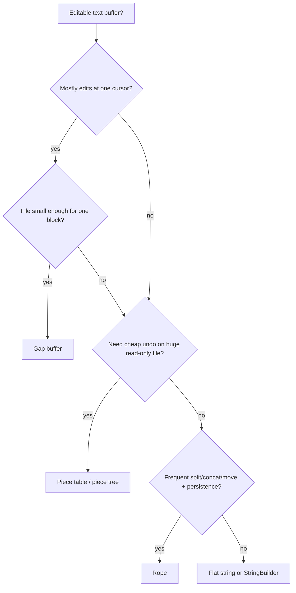

# Rope — Middle Level

> **Read time: ~55 minutes** · **Audience:** Engineers who understand leaves, weights, and `index`/`concat` from `junior.md`, and now want the *editing* operations — `split`, `insert`, `delete`, `substring` — plus the balancing discipline that keeps them O(log n), and a clear-eyed comparison against the gap buffer and the piece table (the structure VS Code actually uses).

The junior level showed that a rope makes **index** O(log n) and **concat** O(1) by hanging text chunks off the leaves of a binary tree and storing a **weight** (left-subtree size) at each internal node. That is the read side. This document is about the **write** side and the **why/when** of choosing a rope at all.

We build `split` (the operation everything else is defined in terms of), then derive `insert` and `delete` as two-line compositions of `split` and `concat`. We then confront the elephant: a rope is only fast while **balanced**, so we survey the three balancing disciplines — rotation-based (AVL/red-black), randomized (treap priorities, the most popular), and amortized rebuild. Finally we put the rope head-to-head against the two other classic editor-buffer structures: the **gap buffer** (Emacs) and the **piece table** (VS Code, early Word).

---

## Table of Contents

1. [Recap and Roadmap](#recap)
2. [Why and When to Reach for a Rope](#why-when)
3. [Split — The Master Operation](#split)
4. [Insert and Delete as Compositions](#insert-delete)
5. [Substring / Report](#substring)
6. [Balancing — Three Disciplines](#balancing)
7. [Big-O Summary](#big-o)
8. [Rope vs Array vs Gap Buffer vs Piece Table](#comparison)
9. [Code Examples — Go, Java, Python](#code-examples)
10. [Coding Patterns](#patterns)
11. [Error Handling](#errors)
12. [Performance Tips](#performance-tips)
13. [Best Practices](#best-practices)
14. [Edge Cases](#edge-cases)
15. [Common Mistakes](#common-mistakes)
16. [Cheat Sheet](#cheat-sheet)
17. [Visual Animation Reference](#animation)
18. [Summary](#summary)
19. [Further Reading](#further-reading)

---

<a name="recap"></a>
## 1. Recap and Roadmap

From `junior.md`:

- A **rope** is a binary tree; **leaves** hold short character chunks, **internal nodes** hold a **weight** = the number of characters in their left subtree.
- **`index(i)`**: while at an internal node, if `i < weight` go left, else `i -= weight` and go right. At the leaf, return `chunk[i]`. O(log n) when balanced.
- **`concat(A, B)`**: make a new internal node with left=A, right=B, weight=len(A). O(1).
- The catch: nothing forces balance, so concat-only workloads can degrade to O(n).

This document adds the four editing operations and the balancing that makes them trustworthy. The unifying idea: **every edit is split + concat.** Master `split` and you have mastered the whole edit API.

---

<a name="why-when"></a>
## 2. Why and When to Reach for a Rope

A rope is the right tool when **all** of the following hold:

1. The sequence is **large** (megabytes to gigabytes) — large enough that O(n) copies per edit are unacceptable.
2. Edits happen **in the middle**, not just at the end. (Pure append is better served by a `StringBuilder`/`bytes.Buffer`.)
3. You need **structural operations** — split, concat, move a block of text — not just character tweaks.
4. You benefit from **structure sharing**: undo history, snapshots, or collaborative editing where old versions must survive.

If instead the string is small, mostly read, or only appended to, a flat string or builder wins on simplicity and cache locality. The rope earns its complexity only at scale with mid-string mutation. We will sharpen this judgment in §8 by contrasting with the gap buffer and piece table, which make different trade-offs for the same editor-buffer problem.

---

<a name="split"></a>
## 3. Split — The Master Operation

**`split(rope, i)`** returns two ropes: `L` covering positions `[0, i)` and `R` covering `[i, n)`. Every other edit is built from it.

### 3.1 The idea

Descend from the root toward position `i`, exactly like `index`. But instead of stopping at the leaf, **partition every node you pass** into a "left of the cut" piece and a "right of the cut" piece, then `concat` the pieces back together on the way out.

- If at an internal node `i <= weight`, the whole **right child** belongs to the right result; recurse into the **left child** to split it, then re-attach the right child to the right result.
- If `i > weight`, the whole **left child** belongs to the left result; recurse into the **right child** with `i -= weight`, then re-attach the left child to the left result.
- At a **leaf**, split the chunk string at the local offset into two smaller leaves.

### 3.2 Pseudocode

```
split(node, i):                    # returns (L, R)
    if node is a leaf:
        if i == 0:       return (EMPTY, node)
        if i == len:     return (node, EMPTY)
        return (leaf(chunk[:i]), leaf(chunk[i:]))   # cut the chunk
    if i <= node.weight:                       # cut is in the left subtree
        (L, Rsub) = split(node.left, i)
        return (L, concat(Rsub, node.right))   # right child joins the right side
    else:                                      # cut is in the right subtree
        (Lsub, R) = split(node.right, i - node.weight)
        return (concat(node.left, Lsub), R)    # left child joins the left side
```

The recursion follows one root-to-leaf path, doing O(1) work plus one `concat` per level → **O(log n)** (concat is O(1)). The two returned ropes may be slightly unbalanced near the cut; balancing (§6) cleans that up.

### 3.3 Worked split on `"Hello_my_name_is_Simon"` at i = 11

Recall the tree (root weight 11). We want `L = "Hello_my_na"`, `R = "me_is_Simon"`.

```
root: i (11) <= weight (11)?  YES (i==weight) → cut in left subtree
  recurse left, i = 11   → that left subtree has length 11, so the split
                           lands at its far right edge: L = entire left
                           subtree, Rsub = EMPTY
  return (L = "Hello_my_na",  R = concat(EMPTY, right_child) = "me_is_Simon")
```

The cut fell exactly on a leaf boundary, so no chunk was physically sliced — only pointers moved. A cut *inside* a leaf (say `split(13)`, mid-`"me_i"`) would slice that one chunk `"me_i"` into `"me"` and `"_i"`, an O(chunk) operation on a tiny string.

### 3.4 Why split is the master op

`insert`, `delete`, `move`, and `substring` are all one or two splits plus a concat. There is exactly one tricky recursion in the whole rope — this one — and everything else is glue.

---

<a name="insert-delete"></a>
## 4. Insert and Delete as Compositions

### 4.1 Insert

To insert string `s` at position `i`:

```
insert(rope, i, s):
    (L, R) = split(rope, i)
    return concat(concat(L, leaf(s)), R)
```

Split once (O(log n)), wrap `s` in a leaf (O(|s|) to copy the new text, unavoidable — those characters are genuinely new), concat twice (O(1) each). Total **O(log n + |s|)**. Contrast a flat string: O(n + |s|) because the entire tail shifts.

### 4.2 Delete

To delete the half-open range `[i, j)`:

```
delete(rope, i, j):
    (L, mid_and_R) = split(rope, i)
    (_, R)         = split(mid_and_R, j - i)   # drop the middle
    return concat(L, R)
```

Two splits, one concat, all O(log n) → **O(log n)** regardless of how many characters are deleted. A flat string deletes in O(n) by shifting the tail. This is the rope's biggest practical win: deleting a 100 MB block from a 1 GB buffer is a few pointer operations.

### 4.3 Move / cut-paste

Moving a block `[i, j)` to position `k` is three splits and a few concats — still O(log n). This is why ropes shine for editors with large copy/cut/paste operations.

### 4.4 The composition table

| Edit | Definition | Cost |
|---|---|---|
| `insert(i, s)` | `concat(concat(L, leaf(s)), R)` where `(L,R)=split(i)` | O(log n + \|s\|) |
| `delete(i, j)` | `concat(L, R)` after splitting out `[i, j)` | O(log n) |
| `replace(i, j, s)` | `delete(i, j)` then `insert(i, s)` | O(log n + \|s\|) |
| `move(i, j, k)` | cut `[i,j)`, then insert at `k` | O(log n) |
| `substring(i, j)` | split out `[i, j)`, then traverse | O(log n + (j−i)) |

Everything funnels through `split` and `concat`. Implement those two correctly and the rest is trivial.

---

<a name="substring"></a>
## 5. Substring / Report

To extract the characters of `[i, j)` into a flat string you do **not** call `index` in a loop (that would be O((j−i) log n)). Instead, descend to position `i`, then walk leaves left-to-right collecting characters until you have `j − i` of them.

```
substring(node, i, j, out):
    if node is leaf:
        out.append(chunk[max(0,i) : min(len, j)])
        return
    if i < node.weight:               # some of the range is on the left
        substring(node.left, i, min(j, node.weight), out)
    if j > node.weight:               # some of the range is on the right
        substring(node.right, max(0, i - node.weight), j - node.weight, out)
```

Cost: O(log n) to reach the boundary leaves + O(j − i) to copy the characters = **O(log n + m)** where `m = j − i`. This is the standard "report all elements in a range" pattern, the same shape as a segment-tree range walk (`09-trees/06-segment-tree`).

---

<a name="balancing"></a>
## 6. Balancing — Three Disciplines

A rope's O(log n) bounds *all* assume height O(log n). Concat does not guarantee that, so you need a balancing discipline. Three are common.

### 6.1 Rotation-based (AVL / red-black)

Treat the rope as a balanced BST keyed on position and apply standard rotations after each edit to keep the height balanced. Rotations are O(1) structural changes that only need to **recompute weights of the rotated nodes** (each node's weight is derived from its left subtree's length, which is cached). Pros: strict O(log n) height, deterministic. Cons: rotation code is fiddly, and you must update cached `length`/`weight` carefully after each rotation.

```
After a left rotation at x (right child y becomes parent):
    y.left  = x;  x.right = y_old_left
    x.length = len(x.left) + len(x.right);  x.weight = len(x.left)
    y.length = len(y.left) + len(y.right);  y.weight = len(y.left)
```

### 6.2 Randomized — treap priorities (most popular)

Give every node a random **priority** and maintain the heap property on priorities while the BST property holds on position. This is exactly an **implicit treap** (`22-randomized-algorithms/04-treap`): split and merge by position, and the random priorities keep expected height O(log n) *for free* — no rotations to hand-code, just `split` and `merge`. Most modern "rope-like" editor buffers and competitive-programming sequence structures are implicit treaps. Pros: tiny code (split + merge are ~15 lines each), expected O(log n), trivially supports persistence. Cons: bounds are expected, not worst-case; needs a good RNG.

### 6.3 Amortized rebuild (the Boehm–Atkinson–Plass approach)

The original paper does **not** rebalance on every operation. Instead it allows the tree to drift and **rebuilds the whole rope into a balanced shape when the height exceeds a threshold** (tied to Fibonacci numbers: a rope of height `h` must contain at least `Fib(h+2)` characters, else it is "unbalanced" and gets collapsed). Rebuild is O(n) but happens rarely, so the *amortized* cost stays low. Pros: dead simple, no per-op rotation. Cons: occasional O(n) hiccup — bad for hard real-time, fine for editors.

### 6.4 Choosing

| Discipline | Height bound | Code size | Persistence | Best for |
|---|---|---|---|---|
| AVL / red-black | strict O(log n) | large | harder | latency-critical, worst-case guarantees |
| **Treap (implicit)** | **expected O(log n)** | **small** | **easy** | most editors, collaborative buffers, contests |
| Amortized rebuild | O(log n) amortized | smallest | easy | simple editors, batch text processing |

In practice the **implicit treap** is the default choice: smallest correct code, easy persistence, good enough bounds. We use it for split/merge in `senior.md` and `professional.md`.

---

<a name="big-o"></a>
## 7. Big-O Summary

| Operation | Balanced rope | Flat string/array |
|---|---|---|
| Index char `i` | O(log n) | **O(1)** |
| Concat A + B | **O(1)** (amortized w/ balance) | O(a + b) |
| Split at `i` | **O(log n)** | O(n) |
| Insert `s` at `i` | **O(log n + \|s\|)** | O(n + \|s\|) |
| Delete `[i, j)` | **O(log n)** | O(n) |
| Replace | **O(log n + \|s\|)** | O(n + \|s\|) |
| Substring `[i, j)`, m=j−i | **O(log n + m)** | O(m) |
| Iterate all n chars | O(n) | O(n) |
| Space | O(n) + O(n/chunk) nodes | O(n) |

The rope dominates on every *structural* operation and loses only on single-character random access and raw cache locality.

---

<a name="comparison"></a>
## 8. Rope vs Array vs Gap Buffer vs Piece Table

These are the four classic ways to represent an editable text buffer. Knowing when each wins is a senior-interview staple.

### 8.1 The four structures

- **Flat array / string.** One contiguous buffer. Index O(1); any mid-string edit O(n) (shift the tail).
- **Gap buffer (Emacs).** One contiguous buffer with a movable "gap" of free space at the cursor. Inserts/deletes *at the cursor* are O(1) amortized (just grow/shrink the gap); moving the cursor far is O(distance) to slide the gap. Index O(1).
- **Piece table (VS Code, early MS Word).** The original text is read-only; edits are appended to a separate "add" buffer; a list of **pieces** (each a span into original-or-add) describes the current document. Edits add/split pieces — no character copying of existing text. Great for undo (just keep old piece lists) and for memory-mapping huge read-only originals.
- **Rope.** Balanced tree of chunks; all structural ops O(log n).

### 8.2 Comparison table

| Property | Flat array | Gap buffer | Piece table | Rope |
|---|---|---|---|---|
| Index char `i` | O(1) | O(1) | O(pieces) or O(log) w/ tree | O(log n) |
| Insert/delete **at cursor** | O(n) | **O(1)** amortized | O(1) (append + split piece) | O(log n) |
| Insert/delete **far from cursor** | O(n) | O(distance) to move gap | O(pieces) to find piece | **O(log n)** |
| Concat two buffers | O(a+b) | O(a+b) | O(p) merge piece lists | **O(1)** |
| Split buffer | O(n) | O(n) | O(p) | **O(log n)** |
| Undo / versioning | copy whole buffer | hard | **trivial** (keep old piece list) | easy (structure sharing) |
| Memory model | one big block | one big block + gap | original + append buffer | many small chunks |
| Cache locality | **excellent** | **excellent** near gap | good (few big spans) | fair (scattered chunks) |
| Code complexity | trivial | small | medium | medium–large |
| Used by | most code | **Emacs** | **VS Code**, early Word | SGI STL, some editors |

### 8.3 How to choose

- **Single cursor, locality matters, modest file:** **gap buffer.** Editing where the cursor already is costs nothing; Emacs proves this works for decades.
- **Huge read-only original + cheap undo + occasional edits anywhere:** **piece table.** VS Code uses a *piece-tree* (a piece table backed by a balanced tree) precisely to get O(log n) random edits *and* trivial undo on gigabyte files.
- **Frequent structural ops anywhere — split, concat, move large blocks — plus persistence:** **rope.** It is the only one with O(log n) edits *independent of cursor position* and O(1) concat.

Notice VS Code's "piece tree" is a **convergence**: it is a piece table whose piece list is stored in a balanced (red-black) tree, giving it rope-like O(log n) random access. The boundary between "rope" and "tree-backed piece table" is blurry — both are balanced trees over text spans. The rope stores the *characters* in leaves; the piece tree stores *references* into two append-only buffers in its tree nodes. For undo and memory-mapping a read-only file, the piece-tree's reference model wins; for arbitrary in-memory restructuring, the rope's chunk model is simpler.

### 8.4 Mermaid — decision flow



---

<a name="code-examples"></a>
## 9. Code Examples — Go, Java, Python

We extend the immutable rope from `junior.md` with `split`, `insert`, and `delete`. (Balancing via treap priorities is added in `senior.md`; here we keep it structural and rely on occasional rebuild.)

### Go

```go
package rope

// (Node, Leaf, Concat, Len, Index from junior.md.)

// Split cuts r into [0,i) and [i,n).
func Split(n *Node, i int) (*Node, *Node) {
	if n == nil {
		return nil, nil
	}
	if n.left == nil && n.right == nil { // leaf
		if i <= 0 {
			return nil, n
		}
		if i >= len(n.chunk) {
			return n, nil
		}
		return Leaf(n.chunk[:i]), Leaf(n.chunk[i:])
	}
	if i <= n.weight { // cut in left subtree
		l, rsub := Split(n.left, i)
		return l, Concat(rsub, n.right)
	}
	lsub, r := Split(n.right, i-n.weight) // cut in right subtree
	return Concat(n.left, lsub), r
}

// Insert places s at position i.
func Insert(n *Node, i int, s string) *Node {
	l, r := Split(n, i)
	return Concat(Concat(l, Leaf(s)), r)
}

// Delete removes [i, j).
func Delete(n *Node, i, j int) *Node {
	l, rest := Split(n, i)
	_, r := Split(rest, j-i)
	return Concat(l, r)
}

// Substring collects [i, j) into a flat string.
func Substring(n *Node, i, j int) string {
	var sb []byte
	var walk func(n *Node, lo, hi int)
	walk = func(n *Node, lo, hi int) {
		if n == nil || lo >= hi {
			return
		}
		if n.left == nil && n.right == nil {
			a, b := max(0, lo), min(len(n.chunk), hi)
			if a < b {
				sb = append(sb, n.chunk[a:b]...)
			}
			return
		}
		if lo < n.weight {
			walk(n.left, lo, min(hi, n.weight))
		}
		if hi > n.weight {
			walk(n.right, max(0, lo-n.weight), hi-n.weight)
		}
	}
	walk(n, i, j)
	return string(sb)
}

func min(a, b int) int { if a < b { return a }; return b }
```

### Java

```java
// Add to the Rope class from junior.md.
import java.util.AbstractMap.SimpleEntry;

static SimpleEntry<Node, Node> split(Node n, int i) {
    if (n == null) return new SimpleEntry<>(null, null);
    if (n.chunk != null) {                       // leaf
        if (i <= 0)               return new SimpleEntry<>(null, n);
        if (i >= n.chunk.length()) return new SimpleEntry<>(n, null);
        return new SimpleEntry<>(Node.leaf(n.chunk.substring(0, i)),
                                 Node.leaf(n.chunk.substring(i)));
    }
    if (i <= n.weight) {                          // cut in left
        SimpleEntry<Node, Node> s = split(n.left, i);
        return new SimpleEntry<>(s.getKey(), Node.concat(s.getValue(), n.right));
    }
    SimpleEntry<Node, Node> s = split(n.right, i - n.weight); // cut in right
    return new SimpleEntry<>(Node.concat(n.left, s.getKey()), s.getValue());
}

public Rope insert(int i, String s) {
    SimpleEntry<Node, Node> p = split(root, i);
    Node mid = Node.concat(p.getKey(), Node.leaf(s));
    return new Rope(Node.concat(mid, p.getValue()));
}

public Rope delete(int i, int j) {
    SimpleEntry<Node, Node> a = split(root, i);
    SimpleEntry<Node, Node> b = split(a.getValue(), j - i);
    return new Rope(Node.concat(a.getKey(), b.getValue()));
}
```

### Python

```python
# Add to the module from junior.md.

def split(n, i):
    """Return (L, R) covering [0,i) and [i,len)."""
    if n is None:
        return None, None
    if n.chunk is not None:                       # leaf
        if i <= 0:
            return None, n
        if i >= len(n.chunk):
            return n, None
        return leaf(n.chunk[:i]), leaf(n.chunk[i:])
    if i <= n.weight:                             # cut in left subtree
        l, rsub = split(n.left, i)
        return l, concat(rsub, n.right)
    lsub, r = split(n.right, i - n.weight)        # cut in right subtree
    return concat(n.left, lsub), r


def insert(n, i, s):
    l, r = split(n, i)
    return concat(concat(l, leaf(s)), r)


def delete(n, i, j):
    l, rest = split(n, i)
    _, r = split(rest, j - i)
    return concat(l, r)


def substring(n, i, j):
    out = []
    def walk(n, lo, hi):
        if n is None or lo >= hi:
            return
        if n.chunk is not None:
            out.append(n.chunk[max(0, lo):min(len(n.chunk), hi)])
            return
        if lo < n.weight:
            walk(n.left, lo, min(hi, n.weight))
        if hi > n.weight:
            walk(n.right, max(0, lo - n.weight), hi - n.weight)
    walk(n, i, j)
    return "".join(out)
```

### Quick test (Python)

```python
r = leaf("Hello_my_name_is_Simon")
r = insert(r, 6, "there_")          # "Hello_there_my_name_is_Simon"
print(substring(r, 0, 12))          # "Hello_there_"
r = delete(r, 6, 12)                # back to original
print(substring(r, 0, len_of(r)) if (len_of:=lambda x:x.length) else "")
```

---

<a name="patterns"></a>
## 10. Coding Patterns

1. **Define everything in terms of split + concat.** Insert, delete, replace, move are all glue. Test split exhaustively; the rest follows.
2. **Half-open ranges `[i, j)`.** Pick this convention once. `delete(i, j)` removes `j − i` characters; `split(i)` puts position `i` on the right side.
3. **Leaf-splitting only when the cut is inside a chunk.** If the cut lands on a leaf boundary, no string is sliced — just pointers move.
4. **Bottom-up recompute of `weight`/`length`** after any structural change. With immutability you build new parents that compute these in their constructor.
5. **Walk leaves, do not `index` in a loop,** for any operation touching a contiguous run (substring, iterate, search).

---

<a name="errors"></a>
## 11. Error Handling

| Error | Cause | Fix |
|---|---|---|
| Lost or duplicated characters after split | Re-attached child to the wrong side | Right child joins the *right* result; left child joins the *left* result. |
| `delete` removes wrong range | Second split used `j` instead of `j − i` | After the first split, the middle is re-based; split it at `j − i`. |
| O(n) per op creeping in | Tree degenerated, no rebalance | Track height; rebuild or use treap priorities. |
| Off-by-one at boundaries | Inconsistent open/closed convention | Standardize on half-open `[i, j)`. |
| Stale cached length | Mutated in place without recompute | Stay immutable or recompute bottom-up. |
| Slicing huge chunks repeatedly | Chunks too large | Cap chunk size; split large leaves. |

---

<a name="performance-tips"></a>
## 12. Performance Tips

1. **Merge tiny adjacent leaves.** After many edits you accumulate 1- and 2-char leaves; periodically coalesce neighbors into chunks of the target size to shrink the tree.
2. **Tune chunk size (`senior.md`).** 64–128 bytes balances tree height against per-leaf overhead and copy cost on intra-leaf edits.
3. **Cache `length`** so `concat`'s weight and all `len` reads are O(1).
4. **Prefer treap split/merge** over hand-rolled rotations — fewer bugs, automatic balance.
5. **Batch edits** when possible: one split + one concat for a block move beats per-character edits.
6. **Use an explicit stack** if recursion depth (~height) risks blowing a thread stack on adversarial inputs before rebalance kicks in.

---

<a name="best-practices"></a>
## 13. Best Practices

- **Implement `split` and `concat` first, test them to death, then derive the rest.** A property test against a flat-string oracle catches almost every bug.
- **Keep nodes immutable** for free structure sharing (undo, snapshots, collaboration).
- **Decide your unit** — bytes vs runes vs grapheme clusters — before writing a line. UTF-8 makes "position" ambiguous (`senior.md`).
- **Always rebalance or use a self-balancing variant.** An un-rebalanced rope is a footgun that passes small tests and dies in production.
- **Coalesce small leaves** to keep height and overhead down.
- **Benchmark against a gap buffer and piece table** for your actual workload before committing — a rope is not automatically the fastest editor buffer.

---

<a name="edge-cases"></a>
## 14. Edge Cases

| Case | Input | Expected |
|---|---|---|
| Split at 0 | `split(r, 0)` | `(EMPTY, r)` |
| Split at n | `split(r, n)` | `(r, EMPTY)` |
| Insert at 0 / at n | prepend / append | works; one side empty |
| Delete entire rope | `delete(0, n)` | EMPTY rope |
| Delete empty range | `delete(i, i)` | unchanged |
| Insert empty string | `insert(i, "")` | unchanged |
| Cut inside a leaf | `split(13)` mid-chunk | leaf chunk sliced into two |
| Cut on a leaf boundary | `split(11)` | no chunk sliced, pointers only |
| Repeated concat without rebalance | 10⁴ appends | builds a spine → O(n) index until rebuilt |

---

<a name="common-mistakes"></a>
## 15. Common Mistakes

1. **Re-attaching split children to the wrong side.** The single most common split bug — characters vanish or duplicate.
2. **Forgetting to re-base the second split in `delete`** (`j` vs `j − i`).
3. **Never rebalancing.** Works in tests, degrades to O(n) under real concat-heavy use.
4. **Treating the rope as cache-friendly.** It is not; scattered chunks miss cache lines. Do not pick a rope for a small, read-heavy string.
5. **Slicing inside enormous leaves.** If a leaf is 1 MB, an intra-leaf cut copies 1 MB. Cap chunk size.
6. **Mixing the open/closed convention** between `split`, `insert`, and `delete`.
7. **Assuming concat is always O(1).** With balancing, an occasional rotation or rebuild makes it amortized O(1)/O(log n).
8. **Counting bytes when the user means characters** in multibyte text.

---

<a name="cheat-sheet"></a>
## 16. Cheat Sheet

```
SPLIT(node, i) -> (L, R)              # O(log n)
    leaf:  i<=0 -> (∅,node); i>=len -> (node,∅);
           else (leaf(chunk[:i]), leaf(chunk[i:]))
    i <= weight:  (L,Rsub)=split(left,i);          return (L, concat(Rsub,right))
    else:         (Lsub,R)=split(right,i-weight);  return (concat(left,Lsub), R)

INSERT(i, s) = concat(concat(L, leaf(s)), R),  (L,R)=split(i)      # O(log n + |s|)
DELETE(i, j) = concat(L, R),  (L,_)=split(i), (_,R)=split(rest,j-i) # O(log n)
SUBSTRING(i,j): descend to i, walk leaves collecting j-i chars      # O(log n + m)

BALANCING
    AVL/red-black  : rotations, strict O(log n), more code
    Treap (implicit): random priorities, split/merge, expected O(log n)  ← default
    Amortized rebuild: rebuild when height > Fib threshold, O(n) rare

BUFFER STRUCTURES
    flat array : index O(1), edit O(n)
    gap buffer : edit-at-cursor O(1), far edit O(distance)        (Emacs)
    piece table: edit O(1)+find piece, trivial undo               (VS Code piece-tree)
    rope       : all structural ops O(log n), concat O(1)
```

---

<a name="animation"></a>
## 17. Visual Animation Reference

See `animation.html` in this folder. Beyond the `index` and `concat` demos referenced in `junior.md`, the **split** control cuts the rope at a chosen position: watch the descent partition each node, re-attach the off-path children to the correct side, and produce two separate trees. The info panel narrates "cut ≤ weight → recurse left, attach right child to R," making the master operation concrete. Use it alongside the comparison table in §8 to feel why split/concat being O(log n)/O(1) is the rope's whole reason for existing.

---

<a name="summary"></a>
## 18. Summary

- **`split(i)`** is the master operation: descend like `index`, partition each node into left/right pieces, concat them back. O(log n).
- **`insert`** = split + leaf + two concats (O(log n + |s|)); **`delete`** = two splits + one concat (O(log n)). Both crush the flat string's O(n).
- **`substring`** walks leaves for O(log n + m), never `index` in a loop.
- A rope is O(log n) **only while balanced.** Use AVL/red-black rotations (strict), treap priorities (popular, small code, easy persistence), or amortized rebuild (simplest).
- Among editor buffers: **gap buffer** wins for single-cursor locality (Emacs), **piece table / piece-tree** wins for huge read-only files + cheap undo (VS Code), **rope** wins for arbitrary O(log n) structural edits + O(1) concat + persistence.

`senior.md` turns this into a real editor buffer: undo via persistence, collaborative editing, chunk-size and memory tuning, and UTF-8 correctness. `professional.md` proves the O(log n) bounds from the weight invariant and analyzes amortized concat and rebalancing.

---

<a name="further-reading"></a>
## 19. Further Reading

- **Boehm, Atkinson, Plass**, *"Ropes: An Alternative to Strings"*, SP&E 1995 — the balancing-by-rebuild and Fibonacci height bound.
- **VS Code text-buffer blog** — "Text Buffer Reimplementation" (the piece-tree); explains why they moved from a line-array to a piece table in a balanced tree.
- **Emacs internals** — the gap buffer, the canonical single-cursor editor structure.
- **CP-Algorithms, "Treap (implicit key)"** — the split/merge logic ropes borrow for balancing: `https://cp-algorithms.com/data_structures/treap.html`.
- Cross-links: `22-randomized-algorithms/04-treap`, `09-trees/06-segment-tree`, `09-trees/02-bst`.

**Next step:** [senior.md](senior.md) — building a real text-editor buffer: undo via persistence, collaborative editing, chunk-size and memory tuning, UTF-8 correctness.
