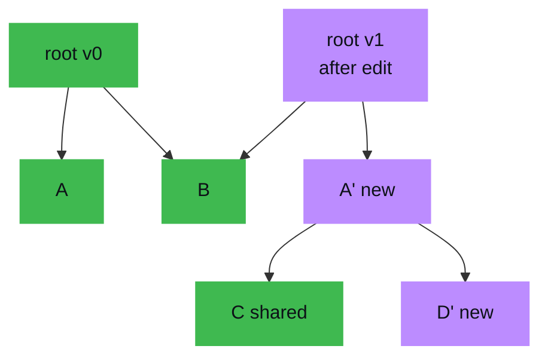

# Rope — Professional Level

> **Read time: ~60 minutes** · **Audience:** Engineers and algorithm designers who want the *proofs*: why every rope operation is O(log n) given the weight invariant, why concat is amortized cheap, how the Fibonacci-height rebalance bound works, why the treap variant gives expected O(log n), and what persistence costs in space. This is the theory that justifies everything `junior`/`middle`/`senior` asserted.

We assume full command of the rope: leaves with chunks, internal nodes with **weight = left-subtree length**, and the edit API `index / concat / split / insert / delete / substring`, all defined in terms of `split` and `concat`. Here we *prove* the bounds and analyze the balancing and persistence trade-offs rigorously.

---

## Table of Contents

1. [Model, Invariants, and Notation](#model)
2. [Index Correctness and the O(height) Bound](#index-proof)
3. [Split: Correctness and O(height) via the Weight Invariant](#split-proof)
4. [Insert / Delete / Concat Reduce to Split + Concat](#reduction)
5. [Balancing I — The Fibonacci Height Bound (Boehm–Atkinson–Plass)](#fibonacci)
6. [Balancing II — Treap Priorities Give Expected O(log n)](#treap)
7. [Amortized Concat and Rebuild Analysis](#amortized)
8. [Persistence Space Analysis](#persistence)
9. [Big-O / Bounds Summary](#big-o)
10. [Variant Comparison Table](#comparison)
11. [Code — Treap-Balanced Rope (Go, Java, Python)](#code-examples)
12. [Coding Patterns](#patterns)
13. [Error Handling](#errors)
14. [Performance Tips](#performance-tips)
15. [Best Practices](#best-practices)
16. [Edge Cases](#edge-cases)
17. [Common Mistakes](#common-mistakes)
18. [Cheat Sheet](#cheat-sheet)
19. [Visual Animation Reference](#animation)
20. [Summary](#summary)
21. [Further Reading](#further-reading)

---

<a name="model"></a>
## 1. Model, Invariants, and Notation

A rope is a binary tree `T`. Let:

- `len(v)` = number of characters in the subtree rooted at node `v` (cached field `length`).
- `w(v)` = **weight** of an internal node `v` = `len(left(v))`. For a leaf, `w(v) = |chunk(v)|`.
- `h(v)` = height of the subtree at `v` (a single leaf has height 0).
- `n = len(root)` = total characters.

**Weight invariant (WI):** for every internal node `v`, `w(v) = len(left(v))` and `len(v) = w(v) + len(right(v))`.

**Leaf-text invariant (LTI):** all characters live in leaves; internal nodes store no characters, only `w`, `len`, and (optionally) child pointers and augmentations.

**In-order invariant (IOI):** the in-order concatenation of leaf chunks equals the represented string `S`; equivalently, positions `[0, len(left(v)))` map to the left subtree and `[len(left(v)), len(v))` to the right.

These three invariants are everything. Every proof below is "the operation preserves WI/LTI/IOI and touches one root-to-leaf path."

---

<a name="index-proof"></a>
## 2. Index Correctness and the O(height) Bound

**Claim.** `index(v, i)` returns `S[i]` (the i-th character, 0-based) and runs in O(h(v) + chunk) time.

**Algorithm.**
```
index(v, i):
    while v is internal:
        if i < w(v):  v = left(v)
        else:         i = i - w(v);  v = right(v)
    return chunk(v)[i]
```

**Correctness (induction on height).**

*Base:* `v` is a leaf. By LTI and IOI the subtree's characters are exactly `chunk(v)`, and `0 ≤ i < |chunk(v)|`, so `chunk(v)[i]` is the i-th character. ✓

*Step:* `v` is internal with the WI. By IOI, the first `w(v) = len(left(v))` positions of `v`'s string are the left subtree's string, and the remaining positions are the right subtree's string, **shifted by `w(v)`**.
- If `i < w(v)`: the i-th character lies in `left(v)` at the same local index `i`. Recurse left with `i` unchanged. By the inductive hypothesis this returns the correct character. ✓
- If `i ≥ w(v)`: the i-th character lies in `right(v)` at local index `i − w(v)` (subtract the left's length to re-base). Recurse right with `i − w(v)`. By IH, correct. ✓

**Running time.** Each loop iteration descends one level, so the loop runs at most `h(v)` times; the final leaf scan is O(|chunk|). With balanced height `h = O(log n)` and bounded chunk size, **index is O(log n)**. ∎

The whole argument hinges on `i − w(v)` re-basing the coordinate: WI guarantees `w(v)` is *exactly* the count of characters skipped by going right, so positions remain consistent.

---

<a name="split-proof"></a>
## 3. Split: Correctness and O(height) via the Weight Invariant

**Claim.** `split(v, i)` returns ropes `(L, R)` with `string(L) = S[0..i)` and `string(R) = S[i..n)`, preserves WI/LTI/IOI, and runs in O(h(v)) time (excluding at most one O(|chunk|) leaf slice).

**Algorithm (recap).**
```
split(v, i):
    if v leaf:
        if i==0: (∅, v);  if i==len: (v, ∅)
        else: (leaf(chunk[:i]), leaf(chunk[i:]))
    elif i <= w(v):
        (L, Rsub) = split(left(v), i)
        return (L, concat(Rsub, right(v)))
    else:
        (Lsub, R) = split(right(v), i - w(v))
        return (concat(left(v), Lsub), R)
```

**Correctness (induction on height).**

*Base (leaf):* slicing `chunk` at `i` yields `chunk[0..i)` and `chunk[i..)`, which by LTI are exactly `S[0..i)` and `S[i..n)`. ✓

*Step (internal), case `i ≤ w(v)`:* the cut lies in the left subtree (positions `< w(v)`), so the *entire* right subtree belongs to `R`. Recursively split `left(v)` at `i`, obtaining `(L, Rsub)` with `string(L)=Sleft[0..i)` and `string(Rsub)=Sleft[i..)`. The right result is `Rsub` followed by the whole right subtree: `concat(Rsub, right(v))`. By IOI, `string(L)=S[0..i)` and `string(concat(Rsub, right(v))) = Sleft[i..) · Sright = S[i..n)`. ✓ Symmetric for `i > w(v)` with `i − w(v)` re-basing into the right subtree.

**WI/LTI/IOI preservation.** Each `concat` creates a new internal node whose weight is set to its left child's length (`concat` enforces WI), holds no characters (LTI), and respects ordering (IOI). The recursion only re-attaches existing subtrees, never reorders characters.

**Running time.** The recursion follows exactly one root-to-leaf path (one recursive call per level), doing O(1) work plus one `concat` (O(1) structural) per level. Hence O(h(v)) calls. At most one leaf is sliced, costing O(|chunk|). With `h = O(log n)`: **split is O(log n)**. ∎

The returned ropes can be temporarily less balanced near the cut; §5–§6 restore balance.

---

<a name="reduction"></a>
## 4. Insert / Delete / Concat Reduce to Split + Concat

Given §2–§3, the rest of the API inherits O(log n):

| Op | Definition | Bound |
|---|---|---|
| `concat(A,B)` | new node, `w = len(A)` | O(1) structural (O(log n) if rebalanced) |
| `insert(i,s)` | `concat(concat(L, leaf(s)), R)`, `(L,R)=split(i)` | O(log n) split + O(\|s\|) leaf + O(1) concats = **O(log n + \|s\|)** |
| `delete(i,j)` | `(L,m)=split(i); (_,R)=split(m, j−i); concat(L,R)` | 2 splits + 1 concat = **O(log n)** |
| `replace(i,j,s)` | delete then insert | **O(log n + \|s\|)** |
| `substring(i,j)` | descend to i, walk leaves for `m=j−i` | **O(log n + m)** |

**Why delete is O(log n) regardless of deleted length.** It performs *two* splits and *one* concat — none of which depends on `j − i`. The deleted middle subtree is simply discarded (or garbage-collected); no per-character work occurs. This is the formal reason a rope deletes a 100 MB block from a 1 GB buffer in microseconds, while a flat array is O(n). ∎

---

<a name="fibonacci"></a>
## 5. Balancing I — The Fibonacci Height Bound (Boehm–Atkinson–Plass)

The original paper does not rotate; it defines balance via Fibonacci numbers and rebuilds when violated.

**Definition (balanced rope).** Let `F(k)` be the Fibonacci sequence with `F(0)=0, F(1)=1, F(2)=1, ...`. A rope of height `h` is **balanced** iff its length is at least `F(h+2)`. Equivalently, a balanced rope of height `h` contains at least `F(h+2)` characters.

**Why this bounds height.** If `len ≥ F(h+2)` is required for height `h`, then conversely a balanced rope with `n` characters has height `h` satisfying `F(h+2) ≤ n`. Since `F(k) ≈ φ^k / √5` with `φ = (1+√5)/2 ≈ 1.618`, we get `φ^{h+2}/√5 ≤ n`, hence

```
h ≤ log_φ(n·√5) − 2 = O(log n).
```

So a balanced rope has height **O(log_φ n) ≈ 1.44 · log₂ n** — a constant factor taller than a perfectly balanced binary tree, but still logarithmic. ∎

**Maintenance.** After operations, if the rope becomes "unbalanced" (its height exceeds the Fibonacci threshold for its length), the paper rebuilds it: collect the leaves and combine them bottom-up using a Fibonacci-indexed array of slots, producing a balanced rope in O(number of leaves). Rebuild is O(n) but, charged across the operations that caused imbalance, is amortized cheap (§7). The elegance: balance is a *global length-vs-height* predicate, not a per-node rotation rule, so concat can stay O(1) and pay only when a rebuild is triggered.

---

<a name="treap"></a>
## 6. Balancing II — Treap Priorities Give Expected O(log n)

The dominant modern approach treats the rope as an **implicit treap** (`22-randomized-algorithms/04-treap`): assign each node an independent uniform random priority and maintain a **max-heap on priorities** while the in-order (positional) order is the BST order.

**Theorem (treap expected height).** A treap on `n` nodes with i.i.d. uniform priorities has expected height O(log n); more precisely, the expected depth of any node is `≤ 2·ln n + O(1)`, and the height is O(log n) with high probability.

**Proof sketch.** The treap is the BST obtained by inserting keys in *priority order* (highest priority = root). Inserting keys in a uniformly random order is exactly the randomized-BST / quicksort recurrence: the expected depth of the i-th element equals the expected number of ancestors, which by the standard "element `j` is an ancestor of `i` iff it has the highest priority among the contiguous range between them" argument is `∑ 1/(|i−j|+1) = H_i + H_{n−i+1} − 1 = O(log n)` (harmonic sums). Hence expected depth O(log n), so split/merge along a root-to-leaf path are expected O(log n). ∎ (Full derivation: `22-randomized-algorithms/04-treap` and `05-randomized-quicksort`.)

**Why treaps are preferred for ropes.**
- `split` and `merge` (the treap primitives) are exactly the rope's `split` and `concat`, and they **build new nodes without in-place rotation**, so persistence (§8) is automatic.
- Balance is maintained *by construction* — no separate rebalance pass — at the cost of expected (not worst-case) bounds.
- Tiny, uniform code: split and merge are ~15 lines each.

**Merge as concat.** `merge(A, B)` (all of A's positions precede B's) compares root priorities: the higher-priority root stays on top, and you recursively merge into the appropriate child. This is O(expected height) = O(log n), giving an O(log n)-amortized concat with guaranteed balance — strictly stronger than the naive O(1)-but-unbalanced concat.

---

<a name="amortized"></a>
## 7. Amortized Concat and Rebuild Analysis

There are two concat regimes:

**(a) Naive O(1) concat + periodic rebuild (BAP model).** Each concat is O(1) (one node). The tree may drift out of balance; when the Fibonacci predicate fails, a rebuild costs O(m) where `m` is the current leaf count. **Amortized argument (potential method):** define potential `Φ = c · (excess height over the balanced bound) · (size)`. Each O(1) concat increases `Φ` by O(1)-ish; a rebuild drops `Φ` to ~0 and pays for itself from the accumulated potential. Charging rebuilds to the operations that created the imbalance yields **amortized O(log n)** per operation (often quoted as amortized O(1) for the concat itself plus the cost of the eventual rebuild spread over many concats). The worst-case *single* operation is O(n) (the rebuild), so this model is unsuitable for hard real-time but fine for editors.

**(b) Treap merge concat (worst-case-expected O(log n)).** Each concat is `merge`, expected O(log n), with balance maintained continuously — no O(n) spikes (in expectation). Preferred when you want smooth latency.

**Trade-off table.**

| Model | Concat cost | Worst single op | Balance | Real-time? |
|---|---|---|---|---|
| Naive + Fibonacci rebuild | O(1) amortized | **O(n)** (rebuild) | amortized | no |
| Treap merge | O(log n) expected | O(log n) w.h.p. | always | mostly |
| AVL/red-black | O(log n) | **O(log n) strict** | always | yes |

**Take-away.** If you need strict worst-case O(log n) (e.g., a latency-SLO editor), use AVL/red-black rotations. If you want minimal code with persistence and good latency, use a treap. If you want the simplest possible code and can tolerate rare O(n) hiccups, use naive concat + Fibonacci rebuild.

---

<a name="persistence"></a>
## 8. Persistence Space Analysis

**Claim.** Under path-copying persistence (immutable nodes), each edit allocates **O(h) = O(log n)** new nodes and shares all others with the previous version; retaining `k` versions costs **O(n + k·log n)** space in total (shared base plus per-version path).

**Argument.** An edit (`insert`/`delete`/`split`+`concat`) follows one root-to-leaf path of length `h`. Every node on that path must be rebuilt (its child pointer or augmentation changes); every node *off* the path is unchanged and is shared by pointer with the old version. The number of rebuilt nodes equals the path length plus O(1) per level for re-linked siblings, i.e. **Θ(h) = Θ(log n)** new nodes. All other subtrees are referenced, not copied. Therefore:

```
space(k versions) = (nodes of the original) + Σ_{edits} O(log n)
                  = O(n/chunk) + O(k · log n).
```

For an editor keeping a bounded history of `k` versions on an `n`-character document, persistence overhead is `O(k log n)` — negligible beside the `O(n/chunk)` base. Undo/redo are O(1) (swap a retained root). Reclamation is by GC or reference counting: a node dies when no retained root reaches it. ∎

**Comparison to copying.** Full-copy snapshots cost O(n) each → O(k·n) for k versions. Path copying replaces the `n` with `log n`, an exponential improvement in version overhead — the same asymptotic win that makes persistent segment trees (`21-advanced-structures/11-persistent-segment-tree`) practical.



*Only the purple path (root v1, A', D') is new; green nodes (A, B, C) are shared between versions v0 and v1 — O(log n) new nodes per edit.*

---

<a name="big-o"></a>
## 9. Big-O / Bounds Summary

| Operation | Bound | Justification |
|---|---|---|
| index | O(log n) | §2: one path, WI re-bases position |
| split | O(log n) | §3: one path, O(1) concat/level |
| concat (naive) | O(1) structural | §4 |
| concat (treap merge) | O(log n) expected | §6 |
| insert / delete | O(log n) (+\|s\|) | §4 reduction |
| substring (m chars) | O(log n + m) | descend + leaf walk |
| rebalance (rebuild) | O(n), amortized cheap | §5, §7 |
| height (balanced) | O(log_φ n) ≈ 1.44 log₂ n | §5 Fibonacci bound |
| height (treap) | O(log n) expected/w.h.p. | §6 |
| undo / redo | O(1) | §8 retained root |
| persistence space / k versions | O(n + k·log n) | §8 path copying |

---

<a name="comparison"></a>
## 10. Variant Comparison Table

| Variant | Balance bound | Concat | Worst op | Persistence | Code | When |
|---|---|---|---|---|---|---|
| Naive + Fibonacci rebuild | O(log_φ n) amortized | O(1) | O(n) | easy | smallest | simple/batch |
| **Treap (implicit)** | O(log n) expected | O(log n) | O(log n) w.h.p. | **automatic** | small | most editors |
| AVL rope | strict O(1.44 log n) | O(log n) | **O(log n)** | harder | large | latency SLO |
| Red-black rope (piece-tree) | strict O(2 log n) | O(log n) | O(log n) | medium | large | VS Code-style |
| B-tree rope (high fanout) | O(log_B n) | O(log n) | O(log n) | medium | large | cache/disk-friendly |

High-fanout (B-tree) ropes reduce height and improve cache/disk locality at the cost of more per-node work; this is the direction production systems take when leaves back disk or page-cache.

---

<a name="code-examples"></a>
## 11. Code — Treap-Balanced Rope (Go, Java, Python)

A persistent, treap-balanced rope: `split` and `merge` keep expected O(log n) height with no rotations, and (kept immutable) give persistence for free.

### Go

```go
package rope

import "math/rand"

type T struct {
	left, right *T
	chunk       string
	prio        uint64
	weight      int // chars in left subtree
	size        int // total chars
}

func leaf(s string) *T {
	return &T{chunk: s, prio: rand.Uint64(), weight: len(s), size: len(s)}
}

func sz(t *T) int { if t == nil { return 0 }; return t.size }

func pull(t *T) *T { // recompute weight/size for an internal node (immutable copy)
	return &T{left: t.left, right: t.right, prio: t.prio,
		weight: sz(t.left), size: sz(t.left) + sz(t.right)}
}

// merge: all positions of a precede b. Expected O(log n).
func merge(a, b *T) *T {
	if a == nil { return b }
	if b == nil { return a }
	if a.prio > b.prio {
		return pull(&T{left: a.left, right: merge(a.right, b), prio: a.prio,
			chunk: a.chunk})
	}
	return pull(&T{left: merge(a, b.left), right: b.right, prio: b.prio,
		chunk: b.chunk})
}

// split into [0,i) and [i,n). Expected O(log n).
func split(t *T, i int) (*T, *T) {
	if t == nil { return nil, nil }
	if t.left == nil && t.right == nil { // leaf
		if i <= 0 { return nil, t }
		if i >= len(t.chunk) { return t, nil }
		return leaf(t.chunk[:i]), leaf(t.chunk[i:])
	}
	if i <= t.weight {
		l, r := split(t.left, i)
		return l, pull(&T{left: r, right: t.right, prio: t.prio})
	}
	l, r := split(t.right, i-t.weight)
	return pull(&T{left: t.left, right: l, prio: t.prio}), r
}
```

### Java

```java
final class TRope {
    final TRope left, right;
    final String chunk;       // leaf payload, null for internal
    final long prio;
    final int weight, size;

    TRope(TRope l, TRope r, String c, long p) {
        left = l; right = r; chunk = c; prio = p;
        int ls = l == null ? 0 : l.size, rs = r == null ? 0 : r.size;
        if (c != null) { weight = c.length(); size = c.length(); }
        else           { weight = ls;          size = ls + rs;     }
    }
    static TRope leaf(String s) {
        return new TRope(null, null, s, java.util.concurrent.ThreadLocalRandom
                .current().nextLong());
    }

    static TRope merge(TRope a, TRope b) {
        if (a == null) return b;
        if (b == null) return a;
        if (a.prio > b.prio)
            return new TRope(a.left, merge(a.right, b), a.chunk, a.prio);
        return new TRope(merge(a, b.left), b.right, b.chunk, b.prio);
    }

    static TRope[] split(TRope t, int i) {
        if (t == null) return new TRope[]{null, null};
        if (t.chunk != null) {
            if (i <= 0)               return new TRope[]{null, t};
            if (i >= t.chunk.length()) return new TRope[]{t, null};
            return new TRope[]{leaf(t.chunk.substring(0, i)),
                               leaf(t.chunk.substring(i))};
        }
        if (i <= t.weight) {
            TRope[] s = split(t.left, i);
            return new TRope[]{s[0], new TRope(s[1], t.right, null, t.prio)};
        }
        TRope[] s = split(t.right, i - t.weight);
        return new TRope[]{new TRope(t.left, s[0], null, t.prio), s[1]};
    }
}
```

### Python

```python
import random

class T:
    __slots__ = ("left", "right", "chunk", "prio", "weight", "size")
    def __init__(self, left, right, chunk, prio):
        self.left, self.right, self.chunk, self.prio = left, right, chunk, prio
        ls = left.size if left else 0
        rs = right.size if right else 0
        if chunk is not None:
            self.weight = self.size = len(chunk)
        else:
            self.weight, self.size = ls, ls + rs

def leaf(s):
    return T(None, None, s, random.getrandbits(64))

def merge(a, b):
    if a is None: return b
    if b is None: return a
    if a.prio > b.prio:
        return T(a.left, merge(a.right, b), a.chunk, a.prio)
    return T(merge(a, b.left), b.right, b.chunk, b.prio)

def split(t, i):
    if t is None:
        return None, None
    if t.chunk is not None:                  # leaf
        if i <= 0: return None, t
        if i >= len(t.chunk): return t, None
        return leaf(t.chunk[:i]), leaf(t.chunk[i:])
    if i <= t.weight:
        l, r = split(t.left, i)
        return l, T(r, t.right, None, t.prio)
    l, r = split(t.right, i - t.weight)
    return T(t.left, l, None, t.prio), r

# concat = merge; insert/delete via split+merge, all expected O(log n), persistent.
def concat(a, b): return merge(a, b)
def insert(t, i, s):
    l, r = split(t, i); return merge(merge(l, leaf(s)), r)
def delete(t, i, j):
    l, rest = split(t, i); _, r = split(rest, j - i); return merge(l, r)
```

---

<a name="patterns"></a>
## 12. Coding Patterns

1. **Prove via WI + one-path + O(1)/level.** Every rope bound is "the operation walks one root-to-leaf path doing O(1) (or O(1) concat) per level."
2. **Treap split/merge = rope split/concat with balance + persistence**, in ~30 lines total. Prefer it unless you need strict worst-case bounds.
3. **Immutability + path copying = O(log n)-space persistence**; do not mutate, build new nodes on the path.
4. **Charge rebuilds to imbalance** (potential method) when using the BAP naive-concat model.
5. **For strict latency, rotate (AVL/red-black); for disk/cache, increase fanout (B-tree rope).**

---

<a name="errors"></a>
## 13. Error Handling

| Error | Cause | Fix |
|---|---|---|
| Expected bound violated | Non-random / correlated priorities | Use a strong RNG; reseed per node. |
| O(n) latency spike | Fibonacci rebuild fired mid-frame | Switch to treap/AVL for smooth latency. |
| Persistence corruption | Mutated a pulled/shared node | Keep all nodes immutable; `pull` returns a new node. |
| Wrong split result | Re-based with wrong side's weight | `i − w(v)` only when going right; WI must hold. |
| Heap property broken after edit | Recomputed size but reused priority incorrectly | Preserve each node's original priority through `pull`. |

---

<a name="performance-tips"></a>
## 14. Performance Tips

1. **Use 64-bit priorities** to make ties astronomically unlikely (ties degrade expected height).
2. **Coalesce small leaves and cap chunk size** so `n/chunk` node count — and thus constants in O(log n) — stays small.
3. **Increase fanout (B-tree rope)** when leaves back disk/page-cache: fewer levels, fewer cache misses.
4. **Reference-count or arena-allocate** persistent nodes to control GC pressure across many versions.
5. **Iterators, not repeated `index`,** for scans: O(n) vs O(n log n).
6. **Bound retained versions** to keep persistence space at O(n + k log n) with small k.

---

<a name="best-practices"></a>
## 15. Best Practices

- **State and preserve WI/LTI/IOI explicitly**; every correctness proof depends on them.
- **Pick a balancing model by SLO:** treap (default), AVL/red-black (strict latency), BAP rebuild (simplest), B-tree (locality).
- **Keep nodes immutable** to get persistence and thread-safe snapshots for free.
- **Use strong 64-bit random priorities**; weak randomness silently degrades to O(n).
- **Amortize rebuilds via the potential method** and document the worst-case O(n) so callers know the latency profile.
- **Benchmark constants, not just asymptotics** — chunk size and fanout dominate real performance.

---

<a name="edge-cases"></a>
## 16. Edge Cases

| Case | Concern | Handling |
|---|---|---|
| Priority ties | height degrades | 64-bit priorities; tie-break by node id |
| Split at 0 / n | empty side | return `(∅, t)` / `(t, ∅)` |
| Empty rope | `nil` arithmetic | treat `nil` as size-0 identity for merge |
| Adversarial input vs naive model | O(n) rebuild storm | use treap/AVL, not naive concat |
| Very deep persistence chain | GC retains long chains | reference-count; drop old roots |
| Huge single leaf | intra-leaf slice O(chunk) | cap chunk size |

---

<a name="common-mistakes"></a>
## 17. Common Mistakes

1. **Believing concat is "free" with balance.** Balanced concat (merge) is O(log n); only the naive unbalanced one is O(1).
2. **Weak/correlated priorities**, silently breaking the expected O(log n) guarantee.
3. **Mutating shared nodes** under persistence, corrupting older versions.
4. **Assuming worst-case O(log n) from the BAP model** — its worst single op is O(n) (rebuild).
5. **Dropping the WI during rotations/pulls**, so `index`/`split` re-base with stale weights.
6. **Ignoring constants** (chunk size, fanout) and being surprised the rope is slower than a flat string on small inputs.
7. **Recomputing length on every `len` call** instead of caching `size`.

---

<a name="cheat-sheet"></a>
## 18. Cheat Sheet

```
INVARIANTS
    WI:  w(v) = len(left(v)),  len(v) = w(v) + len(right(v))
    LTI: characters only in leaves
    IOI: in-order leaf concat = S

PROOF SKELETON (every op)
    one root-to-leaf path · O(1) (or O(1) concat) per level · WI re-bases i
    => O(height); balanced height O(log n) => O(log n)

BALANCE / HEIGHT
    Fibonacci (BAP): len >= F(h+2)  =>  h <= 1.44 log2 n
    Treap: i.i.d. priorities => E[depth] <= 2 ln n + O(1) = O(log n)

CONCAT
    naive: O(1), needs periodic O(n) rebuild (amortized cheap, potential method)
    treap merge: O(log n) expected, always balanced, persistent

PERSISTENCE (path copying)
    O(log n) new nodes / edit; k versions => O(n + k log n) space
    undo/redo O(1) (retained root)

CHOOSE
    treap=default · AVL/RB=strict latency · BAP=simplest · B-tree=locality
```

---

<a name="animation"></a>
## 19. Visual Animation Reference

See `animation.html`. For the professional lens, treat each highlighted **index** descent as the O(height) path the proofs in §2 bound, each **split** as the one-path partition of §3, and each **concat** as the O(1) parent-creation of §4. The fact that only the path's nodes change per operation is the visual statement of the §8 persistence result: O(log n) new nodes, everything else shared. The Big-O panel encodes the §9 summary.

---

<a name="summary"></a>
## 20. Summary

- The **weight invariant** (`w(v) = len(left(v))`) makes `index` and `split` correct and **O(height)**: every operation walks one root-to-leaf path, re-basing the position by `i − w(v)` when going right.
- **Insert/delete/concat reduce to split + concat**, inheriting O(log n); delete is O(log n) *independent of the deleted length* (the middle subtree is discarded, not scanned).
- **Balance** comes three ways: BAP's **Fibonacci predicate** (`len ≥ F(h+2)` ⇒ `h ≤ 1.44 log₂ n`) with O(n) rebuilds amortized cheap; **treap priorities** giving expected O(log n) with no rotations and automatic persistence; or **AVL/red-black** for strict worst-case O(log n).
- **Amortized concat:** naive O(1) + rebuild (worst single op O(n)) vs treap merge O(log n) expected (smooth latency) — choose by SLO.
- **Persistence via path copying** costs **O(log n) new nodes per edit** and **O(n + k·log n)** space for k versions, with O(1) undo/redo — an exponential improvement over O(k·n) full-copy snapshots.

This completes the rope: from leaves-and-weights intuition, through the edit API and balancing, to a real persistent editor buffer, to the proofs that justify every bound.

---

<a name="further-reading"></a>
## 21. Further Reading

- **Boehm, Atkinson, Plass**, *"Ropes: An Alternative to Strings"*, SP&E 25(12), 1995 — Fibonacci balance and rebuild.
- **Seidel & Aragon**, *"Randomized Search Trees"*, Algorithmica 1996 — treap expected-O(log n) analysis (the §6 proof).
- **Driscoll, Sarnak, Sleator, Tarjan**, *"Making Data Structures Persistent"*, JCSS 1989 — path copying and the §8 space bound.
- **Tarjan**, *Amortized Computational Complexity*, SIAM J. Alg. Disc. Meth. 1985 — the potential method used in §7.
- **Knuth**, *TAOCP* Vol. 1 §1.2.8 — Fibonacci/φ asymptotics behind the height bound.
- Cross-links: `22-randomized-algorithms/04-treap`, `22-randomized-algorithms/05-randomized-quicksort`, `21-advanced-structures/11-persistent-segment-tree`, `09-trees/06-segment-tree`.

**Next step:** [interview.md](interview.md) — 40+ tiered rope questions and a concat/split/insert coding challenge in Go, Java, and Python.
