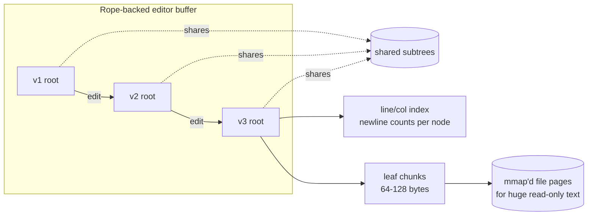

# Rope — Senior Level

> **Read time: ~60 minutes** · **Audience:** Engineers building or maintaining real text-editing systems — editor buffers, collaborative documents, large-file viewers — who need to turn the rope from a textbook tree into a production component: persistence for undo, snapshots for collaboration, chunk-size and memory tuning, and UTF-8 / grapheme correctness.

`junior.md` gave us leaves, weights, `index`, and `concat`. `middle.md` gave us `split`, `insert`, `delete`, and the balancing disciplines, plus where ropes sit relative to gap buffers and piece tables. This document is about **systems**: what changes when the rope has to back a real editor over real files with real users.

The themes are: (1) **persistence** — make the rope immutable so every edit yields a new version cheaply, giving O(1)-ish undo/redo and snapshots; (2) **collaboration** — how a persistent, position-addressed tree interacts with operational transformation (OT) and CRDTs; (3) **memory and chunk-size tuning** — the single biggest performance lever; (4) **correctness for human text** — bytes vs runes vs grapheme clusters, line/column mapping, and large-file (memory-mapped) backing.

---

## Table of Contents

1. [From Textbook Tree to Editor Buffer](#from-textbook)
2. [Persistence — Immutable Ropes and Cheap Undo](#persistence)
3. [Snapshots, Versions, and Collaborative Editing](#collaboration)
4. [Chunk-Size and Memory Tuning](#chunk-tuning)
5. [Large Files and Memory-Mapped Leaves](#large-files)
6. [UTF-8, Runes, Grapheme Clusters, and Line/Column](#unicode)
7. [Big-O and Memory Summary](#big-o)
8. [System Comparison Table](#comparison)
9. [Code Examples — Go, Java, Python](#code-examples)
10. [Coding Patterns](#patterns)
11. [Error Handling](#errors)
12. [Performance Tips](#performance-tips)
13. [Best Practices](#best-practices)
14. [Edge Cases](#edge-cases)
15. [Common Mistakes](#common-mistakes)
16. [Cheat Sheet](#cheat-sheet)
17. [Visual Animation Reference](#animation)
18. [Summary](#summary)
19. [Further Reading](#further-reading)

---

<a name="from-textbook"></a>
## 1. From Textbook Tree to Editor Buffer

A real editor buffer is not just "a string you can edit." It must also:

- **Undo/redo arbitrarily deep** — ideally in O(1) or O(log n) per step, not by re-applying a diff log.
- **Snapshot cheaply** — for autosave, "compare with saved", time-travel debugging, and collaboration baselines.
- **Map positions to line/column and back** — every cursor, every diagnostic squiggle, every "go to line 4023" needs it, and it must be O(log n), not O(n).
- **Stay responsive on gigabyte files** — open a 2 GB log without reading it all into RAM.
- **Handle Unicode like a human** — a "character" the user sees may be several bytes and several code points.

The rope is a good substrate for all of these *because* its edits touch only an O(log n) path. That path-locality is exactly what makes **persistence** (and therefore undo and snapshots) cheap, and what lets us augment nodes with **line counts** to get O(log n) line/column mapping. The rest of this document is those augmentations.



---

<a name="persistence"></a>
## 2. Persistence — Immutable Ropes and Cheap Undo

### 2.1 Path copying

Make every node **immutable**. An edit (`insert`, `delete`, `split`, `concat`) never mutates a node; it builds **new** nodes only along the affected root-to-leaf path and **shares** every untouched subtree with the previous version. Because the path has length O(log n), each edit allocates O(log n) new nodes and reuses the rest.

```
Before:            After insert (only the right spine is new):
      A                    A'
     / \                  /  \
    B   C       →        B    C'      (B shared with old version)
       / \                   /  \
      D   E                 D    E'   (D shared)
```

Old root `A` still describes the *previous* document; new root `A'` describes the edited one; they share `B` and `D`. This is the same path-copying technique used by **persistent segment trees** (`21-advanced-structures/11-persistent-segment-tree`) and immutable maps.

### 2.2 Undo/redo as version pointers

If every edit returns a new root and old roots stay alive, **undo is just "use the previous root."** Keep a stack (or list) of roots:

```
history = [v0]
on edit: v_new = edit(history.top); history.push(v_new)
undo:    history.pop()  -> previous root is now current
redo:    re-push the popped root
```

Each undo/redo is O(1) (pointer swap). Memory cost is O(log n) per retained version — vastly cheaper than snapshotting whole documents. Garbage collection (or reference counting) reclaims nodes once no version references them.

### 2.3 Why this beats a flat-string undo log

A flat-string editor typically stores an **operation log** and replays/inverts operations to undo. That is correct but couples undo to operation semantics and can be O(n) per step for large operations. Persistent ropes make undo **structural and uniform**: any edit, however large, is one new root; undo is one pointer. The trade is memory for retained versions, bounded by capping history depth or coalescing.

### 2.4 Persistence requires a self-balancing-without-mutation variant

Rotations mutate; path copying needs operations that produce new nodes. The **implicit treap** (`22-randomized-algorithms/04-treap`) is ideal here: its `split`/`merge` already build new nodes and never rotate in place, so persistence is automatic — every `merge` along the path allocates a fresh node and shares the rest. This is why treap-based ropes dominate collaborative/undo-heavy editors.

---

<a name="collaboration"></a>
## 3. Snapshots, Versions, and Collaborative Editing

### 3.1 Snapshots are free

A "snapshot" is just a retained root pointer. Autosave, "diff against last save", and "open file as it was 5 minutes ago" cost O(1) to capture and O(log n) per access — no copying.

### 3.2 The collaboration problem

Two users edit the same document concurrently. User A inserts at position 10; user B deletes positions 5–8 at the same time. When the edits are exchanged, A's "position 10" no longer means the same thing after B's delete shifts everything by 4. Resolving this is the job of **operational transformation (OT)** or **conflict-free replicated data types (CRDTs)** — not the rope itself. The rope is the *local data structure*; OT/CRDT is the *coordination protocol*.

How the rope helps:

- **Cheap baselines.** A persistent rope lets each peer keep the agreed common version as a retained root, apply local edits speculatively, and re-anchor against incoming remote edits — all without copying the document.
- **Position addressing.** Because every rope position maps to a leaf via weights, OT's index transforms apply directly.
- **CRDT caveat.** Pure CRDTs (e.g., RGA, Yjs, Automerge) usually key characters by *stable identifiers*, not integer positions, precisely because positions shift under concurrent edits. A rope keyed on integer position is excellent for the *local* buffer and for OT; for CRDT-style merging you typically layer an identifier index *on top of* (or instead of) raw positions. Many production collaborative editors keep a CRDT for merge semantics and a rope/piece-tree for fast local rendering and cursor math.

### 3.3 Practical architecture

```
Network ──CRDT/OT ops──► Merge layer ──positional edits──► Rope buffer ──► Renderer
                                   ▲                              │
                                   └────── retained roots ────────┘  (undo, baselines)
```

The rope owns *fast local edits, line/column mapping, and rendering*; the merge layer owns *concurrency correctness*. Keeping them separate is the senior design lesson: do not try to make the rope itself a CRDT.

---

<a name="chunk-tuning"></a>
## 4. Chunk-Size and Memory Tuning

Chunk size (leaf length) is the **single biggest performance lever** in a rope.

### 4.1 The trade-off

| Chunk size | Tree height | Per-node overhead | Intra-leaf edit cost | Cache behavior |
|---|---|---|---|---|
| **Tiny** (1–8) | tall (more nodes) | huge (pointers ≫ text) | cheap | poor (many tiny allocations) |
| **Medium** (64–256) | moderate | modest | moderate | good |
| **Large** (4 KB+) | short | tiny relative | expensive (copy whole chunk on intra-leaf cut) | excellent for scans, bad for edits |

- Smaller chunks → taller tree → more O(log n) hops and more pointer memory, but cheaper to slice on intra-leaf edits.
- Larger chunks → shorter tree, better scan locality, but any edit *inside* a chunk copies up to chunk-size bytes (because leaves are immutable / you split the chunk).

### 4.2 Practical guidance

- **64–256 bytes** is the common sweet spot for text editors: tree height stays small, per-leaf overhead is amortized, and intra-leaf copies are cheap.
- **Coalesce** adjacent small leaves after edits so the tree does not fill with 1–2 byte leaves (the classic post-many-edits degradation).
- **Split** leaves that grow past the cap (e.g., after a large paste landed in one leaf).
- Match chunk size to your **allocator and cache line** (multiples of 64 bytes are friendly).

### 4.3 Memory accounting

Total memory ≈ `n` bytes of text + `O(n / chunk)` internal nodes, each ~3–5 words (left, right, weight, length, maybe priority/parent). With 64-byte chunks, node overhead is a few percent of text size; with 4-byte chunks it can exceed the text itself. **This is why naive ropes look memory-hungry — almost always the fix is bigger chunks plus coalescing**, not abandoning the rope.

---

<a name="large-files"></a>
## 5. Large Files and Memory-Mapped Leaves

To open a 2 GB file without reading it all into RAM, make leaves reference **spans of a memory-mapped (mmap) file** rather than owning private byte arrays:

- A **read-only leaf** is `(file, offset, length)` — it points into the mmap'd original. Zero copy, zero RAM beyond the page cache.
- An **edit leaf** owns a small private byte array (the newly typed/pasted text).
- The tree interleaves read-only spans and edit leaves.

This is *exactly the piece-table idea* (`middle.md` §8): the original is read-only and referenced by spans; edits live elsewhere. A rope with mmap-backed leaves **converges with the piece-tree**. The win: opening the file is O(1) (just mmap), the OS pages in only what you scroll to, and edits never rewrite the original. The cost: a leaf is now a reference, and you must keep the mmap alive for the buffer's lifetime.

```
leaf kinds:
   OriginalSpan{ file, offset, length }   ← into mmap'd read-only file (lazy paging)
   EditChunk{ bytes }                       ← small private buffer for inserted text
```

For an editor, this is how you get "instant open" on huge files: the rope's leaves are windows into the file, materialized lazily by the page cache, with edits grafted in as small private leaves.

---

<a name="unicode"></a>
## 6. UTF-8, Runes, Grapheme Clusters, and Line/Column

"Character" is ambiguous, and getting it wrong corrupts text.

### 6.1 Three notions of position

| Unit | What it counts | Example for "é" (e + combining accent) |
|---|---|---|
| **Byte** | UTF-8 bytes | could be 3 bytes |
| **Code point (rune)** | Unicode scalar values | 2 code points (e, U+0301) |
| **Grapheme cluster** | user-perceived characters | **1** |

A cursor that moves "one character" must move one **grapheme cluster**, but the rope's weights count whatever unit you chose. The senior decision: **store byte offsets internally (fast, unambiguous), and convert to code-point / grapheme positions at the API boundary.** Never split a leaf in the middle of a multi-byte UTF-8 sequence or a grapheme cluster — round the cut to the nearest valid boundary.

### 6.2 Line/column mapping in O(log n)

Editors constantly convert between flat position and `(line, column)`. Augment each node with a **newline count** (number of `\n` in its subtree), just like weight counts characters:

```
node.newlines = newlines(left) + newlines(right)     # internal
leaf.newlines = count('\n' in chunk)
```

Now:
- **position → line:** descend counting newlines passed on the left, the same weight-descent shape.
- **line → start position:** descend by newline count instead of character count.
- Both **O(log n)**.

This newline-augmentation is the same technique as a **segment tree** storing an aggregate (`09-trees/06-segment-tree`): any associative per-subtree statistic (newline count, max line width, presence of a tab) can be maintained in O(log n) and queried over ranges.

### 6.3 Don't slice inside a code point or grapheme

When `split` would cut inside a multi-byte UTF-8 sequence or a combining sequence, snap to the nearest boundary or keep the unit intact in one leaf. Corruption here is silent and ugly (mojibake). Always round cuts to valid boundaries.

---

<a name="big-o"></a>
## 7. Big-O and Memory Summary

| Operation | Persistent rope (treap) | Notes |
|---|---|---|
| Index / char-at | O(log n) | |
| Insert / delete | O(log n) (+ \|s\| for inserted text) | path-copies O(log n) nodes |
| Concat | O(log n) amortized | merge along the path |
| Split | O(log n) | |
| Snapshot / undo / redo | **O(1)** | retain/swap a root pointer |
| position ↔ (line, col) | O(log n) | newline-augmented nodes |
| Open mmap'd huge file | O(1) | lazy paging via OS |
| Substring length m | O(log n + m) | |
| Memory | O(n) text + O(n/chunk) nodes + O(log n)/retained version | tune chunk size |

---

<a name="comparison"></a>
## 8. System Comparison Table

| Concern | Flat string | Gap buffer | Piece table | Rope (this doc) |
|---|---|---|---|---|
| Mid-file edit | O(n) | O(distance) | O(1)+find | **O(log n)** |
| Undo/redo | op log / copy | op log | **trivial** (old list) | **O(1)** (old root) |
| Snapshot | copy O(n) | copy O(n) | keep list | **O(1)** (root) |
| Huge read-only file | load all | load all | **mmap original** | **mmap leaves** |
| Line/column map | O(n) or side index | side index | side index | **O(log n)** augmented |
| Collaboration baseline | copy | hard | keep list | **retained roots** |
| Cache locality | best | best near gap | good | fair |
| Real-world | most code | Emacs | early Word | SGI STL; converges with VS Code piece-tree |

The senior takeaway: at editor scale the practical contenders are **piece-tree** and **rope**, and they converge — a rope with mmap leaves *is* a piece-tree, and a piece table in a balanced tree *is* a rope over reference-leaves. Choose based on whether your leaves naturally own text (rope) or reference append-only buffers (piece table); both give O(log n) edits, cheap undo, and huge-file support.

---

<a name="code-examples"></a>
## 9. Code Examples — Go, Java, Python

A persistent (immutable), newline-augmented rope sketch, plus an undo stack.

### Go

```go
package rope

type Node struct {
	left, right *Node
	chunk       string
	weight      int // chars in left subtree
	length      int // total chars
	newlines    int // total '\n' in subtree (for line/col)
}

func newLeaf(s string) *Node {
	return &Node{chunk: s, weight: len(s), length: len(s), newlines: countNL(s)}
}
func newInternal(l, r *Node) *Node {
	return &Node{
		left: l, right: r,
		weight:   l.length,
		length:   l.length + r.length,
		newlines: l.newlines + r.newlines,
	}
}
func countNL(s string) (c int) {
	for i := 0; i < len(s); i++ {
		if s[i] == '\n' {
			c++
		}
	}
	return
}

// LineOf returns the 0-based line number of byte position i. O(log n).
func (n *Node) LineOf(i int) int {
	line := 0
	for n.left != nil || n.right != nil {
		if i < n.weight {
			n = n.left
		} else {
			i -= n.weight
			line += n.left.newlines
			n = n.right
		}
	}
	for k := 0; k < i; k++ {
		if n.chunk[k] == '\n' {
			line++
		}
	}
	return line
}

// Buffer wraps a rope with an undo/redo history (persistent: O(1) undo).
type Buffer struct {
	versions []*Node
	cur      int
}

func NewBuffer(s string) *Buffer { return &Buffer{versions: []*Node{newLeaf(s)}} }
func (b *Buffer) root() *Node     { return b.versions[b.cur] }

func (b *Buffer) Insert(i int, s string) {
	nv := Insert(b.root(), i, s) // path-copying insert (immutable nodes)
	b.versions = append(b.versions[:b.cur+1], nv)
	b.cur++
}
func (b *Buffer) Undo() { if b.cur > 0 { b.cur-- } }
func (b *Buffer) Redo() { if b.cur < len(b.versions)-1 { b.cur++ } }
```

### Java

```java
final class Node {
    final Node left, right;
    final String chunk;
    final int weight, length, newlines;

    static Node leaf(String s) {
        return new Node(null, null, s, s.length(), s.length(), countNL(s));
    }
    static Node internal(Node l, Node r) {
        return new Node(l, r, null, l.length, l.length + r.length,
                        l.newlines + r.newlines);
    }
    private Node(Node l, Node r, String c, int w, int len, int nl) {
        left = l; right = r; chunk = c; weight = w; length = len; newlines = nl;
    }
    static int countNL(String s) {
        int c = 0; for (int i = 0; i < s.length(); i++) if (s.charAt(i) == '\n') c++;
        return c;
    }
}

/** Persistent buffer: every edit yields a new root; undo is O(1). */
final class Buffer {
    private final java.util.List<Node> versions = new java.util.ArrayList<>();
    private int cur = 0;

    Buffer(String s) { versions.add(Node.leaf(s)); }
    Node root() { return versions.get(cur); }

    void edit(Node newRoot) {
        while (versions.size() > cur + 1) versions.remove(versions.size() - 1);
        versions.add(newRoot); cur++;
    }
    void undo() { if (cur > 0) cur--; }
    void redo() { if (cur < versions.size() - 1) cur++; }
}
```

### Python

```python
class Node:
    __slots__ = ("left", "right", "chunk", "weight", "length", "newlines")

    def __init__(self, left=None, right=None, chunk=None):
        self.left, self.right, self.chunk = left, right, chunk
        if chunk is not None:
            self.weight = self.length = len(chunk)
            self.newlines = chunk.count("\n")
        else:
            self.weight = left.length
            self.length = left.length + right.length
            self.newlines = left.newlines + right.newlines


def line_of(n, i):
    """0-based line number of byte position i, O(log n)."""
    line = 0
    while n.chunk is None:
        if i < n.weight:
            n = n.left
        else:
            i -= n.weight
            line += n.left.newlines
            n = n.right
    return line + n.chunk[:i].count("\n")


class Buffer:
    """Persistent editor buffer: O(1) undo/redo via retained roots."""
    def __init__(self, s):
        self.versions = [Node(chunk=s)]
        self.cur = 0

    @property
    def root(self):
        return self.versions[self.cur]

    def commit(self, new_root):
        del self.versions[self.cur + 1:]   # truncate redo branch
        self.versions.append(new_root)
        self.cur += 1

    def undo(self):
        if self.cur > 0:
            self.cur -= 1

    def redo(self):
        if self.cur < len(self.versions) - 1:
            self.cur += 1
```

---

<a name="patterns"></a>
## 10. Coding Patterns

1. **Immutable nodes + path copying = persistence for free.** Every edit returns a new root; share untouched subtrees.
2. **Augment nodes with any associative subtree statistic** (newline count, max width, has-tab) and query it in O(log n) — the segment-tree pattern.
3. **Separate concerns:** rope = fast local buffer + rendering; CRDT/OT layer = concurrency correctness. Do not merge them.
4. **Byte offsets internally, Unicode units at the boundary.** Round all cuts to valid UTF-8 / grapheme boundaries.
5. **Reference-leaves for huge read-only files** (mmap spans) + small private leaves for edits — the rope/piece-tree convergence.

---

<a name="errors"></a>
## 11. Error Handling

| Error | Cause | Fix |
|---|---|---|
| Mojibake after edit | Cut inside a multi-byte UTF-8 sequence | Round cuts to code-point/grapheme boundaries. |
| Undo corrupts document | Mutated a node shared with an old version | Keep nodes strictly immutable; never edit in place. |
| Memory blow-up over a session | Unbounded version history | Cap history depth; coalesce/drop old versions. |
| Wrong line number | Forgot to add left subtree's newline count when going right | Mirror the weight-descent: `line += left.newlines`. |
| Huge-file open is slow | Read whole file instead of mmap | Use reference-leaves into an mmap'd file. |
| Concurrent edit clobbers remote change | Treated rope as the merge authority | Put OT/CRDT above the rope. |

---

<a name="performance-tips"></a>
## 12. Performance Tips

1. **Tune chunk size to 64–256 bytes** and coalesce small leaves; this is the biggest single win.
2. **Cap and coalesce undo history** to bound memory; persistent versions are cheap but not free.
3. **Augment with newline counts** so line/column is O(log n), never a full scan.
4. **mmap huge read-only originals**; let the OS page cache materialize only what is viewed.
5. **Use a treap (split/merge)** so persistence and balancing come together with no rotation code.
6. **Batch remote edits** from the collaboration layer into one split/concat sequence per frame.

---

<a name="best-practices"></a>
## 13. Best Practices

- **Make immutability the default**; it is what makes undo, snapshots, and collaboration tractable.
- **Keep the merge protocol (OT/CRDT) out of the rope.** The rope is the local buffer, not the consensus algorithm.
- **Decide byte vs rune vs grapheme up front** and round every cut to a valid boundary.
- **Augment nodes for line/column** rather than maintaining a separate, drift-prone line index.
- **Bound history and coalesce leaves**; otherwise a long session leaks memory and grows the tree.
- **Benchmark against a piece-tree** for your real workload; they converge, and the better choice is workload-specific.

---

<a name="edge-cases"></a>
## 14. Edge Cases

| Case | Concern | Handling |
|---|---|---|
| Edit inside multi-byte char | corruption | snap to UTF-8 boundary |
| Combining grapheme split by cursor | visual glitch | move by grapheme cluster |
| Undo after branching edits | redo stack stale | truncate redo branch on new edit |
| Snapshot of 2 GB file | memory | retain root only; mmap leaves |
| Last line without trailing `\n` | line count off-by-one | define line count = newlines + 1 consistently |
| Concurrent insert at same position | merge ambiguity | OT/CRDT layer resolves, not the rope |
| Many 1-char edits | tree bloats | coalesce small leaves |

---

<a name="common-mistakes"></a>
## 15. Common Mistakes

1. **Mutating shared nodes**, silently corrupting older versions and undo.
2. **Trying to make the rope itself a CRDT** instead of layering merge semantics above it.
3. **Cutting inside UTF-8 sequences or grapheme clusters**, producing mojibake.
4. **Unbounded undo history**, leaking memory across a long session.
5. **Tiny chunks**, making node overhead dwarf the text and the tree needlessly tall.
6. **A separate line index that drifts** out of sync; augment the nodes instead.
7. **Reading the whole huge file into RAM** instead of mmap reference-leaves.
8. **Forgetting `line += left.newlines`** on the right descent, returning wrong line numbers.

---

<a name="cheat-sheet"></a>
## 16. Cheat Sheet

```
PERSISTENCE (path copying)
    every edit -> new nodes on the O(log n) path; share the rest
    undo/redo  -> swap to a retained root  (O(1))
    use treap split/merge: builds new nodes, no in-place rotation

AUGMENTATION
    node.newlines = newlines(left)+newlines(right)
    pos -> line : descend, line += left.newlines when going right   (O(log n))
    any associative subtree stat works (segment-tree pattern)

CHUNK TUNING
    64-256 bytes typical; coalesce small leaves; split oversized ones
    memory ~ n bytes text + O(n/chunk) nodes + O(log n)/version

HUGE FILES
    leaf = OriginalSpan{file, off, len}  (mmap, lazy paging)
         | EditChunk{bytes}              (private inserted text)
    => rope converges with VS Code piece-tree

UNICODE
    store byte offsets; convert at API edge; round cuts to
    code-point / grapheme boundaries (never split mid-character)

COLLAB
    rope = fast local buffer + line/col + render
    OT/CRDT layer above = concurrency correctness; retained roots = baselines
```

---

<a name="animation"></a>
## 17. Visual Animation Reference

See `animation.html`. For the senior lens, use the **concat** and **split** controls to watch how few nodes change per operation — that path-locality is precisely what makes persistence (and therefore undo and snapshots) cheap: every edit rebuilds only the highlighted path and would share the rest. Imagine each operation also recording a new root pointer; undo is just stepping back through those roots. The Big-O panel's O(1) concat and O(log n) split/insert/delete map directly onto the editor capabilities in this document.

---

<a name="summary"></a>
## 18. Summary

- A production editor buffer needs **undo/redo, snapshots, line/column mapping, huge-file support, and Unicode correctness**; the rope's O(log n) path-locality makes all of them affordable.
- **Persistence via path copying** makes every edit a new root that shares O(log n) new nodes with the old version → **O(1) undo/redo and snapshots**. Treap split/merge gives persistence and balancing with no rotation code.
- **Collaboration:** keep the rope as the fast local buffer; put **OT/CRDT** above it for concurrency. Retained roots are cheap baselines.
- **Chunk size (64–256 bytes) is the biggest performance lever**; coalesce small leaves, split oversized ones. Memory = text + O(n/chunk) nodes + O(log n)/version.
- **Huge files:** reference-leaves into an mmap'd original + small edit leaves — at which point the rope **converges with VS Code's piece-tree**.
- **Unicode:** store byte offsets, convert at the boundary, round cuts to valid code-point/grapheme boundaries; augment nodes with newline counts for O(log n) line/column.

`professional.md` proves the O(log n) operation bounds from the weight invariant, analyzes amortized concat and the Fibonacci rebalance bound, and formalizes the persistence space cost.

---

<a name="further-reading"></a>
## 19. Further Reading

- **Boehm, Atkinson, Plass**, *"Ropes: An Alternative to Strings"*, SP&E 1995 — balancing and the SGI implementation lineage.
- **VS Code engineering blog**, *"Text Buffer Reimplementation"* — the piece-tree; the closest production cousin to a rope.
- **Driscoll, Sarnak, Sleator, Tarjan**, *"Making Data Structures Persistent"*, JCSS 1989 — the theory behind path copying.
- **Ellis & Gibbs**, operational transformation; **Shapiro et al.**, CRDTs — the collaboration layer that sits above the rope.
- **Unicode TR#29**, grapheme cluster boundaries — for cursor-correct "one character" movement.
- Cross-links: `21-advanced-structures/11-persistent-segment-tree`, `22-randomized-algorithms/04-treap`, `09-trees/06-segment-tree`.

**Next step:** [professional.md](professional.md) — O(log n) proofs from the weight invariant, amortized concat, the Fibonacci rebalance bound, and persistence space analysis.
