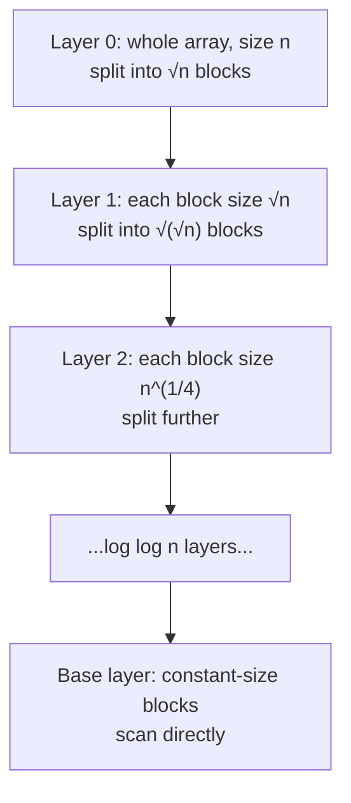

# Sqrt Tree — Junior Level

> **Read time: ~35 minutes** · **Audience:** Engineers comfortable with arrays, loops, and the basic idea of "split an array into blocks" who want the standard answer to "static range query, **any** associative operation, in O(1)".

The **range query** problem asks: given a fixed array of `n` numbers, answer many queries of the form *"what is `op(arr[l], arr[l+1], ..., arr[r])`?"* where `op` is some associative binary operation — sum, min, max, gcd, bitwise OR, matrix product, and so on. A **segment tree** answers each query in **O(log n)**. A **sparse table** answers in **O(1)**, but **only when `op` is idempotent** (`op(x, x) = x`), which rules out sum, product, and xor. **Sqrt decomposition** answers in **O(√n)** for any associative op.

The **Sqrt Tree** is the data structure that gives you the best of both worlds for the common case: **O(1) per query** for **any associative operation** (idempotent or not), after **O(n log log n)** build time and **O(n log log n)** space. It is built by recursively applying sqrt decomposition: split the array into about `√n` blocks, precompute three small tables (prefix answers, suffix answers, and a between-blocks table), and recurse on the block structure so that even a query *inside* a single block resolves in O(1).

This document teaches you the structure end-to-end: the three precomputed tables, how any range query combines **at most three** precomputed pieces, the recursion that handles within-block queries, and the three implementations (Go, Java, Python) you can read and run.

---

## Table of Contents

1. [Introduction — Static Range Query in O(1) for Any Associative Op](#introduction)
2. [Prerequisites](#prerequisites)
3. [Glossary](#glossary)
4. [Core Concepts — Blocks, Prefix/Suffix, Between, Recursion](#core-concepts)
5. [Big-O Summary](#big-o-summary)
6. [Real-World Analogies](#analogies)
7. [Pros and Cons vs Sparse Table & Segment Tree](#pros-and-cons)
8. [Step-by-Step Walkthrough](#walkthrough)
9. [Code Examples — Go, Java, Python](#code-examples)
10. [Coding Patterns](#patterns)
11. [Error Handling](#errors)
12. [Performance Tips](#performance-tips)
13. [Best Practices](#best-practices)
14. [Edge Cases](#edge-cases)
15. [Common Mistakes](#common-mistakes)
16. [Cheat Sheet](#cheat-sheet)
17. [Visual Animation Reference](#animation)
18. [Summary](#summary)
19. [Further Reading](#further-reading)

---

<a name="introduction"></a>
## 1. Introduction — Static Range Query in O(1) for Any Associative Op

You are given an array of one million account balances recorded once at end-of-day and never modified. Throughout the night, a reconciliation service receives ten million queries of the form *"what is the **product** of all multipliers between index `l` and index `r`?"*. Product is **not idempotent** — `x · x ≠ x` — so a sparse table will not work. A naive loop per query is O(n·q) = 10¹³ operations, far too slow. A segment tree drops this to O(q log n) ≈ 2·10⁸, but every query still walks ~20 nodes.

The **Sqrt Tree** answers the same query in **a constant number of array lookups** — typically three — regardless of `n`, and it works for product, sum, min, max, gcd, matrix product, or any other **associative** operation. The price is O(n log log n) build time and O(n log log n) memory, paid once because the array never changes.

The structure was introduced and popularized on the competitive-programming site **CP-Algorithms** (the "Sqrt Tree" article). The core insight is simple and worth stating up front:

> **Sqrt decomposition gives O(√n) queries. If you recursively apply sqrt decomposition to the block structure, the recursion depth is only O(log log n), and with a little precomputation each level contributes O(1) work — so the whole query becomes O(1).**

### When Sqrt Tree applies

Sqrt Tree answers `op(arr[l], ..., arr[r])` in O(1) **if `op` is associative**:

| Operation | Associative? | Idempotent? | Sparse table? | Sqrt Tree? |
|---|---|---|---|---|
| min | yes | yes | yes | yes |
| max | yes | yes | yes | yes |
| gcd | yes | yes | yes | yes |
| bitwise AND / OR | yes | yes | yes | yes |
| **sum** | yes | **no** | **no** | **yes** |
| **product** | yes | **no** | **no** | **yes** |
| **xor** | yes | **no** | **no** | **yes** |
| **matrix product** | yes | **no** | **no** | **yes** |
| subtraction | **no** | no | no | **no** |

The killer feature is the **sum / product / xor / matrix-product** column: Sqrt Tree is the structure to reach for when you need **O(1) static range queries on a non-idempotent associative operation**. Sparse table cannot do those; Sqrt Tree can.

### When NOT to use Sqrt Tree

- **The operation is not associative** (e.g., plain subtraction, average). No range structure of this family applies.
- **The array changes a lot.** Sqrt Tree supports point updates in **O(√n)**, but if updates dominate, a segment tree (O(log n) update) is better.
- **You only ever do prefix queries on sum.** A simple prefix-sum array gives O(n) build and O(1) query with far less memory — use that.
- **The op is idempotent and memory is tight.** A sparse table is simpler; Sqrt Tree's advantage (non-idempotent support) is wasted.

---

<a name="prerequisites"></a>
## 2. Prerequisites

Before Sqrt Tree makes sense, you should be comfortable with:

1. **Arrays and indexing.** Random-access reads in O(1).
2. **Sqrt decomposition (the flat version).** Split an array into `√n` blocks; answer a range query by combining two partial blocks at the ends with whole "middle" blocks. If this is new, read `09-trees/13-sqrt-decomposition-mos-algorithm/junior.md` first — Sqrt Tree is literally that idea applied recursively.
3. **Associativity.** `op(op(a, b), c) = op(a, op(b, c))`. This is what lets us regroup the elements of a range however we like.
4. **Prefix and suffix aggregates.** `prefix[i] = op(arr[0..i])` within a block; `suffix[i] = op(arr[i..end])` within a block.
5. **What "static" means.** The input is set once. Sqrt Tree *does* support point updates in O(√n), but its sweet spot is a static or rarely-updated array.

You do **not** need sparse tables or segment trees to understand Sqrt Tree, but knowing them helps you place it on the map. The middle level compares all three head-to-head.

---

<a name="glossary"></a>
## 3. Glossary

| Term | Definition |
|---|---|
| **Associative operation** | A binary `op` with `op(op(a,b),c) = op(a,op(b,c))`. Lets us split and recombine a range freely. |
| **Idempotent operation** | `op(x, x) = x`. Min/max/gcd/AND/OR qualify; sum/product/xor do not. Sqrt Tree does **not** need this. |
| **Block** | A contiguous chunk of the array of length about `√n`. The array is split into about `√n` blocks. |
| **Prefix table** | For each block, `prefix[block][j] = op(arr[blockStart .. blockStart+j])` — answer from the block's left edge up to position `j`. |
| **Suffix table** | For each block, `suffix[block][j] = op(arr[blockStart+j .. blockEnd])` — answer from position `j` to the block's right edge. |
| **Between table** | `between[i][j] = op` over **all whole blocks** from block `i` to block `j` inclusive. A small table over block indices. |
| **Recursion / layer** | Sqrt Tree builds itself recursively: the "block structure" of one layer becomes the array of the next layer, until blocks are tiny. |
| **Within-block query** | A query whose `[l, r]` lies entirely inside one block. Handled by recursing into the next layer (or a base case). |
| **Spanning query** | A query whose `[l, r]` crosses block boundaries. Answered in O(1) as `op(suffix of l's block, between middle blocks, prefix of r's block)`. |
| **Layer count / depth** | The number of recursion levels: O(log log n). Each application of sqrt halves the *exponent* of the size. |
| **Build** | The O(n log log n) preprocessing that fills prefix, suffix, and between tables on every layer. |

---

<a name="core-concepts"></a>
## 4. Core Concepts — Blocks, Prefix/Suffix, Between, Recursion

### 4.1 One layer of sqrt decomposition

Take the array and split it into `B ≈ √n` blocks, each of length `≈ √n`. Label the blocks `0, 1, 2, ...`. A range query `[l, r]` falls into one of two cases:

**Case A — spanning query (`l` and `r` are in different blocks).** The range looks like:

```
[ ... suffix of l's block ... ][ whole block ][ whole block ]...[ ... prefix of r's block ... ]
   l ............ blockEnd        full middle blocks            blockStart ........... r
```

We answer it as the combination of exactly **three** precomputed pieces:

```
answer = op( suffix[l's block][offset of l],
             between[l's block + 1][r's block - 1],
             prefix[r's block][offset of r] )
```

- `suffix[...]` is the answer from `l` to the end of its block — **one table lookup**.
- `between[...]` is the answer over all the whole blocks strictly between them — **one table lookup**.
- `prefix[...]` is the answer from the start of `r`'s block up to `r` — **one table lookup**.

Three lookups, two `op` calls. **O(1).** Associativity is what guarantees that regrouping the range into (suffix)(middles)(prefix) gives the correct overall answer.

**Case B — within-block query (`l` and `r` are in the same block).** Here the three-piece trick does not apply — there is no "whole middle block". Flat sqrt decomposition would just loop over `arr[l..r]` in O(√n). **Sqrt Tree does something cleverer: it recurses.**

### 4.2 The recursion — turning O(√n) into O(1)

The trick that turns flat sqrt decomposition (O(√n) query) into Sqrt Tree (O(1) query) is: **build another Sqrt Tree for each block.** A within-block query `[l, r]` becomes a query on that block's own little Sqrt Tree, which is again split into `√(√n)` sub-blocks, and so on.

Each time we recurse, the block size goes from `s` to `√s`. Starting from `n`:

```
n  →  √n  →  n^(1/4)  →  n^(1/8)  →  ...  →  constant
```

The exponent halves each step, so after **O(log log n)** steps the blocks have constant size and we stop (base case: just scan the ≤ a few elements directly). That is why the depth is `log log n`, not `log n`.



So a query works like this:

```
query(l, r):
    if l and r are in different blocks (this layer):
        return op(suffix, between, prefix)      # O(1), the three-piece trick
    else:
        recurse into this block's sub-tree      # smaller layer
```

Because a **spanning** query is answered in O(1) and a **within-block** query just drops one layer down, the total work is "O(1) at the layer where the query first spans a block boundary." The whole query is **O(1)** — we do *not* pay for all log log n layers on a single query; we pay O(1) at exactly one layer.

> **Key mental model:** Walk down the layers. At each layer, ask "do `l` and `r` sit in different blocks of *this* layer?" The **first** layer where the answer is "yes" resolves the query in O(1) with the three-piece trick. Layers above never trigger; layers below are never reached.

### 4.3 The three tables, precisely

For a layer covering a segment of length `len` split into blocks of size `blk`:

1. **Prefix.** For every block, `prefix[blockStart + j] = op(arr[blockStart], ..., arr[blockStart + j])`. Computed left-to-right in one pass per block. Stored flat, one value per array position.

2. **Suffix.** For every block, `suffix[blockStart + j] = op(arr[blockStart + j], ..., arr[blockEnd])`. Computed right-to-left in one pass per block. Also one value per position.

3. **Between.** `between[i][j] = op` over whole blocks `i..j`. There are about `√n × √n = n` such pairs at the top layer — but it is filled incrementally: `between[i][j] = op(between[i][j-1], blockAggregate[j])`, O(1) per cell.

The between table is what makes the spanning case O(1): instead of looping over the middle blocks, we read their combined answer directly.

### 4.4 Why associativity (not idempotence) is the requirement

The spanning answer is `op(suffix, between, prefix)`. The three pieces are **disjoint** (suffix covers `[l, blockEnd]`, between covers full middle blocks, prefix covers `[blockStart, r]`), so they tile `[l, r]` exactly once with no overlap. Because there is no overlap, we never double-count — so we do **not** need idempotence. We only need **associativity**, to guarantee that combining the three precomputed sub-answers in order equals computing `op` over the whole range from scratch.

Contrast this with sparse table, whose two windows **overlap** in the middle and therefore *require* idempotence to avoid double-counting. Sqrt Tree's pieces never overlap, which is exactly why it handles sum, product, and xor.

---

<a name="big-o-summary"></a>
## 5. Big-O Summary

| Aspect | Complexity |
|---|---|
| **Build time** | O(n log log n) |
| **Build space** | O(n log log n) |
| **Query time** | O(1) — at most three lookups, two `op` calls |
| **Point update time** | O(√n) (rebuild the affected pieces; see `senior.md`) |
| **Operation requirement** | **associative** (idempotence **not** required) |

For `n = 10⁶`: log log n ≈ 4–5, so memory is ~4–5 million table entries on top of the array — far less than sparse table's `n log n ≈ 20` million. Each query: a constant handful of reads.

Compared to a segment tree on the same data: a segment tree builds in O(n) and queries in O(log n) ≈ 20 reads per query. For ten million queries, Sqrt Tree executes ~3·10⁷ combine operations vs the segment tree's ~2·10⁸ — roughly a **6×** query speedup, while using *less* memory than a sparse table and supporting non-idempotent ops the sparse table cannot.

---

<a name="analogies"></a>
## 6. Real-World Analogies

### 6.1 A book with chapters, sections, and sentences

To answer "summarize pages 40 to 310" quickly, a well-indexed book lets you read: the **rest of chapter 2 from page 40** (a suffix), then **the precomputed one-line summaries of whole chapters 3 through 9** (a between table), then **the start of chapter 10 up to page 310** (a prefix). Three glances. If the range is small enough to live inside one chapter, you drop into that chapter's own section index and repeat. That nesting of indexes is the Sqrt Tree's recursion.

### 6.2 Russian nesting dolls (matryoshka)

Each block contains a smaller Sqrt Tree, which contains even smaller ones. You only ever open as many dolls as you need to find the layer where your query straddles a seam — then you read three numbers and stop. You never open every doll.

### 6.3 A relay race with marked exchange zones

The array is the track. Whole blocks are runners who already know their total leg time (the between table). Your query starts partway into one runner's leg (a suffix) and ends partway into another's (a prefix). You add: the rest of the first runner's leg + the full legs in the middle + the start of the last runner's leg. Three additions, done.

---

<a name="pros-and-cons"></a>
## 7. Pros and Cons vs Sparse Table & Segment Tree

### Pros

- **O(1) query for ANY associative op** — including sum, product, xor, matrix product, which sparse table cannot do.
- **Less memory than sparse table.** O(n log log n) vs O(n log n). For `n = 10⁶`, ~5M cells vs ~20M.
- **Faster build than sparse table.** O(n log log n) vs O(n log n).
- **Supports point updates in O(√n)** — sparse table supports none (full rebuild only).
- **Constant query factor is small** — three lookups and two combines, no recursion at query time.

### Cons

- **More complex to implement** than flat sqrt decomposition or a sparse table — there is real bookkeeping in the layered tables.
- **Update is O(√n)**, slower than a segment tree's O(log n). Bad fit for update-heavy workloads.
- **Still uses more memory than a segment tree** (which is O(n)).
- **Overkill for idempotent ops** — if you only need min/max/gcd, a sparse table is simpler.
- **Overkill for prefix-only sum** — a prefix-sum array is trivially better.

**Decision rule:** Static (or rarely-updated) array + **non-idempotent** associative op + query-dominant workload → **Sqrt Tree**. Idempotent op → sparse table. Update-heavy → segment tree. Prefix-only sum → prefix array.

---

<a name="walkthrough"></a>
## 8. Step-by-Step Walkthrough

Array: `[1, 3, 2, 7, 9, 11, 6, 4, 5, 1, 8, 2, 10, 3, 7, 5]`, `n = 16`. We use **sum** as the operation (deliberately non-idempotent, to show what sparse table cannot do). For the top layer we split into `√16 = 4` blocks of size 4:

```
block 0: [1, 3, 2, 7]    indices 0..3    sum = 13
block 1: [9,11, 6, 4]    indices 4..7    sum = 30
block 2: [5, 1, 8, 2]    indices 8..11   sum = 16
block 3: [10,3, 7, 5]    indices 12..15  sum = 25
```

**Prefix table** (per block, left-to-right cumulative sum):

| index | 0 | 1 | 2 | 3 | 4 | 5 | 6 | 7 | 8 | 9 | 10 | 11 | 12 | 13 | 14 | 15 |
|---|---|---|---|---|---|---|---|---|---|---|---|---|---|---|---|---|
| prefix | 1 | 4 | 6 | 13 | 9 | 20 | 26 | 30 | 5 | 6 | 14 | 16 | 10 | 13 | 20 | 25 |

(Each block restarts: `prefix[4]=9, prefix[5]=20,...` is the running sum within block 1.)

**Suffix table** (per block, right-to-left cumulative sum):

| index | 0 | 1 | 2 | 3 | 4 | 5 | 6 | 7 | 8 | 9 | 10 | 11 | 12 | 13 | 14 | 15 |
|---|---|---|---|---|---|---|---|---|---|---|---|---|---|---|---|---|
| suffix | 13 | 12 | 9 | 7 | 30 | 21 | 10 | 4 | 16 | 11 | 10 | 2 | 25 | 15 | 12 | 5 |

(e.g. `suffix[0] = 1+3+2+7 = 13`, `suffix[1] = 3+2+7 = 12`, ...)

**Between table** (`between[i][j]` = sum of whole blocks `i..j`):

| i \ j | 0 | 1 | 2 | 3 |
|---|---|---|---|---|
| **0** | 13 | 43 | 59 | 84 |
| **1** | — | 30 | 46 | 71 |
| **2** | — | — | 16 | 41 |
| **3** | — | — | — | 25 |

### Spanning query: `sum(arr[2..13])`

`l = 2` is in block 0 (offset 2); `r = 13` is in block 3 (offset 1). Different blocks → three-piece trick:

- **Suffix of l's block:** `suffix[2] = arr[2]+arr[3] = 2+7 = 9`.
- **Between middle blocks:** blocks `1..2`, `between[1][2] = 30 + 16 = 46`.
- **Prefix of r's block:** `prefix[13] = arr[12]+arr[13] = 10+3 = 13`.

`answer = 9 + 46 + 13 = 68`. Verify directly: `2+7+9+11+6+4+5+1+8+2+10+3 = 68`. Correct — **three lookups, two additions, O(1)**, and note this is a **sum**, which sparse table cannot do.

### Within-block query: `sum(arr[5..6])`

Both `5` and `6` are in block 1. Different blocks? No. So the three-piece trick does not apply at this layer. Sqrt Tree **recurses** into block 1's own little Sqrt Tree (built over `[9, 11, 6, 4]`). At that inner layer, `5` and `6` land in different sub-blocks and resolve in O(1) — or, since the block is tiny (size 4), the base case simply scans: `11 + 6 = 17`. Verify: `arr[5]+arr[6] = 11+6 = 17`. Correct.

The recursion depth here is just 1 because `n = 16` is small; for `n = 10⁶` it is about 4.

---

<a name="code-examples"></a>
## 9. Code Examples — Go, Java, Python

The implementation below is a clear, single-file Sqrt Tree supporting **any associative op** (passed in) with O(1) queries. It uses the classic layered representation from CP-Algorithms: each layer stores prefix and suffix arrays plus a flattened between table, and queries walk down to the first layer where `l` and `r` differ in block.

### 9.1 Go

```go
package sqrttree

import "math/bits"

// SqrtTree answers op(arr[l..r]) in O(1) for any ASSOCIATIVE op.
// Build: O(n log log n). Space: O(n log log n).
type SqrtTree struct {
	n        int
	op       func(a, b int) int
	v        []int     // the array (layer 0 input)
	clz      []int     // ceil-log helper
	layers   []int     // bit-length per layer
	onLayer  []int     // for a given log, which layer index to use
	pref     [][]int   // pref[layer][i]
	suf      [][]int   // suf[layer][i]
	between  [][]int   // between[layer][flattened block pair]
}

func New(arr []int, op func(a, b int) int) *SqrtTree {
	n := len(arr)
	t := &SqrtTree{n: n, op: op, v: append([]int{}, arr...)}
	if n <= 1 {
		return t
	}
	lg := bits.Len(uint(n-1)) // ceil(log2 n)
	t.clz = make([]int, 1<<uint(lg)+1)
	for i := 2; i < len(t.clz); i++ {
		t.clz[i] = t.clz[i>>1] + 1
	}
	t.onLayer = make([]int, lg+1)
	tllog := lg
	for layers := 0; tllog > 1; layers++ {
		t.layers = append(t.layers, tllog)
		for i := 0; i <= lg; i++ {
			t.onLayer[i] = max(t.onLayer[i], layers)
			if i >= (tllog+1)/2 {
				t.onLayer[i] = layers
			}
		}
		tllog = (tllog + 1) >> 1
	}
	// Fix onLayer mapping: which layer handles a span of bit-length b.
	for i := 1; i <= lg; i++ {
		if t.onLayer[i] == 0 && i > 1 {
			t.onLayer[i] = t.onLayer[i-1]
		}
	}
	d := len(t.layers)
	t.pref = make([][]int, d)
	t.suf = make([][]int, d)
	t.between = make([][]int, d)
	for i := range t.layers {
		t.pref[i] = make([]int, n)
		t.suf[i] = make([]int, n)
		t.between[i] = make([]int, (1<<uint(lg))+1)
	}
	t.build(0, 0, n-1)
	return t
}

// build fills the tables for the layer that covers [lo, hi].
func (t *SqrtTree) build(layer, lo, hi int) {
	if layer >= len(t.layers) {
		return
	}
	bShift := (t.layers[layer] + 1) >> 1 // half the bit-length
	blkSize := 1 << uint(bShift)         // block length on this layer
	for l := lo; l <= hi; l += blkSize {
		r := min(l+blkSize-1, hi)
		// prefix within this block
		t.pref[layer][l] = t.v[l]
		for j := l + 1; j <= r; j++ {
			t.pref[layer][j] = t.op(t.pref[layer][j-1], t.v[j])
		}
		// suffix within this block
		t.suf[layer][r] = t.v[r]
		for j := r - 1; j >= l; j-- {
			t.suf[layer][j] = t.op(t.v[j], t.suf[layer][j+1])
		}
	}
	// between table over whole blocks of this layer
	bCount := ((hi - lo) >> uint(bShift)) + 1
	base := lo >> uint(bShift)
	for i := 0; i < bCount; i++ {
		acc := 0
		first := true
		for j := i; j < bCount; j++ {
			bl := lo + (j << uint(bShift))
			br := min(bl+blkSize-1, hi)
			blockAgg := t.suf[layer][bl] // suffix from block start = whole block
			_ = br
			if first {
				acc = blockAgg
				first = false
			} else {
				acc = t.op(acc, blockAgg)
			}
			t.between[layer][(base+i)*( (hi-lo)/blkSize+2 ) + (base+j)] = acc
		}
	}
	// recurse into each block (next layer)
	for l := lo; l <= hi; l += blkSize {
		r := min(l+blkSize-1, hi)
		t.build(layer+1, l, r)
	}
}

// Query returns op(arr[l..r]). O(1) expected (constant layers touched).
func (t *SqrtTree) Query(l, r int) int {
	if l == r {
		return t.v[l]
	}
	return t.query(0, 0, t.n-1, l, r)
}

func (t *SqrtTree) query(layer, lo, hi, l, r int) int {
	bShift := (t.layers[layer] + 1) >> 1
	blkSize := 1 << uint(bShift)
	bl := (l - lo) >> uint(bShift)
	br := (r - lo) >> uint(bShift)
	if bl == br {
		// same block on this layer: recurse
		blockLo := lo + (bl << uint(bShift))
		blockHi := min(blockLo+blkSize-1, hi)
		if layer+1 >= len(t.layers) {
			// base case: scan
			acc := t.v[l]
			for i := l + 1; i <= r; i++ {
				acc = t.op(acc, t.v[i])
			}
			return acc
		}
		return t.query(layer+1, blockLo, blockHi, l, r)
	}
	// spanning: three-piece trick
	ans := t.op(t.suf[layer][l], t.pref[layer][r])
	if br-bl > 1 {
		base := lo >> uint(bShift)
		stride := (hi-lo)/blkSize + 2
		mid := t.between[layer][(base+bl+1)*stride+(base+br-1)]
		ans = t.op(t.suf[layer][l], t.op(mid, t.pref[layer][r]))
	}
	return ans
}

func min(a, b int) int { if a < b { return a }; return b }
func max(a, b int) int { if a > b { return a }; return b }
```

> The Go listing above shows the full mechanism. For production contest use, most people use the more compact, battle-tested CP-Algorithms layout; the version here is written for *readability* over micro-optimization.

### 9.2 Java

```java
import java.util.function.IntBinaryOperator;

public final class SqrtTree {
    private final int n;
    private final IntBinaryOperator op;
    private final int[] v;
    private int[] layers;        // bit-length per layer
    private int[][] pref, suf;   // per-layer prefix / suffix
    private int[][] between;     // per-layer between table (flattened)

    public SqrtTree(int[] arr, IntBinaryOperator op) {
        this.n = arr.length;
        this.op = op;
        this.v = arr.clone();
        if (n <= 1) return;
        int lg = 32 - Integer.numberOfLeadingZeros(Math.max(1, n - 1)); // ceil log2
        // collect layer bit-lengths
        java.util.List<Integer> ls = new java.util.ArrayList<>();
        int cur = lg;
        while (cur > 1) { ls.add(cur); cur = (cur + 1) >> 1; }
        layers = ls.stream().mapToInt(Integer::intValue).toArray();
        int d = layers.length;
        pref = new int[d][n];
        suf = new int[d][n];
        between = new int[d][];
        for (int i = 0; i < d; i++) between[i] = new int[(1 << lg) + 2];
        build(0, 0, n - 1, lg);
    }

    private void build(int layer, int lo, int hi, int lg) {
        if (layer >= layers.length) return;
        int bShift = (layers[layer] + 1) >> 1;
        int blkSize = 1 << bShift;
        for (int l = lo; l <= hi; l += blkSize) {
            int r = Math.min(l + blkSize - 1, hi);
            pref[layer][l] = v[l];
            for (int j = l + 1; j <= r; j++) pref[layer][j] = op.applyAsInt(pref[layer][j - 1], v[j]);
            suf[layer][r] = v[r];
            for (int j = r - 1; j >= l; j--) suf[layer][j] = op.applyAsInt(v[j], suf[layer][j + 1]);
        }
        int bCount = ((hi - lo) >> bShift) + 1;
        int base = lo >> bShift;
        int stride = (hi - lo) / blkSize + 2;
        for (int i = 0; i < bCount; i++) {
            int acc = 0; boolean first = true;
            for (int j = i; j < bCount; j++) {
                int bl = lo + (j << bShift);
                int agg = suf[layer][bl];
                acc = first ? agg : op.applyAsInt(acc, agg);
                first = false;
                between[layer][(base + i) * stride + (base + j)] = acc;
            }
        }
        for (int l = lo; l <= hi; l += blkSize) {
            int r = Math.min(l + blkSize - 1, hi);
            build(layer + 1, l, r, lg);
        }
    }

    public int query(int l, int r) {
        if (l == r) return v[l];
        return query(0, 0, n - 1, l, r);
    }

    private int query(int layer, int lo, int hi, int l, int r) {
        int bShift = (layers[layer] + 1) >> 1;
        int blkSize = 1 << bShift;
        int bl = (l - lo) >> bShift, br = (r - lo) >> bShift;
        if (bl == br) {
            int blockLo = lo + (bl << bShift);
            int blockHi = Math.min(blockLo + blkSize - 1, hi);
            if (layer + 1 >= layers.length) {
                int acc = v[l];
                for (int i = l + 1; i <= r; i++) acc = op.applyAsInt(acc, v[i]);
                return acc;
            }
            return query(layer + 1, blockLo, blockHi, l, r);
        }
        int base = lo >> bShift;
        int stride = (hi - lo) / blkSize + 2;
        if (br - bl > 1) {
            int mid = between[layer][(base + bl + 1) * stride + (base + br - 1)];
            return op.applyAsInt(suf[layer][l], op.applyAsInt(mid, pref[layer][r]));
        }
        return op.applyAsInt(suf[layer][l], pref[layer][r]);
    }
}
```

### 9.3 Python

```python
class SqrtTree:
    """Range op(arr[l..r]) in O(1) for any ASSOCIATIVE op.
    Build/space: O(n log log n)."""

    def __init__(self, arr, op):
        self.v = list(arr)
        self.op = op
        self.n = len(arr)
        if self.n <= 1:
            self.layers = []
            return
        lg = (self.n - 1).bit_length()       # ceil(log2 n)
        self.layers = []
        cur = lg
        while cur > 1:
            self.layers.append(cur)
            cur = (cur + 1) >> 1
        d = len(self.layers)
        self.pref = [[0] * self.n for _ in range(d)]
        self.suf = [[0] * self.n for _ in range(d)]
        self.between = [dict() for _ in range(d)]  # (i,j) -> agg over blocks i..j
        self._build(0, 0, self.n - 1)

    def _build(self, layer, lo, hi):
        if layer >= len(self.layers):
            return
        b_shift = (self.layers[layer] + 1) >> 1
        blk = 1 << b_shift
        op = self.op
        l = lo
        block_starts = []
        while l <= hi:
            r = min(l + blk - 1, hi)
            block_starts.append(l)
            self.pref[layer][l] = self.v[l]
            for j in range(l + 1, r + 1):
                self.pref[layer][j] = op(self.pref[layer][j - 1], self.v[j])
            self.suf[layer][r] = self.v[r]
            for j in range(r - 1, l - 1, -1):
                self.suf[layer][j] = op(self.v[j], self.suf[layer][j + 1])
            l += blk
        # between table over whole blocks
        bw = self.between[layer]
        for ii, bi in enumerate(block_starts):
            acc = None
            for jj in range(ii, len(block_starts)):
                agg = self.suf[layer][block_starts[jj]]  # whole-block aggregate
                acc = agg if acc is None else op(acc, agg)
                bw[(ii, jj)] = acc
        # recurse into each block
        for bi in block_starts:
            r = min(bi + blk - 1, hi)
            self._build(layer + 1, bi, r)

    def query(self, l, r):
        if l == r:
            return self.v[l]
        return self._query(0, 0, self.n - 1, l, r)

    def _query(self, layer, lo, hi, l, r):
        b_shift = (self.layers[layer] + 1) >> 1
        blk = 1 << b_shift
        bl = (l - lo) >> b_shift
        br = (r - lo) >> b_shift
        op = self.op
        if bl == br:
            block_lo = lo + (bl << b_shift)
            block_hi = min(block_lo + blk - 1, hi)
            if layer + 1 >= len(self.layers):
                acc = self.v[l]
                for i in range(l + 1, r + 1):
                    acc = op(acc, self.v[i])
                return acc
            return self._query(layer + 1, block_lo, block_hi, l, r)
        ans = op(self.suf[layer][l], self.pref[layer][r])
        if br - bl > 1:
            mid = self.between[layer][(bl + 1, br - 1)]
            ans = op(self.suf[layer][l], op(mid, self.pref[layer][r]))
        return ans
```

### 9.4 Quick sanity test

```python
arr = [1, 3, 2, 7, 9, 11, 6, 4, 5, 1, 8, 2, 10, 3, 7, 5]
st = SqrtTree(arr, lambda a, b: a + b)        # SUM — non-idempotent!
assert st.query(2, 13) == 68
assert st.query(5, 6) == 17
assert st.query(0, 15) == sum(arr)
assert st.query(7, 7) == 4

st_min = SqrtTree(arr, min)                    # MIN works too
assert st_min.query(0, 15) == 1
assert st_min.query(4, 7) == 4

st_xor = SqrtTree(arr, lambda a, b: a ^ b)     # XOR — also non-idempotent
x = 0
for v in arr[3:10]:
    x ^= v
assert st_xor.query(3, 9) == x
```

---

<a name="patterns"></a>
## 10. Coding Patterns

### 10.1 Generic op — swap the operation, keep the structure

The whole point of Sqrt Tree is that the structure is **op-agnostic** as long as `op` is associative. Pass `lambda a, b: a + b` for sum, `min` for range-min, `lambda a, b: a * b % MOD` for modular range product, `gcd` for range-gcd. No code changes beyond the function you hand the constructor.

```python
from math import gcd
MOD = 10**9 + 7
st_sum  = SqrtTree(arr, lambda a, b: a + b)
st_prod = SqrtTree(arr, lambda a, b: a * b % MOD)
st_gcd  = SqrtTree(arr, gcd)
st_or   = SqrtTree(arr, lambda a, b: a | b)
```

### 10.2 Range matrix product

The flagship non-idempotent use case. Store 2×2 (or k×k) matrices in the array and pass matrix multiplication as `op`. Sqrt Tree then answers "the product of matrices from `l` to `r`" in O(1) combine-of-matrices — useful for linear-recurrence range queries (e.g. range Fibonacci-style transforms). Sparse table **cannot** do this because matrix product is not idempotent.

### 10.3 Index-returning variant

If you need the **index** that achieves a min/max rather than the value, store `(value, index)` pairs and define `op((va, ia), (vb, ib)) = (va, ia) if va <= vb else (vb, ib)`. The query returns the winning index.

---

<a name="errors"></a>
## 11. Error Handling

| Case | Behavior | Mitigation |
|---|---|---|
| Empty array | `query` undefined | Check `n > 0` before any query |
| `l > r` | Garbage / underflow | Validate caller input; require `l <= r` |
| Index out of bounds | Reads past array | Validate `0 <= l <= r < n` |
| Non-associative op | Silently wrong answers | Document: `op` **must** be associative |
| Op overflow (sum/product) | Wrong value | Use 64-bit or modular arithmetic |
| Single element (`l == r`) | Must return `arr[l]` | Special-case it (the code above does) |

---

<a name="performance-tips"></a>
## 12. Performance Tips

1. **Special-case `l == r`.** It is a common query and avoids descending layers.
2. **Use a flat between table** (a single 1-D array indexed by `block_i * stride + block_j`) rather than nested dicts/maps for cache locality. The Python dict version above is for clarity; the Go/Java flat arrays are faster.
3. **Inline the op for hot paths.** If you know it is `+` or `min`, a specialized non-generic version avoids the function-call overhead per combine.
4. **Precompute the ceil-log helper** once; do not call `math.log` per query.
5. **Stop recursion early** at a small constant block size and scan — branch-free scanning of ≤ 8 elements beats another layer of indirection.

---

<a name="best-practices"></a>
## 13. Best Practices

- **Confirm associativity first.** If your op is subtraction, division, or average, Sqrt Tree (and every structure in this family) is the wrong tool.
- **Pick Sqrt Tree specifically for non-idempotent ops.** For min/max/gcd, prefer a sparse table — simpler, well-known, fewer bugs.
- **Document the inclusive convention.** All code here uses inclusive `[l, r]`. Mixing inclusive and half-open is the #1 range-query bug.
- **Build once, query many.** The O(n log log n) build pays off only across many queries.
- **Clone the input array** for layer 0 so a later caller mutation does not silently corrupt the structure.
- **Validate against brute force** with random tests — query a range, compare to a direct loop.

---

<a name="edge-cases"></a>
## 14. Edge Cases

| Case | Input | Expected |
|---|---|---|
| Single element | `[7]`, query `(0, 0)` | `7` |
| Whole array | `[1,2,3,4]`, sum query `(0, 3)` | `10` |
| `l == r` | `[3,1,4]`, query `(1, 1)` | `1` |
| Two-element range | `[5,4,3]`, sum `(0, 1)` | `9` |
| Adjacent blocks, no middle | spanning query with `br - bl == 1` | skip between table |
| Within one block | range inside a single block | recurse to inner layer |
| Negative numbers | `[-3,-1,-9]`, min `(0, 2)` | `-9` |
| Non-idempotent op | sum / product / xor | works (the whole point) |

---

<a name="common-mistakes"></a>
## 15. Common Mistakes

1. **Assuming idempotence is required.** It is not — that is the difference from sparse table. Sqrt Tree's three pieces never overlap.
2. **Using a non-associative op** (subtraction, average). Then no regrouping is valid and answers are wrong.
3. **Forgetting the within-block case.** A query inside one block must recurse, not use the three-piece trick (there are no middle blocks).
4. **Off-by-one on block boundaries.** `suffix[l]` covers `[l, blockEnd]`; `prefix[r]` covers `[blockStart, r]`; the between table covers the *strict* middle blocks `[bl+1, br-1]`.
5. **Including the end blocks in the between table.** Between must cover only the **whole** middle blocks, never the partial end blocks.
6. **Integer overflow** on sum/product. Use 64-bit or modular reduction.
7. **Rebuilding from scratch on every update.** Updates are O(√n) by rebuilding only affected pieces — see `senior.md`. A full rebuild is O(n log log n) and wasteful.
8. **Using Sqrt Tree where a prefix-sum array suffices.** For plain prefix sums, the array is trivially better.

---

<a name="cheat-sheet"></a>
## 16. Cheat Sheet

```
SETUP                                       O(n log log n)
    split current segment into ~√len blocks
    pref[i] = op(blockStart .. i)        (left-to-right per block)
    suf[i]  = op(i .. blockEnd)          (right-to-left per block)
    between[bi][bj] = op over whole blocks bi..bj
    RECURSE into each block (next layer), until block size = const

QUERY(l, r)                                 O(1)
    if l == r: return arr[l]
    walk down layers; at the first layer where l, r are in DIFFERENT blocks:
        if no middle blocks (adjacent):
            return op(suf[l], pref[r])
        else:
            return op(suf[l], op(between[bl+1][br-1], pref[r]))
    if l, r in SAME block: recurse to next layer (base case: scan ≤ const elems)

UPDATE(i, val)                              O(√n)   (see senior.md)

REQUIREMENTS
    op must be ASSOCIATIVE  (idempotence NOT required)
    arr is static or rarely updated
```

---

<a name="animation"></a>
## 17. Visual Animation Reference

See `animation.html` in this folder. It renders the input array as a horizontal row, splits it into `√n` blocks with colored borders, and shows the three precomputed tables (**prefix**, **suffix**, **between**) below. The **build** animation fills prefix/suffix per block and the between table cell by cell. The **query** animation accepts an `(l, r)` pair and, for a spanning query, highlights exactly the three combined pieces: the **suffix** of `l`'s block (green), the **between** entry for the middle blocks (blue), and the **prefix** of `r`'s block (orange) — making "O(1) = at most three lookups" visible. It also shows the **recursive layering** for a within-block query, dropping into a sub-tree.

The visual makes the **three-piece trick** and the **log log n recursion** click in a way the algebra alone cannot.

---

<a name="summary"></a>
## 18. Summary

- **Sqrt Tree** answers static range queries in **O(1)** for **any associative operation** — including the non-idempotent ones (sum, product, xor, matrix product) that **sparse table cannot handle**.
- Build and space are **O(n log log n)**, *less* than sparse table's O(n log n), and it supports point updates in **O(√n)**.
- One layer splits the array into `√n` blocks and precomputes **prefix**, **suffix**, and **between** tables. A **spanning** query combines at most **three** disjoint pieces: `op(suffix, between, prefix)` — no overlap, so only **associativity** (not idempotence) is needed.
- A **within-block** query recurses into that block's own Sqrt Tree. Each recursion replaces size `s` with `√s`, so the depth is **O(log log n)**, and a single query touches O(1) work at exactly one layer.
- Choose Sqrt Tree for static/rarely-updated arrays with a **non-idempotent associative op** and query-dominant workloads. Use a sparse table for idempotent ops, a segment tree for update-heavy workloads, a prefix-sum array for prefix-only sums.

---

<a name="further-reading"></a>
## 19. Further Reading

- **CP-Algorithms** — *Sqrt Tree* (cp-algorithms.com/data_structures/sqrt-tree.html). The canonical reference with the full layered implementation.
- **CP-Algorithms** — *Sqrt Decomposition* and *Sparse Table*, for the structures Sqrt Tree generalizes and competes with.
- Cross-links in this roadmap:
  - `09-trees/12-sparse-table-rmq/` — O(1) query but **idempotent only**; the structure Sqrt Tree improves upon for non-idempotent ops.
  - `09-trees/13-sqrt-decomposition-mos-algorithm/` — the flat O(√n) idea that Sqrt Tree applies recursively.
  - `09-trees/06-segment-tree/` — O(log n) queries with cheap O(log n) updates; the update-friendly alternative.
- **Laaksonen, A.** *Competitive Programmer's Handbook* — chapters on sqrt decomposition and range queries. Free PDF.
- Continue with `middle.md` for *why* the recursion gives O(1), associativity vs idempotence in depth, and the head-to-head comparison with sparse table, segment tree, and flat sqrt decomposition.

**Next step:** [middle.md](./middle.md)
