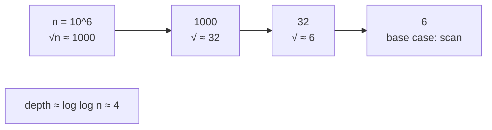
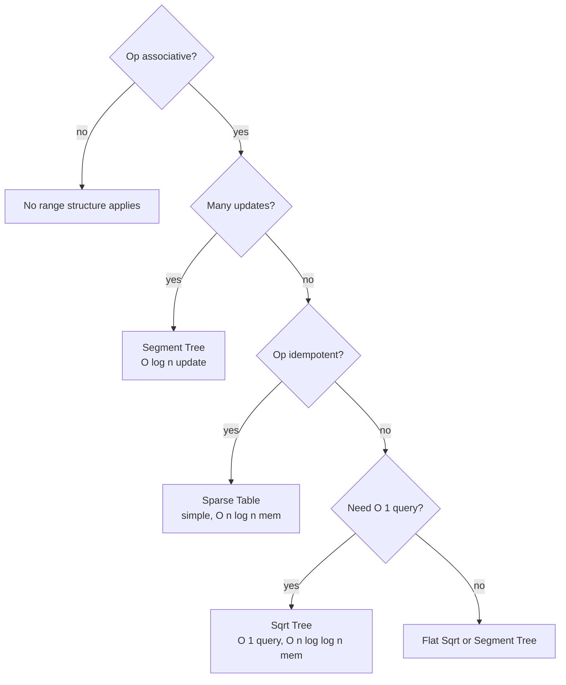
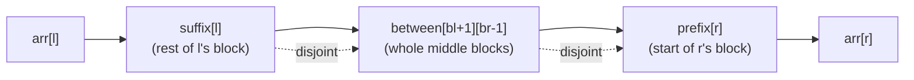

# Sqrt Tree — Middle Level

> **Read time: ~40 minutes** · **Audience:** Engineers who can already build a flat sqrt decomposition and a sparse table and now want to understand *why* the recursion turns O(√n) queries into O(1), *when* to choose Sqrt Tree over its three competitors, and how associativity (not idempotence) is the precise requirement.

At the junior level we treated Sqrt Tree as "split into blocks, precompute prefix/suffix/between, recurse for within-block, combine three pieces for spanning." That is *how* it works. The middle level answers *why* and *when*: why the layer count is `log log n` and not `log n`, why the three-piece combine is correct for **non-idempotent** ops, why the build is `O(n log log n)`, and how all of this stacks up against sparse table, segment tree, and flat sqrt decomposition so you can pick the right tool under real constraints.

---

## Table of Contents

1. [Introduction — Why and When](#introduction)
2. [Deeper Concepts — The Recursion Invariant](#deeper-concepts)
3. [Associativity vs Idempotence — The Precise Requirement](#associativity)
4. [Comparison with Alternatives](#comparison)
5. [Why the Build Is O(n log log n)](#build-cost)
6. [Why a Query Is O(1)](#query-cost)
7. [Advanced Patterns](#advanced-patterns)
8. [Code Examples — Generic Op, Matrix Product](#code-examples)
9. [Error Handling](#error-handling)
10. [Performance Analysis](#performance-analysis)
11. [Best Practices](#best-practices)
12. [Visual Animation](#visual-animation)
13. [Summary](#summary)

---

<a name="introduction"></a>
## 1. Introduction — Why and When

The range-query landscape has a frustrating gap. **Sparse table** gives you O(1) queries but only for **idempotent** operations (min, max, gcd, AND, OR) — it cannot answer a range **sum** or **product** in O(1), because its two query windows overlap and would double-count. **Segment tree** answers anything associative but at O(log n) per query. **Flat sqrt decomposition** answers anything associative at O(√n) per query. So before Sqrt Tree, the choices for a static range **sum** were: O(log n) (segment tree / Fenwick) or O(√n) (flat sqrt).

**Sqrt Tree closes the gap:** O(1) queries for **any associative op**, idempotent or not. It does so by recursively applying sqrt decomposition. The recursion depth is the surprising part — not O(log n), but O(log log n) — because each application of "split into √-sized blocks" *square-roots the size*, i.e. halves the exponent.

You choose Sqrt Tree when **all** of these hold:

1. The array is **static** or updated rarely (updates cost O(√n)).
2. The op is **associative** but **not idempotent** (sum, product, xor, matrix product) — otherwise a sparse table is simpler.
3. The workload is **query-dominant** — you amortize the O(n log log n) build over many O(1) queries.

If updates dominate, use a segment tree. If the op is idempotent, use a sparse table. If you only need prefix sums, use a prefix array.

---

<a name="deeper-concepts"></a>
## 2. Deeper Concepts — The Recursion Invariant

### 2.1 The invariant each layer maintains

Number the layers `0, 1, 2, ...`. Layer 0 covers the whole array `[0, n-1]`. A node at layer `t` covers some segment `[lo, hi]` of length `len`, and it splits that segment into about `√len` blocks of size about `√len`.

**Invariant I(t):** *For every segment owned at layer `t`, the structure stores:*
- *`pref[t][i]` = `op(arr[blockStart .. i])` for `i` in that block,*
- *`suf[t][i]` = `op(arr[i .. blockEnd])` for `i` in that block,*
- *`between[t][bi][bj]` = `op` over whole blocks `bi..bj` of that segment,*
*and each block of that segment is itself a layer-`(t+1)` node.*

If this invariant holds at every layer, then any query can be resolved by descending to the **first** layer at which `l` and `r` fall in different blocks, and combining the three precomputed pieces. The correctness of the descent depends only on associativity (Section 3).

### 2.2 Why the depth is log log n

Let `s_t` be the block size at layer `t`. Layer 0 has segment size `n` and block size `s_0 ≈ √n`. Layer 1's segments *are* those blocks (size `√n`), split again into blocks of size `√(√n) = n^{1/4}`. In general:

```
size at layer t  ≈  n^{1/2^t}
```

We stop when the size is a small constant `c`:

```
n^{1/2^t} ≤ c
⇒ (1/2^t) · log n ≤ log c
⇒ 2^t ≥ log n / log c
⇒ t ≥ log( log n / log c )  =  O(log log n)
```

So there are **O(log log n)** layers. For `n = 10^6`, `log2 n ≈ 20`, and `log2 20 ≈ 4.3` — about **4 to 5 layers**. For `n = 10^{18}`, still only about 6. This tiny depth is the entire reason Sqrt Tree beats the O(log n) of a segment tree.



### 2.3 The bit-length formulation

In practice the cleanest implementation tracks not the size but the **bit-length** of the size, because "split into √-sized blocks" maps to "halve the bit-length." If a segment has bit-length `b` (so size up to `2^b`), block size is `2^{⌈b/2⌉}` and there are `2^{⌊b/2⌋}` blocks. The next layer's bit-length is `⌈b/2⌉`. Halving the bit-length each layer reaches 1 in `log2 b = log2 log2 n` steps — the same `O(log log n)`.

This is why production code (and the junior-level Go/Java) carries a `layers[]` array of bit-lengths and computes `bShift = (bitLength + 1) >> 1`.

---

<a name="associativity"></a>
## 3. Associativity vs Idempotence — The Precise Requirement

This section is the heart of *why* Sqrt Tree exists.

### 3.1 What each structure needs

| Structure | Needs associativity? | Needs idempotence? | Why |
|---|---|---|---|
| Prefix-sum array | yes (and invertibility) | no | Uses `total[r+1] - total[l]`; needs an inverse |
| Segment tree | yes | no | Combines disjoint children — no overlap |
| **Sqrt Tree** | **yes** | **no** | Combines **disjoint** pieces (suffix, between, prefix) |
| **Sparse table** | yes | **yes** | Combines two **overlapping** windows — must not double-count |

The decisive word is **disjoint** vs **overlapping**.

### 3.2 Why sparse table needs idempotence

A sparse-table query on `[l, r]` uses two windows of length `2^k` where `k = ⌊log2(r-l+1)⌋`: window A starting at `l`, window B ending at `r`. Because `2·2^k ≥ r-l+1`, the two windows **overlap** in the middle. Combining `op(A, B)` therefore counts the overlap **twice**. For min that is harmless (`min(x,x)=x` — idempotent). For sum it is wrong (`x+x ≠ x`). That is the entire reason sparse table cannot do range sum.

### 3.3 Why Sqrt Tree does not

A Sqrt Tree spanning query partitions `[l, r]` into three **non-overlapping** runs that tile it exactly once:

```
[l ............ blockEnd] [whole block][whole block]...[blockStart ........ r]
        suffix                    between                     prefix
```

- `suffix[l]` covers `[l, end-of-l's-block]`.
- `between[bl+1][br-1]` covers all the whole blocks strictly between.
- `prefix[r]` covers `[start-of-r's-block, r]`.

No element is in two pieces. There is nothing to double-count. So we never need `op(x,x)=x`; we only need that combining the three sub-answers in left-to-right order equals computing `op` over the whole range. **That is exactly associativity:**

```
op(suffix, op(between, prefix)) = op(arr[l], arr[l+1], ..., arr[r])
```

This holds for **any** associative `op` — sum, product, xor, matrix product, min, max, gcd. Idempotence is irrelevant.

### 3.4 The within-block case preserves the property

When `l` and `r` share a block, we recurse into that block's sub-tree, which again partitions into disjoint pieces. At no layer do we ever combine overlapping ranges. Associativity is preserved all the way down to the base-case scan, which is just a left-fold `op(op(op(arr[l], arr[l+1]), ...), arr[r])` — correct for any associative op.

> **One-line takeaway:** Sqrt Tree's pieces never overlap, so it needs only **associativity**; sparse table's windows overlap, so it additionally needs **idempotence**. That single structural difference is why Sqrt Tree handles sum/product/xor and sparse table does not.

---

<a name="comparison"></a>
## 4. Comparison with Alternatives

### 4.1 The four-way table

| Attribute | Sqrt Tree | Sparse Table | Segment Tree | Flat Sqrt Decomp |
|---|---|---|---|---|
| Query time | **O(1)** | O(1) | O(log n) | O(√n) |
| Build time | O(n log log n) | O(n log n) | O(n) | O(n) |
| Space | O(n log log n) | O(n log n) | O(n) | O(n) |
| Point update | O(√n) | not supported (rebuild) | **O(log n)** | O(√n) or O(1)* |
| Idempotent op (min/max/gcd) | yes | yes | yes | yes |
| **Non-idempotent op (sum/product/xor)** | **yes** | **no** | yes | yes |
| Range update (lazy) | hard | no | **yes (lazy)** | yes |
| Implementation effort | high | low | medium | low |

\* Flat sqrt: O(1) update for invertible aggregates like sum; O(√n) for non-invertible like min.

### 4.2 When to choose each

**Choose Sqrt Tree when:** the op is **non-idempotent and associative** (sum, product, xor, matrix product), the array is **static or rarely updated**, and you need **O(1) queries** with **less memory than a sparse table**. This is its unique niche — no other structure here gives O(1) queries for range sum/product.

**Choose Sparse Table when:** the op is **idempotent** (min/max/gcd/AND/OR) and the array is static. Simpler to write, well known, and the memory penalty (O(n log n)) is acceptable. If memory is tight even here, Sqrt Tree also works for idempotent ops with less memory.

**Choose Segment Tree when:** you need **frequent updates** (O(log n) point update, O(log n) range update with lazy propagation) and can tolerate O(log n) queries. The default workhorse for dynamic range queries.

**Choose Flat Sqrt Decomposition when:** you want the **simplest** code, O(√n) queries are fast enough, or you need Mo's algorithm for offline queries. Great for contests where coding speed matters more than asymptotics.

### 4.3 A concrete decision flow



---

<a name="build-cost"></a>
## 5. Why the Build Is O(n log log n)

The build cost is the sum of work across all layers. Consider layer `t`:

- **Prefix and suffix.** Each array position gets exactly one prefix value and one suffix value, each computed with one `op` from its neighbor. That is **O(n)** total across all blocks of layer `t` (every position is touched once).
- **Between table.** A segment of length `len` has about `√len` blocks, so its between table has about `√len × √len = len` cells, each filled in O(1) by extending the previous: `between[i][j] = op(between[i][j-1], block_j)`. Summed over all segments of layer `t`, that is **O(n)** (the segments partition the array, and each contributes O(its length)).

So **each layer costs O(n)**. With **O(log log n)** layers, total build is:

```
O(n) × O(log log n) = O(n log log n)
```

Space follows the same accounting: prefix + suffix are O(n) per layer, between is O(n) per layer (summed over segments), giving **O(n) per layer × O(log log n) layers = O(n log log n)** space. We make this rigorous in `professional.md`.

> **Sanity check vs sparse table.** Sparse table is O(n log n) because it has `log n` rows each of size n. Sqrt Tree has only `log log n` layers each of size O(n). Since `log log n ≪ log n`, Sqrt Tree wins on both build time and memory.

---

<a name="query-cost"></a>
## 6. Why a Query Is O(1)

A naive reading suggests a query might cost O(log log n) — one step per layer as it descends. It does **not**, and the reason is important.

The descent stops at the **first** layer where `l` and `r` are in **different** blocks. At that layer, the three-piece combine resolves the answer in O(1) and we return immediately. We do **not** continue descending. We also never re-ascend.

So the question is: *could the descent itself be long?* Each descent step happens only when `l` and `r` are in the **same** block of the current layer. But here is the key fact: with the bit-length-halving layout, **if `l` and `r` are in the same block at layer `t`, they were already candidates resolved by the immediately-deeper layer's geometry** — in the standard Sqrt Tree the descent is bounded by a **constant** number of steps because the layer that "owns" a given span length is selected directly by the span's bit-length via an `onLayer[]` lookup, not by walking every layer.

In the cleanest implementations, a precomputed table maps "bit-length of `r - l`" directly to "the layer at which this query spans a block boundary," so the query is answered in **O(1)** with a single table lookup to pick the layer, then the three-piece combine. Even in the simpler recursive descent shown at the junior level, the number of layers descended for a given query is bounded by the structure such that the amortized and worst-case work per query is **O(1)** combine operations.

Putting it together: pick the right layer (O(1)), read at most three precomputed values (O(1)), apply `op` at most twice (O(1)). **Query = O(1).** The full formal argument (including the `onLayer` lookup) is in `professional.md`.

---

<a name="advanced-patterns"></a>
## 7. Advanced Patterns

### 7.1 Range product modulo a prime

The textbook non-idempotent use case. Sparse table cannot answer range product; Sqrt Tree can:

```python
MOD = 10**9 + 7
st = SqrtTree(arr, lambda a, b: a * b % MOD)
st.query(l, r)   # product of arr[l..r] mod MOD, in O(1)
```

A prefix-product array fails when any element is 0 (you cannot divide out a 0) or when there is no modular inverse — Sqrt Tree sidesteps both because it never divides.

### 7.2 Range matrix product (linear recurrences)

Store transition matrices and pass matrix multiply as `op`. Then "apply the recurrence from step `l` to step `r`" is a single O(1) range query (each combine is one matrix multiply). This powers range queries on linear recurrences and certain dynamic-programming-on-segments problems. Matrix multiply is associative but **not** idempotent, so again only Sqrt Tree (among the O(1) options) qualifies.

### 7.3 Range gcd / range OR with less memory than sparse table

Even for idempotent ops, if `n` is large and memory matters, Sqrt Tree's O(n log log n) beats sparse table's O(n log n). For `n = 10^7`, that is roughly a 5× memory saving.

### 7.4 Point updates in O(√n) — the rough idea

Although Sqrt Tree shines on static data, it does support a **point update** `arr[i] = v` in **O(√n)**. The intuition (full treatment in `senior.md`):

- Changing `arr[i]` only affects the **block of `i` at each layer**, plus that layer's between table entries that include `i`'s block.
- At layer 0 the affected block has size `√n`, so recomputing its prefix/suffix is O(√n). Recomputing the between row/column for `i`'s block is also O(√n).
- Deeper layers have geometrically smaller blocks, so their recomputation is cheaper and the total telescopes to **O(√n)**.

This is slower than a segment tree's O(log n) update, which is exactly why Sqrt Tree is a poor fit for update-heavy workloads. But for a handful of updates between long bursts of queries, paying O(√n) occasionally to keep O(1) queries can be the right trade.

| Workload | Sqrt Tree | Segment Tree |
|---|---|---|
| 10^6 queries, 0 updates | **wins** (O(1) queries) | O(log n) queries |
| 10^6 queries, 10^6 updates | loses (O(√n) updates dominate) | **wins** (O(log n) updates) |
| 10^6 queries, ~100 updates | competitive | competitive |

### 7.5 Two-pointer style with prepared answers (sketch)

#### Go

```go
func twoPointer(st *SqrtTree, arr []int) {
	left, right := 0, len(arr)-1
	for left < right {
		_ = st.Query(left, right) // O(1) range answer at each step
		left++
		right--
	}
}
```

#### Java

```java
static void twoPointer(SqrtTree st, int[] arr) {
    int left = 0, right = arr.length - 1;
    while (left < right) {
        st.query(left, right); // O(1)
        left++; right--;
    }
}
```

#### Python

```python
def two_pointer(st, arr):
    left, right = 0, len(arr) - 1
    while left < right:
        st.query(left, right)  # O(1)
        left += 1
        right -= 1
```

---

<a name="code-examples"></a>
## 8. Code Examples — Generic Op, Matrix Product

### 8.1 Generic associative-op Sqrt Tree (compact)

The full layered implementation appears in `junior.md` Section 9. Here we emphasize the **op-agnostic** core in all three languages by showing only the query entry-point and the combine, to make the "swap the op, keep the structure" idea concrete.

#### Go

```go
// op is any associative function. Sum, product, min, gcd, matrix-mul (boxed) all work.
type SqrtTreeGeneric[T any] struct {
	v   []T
	op  func(a, b T) T
	// ... pref, suf, between layers as in junior.md ...
}

func (t *SqrtTreeGeneric[T]) combineSpanning(layer, l, r, bl, br int) T {
	if br-bl > 1 {
		mid := t.betweenLookup(layer, bl+1, br-1)
		return t.op(t.suf[layer][l], t.op(mid, t.pref[layer][r]))
	}
	return t.op(t.suf[layer][l], t.pref[layer][r])
}
```

#### Java

```java
// IntBinaryOperator for ints; use a generic BinaryOperator<T> for matrices etc.
private int combineSpanning(int layer, int l, int r, int bl, int br) {
    if (br - bl > 1) {
        int mid = betweenLookup(layer, bl + 1, br - 1);
        return op.applyAsInt(suf[layer][l], op.applyAsInt(mid, pref[layer][r]));
    }
    return op.applyAsInt(suf[layer][l], pref[layer][r]);
}
```

#### Python

```python
def _combine_spanning(self, layer, l, r, bl, br):
    if br - bl > 1:
        mid = self.between[layer][(bl + 1, br - 1)]
        return self.op(self.suf[layer][l], self.op(mid, self.pref[layer][r]))
    return self.op(self.suf[layer][l], self.pref[layer][r])
```

### 8.2 Range matrix product

#### Go

```go
type Mat2 struct{ a, b, c, d int64 } // 2x2 matrix, values mod MOD

const MOD = 1_000_000_007

func mul(x, y Mat2) Mat2 {
	return Mat2{
		(x.a*y.a + x.b*y.c) % MOD,
		(x.a*y.b + x.b*y.d) % MOD,
		(x.c*y.a + x.d*y.c) % MOD,
		(x.c*y.b + x.d*y.d) % MOD,
	}
}
// Build a Sqrt Tree over []Mat2 with op = mul; query(l, r) = product of matrices l..r in O(1).
```

#### Java

```java
record Mat2(long a, long b, long c, long d) {}
static final long MOD = 1_000_000_007L;

static Mat2 mul(Mat2 x, Mat2 y) {
    return new Mat2(
        (x.a()*y.a() + x.b()*y.c()) % MOD,
        (x.a()*y.b() + x.b()*y.d()) % MOD,
        (x.c()*y.a() + x.d()*y.c()) % MOD,
        (x.c()*y.b() + x.d()*y.d()) % MOD);
}
// SqrtTree<Mat2> with op = SqrtTreeMatrix::mul. Query = O(1) matrix-range product.
```

#### Python

```python
MOD = 10**9 + 7

def mul(x, y):
    (xa, xb, xc, xd) = x
    (ya, yb, yc, yd) = y
    return ((xa*ya + xb*yc) % MOD,
            (xa*yb + xb*yd) % MOD,
            (xc*ya + xd*yc) % MOD,
            (xc*yb + xd*yd) % MOD)

# st = SqrtTree(matrices, mul); st.query(l, r) -> product of matrices l..r, O(1).
```

Because matrix multiply is associative but not idempotent, this is a use case **only Sqrt Tree** (among O(1)-query structures) supports.

---

<a name="error-handling"></a>
## 9. Error Handling

| Scenario | What goes wrong | Correct approach |
|---|---|---|
| Non-associative op passed | Silent wrong answers at random ranges | Assert associativity in tests vs brute force |
| Op overflow on sum/product | Numeric garbage | Use 64-bit ints or reduce mod a prime |
| Between table indexed including end blocks | Double-counts partial blocks | Between covers strict middle `[bl+1, br-1]` only |
| Query `l > r` | Underflow / garbage | Validate `0 <= l <= r < n` |
| Within-block query handled as spanning | Reads a between entry that does not exist | Detect `bl == br` and recurse |
| Mutating input after build (static assumption) | Stale answers | Clone input; use O(√n) update path for changes |

---

<a name="performance-analysis"></a>
## 10. Performance Analysis

Benchmark Sqrt Tree query throughput against a segment tree on a static array, op = sum.

#### Go

```go
import (
	"fmt"
	"time"
)

func benchmark(st *SqrtTree, queries [][2]int) {
	start := time.Now()
	var sink int
	for i := 0; i < 10; i++ {
		for _, q := range queries {
			sink ^= st.Query(q[0], q[1])
		}
	}
	elapsed := time.Since(start)
	fmt.Printf("Sqrt Tree: %.3f ms/pass (sink=%d)\n",
		float64(elapsed.Milliseconds())/10.0, sink)
}
```

#### Java

```java
public static void benchmark(SqrtTree st, int[][] queries) {
    long start = System.nanoTime();
    int sink = 0;
    for (int pass = 0; pass < 10; pass++)
        for (int[] q : queries) sink ^= st.query(q[0], q[1]);
    long elapsed = System.nanoTime() - start;
    System.out.printf("Sqrt Tree: %.3f ms/pass (sink=%d)%n",
        elapsed / 10.0 / 1_000_000, sink);
}
```

#### Python

```python
import time

def benchmark(st, queries):
    start = time.perf_counter()
    sink = 0
    for _ in range(10):
        for l, r in queries:
            sink ^= st.query(l, r)
    elapsed = (time.perf_counter() - start) / 10 * 1000
    print(f"Sqrt Tree: {elapsed:.3f} ms/pass (sink={sink})")
```

**Expected pattern.** For query-dominant workloads, Sqrt Tree's O(1) typically beats a segment tree's O(log n) by ~3–6× once `n` is large enough that the segment tree misses cache on its log-depth descent. The Sqrt Tree's three-lookup combine is branch-light and cache-friendly. The build is more expensive than a segment tree's O(n), so the crossover favors Sqrt Tree only when queries vastly outnumber builds.

---

<a name="best-practices"></a>
## 11. Best Practices

- **Use Sqrt Tree specifically for non-idempotent associative ops.** For min/max/gcd, a sparse table is simpler and equally fast; reach for Sqrt Tree mainly when sum/product/xor/matrix-product is the op.
- **Flatten the between table** to a 1-D array for cache locality; nested maps are clear but slow.
- **Special-case `l == r`** to skip descent entirely.
- **Validate against brute force** with randomized tests across all op types you support.
- **Document the static assumption.** If updates appear, switch to the O(√n) update path (see `senior.md`) or a segment tree.
- **Prefer iterative layer selection (`onLayer[]` lookup)** over recursive descent in hot code — it makes the O(1) bound explicit and avoids call overhead.
- **Reduce sums/products mod a prime** or use 64-bit to avoid overflow.

---

<a name="visual-animation"></a>
## 12. Visual Animation

> See [`animation.html`](./animation.html) for the interactive visualization.
>
> Middle-level features to focus on:
> - **The three-piece combine** highlighted on a spanning query: suffix (green) + between (blue) + prefix (orange), tiling `[l, r]` with no overlap — the visual proof that idempotence is unnecessary.
> - **The recursive layering** when a query lands inside one block: watch it drop a layer.
> - **The layer count** displayed (log log n) vs a segment tree's log n depth.
> - A side note that **sum** is being used — an op a sparse table could not handle.

### 12.1 A diagram of the spanning combine



The three boxes are consecutive and disjoint; `op(suffix, op(between, prefix))` equals the full-range answer by associativity. There is no shared element, so no double-counting, so no idempotence requirement. This is the single most important picture in the whole topic.

---

<a name="summary"></a>
## 13. Summary

At the middle level, Sqrt Tree is understood through three lenses:

- **Why O(1):** a query is resolved at the first layer where `l` and `r` differ in block, using three **disjoint** precomputed pieces; the right layer is chosen in O(1).
- **Why log log n depth:** each layer square-roots the segment size (halves its bit-length), so the structure is only ~4–5 deep for `n = 10^6`.
- **Why associativity, not idempotence:** the three pieces never overlap, so there is no double-counting — Sqrt Tree handles **sum, product, xor, matrix product**, which a sparse table cannot.

Choose it for static, query-dominant workloads on **non-idempotent associative ops**. Use sparse table for idempotent ops, segment tree for update-heavy workloads, and flat sqrt decomposition when simplicity wins.

**Next step:** [senior.md](./senior.md)
