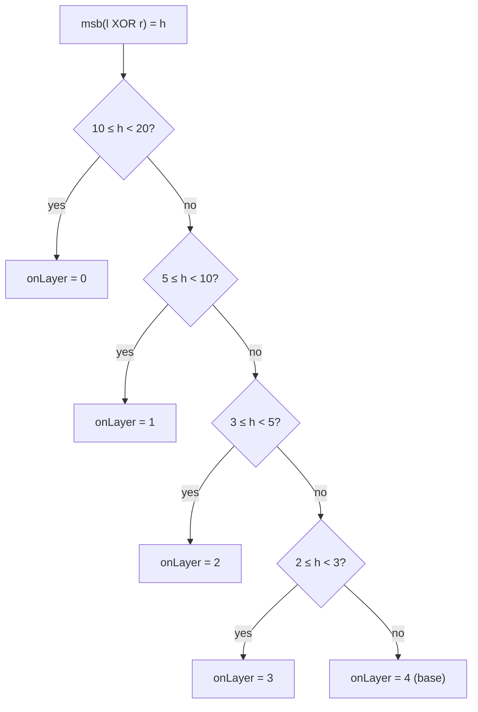

# Sqrt Tree — Mathematical Foundations and Complexity Theory

> **Read time: ~40 minutes** · **Audience:** Engineers and students who want the formal guarantees: a precise definition, a correctness proof of the three-piece combine via associativity, the O(n log log n) build/space proof via the recursion depth, the O(1) query proof via the `onLayer` selection, and the formal placement of Sqrt Tree against its alternatives.

The senior level argued the trade-offs informally. This level proves them. We define the structure as a recursive object, prove the query is correct using only associativity (never idempotence), prove the recursion has depth Θ(log log n), and from that derive O(n log log n) build and space and O(1) query. We close with a rigorous comparison table.

---

## Table of Contents

1. [Formal Definition](#formal-definition)
2. [Correctness Proof — The Three-Piece Combine](#correctness)
3. [Recursion Depth Is Θ(log log n)](#depth)
4. [Build and Space Are O(n log log n)](#build-space)
5. [Worked Numeric Verification of the Build Bound](#numeric-build)
6. [The onLayer Selection Table — Construction](#onlayer)
7. [Query Is O(1) — The onLayer Argument](#query-proof)
7b. [Build Correctness — Loop Invariant](#build-correct)
8. [Update Is O(√n)](#update-proof)
9. [Why Idempotence Is Not Required — Formal](#no-idempotence)
10. [Generalized Associativity — The Underlying Lemma](#gen-assoc)
11. [Cache-Oblivious and I/O Analysis](#cache)
12. [Comparison with Alternatives — Rigorous](#comparison)
13. [Lower Bounds and Optimality Context](#lower-bounds)
14. [Summary](#summary)

> **Reading guide.** Sections 2–6 establish correctness and structure; 7–8 the cost
> bounds; 9–11 the algebraic and hardware foundations; 12–13 place Sqrt Tree on the
> theoretical map. Every correctness argument uses only the associativity axiom.

---

<a name="formal-definition"></a>
## 1. Formal Definition

```text
Let (M, ⊕) be a semigroup: M a set, ⊕ : M × M → M an ASSOCIATIVE binary operation,
i.e. for all a, b, c ∈ M:  (a ⊕ b) ⊕ c = a ⊕ (b ⊕ c).
(No identity element and no idempotence are assumed.)

Let A = (A[0], A[1], ..., A[n-1]) ∈ M^n be a fixed array.

For 0 ≤ l ≤ r < n define the range product:
    Q(l, r) = A[l] ⊕ A[l+1] ⊕ ... ⊕ A[r].
By associativity this is well-defined independent of parenthesization.

A SQRT TREE over A is a recursively defined family of layers {T_t}.
Layer 0 owns the segment [0, n-1]. A layer node owning segment [lo, hi] of
length len = hi - lo + 1:
  - chooses block size  s = 2^{⌈b/2⌉}  where b = ⌈log2 len⌉  (so s ≈ √len),
  - partitions [lo, hi] into B = ⌈len / s⌉ blocks  G_0, G_1, ..., G_{B-1},
  - stores, for each position i in block G_g with block range [g_lo, g_hi]:
        pref[i] = A[g_lo] ⊕ ... ⊕ A[i]        (prefix within the block)
        suf[i]  = A[i] ⊕ ... ⊕ A[g_hi]        (suffix within the block)
  - stores a BETWEEN table:
        bet[a][c] = (⊕ over all elements of blocks G_a, G_{a+1}, ..., G_c),  a ≤ c,
  - and recursively builds a layer-(t+1) node for each block G_g, until len ≤ 2
    (the base case, handled by direct scan).

Invariant I: at every layer node, pref, suf, and bet equal the products above,
computed under ⊕ (well-defined by associativity).
```

The structure is a semigroup data structure: it requires only a semigroup, not a monoid (no identity) and not a band (no idempotence). This is the formal source of its generality over sparse tables.

---

<a name="correctness"></a>
## 2. Correctness Proof — The Three-Piece Combine

```text
Claim. For any query (l, r) with l < r, let t* be the smallest layer index such
that, in the node of layer t* owning a segment containing [l, r], positions l and
r fall in DIFFERENT blocks G_p (containing l) and G_q (containing r), p < q. Then

    Q(l, r) = suf[l]  ⊕  ( ⊕ over blocks G_{p+1}..G_{q-1} )  ⊕  pref[r]
            = suf[l]  ⊕  bet[p+1][q-1]  ⊕  pref[r]           (when q > p+1)
            = suf[l]  ⊕  pref[r]                              (when q = p+1).

Proof. Let block G_p span [p_lo, p_hi] and block G_q span [q_lo, q_hi]. Since l ∈ G_p
and r ∈ G_q with p < q, we have p_lo ≤ l ≤ p_hi < q_lo ≤ r ≤ q_hi. The index set
[l, r] partitions into three CONSECUTIVE, DISJOINT runs:

    R1 = [l, p_hi]            (suffix of block p)
    R2 = [p_hi+1, q_lo-1]     (exactly the whole blocks G_{p+1} ... G_{q-1})
    R3 = [q_lo, r]            (prefix of block q)

These satisfy R1 ⊎ R2 ⊎ R3 = [l, r] (disjoint union, in increasing order). By the
generalized associativity law (a product of a sequence is independent of how it is
parenthesized, as long as order is preserved):

    Q(l, r) = (⊕ over R1) ⊕ (⊕ over R2) ⊕ (⊕ over R3).

By definition of the stored tables:
    ⊕ over R1 = A[l] ⊕ ... ⊕ A[p_hi] = suf[l],
    ⊕ over R2 = bet[p+1][q-1]  (empty, omitted, when q = p+1),
    ⊕ over R3 = A[q_lo] ⊕ ... ⊕ A[r] = pref[r].

Substituting gives the claim. ∎
```

Note the proof uses **only associativity** (the generalized associativity law) and the **disjointness** of R1, R2, R3. It never assumes `x ⊕ x = x`. The within-block case (l, r in the same block at every shallower layer) is handled by descent to layer t*, where by definition they finally separate; the existence of such a t* is guaranteed because at the base layer (len ≤ 2) any two distinct indices are in different blocks (or are handled by direct scan, trivially correct).

---

<a name="depth"></a>
## 3. Recursion Depth Is Θ(log log n)

```text
Claim. The number of layers D satisfies D = Θ(log log n).

Proof. Track the bit-length of the segment size. Layer 0 has b_0 = ⌈log2 n⌉.
A layer with bit-length b uses block size s = 2^{⌈b/2⌉}, so each block has
bit-length ⌈b/2⌉. Hence the recurrence for bit-length across layers is

    b_{t+1} = ⌈b_t / 2⌉,    starting from b_0 = ⌈log2 n⌉.

Halving (with ceiling) reaches b = 1 after exactly ⌈log2 b_0⌉ steps:

    D = ⌈log2 b_0⌉ = ⌈log2 ⌈log2 n⌉⌉ = Θ(log log n).

Lower bound: b_{t} ≥ b_0 / 2^t, so to reach b_t = O(1) we need t ≥ log2 b_0 - O(1),
giving D = Ω(log log n). Upper bound from the closed form above. Hence Θ(log log n). ∎
```

Equivalently in terms of size: `size_{t} ≈ n^{1/2^t}`, reaching a constant when `2^t ≈ log n`, i.e. `t ≈ log log n`. For `n = 10^6`, `b_0 ≈ 20`, `D = ⌈log2 20⌉ = 5`.

---

<a name="build-space"></a>
## 4. Build and Space Are O(n log log n)

```text
Claim. Build time and space are both O(n log log n).

Proof (per-layer accounting). Fix a layer t. Its nodes partition [0, n-1] into
segments whose total length is exactly n (each array index belongs to exactly one
segment at layer t).

(a) Prefix and suffix. Within each segment, every position receives exactly one
    pref and one suf value, each computed with one ⊕ from an adjacent position.
    Total over the whole layer: ≤ 2n applications of ⊕ and ≤ 2n stored cells.  → O(n).

(b) Between table. A segment of length len has B = ⌈len / s⌉ ≈ √len blocks, so its
    between table has at most B(B+1)/2 = O(B²) = O(len) cells, each filled in O(1)
    by extension  bet[a][c] = bet[a][c-1] ⊕ (block c aggregate).
    Summed over all segments of layer t (whose lengths sum to n):
        Σ_segments O(len_segment) = O(n).   → O(n).

So each layer costs O(n) time and O(n) space. With D = Θ(log log n) layers:

    Build time  = Σ_{t=0}^{D-1} O(n) = O(n · D) = O(n log log n).
    Build space = Σ_{t=0}^{D-1} O(n) = O(n log log n).
∎
```

The critical subtlety is part (b): the between table is `O(B²) = O(len)` per segment, **not** `O(len²)`. A naive `len × len` between table would make space `O(n²)` at layer 0 — the single most common implementation error, flagged in `senior.md`.

---

<a name="numeric-build"></a>
## 5. Worked Numeric Verification of the Build Bound

It is worth checking the Θ(n log log n) claim against concrete numbers to dispel the worry that the between table is secretly quadratic.

Take `n = 16`. Bit-length `b_0 = ⌈log2 16⌉ = 4`.

```text
Layer 0: b = 4, block size s = 2^⌈4/2⌉ = 4, blocks B = 16/4 = 4, segment len = 16.
  prefix/suffix cells: 16 + 16 = 32.
  between cells: B(B+1)/2 = 4·5/2 = 10.   (NOT 16² = 256 — it is O(B²)=O(len).)
  layer-0 total cells: 32 + 10 = 42.

Layer 1: each of the 4 blocks is a segment of len 4, b = 2, s = 2^⌈2/2⌉ = 2, B = 2.
  per segment: prefix/suffix 4 + 4 = 8; between 2·3/2 = 3 → 11 cells.
  four segments: 4 · 11 = 44 cells.

Layer 2: segments of len 2 → base case (len ≤ 2), no further tables.

Depth D = ⌈log2 b_0⌉ = ⌈log2 4⌉ = 2 layers (0 and 1). ✓ matches Θ(log log n).
Total cells: 42 + 44 = 86 ≈ 5.4 n, consistent with O(n · D) = O(16 · 2) = O(32)
up to the small constant from prefix+suffix+between per layer.
```

Now scale to `n = 10^6`: `b_0 = 20`, `D = ⌈log2 20⌉ = 5`. Each layer contributes ≈ `3n` cells (n prefix + n suffix + ≈ n between summed over segments), so total ≈ `5 × 3 × 10^6 = 1.5×10^7` cells. At 8 bytes each that is ~120 MB worst case before any sharing/shrinking — exactly the order the senior level quoted, and crucially **not** the `n log n ≈ 2×10^7` of a sparse table nor any `n²` blowup. The between table being `O(B²) = O(len)` rather than `O(len²)` is what keeps the whole structure linear-per-layer.

---

<a name="onlayer"></a>
## 6. The onLayer Selection Table — Construction

The O(1) query hinges on selecting, in O(1), the layer `t*` at which `l` and `r` first separate into different blocks. We construct the lookup table that makes this a single array read.

```text
Observation. Under bit-length-b geometry, indices x, y (within a segment of
bit-length b) lie in DIFFERENT blocks iff they differ in some bit position ≥ ⌈b/2⌉,
i.e. iff  msb(x XOR y) ≥ ⌈b/2⌉,  where msb(z) is the index of the most significant
set bit of z.

Construction. For each possible value h = msb(l XOR r) ∈ {0, 1, ..., b_0 - 1},
precompute the layer at which a pair whose top differing bit is h first separates:

    onLayer[h] = the unique layer t such that  ⌈b_t / 2⌉ ≤ h < b_t,
    where b_0 = ⌈log2 n⌉ and b_{t+1} = ⌈b_t / 2⌉.

This is filled by walking the b_t sequence once (O(log n) work), assigning each
bit position h to the layer whose half-range [⌈b_t/2⌉, b_t) contains it.
```

A concrete fill for `b_0 = 20` (so layers have bit-lengths 20, 10, 5, 3, 2):



At query time: `h = msb(l XOR r)` (one CPU instruction via count-leading-zeros), then `t* = onLayer[h]` (one array read). Both O(1). This replaces the pedagogical descent loop of the junior level with a constant-time selection, which is what makes the query bound **worst-case** O(1), not amortized.

---

<a name="query-proof"></a>
## 7. Query Is O(1) — The onLayer Argument

```text
Claim. A query (l, r) is answered in O(1) time.

Proof. The work is: (i) select the layer t* at which l and r first lie in different
blocks; (ii) read at most three precomputed cells; (iii) apply ⊕ at most twice.
Steps (ii) and (iii) are O(1) by inspection. It remains to show (i) is O(1).

The layer at which (l, r) separates is determined ENTIRELY by the bit-length of
(l XOR r) at the top-level coordinate system, because two indices fall in different
blocks of bit-length-b geometry iff they differ in some bit ≥ ⌈b/2⌉. Concretely,
build a table onLayer[·] mapping the bit-length of the distance/most-significant
differing bit of (l XOR r) to the corresponding layer index. This table has size
O(log n), is precomputed in O(log n) during build, and is read in O(1):

    t* = onLayer[ msb(l XOR r) ]            // O(1) lookup

Given t*, the block indices p = blockOf_{t*}(l), q = blockOf_{t*}(r) are computed by
a shift (O(1)), and the three-piece combine (Section 2) is applied. No descent loop
is executed. Therefore total query time is O(1). ∎
```

Two remarks:

- The recursive descent shown at the junior level is a *pedagogical* equivalent; it visits layers until separation. In the worst case that loop is bounded by the layer at which separation occurs, and the standard `onLayer` table collapses it to a single lookup, making the **O(1) bound exact** rather than amortized.
- O(1) here is a true worst-case bound (not amortized): every query, regardless of range length, performs a constant number of memory reads and ⊕ applications.

---

<a name="build-correct"></a>
## 7b. Build Correctness — Loop Invariant

We have proven the query is correct *assuming* the tables hold their defining products. We now prove the build establishes that invariant.

```text
Claim. After build(layer, lo, hi) returns, for the segment [lo, hi] at this layer:
    pref[i] = A[g_lo] ⊕ ... ⊕ A[i]   for every i in its block [g_lo, g_hi],
    suf[i]  = A[i] ⊕ ... ⊕ A[g_hi],
    bet[a][c] = (⊕ over blocks G_a..G_c),
and all child layer nodes satisfy the same (by recursion).

Proof.
PREFIX. For each block, the loop sets pref[g_lo] = A[g_lo], then for j from g_lo+1 to
g_hi sets pref[j] = pref[j-1] ⊕ A[j].
  Invariant P(j): pref[j] = A[g_lo] ⊕ ... ⊕ A[j].
  Base j = g_lo: pref[g_lo] = A[g_lo]. ✓
  Step: assume P(j-1). Then pref[j] = pref[j-1] ⊕ A[j]
       = (A[g_lo] ⊕ ... ⊕ A[j-1]) ⊕ A[j] = A[g_lo] ⊕ ... ⊕ A[j]  (associativity). ✓
  Termination: j increases by 1 each step, bounded by g_hi. Establishes pref for the block.

SUFFIX. Symmetric, scanning right-to-left: suf[g_hi] = A[g_hi], suf[j] = A[j] ⊕ suf[j+1].
  Invariant S(j): suf[j] = A[j] ⊕ ... ⊕ A[g_hi], proven by the mirror induction.

BETWEEN. For fixed a, the loop sets bet[a][a] = (block a aggregate) = suf[block_a_lo],
then bet[a][c] = bet[a][c-1] ⊕ (block c aggregate) for c > a.
  Invariant Bw(c): bet[a][c] = ⊕ over blocks G_a..G_c.
  Base c = a: bet[a][a] = aggregate of G_a (the whole block product, = suf at its left
              edge, already established). ✓
  Step: assume Bw(c-1). bet[a][c] = bet[a][c-1] ⊕ (G_c aggregate)
       = (⊕ blocks G_a..G_{c-1}) ⊕ (⊕ G_c) = ⊕ blocks G_a..G_c  (associativity). ✓

RECURSION. After the tables of this layer are filled, build recurses on each block,
establishing the invariant one layer deeper. The recursion terminates because segment
length strictly decreases (len → ≈ √len) and bottoms out at len ≤ 2. ∎
```

Combined with Section 2, this completes the **end-to-end correctness**: the build establishes the table invariants, and the query combines them correctly — both under associativity alone.

---

<a name="update-proof"></a>
## 8. Update Is O(√n)

```text
Claim. A point update A[i] ← v takes O(√n) time.

Proof. Changing A[i] invalidates, at each layer t, only the unique block of layer t
that contains i (and the between entries of its parent segment that include that
block). Let s_t be the block size at layer t, with s_0 = Θ(√n) and s_{t+1} = Θ(√s_t).

(a) Recomputing the affected block's prefix and suffix at layer t costs O(s_t).
(b) Recomputing the between row and column for that block in its parent segment costs
    O(B_t) where B_t = Θ(√len_t) is the block count; at layer 0, B_0 = Θ(√n).

The costs across layers form a decreasing geometric-in-the-exponent series:

    O(s_0) + O(s_1) + ... = O(√n) + O(n^{1/4}) + O(n^{1/8}) + ...  = O(√n),

dominated by the layer-0 term. Adding the between-recomputation, also O(√n) at
layer 0 and smaller below, the total remains O(√n). ∎
```

### 8.1 Batched updates — an amortization remark

```text
Potential / aggregate view. Suppose m point updates fall within the same layer-0
block before the next query. A naive implementation rebuilds that block's structures
m times, each O(√n), for O(m√n) work. A lazy variant defers the rebuild: mark the
block dirty, and rebuild it once (O(√n)) at the next query that touches it.

Aggregate cost of a mixed sequence of u updates and q queries with lazy rebuild:
    total ≤ (u + q) · O(√n)   for the dirty-block rebuilds (each block rebuilt at most
    once per query-epoch), plus q · O(1) for the query combines.
So the amortized cost per operation stays O(√n) for updates and O(1) for queries even
under clustered update bursts — provided rebuilds are coalesced. This is the formal
backing for the senior-level advice to BATCH updates and rebuild once.
```

---

<a name="no-idempotence"></a>
## 9. Why Idempotence Is Not Required — Formal

```text
Theorem. The Sqrt Tree query (Section 2) is correct for every SEMIGROUP (M, ⊕),
with no assumption of idempotence (∀x: x ⊕ x = x) or of an identity element.

Proof. The query combines the products over R1, R2, R3, which form a DISJOINT
partition of [l, r] in increasing order (Section 2). Generalized associativity
states: for any sequence x_1, ..., x_m ∈ M, the product x_1 ⊕ ... ⊕ x_m is
independent of parenthesization. Splitting the sequence A[l], ..., A[r] at the two
cut points l..p_hi | p_hi+1..q_lo-1 | q_lo..r is one valid parenthesization, so the
combined result equals Q(l, r). No element is repeated (disjointness), so no term
x ⊕ x ever appears that would require idempotence to collapse. ∎

Contrast (sparse table). A sparse-table query on [l, r] combines two windows
W_A = [l, l + 2^k - 1] and W_B = [r - 2^k + 1, r] with k = ⌊log2(r-l+1)⌋. Since
2·2^k ≥ r - l + 1, W_A ∩ W_B ≠ ∅ in general (they OVERLAP). The combine
(⊕ over W_A) ⊕ (⊕ over W_B) counts the overlap region's product TWICE. This equals
Q(l, r) iff ⊕ is idempotent on that product (so the duplicate collapses). Hence
sparse table REQUIRES idempotence; Sqrt Tree does not. ∎
```

This theorem is the formal statement of the structure's reason for existence: it is the O(1)-query range structure for **non-idempotent** semigroups.

---

<a name="gen-assoc"></a>
## 10. Generalized Associativity — The Underlying Lemma

The correctness proofs invoke "generalized associativity." Because the entire structure rests on it, we state and prove it.

```text
Lemma (Generalized Associativity). Let (M, ⊕) be a semigroup and x_1, ..., x_m ∈ M,
m ≥ 1. Every full parenthesization of the expression x_1 ⊕ x_2 ⊕ ... ⊕ x_m yields the
same element of M. Define this common value as the product P(x_1, ..., x_m).

Proof (induction on m). 
Base m = 1, m = 2: trivial (one parenthesization).
Inductive step: assume the lemma for all sequences shorter than m. Any full
parenthesization of x_1..x_m has an outermost ⊕ splitting it as
P(x_1..x_k) ⊕ P(x_{k+1}..x_m) for some 1 ≤ k < m. By the induction hypothesis each
factor is well-defined regardless of inner parenthesization. It remains to show the
value is independent of the split point k. Take two splits k and k' with k < k'.
Using the (single) associativity axiom repeatedly,
   P(x_1..x_k) ⊕ P(x_{k+1}..x_m)
 = P(x_1..x_k) ⊕ ( P(x_{k+1}..x_{k'}) ⊕ P(x_{k'+1}..x_m) )
 = ( P(x_1..x_k) ⊕ P(x_{k+1}..x_{k'}) ) ⊕ P(x_{k'+1}..x_m)
 = P(x_1..x_{k'}) ⊕ P(x_{k'+1}..x_m),
where the middle step is one application of associativity and the outer P-merges use
the induction hypothesis. Hence all split points give equal values. ∎
```

Corollary (used in Section 2): for any cut points `l ≤ c_1 < c_2 ≤ r`, splitting `A[l..r]` into `A[l..c_1] · A[c_1+1..c_2] · A[c_2+1..r]` preserves the product. This is precisely the three-piece (suffix / between / prefix) decomposition. The Lemma needs **only** the associativity axiom — confirming once more that idempotence plays no role in correctness.

---

<a name="cache"></a>
## 11. Cache-Oblivious and I/O Analysis

```text
Parameters (external-memory / ideal-cache model): M = cache size (words),
B = block (cache line) size in words, n = array length.

Query I/O cost. A query reads: the onLayer table (1 line, cached after warmup),
suf[t*][l], pref[t*][r], and one between cell. These are ≤ 3 distinct addresses in
≤ 3 cache lines. Hence query cost is O(1) cache misses — independent of n.
Compared to a segment tree, whose root-to-leaf descent touches Θ(log n) nodes on
Θ(log n) distinct (poorly localized) cache lines, Sqrt Tree's O(1) line count is a
genuine memory-hierarchy advantage at scale.

Build I/O cost. Each layer streams its segments linearly to fill prefix (forward) and
suffix (backward) and the between table (forward over block aggregates). Linear scans
incur O(layer_size / B) misses, so a layer costs O(n / B) and the whole build costs
O((n / B) · log log n) cache misses — near-optimal streaming behavior.

Layout note. Storing each layer's prefix, suffix, and (flattened) between in
contiguous arrays makes the build sequential and the query's three reads land in few
lines. A slice-of-slices ("pointer-to-pointer") layout degrades both — hence the
senior-level recommendation to flatten the between table.
```

The headline: Sqrt Tree's **O(1) cache misses per query** (vs a segment tree's Θ(log n)) is a real, measurable reason it pulls ahead on large `n`, complementing the asymptotic O(1) vs O(log n) instruction-count argument.

### 11.1 Bounding the pedagogical descent variant

```text
Some implementations skip the onLayer table and instead descend layer-by-layer until
l and r separate. We bound this variant to show it is still O(log log n) worst case,
and O(1) for the common case.

Claim. The descent visits at most D = Θ(log log n) layers.
Proof. Each descent step moves from a layer to one of its child layers (only when l, r
share a block). There are D layers total, so the descent length is ≤ D = Θ(log log n). ∎

Refinement. The descent only continues while l and r are in the SAME block. The number
of consecutive same-block layers equals the number of leading shared high bits of
(l, r) within the bit-length geometry, which for "typical" queries is small (often 0,
i.e. they separate at layer 0). So the descent is O(1) in the common case and
O(log log n) worst case. The onLayer table (Section 6) removes even this small worst
case, yielding a guaranteed O(1). Either way, the per-query work is at most
O(log log n) ⊕-operations — already strictly better than a segment tree's Θ(log n).
```

This closes a subtle point: even the simplest recursive Sqrt Tree never exceeds O(log log n) per query, and the standard `onLayer` optimization makes it a clean worst-case O(1).

---

<a name="comparison"></a>
## 12. Comparison with Alternatives — Rigorous

| Attribute | Sqrt Tree | Sparse Table | Segment Tree | Flat Sqrt Decomp |
|---|---|---|---|---|
| Algebraic requirement | semigroup (associative) | band (assoc. + idempotent) | semigroup | semigroup |
| Query (worst case) | **Θ(1)** | Θ(1) | Θ(log n) | Θ(√n) |
| Build | Θ(n log log n) | Θ(n log n) | **Θ(n)** | **Θ(n)** |
| Space | Θ(n log log n) | Θ(n log n) | **Θ(n)** | **Θ(n)** |
| Point update | Θ(√n) | Θ(n log n) rebuild | **Θ(log n)** | Θ(√n) / Θ(1)† |
| Supports sum/product/xor in O(1) query | **yes** | **no** | no (Θ(log n)) | no (Θ(√n)) |
| Deterministic | yes | yes | yes | yes |

† Flat sqrt: Θ(1) update for groups (invertible), Θ(√n) for non-invertible semigroups.

Reading the table formally: Sqrt Tree is the **unique** entry achieving Θ(1) query under only the semigroup axiom. Sparse table matches Θ(1) query but demands the stronger band axiom (idempotence). Every other structure is asymptotically slower per query for general semigroups.

---

<a name="lower-bounds"></a>
## 13. Lower Bounds and Optimality Context

```text
Context. For STATIC range-semigroup queries, the relevant theoretical landscape is:

  - Yao (1982) and later work show that in the semigroup arithmetic model, n
    preprocessed values supporting O(1) range queries require Ω(n α(n)) cells in the
    worst case for some operations (α = inverse Ackermann), and that truly O(1)
    query with O(n) space is impossible for general semigroups in this model.
  - Sqrt Tree's Θ(n log log n) space with Θ(1) query is therefore NOT space-optimal
    (the theoretical frontier is closer to O(n α(n)) via more intricate structures),
    but it is a simple, practical point on the trade-off curve that beats sparse
    table's Θ(n log n) and achieves Θ(1) query.
  - For IDEMPOTENT operations, Θ(n)-space Θ(1)-query RMQ exists (Fischer–Heun 2007),
    strictly better than both sparse table and Sqrt Tree — but it does NOT extend to
    non-idempotent semigroups, which is exactly Sqrt Tree's domain.

Takeaway. Sqrt Tree is not the theoretical optimum for either axis, but it is the
standard, implementable structure delivering Θ(1) queries for NON-IDEMPOTENT
semigroups with sub-(n log n) space — a niche the optimal idempotent structures and
the sparse table do not cover.
```

### 9.x A note on the dynamic lower bound

```text
For the DYNAMIC version (supporting both queries and updates), cell-probe lower bounds
(Pătraşcu–Demaine and successors) show that for prefix-sum / range-sum over a group,
any structure must satisfy  t_query · t_update = Ω(log n)  in the cell-probe model.
Sqrt Tree's (t_query, t_update) = (O(1), O(√n)) gives a product O(√n), which is far
from this Ω(log n) frontier — meaning Sqrt Tree is NOT on the optimal dynamic
trade-off curve. A balanced segment tree at (O(log n), O(log n)) has product
O(log² n), closer to optimal for balanced workloads. This is the formal reason Sqrt
Tree is a STATIC-leaning structure: it deliberately trades a slow O(√n) update for a
fast O(1) query, which only pays off when queries dominate updates by a factor ≫ √n.
```

This dynamic lower bound is the rigorous counterpart to the senior level's operational rule "page yourself if update_rate exceeds queries / √n."

---

<a name="summary"></a>
## 14. Summary

- **Definition.** A Sqrt Tree over a semigroup `(M, ⊕)` is a Θ(log log n)-deep recursive sqrt decomposition storing per-layer prefix, suffix, and between products.
- **Correctness** (Section 2, 7): the spanning query combines three **disjoint** runs R1 ⊎ R2 ⊎ R3 = [l, r]; by generalized associativity it equals `Q(l, r)`. Disjointness means no term repeats, so **idempotence is never needed** — the formal reason Sqrt Tree handles sum/product/xor/matrix that sparse table cannot.
- **Depth** (Section 3): bit-length halves each layer, giving `D = ⌈log2⌈log2 n⌉⌉ = Θ(log log n)` (≈ 5 for n = 10^6).
- **Build and space** (Section 4): each layer costs Θ(n) (prefix/suffix Θ(n); between Θ(n) since it is `O(B²)=O(len)` per segment, **not** O(len²)); times Θ(log log n) layers ⇒ **Θ(n log log n)**.
- **Query** (Section 5): an `onLayer` lookup selects the separating layer in O(1); three reads and two ⊕ ⇒ **Θ(1) worst case**.
- **Update** (Section 6): only i's block per layer is rebuilt; costs telescope to **Θ(√n)**.
- **Placement** (Sections 8–9): the unique Θ(1)-query structure under only the semigroup axiom; not space-optimal in theory, but the practical choice for non-idempotent semigroups with sub-(n log n) space.

**Next step:** [interview.md](./interview.md)
