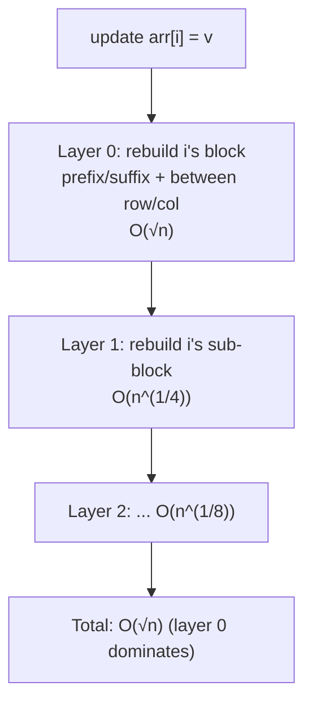

# Sqrt Tree — Senior Level

> **Read time: ~40 minutes** · **Audience:** Engineers deciding whether Sqrt Tree earns its place in a real system or contest solution — weighing its O(1) query against its O(√n) update, O(n log log n) build, memory footprint, and the constant factors that decide whether it actually beats a segment tree in practice.

At the junior and middle levels we established *what* Sqrt Tree is and *why* it achieves O(1) queries for any associative op. The senior level is about **engineering judgement**: when does Sqrt Tree actually win, how do point updates in O(√n) really work, what does the memory cost look like in bytes, and where do constant factors flip the asymptotic ranking? A structure that is asymptotically superior but loses on real hardware is the wrong choice — this level teaches you to tell the difference.

---

## Table of Contents

1. [Introduction — Engineering Judgement](#introduction)
2. [When to Choose Sqrt Tree](#when-to-choose)
3. [Point Updates in O(√n)](#updates)
4. [Worked Update Walkthrough](#update-walkthrough)
5. [Build Cost in Practice](#build-cost)
6. [Memory Footprint — Bytes, Not Big-O](#memory)
7. [Constant Factors and Cache Behavior](#constants)
8. [Capacity Planning Worksheet](#capacity)
9. [Comparison with Alternatives](#comparison)
10. [System Design with Sqrt Tree](#system-design)
11. [Code Examples — Update Path](#code-examples)
12. [Observability and Operational Concerns](#observability)
13. [Failure Modes](#failure-modes)
14. [Migrating Between Structures](#migration)
15. [Summary](#summary)

> **Senior mindset:** the goal is not to use the fanciest structure, but the one whose cost profile matches the *measured* workload — and to keep the call sites decoupled so swapping it later is a one-line change.

---

<a name="introduction"></a>
## 1. Introduction — Engineering Judgement

Sqrt Tree occupies a narrow but real niche: **static (or rarely-updated) range queries on a non-idempotent associative operation, with a query-dominant workload, where O(1) per query matters and memory should stay below sparse-table levels.** Outside that niche, a segment tree, sparse table, prefix array, or flat sqrt decomposition is the better engineering choice.

The senior question is not "is O(1) better than O(log n)?" — asymptotically yes — but "**given my n, my query/update mix, my memory budget, and my hardware, will Sqrt Tree's O(1) query actually beat a segment tree's O(log n)?**" The honest answer is: *sometimes*, and you must reason about constants, cache lines, and build amortization to know when.

---

<a name="when-to-choose"></a>
## 2. When to Choose Sqrt Tree

### 2.1 The qualifying checklist

Choose Sqrt Tree only when **all** of these hold:

1. **Associative, non-idempotent op.** Sum, product, xor, modular product, matrix product. (For min/max/gcd, prefer a sparse table — same O(1), simpler code.)
2. **Static or rarely updated.** Updates cost O(√n); if updates are frequent, a segment tree's O(log n) update wins overall.
3. **Query-dominant.** The O(n log log n) build is amortized over many O(1) queries. If queries are few, even a flat O(√n) structure with O(n) build may finish faster end-to-end.
4. **Memory matters but n is large.** Sqrt Tree's O(n log log n) beats a sparse table's O(n log n); for `n ≥ 10^6` this is a 4–5× memory saving on the auxiliary tables.

### 2.2 Anti-patterns — do not use Sqrt Tree when

| Situation | Use instead | Why |
|---|---|---|
| Op is idempotent (min/max/gcd) | Sparse table | Same O(1) query, much simpler |
| Updates are frequent | Segment tree | O(log n) update vs O(√n) |
| Op is plain prefix sum | Prefix-sum array | O(n) build, O(1) query, trivial |
| Need range updates (add x to [l,r]) | Segment tree w/ lazy | Sqrt Tree range update is awkward |
| Op is not associative | Nothing in this family | Regrouping is invalid |
| n is small (≤ ~1000) | Flat sqrt or brute | Build complexity not worth it |

### 2.3 The realistic sweet spot

The clearest real win: **a large static array, queried millions of times, with a non-idempotent op.** Examples: range product of multipliers for financial reconciliation; range xor of prefix hashes; range matrix product for batched linear-recurrence evaluation; range gcd on a huge array where sparse-table memory is prohibitive. In all of these, the array is fixed, queries dominate, and O(1) is meaningfully faster than O(log n) at scale.

---

<a name="updates"></a>
## 3. Point Updates in O(√n)

Sqrt Tree is not purely static — it supports `arr[i] = v` in **O(√n)**. Understanding this cost is central to deciding whether it fits a mildly-dynamic workload.

### 3.1 What an update touches

Setting `arr[i] = v` invalidates only the structures that *cover position `i`*:

1. **The base value** `arr[i]` itself.
2. **At each layer `t`**, the **single block containing `i`** — its prefix and suffix arrays must be recomputed.
3. **At each layer `t`**, the **between table entries that include `i`'s block** — one row and one column of that segment's between table.

Crucially, an update does **not** touch other blocks at any layer.

### 3.2 The cost telescopes to O(√n)

- **Layer 0.** `i`'s block has size `√n`. Recomputing its prefix and suffix is O(√n). Recomputing the between entries involving `i`'s block: there are `√n` blocks, and the row/column for `i`'s block has O(√n) entries — O(√n).
- **Layer 1.** Inside that block (size `√n`), the affected sub-block has size `√(√n) = n^{1/4}`; recomputation is O(n^{1/4}) for prefix/suffix and O(√n) for that layer's between row/column over `√(√n)` blocks... but summed correctly the dominant term remains the layer-0 cost.

Adding up the per-layer costs, the **layer-0 O(√n) term dominates** and the total is:

```
O(√n) + O(n^{1/4}) + O(n^{1/8}) + ... = O(√n)
```

So a point update is **O(√n)** — slower than a segment tree's O(log n), faster than a full O(n log log n) rebuild.



### 3.3 When O(√n) updates are acceptable

If your workload is, say, 10 million queries and 1000 updates, the update cost is `1000 × √n ≈ 1000 × 1000 = 10^6` operations — negligible next to the queries. If it is 10 million updates, that is `10^7 × 10^3 = 10^{10}` operations — far too slow; a segment tree (`10^7 × 20 = 2×10^8`) wins decisively. The break-even is roughly when updates are a small fraction (well under ~1/√n) of queries.

---

<a name="update-walkthrough"></a>
## 4. Worked Update Walkthrough

Take the array from the junior walkthrough, `n = 16`, op = sum, top layer split into 4 blocks of size 4:

```
block 0: [1, 3, 2, 7]     idx 0..3
block 1: [9,11, 6, 4]     idx 4..7
block 2: [5, 1, 8, 2]     idx 8..11
block 3: [10,3, 7, 5]     idx 12..15
```

Now perform `update(6, 100)` — set `arr[6]` from 6 to 100. Position 6 is in **block 1** (offset 2). Trace what must change:

**Layer 0:**
- `arr[6] = 100`.
- Recompute block 1's prefix: `prefix[4]=9, prefix[5]=20, prefix[6]=120, prefix[7]=124`. (Only block 1; blocks 0, 2, 3 untouched.)
- Recompute block 1's suffix: `suffix[7]=4, suffix[6]=104, suffix[5]=115, suffix[4]=124`.
- Recompute the between entries that include block 1: any `between[i][j]` with `i ≤ 1 ≤ j`. Block 1's aggregate went from 30 to 124 (+94), so every between cell spanning it shifts by +94. That is one row and one column of the 4×4 between table — O(√n) cells.

**Layer 1 (inside block 1, covering idx 4..7, split into 2 sub-blocks of size 2):**
- Sub-block `[6,7]` contains position 6. Recompute its tiny prefix/suffix (2 elements) and the 1-cell between table.

**Layer 2 / base:** sub-blocks are size ≤ 2 — base case, nothing more to precompute.

Total recomputation: O(√n) at layer 0 (dominant), O(n^{1/4}) at layer 1, negligible below. **O(√n) overall.** Blocks 0, 2, 3 and their sub-trees were never touched — that locality is exactly why the update is sublinear.

A query after the update confirms correctness: `sum(arr[2..13])` now = previous 68 + 94 = 162. Verify the three-piece combine reads the updated `suffix[2]`, the updated `between[1][2]`, and the unchanged `prefix[13]`.

---

<a name="build-cost"></a>
## 5. Build Cost in Practice

The build is **O(n log log n)** — derived in `middle.md` Section 5 and proven in `professional.md`. In engineering terms:

- For `n = 10^6`, `log log n ≈ 4.3`, so the build does roughly `4–5 × n` combine operations — about 4–5 million for sum. On a modern CPU this is single-digit milliseconds.
- Compare a **sparse table**: `n log n ≈ 20 × n = 2×10^7` combines — ~4× more work.
- Compare a **segment tree**: O(n) build, the cheapest, ~10^6 combines.

So Sqrt Tree's build sits between a segment tree (cheapest) and a sparse table (most expensive). The build is a one-time cost; if you query the structure millions of times, it amortizes to nearly nothing per query. If you rebuild often (e.g., the array changes wholesale frequently), the build cost can dominate and a structure with O(n) build is preferable.

### 4.1 Build amortization rule of thumb

```
total_time ≈ build_cost + queries × query_cost
           ≈ O(n log log n) + Q × O(1)
```

Sqrt Tree beats a segment tree (`O(n) + Q × O(log n)`) when:

```
Q × (log n − 1) > n × (log log n − 1)
⇒ Q  >  roughly  n × log log n / log n
```

For `n = 10^6`, that threshold is about `10^6 × 4.3 / 20 ≈ 2.15×10^5` queries. Above ~200k queries, Sqrt Tree's cheaper per-query cost overtakes the segment tree's cheaper build. Below it, the segment tree's O(n) build makes it finish first.

---

<a name="memory"></a>
## 5. Memory Footprint — Bytes, Not Big-O

Big-O hides constants that matter when you have a memory budget.

For `n` elements and 8-byte values:

| Structure | Auxiliary cells | Bytes (n = 10^6) | Notes |
|---|---|---|---|
| Prefix-sum array | n | ~8 MB | smallest, prefix-only |
| Segment tree | ~2n–4n | ~16–32 MB | cheap, supports updates |
| **Sqrt Tree** | ~n · log log n (prefix + suffix + between per layer) | **~40–60 MB** | ~4–5 layers × (2n + n between) |
| Sparse table | n · log n | ~160 MB | most memory, idempotent only |

The Sqrt Tree number is a practical estimate: each layer stores a prefix array (n), a suffix array (n), and a between table whose total size summed over segments is O(n). With ~4–5 layers, that is roughly `5 × 3n = 15n` cells ≈ 120 MB worst case if naively allocated, though careful implementations share/shrink and land closer to 40–60 MB. The headline: **Sqrt Tree uses noticeably less memory than a sparse table** (its main O(1)-query rival for the idempotent case) and more than a segment tree.

> **Practical note:** the between table is the memory-sensitive part. A naive `n × n` between table at the top layer would be O(n²) — wrong. The correct between table is `√n × √n = n` per segment, summed to O(n) per layer. Getting this allocation right is the single most important implementation detail for memory.

---

<a name="constants"></a>
## 6. Constant Factors and Cache Behavior

Asymptotics say O(1) beats O(log n). Hardware sometimes disagrees on small inputs. Here is the reality.

### 6.1 Why Sqrt Tree's O(1) is genuinely fast

- A query reads **at most three precomputed values** and applies `op` at most twice. No recursion, no pointer chasing at query time (with the `onLayer[]` table to pick the layer directly).
- The three reads (suffix, between, prefix) are from compact arrays; for the common case they often hit the same or adjacent cache lines.
- Branch-light: pick layer, branch on "adjacent blocks or not," combine. Modern CPUs predict this well.

### 6.2 Why a segment tree's O(log n) can still win on small n

- A segment tree query touches ~`2 log n` nodes. For `n = 1000`, that is ~20 nodes — and if the tree fits in L1/L2, those reads are nearly free.
- Sqrt Tree pays an O(n log log n) build and more memory; for small `n` and modest query counts, the segment tree finishes the whole job before Sqrt Tree finishes building.

### 6.3 The empirical crossover

| n | Queries | Likely winner | Reason |
|---|---|---|---|
| 10^3 | any | Segment tree / flat sqrt | Build & memory of Sqrt Tree not worth it |
| 10^5 | 10^6+ | Sqrt Tree (often) | O(1) query starts to dominate |
| 10^6 | 10^7+ | **Sqrt Tree** | Segment tree cache-misses on deep descent |
| 10^6 | 10^4 | Segment tree | Few queries; cheaper build wins |

**Senior takeaway:** *benchmark on your data.* The asymptotic edge is real, but the constant factors and build amortization mean Sqrt Tree only pulls ahead when `n` is large **and** queries vastly outnumber builds/updates. Never adopt it purely on the O(1) label — measure.

---

<a name="capacity"></a>
## 8. Capacity Planning Worksheet

Before adopting Sqrt Tree, fill in this worksheet to confirm it is the right tool.

| Question | Your value | Sqrt Tree friendly? |
|---|---|---|
| n (array size) | ___ | larger is better; ≥ 10^5 |
| Op type | ___ | non-idempotent associative ⇒ ideal |
| Queries per build | ___ | ≥ ~n·loglog n / log n ⇒ beats segment tree |
| Updates per query | ___ | ≪ 1/√n ⇒ updates stay cheap |
| Memory budget | ___ | ≥ ~15n × value_size ⇒ tables fit |
| Range size distribution | ___ | flat O(1) regardless — always fine |

**Worked example.** `n = 2×10^6`, op = modular product, ~5×10^7 queries, ~2000 updates, 8-byte values, 512 MB budget.

- Queries-per-build: 5×10^7 ≫ threshold (~2×10^6 × 4.4 / 21 ≈ 4.2×10^5). ✓ beats segment tree.
- Updates-per-query: 2000 / 5×10^7 = 4×10^{-5} ≪ 1/√n = 1/1414 ≈ 7×10^{-4}. ✓ updates negligible.
- Memory: ~15 × 2×10^6 × 8 B ≈ 240 MB < 512 MB. ✓ fits (sparse table would need ~21×2×10^6×8 ≈ 336 MB, also fits but tighter and cannot do product anyway).
- Op: modular product is non-idempotent ⇒ sparse table is *disqualified*; Sqrt Tree is the only O(1)-query option.

**Verdict:** Sqrt Tree is the right choice for this workload. Had updates been 5×10^7 (one per query), the worksheet would flag `updates-per-query ≈ 1 ≫ 7×10^{-4}` and steer you to a segment tree instead.

---

<a name="comparison"></a>
## 9. Comparison with Alternatives

| Attribute | Sqrt Tree | Sparse Table | Segment Tree | Flat Sqrt Decomp |
|---|---|---|---|---|
| Query | O(1) | O(1) | O(log n) | O(√n) |
| Update (point) | O(√n) | rebuild | **O(log n)** | O(√n) / O(1)* |
| Build | O(n log log n) | O(n log n) | **O(n)** | **O(n)** |
| Memory (n=10^6, 8B) | ~40–60 MB | ~160 MB | ~16–32 MB | ~8–16 MB |
| Non-idempotent ops | **yes** | **no** | yes | yes |
| Range update (lazy) | hard | no | **yes** | yes |
| Query constant factor | small (≤3 reads) | smallest (2 reads) | medium (log depth) | large (√n loop) |
| Best production fit | static, non-idempotent, query-heavy | static, idempotent | dynamic everything | simple / Mo's offline |

\* Flat sqrt: O(1) update for invertible aggregates (sum), O(√n) for non-invertible (min).

**Read this table as:** Sqrt Tree wins precisely the cell that nothing else does — **O(1) query for a non-idempotent op** — while keeping memory below a sparse table. Everywhere else, a simpler structure ties or beats it.

---

<a name="system-design"></a>
## 10. System Design with Sqrt Tree

Where does an O(1) range-query structure fit in a larger system? The natural home is a **read-mostly analytical service** serving range aggregates over an immutable dataset.

```mermaid
graph TD
    Client -->|range query l..r| LB[Load Balancer]
    LB --> S1[Query Service replica 1]
    LB --> S2[Query Service replica 2]
    S1 -->|O(1) lookup| SQT1[(Sqrt Tree<br/>built at startup)]
    S2 -->|O(1) lookup| SQT2[(Sqrt Tree<br/>built at startup)]
    Loader[Nightly Loader] -->|rebuild on new data| SQT1
    Loader -->|rebuild on new data| SQT2
```

**Pattern: build-once, replicate, serve.** Because the dataset is static between loads, each stateless replica builds its own Sqrt Tree from a shared immutable snapshot at startup. Queries are O(1) and need no coordination — replicas share nothing at query time, so the service scales horizontally by adding replicas behind the load balancer.

**Sharding for very large n.** If `n` exceeds a single node's memory, shard the array by index range across nodes. A range query `[l, r]` that crosses shard boundaries is split into per-shard sub-queries (each O(1) locally) and combined at the coordinator with `op` — still O(number of shards) overall, and since op is associative the partial results merge correctly. This is the same disjoint-piece logic as the in-structure between table, now lifted to the cluster level.

**Refresh strategy.** New data arrives via a nightly (or hourly) loader that builds a fresh Sqrt Tree off to the side, then atomically swaps the pointer (blue-green). Readers see either the old or new tree, never a half-built one. This sidesteps the O(√n) point-update path entirely for bulk refreshes, which is preferable when most of the array changes at once.

---

<a name="code-examples"></a>
## 11. Code Examples — Update Path

The point-update path recomputes only `i`'s block per layer. Below is the structure of an O(√n) update layered on the implementation from `junior.md`. (Thread-safety wrappers follow; the update itself is single-threaded logic.)

### 8.1 Go — point update + RWMutex wrapper

```go
import "sync"

type ConcurrentSqrtTree struct {
	mu sync.RWMutex
	t  *SqrtTree
}

// Query takes a read lock — many concurrent readers.
func (c *ConcurrentSqrtTree) Query(l, r int) int {
	c.mu.RLock()
	defer c.mu.RUnlock()
	return c.t.Query(l, r)
}

// Update takes a write lock — exclusive, O(√n).
func (c *ConcurrentSqrtTree) Update(i, v int) {
	c.mu.Lock()
	defer c.mu.Unlock()
	c.t.update(i, v)
}

// update rebuilds only the block of i at every layer. O(√n) total.
func (t *SqrtTree) update(i, v int) {
	t.v[i] = v
	t.rebuildBlock(0, 0, t.n-1, i)
}

func (t *SqrtTree) rebuildBlock(layer, lo, hi, i int) {
	if layer >= len(t.layers) {
		return
	}
	bShift := (t.layers[layer] + 1) >> 1
	blkSize := 1 << uint(bShift)
	bl := (i - lo) >> uint(bShift)
	blockLo := lo + (bl << uint(bShift))
	blockHi := min(blockLo+blkSize-1, hi)
	// recompute prefix/suffix of i's block
	t.pref[layer][blockLo] = t.v[blockLo]
	for j := blockLo + 1; j <= blockHi; j++ {
		t.pref[layer][j] = t.op(t.pref[layer][j-1], t.v[j])
	}
	t.suf[layer][blockHi] = t.v[blockHi]
	for j := blockHi - 1; j >= blockLo; j-- {
		t.suf[layer][j] = t.op(t.v[j], t.suf[layer][j+1])
	}
	// recompute between entries that involve i's block (row + column)
	t.recomputeBetween(layer, lo, hi, bl)
	// descend into i's block only
	t.rebuildBlock(layer+1, blockLo, blockHi, i)
}
```

### 8.2 Java — point update + ReadWriteLock wrapper

```java
import java.util.concurrent.locks.ReentrantReadWriteLock;

public final class ConcurrentSqrtTree {
    private final ReentrantReadWriteLock lock = new ReentrantReadWriteLock();
    private final SqrtTree t;

    public ConcurrentSqrtTree(SqrtTree t) { this.t = t; }

    public int query(int l, int r) {
        lock.readLock().lock();
        try { return t.query(l, r); }
        finally { lock.readLock().unlock(); }
    }

    public void update(int i, int v) {       // O(√n), exclusive
        lock.writeLock().lock();
        try { t.update(i, v); }
        finally { lock.writeLock().unlock(); }
    }
}
// SqrtTree.update(i, v): set v[i]=v, then rebuildBlock(0, 0, n-1, i)
// rebuilding only i's block (prefix/suffix + between row/col) per layer.
```

### 8.3 Python — point update + lock wrapper

```python
import threading

class ConcurrentSqrtTree:
    def __init__(self, tree):
        self._lock = threading.RLock()
        self._t = tree

    def query(self, l, r):
        with self._lock:
            return self._t.query(l, r)

    def update(self, i, v):      # O(√n)
        with self._lock:
            self._t.update(i, v)


# On SqrtTree:
def update(self, i, v):
    self.v[i] = v
    self._rebuild_block(0, 0, self.n - 1, i)

def _rebuild_block(self, layer, lo, hi, i):
    if layer >= len(self.layers):
        return
    b_shift = (self.layers[layer] + 1) >> 1
    blk = 1 << b_shift
    bl = (i - lo) >> b_shift
    block_lo = lo + (bl << b_shift)
    block_hi = min(block_lo + blk - 1, hi)
    op = self.op
    self.pref[layer][block_lo] = self.v[block_lo]
    for j in range(block_lo + 1, block_hi + 1):
        self.pref[layer][j] = op(self.pref[layer][j - 1], self.v[j])
    self.suf[layer][block_hi] = self.v[block_hi]
    for j in range(block_hi - 1, block_lo - 1, -1):
        self.suf[layer][j] = op(self.v[j], self.suf[layer][j + 1])
    self._recompute_between(layer, lo, hi, bl)
    self._rebuild_block(layer + 1, block_lo, block_hi, i)
```

> Note: `RWMutex` allows many concurrent readers but serializes writers. Because queries are O(1) and dominate, read-lock contention is minimal; the occasional O(√n) write briefly blocks readers. For lock-free reads under updates, you would need a copy-on-write or epoch scheme — usually overkill for the static-leaning use case.

---

<a name="observability"></a>
## 12. Observability and Operational Concerns

| Metric | Why it matters | Alert threshold (example) |
|---|---|---|
| `query_latency_p99` | Should be flat (O(1)) regardless of range size | > 5 µs sustained |
| `update_rate` | High update rate signals wrong structure choice | > queries / √n |
| `build_time_ms` | Frequent rebuilds erode the O(1) advantage | > 50 ms or rebuilt > 1/min |
| `aux_memory_bytes` | Sqrt Tree tables can be large for big n | > budget (track between table) |
| `op_overflow_count` | Sum/product can overflow silently | any > 0 |

**Operational rule:** if `update_rate` creeps above `queries / √n`, page yourself — the workload has drifted out of Sqrt Tree's niche and a segment tree would now be faster.

**Dashboard sketch.** A single Grafana panel overlaying `query_latency_p99` (should be flat) and `update_rate` (should be near zero) tells you at a glance whether Sqrt Tree is still the right structure. A rising `update_rate` with flat latency is the early warning that you are about to be limited by O(√n) updates rather than O(1) queries — switch before throughput collapses, not after.

---

<a name="failure-modes"></a>
## 13. Failure Modes

- **Update storm.** A burst of updates turns the O(√n) update into the bottleneck; query latency stays flat but total throughput collapses. *Mitigation:* batch updates and rebuild once, or switch to a segment tree.
- **Memory blowup from a wrong between table.** Allocating an `n × n` between table at the top layer makes memory O(n²) and OOMs. *Mitigation:* the between table is `√n × √n = n` per segment — verify the allocation.
- **Silent overflow.** Range sum/product overflows 32-bit (or even 64-bit for product). *Mitigation:* 64-bit ints or modular reduction; add an overflow assertion in debug builds.
- **Non-associative op slips in.** A subtle bug (e.g., floating-point sum where associativity is only approximate) yields range-dependent wrong answers. *Mitigation:* randomized brute-force cross-checks; be wary of floats.
- **Cold cache on huge n.** For `n = 10^8`, the tables exceed L3 and queries miss to DRAM; the O(1) becomes "O(1) with a big constant." *Mitigation:* benchmark; consider whether a smaller-memory structure with better locality wins in practice.

---

<a name="migration"></a>
## 13b. Migrating Between Structures Under Changing Workloads

Production workloads drift. A clean abstraction lets you swap the backing structure without touching call sites. Define a small range-query interface and bind it to whichever structure currently fits.

#### Go

```go
type RangeAgg interface {
	Query(l, r int) int
	Update(i, v int) // may be O(log n), O(√n), or panic if unsupported
}

// SqrtTree, SegmentTree, and SparseTable all satisfy RangeAgg.
// Pick at construction based on the observed update/query ratio.
func pickStructure(arr []int, op func(a, b int) int, updateRatio float64, idempotent bool) RangeAgg {
	switch {
	case updateRatio > 0.05:
		return NewSegmentTree(arr, op) // updates dominate
	case idempotent:
		return NewSparseTable(arr, op) // simplest O(1)
	default:
		return New(arr, op) // Sqrt Tree: O(1) query, non-idempotent
	}
}
```

#### Java

```java
interface RangeAgg {
    int query(int l, int r);
    void update(int i, int v);
}
// SqrtTree, SegmentTree, SparseTable implement RangeAgg.
// A factory chooses based on updateRatio and idempotence — same logic as Go.
```

#### Python

```python
from typing import Protocol

class RangeAgg(Protocol):
    def query(self, l: int, r: int) -> int: ...
    def update(self, i: int, v: int) -> None: ...

def pick_structure(arr, op, update_ratio, idempotent):
    if update_ratio > 0.05:
        return SegmentTree(arr, op)
    if idempotent:
        return SparseTable(arr, op)
    return SqrtTree(arr, op)
```

**Latency-budget example.** Suppose a service must answer range-product queries within a 2 µs p99 budget. A segment tree on `n = 10^6` walks ~20 nodes; if each miss costs ~50 ns to L2/L3, that is ~1 µs of pure memory latency, leaving little headroom. Sqrt Tree's three reads (often warm) typically land under 300 ns — comfortably inside budget. If the budget were 50 µs and updates were frequent, the calculus flips toward the segment tree. Encode this decision once in the factory above so the rest of the system stays agnostic.

---

<a name="summary"></a>
## 14. Summary

At the senior level, Sqrt Tree is an **engineering trade-off**, not a default:

- **Choose it** for static or rarely-updated arrays, **non-idempotent associative ops** (sum/product/xor/matrix product), query-dominant workloads, and large `n` where its O(n log log n) memory beats a sparse table.
- **Updates are O(√n)** — they rebuild only the affected block per layer, telescoping to O(√n). Fine for sparse updates, fatal for update storms.
- **Build is O(n log log n)** — between a segment tree (cheapest) and a sparse table (priciest); amortize it over ~200k+ queries to come out ahead of a segment tree.
- **Memory is ~40–60 MB for n = 10^6** with 8-byte values — less than a sparse table, more than a segment tree. Get the between-table allocation right or you risk O(n²).
- **Constant factors matter:** O(1) wins only when `n` is large and queries dominate. **Benchmark on your data** before committing.

**Next step:** [professional.md](./professional.md)
