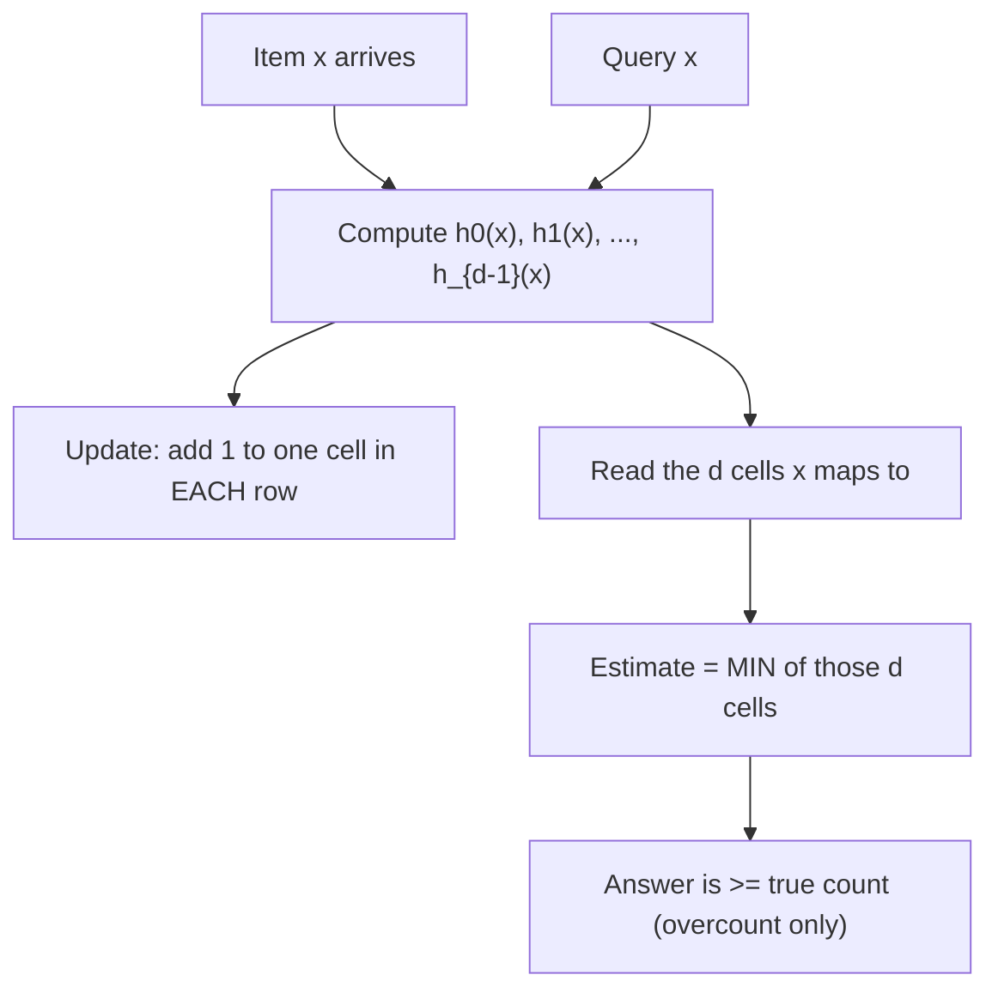

# Count-Min Sketch — Junior Level

> **One-line summary:** A Count-Min Sketch (CMS) is a tiny fixed-size `d × w` table of integer counters plus `d` hash functions. To count an item you hash it once per row and add 1 to that one cell in each row; to ask "how many times did I see `x`?" you read the `d` cells `x` maps to and take the **minimum**. Because different items can collide into the same cell, the answer can be *too high* but **never too low** — the estimate is an overcount with a small, tunable error.

---

## Table of Contents

1. [Introduction](#introduction)
2. [Prerequisites](#prerequisites)
3. [Glossary](#glossary)
4. [Core Concepts](#core-concepts)
5. [Big-O Summary](#big-o-summary)
6. [Real-World Analogies](#real-world-analogies)
7. [Pros & Cons](#pros--cons)
8. [Step-by-Step Walkthrough](#step-by-step-walkthrough)
9. [Code Examples](#code-examples)
10. [Coding Patterns](#coding-patterns)
11. [Error Handling](#error-handling)
12. [Performance Tips](#performance-tips)
13. [Best Practices](#best-practices)
14. [Edge Cases & Pitfalls](#edge-cases--pitfalls)
15. [Common Mistakes](#common-mistakes)
16. [Cheat Sheet](#cheat-sheet)
17. [Visual Animation](#visual-animation)
18. [Summary](#summary)
19. [Further Reading](#further-reading)

---

## Introduction

> Focus: "What is it?" and "How do I use it?"

Imagine a firehose of events flying past: every URL a website serves, every IP packet on a link, every word in a torrent of tweets. You want to answer a simple-sounding question on demand: *"how many times have I seen this particular item so far?"* For example, *"how many requests came from IP `1.2.3.4`?"* or *"how many times did the word `error` appear?"*

The obvious approach is a hash map: one `(item → count)` entry per distinct item, increment as you go. That is exact, but the memory cost is `O(number of distinct items)`. On a stream with **billions** of distinct URLs or IP addresses, that map does not fit in RAM. We need a structure that uses a *fixed, tiny* amount of memory **no matter how many distinct items appear**, and still gives a usefully accurate count.

**Count-Min Sketch** does exactly that. You allocate a small two-dimensional array of counters — `d` rows and `w` columns — and pick `d` independent hash functions, one per row. Every counter starts at zero. To record an occurrence of item `x`, you hash `x` with each of the `d` hash functions; each hash points at one column in its row; you add 1 to those `d` cells (one per row). To estimate how many times `x` has been seen, you hash `x` the same way and read those same `d` cells, then report the **smallest** of them.

The whole structure uses only `d × w` counters — perhaps a few thousand — regardless of whether the stream has a thousand distinct items or a trillion. The catch: two different items can hash to the *same* cell in a row (a **collision**), and their counts pile up together. So a cell can hold more than just `x`'s count. Taking the **minimum across rows** is the trick that limits the damage: `x` would have to collide with busy items in *every single row* to be badly overestimated, and that is unlikely. The estimate therefore **overcounts only** — it is always at least the true count, and usually only a little more.

This file builds the whole picture: the grid, the `d` hashes, the add-one-per-row update, the take-the-min query, why it overcounts but never undercounts, and a small worked example you can trace by hand.

---

## Prerequisites

Before reading this file you should be comfortable with:

- **Basic programming** — loops, functions, arrays, and 2D arrays (in any of Go/Java/Python).
- **Hash functions** — the idea that a hash maps any item to a number, and `hash(x) % w` lands it in one of `w` buckets. (No cryptography needed — fast, well-spread hashing is enough.)
- **The idea of a stream** — data arriving one item at a time, seen once, too large to store fully.
- **Frequency / counting** — how many times each value appears.
- **Big-O notation** — `O(1)`, `O(d)`, `O(n)`.

Optional but helpful:

- A glance at the **Bloom filter** (cross-link `02-bloom-filter`). A Bloom filter answers *"have I seen this at all?"* (yes/no) with several hashes; a Count-Min Sketch answers *"how many times?"* (a count) with several hashes. The shapes are cousins.
- The notion that some structures give **approximate** answers in exchange for tiny memory.

---

## Glossary

| Term | Meaning |
|------|---------|
| **Stream** | A long sequence of items seen one at a time, often too large to store fully. |
| **`N`** | The total number of updates processed (sum of all increments seen so far). |
| **Sketch** | A small, fixed-size summary of a large dataset that answers queries approximately. |
| **`d` (depth)** | The number of rows = the number of independent hash functions. More rows → lower failure probability. |
| **`w` (width)** | The number of columns (counters) per row. More columns → fewer collisions → smaller overcount. |
| **Counter / cell** | One integer in the `d × w` table. Starts at 0; incremented on updates. |
| **Hash function `h_i`** | The hash assigned to row `i`; maps an item to a column index `0..w-1`. |
| **Update / increment** | Recording one (or more) occurrences of an item: add to one cell per row. |
| **Estimate / query** | The reported count for an item: the **minimum** of its `d` cells. |
| **Collision** | Two different items mapping to the same cell in the same row, so their counts mix. |
| **Overcount / overestimate** | The amount the estimate exceeds the true count. CMS only overcounts (never under). |
| **`eps` (epsilon)** | The target error fraction: estimate overshoots by at most `eps × N`. Sets `w`. |
| **`delta`** | The allowed failure probability: the error bound holds with probability `1 - delta`. Sets `d`. |

---

## Core Concepts

### 1. The problem: per-item counts in one pass, tiny memory

We see `N` updates stream past. At any moment we want to answer *"how many times has item `x` been seen?"* for any `x` we name. An exact hash map costs `O(distinct items)` memory — fine for thousands of keys, fatal for billions. We want **fixed** memory, chosen up front, independent of how many distinct items show up.

### 2. The `d × w` counter grid

A Count-Min Sketch is a rectangle of counters: `d` rows and `w` columns, all starting at 0.

```text
        col0  col1  col2  col3  col4  col5
row0  [   0     0     0     0     0     0  ]   uses hash h0
row1  [   0     0     0     0     0     0  ]   uses hash h1
row2  [   0     0     0     0     0     0  ]   uses hash h2
```

Each **row** has its own hash function. Row 0 uses `h0`, row 1 uses `h1`, and so on. The hashes are *independent*, so an item that collides with someone in row 0 probably lands somewhere else in row 1.

### 3. Update: add one cell per row

To record one occurrence of item `x`, compute its column in each row and increment that one cell:

```text
for each row i in 0..d-1:
    col = h_i(x) % w
    table[i][col] += 1
```

You touch exactly `d` cells per update — one per row. (To add a weight `c` instead of `1`, add `c` to each of those cells. CMS handles weighted counts naturally.)

### 4. Query: take the minimum across rows

To estimate how many times `x` has been seen, read the same `d` cells and report the **smallest**:

```text
estimate(x) = min over i of table[i][ h_i(x) % w ]
```

### 5. Why overcount only — never undercount

Every time the *true* `x` is seen, **all `d` of its cells** get incremented. So each of `x`'s cells holds *at least* `x`'s true count. The cells may hold *more* — because other items collide into them — but never *less*. Taking the minimum of `d` values that are each `≥ true count` still gives something `≥ true count`. Hence:

```text
true_count(x)  ≤  estimate(x)
```

The estimate is an **overcount, never an undercount**. (Contrast with Misra-Gries, cross-link `22-randomized-algorithms/08`, which only *under*counts.)

### 6. Why the minimum tames collisions

A single row might overcount `x` badly if `x` happens to share its cell with a very frequent item. But that bad luck must strike in *every* row simultaneously for the **min** to be large — because the min picks the *least* polluted cell. With `d` independent hashes, the chance that *all* rows are badly polluted shrinks fast. That is the whole reason for having multiple rows and taking the minimum: each extra row is another chance to find a clean(er) cell.

### 7. Two knobs: `w` controls error size, `d` controls failure odds

- **More columns `w`** → fewer collisions → each cell pollution is smaller → tighter overcount.
- **More rows `d`** → more independent chances for a clean cell → smaller probability the bound fails.

The middle level shows the exact formulas (`w = ceil(e/eps)`, `d = ceil(ln(1/delta))`), but the intuition is: *width fights the size of the error; depth fights the odds of being unlucky.*

---

## Big-O Summary

| Operation | Time | Space | Notes |
|-----------|------|-------|-------|
| Update (record one occurrence) | **O(d)** | — | One hash + one increment per row. `d` is tiny (often 4–8), so effectively constant. |
| Query (estimate a count) | **O(d)** | — | Read `d` cells, take the min. |
| Merge two sketches (same `d, w`) | **O(d·w)** | — | Element-wise add of the two tables. |
| Space (the table) | — | **O(d·w)** | Fixed; independent of stream length or distinct count. |
| Naive exact counting (hash map) | O(1) per op | **O(distinct items)** | Exact, but memory blows up on big streams. |

The headline win is **space**: `O(d·w)` — fixed and tiny — versus `O(distinct items)` for an exact hash map. You trade exactness for memory: CMS gives an approximate count (a bounded overcount) using a handful of kilobytes.

---

## Real-World Analogies

| Concept | Analogy |
|---------|---------|
| The stream | A conveyor belt of letters flying past too fast to file each one individually. |
| The `d × w` grid | A wall of `d` rows of `w` mailboxes; every row sorts letters by a *different* rule. |
| A hash function per row | Each row's clerk uses a different sorting rule, so the same letter lands in a different mailbox per row. |
| Update (add one per row) | When a letter arrives, the clerk in each row drops a token into the one mailbox that letter maps to. |
| Collision | Two different senders' letters happen to share a mailbox in one row, so its token count mixes them up. |
| Query (take the min) | To estimate one sender's mail, read that sender's mailbox in every row and trust the **lowest** count — the row where they got mixed up least. |
| Overcount only | A mailbox can only have *extra* tokens from collisions, never *missing* ones, so the count is never too low. |

Where the analogy breaks: real mailboxes can be emptied and inspected individually; a CMS cell is a single number that has irreversibly *summed* many items together. You can never pull one item's tokens back out — you only ever read the blended total and lean on the minimum to cut through the noise.

---

## Pros & Cons

| Pros | Cons |
|------|------|
| **Tiny, fixed memory:** `O(d·w)` regardless of stream size or number of distinct items. | Returns **approximate** counts (overcount up to `eps·N`), not exact frequencies. |
| **Fast:** `O(d)` per update and per query, with `d` small (4–8). | Cannot **enumerate** which items are heavy — you must already know which key to query (pair with a heap for heavy hitters). |
| **Overcount only:** estimate is always `≥` the true count, with a tunable error bound. | Error grows with total volume `N`; rare items can be drowned by collisions with frequent ones. |
| **Handles weighted updates** (add `c`, not just `1`) and works on unbounded streams. | Needs good, independent hash functions; bad hashing wrecks the guarantee. |
| **Mergeable:** add two same-shaped tables to combine parallel/distributed streams. | Plain CMS has no delete; you need the *count-mean-min* or a conservative variant to fight bias, or a *Count Sketch* for deletions. |
| Two clear knobs (`eps`, `delta`) tie memory directly to accuracy. | No false-positive-free membership: a never-seen item can report a nonzero count. |

**When to use:** estimating how often individual items appear in a massive or unbounded stream with bounded memory — network traffic per IP, word/n-gram counts in NLP, trending counts, DB query optimizer statistics.

**When NOT to use:** when you need *exact* counts (use a hash map if it fits); when you must *list* the frequent items without knowing their keys in advance (use Misra-Gries / Space-Saving, or pair CMS with a heap); when undercounting (rather than overcounting) is the safer error direction.

---

## Step-by-Step Walkthrough

Let us build a tiny sketch with **`d = 2` rows** and **`w = 4` columns** and feed it a stream. We need two hash functions; for the demo we use simple made-up ones so you can check the arithmetic by hand:

```text
h0(x) = (sum of letter positions of x) % 4
h1(x) = (3 * len(x) + first letter position) % 4    (letter position: a=1, b=2, ... )
```

**Stream:** `cat cat dog cat bird dog`

True counts: `cat = 3`, `dog = 2`, `bird = 1`. Total `N = 6`.

Precompute columns (you can verify these):

| item | h0 column | h1 column |
|------|-----------|-----------|
| `cat`  (c=3,a=1,t=20 → 24 %4=0; len3→9+3=12 %4=0) | 0 | 0 |
| `dog`  (d=4,o=15,g=7 → 26 %4=2; len3→9+4=13 %4=1) | 2 | 1 |
| `bird` (b=2,i=9,r=18,d=4 → 33 %4=1; len4→12+2=14 %4=2) | 1 | 2 |

Now process the stream, adding 1 per row each time:

| Step | Item | row0 col | row1 col | Table after (row0 / row1) |
|------|------|----------|----------|----------------------------|
| 1 | `cat`  | 0 | 0 | `[1,0,0,0]` / `[1,0,0,0]` |
| 2 | `cat`  | 0 | 0 | `[2,0,0,0]` / `[2,0,0,0]` |
| 3 | `dog`  | 2 | 1 | `[2,0,1,0]` / `[2,1,0,0]` |
| 4 | `cat`  | 0 | 0 | `[3,0,1,0]` / `[3,1,0,0]` |
| 5 | `bird` | 1 | 2 | `[3,1,1,0]` / `[3,1,1,0]` |
| 6 | `dog`  | 2 | 1 | `[3,1,2,0]` / `[3,2,1,0]` |

**Final table:**

```text
row0 (h0): [ 3, 1, 2, 0 ]
row1 (h1): [ 3, 2, 1, 0 ]
```

**Queries (take the min across rows):**

- `cat` → row0 col0 = 3, row1 col0 = 3 → **min = 3**. True = 3. **Exact!**
- `dog` → row0 col2 = 2, row1 col1 = 2 → **min = 2**. True = 2. **Exact!**
- `bird` → row0 col1 = 1, row1 col2 = 1 → **min = 1**. True = 1. **Exact!**

This run got lucky — no harmful collisions. Now see overcounting in action. Query an item we **never inserted**, say `act` (an anagram of `cat`, so it hashes the same way): `h0(act)` = `(1+3+20)%4 = 0`, `h1(act)` = `(9 + 1)%4 = 2`.

- `act` → row0 col0 = 3, row1 col2 = 1 → **min = 1**.

We never saw `act`, yet the sketch reports **1**. That is a pure **overcount caused by collisions** (`act` shares row0's cell with `cat` and row1's cell with `bird`). Notice the min still pulled it down from 3 to 1 — without the second row we would have reported 3. This is the overcount-only behavior: the answer is `≥` the true count (here true = 0, reported = 1), never below it.

**Takeaway:** with this small grid collisions are common; in a real sketch you would use `w` in the thousands so that `eps·N` (the overcount) is tiny relative to the counts you care about.

---

## Code Examples

### Example 1: A minimal Count-Min Sketch

This implements the grid, an `Add` (update) method, and an `Estimate` (query) method. We derive `d` hash functions from two base hashes using the trick `h_i(x) = (a + i·b) % w` (this needs only two real hashes — see the Bloom filter file `02-bloom-filter` for the same double-hashing idea).

#### Go

```go
package main

import (
	"fmt"
	"hash/fnv"
)

// CountMinSketch is a d x w grid of counters.
type CountMinSketch struct {
	d, w  int
	table [][]uint64
}

func New(d, w int) *CountMinSketch {
	t := make([][]uint64, d)
	for i := range t {
		t[i] = make([]uint64, w)
	}
	return &CountMinSketch{d: d, w: w, table: t}
}

// two base hashes via FNV, combined as a + i*b (double hashing)
func (c *CountMinSketch) hashes(key string) (uint64, uint64) {
	h1 := fnv.New64a()
	h1.Write([]byte(key))
	a := h1.Sum64()
	h2 := fnv.New64()
	h2.Write([]byte(key))
	b := h2.Sum64()
	return a, b
}

// Add records `count` occurrences of key: +count to one cell per row.
func (c *CountMinSketch) Add(key string, count uint64) {
	a, b := c.hashes(key)
	for i := 0; i < c.d; i++ {
		col := (a + uint64(i)*b) % uint64(c.w)
		c.table[i][col] += count
	}
}

// Estimate returns the minimum across the d rows (overcount, never under).
func (c *CountMinSketch) Estimate(key string) uint64 {
	a, b := c.hashes(key)
	min := ^uint64(0) // max uint64
	for i := 0; i < c.d; i++ {
		col := (a + uint64(i)*b) % uint64(c.w)
		if c.table[i][col] < min {
			min = c.table[i][col]
		}
	}
	return min
}

func main() {
	cms := New(4, 16)
	for _, w := range []string{"cat", "cat", "dog", "cat", "bird", "dog"} {
		cms.Add(w, 1)
	}
	fmt.Println("cat  ~", cms.Estimate("cat"))  // ~3
	fmt.Println("dog  ~", cms.Estimate("dog"))  // ~2
	fmt.Println("bird ~", cms.Estimate("bird")) // ~1
	fmt.Println("fox  ~", cms.Estimate("fox"))  // 0 or a small overcount
}
```

#### Java

```java
import java.util.zip.CRC32;

public class CountMinSketch {
    private final int d, w;
    private final long[][] table;

    public CountMinSketch(int d, int w) {
        this.d = d;
        this.w = w;
        this.table = new long[d][w];
    }

    // two base hashes; combine as a + i*b (double hashing)
    private long[] hashes(String key) {
        int a = key.hashCode();
        CRC32 crc = new CRC32();
        crc.update(key.getBytes());
        long b = crc.getValue();
        return new long[]{Integer.toUnsignedLong(a), b};
    }

    // Add records `count` occurrences: +count to one cell per row.
    public void add(String key, long count) {
        long[] h = hashes(key);
        for (int i = 0; i < d; i++) {
            int col = (int) (((h[0] + (long) i * h[1]) % w + w) % w);
            table[i][col] += count;
        }
    }

    // Estimate returns the min across rows (overcount, never under).
    public long estimate(String key) {
        long[] h = hashes(key);
        long min = Long.MAX_VALUE;
        for (int i = 0; i < d; i++) {
            int col = (int) (((h[0] + (long) i * h[1]) % w + w) % w);
            min = Math.min(min, table[i][col]);
        }
        return min;
    }

    public static void main(String[] args) {
        CountMinSketch cms = new CountMinSketch(4, 16);
        for (String s : new String[]{"cat", "cat", "dog", "cat", "bird", "dog"}) {
            cms.add(s, 1);
        }
        System.out.println("cat  ~ " + cms.estimate("cat"));   // ~3
        System.out.println("dog  ~ " + cms.estimate("dog"));   // ~2
        System.out.println("bird ~ " + cms.estimate("bird"));  // ~1
        System.out.println("fox  ~ " + cms.estimate("fox"));   // 0 or small overcount
    }
}
```

#### Python

```python
import hashlib


class CountMinSketch:
    """A d x w grid of counters. Update adds one per row; query takes the min."""

    def __init__(self, d, w):
        self.d = d
        self.w = w
        self.table = [[0] * w for _ in range(d)]

    def _hashes(self, key):
        # two base hashes via md5 halves; combine as a + i*b (double hashing)
        h = hashlib.md5(key.encode()).digest()
        a = int.from_bytes(h[:8], "big")
        b = int.from_bytes(h[8:], "big") | 1  # keep b odd so steps cover the row
        return a, b

    def add(self, key, count=1):
        """Record `count` occurrences: +count to one cell per row."""
        a, b = self._hashes(key)
        for i in range(self.d):
            col = (a + i * b) % self.w
            self.table[i][col] += count

    def estimate(self, key):
        """Return the minimum across the d rows (overcount, never under)."""
        a, b = self._hashes(key)
        return min(self.table[i][(a + i * b) % self.w] for i in range(self.d))


if __name__ == "__main__":
    cms = CountMinSketch(d=4, w=16)
    for word in ["cat", "cat", "dog", "cat", "bird", "dog"]:
        cms.add(word)
    print("cat  ~", cms.estimate("cat"))   # ~3
    print("dog  ~", cms.estimate("dog"))   # ~2
    print("bird ~", cms.estimate("bird"))  # ~1
    print("fox  ~", cms.estimate("fox"))   # 0 or small overcount
```

**What it does:** records a stream of words and answers approximate per-word counts. Frequent words come back exact or near-exact; an item never inserted may report a small overcount due to collisions.
**Run:** `go run main.go` | `javac CountMinSketch.java && java CountMinSketch` | `python cms.py`

---

## Coding Patterns

### Pattern 1: Update one cell per row, query the min

**Intent:** The two core operations, side by side.

```python
def add(table, hashes, w, key, c=1):
    for i, h in enumerate(hashes):       # one cell per row
        table[i][h(key) % w] += c

def estimate(table, hashes, w, key):
    return min(table[i][h(key) % w] for i, h in enumerate(hashes))  # take the min
```

### Pattern 2: Sizing the grid from a target error

**Intent:** Turn "I want at most `eps·N` overcount with `1 - delta` confidence" into `d` and `w`.

```python
import math

def dimensions(eps, delta):
    w = math.ceil(math.e / eps)        # columns: controls error size
    d = math.ceil(math.log(1 / delta)) # rows: controls failure odds
    return d, w

# Example: eps = 0.001 (0.1% of N), delta = 0.01 (99% confidence)
# w = ceil(2.718 / 0.001) = 2719 columns, d = ceil(ln(100)) = 5 rows
# total cells = 5 * 2719 = 13,595 counters — a few KB, for ANY stream size.
```

### Pattern 3: CMS update/query data flow



A query for `1%`-of-stream items would set `eps = 0.01`; an update touches `d` cells, a query reads `d` cells and takes the smallest.

---

## Error Handling

| Error | Cause | Fix |
|-------|-------|-----|
| Negative or huge column index | Signed hash in Java/Go produced a negative modulo. | Mask to unsigned or use `((x % w) + w) % w`. |
| All rows use the same hash | Reusing one hash function for every row defeats the point — every row collides identically. | Use `d` independent hashes, or double-hashing `a + i·b` with `b` not a multiple of `w`. |
| Estimates wildly too high | `w` too small for the stream volume, so collisions dominate. | Increase `w` (recompute `w = ceil(e/eps)` for the `eps` you need). |
| Counter overflow | Many updates push a cell past its integer type. | Use 64-bit counters; or use a decaying/windowed sketch for very long streams. |
| Querying treats min as exact | Reporting the estimate as the true count. | Document it as an *upper bound*; state the `eps·N` error. |
| Empty sketch query | Querying before any `Add`. | Returns 0 correctly — every cell is 0, min is 0. |

---

## Performance Tips

- **Keep `d` small** (commonly 4–8). Each extra row is another hash + memory read per update/query; `d` past ~10 buys little because failure probability already shrinks exponentially.
- **Make `w` a power of two** so `% w` becomes a fast bitmask (`& (w-1)`).
- **Use double hashing** (`h_i = a + i·b`) to get `d` hashes from two real hash computations instead of `d` — a big speedup with negligible accuracy loss.
- **Choose a fast non-cryptographic hash** (FNV, MurmurHash, xxHash). You do not need cryptographic strength, only good spread.
- **Store rows contiguously** (one flat `d·w` array) for cache-friendly access.
- For heavy-hitter *discovery* (not just point queries), pair the sketch with a min-heap of the top-`k` candidates — see the middle level.

---

## Best Practices

- Always document that the result is **approximate** and an **overcount** (`true ≤ estimate ≤ true + eps·N`).
- Derive `d` and `w` from your real `eps`/`delta`, not from guesswork.
- Validate your implementation against an exact hash map on small inputs: the estimate must **never be below** the true count.
- Use independent (or double-hashed) hash functions; test that different rows really map an item to different columns.
- Decide up front whether you need *point queries* only (plain CMS) or *heavy-hitter discovery* (CMS + heap).
- For long-running streams, consider a **windowed** or **decaying** sketch so old counts age out and `N` stays bounded.

---

## Edge Cases & Pitfalls

- **Empty sketch** — every query returns 0; correct, since all cells are 0.
- **Item never inserted** — may still report a small nonzero count from collisions (a false overcount). The min keeps it small.
- **One dominant item** — a single very frequent item inflates whatever cells it touches, raising the overcount for everything sharing those cells. Larger `w` mitigates this.
- **All items distinct, each seen once** — many collisions; rare items can be overcounted. CMS shines on *skewed* data (a few very frequent items), less on uniform data.
- **`w` too small** — collisions everywhere, estimates uselessly high. Size `w` to the stream.
- **Counter overflow** — extremely long streams can overflow small integer counters; use 64-bit or a windowed sketch.
- **Reusing one hash for all rows** — silently collapses the sketch to a single row; estimates become unreliable.

---

## Common Mistakes

1. **Taking the average instead of the minimum** — the plain CMS estimate is the **min**. Averaging breaks the overcount-only guarantee (the count-mean-min variant uses the mean *with a bias correction*, covered in middle).
2. **Using `d` rows but only one hash function** — every row collides identically; you get no benefit from depth.
3. **Picking `w` too small** — collisions dominate and estimates become huge. Size `w` from `eps`.
4. **Reporting estimates as exact** — CMS overcounts; always state it is an upper bound.
5. **Negative modulo from signed hashes** — produces an invalid column index; normalize to unsigned.
6. **Expecting CMS to *list* heavy hitters** — it only answers *point* queries for keys you supply. To discover heavy hitters, pair it with a heap.
7. **Trying to delete by subtracting in plain CMS** — subtraction breaks the overcount guarantee and can underflow; use a Count Sketch or a counting variant if deletions are needed.

---

## How CMS Relates to the Bloom Filter (a Friendly Comparison)

If you have met the **Bloom filter** (cross-link `02-bloom-filter`), the Count-Min Sketch will feel familiar — they are close relatives.

| Aspect | Bloom filter | Count-Min Sketch |
|--------|--------------|------------------|
| Question answered | "Have I seen `x` at all?" (yes / no) | "How many times have I seen `x`?" (a count) |
| Cells store | **bits** (0/1) | **counters** (integers) |
| Multiple hashes used to... | set/check `k` bits | update/read `d` cells (one per row) |
| Combine the `k`/`d` reads by... | **AND** (all bits must be 1) | **MIN** (take the smallest counter) |
| Error direction | **false positives** only (says "seen" when never seen) | **overcount** only (count too high, never too low) |
| Never makes this error | false negatives (never says "not seen" for a seen item) | undercount (never reports below the true count) |
| Layout | one bit array, `k` hashes share it | `d` separate rows, one hash per row |

The mental bridge: a Bloom filter is *almost* a Count-Min Sketch where each counter is capped at 1 bit and you AND instead of MIN. Both pay for tiny memory with a *one-sided* error, and both rely on multiple hashes so that bad luck must strike *every* hash at once. A **Counting Bloom filter** (cross-link `23-counting-bloom-filter`) sits in between — it uses small counters but still answers membership, not full frequency.

---

## Frequently Asked Questions

**Q: Why take the minimum and not the average or the maximum?** Each of `x`'s cells is `≥` `x`'s true count (every real occurrence increments all of them). Collisions only *add* extra. So the cell with the *least* extra pollution — the **minimum** — is the closest to the truth while still being a valid upper bound. The maximum would be the worst (most polluted) cell; the average would not be a guaranteed upper bound.

**Q: Can the estimate ever be below the true count?** No. Every occurrence of `x` increments all `d` of its cells, so each cell — and therefore their minimum — is at least the true count. CMS overcounts only.

**Q: If I query an item I never inserted, can I get a nonzero answer?** Yes — collisions from *other* items can leave nonzero values in the cells your item maps to. That is a false overcount, kept small by taking the min and by using a large enough `w`.

**Q: How is this different from a Bloom filter?** A Bloom filter answers membership (yes/no) using bits and AND; a Count-Min Sketch answers frequency (a count) using integer counters and MIN. See the comparison table above.

**Q: How do I find the *most frequent* items, not just count one I name?** Plain CMS cannot enumerate keys. Pair it with a min-heap that tracks the top-`k` candidates: on each update, query the sketch and, if the estimate beats the heap's smallest, insert/update the key in the heap. The middle level covers this.

**Q: Does the order of the stream matter?** No. Updates are additions, and addition is commutative, so the final table — and every estimate — is independent of the order items arrive in. This is also why two sketches can be merged.

---

## Cheat Sheet

| Question | Answer |
|----------|--------|
| What is it? | A `d × w` grid of counters + `d` hashes that estimates per-item frequencies. |
| Update? | For each row `i`: `table[i][h_i(x) % w] += 1` (one cell per row). |
| Query? | `estimate(x) = min over rows i of table[i][h_i(x) % w]`. |
| Error direction? | **Overcount only** — `true ≤ estimate ≤ true + eps·N`. |
| Space? | `O(d·w)` — fixed, tiny. |
| Time per op? | `O(d)` update and query. |
| `w` controls? | Error *size* (`w = ceil(e/eps)`). |
| `d` controls? | Failure *probability* (`d = ceil(ln(1/delta))`). |
| Mergeable? | Yes — element-wise add of two same-shaped tables. |
| Find heavy hitters? | Pair with a min-heap. |

Core algorithm:

```text
CountMinSketch(d, w):
    table = d x w grid of zeros
    add(x, c):     for i in 0..d-1: table[i][h_i(x) % w] += c
    estimate(x):   return min over i of table[i][h_i(x) % w]
# space: O(d*w);  update/query: O(d);  estimate >= true count (overcount only)
```

---

## Visual Animation

> See [`animation.html`](./animation.html) for an interactive visualization.
>
> The animation demonstrates:
> - The `d × w` counter grid, all cells starting at 0
> - An **update** highlighting and incrementing exactly one cell per row
> - A **query** highlighting the `d` cells an item maps to and circling the **minimum**
> - **Collisions** lighting up when two items share a cell, and the resulting overcount
> - The true count vs the estimate, with the `eps·N` error band
> - Step / Run / Reset controls, an info panel, a Big-O / error table, and an operation log

---

## Summary

A **Count-Min Sketch** answers *"how many times have I seen item `x`?"* over a massive stream using only a fixed `d × w` grid of counters and `d` hash functions — a few kilobytes regardless of how many distinct items exist. To **update**, hash the item once per row and add 1 to that one cell in each row. To **query**, read the `d` cells the item maps to and report their **minimum**. Because every real occurrence increments *all* of an item's cells, while collisions only *add* extra, the estimate is always an **overcount, never an undercount**, and the min picks the least-polluted cell to keep that overcount small. Two knobs tune it: **width `w`** shrinks the error size, **depth `d`** shrinks the odds of an unlucky answer. The two things never to forget: take the **minimum** (not the average), and treat the result as an **upper bound** (overcount up to `eps·N`), not an exact count.

---

## Next step: [middle.md](./middle.md) — sizing `w` and `d` from `eps`/`delta`, the conservative-update optimization, finding heavy hitters with a heap, and CMS vs Bloom filter vs Misra-Gries / Space-Saving.

## Further Reading

- Cormode, G. & Muthukrishnan, S. (2005), *An Improved Data Stream Summary: The Count-Min Sketch and its Applications* — the original paper.
- Cormode, G. & Hadjieleftheriou, M., *Finding frequent items in data streams* — survey comparing CMS, Misra-Gries, Space-Saving.
- Sibling topic `02-bloom-filter` (this section) — the membership-test cousin of CMS.
- Sibling topics `22-randomized-algorithms/08-misra-gries-heavy-hitters` and `/11-space-saving-algorithm` — deterministic frequent-item summaries that *undercount*.
- *Mining of Massive Datasets* (Leskovec, Rajaraman, Ullman) — streaming and frequent-items chapters.
