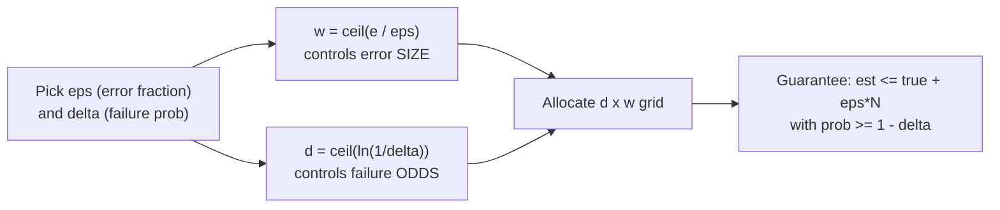
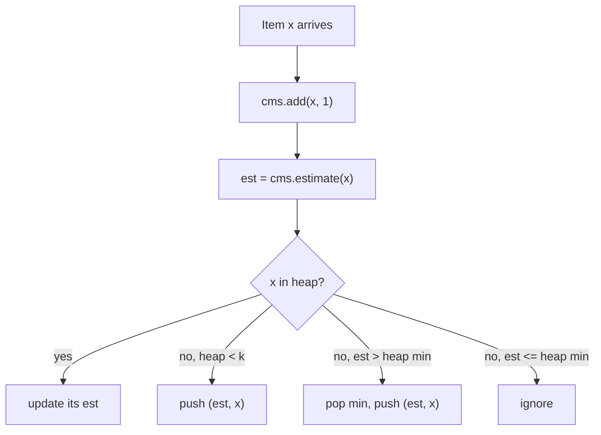

# Count-Min Sketch — Middle Level

> Focus: "Why does it work?" and "When should I choose it?"

> **One-line summary:** Set the width from the error you can tolerate (`w = ceil(e/eps)`) and the depth from the failure odds you accept (`d = ceil(ln(1/delta))`); then the estimate overshoots the true count by at most `eps·N` with probability `1 - delta`. The **conservative update** (only raise the cells that would still equal the new minimum) cuts the bias dramatically; pairing the sketch with a **min-heap** turns point-query CMS into a heavy-hitter detector; and knowing that CMS *over*counts while Misra-Gries *under*counts tells you exactly which tool fits which failure you can live with.

---

## Table of Contents

1. [Introduction](#introduction)
2. [Deeper Concepts](#deeper-concepts)
3. [Sizing the Grid: eps and delta](#sizing-the-grid-eps-and-delta)
4. [Conservative Update (Minimal Increment)](#conservative-update-minimal-increment)
5. [Heavy Hitters with a Heap](#heavy-hitters-with-a-heap)
6. [Comparison with Alternatives](#comparison-with-alternatives)
7. [The Count-Min-Mean Variant](#the-count-min-mean-variant)
8. [Code Examples](#code-examples)
9. [Error Handling](#error-handling)
10. [Performance Analysis](#performance-analysis)
11. [Best Practices](#best-practices)
12. [Visual Animation](#visual-animation)
13. [Summary](#summary)

---

## Introduction

At the junior level you learned the *mechanics*: a `d × w` grid, add one per row, query the min, overcount only. The middle level answers the questions a working engineer actually faces:

- **How big should the grid be?** You cannot guess `d` and `w` — you derive them from an error target `eps` and a confidence target `delta`.
- **Why does the min give a bounded error at all?** The Markov-inequality argument (full proof in `professional.md`) is what turns "probably fine" into "fine with probability `1 - delta`."
- **Can we do better than plain CMS?** Yes — the *conservative update* keeps the same query but shrinks the overcount, often by a large factor on skewed data.
- **How do I find which items are heavy** when CMS only answers queries for keys I name? Pair it with a heap.
- **When is CMS the wrong tool?** Knowing it *over*counts (vs Misra-Gries / Space-Saving which *under*count, and Bloom which only tests membership) tells you which error direction your system can tolerate.

The invariant that drives everything: **for every item `x`, each of its `d` cells holds `true_count(x)` plus the sum of the counts of all *other* items that collide with `x` in that row.** The estimate (the min) is therefore `true_count(x)` plus the *smallest* collision-noise across the `d` rows. Width shrinks the expected noise per row; depth gives more rows to find a clean one.

---

## Deeper Concepts

### Invariant: cell = true count + collision noise

Fix an item `x` and a row `i`. Let `c_i = h_i(x) % w` be its column in that row. After processing the whole stream:

```text
table[i][c_i] = true_count(x) + sum of true_count(y) over all y != x with h_i(y) % w == c_i
```

Call that second term the **collision noise** `noise_i(x) ≥ 0`. Then:

```text
estimate(x) = min over i of ( true_count(x) + noise_i(x) )
            = true_count(x) + min over i of noise_i(x)
```

So the *only* error is `min_i noise_i(x)`, and it is always `≥ 0` — the source of the **overcount-only** guarantee. Our whole job is to make that minimum noise small.

### Why the minimum, formally

Each `noise_i(x)` is a nonnegative random quantity (random because the hash maps other items to columns "randomly"). Its expectation is bounded: the rest of the stream has total weight `N - true_count(x) ≤ N`, spread across `w` columns, so on average a column collects about `N/w` of it. With `w = e/eps`, that is `eps·N/e` per row in expectation. The *minimum* over `d` independent rows is much smaller than any single row's noise — that is what depth buys. The professional level makes this precise with Markov's inequality.

### Linearity and mergeability

Because updates are additions and the table is just a sum, two key properties follow:

- **Order independence:** the final table does not depend on the stream order.
- **Mergeability:** sketches `A` and `B` with the *same* `d`, `w`, and hash functions merge by element-wise addition: `(A+B)[i][j] = A[i][j] + B[i][j]`. The merged sketch is exactly the sketch you would have built on the concatenated streams. This is the foundation of distributed counting (senior level).

---

## Sizing the Grid: eps and delta

This is the single most important practical skill. You specify two targets and read off the dimensions:

| Target | Meaning | Sets |
|--------|---------|------|
| **`eps`** (epsilon) | Maximum acceptable overcount, as a fraction of total volume `N`. The estimate overshoots by at most `eps·N`. | **Width** `w = ceil(e / eps)` |
| **`delta`** | Acceptable probability that the bound is violated. Holds with probability `1 - delta`. | **Depth** `d = ceil(ln(1 / delta))` |

The guarantee (proved in `professional.md`):

```text
Pr[ estimate(x) ≤ true_count(x) + eps·N ]  ≥  1 - delta
```

**Worked sizing examples:**

| Use case | `eps` | `delta` | `w = ceil(e/eps)` | `d = ceil(ln(1/delta))` | Cells | Memory (8 B each) |
|----------|-------|---------|-------------------|--------------------------|-------|--------------------|
| Coarse trending | 0.01 (1% of N) | 0.05 (95%) | 272 | 3 | 816 | ~6.5 KB |
| Network per-IP | 0.001 (0.1%) | 0.01 (99%) | 2719 | 5 | 13 595 | ~106 KB |
| NLP word counts | 0.0005 | 0.001 (99.9%) | 5437 | 7 | 38 059 | ~297 KB |
| High precision | 0.0001 | 0.0001 (99.99%) | 27 183 | 10 | 271 830 | ~2.1 MB |

Notice the asymmetry: **width grows like `1/eps`** (linear in the precision you want), while **depth grows like `ln(1/delta)`** (logarithmic in the confidence). Cutting the error in half doubles memory; adding a "nine" of confidence costs only a couple more rows. This is why CMS is cheap to make *very* reliable but expensive to make *very* precise.



---

## Conservative Update (Minimal Increment)

Plain CMS adds the full increment to **every** row. But here is the insight: after an update of `+1`, the new estimate (the min) can rise by at most 1. So any cell already *above* what the new minimum will be does not need to grow — bumping it only adds noise to *other* items that share that cell, without improving `x`'s own estimate.

**Conservative update (a.k.a. minimal increment):** when adding `c` to item `x`, first read the current estimate `m = estimate(x)`, then set each of `x`'s cells to `max(current, m + c)` instead of blindly adding `c`.

```text
conservative_add(x, c):
    m = estimate(x)              # current min across rows
    target = m + c
    for each row i:
        cell = table[i][h_i(x) % w]
        table[i][h_i(x) % w] = max(cell, target)   # only raise cells below target
```

Why it stays correct: the estimate still never undercounts (every cell remains `≥` true count, because we only ever *raise* cells, never lower them, and `x`'s own min still increases by `c`). But cells that were already high are left alone, so they pollute fewer other items. On skewed (Zipfian) data — the common case in network and NLP workloads — conservative update can reduce the average overcount by a large factor (often 2–10x) for the same grid.

**Trade-off:** conservative update is **not mergeable** by simple addition (the `max` operation is order-dependent across merges), and it makes deletions impossible. If you need to merge distributed sketches, stick with the plain additive update. The senior level discusses this tension.

| Property | Plain (additive) update | Conservative (minimal-increment) update |
|----------|-------------------------|------------------------------------------|
| Update rule | `cell += c` on every row | `cell = max(cell, estimate+c)` on every row |
| Overcount-only guarantee | Yes | Yes |
| Average error on skewed data | Baseline | Much lower (often several x) |
| Mergeable by addition | **Yes** | **No** |
| Supports deletions | With Count Sketch only | No |
| Extra cost per update | — | One `estimate()` (read `d` cells) first |

---

## Heavy Hitters with a Heap

Plain CMS answers *point queries* — "count of key `k`" — but it cannot *enumerate* the frequent items because it never stores keys. The standard fix: maintain a **min-heap** of the top-`k` candidate keys (with their estimated counts) alongside the sketch.

Algorithm per update of item `x`:

1. `cms.add(x, 1)`.
2. `est = cms.estimate(x)`.
3. If `x` is already in the heap → update its estimate.
4. Else if the heap has fewer than `k` entries → push `(est, x)`.
5. Else if `est > heap.min().count` → pop the smallest, push `(est, x)`.

At the end, the heap holds an approximate top-`k` by estimated frequency. Because CMS overcounts, the heap may include a few items whose *true* count is slightly below the cutoff (false positives), but it will not miss an item that is genuinely far above the cutoff. This CMS+heap combination is the workhorse for "top URLs," "top IPs," "trending hashtags," and "hot keys."



---

## Comparison with Alternatives

The frequent-items landscape has four close relatives. Choosing among them comes down to **what question you ask** and **which error direction you can tolerate**.

| Attribute | Count-Min Sketch | Bloom filter (`02-bloom-filter`) | Misra-Gries (`22-rand/08`) | Space-Saving (`22-rand/11`) |
|-----------|------------------|----------------------------------|----------------------------|------------------------------|
| Question answered | "count of key `k`?" | "is `k` present?" (yes/no) | "which items are heavy?" | "top-`k` items + counts" |
| Stores | `d×w` counters | bit array | `k-1` `(key,count)` pairs | `k` `(key,count,error)` triples |
| Randomized? | **Yes** (hash-based) | Yes | **No** (deterministic) | **No** (deterministic) |
| Error direction | **Over**count | False **positive** | **Under**count | **Over**count (bounded) |
| Never errs by | undercounting | false negative | overcounting | missing a true heavy hitter |
| Space | `O(d·w)` = `O((1/eps)·ln(1/delta))` | `O(m)` bits | `O(k)` | `O(k)` |
| Per-op time | `O(d)` | `O(k)` | `O(1)` amortized | `O(1)` |
| Enumerate heavy items? | No (needs a heap) | No | **Yes** | **Yes** (ranked) |
| Mergeable? | Yes (additive) | Yes (OR) | Yes | Yes |
| Point query for *any* key? | **Yes** | membership only | only tracked keys | only tracked keys |

**Choose Count-Min Sketch when:** you need a *frequency oracle* — point queries for arbitrary keys (including ones not in any top-`k` list), weighted counts, mergeable distributed counting, and you can tolerate a small *over*estimate.

**Choose Misra-Gries / Space-Saving when:** you only care about the *heavy hitters themselves* (you want the list, not arbitrary point queries), you prefer a deterministic guarantee, and `O(k)` space is enough. Space-Saving ranks the top-`k` better and also overcounts; Misra-Gries undercounts.

**Choose a Bloom filter when:** you only need *membership* (seen / not seen), not a count.

**Key mental model:** CMS and Space-Saving err by **over**counting; Misra-Gries errs by **under**counting; Bloom errs by **false positive**. None of CMS, Misra-Gries, or Space-Saving ever errs in the *opposite* direction — that one-sidedness is what makes them safe to reason about.

---

## The Count-Min-Mean Variant

Plain CMS's min is a clean *upper bound*, but it is systematically **biased high** — every cell carries some collision noise, and even the minimum is `true + min_i noise_i ≥ true`. The **Count-Min-Mean (CMM)** variant reduces this bias by estimating and subtracting the expected noise per cell.

Idea: in row `i`, the cell `table[i][c_i]` equals `true(x) + noise_i`. The *rest* of that row (everything except `x`'s contribution) has total `N - table[i][c_i]` spread over the other `w - 1` columns, so the expected noise in any one cell is roughly `(N - table[i][c_i]) / (w - 1)`. Subtract that estimate from each row's cell to get a *de-biased* per-row estimate, then take the **median** across rows (the median is robust to the occasional badly polluted row):

```text
for each row i:
    cell    = table[i][h_i(x) % w]
    noise_i = (N - cell) / (w - 1)             # expected collision noise in this cell
    residual_i = cell - noise_i                 # de-biased estimate from row i
estimate_CMM(x) = median over i of residual_i   # median is robust
# clamp to [0, count_min_estimate]: CMM should not exceed the plain min upper bound
```

| Estimator | Combine rows by | Bias | Guarantee | Use when |
|-----------|------------------|------|-----------|----------|
| **Count-Min (CM)** | minimum | high (always overcounts) | strict upper bound `≤ true + eps·N` | you need a guaranteed upper bound |
| **Count-Min-Mean (CMM)** | median of de-biased residuals | low (can over- or under-shoot) | no strict one-sided bound, but lower *expected* error | you want accuracy and can drop the strict upper-bound guarantee |

CMM trades the clean one-sided guarantee for **lower average error**, which matters a lot for low-frequency items drowned in noise. A common practice is to compute both: use CM as a safe upper bound and CMM when you want the best point estimate. (The closely related **Count Sketch** uses signed hashes and a median and is *unbiased*, additionally supporting deletions — see Further Reading.)

---

## Code Examples

### Full implementation: CMS with sizing, conservative update, and heavy hitters

#### Go

```go
package main

import (
	"container/heap"
	"fmt"
	"hash/fnv"
	"math"
)

type CMS struct {
	d, w  int
	t     [][]uint64
	total uint64
}

func NewFromError(eps, delta float64) *CMS {
	w := int(math.Ceil(math.E / eps))
	d := int(math.Ceil(math.Log(1 / delta)))
	t := make([][]uint64, d)
	for i := range t {
		t[i] = make([]uint64, w)
	}
	return &CMS{d: d, w: w, t: t}
}

func (c *CMS) cols(key string) []int {
	h := fnv.New64a()
	h.Write([]byte(key))
	a := h.Sum64()
	hb := fnv.New64()
	hb.Write([]byte(key))
	b := hb.Sum64() | 1
	cs := make([]int, c.d)
	for i := 0; i < c.d; i++ {
		cs[i] = int((a + uint64(i)*b) % uint64(c.w))
	}
	return cs
}

func (c *CMS) Add(key string, cnt uint64) {
	c.total += cnt
	for i, col := range c.cols(key) {
		c.t[i][col] += cnt
	}
}

// ConservativeAdd raises each cell only up to estimate+cnt.
func (c *CMS) ConservativeAdd(key string, cnt uint64) {
	c.total += cnt
	cs := c.cols(key)
	target := c.estimateCols(cs) + cnt
	for i, col := range cs {
		if c.t[i][col] < target {
			c.t[i][col] = target
		}
	}
}

func (c *CMS) estimateCols(cs []int) uint64 {
	min := ^uint64(0)
	for i, col := range cs {
		if c.t[i][col] < min {
			min = c.t[i][col]
		}
	}
	return min
}

func (c *CMS) Estimate(key string) uint64 { return c.estimateCols(c.cols(key)) }

// --- min-heap of top-k candidates ---
type item struct {
	key string
	est uint64
}
type minHeap []item

func (h minHeap) Len() int            { return len(h) }
func (h minHeap) Less(i, j int) bool  { return h[i].est < h[j].est }
func (h minHeap) Swap(i, j int)       { h[i], h[j] = h[j], h[i] }
func (h *minHeap) Push(x interface{}) { *h = append(*h, x.(item)) }
func (h *minHeap) Pop() interface{} {
	old := *h
	n := len(old)
	it := old[n-1]
	*h = old[:n-1]
	return it
}

func main() {
	cms := NewFromError(0.001, 0.01)
	fmt.Printf("grid: d=%d w=%d\n", cms.d, cms.w)
	stream := []string{"a", "a", "a", "b", "a", "c", "b", "a", "b", "a"}
	k := 2
	h := &minHeap{}
	seen := map[string]bool{}
	for _, x := range stream {
		cms.Add(x, 1)
		est := cms.Estimate(x)
		if seen[x] {
			for i := range *h {
				if (*h)[i].key == x {
					(*h)[i].est = est
				}
			}
			heap.Init(h)
		} else if h.Len() < k {
			heap.Push(h, item{x, est})
			seen[x] = true
		} else if est > (*h)[0].est {
			old := heap.Pop(h).(item)
			delete(seen, old.key)
			heap.Push(h, item{x, est})
			seen[x] = true
		}
	}
	fmt.Println("a ~", cms.Estimate("a")) // ~5
	fmt.Println("top-k heap:", *h)
}
```

#### Java

```java
import java.util.*;

public class CMS {
    final int d, w;
    final long[][] t;
    long total = 0;

    CMS(int d, int w) { this.d = d; this.w = w; this.t = new long[d][w]; }

    static CMS fromError(double eps, double delta) {
        int w = (int) Math.ceil(Math.E / eps);
        int d = (int) Math.ceil(Math.log(1 / delta));
        return new CMS(d, w);
    }

    int[] cols(String key) {
        long a = Integer.toUnsignedLong(key.hashCode());
        long b = (Integer.toUnsignedLong(("salt#" + key).hashCode()) | 1L);
        int[] cs = new int[d];
        for (int i = 0; i < d; i++) cs[i] = (int) (((a + (long) i * b) % w + w) % w);
        return cs;
    }

    void add(String key, long c) {
        total += c;
        int[] cs = cols(key);
        for (int i = 0; i < d; i++) t[i][cs[i]] += c;
    }

    void conservativeAdd(String key, long c) {
        total += c;
        int[] cs = cols(key);
        long target = estimateCols(cs) + c;
        for (int i = 0; i < d; i++) if (t[i][cs[i]] < target) t[i][cs[i]] = target;
    }

    long estimateCols(int[] cs) {
        long min = Long.MAX_VALUE;
        for (int i = 0; i < d; i++) min = Math.min(min, t[i][cs[i]]);
        return min;
    }

    long estimate(String key) { return estimateCols(cols(key)); }

    public static void main(String[] args) {
        CMS cms = CMS.fromError(0.001, 0.01);
        System.out.printf("grid: d=%d w=%d%n", cms.d, cms.w);
        String[] stream = {"a","a","a","b","a","c","b","a","b","a"};
        int k = 2;
        PriorityQueue<long[]> heap = new PriorityQueue<>(Comparator.comparingLong(o -> o[0]));
        Map<String, Long> inHeap = new HashMap<>(); // key -> est (mirror)
        Map<Long, String> keyOf = new HashMap<>();
        for (String x : stream) {
            cms.add(x, 1);
            long est = cms.estimate(x);
            // simplified top-k maintenance
            inHeap.put(x, est);
        }
        // recompute top-k from estimates of distinct keys
        List<String> distinct = new ArrayList<>(inHeap.keySet());
        distinct.sort((p, q) -> Long.compare(inHeap.get(q), inHeap.get(p)));
        System.out.println("a ~ " + cms.estimate("a")); // ~5
        System.out.println("top-" + k + ": " + distinct.subList(0, Math.min(k, distinct.size())));
    }
}
```

#### Python

```python
import hashlib
import heapq
import math


class CMS:
    def __init__(self, d, w):
        self.d, self.w = d, w
        self.t = [[0] * w for _ in range(d)]
        self.total = 0

    @classmethod
    def from_error(cls, eps, delta):
        w = math.ceil(math.e / eps)
        d = math.ceil(math.log(1 / delta))
        return cls(d, w)

    def _cols(self, key):
        h = hashlib.md5(key.encode()).digest()
        a = int.from_bytes(h[:8], "big")
        b = int.from_bytes(h[8:], "big") | 1
        return [(a + i * b) % self.w for i in range(self.d)]

    def add(self, key, c=1):
        self.total += c
        for i, col in enumerate(self._cols(key)):
            self.t[i][col] += c

    def conservative_add(self, key, c=1):
        self.total += c
        cols = self._cols(key)
        target = min(self.t[i][cols[i]] for i in range(self.d)) + c
        for i, col in enumerate(cols):
            if self.t[i][col] < target:
                self.t[i][col] = target

    def estimate(self, key):
        cols = self._cols(key)
        return min(self.t[i][cols[i]] for i in range(self.d))


def top_k_heavy_hitters(stream, k, eps=0.001, delta=0.01):
    cms = CMS.from_error(eps, delta)
    heap = []                  # min-heap of (est, key)
    in_heap = {}               # key -> est
    for x in stream:
        cms.add(x, 1)
        est = cms.estimate(x)
        if x in in_heap:
            in_heap[x] = est
        elif len(in_heap) < k:
            in_heap[x] = est
        else:
            min_key = min(in_heap, key=in_heap.get)
            if est > in_heap[min_key]:
                del in_heap[min_key]
                in_heap[x] = est
    return sorted(in_heap.items(), key=lambda kv: -kv[1]), cms


if __name__ == "__main__":
    stream = ["a", "a", "a", "b", "a", "c", "b", "a", "b", "a"]
    top, cms = top_k_heavy_hitters(stream, k=2)
    print(f"grid: d={cms.d} w={cms.w}")
    print("a ~", cms.estimate("a"))   # ~5
    print("top-2:", top)
```

**What it does:** sizes the grid from `eps`/`delta`, supports both plain and conservative updates, and discovers the top-`k` heavy hitters by pairing the sketch with a min-heap.

---

## Error Handling

| Scenario | What goes wrong | Correct approach |
|----------|-----------------|------------------|
| `eps` set too large | Overcount `eps·N` swamps the real counts you care about | Pick `eps` relative to the *smallest* count you must resolve, then `w = ceil(e/eps)` |
| Conservative update + merge | `max`-based update is not additive; merging two conservative sketches is wrong | Use plain additive updates if you must merge; reconcile by re-streaming otherwise |
| Median in CMM with even `d` | Median is ambiguous | Average the two middle residuals, or use odd `d` |
| Heap holds stale estimates | An item's estimate rises after it entered the heap | Re-query and update the heap entry on each occurrence |
| Hash collisions across rows | Same column in every row | Ensure `b` (the second hash) is not a multiple of `w`; make `w` prime or use independent hashes |
| Integer overflow on long streams | Counters saturate | Use 64-bit counters; or window/decay so `N` stays bounded |

---

## Performance Analysis

#### Go

```go
import (
	"fmt"
	"math/rand"
	"time"
)

func benchmark() {
	cms := NewFromError(0.001, 0.01)
	keys := make([]string, 100000)
	for i := range keys {
		keys[i] = fmt.Sprintf("key-%d", rand.Intn(5000)) // skewed-ish
	}
	start := time.Now()
	for _, k := range keys {
		cms.Add(k, 1)
	}
	fmt.Printf("100k updates: %v (%.1f ns/op)\n",
		time.Since(start), float64(time.Since(start).Nanoseconds())/100000)
}
```

#### Java

```java
public static void benchmark() {
    CMS cms = CMS.fromError(0.001, 0.01);
    java.util.Random r = new java.util.Random();
    long start = System.nanoTime();
    for (int i = 0; i < 100000; i++) cms.add("key-" + r.nextInt(5000), 1);
    long ns = System.nanoTime() - start;
    System.out.printf("100k updates: %.1f ns/op%n", ns / 100000.0);
}
```

#### Python

```python
import random
import time

def benchmark():
    cms = CMS.from_error(0.001, 0.01)
    keys = [f"key-{random.randint(0, 5000)}" for _ in range(100_000)]
    start = time.perf_counter()
    for k in keys:
        cms.add(k, 1)
    dur = time.perf_counter() - start
    print(f"100k updates: {dur*1000:.1f} ms ({dur/100_000*1e9:.0f} ns/op)")
```

**Reading the results:** update and query are `O(d)` — independent of `N` and of the number of distinct keys. Memory stays flat at `d·w` counters whether you push a thousand or a billion items. The only thing that grows with `N` is the *error magnitude* `eps·N`, not the time or the space.

---

## Best Practices

- **Derive, don't guess:** compute `w = ceil(e/eps)` and `d = ceil(ln(1/delta))` from real targets; round `w` up to a power of two for fast modulo.
- **Use conservative update** for point-query accuracy on skewed data — unless you need mergeability or deletions.
- **Pair with a heap** when you must *discover* heavy hitters rather than query named keys.
- **Pick `eps` from the smallest count you care about:** if your interesting counts are around `0.5%` of `N`, an `eps` of `0.1%` keeps the overcount well below the signal.
- **Validate against exact counts** on a sample: the estimate must never undercount, and the overcount should sit within `eps·N` for nearly all keys.
- **Prefer CM (min) for guaranteed upper bounds, CMM (mean/median) for best point accuracy** — and document which one you ship.
- For long-lived streams, add **windowing/decay** so `N` (and thus the absolute error) does not grow without bound.

---

## Visual Animation

> See [`animation.html`](./animation.html) for interactive visualization.
>
> Middle-level animation includes:
> - The `d × w` grid with per-row hash mapping
> - Plain vs **conservative** update side by side (which cells get raised)
> - A query highlighting the `d` cells and circling the **minimum**
> - Collisions and the resulting overcount band (`eps·N`)
> - A step counter, error display, and operation log

---

## Summary

At the middle level, Count-Min Sketch becomes a *tunable* tool. You size the grid directly from your error budget: **width `w = ceil(e/eps)`** fixes how large the overcount can be, **depth `d = ceil(ln(1/delta))`** fixes how often the bound may fail, giving `est ≤ true + eps·N` with probability `1 - delta`. The **conservative update** keeps the same query but raises only the cells that need it, cutting bias sharply on skewed data — at the cost of mergeability. Pairing the sketch with a **min-heap** turns point-query CMS into a heavy-hitter detector. And placing CMS among its relatives — it **over**counts, Misra-Gries **under**counts, Space-Saving **over**counts but ranks top-`k`, Bloom tests **membership** — lets you pick the structure whose single-sided error your system can actually tolerate. The **Count-Min-Mean** variant trades the strict upper bound for lower average error when accuracy matters more than a guaranteed ceiling.

---

## Next step: [senior.md](./senior.md) — stream-monitoring architectures, distributed mergeable sketches, memory/accuracy budgeting on skewed data, and point vs range queries.
