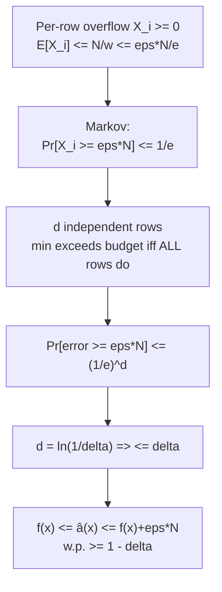

# Count-Min Sketch — Mathematical Foundations and Complexity Theory

> Focus: "Is this provably correct, and is it provably optimal?"

> **One-line summary:** With `w = ceil(e/eps)` and `d = ceil(ln(1/delta))` over pairwise-independent hashes, the Count-Min estimator satisfies `f(x) ≤ â(x)` always and `â(x) ≤ f(x) + eps·‖f‖₁` with probability `≥ 1 - delta`. The upper tail is a one-line **Markov bound** on the per-row collision overflow (whose expectation is `‖f‖₁/w`), boosted to high probability by the **independence of the `d` rows**. The space `O((1/eps)·log(1/delta))` is essentially **optimal** for this guarantee, and the **conservative update** preserves the one-sided bound while provably never increasing any estimate.

---

## Table of Contents

1. [Formal Definition](#formal-definition)
2. [Correctness: The No-Undercount Invariant](#correctness-the-no-undercount-invariant)
3. [The Error-Bound Theorem (Markov on Per-Row Overflow)](#the-error-bound-theorem)
4. [Choosing w and d; the e and ln Constants](#choosing-w-and-d)
5. [Conservative-Update Analysis](#conservative-update-analysis)
6. [Space Optimality and Lower Bounds](#space-optimality-and-lower-bounds)
7. [Count-Min-Mean and Count Sketch: Bias and Variance](#count-min-mean-and-count-sketch)
8. [Comparison of Guarantees](#comparison-of-guarantees)
9. [Summary](#summary)

---

## Notation and Models

```text
Symbols used throughout:
  U          universe of items
  f          frequency vector, f(x) = true count (weight) of x
  N = ||f||_1  total mass = sum of all weights = stream length (unit weights)
  d, w       grid depth (rows) and width (columns)
  h_1..h_d   the d row hash functions, h_i : U -> {0,...,w-1}
  C          d x w counter matrix
  â(x)       the Count-Min estimate (min over rows)
  X_i(x)     per-row overflow = C[i][h_i(x)] - f(x) >= 0  (collision noise)
  eps, delta accuracy and failure-probability parameters
```

We work in the **cash-register model** (non-negative updates) unless a section explicitly invokes the **turnstile model** (signed updates). All probabilities are over the random choice of the hash functions from a pairwise-independent family — *not* over the input, which is adversarial-but-oblivious (the adversary does not see the hash seeds). The distinction matters: against a seed-aware adversary the bounds can be defeated (see Space Optimality).

---

## Formal Definition

```text
Let the universe of items be U, and let the stream be a sequence of updates
(i_1, c_1), (i_2, c_2), ... with i_t in U and c_t a positive weight (the
"cash-register" / non-negative model). The frequency vector f in R^|U| is

    f(x) = sum of c_t over all t with i_t = x.

Total mass (L1 norm):  ||f||_1 = sum over x of f(x) = sum over t of c_t = N.

A Count-Min Sketch is a tuple (d, w, h_1, ..., h_d, C) where:
  d, w in N,
  each h_i : U -> {0, 1, ..., w-1} drawn from a pairwise-independent family H,
  C is a d x w integer matrix, initialized to 0.

Update(x, c):   for each i in 1..d:  C[i][ h_i(x) ] += c.
Query(x):       return  â(x) = min over i in 1..d of  C[i][ h_i(x) ].

Invariant after any prefix of the stream, for every row i:
    C[i][j] = sum of f(y) over all y with h_i(y) = j.
```

The pairwise-independence requirement is the precise condition the proof needs: for any two distinct `x ≠ y`, `Pr[h_i(x) = h_i(y)] = 1/w`. A standard `2`-universal family such as `h(x) = ((a·x + b) mod p) mod w` (with `p` prime `> |U|`, `a ∈ {1..p-1}`, `b ∈ {0..p-1}`) suffices — no full independence, no cryptographic hashing.

---

## Correctness: The No-Undercount Invariant

```text
Claim (no undercount): For every item x and after every prefix, â(x) >= f(x).

Invariant I: For every row i, C[i][ h_i(x) ] >= f(x).

Proof of I.
  Fix x and a row i; let j = h_i(x). By the cell invariant,
      C[i][j] = sum over y : h_i(y) = j of f(y).
  Since x itself satisfies h_i(x) = j, the term f(x) appears in that sum, and
  every other term f(y) >= 0 (non-negative model). Therefore
      C[i][j] = f(x) + (sum over y != x : h_i(y) = j of f(y)) >= f(x).
  This holds for every row i.

Conclusion.
      â(x) = min over i of C[i][ h_i(x) ] >= f(x),
  because the minimum of values each >= f(x) is itself >= f(x).  QED.
```

Define the **per-row overflow** (collision noise) in row `i`:

```text
    X_i(x) = C[i][ h_i(x) ] - f(x) = sum over y != x : h_i(y) = h_i(x) of f(y)  >= 0.
```

Then `â(x) = f(x) + min_i X_i(x)`. The estimator is exact iff some row is collision-clean for `x` (`min_i X_i = 0`), and otherwise overshoots by the smallest overflow. **All** of the error analysis is an analysis of `min_i X_i(x)`.

---

## The Error-Bound Theorem

```text
Theorem (Count-Min error). Fix x. With w = ceil(e/eps) and d = ceil(ln(1/delta))
over independent pairwise-independent rows,

    Pr[ â(x) > f(x) + eps * ||f||_1 ]  <=  delta.

Equivalently, with probability >= 1 - delta:   f(x) <= â(x) <= f(x) + eps * N.
```

### Step 1 — Bound the expected per-row overflow (linearity + pairwise independence)

For a fixed row `i`, introduce an indicator `Z_{i,y} = 1` iff `y` collides with `x` in row `i`, i.e. `h_i(y) = h_i(x)`, for each `y ≠ x`. By pairwise independence:

```text
    E[ Z_{i,y} ] = Pr[ h_i(y) = h_i(x) ] = 1/w.
```

The overflow is `X_i(x) = sum_{y != x} f(y) · Z_{i,y}`. By linearity of expectation:

```text
    E[ X_i(x) ] = sum_{y != x} f(y) · (1/w)
                = (||f||_1 - f(x)) / w
                <= ||f||_1 / w  =  N / w.
```

Substituting `w = ceil(e/eps) >= e/eps`:

```text
    E[ X_i(x) ]  <=  N / w  <=  N · eps / e  =  (eps · N) / e.
```

### Step 2 — Markov's inequality on one row

`X_i(x) >= 0`, so Markov applies. The event "row `i` overshoots the budget" is `{X_i(x) >= eps·N}`:

```text
    Pr[ X_i(x) >= eps·N ]  <=  E[X_i(x)] / (eps·N)  <=  ((eps·N)/e) / (eps·N)  =  1/e.
```

So **each individual row** fails the budget with probability at most `1/e ≈ 0.3679`. This is the crux: the magic constant `e` in `w = e/eps` is chosen precisely so that the Markov bound for one row comes out to exactly `1/e`.

### Step 3 — Independence of the rows amplifies confidence

The `d` rows use independent hash functions, so the overflows `X_1(x), ..., X_d(x)` are independent. The Count-Min estimator exceeds the budget **only if every row** does (the min exceeds `eps·N` iff all `d` cells do):

```text
    Pr[ â(x) - f(x) >= eps·N ]
      = Pr[ min_i X_i(x) >= eps·N ]
      = Pr[ for all i : X_i(x) >= eps·N ]
      = prod_{i=1..d} Pr[ X_i(x) >= eps·N ]      (independence)
      <= (1/e)^d.
```

With `d = ceil(ln(1/delta))`:

```text
    (1/e)^d  <=  (1/e)^{ln(1/delta)}  =  e^{-ln(1/delta)}  =  delta.
```

Combining with the always-true lower bound (`â(x) >= f(x)`):

```text
    Pr[ f(x) <= â(x) <= f(x) + eps·N ]  >=  1 - delta.   QED.
```

The proof structure is worth memorizing: **Markov on one row → `1/e` per row → `d` independent rows → `(1/e)^d ≤ delta`.** Width buys a small per-row failure probability; depth exponentiates it down.



---

## Choosing w and d

The two parameters are decoupled because they control orthogonal quantities:

| Parameter | Formula | Controls | Tail driver | Scaling |
|-----------|---------|----------|-------------|---------|
| **`w`** (width) | `ceil(e/eps)` | the **magnitude** of the additive error `eps·N` | `E[X_i] ≤ N/w` | `Θ(1/eps)` — linear in precision |
| **`d`** (depth) | `ceil(ln(1/delta))` | the **probability** the bound fails | `(1/e)^d` | `Θ(log(1/delta))` — log in confidence |

Total counters: `d·w = Θ((1/eps)·log(1/delta))`. The `e` is the optimal Markov constant (it minimizes `w` for a per-row failure of `1/e`); the `ln` is exactly the exponent needed to drive `(1/e)^d` to `delta`. Any base would work for depth — `e` is just the natural choice that makes the algebra `(1/e)^d = delta ⟺ d = ln(1/delta)` clean.

**Relative vs absolute error.** The bound is *absolute* in `‖f‖₁ = N`: every key inherits the same `eps·N` slack. For a key with `f(x) = Θ(N)` (a heavy hitter) this is small relative error; for a tail key with `f(x) = O(1)` it can dwarf the true value. CMS is therefore an **L₁ guarantee**, well-suited to heavy hitters and poorly suited to faithfully ranking the tail — a structural fact, not an implementation detail.

---

## Conservative-Update Analysis

The conservative update (a.k.a. minimal increment) processes `Update(x, c)` as:

```text
    m = â(x) = min_i C[i][h_i(x)]        (estimate BEFORE this update)
    for each row i:  C[i][h_i(x)] = max( C[i][h_i(x)], m + c ).
```

**Lemma (still no undercount).** After a conservative update, `C[i][h_i(x)] ≥ f(x) + c` for all rows `i`, where `f` now includes this update. *Proof:* before the update `C[i][h_i(x)] ≥ f_old(x)` (by the invariant) and the new value is `max(C[i][h_i(x)], m+c)`. Since `m = min_i C[i][h_i(x)] ≥ f_old(x)`, we have `m + c ≥ f_old(x) + c = f_new(x)`. The `max` is therefore `≥ f_new(x)`. So the no-undercount invariant `â(x) ≥ f(x)` is preserved.

**Lemma (dominance / never worse).** Let `C^plain` and `C^cons` be the matrices after the same update sequence under plain and conservative updates. Then `C^cons[i][j] ≤ C^plain[i][j]` for every cell, hence `â^cons(x) ≤ â^plain(x)` for every `x`. *Proof sketch:* by induction on updates. Plain always sets `C[i][h_i(x)] += c`; conservative raises to `max(C, m+c)`. Since `m + c ≤ C^plain[i][h_i(x)]_after` (the plain cell received the full `+c` over a value at least as large by the induction hypothesis), conservative never produces a larger cell. Therefore each estimate is `≤` the plain estimate. Combined with the previous lemma, conservative update is **sandwiched**: `f(x) ≤ â^cons(x) ≤ â^plain(x)`.

So conservative update **inherits the one-sided guarantee** (`â^cons ≥ f`) while **provably never increasing** any estimate — its error is pointwise no worse than plain CMS, and strictly better whenever it declines to re-inflate an already-tall cell. The exact improvement is data-dependent; on Zipfian streams it is large because elephant cells are repeatedly spared, sharply reducing the noise inflicted on colliding mice. The cost is the loss of additive mergeability: `max` does not distribute over the union of streams, so `â^cons` has no clean distributed-merge analogue (senior level).

---

## Space Optimality and Lower Bounds

```text
Question: is O((1/eps) log(1/delta)) words the best possible for an (eps, delta)
          point-frequency estimator with a one-sided additive ||f||_1 error?

Answer: up to constant/log factors, yes.
```

- **Dependence on `1/eps`.** A communication-complexity reduction from the INDEXING problem shows that any sketch answering point queries to additive error `eps·N` with constant probability must use `Ω((1/eps) log(eps·N))` bits in the worst case. So the `Θ(1/eps)` width is forced — you cannot get `eps·N` error with `o(1/eps)` columns.
- **Dependence on `log(1/delta)`.** To drive the failure probability to `delta` for a worst-case query you need `Ω(log(1/delta))` independent repetitions; fewer rows leaves a constant failure probability. So the `Θ(log(1/delta))` depth is forced.
- **Conclusion.** CMS matches the lower bound up to lower-order factors, making it *space-optimal* for the L₁ point-query guarantee. The Count Sketch achieves an L₂ guarantee (`error ≤ eps·‖f‖₂`, which is much smaller on skewed data) at the same asymptotic space, but with a different (two-sided, unbiased) error profile.

A subtle but important point: the guarantee is per-query and worst-case over the *random hashes*, **not** over an adversary who sees the hashes. Against an adversary who learns the seeds and crafts colliding keys, the bound can be broken — relevant for security-sensitive uses (e.g., algorithmic-complexity DoS). Salting seeds per deployment and keeping them secret restores the guarantee in practice.

---

## Count-Min-Mean and Count Sketch

### Count-Min-Mean (CMM) — de-biasing the min

The plain min is biased high by `E[min_i X_i] > 0`. CMM estimates the per-cell noise and subtracts it. In row `i`, the residual mass outside `x`'s cell is `N - C[i][h_i(x)]`, spread over `w - 1` other columns, so the expected noise in `x`'s cell is `≈ (N - C[i][h_i(x)])/(w-1)`. Define the row residual and take the median:

```text
    r_i(x) = C[i][h_i(x)] - (N - C[i][h_i(x)]) / (w - 1)
    â_CMM(x) = median_i r_i(x),  then clamp to [0, â_CM(x)].
```

The median is robust to the (few) badly polluted rows. CMM has **lower expected error** than CM but loses the strict one-sided guarantee (`â_CMM` may dip below `f(x)`), which is why it is clamped not to exceed the safe min upper bound.

### Count Sketch — unbiased via signed hashes

The **Count Sketch** attaches a second hash `s_i : U → {-1, +1}` per row and updates `C[i][h_i(x)] += s_i(x)·c`. The per-row estimate is `s_i(x)·C[i][h_i(x)]`, and the final estimate is the **median** across rows. Collisions now cancel in expectation (a colliding `y` contributes `s_i(x)s_i(y)f(y)`, zero-mean), giving an **unbiased** estimator with variance controlled by `‖f‖₂²/w`. Consequences:

- Error scales with the **L₂ norm** `‖f‖₂`, not `‖f‖₁` — dramatically tighter on skewed data (one elephant dominates `‖f‖₁` but contributes far less to the per-query L₂ noise).
- It is **two-sided** (can over- or under-estimate) and supports **deletions** (negative updates), which plain CMS cannot.

| Estimator | Combine | Error norm | Bias | Deletions | One-sided? |
|-----------|---------|------------|------|-----------|------------|
| Count-Min (min) | minimum | `eps·‖f‖₁` | high (overcount) | no (breaks min) | yes (upper) |
| Count-Min-Mean | median of residuals | lower than CM | low | no | no (clamped) |
| Count Sketch | median of signed cells | `eps·‖f‖₂` | **unbiased** | **yes** | no |

---

## Comparison of Guarantees

| Structure | Guarantee | Error norm / form | Direction | Determinism | Space | Mergeable |
|-----------|-----------|--------------------|-----------|-------------|-------|-----------|
| **Count-Min Sketch** | `f ≤ â ≤ f + eps·‖f‖₁` w.p. `1-δ` | additive, L₁ | over only | randomized | `Θ((1/ε)log(1/δ))` | additive |
| **Count Sketch** | `|â - f| ≤ eps·‖f‖₂` w.p. `1-δ` | additive, L₂ | two-sided, unbiased | randomized | `Θ((1/ε²)log(1/δ))` | additive |
| **Misra-Gries** (`22-rand/08`) | `f - N/k ≤ est ≤ f` | additive, deterministic | under only | deterministic | `Θ(k)` | yes |
| **Space-Saving** (`22-rand/11`) | `f ≤ est ≤ f + N/k` | additive, deterministic | over, bounded | deterministic | `Θ(k)` | yes |
| **Bloom filter** (`02-bloom-filter`) | membership, FP rate `≈ (1-e^{-kn/m})^k` | — | false positive only | randomized | `Θ(n·log(1/ε))` bits | OR |

The unifying lens: every one of these summaries trades exactness for sublinear space by accepting a **single-sided, bounded error** — CMS and Space-Saving overshoot, Misra-Gries undershoots, Bloom false-positives, Count Sketch is the outlier that buys *unbiasedness* and deletions at the price of `1/eps²` space. Choosing among them is choosing which provable one-sided failure your system can tolerate, and whether you pay for the tighter L₂ norm.

---

## A Worked Numeric Instantiation of the Bound

Concreteness cements the proof. Take `eps = 0.01`, `delta = 0.05`, and a stream with `N = 10^6`.

```text
w = ceil(e / eps)      = ceil(2.71828 / 0.01) = ceil(271.83) = 272 columns
d = ceil(ln(1/delta))  = ceil(ln 20)          = ceil(2.996)  = 3 rows
cells = d*w = 816, e.g. ~6.5 KB of 64-bit counters.

Budget: eps*N = 0.01 * 10^6 = 10000.

Per-row expected overflow:  E[X_i] <= N/w = 10^6 / 272 ≈ 3676.
Markov per row:             Pr[X_i >= 10000] <= 3676/10000 ≈ 0.368 ≈ 1/e. ✓
Three independent rows:      Pr[min >= 10000] <= (1/e)^3 ≈ 0.0498 <= 0.05 = delta. ✓
```

So with just **816 counters** the estimate of *any* key overshoots its true count by more than 10,000 with probability at most 5%. For a key with true count near `10^6` that is a 1% relative error; for a key with true count 5 it is useless — exactly the L₁ behavior the norm analysis predicts. Tightening `eps` to `0.001` would multiply `w` (and memory) by 10 to shrink the budget to 1,000; adding one row (`d = 4`) would cut the failure probability to `(1/e)^4 ≈ 1.8%`.

---

## Expectation and Variance of the Estimator

Beyond the tail bound, the *expected* error of the min is itself informative.

```text
Per row, E[X_i] = (||f||_1 - f(x)) / w =: mu.   Let F = ||f||_1 - f(x).

The estimator error is E_err = min_i X_i, where the X_i are i.i.d. (across rows)
nonnegative with mean mu. For nonnegative i.i.d. variables the minimum has
expectation strictly below any single mean and decreasing in d:

    E[min_i X_i] <= mu = F/w,    and    E[min_i X_i] -> ess inf X  as d -> infinity.

Bias:      E[â(x)] - f(x) = E[min_i X_i] >= 0   (always nonnegative — overcount).
Monotone:  adding a row can only LOWER the min, so E[error] is nonincreasing in d.
```

This formalizes two intuitions: (i) the estimator is **biased high** but the bias is bounded by the single-row mean `F/w`, and (ii) **more rows never hurt** the expected estimate — the min over `d+1` rows is `≤` the min over `d`. It also explains why depth past a point gives diminishing returns: once some row is collision-clean (`X_i = 0`), additional rows cannot lower the min below 0, so the error is already at its floor. Width, by contrast, lowers `mu` for *every* row and so keeps paying off.

---

## The Turnstile Model and Why Plain CMS Forbids Deletions

```text
Stream models:
  Cash-register: updates (x, c) with c > 0 only.            <- plain CMS is valid.
  Turnstile:     updates (x, c) with c possibly negative.   <- plain CMS BREAKS.
  Strict turnstile: turnstile with the invariant f(x) >= 0 always.
```

In the cash-register model every cell is monotone nondecreasing, so the cell invariant `C[i][h_i(x)] = f(x) + (nonneg noise)` holds and the min is a valid upper bound. Allow a negative update (a deletion `c < 0`) and the argument collapses: a colliding key's *deletion* can drag `x`'s cell **below** `f(x)`, so the min is no longer an upper bound — it can undercount. Worse, the proof used `noise_i ≥ 0`, which deletions violate.

```text
Claim: plain Count-Min's no-undercount guarantee fails under turnstile updates.
Counterexample sketch:
  Suppose x and y collide in EVERY row (rare but possible). Insert x once (all
  x-cells = 1). Insert then delete y many times around x: a delete of y decrements
  the shared cells, possibly to 0 while f(x) = 1. Then â(x) = 0 < 1 = f(x). QED.
```

The fix is the **Count Sketch**: signed updates `C[i][h_i(x)] += s_i(x)·c` with `s_i : U → {±1}`. Now a deletion is just a negative `c`, the per-row estimate `s_i(x)·C[i][h_i(x)]` is unbiased (colliding terms have mean zero by the random sign), and the **median** across rows is robust. Count Sketch is valid in the **strict turnstile** model and gives an `L₂` error `eps·‖f‖₂` — strictly stronger than CMS's `L₁` on skewed data — at the cost of `Θ(1/eps²)` width. The decision rule: **deletions or L₂ accuracy → Count Sketch; insert-only with an L₁ upper bound → Count-Min.**

---

## Inner-Product (Join-Size) Estimation — Proof

CMS estimates not just point frequencies but **inner products** `f · g = Σ_x f(x)g(x)` of two frequency vectors (the size of an equi-join on the key, or stream similarity).

```text
Given CMS A (over f) and B (over g) with identical d, w, and hashes, define for
each row i:    P_i = sum over columns j of  A[i][j] * B[i][j].
Estimate:      (f · g)^  = min over i of P_i.

Claim: f·g <= P_i  for every row i  (so the min is still an upper bound, in the
       non-negative model).

Proof.  P_i = sum_j (sum_{x: h_i(x)=j} f(x)) (sum_{y: h_i(y)=j} g(y))
            = sum_{x,y : h_i(x)=h_i(y)} f(x) g(y)
            = sum_x f(x)g(x)  +  sum_{x != y : h_i(x)=h_i(y)} f(x)g(y).
The first term is exactly f·g; the second (cross-collision) term is >= 0 in the
non-negative model.  Hence P_i >= f·g for every i, and min_i P_i >= f·g.  QED.

Error: E[cross term] = (1/w) sum_{x != y} f(x)g(y) <= ||f||_1 ||g||_1 / w,
so with w = e/eps the join-size overshoot is <= eps ||f||_1 ||g||_1 w.p. ~1-delta.
```

The point-query bound is the special case `g = e_x` (the indicator of one key), recovering `â(x) = f·e_x ≤ f(x) + eps·‖f‖₁`. This generality — one structure, point queries *and* join sizes *and* (via dyadic decomposition) range queries — is why CMS is a foundational streaming primitive rather than a single-purpose counter.

---

## Constructing the Pairwise-Independent Hash Family

The proof relied on `Pr[h_i(x) = h_i(y)] = 1/w` for `x ≠ y`. We exhibit a family achieving it with `O(1)` words of seed per row and `O(1)` evaluation time.

```text
Let p be a prime with p > |U| (the universe). For a, b drawn uniformly with
a in {1,...,p-1}, b in {0,...,p-1}, define

    g_{a,b}(x) = (a*x + b) mod p,      h(x) = g_{a,b}(x) mod w.

Claim (2-universality of g): for x != y,
    Pr[ g_{a,b}(x) = g_{a,b}(y) ] = 0,   and more usefully, the pair
    (g(x), g(y)) is uniform over the p(p-1) ordered distinct pairs.

Proof.  Fix x != y. The map (a,b) -> (g(x), g(y)) given by
    g(x) = a*x + b,  g(y) = a*y + b   (mod p)
has determinant (x - y) != 0 mod p (p prime, x != y in Z_p), so it is a bijection
from (a,b) in Z_p x Z_p* onto ordered pairs (u,v) with u != v. Hence (g(x),g(y))
is uniform over distinct pairs.

Collision after the final mod w:
    Pr[ h(x) = h(y) ] = Pr[ g(x) ≡ g(y) (mod w) ]
                      = (number of distinct (u,v) with u ≡ v mod w) / (p(p-1)).
For p >> w this is at most 1/w (each residue class mod w holds ~p/w of the p
values; a uniform distinct pair lands in the same class w.p. <= 1/w).  QED.
```

So `h(x) = ((a·x + b) mod p) mod w` gives the `Pr[collision] ≤ 1/w` the bound needs, using two machine words `(a, b)` per row and a multiply-add-mod per evaluation. The `d` rows draw independent `(a_i, b_i)`, making the rows mutually independent — the second ingredient the `(1/e)^d` step required. Cryptographic hashing is unnecessary; this 2-universal family is provably sufficient and faster.

---

## Deferred (One-Sided) Error and the Role of the Min

A subtle structural fact distinguishes CMS from a single hashed counter: the error is **deferred to a min**, which is why a *single* clean row suffices for an exact answer.

```text
Define the "clean-row" event for x:  C(x) = { exists i : X_i(x) = 0 }.
On C(x), â(x) = f(x) exactly (the min hits the clean cell).

Pr[ NOT C(x) ] = Pr[ every row has a collision with some y, weighted ]
              <= prod_i Pr[X_i(x) > 0].
For the purely combinatorial (unweighted-collision) view with m-1 other DISTINCT
keys: Pr[X_i > 0] <= 1 - (1 - 1/w)^{m-1}.  Across d independent rows this is
raised to the d-th power, so the probability of NO clean row decays geometrically
in d once w exceeds the active-key count.
```

This explains the empirically common case where CMS is **exact** for the heavy hitters: an elephant key tends to find a row where it does not share its cell with another elephant, and on that row the min is exact. The bound `eps·N` is a worst-case ceiling; for the keys that matter most on skewed data, the realized error is frequently zero. The min is doing *deferred decision-making* — it postpones committing to an answer until it has seen the least-corrupted of `d` independent attempts.

---

## Space: CMS vs Count Sketch Derivation

Why does CMS cost `Θ((1/eps)log(1/delta))` while Count Sketch costs `Θ((1/eps²)log(1/delta))`? The difference is the **norm of the noise** each controls.

```text
Count-Min (min, L1):
  Per-row noise mean = ||f||_1 / w.  To make it <= eps*||f||_1 we need w = Θ(1/eps).
  Markov gives per-row failure 1/e; d = Θ(log(1/delta)) rows for confidence.
  Total: Θ((1/eps) log(1/delta)).

Count Sketch (median of signed cells, L2):
  Signed updates make per-row estimate unbiased; its VARIANCE = ||f||_2^2 / w.
  Chebyshev needs Var <= (eps*||f||_2)^2, i.e. ||f||_2^2/w <= eps^2 ||f||_2^2,
  giving w = Θ(1/eps^2).  Median of d = Θ(log(1/delta)) rows boosts confidence.
  Total: Θ((1/eps^2) log(1/delta)).
```

The trade is explicit: Count Sketch's *unbiasedness* lets you bound the much smaller `‖f‖₂` instead of `‖f‖₁`, but Chebyshev on a variance needs `1/eps²` width where Markov on a nonnegative mean needed only `1/eps`. On heavily skewed data `‖f‖₂ ≪ ‖f‖₁`, so Count Sketch's tighter norm can win despite the worse `eps` dependence — but for a coarse `eps` and insert-only streams, CMS's linear `1/eps` and one-sided simplicity dominate. This is the precise statement of "which norm, which space" that a professional answer must contain.

| Sketch | Combine | Controls | Concentration tool | Width | One-sided |
|--------|---------|----------|--------------------|-------|-----------|
| Count-Min | min | `‖f‖₁` noise mean | Markov (mean) | `Θ(1/eps)` | yes |
| Count Sketch | median | `‖f‖₂` noise variance | Chebyshev (variance) | `Θ(1/eps²)` | no |

---

## Streaming Cost Model and Update/Query Complexity

```text
Cash-register stream of length m (number of updates), universe U, grid d x w.

Per-update work:   d hash evaluations + d cell increments = Theta(d).
Per-query work:    d hash evaluations + d reads + min = Theta(d).
Total over stream: Theta(m * d) time, Theta(d * w) space.

With d = ln(1/delta), w = e/eps:
    time/op   = Theta(log(1/delta))
    space     = Theta((1/eps) log(1/delta))   words
              = Theta((1/eps) log(1/delta) * log m) bits (counters up to m).
```

Two facts a professional must state precisely:

1. **No dependence on `|U|` or distinct-count.** Unlike an exact dictionary (`Θ(distinct)` space), CMS space is a function only of the *accuracy parameters*. This is the formal sense in which it is a *sublinear-space* algorithm — space `o(|U|)`, often `O(polylog)` of it.
2. **Worst-case, not amortized, per-op cost.** Every update touches exactly `d` cells; there is no rare expensive operation to amortize (contrast a dynamic array's resize). The `Θ(d)` bound is deterministic and worst-case, which is why CMS is attractive for hard real-time line-rate ingest.

The only quantity that grows with stream length is the *value* in the counters (and hence the absolute error `eps·m`), bounded by `log m` bits per cell. Time and space are flat in `m`.

---

## Guarantee Comparison: A Proof for Space-Saving

To make the "which direction does it err" comparison rigorous, contrast CMS's *over*count proof with **Space-Saving**, the deterministic *over*counting summary it is most often weighed against.

```text
Space-Saving keeps k (key, count) pairs. On item x:
  - if x is monitored: count(x) += 1
  - else: let (y, min) be the smallest-count entry; replace y with x,
          set count(x) = min + 1  (x "inherits" the evicted minimum).

Claim 1 (overcount): for every monitored x,  f(x) <= count(x).
  The inherited min was an upper bound on every entry's *error*, and increments
  are real; a monitored key's count never drops, so it never falls below f(x).

Claim 2 (bounded overcount): count(x) - f(x) <= min_entry <= N/k.
  The error a key inherits is at most the current minimum count, and the sum of
  all k counts equals N, so the minimum is <= N/k. Hence every overcount <= N/k.

Corollary: an item with f(x) > N/k is necessarily monitored (it cannot have been
  evicted, since eviction targets the minimum <= N/k < f(x)). So Space-Saving has
  NO false negatives for the (1/k)-heavy hitters, deterministically.
```

| Property | Count-Min Sketch | Space-Saving |
|----------|------------------|--------------|
| Direction | overcount | overcount |
| Bound | `eps·‖f‖₁`, w.p. `1-δ` (randomized) | `N/k`, **deterministic** |
| Space | `Θ((1/eps)log(1/δ))` | `Θ(k)` |
| Point query for *any* key | **yes** | only monitored keys |
| Enumerate heavy hitters | needs a heap | **built-in, ranked** |
| Mergeable | additive | yes (with care) |

The structural insight: both overcount, but CMS pays randomized hash-collision noise to answer *arbitrary* point queries, while Space-Saving pays a deterministic `N/k` slack to *enumerate and rank* the top-`k`. They are dual tools for the same skewed-stream problem — CMS is a frequency *oracle*, Space-Saving a heavy-hitter *index*. Misra-Gries is the mirror image of Space-Saving that *under*counts; pairing the CMS overcount with a Misra-Gries undercount even brackets the true value from both sides.

### Bracketing the true value (a two-sided estimate from two one-sided sketches)

```text
Run, on the same stream:
  CMS (overcount):       f(x) <= â_CM(x) <= f(x) + eps*N    (w.p. 1-delta)
  Misra-Gries (under):   f(x) - N/k <= est_MG(x) <= f(x)    (deterministic)

Then for any x:
  est_MG(x) <= f(x) <= â_CM(x),
so [est_MG(x), â_CM(x)] is a (mostly) valid CONFIDENCE INTERVAL bracketing the
true count, of width <= (eps*N) + (N/k). If the two estimates agree, f(x) is
pinned exactly; if they diverge, the gap quantifies the uncertainty.
```

This is a genuinely useful systems trick: the two cheap one-sided summaries together give a two-sided guarantee no single one provides. Width shrinks by raising both `w` (tightens `eps·N`) and `k` (tightens `N/k`). The interval is exact precisely when some CMS row is collision-clean *and* Misra-Gries did not cancel any of `x`'s occurrences — common for true heavy hitters on skewed data, which is exactly where pinning the count matters most.

One caveat to state explicitly: the CMS upper end holds only *with probability* `1 - delta`, while the Misra-Gries lower end is deterministic, so the bracket is a high-probability (not certain) interval — its failure probability is inherited entirely from the randomized CMS side.

---

## Summary

The Count-Min Sketch is one of the cleanest probabilistic data structures to analyze. Correctness (no undercount) is a one-line consequence of the non-negative cell invariant: every cell holds `f(x)` plus nonnegative collision noise, so the min is `≥ f(x)` always. The error bound is a textbook two-stage argument: **Markov** on the per-row overflow (expectation `≤ N/w ≤ eps·N/e`, giving failure `≤ 1/e` per row) times **independence** across the `d` rows (`(1/e)^d ≤ delta` when `d = ln(1/delta)`), yielding `â(x) ≤ f(x) + eps·N` with probability `1 - delta`. The constants `e` and `ln` are exactly what make the two halves snap together. The space `Θ((1/eps)log(1/delta))` is **optimal** for this L₁ point-query guarantee. The **conservative update** is provably sandwiched between `f(x)` and the plain estimate — never undercounts, never worse than plain — at the cost of mergeability, while **Count-Min-Mean** and the **Count Sketch** trade the strict one-sided bound for lower bias and (for Count Sketch) an `L₂` guarantee plus deletions. Knowing *which* one-sided error each summary commits, and at what space, is the whole engineering decision.

---

## Next step: [interview.md](./interview.md) — tiered Q&A across all four levels plus a runnable coding challenge in Go, Java, and Python.
