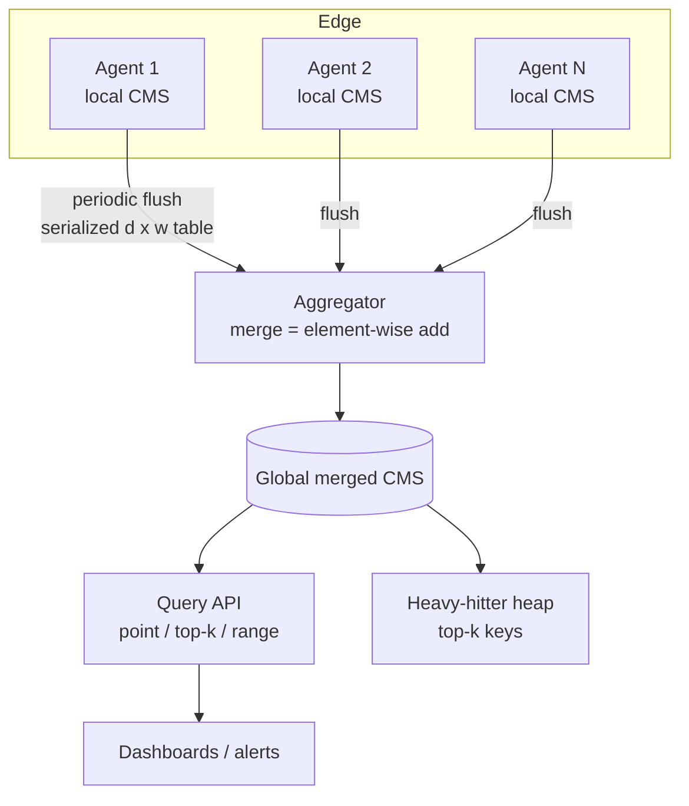
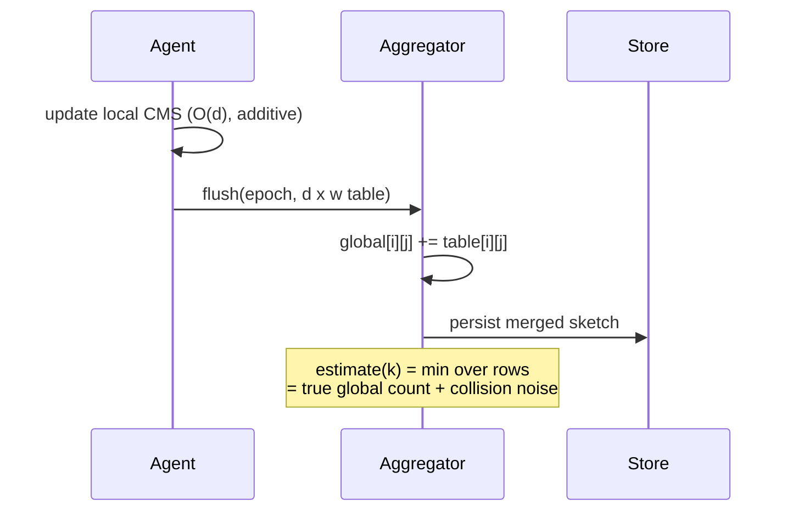
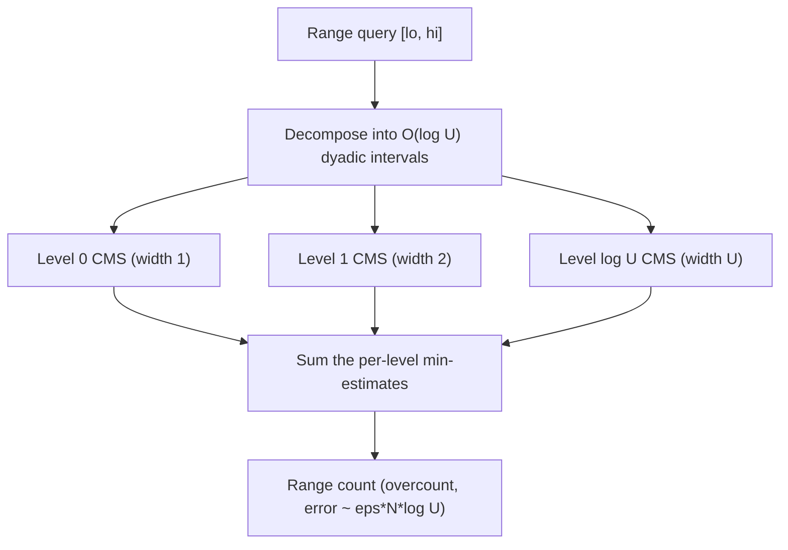

# Count-Min Sketch — Senior Level

> Focus: "How do I architect stream-monitoring systems around a Count-Min Sketch?"

> **One-line summary:** At system scale the Count-Min Sketch stops being a data structure and becomes a *protocol*: thousands of agents each keep a local same-shaped sketch, ship it to an aggregator, and the aggregator **merges by element-wise addition** to reconstruct global frequencies — exactly as if one machine had seen the whole stream. Senior decisions are about budgeting the `d × w` grid against memory and accuracy on **skewed** traffic, keeping `N` bounded with **windowing/decay**, choosing additive vs conservative updates (mergeability vs accuracy), and extending point queries to **range and quantile** queries via a hierarchy of sketches.

---

## Table of Contents

1. [Introduction](#introduction)
2. [System Design with Count-Min Sketch](#system-design-with-count-min-sketch)
3. [Distributed & Mergeable Sketches](#distributed--mergeable-sketches)
4. [Comparison with Alternatives](#comparison-with-alternatives)
5. [Memory vs Accuracy on Skewed Data](#memory-vs-accuracy-on-skewed-data)
6. [Windowing, Decay & Range/Quantile Queries](#windowing-decay--rangequantile-queries)
7. [Architecture Patterns](#architecture-patterns)
8. [Code Examples](#code-examples)
9. [Observability](#observability)
10. [Failure Modes](#failure-modes)
11. [Summary](#summary)

---

## Introduction

Senior engineers reach for a Count-Min Sketch when an exact counter would either not fit in memory or not fit in the latency budget. The defining scenarios:

- **Network telemetry:** per-flow / per-IP / per-port byte and packet counts on a 100 Gbps link, where the distinct-flow count is in the hundreds of millions and you have microseconds per packet.
- **Per-key rate limiting and hot-key detection:** finding the keys hammering a cache or shard before they cause a hot partition.
- **NLP / search:** n-gram and term frequencies over web-scale corpora, where the vocabulary is unbounded.
- **DB query optimization:** per-value frequency statistics the planner uses to estimate selectivity and choose join orders, kept tiny and refreshed continuously.
- **Trending / analytics:** approximate top-`k` over a sliding window across a fleet of edge nodes.

The senior-level questions are not "how does the min work" but: *How do I split the work across machines and recombine it? How big a grid for my traffic shape and SLA? How do I stop the error from growing forever on an infinite stream? What happens when a hash is bad, a node lags, or a single elephant flow dominates?* Mergeability — the fact that two same-shaped sketches add — is the property that makes all of the distributed answers possible.

---

## Design Forces at System Scale

Before the architecture, name the forces a senior engineer is balancing. CMS is chosen when several of these point the same way:

| Force | How CMS responds |
|-------|------------------|
| **Unbounded / huge key space** | Fixed `d·w` memory regardless of distinct count — the decisive win. |
| **Line-rate ingest** | `O(d)` per event, no coordination, lock-free per-shard updates. |
| **Strict memory budget** | A few hundred KB answers per-key frequency for *any* stream size. |
| **Horizontal scale** | Mergeability lets you add agents, not bigger boxes. |
| **Tolerable error direction** | Overcount-only — safe for *protective* decisions (guards, throttles). |
| **Approximate is acceptable** | The SLA is "within `eps·N`," not exact. |

If instead you need exact counts, the *list* of heavy keys without querying, deletions, or tail accuracy, CMS is the wrong tool (see the Alternatives Deep-Dive below).

---

## System Design with Count-Min Sketch



The architecture is a classic *map-then-merge*:

- **Map (edge):** each agent maintains its own CMS with **identical `d`, `w`, and hash functions**. It updates locally at line rate — `O(d)` per event, no coordination, no locks across machines.
- **Flush:** on an interval (or a size trigger), the agent serializes its `d × w` table (often just a flat array of `uint32`/`uint64`) and ships it to the aggregator, then optionally resets.
- **Merge (aggregator):** the aggregator sums the incoming tables element-wise into a global sketch. The merged sketch answers global point queries; a companion heap tracks global heavy hitters.

Because the per-event work is constant and local, this scales horizontally to arbitrary event rates — you add agents, not bigger machines.

---

## Distributed & Mergeable Sketches

**The merge theorem (informal):** if `A` and `B` are CMS built with the same `d`, `w`, and hash functions, then `A ⊕ B` defined by `(A ⊕ B)[i][j] = A[i][j] + B[i][j]` is *exactly* the sketch you would have obtained by streaming `A`'s and `B`'s inputs through one sketch. Hence the merged estimate equals the estimate of the union of the two streams — same overcount-only guarantee, same `eps·N` bound (now with `N = N_A + N_B`).

Practical consequences:

- **Commutative & associative:** merge order does not matter; you can fan-in in a tree across racks, regions, then globally.
- **Idempotency caution:** merging is *additive*, so merging the same agent's table twice double-counts. Flush with sequence numbers / epochs and de-duplicate.
- **Schema lock:** every agent must agree on `(d, w, seed)`. A config rollout that changes any of them must be epoch-fenced; mixing shapes makes merges meaningless.
- **Conservative update breaks merge:** the `max`-based conservative update is *not* additive — `max(A,B)` does not reconstruct the union. In a distributed pipeline use **plain additive** updates at the edge; apply conservative update only inside a single-node sketch.

| Update mode | Per-node accuracy | Mergeable across nodes | Use in distributed pipeline |
|-------------|-------------------|------------------------|------------------------------|
| Plain additive | baseline | **Yes** (sum) | **Yes** — the standard choice |
| Conservative (minimal increment) | higher | **No** | Single-node only |



---

## Comparison with Alternatives

At system scale, the choice between probabilistic frequency structures is driven by throughput, memory budget, the error direction your SLA tolerates, and whether you need point queries or just a top-`k` list.

| Attribute | Count-Min Sketch | Space-Saving (`22-rand/11`) | Exact hash map | HyperLogLog (`09-hyperloglog`) |
|-----------|------------------|------------------------------|----------------|--------------------------------|
| Answers | per-key frequency (any key) | top-`k` keys + counts | exact per-key frequency | *distinct count* (cardinality) |
| Error | overcount `≤ eps·N` | overcount, bounded | none | ~1.04/√m relative |
| Memory | `O((1/eps)·ln(1/delta))`, fixed | `O(k)` | `O(distinct)` | `O(m)` registers, tiny |
| Per-event time | `O(d)` | `O(1)` | `O(1)` | `O(1)` |
| Mergeable | Yes (additive) | Yes | Yes (rehash) | Yes (per-register max) |
| Distributed-friendly | **Excellent** | Good | Poor (memory) | Excellent |
| Production usage | Redis (`CMS.*`), network monitors, Druid/Spark approx | top-`k` services | small key spaces | unique counting everywhere |

**Choose CMS** when you need a *mergeable frequency oracle* answering arbitrary point queries with bounded over-error. **Choose Space-Saving** when you only need the ranked top-`k`. **Choose HyperLogLog** when the question is *how many distinct* items, not how often each one. They are complementary: many pipelines run a CMS (frequencies) *and* a HyperLogLog (cardinality) side by side on the same stream.

---

## Memory vs Accuracy on Skewed Data

Real streams are almost never uniform — they are **heavy-tailed (Zipfian)**: a few elephant keys dominate, a long tail of mice appear once or twice. This shape is both the challenge and the opportunity for CMS.

- **The challenge:** the elephants inflate every cell they touch. A mouse that happens to collide with an elephant inherits a huge overcount. The absolute error `eps·N` is the same for everyone, but for a mouse with true count 3, an overcount of `eps·N = 50` is catastrophic *relative* error, while for an elephant with true count 5 million it is noise.
- **The opportunity:** because only a handful of elephants exist, **conservative update** is hugely effective — it stops re-inflating already-tall cells, so mice that share a cell with an elephant pay far less. On Zipfian data, conservative update commonly reduces average error several-fold for the same grid.

Budgeting rules of thumb for skewed traffic:

| Lever | Effect | When to pull it |
|-------|--------|-----------------|
| Increase `w` | Linearly shrinks per-row collision noise (`~N/w`) | Tail accuracy matters; you can spend memory |
| Increase `d` | Exponentially shrinks failure probability, modest error help | You need higher confidence, not more precision |
| Conservative update | Cuts bias on skewed data | Single-node, no merge, accuracy-critical |
| Separate "elephant" path | Track the top few keys *exactly* (heap), sketch the rest | A handful of keys carry most of the mass |
| Count-Min-Mean / Count Sketch | De-bias low-frequency estimates | Mouse accuracy matters more than a strict upper bound |

A common production pattern: **exact top-`k` heap for the elephants + CMS for the tail**. The heap answers the dominant keys precisely; the sketch handles the unbounded tail cheaply. Queries first check the heap, then fall back to the sketch.

---

## Windowing, Decay & Range/Quantile Queries

### Keeping `N` bounded

On an infinite stream, `N` grows forever, so the absolute error `eps·N` grows forever. Three standard fixes:

1. **Tumbling windows:** keep one sketch per fixed time bucket (e.g. per minute). To answer "last hour," merge the last 60 sketches (mergeability again). Old buckets are dropped wholesale.
2. **Sliding windows:** a ring of sub-sketches; advance by retiring the oldest and starting a fresh one. Smoother than tumbling, more memory.
3. **Exponential decay:** periodically multiply all cells by a factor `γ < 1` (e.g. 0.99 per interval). Recent events dominate; old mass fades. Decay keeps `N` effectively bounded at `~1/(1-γ)` of the per-interval volume. (Decay is not additively mergeable in the naive form; apply it on the merged sketch, or decay synchronized epochs.)

### Range and quantile queries via a dyadic hierarchy

Plain CMS answers *point* queries on categorical keys. For *ordered* keys (timestamps, numeric values) you often want **range queries** ("count of items in `[lo, hi]`") or **quantiles**. The standard trick is a **dyadic (hierarchical) set of sketches**:

- Build `log U` levels of CMS over a value domain of size `U`. Level 0 counts individual values; level 1 counts pairs of values (each "dyadic interval" of width 2); level `j` counts intervals of width `2^j`.
- Any range `[lo, hi]` decomposes into `O(log U)` dyadic intervals. Sum the (min-)estimates of those `O(log U)` cells, one per level, to estimate the range count.
- Quantiles follow by binary-searching the prefix sums (range `[0, x]`) for the value where the cumulative count crosses the target fraction.



The cost: error accumulates across the `O(log U)` summed cells, so the effective bound is roughly `eps·N·log U`; size `eps` accordingly. This dyadic technique is the bridge from CMS to approximate quantiles (compare `22-randomized-algorithms/09-t-digest-quantiles` for a different, more accurate quantile approach).

---

## Architecture Patterns

```mermaid
sequenceDiagram
    participant Client
    participant Service
    participant CMS as CMS (hot-key guard)
    participant Cache
    participant DB
    Client->>Service: request(key)
    Service->>CMS: add(key, 1); est = estimate(key)
    alt est > hot threshold
        Service->>Cache: serve from cache / coalesce (hot key)
        Cache-->>Client: value
    else normal key
        Service->>DB: fetch(key)
        DB-->>Service: value
        Service-->>Client: value
    end
```

**Hot-key guard:** every request updates a CMS keyed by the resource; if the live estimate crosses a threshold, the service treats the key as hot — coalesces duplicate in-flight loads, pins it in cache, or sheds load — preventing a single hot key from melting a shard. The sketch's overcount-only error is *safe* here: it may flag a borderline key as hot one event early, never miss a genuinely hot one.

Other common patterns:
- **Approximate selectivity for the query planner:** a continuously refreshed CMS over column values gives per-value frequency estimates the optimizer uses to order joins and choose index vs scan.
- **DDoS / anomaly detection:** per-source CMS over packet streams; a source whose estimate spikes above baseline is throttled.
- **Streaming joins / dedup hints:** CMS gives a cheap "how many times have we seen this join key" signal to size buffers.

---

## Code Examples

### Thread-safe sketch + mergeable serialization

#### Go

```go
package main

import (
	"sync"
)

type ConcurrentCMS struct {
	mu   sync.RWMutex
	d, w int
	t    [][]uint64
}

func NewConcurrent(d, w int) *ConcurrentCMS {
	t := make([][]uint64, d)
	for i := range t {
		t[i] = make([]uint64, w)
	}
	return &ConcurrentCMS{d: d, w: w, t: t}
}

func (c *ConcurrentCMS) Add(cols []int, cnt uint64) {
	c.mu.Lock()
	defer c.mu.Unlock()
	for i, col := range cols {
		c.t[i][col] += cnt
	}
}

func (c *ConcurrentCMS) Estimate(cols []int) uint64 {
	c.mu.RLock()
	defer c.mu.RUnlock()
	min := ^uint64(0)
	for i, col := range cols {
		if c.t[i][col] < min {
			min = c.t[i][col]
		}
	}
	return min
}

// Merge adds another sketch of identical shape (the mergeability property).
func (c *ConcurrentCMS) Merge(other *ConcurrentCMS) {
	c.mu.Lock()
	defer c.mu.Unlock()
	other.mu.RLock()
	defer other.mu.RUnlock()
	for i := 0; i < c.d; i++ {
		for j := 0; j < c.w; j++ {
			c.t[i][j] += other.t[i][j]
		}
	}
}
```

#### Java

```java
import java.util.concurrent.locks.ReentrantReadWriteLock;

public class ConcurrentCMS {
    private final ReentrantReadWriteLock lock = new ReentrantReadWriteLock();
    private final int d, w;
    private final long[][] t;

    public ConcurrentCMS(int d, int w) { this.d = d; this.w = w; this.t = new long[d][w]; }

    public void add(int[] cols, long c) {
        lock.writeLock().lock();
        try { for (int i = 0; i < d; i++) t[i][cols[i]] += c; }
        finally { lock.writeLock().unlock(); }
    }

    public long estimate(int[] cols) {
        lock.readLock().lock();
        try {
            long min = Long.MAX_VALUE;
            for (int i = 0; i < d; i++) min = Math.min(min, t[i][cols[i]]);
            return min;
        } finally { lock.readLock().unlock(); }
    }

    // Merge another identically-shaped sketch (mergeability).
    public void merge(ConcurrentCMS o) {
        lock.writeLock().lock();
        try {
            for (int i = 0; i < d; i++)
                for (int j = 0; j < w; j++)
                    t[i][j] += o.t[i][j];
        } finally { lock.writeLock().unlock(); }
    }
}
```

#### Python

```python
import threading


class ConcurrentCMS:
    def __init__(self, d, w):
        self._lock = threading.RLock()
        self.d, self.w = d, w
        self.t = [[0] * w for _ in range(d)]

    def add(self, cols, c=1):
        with self._lock:
            for i, col in enumerate(cols):
                self.t[i][col] += c

    def estimate(self, cols):
        with self._lock:
            return min(self.t[i][cols[i]] for i in range(self.d))

    def merge(self, other):
        """Add another identically-shaped sketch (mergeability)."""
        with self._lock:
            for i in range(self.d):
                for j in range(self.w):
                    self.t[i][j] += other.t[i][j]

    def decay(self, gamma=0.99):
        """Exponential decay to keep N bounded on infinite streams."""
        with self._lock:
            for i in range(self.d):
                for j in range(self.w):
                    self.t[i][j] = int(self.t[i][j] * gamma)
```

**What it does:** a lock-guarded sketch with a `merge` for distributed fan-in and a `decay` for unbounded streams. In Go you would typically shard the lock or use per-goroutine sketches merged periodically to avoid contention at line rate.

### Lock-free path: per-shard sketches

A single mutex is a bottleneck at line rate. The standard production layout is **per-worker (or per-shard) sketches** with no shared state on the hot path, merged on a timer:

```text
N producer goroutines/threads, each owns a private CMS (no locks on update).
A background collector every T ms:
    snapshot = new zeroed CMS
    for each worker sketch s:  snapshot.merge(s); s.reset()   # or double-buffer
    publish snapshot as the current global view
```

Because merge is additive and order-independent, the published snapshot equals a single sketch over all events in the window. This trades a small staleness (up to `T`) for lock-free updates — exactly the throughput/consistency knob a senior engineer is expected to reason about. Double-buffering (two sketches per worker, swap-and-drain) avoids resetting a sketch that is concurrently being updated.

---

## Capacity Planning Worked Example

Suppose you must estimate **per-source-IP request counts** on a service handling **2 million requests/second**, want any estimate accurate to within **0.05% of the per-minute volume**, with **99.9% confidence**, and a **1-minute window**.

1. **Per-window volume:** `N = 2e6 × 60 = 1.2e8` requests/minute.
2. **Absolute error budget:** `eps·N = 0.0005 × 1.2e8 = 60000`. So an estimate may overshoot by up to 60k requests — fine for an IP doing millions, meaningless to flag a quiet IP. (If you need to resolve *small* sources, tighten `eps`.)
3. **Width:** `w = ceil(e/eps) = ceil(2.718/0.0005) = 5437`.
4. **Depth:** `d = ceil(ln(1/0.001)) = ceil(6.91) = 7`.
5. **Memory:** `d·w = 7 × 5437 = 38059` counters × 8 bytes = **~297 KB per window sketch**.
6. **Windows kept:** for a sliding hour you keep ~60 such sketches ≈ **18 MB** — trivial, versus an exact per-IP map that on hundreds of millions of distinct IPs would need many gigabytes.

| Quantity | Value | Formula |
|----------|-------|---------|
| `N` per window | 120,000,000 | rate × window |
| `eps` | 0.0005 | chosen |
| `delta` | 0.001 | chosen |
| `w` | 5,437 | `ceil(e/eps)` |
| `d` | 7 | `ceil(ln(1/delta))` |
| cells | 38,059 | `d·w` |
| memory/window | ~297 KB | cells × 8 B |
| update cost | 7 ops | `O(d)` |

The senior insight: the memory is set by `eps` and `delta`, **not** by the 2M req/s rate or the distinct-IP count. Doubling traffic costs *zero* extra memory — only the absolute error `eps·N` doubles. That decoupling of memory from data volume is the entire reason CMS is deployed at this scale.

---

## Case Study: Redis CMS and a Hot-Key Pipeline

Redis ships a Count-Min Sketch (`CMS.INITBYPROB key error probability`, `CMS.INCRBY`, `CMS.QUERY`, `CMS.MERGE`) precisely matching the model here: `INITBYPROB` takes `eps` and `delta` and sizes the grid; `INCRBY` does weighted updates; `QUERY` returns the min; `MERGE` sums same-shaped sketches. A typical hot-key pipeline:

```text
Edge nodes:   CMS.INCRBY local:keys <reqkey> 1     # local, fast
Every 5s:     ship local sketch -> aggregator
Aggregator:   CMS.MERGE global local_1 local_2 ... # additive merge
Dashboard:    CMS.QUERY global <reqkey>            # live estimate, overcount-safe
Guard:        if estimate > hot_threshold -> coalesce/pin/shed
```

The overcount-only error is *safe* for a guard: the worst case is flagging a borderline-hot key slightly early, never failing to notice a genuinely hot key. That asymmetry — the error always points toward *more caution* — is why CMS is the right structure for protective guards, where a missed hot key (a false *negative*) would be the dangerous failure and a CMS structurally cannot produce one.

---

## Point vs Range Queries: Choosing the Right CMS Layout

| Query type | Layout | Cost | Error | Notes |
|------------|--------|------|-------|-------|
| Point (one categorical key) | single CMS | `O(d)` | `eps·N` | the default; IPs, words, IDs |
| Top-`k` heavy hitters | CMS + min-heap | `O(d)` per update | `eps·N` per estimate | heap holds candidate keys |
| Range over ordered keys | dyadic hierarchy (`log U` CMS) | `O(d·log U)` | `~eps·N·log U` | timestamps, numeric buckets |
| Quantile | dyadic + binary search on prefix sums | `O(d·log²U)` | accumulates over levels | compare t-digest for accuracy |
| Inner product / join size | two CMS, dot-product rows | `O(d·w)` | `eps·‖f‖₁·‖g‖₁` | estimate `Σ f(x)g(x)` |

The **inner-product** trick is a senior favorite: given two CMS over streams `f` and `g` with identical shape and hashes, the join-size estimate `Σ_x f(x)g(x)` is the **minimum over rows** of the dot product of corresponding rows. This estimates how many records two streams share on a key — useful for sizing streaming joins — without materializing either stream.

---

## Concurrency Trade-offs

| Strategy | Update latency | Throughput under contention | Staleness | When to use |
|----------|----------------|------------------------------|-----------|-------------|
| Single mutex | low (uncontended) | poor (serialized) | none | low event rate, simplicity |
| Sharded locks (cell-range or row) | low | good | none | moderate rate, exact reads |
| Atomic increments per cell | very low | very good | none | numeric cells, hardware atomics |
| Per-worker sketches + periodic merge | lowest (no shared state) | excellent | up to merge interval | line-rate ingest |

The per-worker pattern is almost always the senior choice at scale: it removes the hot path's only shared-state bottleneck, and the periodic additive merge is cheap (`O(d·w)`, a few hundred KB). The cost is bounded staleness — the published global view lags by at most one merge interval. Double-buffering each worker's sketch (update buffer A while the collector drains B, then swap) eliminates the race between update and reset without locking the update path.

---

## Observability

| Metric | Why it matters | Alert threshold |
|--------|----------------|------------------|
| `cms_total_N` | Drives the absolute error `eps·N`; if it grows unbounded, accuracy degrades | Growth rate exceeds window/decay assumptions |
| `cms_estimated_error = eps * N` | The live overcount bound | > the smallest count you must resolve |
| `cms_fill_ratio` (nonzero cells / `d·w`) | Saturation; near 1.0 means heavy collisions | > 0.8 → consider larger `w` |
| `cms_merge_lag` | Time since last successful agent flush/merge | > flush interval × 2 |
| `cms_top_key_share` | Fraction of `N` held by the top key (skew indicator) | informs conservative-update / elephant-path decisions |
| `cms_query_overcount_p99` (vs sampled exact) | Validates the bound in production | > `eps·N` for > `delta` of keys |

Run a **shadow exact counter on a small sampled key set** to continuously verify the overcount stays within `eps·N` — the cheapest way to catch a bad hash or an undersized grid in production.

---

## Serialization, Versioning, and Persistence

A distributed CMS lives or dies on a stable wire format. Senior-level concerns:

- **Flat layout:** serialize the grid as a single contiguous `d·w` array of fixed-width integers (row-major), prefixed by a small header: `magic`, `version`, `d`, `w`, `seed`, `N`, and an `epoch`. A fixed-width flat array is cheap to checksum, mmap, and delta-compress.
- **Schema/version fence:** the header's `(d, w, seed, version)` must match before any merge. Reject or quarantine mismatched flushes — silently merging across a config change corrupts every estimate. Roll out new shapes behind an epoch so old and new sketches never mix.
- **Compression:** on skewed streams most cells are small; varint or zigzag encoding plus a generic compressor shrinks flushes substantially. Conservative-update sketches compress *worse* (more distinct nonzero values) — another reason to use additive updates at the edge.
- **Idempotent flush:** tag each flush with `(agentID, epoch, seq)`. The aggregator de-duplicates so a retried flush is not double-merged (additive merge is *not* idempotent). Lost flushes simply under-count that window — degrade gracefully, alert on gaps.
- **Checkpointing:** the merged global sketch is tiny, so snapshot it frequently to durable storage; on aggregator restart, reload the last checkpoint and resume merging — no need to replay the stream.

| Concern | Risk if ignored | Mitigation |
|---------|-----------------|-----------|
| Schema drift | garbage estimates after a rollout | header version + epoch fence |
| Double merge | overcount on retries | `(agentID, epoch, seq)` de-dup |
| Lost flush | undercount that window | gap detection + alert |
| Endianness | corrupt cross-platform merge | fix byte order in the format |

---

## Alternatives Deep-Dive: When NOT to Reach for CMS

Senior judgment is as much about *rejecting* CMS as deploying it.

- **Small key space (≤ a few million keys):** an exact concurrent hash map fits in memory and gives zero error at comparable speed. Use CMS only when the distinct-key count is genuinely unbounded or huge.
- **You need the *list* of heavy hitters, not point queries:** Space-Saving (`22-rand/11`) or Misra-Gries (`22-rand/08`) directly enumerate the top-`k` in `O(k)` space with deterministic guarantees. CMS needs a bolted-on heap and stores no keys itself.
- **You need accurate *tail* estimates / unbiasedness / deletions:** Count Sketch's L₂ guarantee and signed updates beat CMS's L₁ overcount on skewed tails, at `1/eps²` space.
- **The question is "how many distinct?":** that is cardinality, not frequency — use HyperLogLog (`09-hyperloglog`), which is far smaller for that single question.
- **You need exact quantiles:** t-digest (`22-rand/09`) gives much tighter quantile accuracy than a dyadic CMS for the same memory.

The mental decision tree: *unbounded keys?* → no → exact map; yes → *need the key list?* → yes → Space-Saving/Misra-Gries; no → *deletions or tail accuracy?* → yes → Count Sketch; no → **Count-Min Sketch**.

---

## Failure Modes

- **Undersized grid (collision storm):** `w` too small for `N` → estimates uselessly high. *Fix:* recompute `w` from the real `eps`/`N`; alert on `fill_ratio`.
- **Unbounded `N`:** infinite stream → ever-growing absolute error. *Fix:* windowing or decay.
- **Bad / non-independent hashes:** rows collide identically → depth gives no benefit. *Fix:* independent seeds or double-hashing with `b` coprime to `w`; validate with the shadow counter.
- **Schema drift across agents:** different `(d, w, seed)` → merges are garbage. *Fix:* version the sketch config; epoch-fence rollouts; reject mismatched flushes.
- **Conservative update in a merge pipeline:** non-additive `max` corrupts the merged sketch. *Fix:* additive updates at the edge; conservative only single-node.
- **Elephant flow dominance:** one key inflates the tail. *Fix:* elephant heap + sketch split; conservative update.
- **Double-merge / lost flush:** additive merge double-counts or under-counts on retries. *Fix:* idempotent flushes with epoch sequence numbers.
- **Counter overflow:** 32-bit cells saturate on huge streams. *Fix:* 64-bit cells, or decay.

---

## Production Anti-Patterns

Hard-won lessons that separate a working deployment from a misleading one:

- **Sizing `eps` to `N` instead of to the signal.** If your interesting counts are around `0.5%` of `N` but you set `eps = 1%`, the overcount can exceed the very counts you want to read. Size `eps` to the *smallest count you must resolve*, not to a round number.
- **Forgetting that error grows with `N`.** A sketch sized correctly on day one becomes useless after a month of unbounded accumulation. Always pair a long-lived sketch with windowing or decay.
- **Mixing conservative and additive sketches in one merge.** They are not interchangeable; a single conservative flush poisons an additive merge. Pick one mode per pipeline and enforce it in the wire format.
- **Trusting a single sketch for both heavy and light keys.** Heavy keys are near-exact; light keys drown in `eps·N`. If you need both, run an elephant heap for the heavy keys and read light keys with a caveat (or use Count Sketch).
- **Skipping the shadow counter.** Without a sampled exact comparison you cannot detect a bad hash, an undersized grid, or schema drift until estimates are visibly wrong. Always shadow a small key sample.
- **Reusing one hash across rows "to save CPU."** It silently collapses the sketch to one effective row; depth stops helping and the error bound no longer holds.

---

## Summary

At senior level the Count-Min Sketch is the engine of *distributed stream monitoring*. Its decisive property is **mergeability**: identically-shaped sketches add element-wise, so a fleet of agents can count locally at `O(d)` per event and a tree of aggregators can reconstruct exact global frequencies — same overcount-only guarantee, scaled by horizontal fan-out. The senior job is budgeting the `d × w` grid against memory and SLA on **skewed (Zipfian)** traffic (where conservative update and an elephant heap pay off), keeping `N` bounded with **windowing or decay** so the absolute error `eps·N` does not grow forever, choosing **additive updates** when you must merge (and conservative only single-node), and extending point queries to **range and quantile** answers via a dyadic hierarchy. Pair it with HyperLogLog for cardinality and Space-Saving for ranked top-`k`, watch `fill_ratio`, `N`, and a sampled shadow counter, and the sketch will count web-scale streams in a few kilobytes.

---

## Next step: [professional.md](./professional.md) — the formal error-bound proof (Markov on per-row overflow), space optimality, conservative-update analysis, and a rigorous comparison of guarantees across frequent-item summaries.
