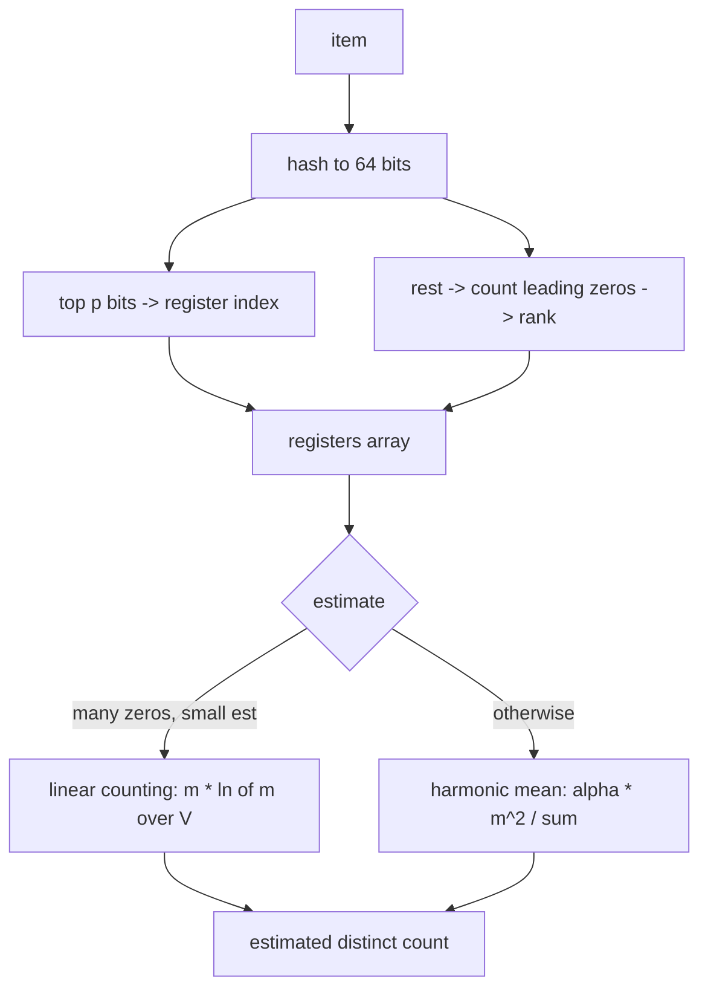

# HyperLogLog — Junior Level

> **One-line summary:** To count how many *distinct* items a stream contains without storing them, hash every item, look at the run of leading zeros in each hash, and remember the **longest** run you have seen. A hash with `k` leading zeros suggests you have seen about `2^k` distinct items — so the longest run is a cheap clue to the cardinality. HyperLogLog splits the hash into many small **registers** to average out the noise, and from those registers estimates the distinct count using only a few **kilobytes** of memory, even for **billions** of items.

---

## Table of Contents

1. [Introduction](#introduction)
2. [Prerequisites](#prerequisites)
3. [Glossary](#glossary)
4. [Core Concepts](#core-concepts)
5. [Big-O Summary](#big-o-summary)
6. [Real-World Analogies](#real-world-analogies)
7. [Pros & Cons](#pros--cons)
8. [Step-by-Step Walkthrough](#step-by-step-walkthrough)
9. [Code Examples](#code-examples)
10. [Coding Patterns](#coding-patterns)
11. [Error Handling](#error-handling)
12. [Performance Tips](#performance-tips)
13. [Best Practices](#best-practices)
14. [Edge Cases & Pitfalls](#edge-cases--pitfalls)
15. [Common Mistakes](#common-mistakes)
16. [Cheat Sheet](#cheat-sheet)
17. [Visual Animation](#visual-animation)
18. [Summary](#summary)
19. [Further Reading](#further-reading)

---

## Introduction

Suppose you run a website and you want to know: *"How many **distinct** visitors did we have today?"* Or you watch a stream of search queries and ask: *"How many **unique** queries were typed?"* These are **cardinality** (distinct-count) questions, and the obvious way to answer them is to keep a `set`:

```python
seen = set()
for item in stream:
    seen.add(item)
answer = len(seen)
```

This is **exact**, but it stores **every distinct item**. If you have 100 million distinct users, and each user id is ~16 bytes, that is ~1.6 GB of memory — just to count them. For *billions* of items, or for *thousands* of separate counters (one per page, per country, per hour), the exact set simply does not fit.

**HyperLogLog (HLL)** answers the same question — *approximately* — in a tiny, **fixed** amount of memory. A standard HLL uses about **12 KB** and estimates the distinct count of anything from zero up to *billions* of items with a typical error of only about **0.8%**. It never stores the items themselves. Instead it keeps a small array of tiny counters (called **registers**) and uses a beautiful piece of probability: the **longest run of leading zeros** seen in the hashes of your items tells you roughly how many distinct items there were.

The core intuition is a coin-flip argument. Flip a fair coin repeatedly; getting `k` heads in a row has probability `1/2^k`. So if you flipped coins for many people and the *longest* streak anyone got was `k` heads in a row, you can guess there were about `2^k` people. A hash function turns each item into a string of random-looking bits, and "leading zeros in the hash" plays the role of "heads in a row." This file builds that whole picture — **hash → leading zeros → registers → estimate** — with a small worked example you can follow by hand.

---

## Prerequisites

Before reading this file you should be comfortable with:

- **Hash functions** — a function that turns any input into a fixed-size, random-looking number (e.g. a 64-bit value). Same input → same hash; different inputs → "spread out" hashes.
- **Binary / bits** — reading a number as a string of 0s and 1s, and counting leading zeros.
- **Arrays** — an array of small integers (the registers).
- **Probability basics** — the idea that a fair coin gives heads with probability `1/2`, and `k` heads in a row has probability `1/2^k`.
- **Big-O notation** — `O(1)`, `O(n)`, and "constant memory."
- **Logarithms (light)** — `log2(x)` answers "2 to what power gives `x`?".

Optional but helpful:

- Familiarity with **sets / hash sets** and why they cost memory proportional to the number of distinct items.
- A glance at **Bloom filters** (a sibling probabilistic structure that answers *membership*, while HLL answers *cardinality*).

---

## Glossary

| Term | Meaning |
|------|---------|
| **Cardinality** | The number of **distinct** elements in a collection (the count of unique items). |
| **Distinct count** | Same as cardinality — how many different values appear, ignoring duplicates. |
| **HyperLogLog (HLL)** | A probabilistic data structure that estimates cardinality in tiny, fixed memory. |
| **Hash function** | A function mapping any item to a fixed-size random-looking number (here, 64 bits). |
| **Register** | One small counter in HLL's array; stores the max "rank" seen for items routed to it. |
| **`m`** | The number of registers, always a power of two: `m = 2^p`. |
| **`p` (precision)** | The number of leading hash bits used to pick a register; `m = 2^p`. Typical `p = 14`. |
| **Rank (ρ)** | `1 +` the number of leading zeros in the part of the hash used for counting. |
| **Leading zeros** | The count of `0` bits at the front of a binary number before the first `1`. |
| **Estimate** | HLL's guess at the cardinality, computed from the registers. |
| **Relative error** | How far the estimate is from the truth, as a fraction (HLL ≈ `1.04/√m`). |
| **Mergeable** | Two HLLs can be combined (register-wise max) to count the union — no re-scan. |
| **Linear counting** | A simpler distinct-count method, used by HLL as a *correction* for small counts. |

---

## Core Concepts

### 1. The exact set — the baseline we want to beat

The exact answer keeps every distinct item in a hash set and returns its size. Memory grows **linearly** with the number of distinct items: `O(n)` where `n` is the cardinality. For small `n` this is perfect — fast, exact, simple. The problem is scale: billions of items, or thousands of separate counters, blow the memory budget. HLL trades a *tiny* amount of accuracy for a *huge* reduction in memory: from `O(n)` down to a fixed handful of kilobytes.

### 2. Hashing turns items into random bits

HLL never looks at the item's value directly. It first hashes the item to a 64-bit number. A good hash spreads inputs uniformly, so the bits look like independent fair coin flips. Crucially, **duplicates hash to the same value** — so adding the same item twice changes nothing. That is exactly why HLL counts *distinct* items: a repeated item produces a hash it has already accounted for.

### 3. Leading zeros estimate "how many items"

Here is the heart of it. In a uniformly random 64-bit hash, the probability that it starts with **at least `k` zeros** is `1/2^k` (each leading bit is 0 with probability `1/2`). So:

- A hash starting with `0...` (≥1 zero) appears about once every `2` items.
- A hash starting with `00...` (≥2 zeros) appears about once every `4` items.
- A hash starting with `k` zeros appears about once every `2^k` items.

Turn it around: if the **maximum** number of leading zeros you have observed is `k`, you have *probably* seen about `2^k` distinct items. The longest leading-zero run is a rough thermometer for cardinality.

### 4. One counter is noisy — use many registers

A single "max leading zeros" estimate is wildly noisy: one unlucky hash with many leading zeros could appear after very few items and fool you. The fix is **averaging across many independent estimates**. HLL uses the **first `p` bits** of each hash to choose one of `m = 2^p` **registers** (think: `m` separate buckets), and uses the **remaining bits** to compute the leading-zero rank for that register. Each register tracks the max rank of the items routed to it. Because items are spread roughly evenly, each register sees about `n/m` items, and combining the `m` registers gives a far more stable estimate.

### 5. The estimate from the registers

Once the registers are filled, HLL combines them. The standard formula multiplies a constant, the squared register count, and the **harmonic mean** of `2^(register value)` across all registers:

```text
estimate = alpha_m * m^2 / ( sum over registers j of 2^(-M[j]) )
```

where `M[j]` is register `j`'s value and `alpha_m` is a small correction constant (≈ 0.7213 for large `m`). The harmonic mean is used (instead of a plain average) because it tames the outliers that a few unusually large registers would otherwise cause. The result is the estimated distinct count.

### 6. Accuracy depends only on the number of registers

The typical relative error of HLL is about:

```text
relative error ≈ 1.04 / sqrt(m)
```

So more registers → less error, at the cost of more memory. With `m = 16384` registers (`p = 14`), the error is about `1.04/128 ≈ 0.81%`, using ~12 KB. Importantly, this error does **not** depend on how many items you count — the same 12 KB gives ~0.8% error whether you have a thousand items or a billion.

### 7. Mergeable: combine HLLs for unions

Two HLLs built with the **same `p` and same hash** can be merged by taking, for each register index, the **maximum** of the two register values. The merged HLL is *exactly* the HLL you would have gotten by feeding both streams into one counter. This makes HLL perfect for distributed counting: each machine keeps its own HLL, and you merge them to get the global distinct count — no need to ship the raw data around. (Subtraction / intersection is **not** directly supported — see `middle.md`.)

---

## Big-O Summary

| Operation | Time | Space | Notes |
|-----------|------|-------|-------|
| Exact set `add` | O(1) avg | **O(n)** | `n` = number of distinct items; memory grows with data. |
| Exact set `count` | O(1) | O(n) | Just the set size. |
| **HLL `add`** | **O(1)** | — | Hash, pick register, update one register's max. |
| **HLL `count` (estimate)** | **O(m)** | — | Scan all `m` registers once to combine. |
| **HLL memory** | — | **O(m)** | Fixed! `m` small counters (e.g. 16384 × 6 bits ≈ 12 KB). |
| **HLL merge (union)** | O(m) | O(m) | Register-wise max of two equal-sized HLLs. |

The headline: HLL's memory is **independent of `n`**. Whether you count a hundred items or ten billion, a 12 KB HLL gives roughly the same ~0.8% error. The exact set, by contrast, needs memory proportional to the number of distinct items.

---

## Real-World Analogies

| Concept | Analogy |
|---------|--------|
| Leading zeros estimate cardinality | Flipping coins: the *longest* run of heads anyone got hints at how many people were flipping. A 10-heads streak suggests ~1024 flippers. |
| Hashing the item | Giving each person a random lottery ticket; the same person always gets the same ticket, so duplicates don't inflate the count. |
| Registers | Splitting the crowd into many rooms by the first digits of their ticket, and tracking each room's best streak separately, then averaging. |
| Harmonic mean of registers | Averaging the rooms' results in a way that ignores one room's freak lucky streak. |
| Fixed memory regardless of count | A car's fuel gauge: one small dial estimates the level whether the tank holds 10 or 10,000 liters. |
| Mergeability (register-wise max) | Each branch office keeps its own "best streak per room" chart; head office combines them by keeping the best of each. |

> Where the analogy breaks: a coin-flip streak is one number and very noisy; HLL's power comes from running **thousands** of these streak-counters (registers) in parallel and combining them carefully. A single streak would give a terrible estimate.

---

## Pros & Cons

| Pros | Cons |
|------|------|
| **Tiny, fixed memory** (~12 KB) for cardinalities into the **billions**. | The answer is an **estimate**, not exact (~0.8% typical error). |
| Memory and error are **independent of `n`** — same 12 KB at any scale. | You cannot list the items, only count them. |
| `add` is **O(1)**; very fast and streaming-friendly. | Small counts need a **correction** (linear counting) or they are biased high. |
| **Mergeable** by register-wise max — ideal for distributed/parallel counting. | **No direct intersection / subtraction** (inclusion-exclusion amplifies error). |
| Tunable accuracy: more registers → less error, predictably (`1.04/√m`). | Requires a **good hash**; a weak hash ruins the estimate. |
| Built into Redis (`PFADD`/`PFCOUNT`), databases, and analytics engines. | Two HLLs must share the **same `p` and hash** to be merged. |

**When to use:** counting distinct users / IPs / queries / events at scale; thousands of separate distinct-counters; distributed "unique" counts that must be merged; any `COUNT DISTINCT` where a ~1% error is acceptable and exactness is too expensive.

**When NOT to use:** when you need the **exact** count (billing, legal); when you must **enumerate** the distinct items; when you need accurate **intersections** of sets; when `n` is small enough that a plain set is trivially cheap.

---

## Step-by-Step Walkthrough

Let us build a tiny HLL by hand with `p = 2`, so `m = 2^2 = 4` registers. We use a toy 8-bit hash for readability (real HLL uses 64 bits). The first `p = 2` bits pick the register (0–3); the remaining 6 bits are scanned for leading zeros, and the **rank** is `1 + (leading zeros)`.

We add four distinct items. Suppose their 8-bit hashes are:

```
item A -> 01 101100   register = 01 = 1,  tail = 101100 -> 0 leading zeros -> rank 1
item B -> 10 001011   register = 10 = 2,  tail = 001011 -> 2 leading zeros -> rank 3
item C -> 01 000110   register = 01 = 1,  tail = 000110 -> 3 leading zeros -> rank 4
item D -> 00 010000   register = 00 = 0,  tail = 010000 -> 1 leading zero  -> rank 2
```

Update each register to the **max** rank routed to it:

| Register `j` | items routed | max rank seen | `M[j]` |
|--------------|--------------|---------------|--------|
| 0 | D (rank 2) | 2 | 2 |
| 1 | A (rank 1), C (rank 4) | max(1,4)=4 | 4 |
| 2 | B (rank 3) | 3 | 3 |
| 3 | (none) | — | 0 |

Now estimate. The harmonic-mean denominator is the sum of `2^(-M[j])`:

```
sum = 2^-2 + 2^-4 + 2^-3 + 2^-0
    = 0.25 + 0.0625 + 0.125 + 1.0
    = 1.4375
```

With `m = 4` and `alpha_4 ≈ 0.5305` (the small-`m` constant):

```
estimate = alpha_m * m^2 / sum
         = 0.5305 * 16 / 1.4375
         ≈ 8.488 / 1.4375
         ≈ 5.9
```

The true count is 4, the raw estimate is ~5.9 — close-ish, but `m = 4` is *far* too few registers for accuracy. Notice register 3 is still `0` (it saw nothing). When many registers are zero (lots of empty buckets relative to items), HLL switches to a **small-range correction** called **linear counting**:

```
linear-count estimate = m * ln(m / V)     where V = number of zero registers
                      = 4 * ln(4 / 1)
                      = 4 * ln(4)
                      ≈ 4 * 1.386
                      ≈ 5.55
```

Still rough at `m = 4`, but this is the whole machine in miniature. With `m = 16384` registers and 64-bit hashes, the same procedure lands within ~0.8% of the truth. The takeaways: **register = first `p` bits**, **rank = 1 + leading zeros of the rest**, **store the max per register**, **combine with the harmonic-mean formula**, and **fall back to linear counting when too many registers are empty**.

---

## Code Examples

### Example: A minimal HyperLogLog

This is a clear, from-scratch HLL with a small-range linear-counting correction. It is meant to teach the mechanics, not to be production-grade (real implementations use bias correction — see `senior.md`). We use a 64-bit hash, take the first `p` bits as the register index, and `1 + leadingZeros` of the remaining bits as the rank.

#### Go

```go
package main

import (
	"fmt"
	"hash/fnv"
	"math"
	"math/bits"
)

type HLL struct {
	p         uint     // precision: m = 2^p registers
	m         uint32   // number of registers
	registers []uint8  // each holds a small rank (max ~ 64)
}

func NewHLL(p uint) *HLL {
	m := uint32(1) << p
	return &HLL{p: p, m: m, registers: make([]uint8, m)}
}

func hash64(s string) uint64 {
	h := fnv.New64a()
	h.Write([]byte(s))
	return h.Sum64()
}

// Add records one item.
func (h *HLL) Add(item string) {
	x := hash64(item)
	idx := x >> (64 - h.p)             // first p bits choose the register
	rest := (x << h.p) | (1 << (h.p - 1)) // remaining bits; sentinel guards all-zero
	rank := uint8(bits.LeadingZeros64(rest)) + 1
	if rank > h.registers[idx] {
		h.registers[idx] = rank        // keep the MAX rank per register
	}
}

// Count returns the estimated cardinality.
func (h *HLL) Count() float64 {
	m := float64(h.m)
	alpha := 0.7213 / (1.0 + 1.079/m) // bias constant for large m
	sum := 0.0
	zeros := 0
	for _, r := range h.registers {
		sum += math.Pow(2.0, -float64(r))
		if r == 0 {
			zeros++
		}
	}
	est := alpha * m * m / sum
	// Small-range correction: linear counting when many registers are empty.
	if est <= 2.5*m && zeros > 0 {
		est = m * math.Log(m/float64(zeros))
	}
	return est
}

func main() {
	h := NewHLL(14) // m = 16384, ~0.8% error
	for i := 0; i < 100000; i++ {
		h.Add(fmt.Sprintf("user-%d", i))
		h.Add(fmt.Sprintf("user-%d", i)) // duplicate -> ignored
	}
	fmt.Printf("true=100000 estimate=%.0f\n", h.Count())
}
```

#### Java

```java
import java.util.zip.CRC32;

public class HLL {
    private final int p;            // precision
    private final int m;            // m = 2^p registers
    private final byte[] registers;

    public HLL(int p) {
        this.p = p;
        this.m = 1 << p;
        this.registers = new byte[m];
    }

    // 64-bit mix hash (FNV-1a style) of a string.
    private static long hash64(String s) {
        long h = 0xcbf29ce484222325L;
        for (int i = 0; i < s.length(); i++) {
            h ^= s.charAt(i);
            h *= 0x100000001b3L;
        }
        return h;
    }

    public void add(String item) {
        long x = hash64(item);
        int idx = (int) (x >>> (64 - p));         // first p bits -> register
        long rest = (x << p) | (1L << (p - 1));    // remaining bits + sentinel
        int rank = Long.numberOfLeadingZeros(rest) + 1;
        if (rank > registers[idx]) registers[idx] = (byte) rank;
    }

    public double count() {
        double mm = m;
        double alpha = 0.7213 / (1.0 + 1.079 / mm);
        double sum = 0.0;
        int zeros = 0;
        for (byte r : registers) {
            sum += Math.pow(2.0, -r);
            if (r == 0) zeros++;
        }
        double est = alpha * mm * mm / sum;
        if (est <= 2.5 * mm && zeros > 0) {        // linear counting fallback
            est = mm * Math.log(mm / zeros);
        }
        return est;
    }

    public static void main(String[] args) {
        HLL h = new HLL(14);
        for (int i = 0; i < 100000; i++) {
            h.add("user-" + i);
            h.add("user-" + i); // duplicate ignored
        }
        System.out.printf("true=100000 estimate=%.0f%n", h.count());
    }
}
```

#### Python

```python
import math


class HLL:
    def __init__(self, p=14):
        self.p = p
        self.m = 1 << p
        self.registers = [0] * self.m

    @staticmethod
    def _hash64(item):
        # FNV-1a 64-bit
        h = 0xcbf29ce484222325
        for b in str(item).encode():
            h ^= b
            h = (h * 0x100000001b3) & 0xFFFFFFFFFFFFFFFF
        return h

    def add(self, item):
        x = self._hash64(item)
        idx = x >> (64 - self.p)                 # first p bits -> register
        rest = ((x << self.p) | (1 << (self.p - 1))) & 0xFFFFFFFFFFFFFFFF
        rank = (64 - rest.bit_length()) + 1      # leading zeros + 1
        if rank > self.registers[idx]:
            self.registers[idx] = rank

    def count(self):
        m = self.m
        alpha = 0.7213 / (1.0 + 1.079 / m)
        s = sum(2.0 ** -r for r in self.registers)
        zeros = self.registers.count(0)
        est = alpha * m * m / s
        if est <= 2.5 * m and zeros > 0:         # linear counting
            est = m * math.log(m / zeros)
        return est


if __name__ == "__main__":
    h = HLL(p=14)
    for i in range(100_000):
        h.add(f"user-{i}")
        h.add(f"user-{i}")  # duplicate ignored
    print(f"true=100000 estimate={h.count():.0f}")
```

**What it does:** hashes each item, routes it to a register by its first `p` bits, stores the max leading-zero rank per register, then combines all registers with the harmonic-mean formula (falling back to linear counting when many registers are empty). Adding a duplicate changes nothing, so the count reflects *distinct* items.
**Run:** `go run main.go` | `javac HLL.java && java HLL` | `python hll.py`

---

## Coding Patterns

### Pattern 1: Hash, then split into register-index and rank

**Intent:** Every HLL `add` does the same three moves: hash, peel off the top `p` bits for the register, count leading zeros of the rest for the rank.

```python
def split(x, p):
    idx = x >> (64 - p)                  # top p bits = register index
    rest = (x << p) & MASK64             # remaining bits
    rank = leading_zeros(rest) + 1       # 1 + run of leading zeros
    return idx, rank
```

### Pattern 2: Store the maximum rank per register

**Intent:** A register only ever increases; `add` is "max-with."

```python
def add(registers, idx, rank):
    if rank > registers[idx]:
        registers[idx] = rank            # idempotent for duplicates
```

### Pattern 3: Estimate with the harmonic-mean formula plus small-range fix

**Intent:** Combine registers; correct for the empty-register regime.



---

## Error Handling

| Error | Cause | Fix |
|-------|-------|-----|
| Estimate is way too high for few items | Used only the harmonic formula; it is biased high at low counts. | Add the **linear-counting** small-range correction when many registers are 0. |
| Register value of 0 always (item ignored) | All-zero "rest" bits gave undefined leading-zero count. | Set a **sentinel bit** so the rank is well defined; reserve register value 0 for "empty." |
| Merge gives nonsense | The two HLLs used different `p` or different hash functions. | Only merge HLLs with the **same `p` and same hash**. |
| Wildly off estimates | Weak / non-uniform hash function (e.g. identity, small modulus). | Use a strong 64-bit hash (FNV-1a, xxHash, MurmurHash). |
| Counts duplicates as distinct | Hashed something that differs per occurrence (timestamp, pointer). | Hash the **identity** of the item (the user id), not per-event noise. |
| Index out of range | Took fewer/more than `p` bits for the register index. | Index must be exactly the top `p` bits: `x >> (64 - p)`. |

---

## Performance Tips

- **Pick `p` for your accuracy budget:** `p = 14` (`m = 16384`, ~12 KB, ~0.8% error) is the common default; smaller `p` saves memory at higher error (`1.04/√m`).
- **`add` is O(1)** — hash, shift, one array write. Keep the hash fast (xxHash/Murmur over a cryptographic hash).
- **Cache the estimate** if you call `count` often; recomputing scans all `m` registers (`O(m)`).
- **Use a 6-bit-per-register packed layout** in production (ranks fit in 6 bits since `64 < 2^6`), giving ~12 KB instead of 16 KB for `m = 16384`.
- **Reuse one hash** for both the register index and the rank — never hash twice.
- **Batch merges** in distributed counting: register-wise max is associative, so merge in any order.

---

## Best Practices

- Always validate your HLL against an **exact set** on small/medium inputs (e.g. up to a few hundred thousand) and check the relative error stays near `1.04/√m`.
- Use a **well-tested 64-bit hash**; never the language's default object hash for cross-process or persisted counters (it may differ between runs).
- Implement and **always include the small-range (linear-counting) correction**; without it, low-cardinality estimates are biased high.
- Reserve **register value 0** for "never updated," and use a sentinel bit so the rank computation is well defined for all hashes.
- For merges, **fix `p` and the hash globally** across all producers so any two HLLs can be combined.
- Document that the result is an **estimate** with a stated error, and that **intersections are not supported** directly.

---

## Edge Cases & Pitfalls

- **Empty HLL** — all registers 0; the estimate must return ~0 (linear counting gives `m·ln(m/m)=0`).
- **One item** — only one register is non-zero; linear counting handles this small regime.
- **All items identical** — they hash to the same value, hit one register, give an estimate near 1. Correct (cardinality is 1).
- **Huge cardinality (near `2^64/m`)** — registers saturate; a large-range correction may be needed (classic HLL), or use 64-bit hashes so saturation is effectively unreachable.
- **All-zero hash tail** — without a sentinel, "leading zeros" is undefined; always guard it.
- **Different `p` on merge** — silently wrong; never merge mismatched precisions.

---

## Common Mistakes

1. **Skipping the small-range correction** — estimates for low cardinality come out biased high; always add linear counting.
2. **Using a weak hash** — a non-uniform hash destroys the leading-zero probability argument and the estimate is garbage.
3. **Hashing per-event noise instead of identity** — counting timestamps or request ids inflates the cardinality far beyond the true distinct-user count.
4. **Reusing register value 0 as a valid rank** — collides with "empty"; ranks should start at 1, and a sentinel keeps them well defined.
5. **Merging incompatible HLLs** — different `p` or hash → the register arrays are not comparable.
6. **Trying to subtract for intersections** — `|A∩B| = |A|+|B|-|A∪B|` with three noisy estimates amplifies error badly; HLL is not built for this.
7. **Expecting exactness** — HLL is approximate by design; if you need the exact count, use a set.

---

## Cheat Sheet

| Question | Tool / Formula | Key idea |
|----------|----------------|----------|
| How many distinct items? | HyperLogLog | hash → register → max rank → estimate |
| Which register for an item? | top `p` bits of hash | `idx = x >> (64 - p)` |
| What rank? | `1 + leading zeros` of the rest | longer zero-run → rarer → more items |
| Combine registers | harmonic mean | `est = alpha_m * m^2 / sum(2^-M[j])` |
| Too many empty registers? | linear counting | `est = m * ln(m / V)`, `V` = zeros |
| How accurate? | `1.04 / sqrt(m)` | `m=16384` → ~0.8% error |
| Count a union of two HLLs | register-wise max | `merged[j] = max(A[j], B[j])` |
| Count an intersection | **not directly** | inclusion-exclusion amplifies error |

Core algorithm:

```
HLL with p bits (m = 2^p registers):
  add(item):
      x   = hash64(item)
      idx = x >> (64 - p)              # top p bits
      r   = 1 + leadingZeros(rest of x)
      registers[idx] = max(registers[idx], r)

  count():
      sum = Σ 2^(-registers[j])
      est = alpha_m * m^2 / sum         # harmonic mean
      if est small and many zeros:
          est = m * ln(m / zeros)       # linear counting
      return est
# memory: O(m), error ≈ 1.04/√m, independent of n
```

---

## Visual Animation

> See [`animation.html`](./animation.html) for an interactive visualization.
>
> The animation demonstrates:
> - Hashing each item into a 64-bit value (shown as bits)
> - Picking a register from the first `p` bits (the prefix)
> - Counting the leading zeros of the rest to get the rank
> - Watching the registers array fill in with max ranks
> - The harmonic-mean estimate updating live versus the true count
> - An error table and an operation log, with Add / Random / Reset controls

---

## Summary

HyperLogLog answers *"how many distinct items?"* in a **tiny, fixed amount of memory** by replacing the exact set (which costs `O(n)`) with a clever probabilistic estimate. It **hashes** each item, uses the first `p` bits to pick one of `m = 2^p` **registers**, and stores the **maximum leading-zero rank** seen per register. Because a hash with `k` leading zeros appears about once per `2^k` items, the registers' ranks encode the cardinality; combining them with the **harmonic-mean formula** (with a **linear-counting** correction when many registers are empty) yields an estimate whose relative error is about **`1.04/√m`** — roughly **0.8% at 12 KB**, independent of how many items you count. HLLs are **mergeable** by register-wise max (great for distributed counting) but cannot do **intersections** directly. The rules never to forget: use a **good hash**, **store the max per register**, **always apply the small-range correction**, and remember the answer is an **estimate**, not exact.

---

## Further Reading

- Flajolet, Fusy, Gandouet, Meunier — *"HyperLogLog: the analysis of a near-optimal cardinality estimation algorithm"* (2007), the original paper.
- Heule, Nunkesser, Hall (Google) — *"HyperLogLog in Practice"* (2013), the HLL++ improvements (bias correction, sparse representation, 64-bit hashing).
- Redis documentation — `PFADD`, `PFCOUNT`, `PFMERGE` (HLL built into Redis, ~12 KB per key).
- Sibling topic `21-advanced-structures/08-bloom-filter` (membership, the complementary probabilistic structure).
- *"Probabilistic Data Structures and Algorithms for Big Data Applications"* (Gakhov) — HLL, Bloom, Count-Min, t-digest.
- Linear counting (Whang, Vander-Zanden, Taylor, 1990) — the small-range method HLL borrows.

---

**Next step:** Continue to [`middle.md`](./middle.md) for *why* the harmonic mean works, the `1.04/√m` error and bias, the small/large-range corrections, mergeability, and HLL versus the exact set and linear counting.
