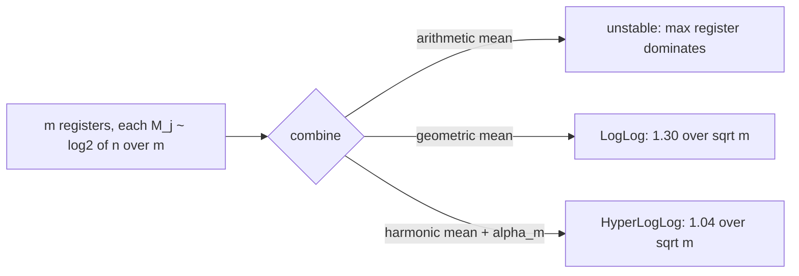
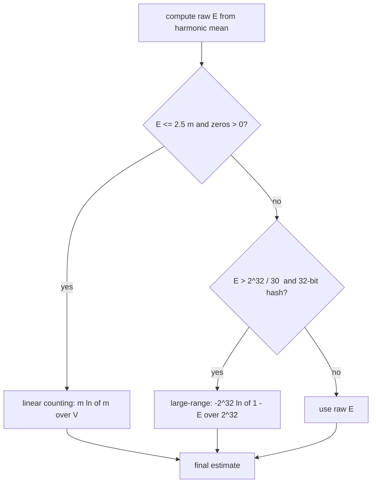
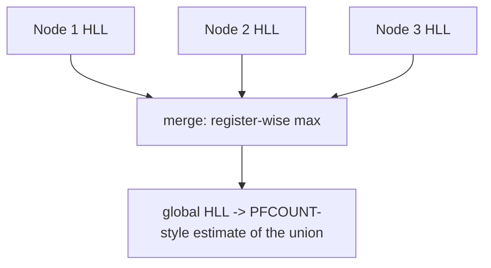

# HyperLogLog — Middle Level

> **Focus:** *Why* HLL works and *when* to choose it. The harmonic-mean rationale, the `alpha_m` bias constant, the relative error `≈ 1.04/√m`, the small-range (linear counting) and large-range corrections, the all-important **mergeability** (register-wise max), and how HLL compares with the exact set, plain LogLog, KMV/bottom-k, and linear counting — including why HLL **cannot** do intersections directly.

---

## Table of Contents

1. [Introduction](#introduction)
2. [Deeper Concepts](#deeper-concepts)
3. [Why the Harmonic Mean](#why-the-harmonic-mean)
4. [Error, Bias, and the Corrections](#error-bias-and-the-corrections)
5. [Comparison with Alternatives](#comparison-with-alternatives)
6. [Mergeability and the Intersection Caveat](#mergeability-and-the-intersection-caveat)
7. [Code Examples](#code-examples)
8. [Error Handling](#error-handling)
9. [Performance Analysis](#performance-analysis)
10. [Best Practices](#best-practices)
11. [Visual Animation](#visual-animation)
12. [Summary](#summary)

---

## Introduction

At junior level the message was the recipe: hash, pick a register from the first `p` bits, store the max leading-zero rank, combine with the harmonic-mean formula, correct for small counts. At middle level you start asking the questions that decide whether your HLL is *accurate*, *efficient*, and *composable*:

- *Why* a **harmonic** mean of the registers, and not the arithmetic mean or the median?
- Where does the `≈ 1.04/√m` error come from, and what is the `alpha_m` constant doing?
- When and why do the **small-range** (linear counting) and **large-range** corrections kick in?
- What exactly makes HLL **mergeable**, and why does that single property make it the default for distributed counting?
- Why can't you just subtract two HLLs to get an intersection?
- When is HLL the right choice over an exact set, plain LogLog, KMV/bottom-`k`, or linear counting alone?

These separate "I copied an HLL snippet" from "I can pick `p` for an error budget, explain the harmonic mean, and reason about merges and corrections."

---

## Deeper Concepts

### The leading-zero observable, restated

For a uniformly random hash bit-string, define `rank = 1 + (number of leading zeros)` of the tail bits. The probability that a single item produces `rank ≥ k` is `2^(-k)`. So among the items routed to one register, the **maximum** rank `M` is an order statistic: `M ≈ log2(n_register)` where `n_register` is the number of distinct items that hit that register. Inverting, `2^M ≈ n_register`. This is the LogLog idea: each register's stored value is roughly `log2` of the items it saw.

### From one register to `m` registers

A single register's `2^M` is an extremely noisy estimator of `n_register` — its standard deviation is comparable to its value. HLL routes each item to one of `m = 2^p` registers using the top `p` hash bits, so each register sees about `n/m` distinct items and stores `M_j ≈ log2(n/m)`. We now have `m` independent noisy estimates of `n/m`. The whole art is **how to combine them** so the noise cancels. Naively averaging `2^{M_j}` (arithmetic mean) is what the original **LogLog** did, but it is dominated by the few registers with freakishly large `M_j`. HLL's key improvement is to combine them with the **harmonic mean** instead.

### The estimator

HLL's estimate is:

```text
                  alpha_m * m^2
estimate  =  ---------------------------
              sum_{j=0}^{m-1} 2^(-M_j)
```

The denominator `Z = Σ 2^(-M_j)` is `m / (harmonic mean of 2^{M_j})`. So `m / Z` is the harmonic mean of the per-register `2^{M_j}` values, and multiplying by `m` (registers) and the bias constant `alpha_m` rescales it to an estimate of the *total* cardinality `n`. The squared `m` appears because each register estimates `n/m`, and there are `m` of them, so `m × (n/m) = n` with a harmonic-mean rescaling that introduces the extra factor.

### The bias constant `alpha_m`

The raw harmonic-mean estimator is biased; `alpha_m` corrects it. Its exact value is an integral, but the practical approximations are:

```text
alpha_16 = 0.673
alpha_32 = 0.697
alpha_64 = 0.709
alpha_m  = 0.7213 / (1 + 1.079/m)     for m >= 128
```

For large `m`, `alpha_m → 0.7213…`. You can treat `alpha_m` as "the constant that makes the harmonic-mean estimator unbiased in the mid-cardinality range."

---

## Why the Harmonic Mean

The harmonic mean is the crux of HLL's accuracy advantage over LogLog. Three ways to see why:

### 1. It suppresses outliers

A register that, by bad luck, saw a hash with many leading zeros has a large `M_j`, hence a large `2^{M_j}`. Under the **arithmetic** mean of `2^{M_j}`, one such register can dominate and inflate the estimate. Under the **harmonic** mean, large values contribute `2^{-M_j} ≈ 0` to the sum `Z` — they are effectively ignored. The harmonic mean is pulled toward the *smaller* values, exactly the robustness we want against the heavy upper tail of the max-of-geometric distribution.

### 2. It matches the estimator's error structure

Flajolet et al. proved that with the harmonic mean and the `alpha_m` correction, the relative standard error of the estimator is `≈ 1.04/√m`, versus `≈ 1.30/√m` for the arithmetic-mean LogLog and `≈ 1.05/√m` for "SuperLogLog" (which discards the largest registers). The harmonic mean gets nearly the best constant *without* discarding any data — it is simpler and just as good.

### 3. Intuition by comparison of means

For positive values, `harmonic ≤ geometric ≤ arithmetic`. The geometric mean is what plain LogLog effectively targets (averaging the `M_j` in the exponent), and the harmonic mean sits just below it, dampening the explosive sensitivity to large `M_j`. A quick numeric illustration: suppose five registers gave `2^{M_j}` values `{8, 8, 8, 8, 1024}` (four typical, one freak large register). Then:

```
arithmetic mean = (8+8+8+8+1024)/5 = 211.2     (dragged up by the outlier)
geometric  mean = (8·8·8·8·1024)^(1/5) ≈ 22.6
harmonic   mean = 5 / (1/8+1/8+1/8+1/8+1/1024) ≈ 9.95   (barely moved by the outlier)
```

The harmonic mean (≈9.95) stays close to the typical value 8, while the arithmetic mean (211) is wrecked by the single large register. That robustness is exactly what HLL needs, because the *largest* register is, by construction, the noisiest. The table:

| Mean of `2^{M_j}` | Estimator | Relative error constant |
|--------------------|-----------|--------------------------|
| Arithmetic | (naive) | worst — dominated by max register |
| Geometric | LogLog | `≈ 1.30/√m` |
| Harmonic (+ `alpha_m`) | **HyperLogLog** | **`≈ 1.04/√m`** |



---

## Error, Bias, and the Corrections

### The headline error

```text
relative standard error  ≈  1.04 / sqrt(m)
```

This is the **standard deviation** of the relative error; actual estimates cluster within ~1 and ~2 of these (so ~68% within `±1.04/√m`, ~95% within `±2.08/√m`). It depends *only* on `m`, never on `n`. The standard tuning table:

| `p` | `m = 2^p` | error `1.04/√m` | memory (6-bit regs) |
|-----|-----------|------------------|----------------------|
| 10 | 1,024 | ~3.25% | ~768 B |
| 12 | 4,096 | ~1.62% | ~3 KB |
| 14 | 16,384 | ~0.81% | ~12 KB |
| 16 | 65,536 | ~0.41% | ~48 KB |
| 18 | 262,144 | ~0.20% | ~192 KB |

`p = 14` is the de-facto default (Redis uses it): 12 KB, ~0.8% error, billions of items.

### Why the raw estimator needs corrections

The harmonic-mean formula is accurate in the **mid range** but biased at the extremes:

- **Small range (low cardinality):** when `n` is small relative to `m`, many registers are still `0` (empty). The raw formula over-estimates. The fix is **linear counting**, which uses the *count of empty registers* directly.
- **Large range (near `2^L/m` for an `L`-bit hash, i.e. register saturation):** with a 32-bit hash the registers can saturate around `n ≈ 2^32`, causing collisions in the hash space; a **large-range correction** un-skews this. With a **64-bit hash** (HLL++), saturation is effectively unreachable for any realistic `n`, so the large-range correction is dropped.

### Small-range correction: linear counting

If a register is empty, *no* item hashed into it. With `m` registers and `n` items distributed uniformly, the expected number of empty registers `V` is `m · e^{-n/m}`. Solve for `n`:

```text
n  =  m * ln(m / V)        (linear counting)
```

The original HLL switches to this when the raw estimate `E ≤ (5/2)·m` and `V > 0`. Linear counting itself becomes inaccurate once registers fill up, which is why HLL only uses it in the low range and hands off to the harmonic-mean estimator above the threshold.

### Large-range correction (classic, 32-bit hash)

For a 32-bit hash, when `E > (1/30)·2^32`, the estimator is corrected with:

```text
E* = -2^32 * ln(1 - E / 2^32)
```

This compensates for hash-value collisions as `n` approaches the hash range. HLL++ removes this entirely by using a 64-bit hash.

### The "raw estimate" decision flow



---

## Comparison with Alternatives

| Method | Memory | Error / Exactness | Mergeable? | Notes |
|--------|--------|--------------------|------------|-------|
| **Exact hash set** | `O(n)` | exact | yes (set union) | Perfect but memory grows with `n`. |
| **Linear counting** | `O(n)`-ish bitmap | tunable; degrades when full | yes (bit-OR) | Great for small/medium `n`; bitmap must be sized to `~n`. |
| **Plain LogLog** | `O(m)` | `≈ 1.30/√m` | yes (reg max) | HLL's predecessor; arithmetic/geometric mean. |
| **SuperLogLog** | `O(m)` | `≈ 1.05/√m` | yes | Discards largest registers; messier. |
| **HyperLogLog** | `O(m)` (fixed) | `≈ 1.04/√m` | **yes (reg max)** | Harmonic mean; the standard. |
| **HLL++** | `O(m)` + sparse | `≈ 1.04/√m`, better low-range | yes | Bias correction + sparse mode (see `senior.md`). |
| **KMV / bottom-`k`** | `O(k)` | `≈ 1/√k` | yes (merge k smallest) | Keeps `k` smallest hashes; supports set ops better. |

**Choose HLL when:** you want the **smallest fixed memory** for huge cardinalities, you need cheap **merges**, and ~1% error is acceptable.
**Choose linear counting when:** `n` is small/medium and roughly known in advance, so you can size the bitmap; it is more accurate than HLL in its sweet spot (HLL borrows it for exactly this range).
**Choose KMV/bottom-`k` when:** you need set operations (unions *and* intersections) with controllable error; KMV supports them more gracefully than HLL.
**Choose an exact set when:** `n` is small, or exactness is required.

### HLL vs exact set, the concrete trade

| | Exact set | HLL (`p=14`) |
|---|-----------|--------------|
| Memory for 1 billion distinct | ~tens of GB | **~12 KB** |
| Error | 0 | ~0.8% |
| `add` | O(1), grows memory | O(1), fixed memory |
| Enumerate items | yes | no |
| Merge two counters | union (cost ∝ sizes) | register-max (O(m)) |
| Intersection | exact | not directly |

### Why not LogLog or linear counting alone?

LogLog uses a less robust mean (`1.30/√m` error). Linear counting needs a bitmap sized to the cardinality — fine when `n` is small and known, but it does **not** have HLL's fixed-memory-at-any-scale property. HLL deliberately **combines both**: linear counting for the low range, harmonic-mean LogLog for the rest, getting the best of each.

---

## Mergeability and the Intersection Caveat

### Why HLL merges trivially

Each register `M_j` holds the **maximum** rank of all items that hashed to register `j`. The max operation is **associative, commutative, and idempotent**. So if HLL `A` saw stream `S_A` and HLL `B` saw stream `S_B` (same `p`, same hash), then:

```text
merged[j] = max(A[j], B[j])   for every j
```

is *exactly* the HLL you would get by feeding `S_A ∪ S_B` into a single counter. This is because a register's max over the union is the max of the two per-stream maxes. Three consequences:

1. **Distributed counting:** each node keeps a local HLL; merging them gives the global distinct count without shipping raw data.
2. **Roll-ups:** hourly HLLs merge into a daily HLL; daily into monthly — counting "uniques over the period" by `OR`-ing registers, with no double-counting of repeats across periods.
3. **Order independence:** merge in any order, in parallel; the result is identical (great for MapReduce / Spark aggregations).



### Why intersection is NOT directly supported

There is **no** register operation that yields `|A ∩ B|`. Register-min, register-and, etc. do not correspond to the intersection's cardinality, because a register's value reflects the *deepest* item that hit it, not *which* items are shared. The only route is **inclusion-exclusion**:

```text
|A ∩ B|  =  |A| + |B| - |A ∪ B|
```

You can estimate `|A|`, `|B|` (from the two HLLs) and `|A ∪ B|` (from the merged HLL). But each of the three estimates carries ~`1.04/√m` relative error, and the subtraction **amplifies** it: when the intersection is much smaller than the sets, you are subtracting two large, noisy numbers to get a small one, so the *relative* error of the result can explode (it is bounded by the absolute errors of the operands divided by the small intersection). For small or moderate overlaps this is unreliable. Practical advice:

- For intersections, prefer **KMV/bottom-`k`** (it supports `min`-merge intersections) or **MinHash** (designed for Jaccard/overlap), or keep exact structures for the sets whose overlap you care about.
- Use HLL inclusion-exclusion **only** when the intersection is a large fraction of the sets, and report it with a wide error band.

| Operation | HLL support | Mechanism | Caveat |
|-----------|-------------|-----------|--------|
| Union | **direct** | register-wise max | exact w.r.t. merged stream |
| Cardinality | direct | the estimator | `1.04/√m` error |
| Intersection | indirect | inclusion-exclusion | error amplified; avoid for small overlaps |
| Difference | indirect | inclusion-exclusion | same amplification problem |

### A concrete intersection failure

Suppose `|A| = |B| = 1,000,000` and the true `|A∩B| = 10,000` (1% overlap). With `p = 14` (error ~0.8%), each estimate carries ~±8,000 absolute error:

```
|A|     ≈ 1,000,000 ± 8,000
|B|     ≈ 1,000,000 ± 8,000
|A∪B|   ≈ 1,990,000 ± 16,000
|A∩B| = |A| + |B| - |A∪B| ≈ 10,000 ± 24,000  (errors add in quadrature/worst case)
```

The estimate is `10,000` but the error band (~±14,000–24,000) **dwarfs** the answer — it could plausibly read anywhere from negative to 30,000. The intersection is *smaller* than the noise in the operands. This is why HLL inclusion-exclusion is unusable for small overlaps; for the same sets with 80% overlap the answer (800,000) is large relative to the noise and the estimate is fine. Rule of thumb: only trust HLL intersections when `|A∩B|` is a large fraction of `|A|` and `|B|`.

---

## Code Examples

### HLL with merge, plus exact-set validation

This version adds a `Merge` and tracks the empty-register count efficiently. The accompanying check compares against an exact set so you can *see* the `1.04/√m` error.

#### Go

```go
package main

import (
	"fmt"
	"hash/fnv"
	"math"
	"math/bits"
)

type HLL struct {
	p    uint
	m    uint32
	reg  []uint8
}

func New(p uint) *HLL { return &HLL{p: p, m: 1 << p, reg: make([]uint8, 1<<p)} }

func h64(s string) uint64 { h := fnv.New64a(); h.Write([]byte(s)); return h.Sum64() }

func (h *HLL) Add(s string) {
	x := h64(s)
	idx := x >> (64 - h.p)
	rest := (x << h.p) | (1 << (h.p - 1))
	r := uint8(bits.LeadingZeros64(rest)) + 1
	if r > h.reg[idx] {
		h.reg[idx] = r
	}
}

// Merge folds another HLL (same p) into this one via register-wise max.
func (h *HLL) Merge(o *HLL) {
	for j := range h.reg {
		if o.reg[j] > h.reg[j] {
			h.reg[j] = o.reg[j]
		}
	}
}

func (h *HLL) Count() float64 {
	m := float64(h.m)
	alpha := 0.7213 / (1.0 + 1.079/m)
	sum, zeros := 0.0, 0
	for _, r := range h.reg {
		sum += math.Pow(2, -float64(r))
		if r == 0 {
			zeros++
		}
	}
	est := alpha * m * m / sum
	if est <= 2.5*m && zeros > 0 {
		est = m * math.Log(m/float64(zeros)) // linear counting
	}
	return est
}

func main() {
	a, b := New(14), New(14)
	for i := 0; i < 60000; i++ {
		a.Add(fmt.Sprintf("x-%d", i))
	}
	for i := 40000; i < 100000; i++ { // overlaps a on [40000,60000)
		b.Add(fmt.Sprintf("x-%d", i))
	}
	a.Merge(b) // union has 100000 distinct
	fmt.Printf("union true=100000 estimate=%.0f\n", a.Count())
}
```

#### Java

```java
public class HLLMerge {
    final int p, m;
    final byte[] reg;

    HLLMerge(int p) { this.p = p; this.m = 1 << p; this.reg = new byte[m]; }

    static long h64(String s) {
        long h = 0xcbf29ce484222325L;
        for (int i = 0; i < s.length(); i++) { h ^= s.charAt(i); h *= 0x100000001b3L; }
        return h;
    }

    void add(String s) {
        long x = h64(s);
        int idx = (int) (x >>> (64 - p));
        long rest = (x << p) | (1L << (p - 1));
        int r = Long.numberOfLeadingZeros(rest) + 1;
        if (r > reg[idx]) reg[idx] = (byte) r;
    }

    void merge(HLLMerge o) {                 // register-wise max
        for (int j = 0; j < m; j++) if (o.reg[j] > reg[j]) reg[j] = o.reg[j];
    }

    double count() {
        double mm = m, alpha = 0.7213 / (1.0 + 1.079 / mm), sum = 0;
        int zeros = 0;
        for (byte r : reg) { sum += Math.pow(2, -r); if (r == 0) zeros++; }
        double est = alpha * mm * mm / sum;
        if (est <= 2.5 * mm && zeros > 0) est = mm * Math.log(mm / zeros);
        return est;
    }

    public static void main(String[] args) {
        HLLMerge a = new HLLMerge(14), b = new HLLMerge(14);
        for (int i = 0; i < 60000; i++) a.add("x-" + i);
        for (int i = 40000; i < 100000; i++) b.add("x-" + i);
        a.merge(b);
        System.out.printf("union true=100000 estimate=%.0f%n", a.count());
    }
}
```

#### Python

```python
import math


class HLL:
    def __init__(self, p=14):
        self.p, self.m = p, 1 << p
        self.reg = bytearray(self.m)

    @staticmethod
    def _h(s):
        h = 0xcbf29ce484222325
        for b in str(s).encode():
            h = ((h ^ b) * 0x100000001b3) & 0xFFFFFFFFFFFFFFFF
        return h

    def add(self, s):
        x = self._h(s)
        idx = x >> (64 - self.p)
        rest = ((x << self.p) | (1 << (self.p - 1))) & 0xFFFFFFFFFFFFFFFF
        r = (64 - rest.bit_length()) + 1
        if r > self.reg[idx]:
            self.reg[idx] = r

    def merge(self, other):                  # register-wise max
        self.reg = bytearray(max(a, b) for a, b in zip(self.reg, other.reg))

    def count(self):
        m = self.m
        alpha = 0.7213 / (1.0 + 1.079 / m)
        s = sum(2.0 ** -r for r in self.reg)
        zeros = self.reg.count(0)
        est = alpha * m * m / s
        if est <= 2.5 * m and zeros > 0:
            est = m * math.log(m / zeros)
        return est


if __name__ == "__main__":
    a, b = HLL(14), HLL(14)
    for i in range(60_000):
        a.add(f"x-{i}")
    for i in range(40_000, 100_000):
        b.add(f"x-{i}")
    a.merge(b)
    print(f"union true=100000 estimate={a.count():.0f}")
```

The merge produces exactly the HLL of the union stream, so `count()` after `merge` estimates `|A ∪ B|` with the same `1.04/√m` error — no double-counting of the overlapping `[40000, 60000)` ids.

---

## Error Handling

| Scenario | What goes wrong | Correct approach |
|----------|-----------------|------------------|
| Low-cardinality over-estimate | raw harmonic formula is biased high | apply **linear counting** when `E ≤ 2.5m` and zeros `> 0` |
| Estimate flat-tops near hash range | 32-bit hash saturates registers | use a **64-bit hash** (HLL++) or apply the large-range correction |
| Merge yields wrong union | mismatched `p` or hash function | enforce same `p` and same hash across all producers |
| Intersection wildly off | inclusion-exclusion amplifies error | use KMV/MinHash or accept only large-overlap cases |
| Estimate drifts between runs | non-deterministic hash (per-process seed) | fix the hash seed; persist `p` and hash identity |
| Skewed estimate | weak/biased hash, non-uniform top bits | use a hash with good avalanche (xxHash, Murmur) |

---

## Performance Analysis

`add` is O(1): one hash, one shift, one compare-and-store. `count` is O(m): a single pass over the registers. `merge` is O(m). Memory is O(m), fixed:

| `p` | `m` | dense memory (6-bit) | error | typical use |
|-----|-----|----------------------|-------|-------------|
| 11 | 2,048 | ~1.5 KB | ~2.3% | tight memory, rough counts |
| 14 | 16,384 | ~12 KB | ~0.8% | **default** (Redis) |
| 16 | 65,536 | ~48 KB | ~0.4% | high accuracy |

```python
import time, random

def bench(p, n):
    h = HLL(p)
    start = time.perf_counter()
    for i in range(n):
        h.add(random.random())
    add_t = time.perf_counter() - start
    start = time.perf_counter()
    est = h.count()
    return add_t, time.perf_counter() - start, est

# add is ~constant per item; count is one O(m) pass regardless of n.
```

Constant-factor wins: a **fast hash** (the hash usually dominates `add`), a **packed 6-bit register layout** (cache-friendlier, 4× smaller than a byte array), and **caching the estimate** between `count` calls if registers have not changed. For very low cardinality, the **sparse representation** (HLL++) stores only the non-empty registers, using far less than the full dense array — covered in `senior.md`.

The error is *not* a performance knob you can cheat: it is fixed by `m` (`1.04/√m`). To halve the error you must **quadruple** `m` (and thus the memory). This square-root law is fundamental — it is provably near the information-theoretic optimum for the memory used.

---

## Best Practices

- **Pick `p` from an error budget:** `error ≈ 1.04/√(2^p)`. Default `p = 14` (~0.8%, 12 KB); go higher only if you truly need sub-0.5% accuracy.
- **Always include the small-range (linear-counting) correction**; without it low counts are biased high.
- **Use a 64-bit hash** so the large-range correction is unnecessary and registers never saturate in practice.
- **Standardize `p` and the hash** across every producer so any two HLLs are mergeable.
- **Prefer merge (register-max) over re-scanning** for distributed/roll-up counting; it is exact w.r.t. the union and embarrassingly parallel.
- **Do not use HLL for intersections** unless the overlap is large; reach for KMV/MinHash instead.
- **Validate against an exact set** on small/medium inputs and confirm the empirical error tracks `1.04/√m`.
- **Reserve register value 0 for "empty"** and use a sentinel bit so ranks are always well defined.

---

## Visual Animation

> See [`animation.html`](./animation.html) for an interactive view.
>
> The middle-level animation highlights:
> - The first `p` bits selecting a register and the rest producing the rank.
> - Registers filling with **max** ranks as items stream in.
> - The harmonic-mean estimate updating live next to the true count.
> - An error table showing how the estimate tracks `1.04/√m`, and the small-range correction engaging when many registers are empty.

---

## Summary

HyperLogLog turns "count distinct items" into a fixed-memory estimate by storing, per register, the **maximum leading-zero rank** of the items routed there. The registers are combined with the **harmonic mean** (rescaled by the bias constant `alpha_m`), because the harmonic mean suppresses the heavy upper tail that an arithmetic mean would let dominate — giving a relative error of `≈ 1.04/√m`, better than LogLog's `1.30/√m` and independent of `n`. Two **corrections** patch the extremes: **linear counting** (`m·ln(m/V)`) for the low-cardinality range where many registers are empty, and a **large-range** correction for 32-bit hashes (eliminated by using a 64-bit hash). HLL's defining superpower is **mergeability** — register-wise max yields *exactly* the union's HLL, making distributed and roll-up counting trivial — but the same structure offers **no direct intersection**: inclusion-exclusion subtracts noisy estimates and amplifies error, so for overlaps you reach for KMV/MinHash instead. Against the exact set (`O(n)`, exact), linear counting (great in its sized sweet spot), and KMV (set-op friendly), HLL is the choice when you want the **smallest fixed memory** for huge cardinalities with cheap merges.

---

**Next step:** Continue to [`senior.md`](./senior.md) for Redis/analytics systems, HLL++ (sparse + dense representations, bias correction), distributed union at scale, the memory/accuracy trade (12 KB ≈ 0.8% for billions), and the intersection caveat in production.
