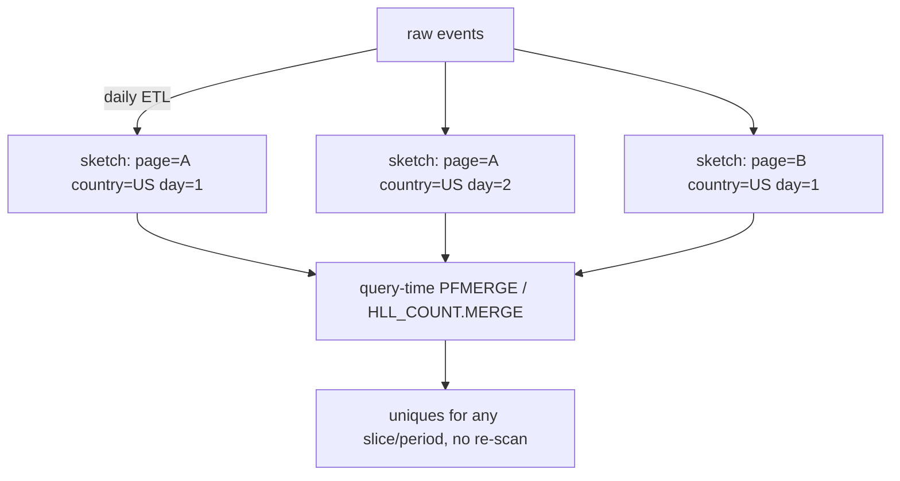
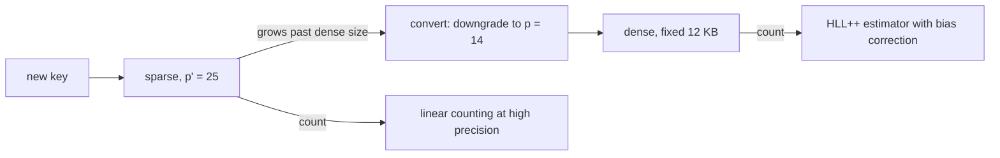
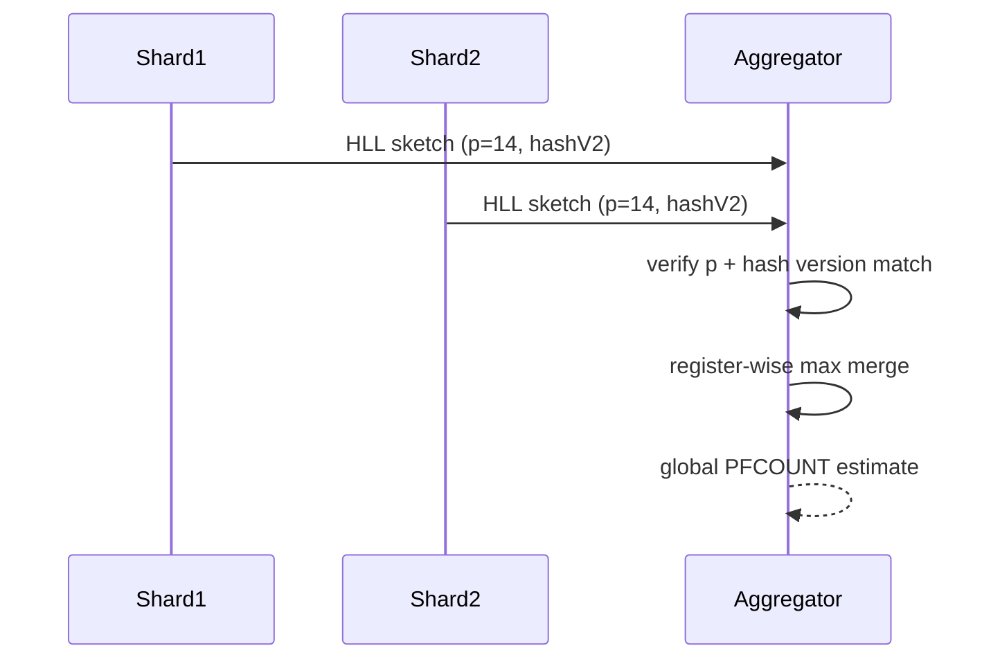

# HyperLogLog — Senior Level

> HyperLogLog is rarely the bottleneck on one counter — but the moment you run **millions of distinct-counters** (per page, per campaign, per minute), serve `COUNT(DISTINCT …)` approximations across a data warehouse, merge **unique users** from thousands of shards, or expose a Redis `PFCOUNT` SLA, every detail (sparse vs dense representation, HLL++ bias correction, 64-bit hashing, merge compatibility, the intersection caveat, memory/accuracy budgeting) becomes a cost, correctness, or capacity decision.

## Table of Contents

1. [Introduction](#1-introduction)
2. [HLL in Production Systems](#2-hll-in-production-systems)
3. [HLL++ — Sparse and Dense Representations](#3-hll-sparse-and-dense-representations)
4. [HLL++ — Bias Correction and 64-bit Hashing](#4-hll-bias-correction-and-64-bit-hashing)
5. [Distributed Union at Scale](#5-distributed-union-at-scale)
6. [Memory vs Accuracy Budgeting](#6-memory-vs-accuracy-budgeting)
7. [The Intersection Caveat in Production](#7-the-intersection-caveat-in-production)
8. [Code Examples](#8-code-examples)
9. [Observability and Failure Modes](#9-observability-and-failure-modes)
10. [Summary](#10-summary)

---

## 1. Introduction

At the senior level the question is no longer "how does the witness— harmonic-mean estimator work" but "what system am I building, and what breaks when I scale it?" HLL shows up in several production guises that share one engine:

1. **Analytics / unique-visitor counting** — "distinct users today," "unique IPs this hour," "reach of a campaign." Often **millions** of separate HLLs (one per dimension combination), each needing to be cheap when its cardinality is *small* (most are).
2. **Database `COUNT DISTINCT` approximation** — Redshift's `APPROXIMATE COUNT(DISTINCT)`, BigQuery's `APPROX_COUNT_DISTINCT`, Presto/Trino's `approx_distinct`, Spark's `approx_count_distinct`, Postgres `hll` extension. Trading exactness for one-pass, low-memory aggregation over enormous tables.
3. **Redis `PFADD`/`PFCOUNT`/`PFMERGE`** — a 12 KB-capped distinct counter per key, mergeable across keys, used for rate-limiting uniqueness, dashboards, and feature flags.
4. **Distributed roll-ups** — per-shard HLLs merged (register-max) into global counts in MapReduce/Spark/Flink, with hourly→daily→monthly time roll-ups.

All four reduce to the same senior decisions: *which representation (sparse vs dense), what precision `p`, which hash, deterministic merge compatibility, and how to budget memory against accuracy.* This document treats those decisions in production terms, centered on **HLL++** (Google's practical improvements), which is what real systems actually ship.

The four senior-level decisions, recurring across all guises:

1. **Representation** — sparse (tiny memory for low cardinality) vs dense (fixed `m` registers); when to switch.
2. **Precision `p`** — the memory/accuracy knob; `p = 14` default, sometimes `p' = 25` for the sparse-mode high-accuracy phase.
3. **Hash + merge compatibility** — a single global 64-bit hash and a single `p`, or merges silently break.
4. **Operation set** — union (free), cardinality (the estimate), and the hard "no" on direct intersection.

Get these right and HLL is correct, tiny, and mergeable at warehouse scale; get any wrong and you have silent bias, broken merges, or blown memory budgets across millions of counters.

---

## 2. HLL in Production Systems

### 2.1 Redis

Redis implements HLL with `p = 14` (`m = 16384`), a **6-bit** dense register layout (`16384 × 6 / 8 = 12 KB`), plus a **sparse** encoding for low-cardinality keys (often a few dozen bytes). The commands:

| Command | Meaning | Cost |
|---------|---------|------|
| `PFADD key e1 e2 …` | add elements | O(1) per element |
| `PFCOUNT key` | estimate cardinality (cached) | O(1) cached, O(m) on change |
| `PFCOUNT k1 k2 …` | estimate the **union** of several keys | O(m·keys) |
| `PFMERGE dst k1 k2 …` | persist the merged HLL | O(m·keys) |

Redis's stated error is ~0.81% (the `1.04/√16384`), and a key is capped at 12 KB regardless of cardinality. The sparse→dense promotion happens automatically when the sparse encoding would exceed the dense size.

### 2.2 Data warehouses

| System | Function | Notes |
|--------|----------|-------|
| BigQuery | `APPROX_COUNT_DISTINCT(x)` | HLL++; also exposes `HLL_COUNT.INIT/MERGE/EXTRACT` sketches |
| Redshift | `APPROXIMATE COUNT(DISTINCT x)` | HLL; ~error a couple percent |
| Presto/Trino | `approx_distinct(x[, e])` | HLL; tunable max standard error `e` |
| Spark SQL | `approx_count_distinct(x, rsd)` | HLL++; `rsd` = relative standard deviation |
| Postgres | `hll` extension (Citus) | full sketch type, mergeable, persistable |

The shared value proposition: a **single pass**, **bounded memory**, and **mergeable partial sketches** so the planner can compute `COUNT DISTINCT` per partition and combine — something an exact `COUNT DISTINCT` (which needs a global hash table or a sort) cannot do cheaply across a distributed table.

#### Why the planner loves HLL

Consider `SELECT country, COUNT(DISTINCT user_id) FROM events GROUP BY country` over a petabyte table sharded across 1,000 nodes. The exact plan must either (a) shuffle all `user_id`s to a single reducer per country (network-bound, memory-bound) or (b) sort-and-dedup globally. The HLL plan instead:

```
map:     each node builds a per-(country) HLL sketch from its local rows  (single pass, ~12 KB/country)
shuffle: ship only the sketches (KB), not the rows (TB)
reduce:  register-max merge the sketches per country -> one HLL per country
extract: estimate the count from each merged HLL
```

The shuffle volume drops from terabytes to kilobytes-per-group, and the reduce is associative so it parallelizes as a tree. This asymmetry — **sketches are tiny and mergeable, raw data is huge** — is the entire reason `APPROX_COUNT_DISTINCT` exists as a first-class operator. The cost is the ~0.8% error; the benefit is orders of magnitude less I/O and memory.

### 2.3 The "sketch as a first-class value" pattern

The most powerful production pattern is to **store the HLL sketch itself**, not just the count. A daily job emits one 12 KB sketch per (page, country); dashboards merge whichever sketches the user selects to answer arbitrary "uniques over this slice and period" queries — at query time, by `OR`-ing registers. No re-scan of raw events. BigQuery's `HLL_COUNT.*`, Postgres `hll`, and Redis `PFMERGE` all expose this.



---

## 3. HLL++ — Sparse and Dense Representations

The single biggest practical problem with classic HLL is that it **always** allocates the full `m`-register array, even for a key with 3 distinct items. With **millions** of mostly-tiny counters (the analytics reality), that is enormous waste. HLL++ solves it with two representations and an automatic switch.

### 3.1 Dense representation

The familiar one: an array of `m = 2^p` registers, each packed to 6 bits (since ranks ≤ 64 < 2^6). For `p = 14`, exactly 12 KB. Used once a key's cardinality is large enough that the sparse form would be bigger.

### 3.2 Sparse representation

For low cardinality, most registers are 0. Instead of storing them, store only the **non-zero** registers as a sorted list of encoded `(index, rank)` pairs. With only `k` distinct items, only ~`k` registers are touched, so memory is `O(k)` — a few bytes for a handful of items, growing gradually. Two refinements make it powerful:

1. **Higher precision while sparse.** Since sparse memory is proportional to the *number of stored entries*, not `2^p`, HLL++ uses a **larger precision `p'`** (e.g. `p' = 25`) for the sparse phase. More precision → far lower error in the low range — and it costs almost nothing because few entries are stored. When promoting to dense, the entries are **downgraded** from `p'` to `p` (the high-order bits of the index are kept).
2. **Compression.** The sorted index list is stored with **difference (delta) encoding + variable-length integers**, so each entry costs ~1–2 bytes. A periodic merge of a small unsorted "temp set" into the sorted list keeps inserts amortized cheap.

### 3.3 The switch

```text
maintain sparse list while:  encoded_size(sparse) < dense_size (= m * 6 bits)
when sparse would exceed dense:  convert to dense (downgrade p' -> p), free the list
```

| Cardinality regime | Representation | Memory | Accuracy |
|--------------------|----------------|--------|----------|
| tiny (≤ ~hundreds) | sparse, precision `p'` | a few bytes–~hundreds B | near-exact (linear counting at `p'`) |
| medium | sparse, growing | up to ~12 KB | very good |
| large | dense, precision `p` | fixed 12 KB | `1.04/√m` ≈ 0.8% |



This is *the* reason HLL++ is used in practice: it makes a fleet of millions of mostly-small counters affordable while keeping the worst-case capped at 12 KB.

---

## 4. HLL++ — Bias Correction and 64-bit Hashing

### 4.1 64-bit hashing

Classic HLL used a 32-bit hash and needed a **large-range correction** because registers begin to saturate / hash-collide as `n` approaches `2^32 ≈ 4.3 billion`. HLL++ switches to a **64-bit hash**, pushing saturation out to `~2^64` (effectively unreachable). Consequence: the large-range correction is **deleted entirely**, simplifying the estimator and removing a known source of error at the billions scale.

### 4.2 Empirical bias correction

The classic small-range handoff between linear counting and the harmonic-mean estimator has a **bias bump** in the transition region (cardinalities a few times `m`). HLL++ replaces the abrupt `E ≤ 2.5m` switch with an **empirically measured bias table**: Google measured the estimator's bias at many cardinalities (via simulation) for each precision and stored a lookup table of `(rawEstimate → bias)`. At count time:

```text
E   = raw harmonic-mean estimate
if E <= threshold(p):
    E' = E - estimateBias(E, p)        # subtract interpolated empirical bias
    if V (zeros) != 0:
        return linearCounting(m, V)     # still better when registers empty
    return E'
else:
    return E                            # large E unbiased (64-bit hash, no large-range corr.)
```

`estimateBias` interpolates the stored `(rawEstimate, bias)` points (k-nearest-neighbors on the raw estimate). The result: HLL++ has **markedly lower error in the low-to-mid range** than classic HLL, with no bias bump at the handoff. The high range is already unbiased thanks to the 64-bit hash.

| Aspect | Classic HLL | HLL++ |
|--------|-------------|-------|
| Hash width | 32-bit | **64-bit** (no large-range corr.) |
| Low-range method | linear counting + abrupt switch | empirical **bias correction** + linear counting |
| Low cardinality memory | full dense array | **sparse**, high precision `p'` |
| Max key memory (`p=14`) | 12 KB | 12 KB |
| Error in mid range | bias bump near `~5m` | smoothed, lower |

### 4.3 Why this matters at scale

For a warehouse computing billions of `APPROX_COUNT_DISTINCT` results, the low/mid-cardinality regime is where **most** groups live (the long tail of small groups). HLL++'s sparse mode + bias correction make those small groups both **cheap** and **accurate**, which is precisely the workload classic HLL handled worst.

---

## 5. Distributed Union at Scale

### 5.1 The merge contract

Register-wise max is associative, commutative, idempotent — the algebra of a **commutative monoid** (and the registers form a join-semilattice under max). This makes HLL a natural fit for distributed aggregation:

- **MapReduce/Spark:** map emits a partial HLL per partition; reduce merges by register-max. The merged sketch equals the global HLL.
- **CRDT:** an HLL register array is a **state-based CRDT** (a "G-Set"-like grow-only structure under max), so it converges under eventual consistency — replicas can merge in any order and reach the same state. Ideal for multi-datacenter unique counting.
- **Time roll-ups:** hourly sketches `OR` into daily, daily into monthly. A user active every hour is counted **once** in the monthly union — repeats across windows do not double-count, because max is idempotent.

### 5.2 Compatibility is the hidden landmine

Two sketches are mergeable **only** if they share:

1. the **same precision `p`** (same `m`),
2. the **same hash function** (same algorithm *and* seed),
3. the same **bit-layout convention** (which bits are the index, endianness).

Mix a `p = 12` sketch with a `p = 14` sketch, or two services using different hashes, and the merge is silently wrong. In production this is enforced by **embedding `p` and a hash/format version in the serialized sketch header** and refusing to merge mismatches. (Some systems can *downgrade* a higher-`p` sketch to a lower `p` by folding registers — keep the max over each group of merged buckets — but never *upgrade*.)

### 5.3 Folding (precision downgrade)

You can merge a `p_hi` sketch into a `p_lo` sketch by **folding**: register `j` in the low-precision sketch takes the max over the high-precision registers whose top `p_lo` index bits equal `j`, with the rank adjusted for the lost index bits. This lets a system standardize disparate sketches to a common `p` before union. It is lossy (you cannot regain the discarded precision) but enables heterogeneous merges.



---

## 6. Memory vs Accuracy Budgeting

The fundamental law: **error ≈ 1.04/√m = 1.04/√(2^p)**, and dense memory is `m × 6 bits`. To halve error, quadruple `m` (one more `p` doubles `m` and divides error by `√2`). The budgeting table:

| `p` | `m` | dense memory | std error | "billions" verdict |
|-----|-----|--------------|-----------|--------------------|
| 12 | 4,096 | ~3 KB | ~1.6% | fine for rough dashboards |
| 14 | 16,384 | **~12 KB** | **~0.8%** | **the standard for billions** |
| 16 | 65,536 | ~48 KB | ~0.4% | high-accuracy reporting |
| 18 | 262,144 | ~192 KB | ~0.2% | rarely needed |

**The headline budget:** ~**12 KB gives ~0.8% error for cardinalities into the billions** — and that 0.8% is *independent of `n`*. This is the line every senior should have memorized. Multiply by your fleet size: 10 million HLL keys at 12 KB each is ~120 GB *if all dense* — which is exactly why HLL++'s **sparse mode** matters (most keys are tiny and cost bytes, not 12 KB).

Choosing `p`:

1. Start from the **acceptable error** for the use case (1% dashboards → `p=14`; sub-0.5% reporting → `p=16`).
2. Multiply dense memory by the **number of large keys** to size the dense budget.
3. Rely on **sparse mode** for the long tail of small keys.
4. Fix `p` **globally** so all sketches merge.

---

## 7. The Intersection Caveat in Production

HLL gives unions for free and intersections **never** directly. Inclusion-exclusion (`|A∩B| = |A| + |B| − |A∪B|`) subtracts three noisy estimates; when the overlap is small relative to the sets, the result's *relative* error blows up. Production guidance:

| Need | Use | Why |
|------|-----|-----|
| Union / total uniques | **HLL merge** | exact w.r.t. the union, cheap |
| Cardinality | HLL estimate | `1.04/√m` |
| Jaccard / overlap | **MinHash** | designed for similarity |
| Intersection with set ops | **KMV / bottom-`k` / Theta sketches** | support `min`-merge intersection |
| Exact small-set overlap | exact sets / bitmaps | when sets are small enough |

**Theta sketches** (Apache DataSketches) are the senior's go-to when you need *both* large-scale cardinality *and* set operations including intersection and difference with rigorous error bounds — they generalize KMV and support union/intersect/A-not-B directly. If a stakeholder asks for "distinct users who did X **and** Y" at scale, reach for Theta sketches or MinHash, **not** HLL inclusion-exclusion (state the error amplification explicitly).

---

## 8. Code Examples

### A sparse→dense HLL++ skeleton (illustrative)

This shows the **representation switch** and 64-bit hashing — the senior-relevant structure. Bias-correction tables are omitted for brevity (they are large lookup tables); the linear-counting low-range fallback stands in.

#### Go

```go
package main

import (
	"fmt"
	"math"
	"math/bits"
	"sort"
)

const (
	p         = 14
	m         = 1 << p
	denseSize = m * 6 / 8 // bytes if packed to 6 bits
)

type HLLPP struct {
	dense  []uint8        // nil while sparse
	sparse map[uint32]uint8 // index -> rank, while sparse
}

func New() *HLLPP { return &HLLPP{sparse: make(map[uint32]uint8)} }

// 64-bit splitmix-style hash of a uint64 key.
func hash64(x uint64) uint64 {
	x += 0x9e3779b97f4a7c15
	x = (x ^ (x >> 30)) * 0xbf58476d1ce4e5b9
	x = (x ^ (x >> 27)) * 0x94d049bb133111eb
	return x ^ (x >> 31)
}

func (h *HLLPP) Add(key uint64) {
	x := hash64(key)
	idx := uint32(x >> (64 - p))
	rest := (x << p) | (1 << (p - 1))
	rank := uint8(bits.LeadingZeros64(rest)) + 1
	if h.dense != nil {
		if rank > h.dense[idx] {
			h.dense[idx] = rank
		}
		return
	}
	if r, ok := h.sparse[idx]; !ok || rank > r {
		h.sparse[idx] = rank
	}
	if len(h.sparse)*3 >= denseSize { // ~3 bytes/entry heuristic -> promote
		h.toDense()
	}
}

func (h *HLLPP) toDense() {
	h.dense = make([]uint8, m)
	for idx, r := range h.sparse {
		h.dense[idx] = r
	}
	h.sparse = nil
}

func (h *HLLPP) Count() float64 {
	reg := h.dense
	if reg == nil { // still sparse: linear counting over touched registers
		V := m - len(h.sparse)
		if V == m {
			return 0
		}
		return float64(m) * math.Log(float64(m)/float64(V))
	}
	mm := float64(m)
	alpha := 0.7213 / (1.0 + 1.079/mm)
	sum, zeros := 0.0, 0
	for _, r := range reg {
		sum += math.Pow(2, -float64(r))
		if r == 0 {
			zeros++
		}
	}
	est := alpha * mm * mm / sum
	if est <= 2.5*mm && zeros > 0 {
		est = mm * math.Log(mm/float64(zeros))
	}
	return est
}

func main() {
	h := New()
	for i := 0; i < 5; i++ { // tiny -> stays sparse
		h.Add(uint64(i))
	}
	fmt.Printf("sparse phase: true=5 est=%.1f\n", h.Count())
	for i := 0; i < 1_000_000; i++ { // grows -> promotes to dense
		h.Add(uint64(i))
	}
	_ = sort.Ints
	fmt.Printf("dense phase:  true=1000000 est=%.0f\n", h.Count())
}
```

#### Java

```java
import java.util.HashMap;
import java.util.Map;

public class HLLPP {
    static final int P = 14, M = 1 << P, DENSE = M * 6 / 8;
    byte[] dense;                 // null while sparse
    Map<Integer, Byte> sparse = new HashMap<>();

    static long hash64(long x) {
        x += 0x9e3779b97f4a7c15L;
        x = (x ^ (x >>> 30)) * 0xbf58476d1ce4e5b9L;
        x = (x ^ (x >>> 27)) * 0x94d049bb133111ebL;
        return x ^ (x >>> 31);
    }

    public void add(long key) {
        long x = hash64(key);
        int idx = (int) (x >>> (64 - P));
        long rest = (x << P) | (1L << (P - 1));
        byte rank = (byte) (Long.numberOfLeadingZeros(rest) + 1);
        if (dense != null) { if (rank > dense[idx]) dense[idx] = rank; return; }
        sparse.merge(idx, rank, (a, b) -> a > b ? a : b);
        if (sparse.size() * 3 >= DENSE) toDense();
    }

    void toDense() {
        dense = new byte[M];
        for (Map.Entry<Integer, Byte> e : sparse.entrySet()) dense[e.getKey()] = e.getValue();
        sparse = null;
    }

    public double count() {
        if (dense == null) {
            int V = M - sparse.size();
            return V == M ? 0 : M * Math.log((double) M / V);
        }
        double mm = M, alpha = 0.7213 / (1.0 + 1.079 / mm), sum = 0;
        int zeros = 0;
        for (byte r : dense) { sum += Math.pow(2, -r); if (r == 0) zeros++; }
        double est = alpha * mm * mm / sum;
        if (est <= 2.5 * mm && zeros > 0) est = mm * Math.log(mm / zeros);
        return est;
    }

    public static void main(String[] args) {
        HLLPP h = new HLLPP();
        for (int i = 0; i < 5; i++) h.add(i);
        System.out.printf("sparse: true=5 est=%.1f%n", h.count());
        for (int i = 0; i < 1_000_000; i++) h.add(i);
        System.out.printf("dense:  true=1000000 est=%.0f%n", h.count());
    }
}
```

#### Python

```python
import math


class HLLPP:
    P, M = 14, 1 << 14
    DENSE = M * 6 // 8

    def __init__(self):
        self.dense = None             # list while dense
        self.sparse = {}              # idx -> rank while sparse

    @staticmethod
    def _h(x):
        x = (x + 0x9e3779b97f4a7c15) & 0xFFFFFFFFFFFFFFFF
        x = ((x ^ (x >> 30)) * 0xbf58476d1ce4e5b9) & 0xFFFFFFFFFFFFFFFF
        x = ((x ^ (x >> 27)) * 0x94d049bb133111eb) & 0xFFFFFFFFFFFFFFFF
        return x ^ (x >> 31)

    def add(self, key):
        x = self._h(key)
        idx = x >> (64 - self.P)
        rest = ((x << self.P) | (1 << (self.P - 1))) & 0xFFFFFFFFFFFFFFFF
        rank = (64 - rest.bit_length()) + 1
        if self.dense is not None:
            if rank > self.dense[idx]:
                self.dense[idx] = rank
            return
        if rank > self.sparse.get(idx, 0):
            self.sparse[idx] = rank
        if len(self.sparse) * 3 >= self.DENSE:
            self._to_dense()

    def _to_dense(self):
        self.dense = [0] * self.M
        for idx, r in self.sparse.items():
            self.dense[idx] = r
        self.sparse = None

    def count(self):
        if self.dense is None:
            V = self.M - len(self.sparse)
            return 0.0 if V == self.M else self.M * math.log(self.M / V)
        m = self.M
        alpha = 0.7213 / (1.0 + 1.079 / m)
        s = sum(2.0 ** -r for r in self.dense)
        zeros = self.dense.count(0)
        est = alpha * m * m / s
        if est <= 2.5 * m and zeros > 0:
            est = m * math.log(m / zeros)
        return est


if __name__ == "__main__":
    h = HLLPP()
    for i in range(5):
        h.add(i)
    print(f"sparse: true=5 est={h.count():.1f}")
    for i in range(1_000_000):
        h.add(i)
    print(f"dense:  true=1000000 est={h.count():.0f}")
```

The sparse map keeps a tiny key cheap (bytes, not 12 KB); it promotes to the dense 12 KB array only once it grows past the dense size. A real HLL++ additionally uses a higher precision `p'` in sparse mode and an empirical bias table in the dense estimator.

---

## 9. Observability and Failure Modes

### Metrics to track

| Metric | Why | Alert |
|--------|-----|-------|
| `hll_relative_error` (vs occasional exact sample) | catch hash/bias regressions | > 2× expected `1.04/√m` |
| `hll_sparse_to_dense_promotions` | capacity planning | spike = many keys growing |
| `hll_dense_key_count` × 12 KB | memory budget | approaching node limit |
| `hll_merge_incompatible_total` | broken `p`/hash mismatches | any nonzero |
| `pfcount_latency_p99` | the O(m) recompute path | > SLA |

### Failure modes

- **Hash mismatch across services** — merges silently wrong. *Mitigation:* embed hash version + `p` in the sketch header; reject mismatches.
- **Precision mismatch on merge** — wrong union. *Mitigation:* enforce a single global `p`, or fold to a common `p`.
- **Per-process hash seed** — estimates differ between runs / nodes; merges break. *Mitigation:* use a fixed, deterministic hash (no random seed) for persisted/cross-process sketches.
- **Counting per-event noise** (timestamps, request ids) — cardinality explodes far above true distinct users. *Mitigation:* hash stable identity only.
- **Memory blow-up from all-dense fleet** — millions of keys × 12 KB. *Mitigation:* HLL++ sparse mode; TTL / eviction for cold keys.
- **Intersection via inclusion-exclusion** — garbage for small overlaps. *Mitigation:* Theta sketches / MinHash; never ship HLL intersection without a stated error band.
- **Mutating registers downward** — a register must only ever increase; a bug that lowers a register corrupts the monotone invariant and the estimate. *Mitigation:* `add` and `merge` are strictly `max`.

### Capacity-planning checklist

Before deploying a fleet of HLL counters, answer:

1. **How many keys?** Multiply by 12 KB *only* for keys expected to be large; rely on sparse mode for the long tail. A fleet of 10M keys where 1% are large is ~1.2 GB dense + a sparse tail, not 120 GB.
2. **What `p`?** Pick from the error budget (`1.04/√m`); standardize it globally for merge compatibility.
3. **Which hash?** A fixed, deterministic 64-bit hash with good avalanche, versioned in the sketch header.
4. **TTL / eviction?** Cold keys should expire; HLLs do not shrink, so an unbounded key space grows monotonically.
5. **Read path cost?** `PFCOUNT` is O(m) on change; cache the estimate if reads dominate writes.
6. **Cross-DC?** The CRDT property lets replicas merge eventually-consistently — but only with identical `p`/hash.

---

## 10. Summary

At senior level, HyperLogLog is evaluated against system-wide constraints: a fleet of millions of distinct-counters, warehouse `APPROX_COUNT_DISTINCT`, Redis `PFCOUNT`, and distributed roll-ups. The production form is **HLL++**, whose two innovations are decisive: a **sparse representation** (high precision `p'`, a few bytes per stored register) that makes the long tail of small counters affordable while capping the worst case at **12 KB**, and a **64-bit hash + empirical bias correction** that removes the large-range correction and smooths the low/mid-range bias. The defining operation is the **mergeable union** (register-wise max — a commutative monoid / CRDT), which makes distributed and time roll-up counting exact w.r.t. the union and order-independent, provided every sketch shares the **same `p` and hash** (the hidden compatibility landmine, enforced via a versioned header, with folding to downgrade precision). The memory/accuracy budget is the line to memorize: **~12 KB ≈ 0.8% error for billions**, with error fixed at `1.04/√m` and *independent of `n`*. And the hard constraint never to forget: HLL does **unions**, not **intersections** — for overlap/Jaccard reach for MinHash, KMV, or Theta sketches, never HLL inclusion-exclusion on small overlaps.

---

**Next step:** Continue to [`professional.md`](./professional.md) for the probabilistic derivation (why leading zeros estimate cardinality), the harmonic-mean rationale, the variance / error analysis behind `1.04/√m`, and the formal basis of HLL++ bias correction.
