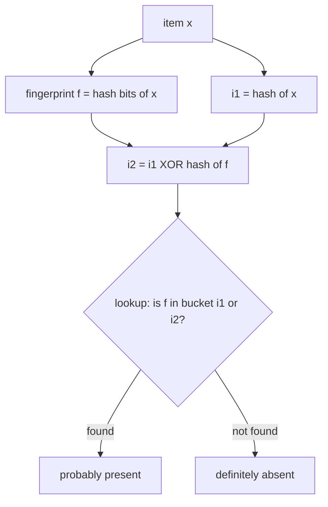
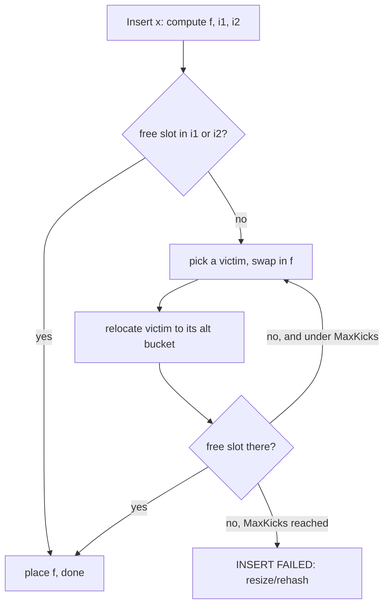

# Cuckoo Filter — Junior Level

> **One-line summary:** A cuckoo filter is a compact, approximate "is this item in the set?" structure. It stores a short **fingerprint** (a few bits) of each item inside a **cuckoo hash table** of buckets. Every item has **two candidate buckets**; lookup checks both, insert places the fingerprint in either one (kicking out a resident if both are full), and — unlike a Bloom filter — it can **delete** an item by removing its fingerprint.

---

## Table of Contents

1. [Introduction](#introduction)
2. [Prerequisites](#prerequisites)
3. [Glossary](#glossary)
4. [Core Concepts](#core-concepts)
5. [Big-O Summary](#big-o-summary)
6. [Real-World Analogies](#real-world-analogies)
7. [Pros & Cons](#pros--cons)
8. [Step-by-Step Walkthrough](#step-by-step-walkthrough)
9. [Code Examples](#code-examples)
10. [Coding Patterns](#coding-patterns)
11. [Error Handling](#error-handling)
12. [Performance Tips](#performance-tips)
13. [Best Practices](#best-practices)
14. [Edge Cases & Pitfalls](#edge-cases--pitfalls)
15. [Common Mistakes](#common-mistakes)
16. [Cheat Sheet](#cheat-sheet)
17. [Visual Animation](#visual-animation)
18. [Summary](#summary)
19. [Further Reading](#further-reading)

---

## Introduction

Imagine you are building a web crawler and you want a fast way to answer *"have I already seen this URL?"* You could keep every URL in a `HashSet`, but with billions of URLs that costs an enormous amount of memory — each URL string is dozens of bytes. What if you are willing to be *occasionally wrong* in exchange for using **far less memory**?

That trade is exactly what an **approximate membership** structure offers. The most famous one is the **Bloom filter** (see the sibling topic `02-bloom-filter`). A Bloom filter answers "is `x` in the set?" with two possible replies:

- **"definitely not in the set"** — always correct, and
- **"probably in the set"** — correct *most* of the time, but with a small **false-positive rate (FPR)**: sometimes it says "probably yes" for an item you never inserted.

A Bloom filter never gives a **false negative** (it never says "no" for something you did insert). That one-sided error is the price of the huge space savings.

The **cuckoo filter** is a newer structure (Fan, Andersen, Kaminsky & Mitzenmacher, 2014) that gives the same kind of approximate membership answer but adds a feature classic Bloom filters cannot do cleanly: **deletion**. You can remove an item you previously inserted, and the filter shrinks its evidence for that item. On top of that, for low false-positive rates (below roughly 3%), a cuckoo filter typically uses **less space** than a Bloom filter.

The trick is to store, for each item, a tiny **fingerprint** — a handful of bits derived by hashing the item — inside a special hash table called a **cuckoo hash table**. Each item has exactly **two candidate buckets** where its fingerprint is allowed to live. To check membership you look in both buckets for the fingerprint. To delete, you erase the fingerprint from whichever bucket holds it. This file explains the *what* and *how* at a beginner level; the deeper *why* (the clever XOR relocation math, the false-positive formula, the space analysis) lives in `middle.md`, `senior.md`, and `professional.md`.

---

## Prerequisites

Before reading this file you should be comfortable with:

- **Arrays and hash maps** — how a hash function turns a key into an index, and what a hash *collision* is. (See `05-basic-data-structures/05-hash-tables`.)
- **Bit basics** — what "a few bits" means, and the XOR (`^`) operation at a high level.
- **Big-O notation** — `O(1)`, `O(n)`, and the idea of "expected" (average) cost.
- **The Bloom filter idea** (helpful, not required) — one-sided error, false positives, no false negatives. (See `02-bloom-filter`.)

Optional but helpful:

- A sense of why memory matters at scale (billions of items, limited RAM).
- The notion of a *probabilistic* data structure: usually right, occasionally and predictably wrong in one direction.

---

## Glossary

| Term | Meaning |
|------|---------|
| **Approximate membership** | A structure that answers "is `x` in the set?" allowing a small, one-sided error. |
| **False positive (FP)** | The filter says "yes" for an item that was never inserted. |
| **False negative (FN)** | The filter says "no" for an item that *was* inserted. A correct cuckoo filter never does this (unless misused — see pitfalls). |
| **False-positive rate (FPR)** | The probability of a false positive, often written `ε`. |
| **Fingerprint** | A short bit-string (e.g. 8 or 12 bits) derived from hashing an item; what we actually store. |
| **Bucket** | A small array of slots that can hold a few fingerprints. Bucket size `b` is how many fingerprints fit (commonly 4). |
| **Candidate buckets** | The two bucket indices `i1` and `i2` where an item's fingerprint is allowed to live. |
| **Cuckoo hashing** | A hashing scheme where each key has two possible homes; on a clash one resident is "kicked out" to its alternate home. |
| **Kick-out / relocation** | Moving an existing fingerprint to its other candidate bucket to make room for a new one. |
| **Load factor (α)** | Fraction of slots currently filled = items / (buckets × `b`). |
| **Insert failure** | When relocation bounces too many times and cannot find room; the table is too full. |

---

## Core Concepts

### 1. Fingerprints, not the items themselves

We never store the URL, the user ID, or the file hash directly. Instead we store a **fingerprint** — a short slice of bits produced by hashing the item. An 8-bit fingerprint is just one byte. Storing a one-byte fingerprint instead of a 40-byte URL is where the space savings come from. The cost is ambiguity: two different items can share the same fingerprint, which is the source of false positives.

### 2. Buckets hold a few fingerprints each

The filter is an array of **buckets**. Each bucket has `b` slots (a typical value is `b = 4`). A bucket is just room for up to `b` fingerprints. Bigger buckets let the table fill up more before it fails, but slightly raise the false-positive rate (more fingerprints to accidentally match).

### 3. Two candidate buckets per item

Every item is allowed to store its fingerprint in exactly **one of two** buckets, `i1` or `i2`. The first index comes from hashing the item; the second is computed from the first and the fingerprint (the exact formula is the XOR trick explained in `middle.md`). The crucial point for now: **an item's fingerprint is always in `i1` or `i2`, never anywhere else.** That is what makes lookup cheap — only two buckets to check.

### 4. Lookup: check both candidate buckets

To answer "is `x` present?", compute `x`'s fingerprint and its two candidate buckets, then scan those two buckets for the fingerprint. If it appears in either bucket → **"probably yes."** If it appears in neither → **"definitely no."** Only two buckets are ever touched, so lookup is fast and constant-time.

### 5. Insert: place the fingerprint, kicking out if needed

To insert `x`, try to drop its fingerprint into bucket `i1` (or `i2`) if there is a free slot. If both candidate buckets are full, pick one resident fingerprint, **kick it out**, put the new fingerprint in its place, and **relocate** the evicted fingerprint to *its* alternate bucket. That may evict another fingerprint, and so on — a chain of relocations, just like the cuckoo bird that pushes other eggs out of a nest. If this bounces too many times, the insert **fails** (the table is too full).

### 6. Delete: erase the fingerprint

This is the headline feature. To delete `x`, compute its fingerprint and two candidate buckets, find a matching fingerprint in either, and **remove it** (free that slot). A Bloom filter cannot do this safely because its bits are shared among many items; the cuckoo filter stores each item's evidence as a separate fingerprint, so it can be taken back out.



---

## Big-O Summary

| Operation | Time | Space | Notes |
|-----------|------|-------|-------|
| Lookup | **O(1)** | O(1) | Scan two buckets of `b` slots each → at most `2b` fingerprint compares. |
| Delete | **O(1)** | O(1) | Same two buckets; erase the matching fingerprint. |
| Insert (typical) | **O(1)** amortized | O(1) | One or a few relocations on average while load is moderate. |
| Insert (worst, near full) | up to **O(MaxKicks)** | O(1) | A relocation chain; `MaxKicks` is a small fixed bound (e.g. 500). |
| Whole filter | — | **O(n·f / 8) bytes** | `f` = fingerprint bits, `n` ≈ capacity; far smaller than storing items. |

The headline is that **all three operations are constant time**, with insert occasionally doing a short chain of moves. There is no scanning of the whole structure — every operation touches just two buckets.

---

## Real-World Analogies

| Concept | Analogy |
|---------|---------|
| Fingerprint instead of full item | A coat-check tag: a short number stands in for your whole coat. Two coats *could* get the same short number — that is a false positive. |
| Two candidate buckets | You are allowed to park in exactly one of two assigned spots — spot A or spot B. |
| Cuckoo kick-out | The cuckoo bird lays its egg in another bird's nest and shoves an existing egg out; the shoved egg must find its own other nest. |
| Lookup checks both buckets | The valet only looks in your two assigned spots, never the whole lot. |
| Delete | You take your car back and free the spot — something a Bloom filter (shared lockers) cannot cleanly do. |
| Load factor too high | A nearly full parking garage: shuffling cars around eventually fails to find any free spot. |

Where the analogies break: real parking spots are physical, but a fingerprint can legitimately appear in *either* of two buckets, and the "kick-out" chain can ripple through many buckets before settling.

---

## Pros & Cons

| Pros | Cons |
|------|------|
| Supports **deletion** of inserted items (Bloom filters do not). | Deletion is only safe if the item was actually inserted (else you may remove someone else's matching fingerprint). |
| Often **less space** than Bloom filters for low FPR (below ~3%). | Insert can **fail** when the table gets too full (needs resize/rehash). |
| **O(1)** lookup touching only two buckets — cache-friendly. | Slightly more complex to implement than a Bloom filter. |
| No false negatives (when used correctly). | Has a small false-positive rate, like all such filters. |
| Lookup and delete cost the same — both just probe two buckets. | Practical max load factor is ~95% (with `b = 4`); beyond that inserts fail. |

**When to use:** approximate set membership where you also need to **remove** items over time — deduplication with deletes, cache admission, "have I seen this?" with expiry, network/database membership checks.

**When NOT to use:** when you only ever add (never delete) and want the simplest possible structure (a plain Bloom filter may be fine), or when you cannot tolerate *any* false positives (use an exact `HashSet`).

---

## Step-by-Step Walkthrough

Let us build a tiny cuckoo filter with `4` buckets (indices `0..3`) and bucket size `b = 2`. We use made-up but consistent numbers so you can follow the mechanics. Fingerprints are short letters here for readability.

**Insert item A** → fingerprint `fA`, candidate buckets `i1 = 1`, `i2 = 3`.

```
bucket 0: [ _ , _ ]
bucket 1: [ fA, _ ]   ← placed in i1 (had room)
bucket 2: [ _ , _ ]
bucket 3: [ _ , _ ]
```

**Insert item B** → fingerprint `fB`, candidate buckets `i1 = 1`, `i2 = 2`.

```
bucket 1: [ fA, fB ]  ← i1 still had a free slot
```

**Insert item C** → fingerprint `fC`, candidate buckets `i1 = 1`, `i2 = 0`. Bucket 1 is now full, so try `i2 = 0`:

```
bucket 0: [ fC, _ ]   ← placed in alternate bucket
```

**Insert item D** → fingerprint `fD`, candidate buckets `i1 = 1`, `i2 = 0`. **Both full!** Kick out a resident, say `fA` from bucket 1, put `fD` there, then relocate `fA` to *its* other bucket (`fA`'s alternate is `3`):

```
bucket 1: [ fD, fB ]  ← fD took fA's slot
bucket 3: [ fA, _ ]   ← evicted fA relocated to its alternate
```

The relocation succeeded in one hop. If bucket 3 had also been full, `fA` would have kicked out a resident there, and the chain would continue up to `MaxKicks` times.

**Lookup A** → fingerprint `fA`, candidate buckets `1` and `3`. Scan bucket 1 (`fD, fB` — no `fA`), scan bucket 3 (`fA` — found!) → **"probably present."**

**Delete B** → fingerprint `fB`, candidate buckets `1` and `2`. Find `fB` in bucket 1 and erase it:

```
bucket 1: [ fD, _ ]   ← fB removed
```

Notice every operation only ever touched the item's two candidate buckets — never the whole table.

---

## Code Examples

### Example: A minimal cuckoo filter (8-bit fingerprints, bucket size 4)

This is a teaching implementation. It shows the three operations — `Insert`, `Lookup`, `Delete` — plus the XOR relocation. Production libraries optimize the bit packing and hashing, but the logic is the same.

#### Go

```go
package main

import (
	"fmt"
	"hash/fnv"
	"math/rand"
)

const (
	bucketSize = 4
	maxKicks   = 500
)

type CuckooFilter struct {
	buckets    [][bucketSize]byte // each slot holds an 8-bit fingerprint; 0 means empty
	numBuckets uint32
	count      int
}

func New(numBuckets uint32) *CuckooFilter {
	return &CuckooFilter{
		buckets:    make([][bucketSize]byte, numBuckets),
		numBuckets: numBuckets,
	}
}

// hash64 returns a 64-bit hash of the item.
func hash64(item string) uint64 {
	h := fnv.New64a()
	h.Write([]byte(item))
	return h.Sum64()
}

// fingerprint derives a non-zero 8-bit fingerprint (0 is reserved for "empty").
func fingerprint(h uint64) byte {
	f := byte(h & 0xFF)
	if f == 0 {
		f = 1
	}
	return f
}

func (cf *CuckooFilter) indexFor(h uint64) uint32 {
	return uint32(h>>32) % cf.numBuckets
}

// altIndex computes the partner bucket via the XOR trick.
func (cf *CuckooFilter) altIndex(i uint32, f byte) uint32 {
	return (i ^ cf.indexFor(hash64(fmt.Sprintf("fp:%d", f)))) % cf.numBuckets
}

func (cf *CuckooFilter) insertIntoBucket(i uint32, f byte) bool {
	for s := 0; s < bucketSize; s++ {
		if cf.buckets[i][s] == 0 {
			cf.buckets[i][s] = f
			return true
		}
	}
	return false
}

func (cf *CuckooFilter) Insert(item string) bool {
	h := hash64(item)
	f := fingerprint(h)
	i1 := cf.indexFor(h)
	i2 := cf.altIndex(i1, f)

	if cf.insertIntoBucket(i1, f) || cf.insertIntoBucket(i2, f) {
		cf.count++
		return true
	}

	// Both buckets full: start kicking.
	i := i1
	if rand.Intn(2) == 1 {
		i = i2
	}
	for n := 0; n < maxKicks; n++ {
		s := rand.Intn(bucketSize)
		f, cf.buckets[i][s] = cf.buckets[i][s], f // swap victim out
		i = cf.altIndex(i, f)                     // relocate victim
		if cf.insertIntoBucket(i, f) {
			cf.count++
			return true
		}
	}
	return false // insert failed: table too full
}

func (cf *CuckooFilter) bucketHas(i uint32, f byte) bool {
	for s := 0; s < bucketSize; s++ {
		if cf.buckets[i][s] == f {
			return true
		}
	}
	return false
}

func (cf *CuckooFilter) Lookup(item string) bool {
	h := hash64(item)
	f := fingerprint(h)
	i1 := cf.indexFor(h)
	i2 := cf.altIndex(i1, f)
	return cf.bucketHas(i1, f) || cf.bucketHas(i2, f)
}

func (cf *CuckooFilter) Delete(item string) bool {
	h := hash64(item)
	f := fingerprint(h)
	i1 := cf.indexFor(h)
	i2 := cf.altIndex(i1, f)
	for _, i := range []uint32{i1, i2} {
		for s := 0; s < bucketSize; s++ {
			if cf.buckets[i][s] == f {
				cf.buckets[i][s] = 0
				cf.count--
				return true
			}
		}
	}
	return false
}

func main() {
	cf := New(16)
	cf.Insert("apple")
	cf.Insert("banana")
	fmt.Println(cf.Lookup("apple"))  // true
	fmt.Println(cf.Lookup("cherry")) // false (probably)
	cf.Delete("apple")
	fmt.Println(cf.Lookup("apple")) // false
}
```

#### Java

```java
import java.util.Random;

public class CuckooFilter {
    static final int BUCKET_SIZE = 4;
    static final int MAX_KICKS = 500;

    private final byte[][] buckets; // 0 means empty
    private final int numBuckets;
    private int count;
    private final Random rng = new Random();

    public CuckooFilter(int numBuckets) {
        this.numBuckets = numBuckets;
        this.buckets = new byte[numBuckets][BUCKET_SIZE];
    }

    private long hash64(String item) {
        long h = 1125899906842597L; // FNV-ish seed
        for (int i = 0; i < item.length(); i++) h = 31 * h + item.charAt(i);
        h ^= (h >>> 33);
        h *= 0xff51afd7ed558ccdL;
        h ^= (h >>> 33);
        return h;
    }

    private byte fingerprint(long h) {
        byte f = (byte) (h & 0xFF);
        return f == 0 ? 1 : f;
    }

    private int indexFor(long h) {
        return (int) Math.floorMod(h >>> 32, numBuckets);
    }

    private int altIndex(int i, byte f) {
        return Math.floorMod(i ^ indexFor(hash64("fp:" + (f & 0xFF))), numBuckets);
    }

    private boolean insertInto(int i, byte f) {
        for (int s = 0; s < BUCKET_SIZE; s++) {
            if (buckets[i][s] == 0) { buckets[i][s] = f; return true; }
        }
        return false;
    }

    public boolean insert(String item) {
        long h = hash64(item);
        byte f = fingerprint(h);
        int i1 = indexFor(h);
        int i2 = altIndex(i1, f);
        if (insertInto(i1, f) || insertInto(i2, f)) { count++; return true; }

        int i = rng.nextBoolean() ? i1 : i2;
        for (int n = 0; n < MAX_KICKS; n++) {
            int s = rng.nextInt(BUCKET_SIZE);
            byte victim = buckets[i][s];
            buckets[i][s] = f;
            f = victim;
            i = altIndex(i, f);
            if (insertInto(i, f)) { count++; return true; }
        }
        return false;
    }

    private boolean bucketHas(int i, byte f) {
        for (int s = 0; s < BUCKET_SIZE; s++) if (buckets[i][s] == f) return true;
        return false;
    }

    public boolean lookup(String item) {
        long h = hash64(item);
        byte f = fingerprint(h);
        int i1 = indexFor(h);
        int i2 = altIndex(i1, f);
        return bucketHas(i1, f) || bucketHas(i2, f);
    }

    public boolean delete(String item) {
        long h = hash64(item);
        byte f = fingerprint(h);
        int i1 = indexFor(h);
        int i2 = altIndex(i1, f);
        for (int i : new int[]{i1, i2}) {
            for (int s = 0; s < BUCKET_SIZE; s++) {
                if (buckets[i][s] == f) { buckets[i][s] = 0; count--; return true; }
            }
        }
        return false;
    }

    public static void main(String[] args) {
        CuckooFilter cf = new CuckooFilter(16);
        cf.insert("apple");
        cf.insert("banana");
        System.out.println(cf.lookup("apple"));  // true
        System.out.println(cf.lookup("cherry")); // false (probably)
        cf.delete("apple");
        System.out.println(cf.lookup("apple"));   // false
    }
}
```

#### Python

```python
import random


class CuckooFilter:
    BUCKET_SIZE = 4
    MAX_KICKS = 500

    def __init__(self, num_buckets):
        self.num_buckets = num_buckets
        self.buckets = [[0] * self.BUCKET_SIZE for _ in range(num_buckets)]
        self.count = 0

    @staticmethod
    def _hash64(item):
        return hash(("seed", item)) & 0xFFFFFFFFFFFFFFFF

    def _fingerprint(self, h):
        f = h & 0xFF
        return f if f != 0 else 1  # 0 is reserved for "empty"

    def _index_for(self, h):
        return (h >> 32) % self.num_buckets

    def _alt_index(self, i, f):
        return (i ^ self._index_for(self._hash64(f"fp:{f}"))) % self.num_buckets

    def _insert_into(self, i, f):
        for s in range(self.BUCKET_SIZE):
            if self.buckets[i][s] == 0:
                self.buckets[i][s] = f
                return True
        return False

    def insert(self, item):
        h = self._hash64(item)
        f = self._fingerprint(h)
        i1 = self._index_for(h)
        i2 = self._alt_index(i1, f)
        if self._insert_into(i1, f) or self._insert_into(i2, f):
            self.count += 1
            return True

        i = random.choice((i1, i2))
        for _ in range(self.MAX_KICKS):
            s = random.randrange(self.BUCKET_SIZE)
            f, self.buckets[i][s] = self.buckets[i][s], f  # swap victim out
            i = self._alt_index(i, f)
            if self._insert_into(i, f):
                self.count += 1
                return True
        return False  # insert failed

    def _bucket_has(self, i, f):
        return f in self.buckets[i]

    def lookup(self, item):
        h = self._hash64(item)
        f = self._fingerprint(h)
        i1 = self._index_for(h)
        i2 = self._alt_index(i1, f)
        return self._bucket_has(i1, f) or self._bucket_has(i2, f)

    def delete(self, item):
        h = self._hash64(item)
        f = self._fingerprint(h)
        i1 = self._index_for(h)
        i2 = self._alt_index(i1, f)
        for i in (i1, i2):
            for s in range(self.BUCKET_SIZE):
                if self.buckets[i][s] == f:
                    self.buckets[i][s] = 0
                    self.count -= 1
                    return True
        return False


if __name__ == "__main__":
    cf = CuckooFilter(16)
    cf.insert("apple")
    cf.insert("banana")
    print(cf.lookup("apple"))   # True
    print(cf.lookup("cherry"))  # False (probably)
    cf.delete("apple")
    print(cf.lookup("apple"))   # False
```

**What it does:** stores 8-bit fingerprints in buckets of 4, computes two candidate buckets per item with the XOR trick, and supports insert (with kick-out relocation), lookup, and delete. The `0` value is reserved to mean "empty slot," so fingerprints are forced non-zero.
**Run:** `go run main.go` | `javac CuckooFilter.java && java CuckooFilter` | `python cuckoo.py`

---

## Coding Patterns

### Pattern 1: Reserve a sentinel for "empty"

**Intent:** Distinguish an empty slot from a real fingerprint. We reserve `0` and force fingerprints to be non-zero. (Production code may store occupancy separately, but the sentinel trick is the simplest.)

```python
def fingerprint(h):
    f = h & 0xFF
    return f if f != 0 else 1
```

### Pattern 2: The XOR alternate-bucket trick

**Intent:** Compute the *second* candidate bucket from the first and the fingerprint, so that from *either* bucket you can recover the other without re-hashing the original item.

```python
def alt_index(i, f, hash_fp, num_buckets):
    return (i ^ hash_fp(f)) % num_buckets
# Key property: alt_index(alt_index(i, f), f) == i  (XOR is its own inverse)
```

### Pattern 3: Bounded relocation loop

**Intent:** Cap the kick-out chain so a too-full table fails fast instead of looping forever.



---

## Error Handling

| Error | Cause | Fix |
|-------|-------|-----|
| Insert returns `false` | Table too full; relocation hit `MaxKicks`. | Resize/rehash into a bigger table, or refuse the insert and alert. |
| Deleting an item never inserted removes a real fingerprint | Two items share a fingerprint + a candidate bucket. | Only delete items you know were inserted; treat delete as "delete-if-present." |
| Fingerprint `0` collides with "empty" | Forgot the non-zero sentinel rule. | Force fingerprints to be non-zero (map `0 → 1`). |
| Lookup says "yes" for an absent item | Normal false positive. | Accept the FPR, or size the filter for a lower target FPR. |
| Alternate bucket math broken | `altIndex(altIndex(i,f),f) != i`. | Ensure the XOR partner uses `hash(fingerprint)`, not `hash(item)`. |

---

## Performance Tips

- **Keep the load factor below ~95%** (for `b = 4`). Past that, inserts start failing and relocation chains lengthen.
- **Use bucket size `b = 4`** as a default — it balances high load factor against false-positive rate well.
- **Pick a power-of-two number of buckets** so the XOR trick maps cleanly (`i ^ hash(f)` stays within range without a modulo bias).
- **Make fingerprints just long enough** for your target FPR — every extra bit costs memory across all slots.
- **Hash once.** Derive both the first index and the fingerprint from a single hash of the item; do not hash twice.

---

## Best Practices

- Reserve a sentinel value (commonly `0`) for empty slots and force fingerprints away from it.
- Test the XOR self-inverse property (`alt(alt(i)) == i`) — it is the single most error-prone line.
- Decide up front what to do on insert failure: resize, reject, or fall back to an exact set.
- Compare against an exact `HashSet` on small inputs to verify no false negatives appear.
- Document your fingerprint length `f` and bucket size `b`; they determine both FPR and capacity.
- Only call `delete` for items you are confident were inserted.

---

## Edge Cases & Pitfalls

- **Empty filter** — every lookup returns "no"; nothing is stored yet.
- **Duplicate inserts** — inserting the same item twice stores its fingerprint twice (the basic filter has no dedup); this consumes slots and lets you delete it twice. Decide whether you want count semantics.
- **Deleting an absent item** — may remove a *different* item's identical fingerprint if it happens to sit in the same candidate bucket. Never delete what you did not insert.
- **Table nearly full** — inserts can fail even though the filter is "almost" empty of *that* item; this is the load-factor limit, not a bug.
- **All-zero fingerprint** — without the sentinel rule, an item whose fingerprint is `0` becomes invisible/ambiguous.
- **Tiny tables** — with very few buckets, relocation chains and FPR behave erratically; cuckoo filters shine at scale.

---

## Common Mistakes

1. **Forgetting that delete can hurt** — removing an item you never inserted can delete a colliding fingerprint that *belongs* to a real item, introducing a false negative.
2. **Using `hash(item)` for the alternate bucket** instead of `hash(fingerprint)` — breaks the XOR self-inverse property, so you can no longer recover a fingerprint's home from its alternate.
3. **No empty sentinel** — treating `0` as a valid fingerprint makes empty slots indistinguishable from stored items.
4. **Ignoring insert failure** — pretending insert always succeeds; near capacity it returns `false` and you must handle it.
5. **Over-filling** — pushing load factor above the practical limit and then being surprised by failures.
6. **Hashing twice** — recomputing a fresh hash for the index and another for the fingerprint, so the two no longer relate correctly.
7. **Expecting zero false positives** — it is a *filter*, not a set; a small FPR is by design.

---

## Cheat Sheet

| Question | Answer |
|----------|--------|
| What does it store? | Short **fingerprints**, not the items. |
| How many buckets per item? | Exactly **two** candidate buckets, `i1` and `i2`. |
| How is `i2` found? | `i2 = i1 XOR hash(fingerprint)` (XOR trick). |
| Lookup cost? | **O(1)** — scan two buckets. |
| Can it delete? | **Yes** — the key advantage over Bloom filters. |
| What is the error? | A small **false-positive** rate; no false negatives if used correctly. |
| When does insert fail? | When relocation exceeds `MaxKicks` (table too full, high load factor). |
| Typical bucket size? | `b = 4`. |

Core algorithm:

```
lookup(x):
    f = fingerprint(x); i1 = index(x); i2 = i1 XOR hash(f)
    return f in bucket[i1] or f in bucket[i2]

insert(x):
    f = fingerprint(x); i1 = index(x); i2 = i1 XOR hash(f)
    if room in i1 or i2: place f; return true
    i = random(i1, i2)
    repeat up to MaxKicks:
        swap f with a random slot of bucket[i]
        i = i XOR hash(f)
        if room in bucket[i]: place f; return true
    return false   # too full → resize

delete(x):
    f = fingerprint(x); i1 = index(x); i2 = i1 XOR hash(f)
    erase one copy of f from bucket[i1] or bucket[i2]
```

---

## Visual Animation

> See [`animation.html`](./animation.html) for an interactive visualization.
>
> The animation demonstrates:
> - Buckets holding short fingerprints, with the two candidate buckets highlighted
> - An **insert** that finds both candidates full and triggers a **cuckoo kick-out / relocation chain**
> - A **lookup** scanning the two candidate buckets
> - A **delete** that erases a fingerprint
> - A live load-factor and false-positive-rate panel, plus an operation log

---

## Summary

A **cuckoo filter** answers approximate membership questions — "is `x` probably in the set?" — using little memory by storing a short **fingerprint** of each item instead of the item itself. Each item has **two candidate buckets**; **lookup** scans both, **insert** drops the fingerprint into a free slot or starts a **cuckoo kick-out** relocation chain, and **delete** simply erases the fingerprint. That deletion ability is what sets it apart from the classic **Bloom filter**, and for low false-positive rates it is usually more space-efficient too. The two things never to forget: only delete items you actually inserted (or you may cause a false negative), and watch the **load factor** — when the table gets too full, inserts fail and you must resize.

---

## Further Reading

- Fan, Andersen, Kaminsky, Mitzenmacher — *"Cuckoo Filter: Practically Better Than Bloom"* (CoNEXT 2014), the original paper.
- Sibling topic `02-bloom-filter` — the structure cuckoo filters improve upon.
- Sibling topic `23-counting-bloom-filter` — the other common deletable filter; compared in `middle.md`.
- `05-basic-data-structures/05-hash-tables` — collision handling and hashing background.
- Pagh & Rodler — *"Cuckoo Hashing"* (2001), the underlying hashing technique.
- The `middle.md`, `senior.md`, and `professional.md` files in this folder for the XOR-trick math, FPR derivation, and space analysis.

Next step: continue to [`middle.md`](./middle.md) to learn *why* the XOR relocation works, how the false-positive rate `≈ 2b/2^f` is derived, and exactly when a cuckoo filter beats a Bloom filter.
