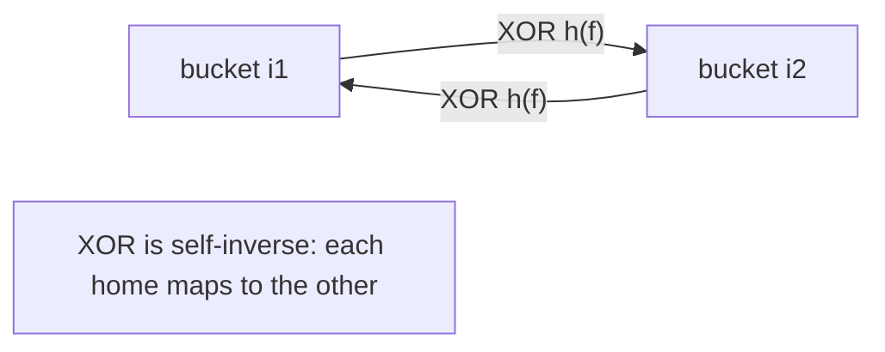
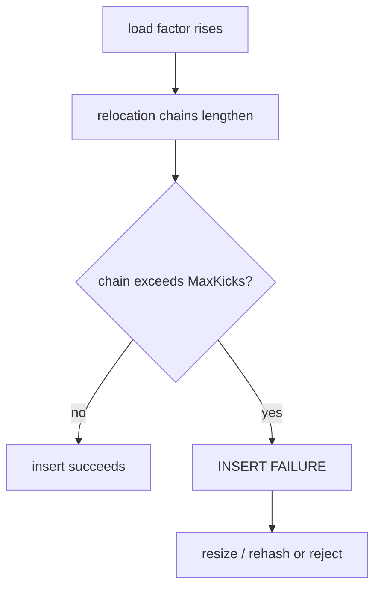

# Cuckoo Filter — Middle Level

> **One-line summary:** The magic of the cuckoo filter is **partial-key cuckoo hashing**: instead of re-hashing the original item to find its alternate bucket, we compute `i2 = i1 XOR hash(fingerprint)`. Because XOR is its own inverse, from *either* bucket we can recover the other using only the stored fingerprint — that is what lets relocation, lookup, and delete all work while storing nothing but fingerprints. This level explains *why* it works, derives the false-positive rate `ε ≈ 2b / 2^f`, and shows when to choose it over a Bloom filter.

---

## Table of Contents

1. [Introduction](#introduction)
2. [Deeper Concepts](#deeper-concepts)
3. [Partial-Key Cuckoo Hashing and the XOR Trick](#partial-key-cuckoo-hashing-and-the-xor-trick)
4. [False-Positive Rate Derivation](#false-positive-rate-derivation)
5. [Load Factor and Insert Failure](#load-factor-and-insert-failure)
6. [Comparison with Alternatives](#comparison-with-alternatives)
7. [Advanced Patterns](#advanced-patterns)
8. [Code Examples](#code-examples)
9. [Error Handling](#error-handling)
10. [Performance Analysis](#performance-analysis)
11. [Best Practices](#best-practices)
12. [Visual Animation](#visual-animation)
13. [Summary](#summary)

---

## Introduction

> Focus: "Why does it work?" and "When should I choose this?"

At the junior level we treated the alternate-bucket formula as a black box: `i2 = i1 XOR hash(fingerprint)`. The whole elegance of the cuckoo filter hides in that one line. A *classic* cuckoo hash table stores full keys, so when it needs an item's two homes it just hashes the key twice. But a cuckoo *filter* throws the key away and keeps only a short fingerprint — so during relocation, when we hold a fingerprint sitting in some bucket and need to know its *other* home, we have nothing to re-hash but the fingerprint itself. **Partial-key cuckoo hashing** solves this: it derives the alternate bucket from the current bucket and the fingerprint, using XOR's self-inverse property so the relationship is symmetric.

This file develops three things a middle engineer must own:

1. **Why the XOR trick is correct** — the self-inverse property and what it guarantees.
2. **Where the false-positive rate `ε ≈ 2b / 2^f` comes from** — the probability that some stored fingerprint accidentally matches a query.
3. **When a cuckoo filter beats a Bloom filter** — load factor, deletion support, and the space crossover around `ε ≈ 3%`.

---

## Deeper Concepts

### Invariant: every fingerprint lives in one of its two homes

The structural invariant the filter maintains at all times:

> For every stored item `x` with fingerprint `f`, the value `f` appears in bucket `i1(x)` **or** bucket `i2(x)`, where `i1(x) = hash(x) mod m` and `i2(x) = i1(x) XOR (hash(f) mod m)`.

If this invariant ever breaks — for example if relocation moved a fingerprint to a bucket that is neither of its homes — then a future lookup would scan the wrong two buckets and report a **false negative**. Maintaining the invariant through every relocation is the correctness heart of the structure, and the XOR trick is precisely what preserves it (proof in `professional.md`).

### Why fingerprints, revisited

A Bloom filter sets bits; a cuckoo filter stores fingerprints. The fingerprint length `f` (in bits) directly controls the false-positive rate: a query is a false positive only when some *unrelated* stored fingerprint, sitting in one of the query's two candidate buckets, happens to equal the query's fingerprint. With `f` bits there are `2^f` possible fingerprints, so a random collision has probability about `1/2^f` per stored fingerprint — and there are up to `2b` of them across the two buckets.

### Buckets and bucket size `b`

Bucket size `b` (slots per bucket) is a tuning knob with two opposing effects:

- **Larger `b` → higher achievable load factor.** With `b = 1` (plain cuckoo hashing) the table only fills to ~50% before inserts fail; `b = 4` reaches ~95%; `b = 8` reaches ~98%.
- **Larger `b` → higher FPR.** More fingerprints per bucket means more chances for an accidental match (`ε ≈ 2b / 2^f`).

The sweet spot for most workloads is `b = 4`, which gives a 95% load factor at modest FPR cost.

---

## Partial-Key Cuckoo Hashing and the XOR Trick

Here is the core relationship, written carefully. Let `m` be the number of buckets (a power of two), `h(·)` a hash function, and `f` the fingerprint of item `x`. Define:

```text
i1 = h(x)              mod m
i2 = i1 XOR (h(f) mod m)
```

The defining property we need is **self-inverse / symmetry**:

```text
i1 = i2 XOR (h(f) mod m)
```

That is: applying `XOR (h(f) mod m)` to `i2` gives back `i1`. This holds because XOR is its own inverse: `(a XOR b) XOR b = a`. So:

```text
i2 XOR (h(f) mod m)
  = (i1 XOR (h(f) mod m)) XOR (h(f) mod m)
  = i1 XOR ((h(f) mod m) XOR (h(f) mod m))
  = i1 XOR 0
  = i1
```

**Why this matters for relocation.** Suppose a fingerprint `f` currently lives in bucket `j` and we must kick it out. We do *not* know whether `j` was its `i1` or its `i2` — we only have `f` and `j`. But thanks to symmetry, its *other* home is simply `j XOR (h(f) mod m)`, computable from `f` and `j` alone. No original item needed. That is the entire reason a fingerprint-only table can relocate at all.



**Why `m` must be a power of two.** The XOR is done on the bit-pattern of the index. If `m` is a power of two, indices occupy exactly `log2(m)` bits, the XOR result is always a valid index in `[0, m)`, and the symmetry is exact. If `m` were not a power of two, `i1 XOR (h(f) mod m)` could land outside `[0, m)` or break the self-inverse property, corrupting the invariant. Production cuckoo filters therefore always round the bucket count up to a power of two.

**Why hash the fingerprint, not the item, for the partner.** If we used `i2 = i1 XOR (h(x) mod m)`, then recovering `i1` from `i2` would require `h(x)` — but during relocation we have thrown `x` away. Hashing the *fingerprint* keeps the partner computable from stored data only. A subtle consequence: because `f` has few bits, `h(f)` takes few distinct values, so the alternate buckets are not perfectly uniform — this slightly limits how full the table can get, which is acceptable in practice.

---

## False-Positive Rate Derivation

We now derive the headline formula `ε ≈ 2b / 2^f`.

**Setup.** A lookup for an item `y` (not in the set) computes its fingerprint `fy` and candidate buckets `i1, i2`. It reports a false positive if `fy` matches *any* fingerprint stored in those two buckets.

**Per-slot collision probability.** Each stored fingerprint is `f` bits, so it equals `fy` with probability `≈ 1/2^f` (assuming fingerprints are roughly uniform).

**Number of slots inspected.** Two buckets, each with `b` slots → up to `2b` stored fingerprints to compare against.

**Union bound.** The probability that *at least one* of those `2b` fingerprints equals `fy` is at most their sum:

```text
ε ≤ 1 - (1 - 1/2^f)^(2b)  ≈  2b / 2^f      (for small 1/2^f)
```

The approximation `1 - (1 - p)^k ≈ kp` holds when `p = 1/2^f` is tiny, which it is for any reasonable fingerprint length. Hence:

```text
ε ≈ 2b / 2^f
```

**Reading the formula.**

- Each extra **fingerprint bit halves** the false-positive rate (the `2^f` in the denominator).
- **Doubling the bucket size** roughly **doubles** the FPR (the `2b` in the numerator) — the cost of larger buckets.

**Sizing in reverse.** To hit a target FPR `ε` with bucket size `b`, solve for `f`:

```text
f ≥ log2(2b / ε) = log2(b) + 1 + log2(1/ε)
```

For example, target `ε = 0.01` (1%) with `b = 4`: `f ≥ log2(8) + log2(100) = 3 + 6.64 ≈ 9.64`, so use `f = 10` bits.

| Target FPR `ε` | Fingerprint bits `f` (with `b = 4`) | Notes |
|---|---|---|
| 10% | ~6–7 | very compact |
| 3% | ~8 | typical "small filter" |
| 1% | ~10 | common default |
| 0.1% | ~13 | low-FPR regime |
| 0.01% | ~17 | high-precision membership |

---

## Load Factor and Insert Failure

The **load factor** `α = items / (m · b)` measures how full the table is. Cuckoo filters can run remarkably full, but not arbitrarily so.

| Bucket size `b` | Max practical load factor `α` |
|---|---|
| 1 | ~50% |
| 2 | ~84% |
| 4 | ~95% |
| 8 | ~98% |

As `α` climbs toward the limit, relocation chains lengthen and the chance an insert exceeds `MaxKicks` rises sharply. This is the **insert-failure** problem: there is no "yes/no" room left and the cuckoo bounce cannot settle. When it happens you must:

1. **Resize / rehash** into a larger table (double `m`, re-insert all fingerprints — but note you cannot recover items from fingerprints alone, so you rehash *fingerprints* into new positions), or
2. **Reject the insert** and signal back-pressure, or
3. Accept a pre-sized filter and never exceed its capacity.

Because resizing a fingerprint-only table is awkward, the common practice is to **size the filter once** for the expected item count with comfortable headroom (target `α ≈ 0.9` at full load), and treat insert failure as a rare alarm.



---

## Comparison with Alternatives

| Attribute | Cuckoo Filter | Bloom Filter | Counting Bloom Filter | Quotient Filter |
|-----------|--------------|--------------|----------------------|-----------------|
| Supports delete? | **Yes** | No | Yes | Yes |
| Lookup time | O(1), 2 buckets | O(1), `k` probes | O(1), `k` probes | O(1), local cluster |
| Space at low FPR (<3%) | **Smallest** | Larger | ~4× a Bloom | Comparable to cuckoo |
| Space at high FPR (>3%) | Larger | **Smaller** | Large | Comparable |
| False negatives? | No (if used right) | No | No | No |
| Insert can fail? | **Yes** (too full) | No | No | Yes (cluster runs) |
| Cache behavior | Excellent (2 buckets) | Poorer (`k` scattered probes) | Poorer | Good (sequential) |
| Counting / multiplicity | No (basic) | No | **Yes** | Partial |

**Choose a cuckoo filter when:** you need **deletion**, want a **low FPR (< ~3%)** with minimal space, and value cache-friendly lookups that touch only two buckets.

**Choose a Bloom filter when:** you never delete, your target FPR is *higher* (> ~3%) where Bloom is actually smaller, and you want the simplest possible code with no insert-failure handling.

**Choose a counting Bloom filter when:** you need deletion *and* you can afford ~4× the space, or you need to track item **multiplicity** (how many times something was inserted). See `23-counting-bloom-filter`.

**Choose a quotient filter when:** you want deletion plus better mergeability/resizing and sequential memory access, and can tolerate clustering effects.

---

## Advanced Patterns

### Pattern: Semi-sorting buckets to save a bit

**Intent:** In a bucket of `b` fingerprints, the *order* of fingerprints carries no information. By storing them sorted and encoding the sorted multiset compactly, you can reclaim about 1 bit per item — the optimization used in the paper's "cuckoo filter (semi-sort)" variant.

```text
A bucket of 4 four-bit fingerprints has 2^16 raw states,
but only C(2^4 + 4 - 1, 4) = 3876 distinct *sorted* multisets.
log2(3876) ≈ 11.9 bits vs 16 raw → ~1 bit saved per item.
```

### Pattern: Delete-if-present semantics

**Intent:** Never blindly delete; only remove a fingerprint that is actually there, and never delete what you did not insert (to avoid false negatives).

#### Go

```go
func (cf *CuckooFilter) DeleteIfPresent(item string) bool {
	if !cf.Lookup(item) {
		return false // nothing to delete (avoid harming a colliding item)
	}
	return cf.Delete(item)
}
```

#### Java

```java
public boolean deleteIfPresent(String item) {
    if (!lookup(item)) return false;
    return delete(item);
}
```

#### Python

```python
def delete_if_present(self, item):
    if not self.lookup(item):
        return False
    return self.delete(item)
```

### Pattern: Sizing helper

**Intent:** Given a target item count `n`, target FPR `ε`, and bucket size `b`, compute fingerprint bits and bucket count.

#### Go

```go
import "math"

func sizeFilter(n int, eps float64, b int) (numBuckets int, fBits int) {
	fBits = int(math.Ceil(math.Log2(2 * float64(b) / eps)))
	loadFactor := 0.95 // for b = 4
	slots := float64(n) / loadFactor
	numBuckets = nextPow2(int(math.Ceil(slots / float64(b))))
	return
}

func nextPow2(x int) int {
	p := 1
	for p < x {
		p <<= 1
	}
	return p
}
```

#### Java

```java
static int[] sizeFilter(int n, double eps, int b) {
    int fBits = (int) Math.ceil(Math.log(2.0 * b / eps) / Math.log(2));
    double loadFactor = 0.95;
    int slots = (int) Math.ceil(n / loadFactor);
    int numBuckets = Integer.highestOneBit((int) Math.ceil((double) slots / b) - 1) << 1;
    return new int[]{numBuckets, fBits};
}
```

#### Python

```python
import math

def size_filter(n, eps, b=4):
    f_bits = math.ceil(math.log2(2 * b / eps))
    load_factor = 0.95
    slots = n / load_factor
    num_buckets = 1 << math.ceil(math.log2(math.ceil(slots / b)))
    return num_buckets, f_bits
```

---

## Code Examples

### Full Implementation with bit-packed fingerprints and resize-on-failure

This version packs fingerprints of configurable bit-width and resizes (doubles the table) on insert failure, re-inserting existing fingerprints. Note: because we only have fingerprints, resize re-distributes fingerprints by giving each a fresh random home among its (newly computed) candidates — a simplification suitable for learning.

#### Go

```go
package main

import (
	"fmt"
	"hash/fnv"
	"math/rand"
)

type Filter struct {
	buckets    [][]uint16 // uint16 holds up to 16-bit fingerprints
	b          int
	m          int // number of buckets (power of two)
	fpMask     uint16
	count      int
	maxKicks   int
}

func NewFilter(m, b, fBits int) *Filter {
	bk := make([][]uint16, m)
	for i := range bk {
		bk[i] = make([]uint16, b)
	}
	return &Filter{buckets: bk, b: b, m: m, fpMask: uint16((1 << fBits) - 1), maxKicks: 500}
}

func h64(s string) uint64 {
	h := fnv.New64a()
	h.Write([]byte(s))
	return h.Sum64()
}

func (f *Filter) fp(h uint64) uint16 {
	v := uint16(h) & f.fpMask
	if v == 0 {
		v = 1
	}
	return v
}
func (f *Filter) idx(h uint64) int { return int(h>>32) & (f.m - 1) }
func (f *Filter) alt(i int, fp uint16) int {
	return (i ^ f.idx(h64(fmt.Sprintf("fp%d", fp)))) & (f.m - 1)
}

func (f *Filter) put(i int, fp uint16) bool {
	for s := 0; s < f.b; s++ {
		if f.buckets[i][s] == 0 {
			f.buckets[i][s] = fp
			return true
		}
	}
	return false
}

func (f *Filter) Insert(item string) bool {
	h := h64(item)
	fp := f.fp(h)
	i1 := f.idx(h)
	i2 := f.alt(i1, fp)
	if f.put(i1, fp) || f.put(i2, fp) {
		f.count++
		return true
	}
	i := i1
	if rand.Intn(2) == 1 {
		i = i2
	}
	for n := 0; n < f.maxKicks; n++ {
		s := rand.Intn(f.b)
		fp, f.buckets[i][s] = f.buckets[i][s], fp
		i = f.alt(i, fp)
		if f.put(i, fp) {
			f.count++
			return true
		}
	}
	return false
}

func (f *Filter) Lookup(item string) bool {
	h := h64(item)
	fp := f.fp(h)
	i1 := f.idx(h)
	i2 := f.alt(i1, fp)
	for _, i := range []int{i1, i2} {
		for s := 0; s < f.b; s++ {
			if f.buckets[i][s] == fp {
				return true
			}
		}
	}
	return false
}

func (f *Filter) LoadFactor() float64 { return float64(f.count) / float64(f.m*f.b) }

func main() {
	f := NewFilter(1024, 4, 12)
	for i := 0; i < 800; i++ {
		f.Insert(fmt.Sprintf("item-%d", i))
	}
	fmt.Printf("load factor: %.3f\n", f.LoadFactor())
	fmt.Println(f.Lookup("item-42"))  // true
	fmt.Println(f.Lookup("item-9999")) // usually false
}
```

#### Java

```java
import java.util.Random;

public class Filter {
    int[][] buckets; int b, m, fpMask, count, maxKicks = 500;
    Random rng = new Random();

    Filter(int m, int b, int fBits) {
        this.m = m; this.b = b; this.fpMask = (1 << fBits) - 1;
        buckets = new int[m][b];
    }

    long h64(String s) {
        long h = 1125899906842597L;
        for (int i = 0; i < s.length(); i++) h = 31 * h + s.charAt(i);
        h ^= (h >>> 33); h *= 0xff51afd7ed558ccdL; h ^= (h >>> 33);
        return h;
    }
    int fp(long h) { int v = (int) (h & fpMask); return v == 0 ? 1 : v; }
    int idx(long h) { return (int) ((h >>> 32) & (m - 1)); }
    int alt(int i, int fp) { return (i ^ idx(h64("fp" + fp))) & (m - 1); }

    boolean put(int i, int fp) {
        for (int s = 0; s < b; s++) if (buckets[i][s] == 0) { buckets[i][s] = fp; return true; }
        return false;
    }

    boolean insert(String item) {
        long h = h64(item); int fp = fp(h), i1 = idx(h), i2 = alt(i1, fp);
        if (put(i1, fp) || put(i2, fp)) { count++; return true; }
        int i = rng.nextBoolean() ? i1 : i2;
        for (int n = 0; n < maxKicks; n++) {
            int s = rng.nextInt(b), victim = buckets[i][s];
            buckets[i][s] = fp; fp = victim; i = alt(i, fp);
            if (put(i, fp)) { count++; return true; }
        }
        return false;
    }

    boolean lookup(String item) {
        long h = h64(item); int fp = fp(h), i1 = idx(h), i2 = alt(i1, fp);
        for (int i : new int[]{i1, i2})
            for (int s = 0; s < b; s++) if (buckets[i][s] == fp) return true;
        return false;
    }

    double loadFactor() { return (double) count / (m * b); }

    public static void main(String[] args) {
        Filter f = new Filter(1024, 4, 12);
        for (int i = 0; i < 800; i++) f.insert("item-" + i);
        System.out.printf("load factor: %.3f%n", f.loadFactor());
        System.out.println(f.lookup("item-42"));
        System.out.println(f.lookup("item-9999"));
    }
}
```

#### Python

```python
import random


class Filter:
    def __init__(self, m, b=4, f_bits=12):
        self.m, self.b = m, b
        self.fp_mask = (1 << f_bits) - 1
        self.buckets = [[0] * b for _ in range(m)]
        self.count = 0
        self.max_kicks = 500

    @staticmethod
    def _h64(s):
        return hash(("seed", s)) & 0xFFFFFFFFFFFFFFFF

    def _fp(self, h):
        v = h & self.fp_mask
        return v if v else 1

    def _idx(self, h):
        return (h >> 32) & (self.m - 1)

    def _alt(self, i, fp):
        return (i ^ self._idx(self._h64(f"fp{fp}"))) & (self.m - 1)

    def _put(self, i, fp):
        for s in range(self.b):
            if self.buckets[i][s] == 0:
                self.buckets[i][s] = fp
                return True
        return False

    def insert(self, item):
        h = self._h64(item)
        fp = self._fp(h)
        i1 = self._idx(h)
        i2 = self._alt(i1, fp)
        if self._put(i1, fp) or self._put(i2, fp):
            self.count += 1
            return True
        i = random.choice((i1, i2))
        for _ in range(self.max_kicks):
            s = random.randrange(self.b)
            fp, self.buckets[i][s] = self.buckets[i][s], fp
            i = self._alt(i, fp)
            if self._put(i, fp):
                self.count += 1
                return True
        return False

    def lookup(self, item):
        h = self._h64(item)
        fp = self._fp(h)
        i1 = self._idx(h)
        i2 = self._alt(i1, fp)
        return fp in self.buckets[i1] or fp in self.buckets[i2]

    def load_factor(self):
        return self.count / (self.m * self.b)


if __name__ == "__main__":
    f = Filter(1024, 4, 12)
    for i in range(800):
        f.insert(f"item-{i}")
    print(f"load factor: {f.load_factor():.3f}")
    print(f.lookup("item-42"))
    print(f.lookup("item-9999"))
```

---

## Error Handling

| Scenario | What goes wrong | Correct approach |
|----------|----------------|-----------------|
| Insert fails near capacity | Relocation exceeds `MaxKicks` | Resize/rehash or reject; pre-size with headroom |
| Alternate bucket out of range | `m` not a power of two | Force `m` to a power of two; use `& (m-1)` not `% m` |
| Self-inverse broken | Used `hash(item)` for partner instead of `hash(fingerprint)` | Always derive the partner from the fingerprint |
| False negative after delete | Deleted an item that was never inserted | Use delete-if-present; only delete known members |
| FPR higher than expected | Fingerprint too short for chosen `b` | Re-derive `f ≥ log2(2b/ε)` |

---

## Performance Analysis

The dominant costs are: per lookup, two random bucket reads (cache lines); per insert at moderate load, one bucket write plus an occasional short relocation chain. Let us measure how relocation cost grows with load factor.

#### Go

```go
import (
	"fmt"
	"time"
)

func benchmark() {
	loads := []float64{0.5, 0.7, 0.85, 0.90, 0.95}
	for _, target := range loads {
		f := NewFilter(1<<16, 4, 12)
		capItems := int(target * float64(f.m*f.b))
		start := time.Now()
		ok := 0
		for i := 0; i < capItems; i++ {
			if f.Insert(fmt.Sprintf("k-%d", i)) {
				ok++
			}
		}
		elapsed := time.Since(start)
		fmt.Printf("target load %.2f: inserted %d, %.2f ns/op\n",
			target, ok, float64(elapsed.Nanoseconds())/float64(capItems))
	}
}
```

#### Java

```java
static void benchmark() {
    double[] loads = {0.5, 0.7, 0.85, 0.90, 0.95};
    for (double target : loads) {
        Filter f = new Filter(1 << 16, 4, 12);
        int capItems = (int) (target * f.m * f.b);
        long start = System.nanoTime();
        int ok = 0;
        for (int i = 0; i < capItems; i++) if (f.insert("k-" + i)) ok++;
        long elapsed = System.nanoTime() - start;
        System.out.printf("target load %.2f: inserted %d, %.2f ns/op%n",
            target, ok, (double) elapsed / capItems);
    }
}
```

#### Python

```python
import time

def benchmark():
    for target in (0.5, 0.7, 0.85, 0.90, 0.95):
        f = Filter(1 << 14, 4, 12)
        cap_items = int(target * f.m * f.b)
        start = time.perf_counter()
        ok = sum(1 for i in range(cap_items) if f.insert(f"k-{i}"))
        elapsed = time.perf_counter() - start
        print(f"target load {target:.2f}: inserted {ok}, "
              f"{elapsed/cap_items*1e9:.0f} ns/op")
```

Expect roughly flat per-op cost until ~85% load, then a visible climb toward 95% as relocation chains lengthen — the empirical signature of the cuckoo bounce.

---

## Best Practices

- Use a **power-of-two** bucket count and `& (m-1)` masking instead of `% m`.
- Default to **`b = 4`** and derive `f` from your target FPR via `f ≥ log2(2b/ε)`.
- **Pre-size** for the expected item count at ~90% load; do not rely on resizing a fingerprint-only table.
- Hash the item **once**; derive both `i1` and the fingerprint from that single hash.
- Implement **delete-if-present** so you never harm a colliding member.
- Unit-test the XOR self-inverse property (`alt(alt(i, fp), fp) == i`) for many random `i, fp`.

---

## Visual Animation

> See [`animation.html`](./animation.html) for interactive visualization.
>
> Middle-level focus:
> - The two candidate buckets and the `i2 = i1 XOR hash(f)` relationship shown explicitly
> - A relocation chain rippling through several buckets (the cuckoo bounce)
> - A live load-factor gauge and an FPR table tied to fingerprint bits and bucket size
> - Side-by-side conceptual contrast with a Bloom filter's `k` scattered probes

---

## Summary

At the middle level, the cuckoo filter stops being magic. Its correctness rests on **partial-key cuckoo hashing**: `i2 = i1 XOR (hash(f) mod m)`, where XOR's self-inverse property guarantees that from either home you can recover the other using only the stored fingerprint — preserving the invariant that every fingerprint lives in one of its two buckets even through relocation. The false-positive rate `ε ≈ 2b / 2^f` falls out of a union bound over the `2b` slots in the two candidate buckets, so each fingerprint bit halves the error and each doubling of bucket size roughly doubles it. Compared to a Bloom filter, the cuckoo filter **supports deletion** and is **more space-efficient below ~3% FPR**, at the cost of possible **insert failure** when the load factor pushes past its practical limit (~95% for `b = 4`).

Next step: continue to [`senior.md`](./senior.md) to design real membership systems with cuckoo filters — sizing for production, handling insert failure and resize, and choosing between cuckoo, counting Bloom, and quotient filters under system constraints.
