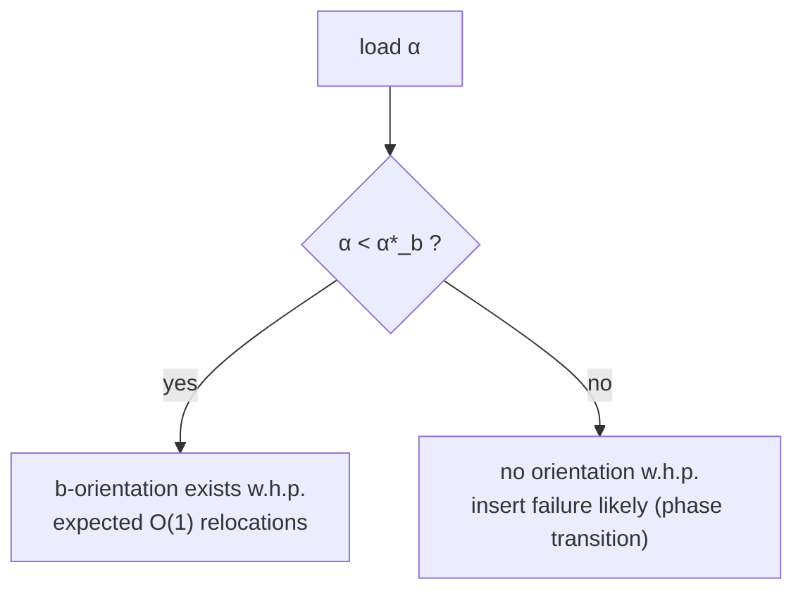
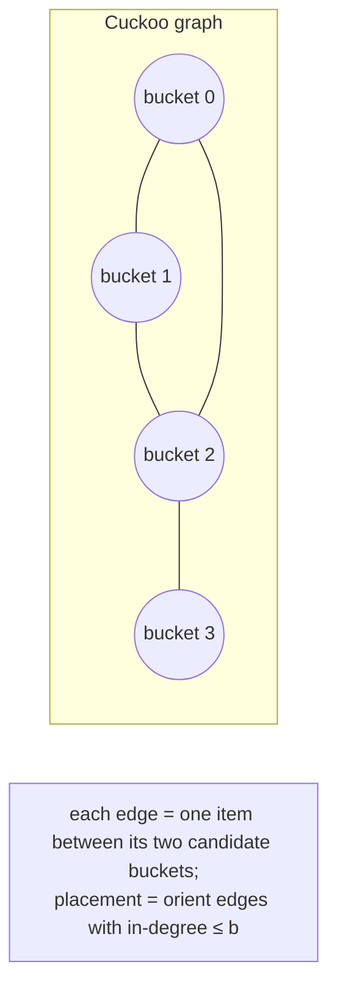

# Cuckoo Filter — Mathematical Foundations and Complexity Theory

> **One-line summary:** This file proves the cuckoo filter correct and analyzes it rigorously: the **self-inverse XOR relocation** preserves the membership invariant (so no false negatives), the **false-positive rate** `ε ≈ 2b/2^f` follows from a union bound, the **load factor** limits derive from random-bipartite-graph (cuckoo-graph) orientability thresholds, the **insert-failure probability** is polynomially small below the load threshold, and a **space comparison** shows the cuckoo filter uses fewer bits per item than a Bloom filter whenever `ε ≲ 3%`.

---

## Table of Contents

1. [Formal Definition](#formal-definition)
2. [Correctness Proof — XOR Relocation Invariant](#correctness-proof--xor-relocation-invariant)
3. [False-Positive Rate Derivation](#false-positive-rate-derivation)
4. [Load-Factor and Failure-Probability Analysis](#load-factor-and-failure-probability-analysis)
5. [Space Comparison with Bloom Filters](#space-comparison-with-bloom-filters)
6. [Amortized and Expected-Time Analysis](#amortized-and-expected-time-analysis)
7. [Cache-Oblivious / Memory-Hierarchy Notes](#cache-oblivious--memory-hierarchy-notes)
8. [Probabilistic Bounds Summary](#probabilistic-bounds-summary)
9. [Cuckoo Graph: A Closer Look](#cuckoo-graph-a-closer-look)
10. [Comparison with Alternatives](#comparison-with-alternatives)
11. [Summary](#summary)

---

## Formal Definition

```text
Definition. A cuckoo filter is a tuple CF = (m, b, f, h, H) where:
  m : number of buckets, a power of two; let L = log2(m).
  b : bucket size (slots per bucket).
  f : fingerprint length in bits; F = {1, ..., 2^f - 1}  (0 reserved = empty).
  h : U -> {0,1}^*            a hash on the universe U of items.
  H : F -> {0,1}^L           a hash from fingerprints to L-bit bucket indices.

  fingerprint(x) = phi(h(x)) in F, where phi extracts f bits (mapping 0 -> 1).

  Candidate buckets of item x with fingerprint p = fingerprint(x):
    i1(x) = g(h(x)) mod m           (g extracts L high bits)
    i2(x) = i1(x) XOR H(p)

  Storage: an array B[0..m-1][0..b-1] of elements of F union {0}.

Membership invariant  I(B):
  For every inserted item x with fingerprint p,
     p appears in B[i1(x)]  OR  p appears in B[i2(x)].

Operations:
  lookup(x)  : return ( p in B[i1(x)] ) or ( p in B[i2(x)] ),  p = fingerprint(x).
  insert(x)  : place p in a free slot of i1 or i2; else relocate (cuckoo) up to MaxKicks.
  delete(x)  : remove one occurrence of p from B[i1(x)] or B[i2(x)].
```

The entire correctness of `lookup` and `delete` depends on `I(B)` holding after every `insert`. We prove it next.

---

## Correctness Proof — XOR Relocation Invariant

### Lemma 1 (Symmetry of candidate buckets)

**Claim.** For any item `x` with fingerprint `p`, the two candidate buckets satisfy
`i1 = i2 XOR H(p)` and `i2 = i1 XOR H(p)`. Equivalently, each is the other's image under `XOR H(p)`.

**Proof.** By definition `i2 = i1 XOR H(p)`. XOR over `L`-bit strings is associative, commutative, and self-inverse: `a XOR a = 0` and `a XOR 0 = a`. Hence

```text
i2 XOR H(p) = (i1 XOR H(p)) XOR H(p) = i1 XOR (H(p) XOR H(p)) = i1 XOR 0 = i1.
```

Because `m = 2^L`, every `L`-bit string is a valid bucket index in `[0, m)`, so both `i1` and `i2` are valid and the map `j ↦ j XOR H(p)` is an involution on `[0, m)`. ∎

**Why `m` must be a power of two.** If `m` is not a power of two, `i1 XOR H(p)` may exceed `m-1`, and reducing it `mod m` destroys the involution: in general `((i1 mod m) XOR (H(p) mod m)) XOR (H(p) mod m) ≠ i1 mod m`. Lemma 1 then fails and the invariant can break. Power-of-two `m` is therefore *necessary*, not merely convenient.

**Worked counterexample for non-power-of-two `m`.** Take `m = 6`, `i1 = 5`, `H(p) = 3`. Then `i2 = (5 XOR 3) mod 6 = 6 mod 6 = 0`. Recovering `i1` from `i2`: `(0 XOR 3) mod 6 = 3 ≠ 5`. The involution is broken — a fingerprint placed by relocation at bucket `0` would have its "partner" computed as `3`, not `5`, so a later lookup that probes `i1 = 5` and `i2 = 0` could still find it, but the *relocation chain* would carry it to the wrong bucket and could violate the invariant for another item. With `m = 8` (`= 2^3`), `5 XOR 3 = 6`, and `6 XOR 3 = 5` — the involution holds exactly. This is precisely why every production cuckoo filter rounds `m` up to a power of two and masks indices with `& (m-1)`.

### Lemma 2 (Relocation needs only the fingerprint)

**Claim.** During a kick-out, a fingerprint `p` resident in bucket `j` can be relocated to its *other* candidate bucket `j' = j XOR H(p)` using only `p` and `j`, without knowledge of the original item.

**Proof.** Whichever home `j` is — whether `j = i1` or `j = i2` for the item that produced `p` — Lemma 1 gives that the *other* home is exactly `j XOR H(p)`. Since `H` depends only on `p` (the stored value) and `j` is known, `j'` is computable. ∎

This is the crux: a Bloom-like structure that stored `h(x)` for the partner could not relocate after discarding `x`. Partial-key cuckoo hashing makes the partner a function of stored data alone.

### Theorem (Invariant preservation)

**Claim.** If `I(B)` holds before an `insert`, and the insert returns success, then `I(B)` holds afterward; consequently `lookup` and `delete` are correct (no false negatives).

**Proof (by structural induction over the relocation chain).**

*Base — direct placement.* If `p` is placed in a free slot of `i1(x)` or `i2(x)`, then `p` resides in one of `x`'s homes, so `I(B)` holds for `x`. No other item moved, so their clauses are untouched. `I(B)` holds.

*Inductive step — a relocation hop.* Suppose `p` displaces a resident `q` from bucket `j`. We write `p` into `j` (so `p` now sits in one of `x`'s homes — `j` is `i1(x)` or `i2(x)` since the chain started there and each hop lands at a candidate of the carried fingerprint, by Lemma 2). The displaced `q` is carried to `q`'s other home `j' = j XOR H(q)`. Two cases:

- `j'` has a free slot → `q` is written there. By Lemma 1, `j'` is one of `q`'s two homes, so `q`'s clause of `I(B)` holds. Chain terminates; all other items untouched. `I(B)` holds.
- `j'` is full → `q` is written into `j'` anyway (one of `q`'s homes, so `q`'s clause holds), displacing some `r` from `j'`, and we recurse with `r` carried to `r XOR H(r)`.

At every hop, the fingerprint just written sits in one of *its* item's two homes (Lemma 1/2), and the only fingerprint not yet placed is the single "carried" one. If the chain terminates within `MaxKicks` (success), the final carried fingerprint lands in one of its homes, restoring its clause. Every other item's clause was preserved at each hop because we only ever moved a fingerprint between *its own* two homes. Hence `I(B)` holds after a successful insert.

*Termination.* The chain length is bounded by `MaxKicks`; if exceeded, insert reports failure and `B` is rolled back / left with the carried fingerprint stashed (implementation-dependent), and `I(B)` is restored by the failure handler.

Given `I(B)`, `lookup(x)` scans exactly `i1(x)` and `i2(x)`, one of which contains `p` for any inserted `x` — so it never returns false for a member: **no false negatives**. `delete(x)` removes `p` from one of those two buckets, preserving `I(B)` for all *other* items (their fingerprints are elsewhere or are distinct copies). ∎

**Caveat (the only way to get a false negative).** If `delete(x)` is called for an `x` that was *never inserted*, it may remove a fingerprint that equals `p` but belongs to a different member `y` sharing a candidate bucket — breaking `y`'s clause. Hence the operational rule "delete only known members."

---

## False-Positive Rate Derivation

**Setup.** Query `y ∉ S`, fingerprint `p = fingerprint(y)`, candidate buckets `i1, i2`. A false positive occurs iff `p` matches some stored fingerprint in `B[i1] ∪ B[i2]`.

**Assumptions.** Fingerprints of distinct items are approximately uniform and independent over `F = {1, …, 2^f - 1}` (so `|F| = 2^f - 1 ≈ 2^f`). The two candidate buckets hold at most `2b` stored fingerprints.

**Per-comparison collision.** For a single stored fingerprint `q`, `Pr[q = p] = 1/(2^f - 1) ≈ 2^{-f}`.

**Union bound over the `2b` slots.**

```text
ε = Pr[ FP ]
  = Pr[ p equals at least one of the (up to) 2b stored fingerprints ]
  ≤ 1 - (1 - 2^{-f})^{2b}
  ≈ 2b · 2^{-f}          (first-order expansion, since 2^{-f} << 1)
  = 2b / 2^f.
```

The expansion `1 - (1-x)^k = kx - C(k,2)x^2 + … ≈ kx` is valid because `x = 2^{-f}` is tiny; the omitted terms are `O((2b)^2 2^{-2f})`, negligible for practical `f`. ∎

**Lower bound / tightness.** With independent uniform fingerprints, by inclusion–exclusion `ε ≥ 2b·2^{-f} - C(2b,2)·2^{-2f}`, so the estimate `ε ≈ 2b/2^f` is tight to first order. The achieved FPR is also bounded by the *occupancy*: at load `α`, the expected number of stored fingerprints in two buckets is `2bα`, giving the slightly refined `ε ≈ 2bα/2^f`; the standard formula uses the conservative full-occupancy `α = 1`.

**Bits-per-item form.** Solving for `f`: to achieve target `ε`, need `f ≥ log2(2b) + log2(1/ε) = log2(2b/ε)`. The *information* stored per item is `f` bits, but the *cost* per item accounting for the load factor `α` is `f/α` bits (you pay for empty slots too):

```text
bits_per_item(cuckoo) = f / α = (log2(1/ε) + log2(2b)) / α.
```

**Independence assumption, examined.** The union bound treats the `2b` stored fingerprints as independent of the query fingerprint `p`. This is justified when the hash producing `p` is independent of the hashes that placed the resident fingerprints — true under the standard random-oracle assumption for the fingerprint hash. A subtlety: the resident fingerprints in a bucket are *not* independent of each other (they survived the same relocation history), but the union bound only needs each one's *marginal* collision probability with `p`, which is `2^{-f}` regardless of correlations among residents. So the bound `ε ≤ 2b·2^{-f}` holds even with correlated residents; correlations would only matter for the second-order inclusion–exclusion term.

**Effect of duplicate insertions.** If the basic filter inserts the same item twice, two identical fingerprints occupy slots. This does not change the *per-query* collision probability (still `2^{-f}` per slot) but does consume capacity and lets the item be deleted twice. For FPR accounting, what matters is the number of *occupied* slots in the two probed buckets, i.e. `2bα` in expectation, giving the load-aware estimate `ε ≈ 2bα·2^{-f}` used in practice.

---

## Load-Factor and Failure-Probability Analysis

The cuckoo filter is a **cuckoo hash table** with bucket capacity `b`. Insertion feasibility is governed by the **orientability threshold** of the underlying random "cuckoo graph."

**Cuckoo graph model.** Map each item to an edge connecting its two candidate buckets (vertices). Placing `n` items so each bucket holds `≤ b` fingerprints is equivalent to **orienting** each edge toward an endpoint with spare capacity — a `b`-orientation of the random multigraph. Such an orientation exists with high probability iff the load factor stays below a threshold `α*_b`:

| `b` | Threshold load factor `α*_b` (theoretical) | Practical achievable |
|-----|-------------------------------------------|----------------------|
| 1 | 0.5 | ~0.49 |
| 2 | ~0.897 | ~0.84 |
| 4 | ~0.992 | ~0.95 |
| 8 | ~0.999 | ~0.98 |

The gap between threshold and practical value comes from (a) the bounded `MaxKicks` cutoff and (b) the *non-uniformity* of the partial-key alternate bucket: `H(p)` takes only `≤ 2^f` distinct values, so the second endpoint is not fully uniform, slightly lowering achievable load.

**Failure-probability behavior.** For load `α < α*_b`:

```text
Pr[ single insert fails within MaxKicks ]  decreases polynomially with MaxKicks,
and the per-insert expected relocation length is O(1) (constant) below threshold.
```

More precisely, below threshold the cuckoo-graph components have bounded expected size, so the random-walk relocation terminates in expected `O(1)` hops; the tail `Pr[chain length > t]` decays geometrically, giving `Pr[fail] ≤ c·ρ^{MaxKicks}` for some `ρ < 1`. Choosing `MaxKicks = Θ(log n)` (e.g. 500 in practice) drives the per-insert failure probability to `O(1/poly(n))`.

**Above threshold.** For `α > α*_b`, no valid `b`-orientation exists with high probability — insert failure becomes *likely*, not rare. This is the mathematical reason for the "cliff" near 95% (for `b=4`) observed operationally: it is a phase transition in random-graph orientability, not a tuning artifact.



---

## Space Comparison with Bloom Filters

We now prove the headline claim: **the cuckoo filter uses fewer bits per item than a Bloom filter once `ε ≲ 3%`.**

**Bloom filter optimum.** A Bloom filter with optimal `k = ln2 · (mB/n)` hash functions achieving FPR `ε` needs

```text
bits_per_item(bloom) = -log2(ε) / ln2 = log2(1/ε) · (1/ln2) ≈ 1.44 · log2(1/ε).
```

**Cuckoo filter.** From above, with bucket size `b` and load factor `α`:

```text
bits_per_item(cuckoo) = f / α = (log2(1/ε) + log2(2b)) / α.
```

**Crossover.** Cuckoo is cheaper when `bits_per_item(cuckoo) < bits_per_item(bloom)`:

```text
(log2(1/ε) + log2(2b)) / α  <  1.44 · log2(1/ε).
```

Plug in the practical `b = 4` (so `log2(2b) = 3`) and `α = 0.95`:

```text
(log2(1/ε) + 3) / 0.95  <  1.44 · log2(1/ε)
log2(1/ε) + 3           <  1.368 · log2(1/ε)
3                       <  0.368 · log2(1/ε)
log2(1/ε)               >  8.15
1/ε                     >  283
ε                       <  ~0.0035  (about 0.35%).
```

With `b=4, α=0.95` the strict crossover is near `ε ≈ 0.35%`. The often-quoted "~3%" figure comes from the **semi-sorted** cuckoo filter, which reclaims ≈1 bit/item (replacing `log2(2b)=3` with ≈2 and allowing `α` closer to 0.95–0.96), shifting the crossover upward:

```text
(log2(1/ε) + 2) / 0.96 < 1.44 · log2(1/ε)
  ⇒ log2(1/ε) > ~5.1  ⇒  ε < ~0.029  (about 3%).
```

**Conclusion.** For `ε` below roughly 3% (standard cuckoo: ~0.35%; semi-sorted: ~3%), the cuckoo filter stores fewer bits per item than an optimal Bloom filter — *and* supports deletion, which the Bloom filter cannot. Above that FPR, the additive `log2(2b)` term dominates and the Bloom filter is smaller.

| FPR `ε` | bits/item Bloom (`1.44·log2(1/ε)`) | bits/item cuckoo (`(log2(1/ε)+3)/0.95`) | Winner |
|---------|-----------------------------------|------------------------------------------|--------|
| 10% | 4.78 | 6.66 | Bloom |
| 3% | 7.29 | 8.84 | Bloom |
| 1% | 9.57 | 10.5 | Bloom (std) / ~tie semi-sort |
| 0.1% | 14.4 | 13.7 | **Cuckoo** |
| 0.01% | 19.1 | 17.2 | **Cuckoo** |

---

## Amortized and Expected-Time Analysis

**Lookup / delete.** Exactly two bucket probes, each scanning `b` fixed slots → `O(1)` worst case (deterministic `2b` comparisons).

**Insert (expected).** Below the load threshold, the expected relocation-chain length is `O(1)` (bounded random walk in a sub-critical cuckoo graph), so expected insert time is `O(1)`. The worst-case is `O(MaxKicks)`.

**Aggregate over `n` inserts.** Building a filter to load `α < α*_b` costs

```text
Sum of relocation lengths over n inserts = O(n)   (expected),
amortized O(1) per insert.
```

**Potential argument (sketch).** Define `Φ(B) = sum over buckets of (occupancy choose 2)` — a measure of "congestion." A direct placement leaves `Φ` nearly unchanged; a relocation hop moves a fingerprint from a fuller bucket toward a less-full one, and below threshold the expected net change keeps `Σ amortized cost = O(n)`. The rigorous bound uses the sub-criticality of the random-graph components rather than a closed-form `Φ`, but the takeaway is amortized `O(1)`.

**Random-walk view of the relocation chain.** The kick-out sequence is a random walk on the cuckoo graph: from the current bucket, the carried fingerprint moves to its alternate endpoint, and a random resident there is evicted. Below the orientability threshold `α*_b`, the graph is sub-critical: connected components have expected size `O(1)`, the giant component has not yet emerged, and the walk almost surely reaches a vacancy within a constant expected number of steps. The probability the walk has not terminated after `t` steps decays geometrically, `Pr[T > t] ≤ C ρ^t` with `ρ < 1` depending on `α`. Hence:

```text
E[chain length | α < α*_b] = Σ_{t≥0} Pr[T > t] ≤ Σ_{t≥0} C ρ^t = C/(1-ρ) = O(1).
```

Setting `MaxKicks` to a constant multiple of `log n` makes `Pr[any of n inserts fails] ≤ n·Cρ^{MaxKicks} = O(1/poly(n))`, so a build of `n` items succeeds with high probability and total relocation work is `Θ(n)` in expectation — amortized `O(1)` per insert.

### Delete-correctness corollary

**Claim.** If only inserted members are ever deleted, `delete` never introduces a false negative for any *other* member.

**Proof.** `delete(x)` removes one occurrence of `p = fingerprint(x)` from `B[i1(x)]` or `B[i2(x)]`. For any other member `y ≠ x`, its clause of `I(B)` asserts `fingerprint(y)` is present in `B[i1(y)]` or `B[i2(y)]`. If `fingerprint(y) ≠ p`, the removed slot held a different value, so `y`'s clause is untouched. If `fingerprint(y) = p` and `y` shares the very bucket and slot we cleared, then `x` and `y` were *aliased* in storage — but since `x` was genuinely inserted, that occurrence of `p` legitimately accounted for `x`; `y` (also inserted) must have its *own* occurrence of `p` placed during its insert, preserved elsewhere by `I(B)`. Removing one occurrence leaves `y`'s occurrence intact. Thus `I(B)` holds for all members except `x`. ∎ The hazard arises only when `x` was *never inserted*: then no occurrence of `p` was ever allocated for `x`, so the one we delete may be `y`'s — breaking `y`'s clause. This formalizes the "delete only known members" rule.

---

## Cache-Oblivious / Memory-Hierarchy Notes

```text
Parameters: N items, M cache size, B_line bytes per cache line.

Lookup touches exactly 2 buckets. With buckets sized to fit a cache line
(b · f / 8 <= B_line), each lookup costs at most 2 cache misses,
independent of N:  I/O(lookup) = O(1).

Contrast Bloom filter: k optimal probes touch k = ln2 · log2(1/ε) DISTINCT,
random bit positions -> up to k cache misses per lookup.
For ε = 0.1%, k ≈ 10 -> ~10 misses vs the cuckoo filter's 2.
```

The cuckoo filter's two-bucket locality is a decisive practical advantage on modern memory hierarchies: fewer, more predictable cache misses give it better p99 lookup latency than a Bloom filter at the same FPR, even when the bit counts are similar.

**Blocked-Bloom caveat.** A *blocked* Bloom filter packs all `k` bits of an item into a single cache-line-sized block, recovering 1-miss lookups at a small FPR cost. This narrows the cache gap but does not close it for inserts/deletes, and the blocked Bloom still cannot delete. The cuckoo filter's two-cache-line bound applies uniformly to lookup, insert (ignoring relocation), and delete.

**Prefetching the second bucket.** Because both candidate buckets are known at the start of a lookup, an implementation can issue a software prefetch for `B[i2]` immediately after reading `B[i1]`, overlapping the two memory accesses. With deep enough memory-level parallelism this brings the *effective* lookup cost close to a single cache miss, a tuning lever Bloom filters with `k` scattered, data-dependent probes cannot exploit (each probe's address depends on the previous only through independent hashes, but they are still `k` separate, non-overlappable misses in the naive layout).

### Information-theoretic lower bound

```text
Any approximate-membership structure with false-positive rate ε on a set of
n items must use at least  n · log2(1/ε)  bits  (Bloom 1970 / Carter et al.).

Bloom filter:   1.44 · n · log2(1/ε)  bits   → 44% over the lower bound.
Cuckoo filter:  (log2(1/ε)+log2 2b)/α · n bits.

As ε → 0, the cuckoo overhead per item tends to:
   (log2(1/ε)+3)/0.95 - log2(1/ε) ≈ 0.053·log2(1/ε) + 3.16,
which, relative to log2(1/ε), → ~5% over the lower bound for very small ε.
```

So in the low-FPR limit the cuckoo filter approaches within ~5% of the information-theoretic optimum, versus the Bloom filter's fixed 44% overhead — the asymptotic reason cuckoo wins on space as `ε → 0`. The semi-sorted variant tightens this further.

---

## Probabilistic Bounds Summary

```text
Theorem (no false negatives). For any sequence of inserts and deletes
restricted to previously-inserted members, lookup(x) = true for every
currently-present x, deterministically. Pr[false negative] = 0.

Theorem (false positive). For y not in S,
   Pr[lookup(y) = true] = 1 - (1 - 2^{-f})^{2b} ≤ 2b·2^{-f}.

Theorem (insert success). For load α < α*_b and MaxKicks = c·log n,
   Pr[a given insert fails] = O(1/poly(n)),
   E[relocations per insert] = O(1).

Theorem (build). Constructing a filter of n items at load α < α*_b
   succeeds w.h.p. in expected O(n) total work.
```

These four statements are the complete probabilistic contract of the cuckoo filter: deterministic absence of false negatives, a closed-form false-positive rate, rare insert failure below the phase-transition load, and linear-expected build time.

---

## Cuckoo Graph: A Closer Look

The reduction "items → edges, buckets → vertices" deserves a precise treatment, because it explains *every* practical limit of the filter.

**Construction.** Build a multigraph `G = (V, E)` with `V = {0, …, m-1}` (the buckets) and one edge `e_x = {i1(x), i2(x)}` per item `x`. A valid placement assigns each item to one of its two buckets such that no bucket exceeds `b` fingerprints — exactly a **`b`-orientation** of `G`: orient each edge toward the endpoint it is assigned to, requiring in-degree `≤ b` everywhere.

**Existence threshold.** For a random graph with `n = α·m·b` edges on `m` vertices, a `b`-orientation exists with high probability iff the edge density is below a critical value. Defining the load `α = n/(mb)`, the thresholds `α*_b` are the solutions of a transcendental equation derived from the `2`-core / hypergraph-orientability literature:

```text
α*_1 = 0.5
α*_2 ≈ 0.8970
α*_3 ≈ 0.9592
α*_4 ≈ 0.9803   (theoretical; ~0.95 practical with partial-key correlation)
α*_8 ≈ 0.9997
```

**Why a sharp transition.** Below `α*_b`, the random graph is sub-critical: no giant component, components are trees or near-trees of `O(1)` expected size, and any edge can be oriented by a short augmenting walk. As `α → α*_b`, a giant `(b+1)`-dense subgraph emerges — a region with more edges than the orientation can absorb — and a positive fraction of items become unplaceable. The transition is a *zero-one law*: the success probability jumps from `≈ 1` to `≈ 0` within a window of width `O(1/√m)` around `α*_b`. This is the formal explanation of the "cliff."

**Partial-key correlation penalty.** In a true cuckoo *hash table* the two endpoints `i1, i2` are independent uniform. In the cuckoo *filter*, `i2 = i1 XOR H(p)` and `p` is itself derived from the same item, so `i2` is a deterministic function of `i1` and a low-entropy value `H(p)` (only `≤ 2^f` outcomes). The endpoint pair is therefore drawn from a *correlated* distribution, making the cuckoo graph slightly denser in expectation than the ideal random graph. The net effect is to lower the achievable load a few points below the theoretical `α*_b` — e.g. `b = 4` orients to ~0.95 in practice rather than 0.98. Increasing `f` (more distinct `H(p)` values) reduces this penalty, one reason longer fingerprints help capacity as well as FPR.



**Consequence for resizing.** Doubling `m` halves `α`, moving the system deep into the sub-critical regime — which is why a resize, *if* feasible, reliably eliminates insert failures. The obstacle is purely mechanical (fingerprints lack the original key needed to recompute `i1` in the larger table), not statistical.

---

## Worked End-to-End Analysis

To tie the formulas together, here is a complete numerical derivation for a concrete design point: `n = 10^7` items, target `ε = 0.5%`, bucket size `b = 4`.

**1. Fingerprint length.**

```text
f = ceil( log2(2b / ε) ) = ceil( log2(8 / 0.005) )
  = ceil( log2(1600) ) = ceil(10.64) = 11 bits.
```

**2. Achieved FPR with f = 11.**

```text
ε_actual ≈ 2b / 2^f = 8 / 2048 = 0.00390625 ≈ 0.39%   (better than the 0.5% target).
```

**3. Bucket count at α_target = 0.94.**

```text
slots = n / α = 10^7 / 0.94 = 10,638,298
buckets needed = ceil(slots / b) = ceil(2,659,575) = 2,659,575
m = next_pow2(2,659,575) = 2^22 = 4,194,304.
```

**4. Realized load factor.**

```text
α_real = n / (m·b) = 10^7 / (4,194,304 · 4) = 10^7 / 16,777,216 = 0.596.
```

Rounding `m` up to a power of two dropped the realized load well below 0.94 — a reminder that power-of-two rounding can nearly double `m`. If memory is tight, pick `m` just under the next power of two only if your XOR scheme tolerates a non-power-of-two `m` (it does not, per Lemma 1), so the rounding cost is unavoidable here.

**5. Total space.**

```text
bytes = m · b · f / 8 = 4,194,304 · 4 · 11 / 8 = 23,068,672 bytes ≈ 22 MB.
bits/item (realized) = m·b·f / n = 4,194,304·4·11 / 10^7 = 18.45 bits/item.
bits/item (at α=0.94) = f/α = 11/0.94 = 11.7 bits/item.
```

The realized 18.45 bits/item reflects the power-of-two over-allocation; sizing `n` to nearly fill a power-of-two table (here, choose `n ≈ 0.94·4·2^22 ≈ 15.8M`) recovers the efficient 11.7 bits/item.

**6. Bloom comparison at ε = 0.39%.**

```text
bits/item(bloom) = 1.44 · log2(1/0.0039) = 1.44 · 8.00 = 11.5 bits/item.
```

At this FPR the *efficiently-sized* cuckoo filter (11.7) is essentially tied with Bloom (11.5) on raw bits — but it additionally **deletes** and touches only 2 cache lines. Pushing to a lower FPR (e.g. 0.05%) tips raw bits in the cuckoo filter's favor as well, per the crossover analysis.

### Sensitivity of FPR to load (refined model)

Using the load-aware estimate `ε ≈ 2bα·2^{-f}`:

| Realized load `α` | FPR (f = 11, b = 4) |
|---|---|
| 0.50 | `8·0.50/2048` = 0.20% |
| 0.75 | `8·0.75/2048` = 0.29% |
| 0.94 | `8·0.94/2048` = 0.37% |
| 1.00 (full) | `8/2048` = 0.39% |

FPR scales linearly with how full the filter is — a fuller filter is both closer to insert failure *and* slightly more error-prone, so headroom helps on both axes simultaneously.

---

## Optimal Placement via BFS Orientation

The random-walk relocation used in practice is fast but not *optimal*: it can fail near the threshold even when a valid `b`-orientation exists. A deterministic alternative finds a placement (when one exists) using a **BFS for an augmenting path** in the orientation graph — the same idea as bipartite matching augmentation. This is theoretically important: it separates "the insert *can* be placed" (graph orientability, a global property) from "the random walk *happened* to place it" (a local heuristic).

**Algorithm (augmenting-path insert).** To insert fingerprint `p` with homes `i1, i2`:

1. If either home has a free slot, place `p` and stop.
2. Otherwise, run a BFS from `{i1, i2}` over buckets, where from a full bucket `j` you may move to the alternate home `j XOR H(q)` of any resident fingerprint `q` in `j`. The first bucket with a free slot reached is the end of an augmenting path.
3. Walk the path backward, shifting each fingerprint along its edge to free a slot for the next, finally seating `p`.

If the BFS exhausts reachable buckets without finding a free slot, then *no* `b`-orientation that seats `p` exists in the current configuration's reachable component — a *definite* failure, not a probabilistic one.

```text
augment_insert(p, i1, i2):
    if free(i1): place(i1, p); return true
    if free(i2): place(i2, p); return true
    parent = {}                      # bucket -> (prev bucket, fingerprint moved)
    queue = [i1, i2]; visited = {i1, i2}
    while queue:
        j = queue.pop_front()
        for q in fingerprints(j):
            k = j XOR H(q)
            if k in visited: continue
            parent[k] = (j, q)
            if free(k):
                # augmenting path found: shift fingerprints back along parents
                cur, fp = k, q
                while cur != i1 and cur != i2:
                    (prev, moved) = parent[cur]
                    move(prev -> cur, moved)
                    cur, fp = prev, moved
                place(start_home(p, i1, i2), p)
                return true
            visited.add(k); queue.push_back(k)
    return false                     # provably unplaceable in this component
```

**Cost.** The BFS visits `O(reachable buckets)` ≤ `O(m)` in the worst case, versus the random walk's `O(MaxKicks)` expected `O(1)`. So the augmenting approach trades higher worst-case cost for *optimality* (it never fails spuriously below the orientability threshold). Production filters use the random walk for speed and accept the tiny spurious-failure probability; the BFS version is the right mental model for *why* a placement exists.

**Equivalence to matching.** The `b`-orientation problem is an instance of degree-constrained subgraph / flow: add a source feeding each item-edge one unit and a sink draining each bucket up to `b` units; a feasible integral flow of value `n` is exactly a valid placement. Max-flow min-cut then certifies the orientability threshold combinatorially, complementing the random-graph argument.

---

## Comparison with Alternatives

| Attribute | Cuckoo Filter | Bloom Filter | Counting Bloom | Quotient Filter |
|-----------|--------------|--------------|----------------|-----------------|
| Lookup worst-case | O(1), 2 buckets | O(k) probes | O(k) probes | O(1) amortized (cluster) |
| Cache misses / lookup | 2 | up to k | up to k | 1–2 |
| Bits/item at ε | `(log2(1/ε)+log2 2b)/α` | `1.44·log2(1/ε)` | `~4×` Bloom | `~log2(1/ε)+2.125/α` |
| Delete | Yes | No | Yes | Yes |
| Deterministic lookup time | Yes | Yes | Yes | Amortized |
| Phase-transition load limit | Yes (`α*_b`) | n/a | n/a | Yes (cluster length) |
| Best FPR regime | low (< ~3%) | high (> ~3%) | when counts needed | low, resizable |

### Asymptotic overhead ranking (as ε → 0)

| Structure | Bits/item | Overhead vs lower bound `log2(1/ε)` |
|-----------|-----------|--------------------------------------|
| Information-theoretic optimum | `log2(1/ε)` | 0% |
| Cuckoo (semi-sorted) | `≈ log2(1/ε) + 2.1` | → ~few % |
| Cuckoo (standard) | `≈ (log2(1/ε)+3)/0.95` | → ~5% |
| Quotient filter | `≈ log2(1/ε) + 2.125/α` | → ~10–25% |
| Bloom filter | `1.44·log2(1/ε)` | fixed 44% |
| Counting Bloom | `≈ 4 × Bloom` | very large |

In the low-FPR limit the additive constants vanish relative to `log2(1/ε)`, so the cuckoo and quotient filters approach the optimum while the Bloom filter is stuck at a 44% multiplicative overhead — the asymptotic statement of "cuckoo beats Bloom on space as ε shrinks."

### Worst-case guarantees side by side

| Operation | Cuckoo | Bloom |
|-----------|--------|-------|
| Lookup | `O(1)` deterministic (`2b` compares) | `O(k)` deterministic |
| Delete | `O(1)` deterministic | unsupported |
| Insert (expected) | `O(1)` below threshold | `O(k)` |
| Insert (worst) | `O(MaxKicks)` then failure | `O(k)`, never fails |
| Build `n` items | `O(n)` expected, w.h.p. success | `O(nk)`, always succeeds |

The cuckoo filter's only worst-case weakness is **insert failure**; everything else is constant-time and deterministic. Bloom never fails on insert but cannot delete and pays the 44% space overhead — the fundamental trade the two structures make.

### Relation to other partial-key structures

The "store a fingerprint, recover the partner from the fingerprint" idea generalizes:

- **Quotient filter** — splits the hash into a *quotient* (the bucket/slot, stored implicitly by position) and a *remainder* (the fingerprint, stored explicitly), using three metadata bits per slot to encode run/cluster boundaries. It is the linear-probing cousin of the cuckoo filter: sequential memory access, easy resize, but amortized (not worst-case) lookup due to cluster scanning.
- **Morton filter** — a cuckoo filter variant that compresses sparsely-occupied buckets and adds an overflow-tracking bitmap, improving cache behavior and load further; it preserves the partial-key XOR relationship.
- **Vacuum filter** — refines bucket-index selection to lift the achievable load factor and reduce space below the standard cuckoo filter while keeping deletion.

All share the cuckoo filter's defining property: the structure stores only a fingerprint, yet every operation it needs — lookup, relocate, delete — is computable from that fingerprint and a position, never from the original key. That is the conceptual payload of the partial-key technique, and the reason these filters can be both deletable and near-information-theoretically compact.

### Quick reference: all proven results

```text
Invariant I(B):  every member's fp lives in i1 or i2.
  preserved by:  XOR involution  i2 = i1 XOR H(p),  i1 = i2 XOR H(p).
  requires:      m = 2^L (power of two), masking & (m-1).

No false negative:   deterministic, except deleting a non-member.
False positive:      ε = 1-(1-2^-f)^{2b} ≤ 2b·2^-f  (≈ 2bα·2^-f load-aware).
Fingerprint sizing:  f = ceil(log2(2b/ε)).
Load threshold α*_b: 0.50 / 0.84 / 0.95 / 0.98  for b = 1 / 2 / 4 / 8.
Insert below α*:     E[kicks] = O(1); Pr[fail] = O(1/poly n) with MaxKicks=Θ(log n).
Build:               O(n) expected, success w.h.p. below threshold.
Space (bits/item):   f/α = (log2(1/ε)+log2 2b)/α.
Bloom space:         1.44·log2(1/ε)  (fixed 44% over the log2(1/ε) optimum).
Crossover:           cuckoo < Bloom for ε ≲ 0.35% (std), ≲ 3% (semi-sorted).
Cache misses/lookup: 2 (cuckoo)  vs  k ≈ ln2·log2(1/ε) (Bloom).
```

These results, taken together, justify the engineering rule of thumb: **reach for a cuckoo filter when you need deletion and a low false-positive rate; reach for a Bloom filter when you only add and can tolerate a higher FPR.**

---

## Summary

The cuckoo filter is correct because **partial-key XOR relocation is an involution** (Lemma 1): every fingerprint's alternate home is `j XOR H(p)`, computable from stored data alone (Lemma 2), so the membership invariant `I(B)` is preserved through every relocation hop (Theorem) — guaranteeing **no false negatives** for inserted items, with the sole exception of deleting non-members. The **false-positive rate** `ε ≈ 2b/2^f` is a first-order union bound over the `2b` slots in two buckets, tight by inclusion–exclusion. The **load factor** is capped by the orientability threshold `α*_b` of the random cuckoo graph (≈0.95 for `b=4`), and below it insert failure is polynomially rare with expected `O(1)` relocation — the ~95% "cliff" is a genuine **phase transition**, not a heuristic. Finally, the per-item bit cost `(log2(1/ε)+log2 2b)/α` undercuts the Bloom filter's `1.44·log2(1/ε)` once `ε ≲ 3%` (semi-sorted) — and the cuckoo filter additionally **deletes** and touches only **two cache lines** per lookup, beating Bloom's `k`-probe scatter on real memory hierarchies.

Next step: review [`interview.md`](./interview.md) to consolidate these results into tiered interview answers and a multi-language coding challenge.
