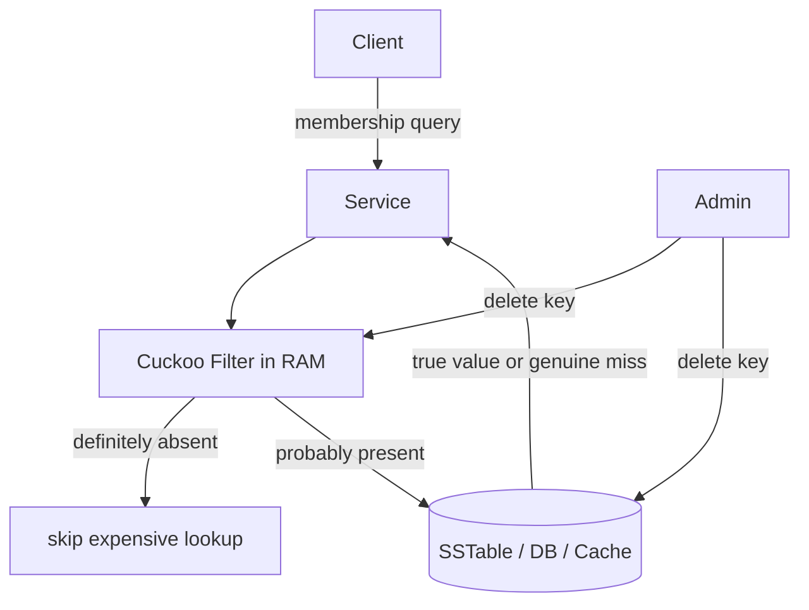
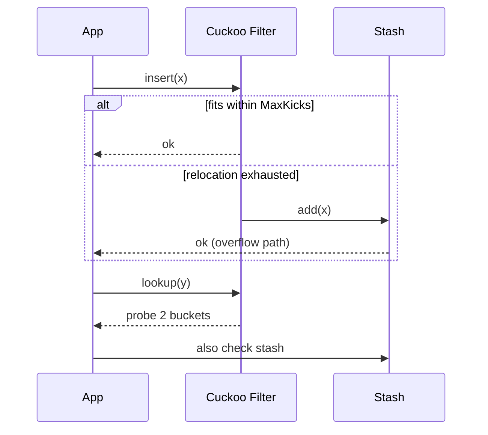
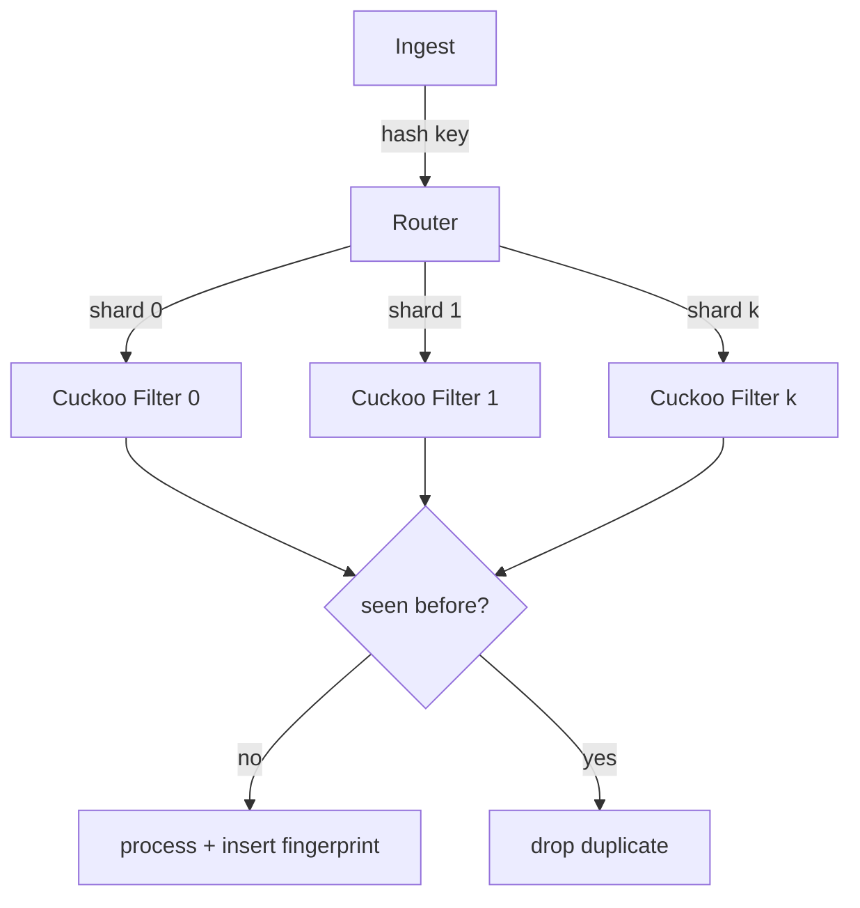
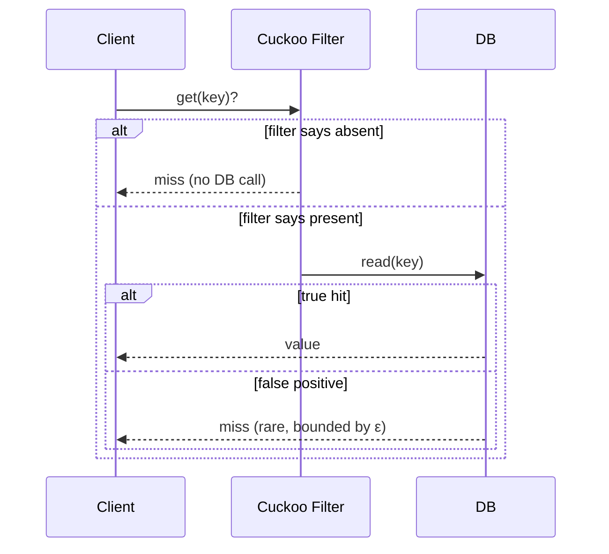

# Cuckoo Filter — Senior Level

> **One-line summary:** Senior engineers reach for a cuckoo filter when a membership check must be **cheap, low-FPR, and deletable** — deduplication with expiry, LSM/SSTable key-presence checks, cache admission, and network/DB membership. The hard parts at this level are not the XOR trick but the *systems* concerns: sizing for a workload, handling **insert failure** and resize, choosing it over counting-Bloom and quotient filters, and making it safe under concurrency, persistence, and distribution.

---

## Table of Contents

1. [Introduction](#introduction)
2. [System Design with Cuckoo Filters](#system-design-with-cuckoo-filters)
3. [Sizing for Production](#sizing-for-production)
4. [Insert-Failure Handling and Resize](#insert-failure-handling-and-resize)
5. [Distributed and Persistent Membership](#distributed-and-persistent-membership)
6. [Comparison with Alternatives](#comparison-with-alternatives)
7. [Architecture Patterns](#architecture-patterns)
8. [Code Examples](#code-examples)
9. [Observability](#observability)
10. [Failure Modes](#failure-modes)
11. [Summary](#summary)

---

## Introduction

> Focus: "How to architect systems around cuckoo filters?"

A Bloom filter is the default approximate-membership building block in storage and networking. Engineers reach past it to a cuckoo filter for one of two reasons: they need **deletion** (the set changes over time), or they want the **smallest possible filter at a low FPR** (below ~3%, the cuckoo filter wins on bytes). Both reasons are common in real systems — TTL-based deduplication, SSTable key filters where compaction removes keys, cache admission policies that evict — so the cuckoo filter has become a standard tool.

The senior-level questions are operational:

- **How big should the filter be** for `n` items at FPR `ε`, and how much headroom do I leave?
- **What happens when an insert fails** at high load, and how do I resize a structure that stores only fingerprints?
- **How does it behave under concurrency, persistence, and across nodes?**
- **When is a counting Bloom or quotient filter the better engineering choice?**

This file answers those, with production-shaped code.

---

## System Design with Cuckoo Filters

The canonical placement: a cuckoo filter sits *in front of* an expensive lookup (disk, network, or a large in-memory map) and absorbs negative queries cheaply, while staying correct under deletes.



Three load-bearing properties make this work:

1. **No false negatives** — if the filter says "absent," the item is truly absent, so skipping the backing store is safe.
2. **Deletable** — when a key is removed from the backing store, the filter can drop its fingerprint too, so it does not accumulate stale "probably present" answers forever (a real weakness of plain Bloom filters under churn).
3. **Two-bucket lookups** — each query touches exactly two cache lines, giving predictable p99 latency.

### Workloads that fit

| System | Membership question | Why cuckoo over Bloom |
|--------|--------------------|----------------------|
| LSM-tree / SSTable | "Could key `k` be in this file?" | Deletes/compaction remove keys; low FPR matters |
| Deduplication with TTL | "Have I seen this event recently?" | Old events expire → need delete |
| Cache admission (TinyLFU-style) | "Is this key worth caching?" | Sliding window → entries age out |
| Network routers / scrubbers | "Is this flow on the blocklist?" | Blocklist updates remove entries; tight memory |
| Distributed dedup | "Did another node process this id?" | Mergeable, low-FPR, deletable |

---

## Sizing for Production

Sizing answers: *given `n` items and target FPR `ε`, how many buckets `m`, bucket size `b`, and fingerprint bits `f`?*

**Step 1 — fingerprint bits.** From the FPR formula `ε ≈ 2b/2^f`:

```text
f = ceil( log2(2b / ε) )
```

**Step 2 — bucket size.** Default `b = 4` (95% max load, good FPR balance). Use `b = 8` only when you need to push load above 95%.

**Step 3 — bucket count.** Target a comfortable load factor `α_target` (≈ 0.90 leaves headroom below the 0.95 cliff):

```text
slots  = ceil(n / α_target)
m      = next_power_of_two( ceil(slots / b) )
```

**Step 4 — total bytes.** Each slot holds `f` bits:

```text
bytes ≈ m · b · f / 8
```

### Worked example

`n = 100,000,000`, `ε = 0.001` (0.1%), `b = 4`, `α_target = 0.90`.

```text
f      = ceil(log2(2·4 / 0.001)) = ceil(log2(8000)) = ceil(12.97) = 13 bits
slots  = ceil(1e8 / 0.90) = 111,111,112
m      = next_pow2(ceil(111,111,112 / 4)) = next_pow2(27,777,778) = 33,554,432
bytes  = 33,554,432 · 4 · 13 / 8 ≈ 218 MB
```

A Bloom filter at the same `n` and `ε` needs `n · 1.44 · log2(1/ε) ≈ 1e8 · 1.44 · 9.97 ≈ 179 MB` of *bits* → ~180 MB, but at this very low FPR the cuckoo filter is competitive and additionally supports deletes; at higher FPR (e.g. 3%) the cuckoo filter's per-item bit cost drops below Bloom's. The crossover is the key sizing insight (full analysis in `professional.md`).

| Parameter | Symbol | Typical value |
|-----------|--------|---------------|
| Bucket size | `b` | 4 |
| Target load | `α_target` | 0.90 |
| Fingerprint bits | `f` | `ceil(log2(2b/ε))` |
| Max kicks | `MaxKicks` | 500 |
| Bucket count | `m` | power of two |

### Sizing checklist

Before deploying, walk this checklist so the filter is neither under- nor over-provisioned:

1. **Peak item count.** Size for the *maximum* number of *live* fingerprints, not the steady-state. Under deletes, an item's fingerprint frees a slot, so the relevant figure is the high-water mark of simultaneously-present items.
2. **Headroom.** Choose `α_target ≈ 0.90`, not 0.95, so transient bursts do not push you over the orientability cliff and start failing inserts.
3. **Fingerprint length.** Derive from the *worst* FPR you can tolerate, then round up to a byte boundary if your storage packs bytes (8, 16 bits) — odd widths cost extra bit-twiddling.
4. **Power-of-two buckets.** Round `m` up; this both satisfies the XOR involution and lets you mask with `& (m-1)` instead of a modulo.
5. **Memory budget check.** Compute `m·b·f/8` and confirm it fits your RAM budget with room for the rest of the process. If it does not, you may need to accept a higher FPR or shard across machines.
6. **Failure policy.** Decide *now* — pre-size only, resize, or stash — because retrofitting a resize onto a fingerprint-only table later is painful.

### Why steady-state vs peak matters under deletes

A subtle production trap: people size a TTL-dedup filter for the *average* number of live items and are surprised by insert failures during a traffic spike. Because deletion lags ingestion (items expire on a timer, not instantly), the number of *live* fingerprints can spike well above the average. Always size for the peak of `inserts − deletes` over your retention window, and monitor the load factor so you see the spike coming.

---

## Insert-Failure Handling and Resize

The defining operational hazard is **insert failure**: above ~95% load, a relocation chain can exceed `MaxKicks` and the insert returns failure even though no slot is *logically* unavailable. A senior design must decide in advance how to respond.

**Option A — Pre-size and never overflow.** Size for peak `n` at `α_target = 0.90`. Treat any insert failure as a capacity-planning alarm. This is the most common production choice because it keeps the data path simple.

**Option B — Resize (double `m`).** Allocate a `2m`-bucket table and re-distribute existing fingerprints. The catch: with only fingerprints (no original items), you cannot recompute `i1 = hash(item)`. Two workarounds:

- Keep an **auxiliary list of original items** if you have them (then a true rehash is possible), or
- Use a filter design where the bucket index can be *split* on resize (some implementations store extra hash bits to allow doubling without the original key — analogous to extendible hashing).

**Option C — Stash / secondary structure.** Keep a small overflow "stash" (a few items in an exact set) to catch the rare insert that cannot be placed; lookups also check the stash. This bounds failure probability dramatically at tiny extra cost.



**Recommended default:** Option A (pre-size with headroom) plus a small **Option C stash** as a safety net. Resizing (Option B) is reserved for designs that retain keys or carry split-bits.

---

## Distributed and Persistent Membership

### Persistence

A cuckoo filter is a flat array of fingerprints, so it serializes trivially: write `m`, `b`, `f`, and the packed bucket bytes. On reload it is immediately queryable. This makes it ideal as the **per-SSTable filter** persisted alongside the data file — load it into RAM at open time, drop it when the file is compacted away.

### Merging and sharding

Two cuckoo filters built with the *same* `m`, `b`, `f`, and hash functions are **mergeable**: a fingerprint present in one can be inserted into the other (subject to capacity). This supports:

- **Sharded membership:** route items to per-shard filters by key hash; a query checks only its shard's filter.
- **Roll-ups:** merge per-window filters into a coarser aggregate (capacity permitting).

Unlike Bloom filters (which merge by bitwise OR, trivially), cuckoo-filter merge must re-insert fingerprints and can hit capacity — a trade-off to plan for.

### Distributed dedup pattern



---

## Comparison with Alternatives

| Attribute | Cuckoo Filter | Bloom Filter | Counting Bloom | Quotient Filter |
|-----------|--------------|--------------|----------------|-----------------|
| Delete | Yes | No | Yes | Yes |
| Space at ε < 3% | **Best** | Good | ~4× Bloom | Comparable |
| Lookup cache lines | 2 | `k` (scattered) | `k` | 1–2 (clustered) |
| Resize / grow | Hard (fingerprint-only) | Hard | Hard | **Easier** (mergeable, resizable) |
| Insert failure | Yes (high load) | No | No | Yes (cluster overflow) |
| Mergeable | Yes (re-insert) | Yes (OR) | Yes (add counts) | Yes |
| Persistence | Trivial (flat array) | Trivial | Trivial | Trivial |
| Production usage | RedisBloom (CF), TiKV, CockroachDB-adjacent | Cassandra, HBase, BigTable | network hardware | some KV stores |

**Decision guide for a senior engineer:**

- Need **delete** + **low FPR** + **tight memory** → cuckoo filter.
- Insert-only, higher FPR acceptable, want zero failure handling → Bloom filter.
- Need delete **and multiplicity counts**, space is plentiful → counting Bloom filter (`23-counting-bloom-filter`).
- Need delete + **frequent resize/merge** + sequential scans → quotient filter.

---

## Architecture Patterns

### Pattern: Filter-before-store read path



The filter converts most negative lookups into a two-bucket RAM probe instead of a disk/network round trip; only false positives (rate `ε`) leak through to the store.

### Pattern: Delete-on-evict consistency

Whenever the backing store removes a key (TTL expiry, eviction, compaction), the same key's fingerprint is deleted from the filter in the *same* transaction or write path. This keeps the filter from drifting into permanent over-reporting — the failure mode that makes plain Bloom filters unusable under heavy churn.

---

## Code Examples

### Thread-safe cuckoo filter with a stash and metrics

#### Go

```go
package main

import (
	"fmt"
	"hash/fnv"
	"math/rand"
	"sync"
)

type SafeFilter struct {
	mu       sync.RWMutex
	buckets  [][]uint16
	stash    map[uint16]int // overflow fingerprints with multiplicity
	b, m     int
	fpMask   uint16
	count    int
	failures int
	maxKicks int
}

func NewSafe(m, b, fBits int) *SafeFilter {
	bk := make([][]uint16, m)
	for i := range bk {
		bk[i] = make([]uint16, b)
	}
	return &SafeFilter{buckets: bk, stash: map[uint16]int{},
		b: b, m: m, fpMask: uint16((1 << fBits) - 1), maxKicks: 500}
}

func h64(s string) uint64 { h := fnv.New64a(); h.Write([]byte(s)); return h.Sum64() }
func (f *SafeFilter) fp(h uint64) uint16 {
	v := uint16(h) & f.fpMask
	if v == 0 { v = 1 }
	return v
}
func (f *SafeFilter) idx(h uint64) int { return int(h>>32) & (f.m - 1) }
func (f *SafeFilter) alt(i int, fp uint16) int {
	return (i ^ f.idx(h64(fmt.Sprintf("fp%d", fp)))) & (f.m - 1)
}
func (f *SafeFilter) put(i int, fp uint16) bool {
	for s := 0; s < f.b; s++ {
		if f.buckets[i][s] == 0 { f.buckets[i][s] = fp; return true }
	}
	return false
}

func (f *SafeFilter) Insert(item string) bool {
	f.mu.Lock()
	defer f.mu.Unlock()
	h := h64(item)
	fp := f.fp(h)
	i1 := f.idx(h)
	i2 := f.alt(i1, fp)
	if f.put(i1, fp) || f.put(i2, fp) { f.count++; return true }
	i := i1
	if rand.Intn(2) == 1 { i = i2 }
	for n := 0; n < f.maxKicks; n++ {
		s := rand.Intn(f.b)
		fp, f.buckets[i][s] = f.buckets[i][s], fp
		i = f.alt(i, fp)
		if f.put(i, fp) { f.count++; return true }
	}
	f.stash[fp]++ // overflow into stash instead of failing
	f.failures++
	f.count++
	return true
}

func (f *SafeFilter) Lookup(item string) bool {
	f.mu.RLock()
	defer f.mu.RUnlock()
	h := h64(item)
	fp := f.fp(h)
	if f.stash[fp] > 0 { return true }
	i1 := f.idx(h)
	i2 := f.alt(i1, fp)
	for _, i := range []int{i1, i2} {
		for s := 0; s < f.b; s++ {
			if f.buckets[i][s] == fp { return true }
		}
	}
	return false
}

func (f *SafeFilter) Stats() (load float64, failures int) {
	f.mu.RLock()
	defer f.mu.RUnlock()
	return float64(f.count) / float64(f.m*f.b), f.failures
}

func main() {
	f := NewSafe(4096, 4, 12)
	for i := 0; i < 14000; i++ { f.Insert(fmt.Sprintf("k%d", i)) }
	load, fails := f.Stats()
	fmt.Printf("load=%.3f stash-overflows=%d\n", load, fails)
}
```

#### Java

```java
import java.util.*;
import java.util.concurrent.locks.ReentrantReadWriteLock;

public class SafeFilter {
    private final ReentrantReadWriteLock lock = new ReentrantReadWriteLock();
    private final int[][] buckets;
    private final Map<Integer,Integer> stash = new HashMap<>();
    private final int b, m, fpMask, maxKicks = 500;
    private int count, failures;
    private final Random rng = new Random();

    public SafeFilter(int m, int b, int fBits) {
        this.m = m; this.b = b; this.fpMask = (1 << fBits) - 1;
        buckets = new int[m][b];
    }
    private long h64(String s) {
        long h = 1125899906842597L;
        for (int i = 0; i < s.length(); i++) h = 31*h + s.charAt(i);
        h ^= (h>>>33); h *= 0xff51afd7ed558ccdL; h ^= (h>>>33); return h;
    }
    private int fp(long h){ int v=(int)(h&fpMask); return v==0?1:v; }
    private int idx(long h){ return (int)((h>>>32)&(m-1)); }
    private int alt(int i,int fp){ return (i ^ idx(h64("fp"+fp))) & (m-1); }
    private boolean put(int i,int fp){
        for(int s=0;s<b;s++) if(buckets[i][s]==0){buckets[i][s]=fp;return true;}
        return false;
    }

    public boolean insert(String item) {
        lock.writeLock().lock();
        try {
            long h=h64(item); int fp=fp(h), i1=idx(h), i2=alt(i1,fp);
            if(put(i1,fp)||put(i2,fp)){count++;return true;}
            int i = rng.nextBoolean()?i1:i2;
            for(int n=0;n<maxKicks;n++){
                int s=rng.nextInt(b), victim=buckets[i][s];
                buckets[i][s]=fp; fp=victim; i=alt(i,fp);
                if(put(i,fp)){count++;return true;}
            }
            stash.merge(fp,1,Integer::sum); failures++; count++; return true;
        } finally { lock.writeLock().unlock(); }
    }

    public boolean lookup(String item) {
        lock.readLock().lock();
        try {
            long h=h64(item); int fp=fp(h);
            if(stash.getOrDefault(fp,0)>0) return true;
            int i1=idx(h), i2=alt(i1,fp);
            for(int i:new int[]{i1,i2})
                for(int s=0;s<b;s++) if(buckets[i][s]==fp) return true;
            return false;
        } finally { lock.readLock().unlock(); }
    }

    public double loadFactor(){ return (double)count/(m*b); }
    public int failures(){ return failures; }

    public static void main(String[] a){
        SafeFilter f = new SafeFilter(4096,4,12);
        for(int i=0;i<14000;i++) f.insert("k"+i);
        System.out.printf("load=%.3f overflow=%d%n", f.loadFactor(), f.failures());
    }
}
```

#### Python

```python
import random
import threading


class SafeFilter:
    def __init__(self, m, b=4, f_bits=12):
        self.m, self.b = m, b
        self.fp_mask = (1 << f_bits) - 1
        self.buckets = [[0] * b for _ in range(m)]
        self.stash = {}
        self.count = self.failures = 0
        self.max_kicks = 500
        self.lock = threading.RLock()

    @staticmethod
    def _h64(s): return hash(("seed", s)) & 0xFFFFFFFFFFFFFFFF
    def _fp(self, h): v = h & self.fp_mask; return v if v else 1
    def _idx(self, h): return (h >> 32) & (self.m - 1)
    def _alt(self, i, fp): return (i ^ self._idx(self._h64(f"fp{fp}"))) & (self.m - 1)
    def _put(self, i, fp):
        for s in range(self.b):
            if self.buckets[i][s] == 0:
                self.buckets[i][s] = fp
                return True
        return False

    def insert(self, item):
        with self.lock:
            h = self._h64(item); fp = self._fp(h)
            i1 = self._idx(h); i2 = self._alt(i1, fp)
            if self._put(i1, fp) or self._put(i2, fp):
                self.count += 1; return True
            i = random.choice((i1, i2))
            for _ in range(self.max_kicks):
                s = random.randrange(self.b)
                fp, self.buckets[i][s] = self.buckets[i][s], fp
                i = self._alt(i, fp)
                if self._put(i, fp):
                    self.count += 1; return True
            self.stash[fp] = self.stash.get(fp, 0) + 1
            self.failures += 1; self.count += 1
            return True

    def lookup(self, item):
        with self.lock:
            h = self._h64(item); fp = self._fp(h)
            if self.stash.get(fp, 0) > 0:
                return True
            i1 = self._idx(h); i2 = self._alt(i1, fp)
            return fp in self.buckets[i1] or fp in self.buckets[i2]

    def load_factor(self): return self.count / (self.m * self.b)


if __name__ == "__main__":
    f = SafeFilter(4096, 4, 12)
    for i in range(14000):
        f.insert(f"k{i}")
    print(f"load={f.load_factor():.3f} overflow={f.failures}")
```

---

## Observability

| Metric | What it tells you | Alert threshold |
|--------|------------------|-----------------|
| `cf_load_factor` | How full the filter is | > 0.90 (approaching insert-failure cliff) |
| `cf_insert_failures_total` | Relocation chains exceeding MaxKicks | > 0 sustained → resize/repartition |
| `cf_stash_size` | Items in the overflow stash | growing → undersized filter |
| `cf_false_positive_estimate` | Sampled FPR vs target | > 2× target `ε` → fingerprint too short |
| `cf_lookup_latency_p99` | Two-bucket probe cost | > a few µs → cache/contention issue |
| `cf_relocation_kicks_avg` | Mean kicks per insert | rising → load too high |

Track `cf_load_factor` and `cf_insert_failures_total` together — a rising load factor is the leading indicator; failures are the lagging alarm.

---

## Failure Modes

- **Insert-failure storm at high load:** load creeps past 0.95 and inserts begin failing en masse. *Mitigation:* pre-size with headroom; add a stash; repartition or resize before reaching the cliff.
- **Filter drift under churn:** if deletes are not applied when the backing store removes keys, the filter keeps saying "probably present." *Mitigation:* delete-on-evict consistency in the same write path.
- **False negative from bad delete:** deleting an item never inserted removes a colliding member's fingerprint. *Mitigation:* delete-if-present; only delete known members.
- **Merge capacity overflow:** combining two filters exceeds the target's capacity, causing insert failures during merge. *Mitigation:* size the merge target for the union, or merge into a fresh larger filter.
- **Hash-quality degradation:** a weak hash makes fingerprints non-uniform, inflating FPR and shortening max load. *Mitigation:* use a strong, well-mixed hash; derive index and fingerprint from independent bits.

### Failure-mode decision table

| Symptom | Likely cause | First response |
|---------|-------------|----------------|
| Inserts failing in bursts | Load > 0.90, near the cliff | Add headroom / repartition; engage stash |
| Filter says "present" for deleted keys | Deletes not propagated from store | Wire delete-on-evict into the write path |
| Sudden FPR jump | Fingerprint too short, or hash collisions | Re-derive `f`; verify hash mixing |
| Merge throws insert failures | Target undersized for the union | Merge into a fresh, larger filter |
| Lookups slow under load | Lock contention on a single big filter | Shard and lock per shard |

### Operational runbook (condensed)

When paged on `cf_insert_failures_total > 0` sustained:

1. Check `cf_load_factor`. If `> 0.92`, the filter is over capacity — repartition or grow the deployment.
2. Check `cf_stash_size`. If growing, the stash is absorbing overflow but masking an undersized filter; schedule a resize.
3. Check the delete path: confirm `cf_load_factor` is not inflated by missing delete-on-evict (compare live store keys vs filter `count`).
4. If FPR alarms also fire, verify the hash function quality — a regressed hash both inflates FPR and shortens max load.

The single most important invariant to protect operationally is **delete-on-evict**; without it, the load factor only ever rises and the filter eventually degenerates into "everything is probably present."

---

## Summary

At the senior level the cuckoo filter is a **systems component**, chosen when membership must be cheap, low-FPR, and **deletable** — LSM/SSTable key filters, TTL deduplication, cache admission, network blocklists, distributed dedup. Sizing follows directly from the FPR formula (`f = ceil(log2(2b/ε))`) and a target load factor near 0.90 to stay clear of the insert-failure cliff at ~0.95. The defining operational risk is **insert failure** at high load; the standard responses are pre-sizing with headroom, an overflow **stash**, or (harder, because only fingerprints are stored) a **resize/rehash**. Against alternatives, it beats Bloom on space below ~3% FPR and on deletability, beats counting Bloom on space, and trades off against the quotient filter's easier resize. Keep the filter consistent with the backing store via **delete-on-evict**, watch `load_factor` and `insert_failures`, and you have a robust membership layer.

Next step: continue to [`professional.md`](./professional.md) for the formal correctness proof of partial-key XOR relocation, the rigorous FPR derivation, the load-factor / failure-probability analysis, and the space comparison proving cuckoo beats Bloom below ~3% FPR.
