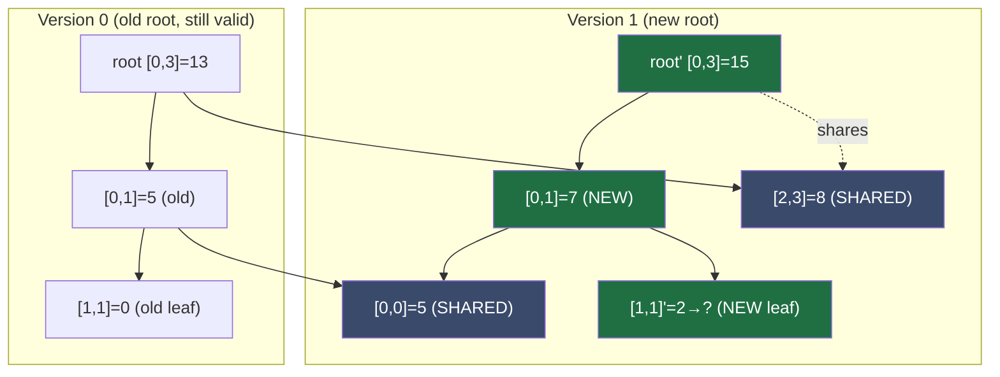
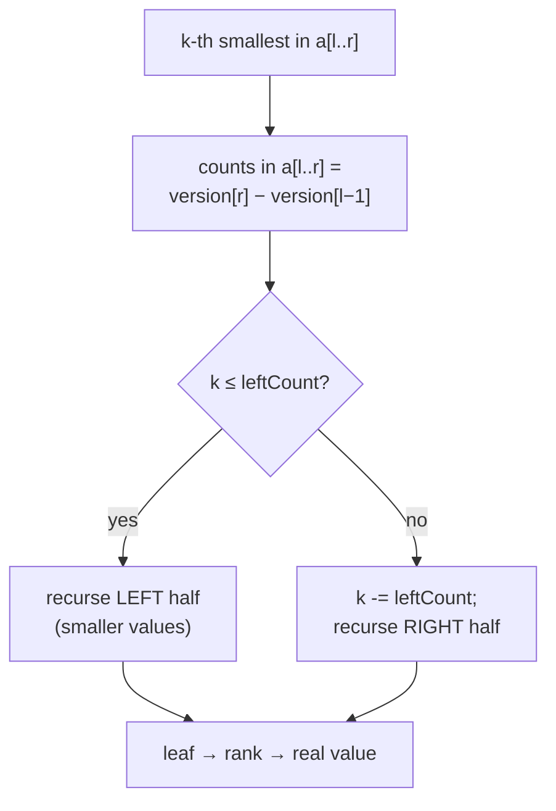

# Persistent Segment Tree — Junior Level

> **Read time: ~50 minutes** · **Audience:** Students who already know the ordinary [segment tree](../../09-trees/06-segment-tree/junior.md) (build / point update / range query in O(log n)) and now want to keep **every past version** of the structure alive at the same time.

A **persistent segment tree** is a segment tree that **never throws away its history**. Every time you update an element, instead of overwriting the old tree you create a *brand-new version* that shares almost all of its memory with the previous one. After `m` updates you can still query any of the `m + 1` versions — version 0 (the original), version 1 (after the first update), …, version `m` — each in O(log n). The trick that makes this affordable is **path copying**: an update only clones the O(log n) nodes that actually lie on the path from the root to the changed leaf, and *shares* every other subtree by pointer. So each new version costs only **O(log n)** extra memory, not O(n).

This document teaches persistence from scratch on a tiny array. We build version 0, perform an update to make version 1, and watch exactly which nodes get copied and which get shared. We finish with the killer application — **k-th smallest in a range** — explained at an intuitive level, plus a complexity table, the common-bug list, and a cheat sheet.

---

## Table of Contents

1. [Introduction — What "Persistent" Means](#introduction)
2. [Prerequisites](#prerequisites)
3. [Glossary](#glossary)
4. [Core Concepts — Immutable Nodes, Path Copying, Roots Array](#core-concepts)
5. [Big-O Summary](#big-o)
6. [Real-World Analogies](#analogies)
7. [Pros and Cons (vs ordinary segment tree, vs storing m full copies)](#pros-cons)
8. [Step-by-Step Walkthrough — Building Versions on `[5, 2, 7, 1]`](#walkthrough)
9. [The Killer Application — K-th Smallest in a Range (Intuition)](#kth-intuition)
10. [Code Examples — Go, Java, Python](#code-examples)
11. [Coding Patterns — Copy-on-Write Recursion](#patterns)
12. [Error Handling](#errors)
13. [Performance Tips](#performance-tips)
14. [Best Practices](#best-practices)
15. [Edge Cases](#edge-cases)
16. [Common Mistakes](#common-mistakes)
17. [Cheat Sheet](#cheat-sheet)
18. [Visual Animation Reference](#animation)
19. [Summary](#summary)
20. [Further Reading](#further-reading)

---

<a name="introduction"></a>
## 1. Introduction — What "Persistent" Means

An ordinary data structure is **ephemeral**: when you change it, the old state is gone. If you do `arr[2] = 99`, you can no longer read what `arr[2]` used to be. A **persistent** data structure keeps the old state available *after* the change. You get a handle to the new version, but the handle to the old version still works exactly as before.

Think of it like a code repository under Git. When you commit, you don't lose the previous commit — you can always `git checkout` an old commit and see the project exactly as it was. A persistent segment tree is the same idea applied to a segment tree: each "update" is a "commit" that produces a new version, and every old version stays queryable forever.

There are two flavours of persistence:

| Flavour | What you can do |
|---|---|
| **Partial persistence** | Read **any** past version; write **only** to the newest version. (This is the common one, and what we build here.) |
| **Full persistence** | Read **and** write to any past version, branching history into a tree of versions (like git branches). Covered in `professional.md`. |

The naive way to keep history would be to copy the whole tree on every update: `m` updates on an `n`-element array would cost **O(n·m)** memory — for `n = m = 10^5` that is 10^10 nodes, hopelessly large. The whole point of the persistent segment tree is to get the *same* "all versions available" guarantee for only **O(n + m·log n)** memory, by sharing structure between versions.

Why would anyone want every version? Three big reasons, all developed in later files:

1. **K-th smallest in a range** — the single most famous competitive-programming application. Build one version per array prefix; subtract two versions to "isolate" a sub-array, then binary-search the tree for the k-th value. (§9.)
2. **Time-travel queries** — "what was the sum of `arr[3..7]` *as of* version 4?" Answer any historical query directly.
3. **Undo / versioned state** — editors, spreadsheets, and functional-language data structures keep old versions cheaply.

Persistent segment trees were popularized in competitive programming around the 2000s and are a standard tool today; the underlying idea of **path copying** for persistence goes back to Sarnak and Tarjan (1986), *Planar Point Location Using Persistent Search Trees*.

---

<a name="prerequisites"></a>
## 2. Prerequisites

You should be comfortable with:

1. **The ordinary segment tree.** Build, point update, and range query in O(log n), and the three-way query trichotomy (disjoint / contained / partial). If this is shaky, read [`09-trees/06-segment-tree/junior.md`](../../09-trees/06-segment-tree/junior.md) first — everything here builds on it.
2. **Pointer / reference nodes.** We move from an array-backed tree (`tree[2v]`, `tree[2v+1]`) to a **node-with-pointers** tree (`node.left`, `node.right`). This is essential: path copying needs to share subtrees by pointer.
3. **Recursion that returns a value.** Our update function returns the *root of the new version* instead of mutating in place.
4. **Immutability.** Once a node is created, we never change it. New states are new nodes.
5. **(Helpful) Coordinate compression.** For the k-th-smallest application we map values to ranks `0..k-1`. We explain it in §9.

---

<a name="glossary"></a>
## 3. Glossary

| Term | Definition |
|---|---|
| **Persistence** | The property of keeping all past versions of a structure queryable after updates. |
| **Version** | A snapshot of the tree at one point in time, identified by its **root node**. |
| **Root** | The top node of one version; `roots[t]` is the root of version `t`. |
| **Ephemeral** | A normal (non-persistent) structure where updates overwrite history. |
| **Immutable node** | A node that is never modified after creation. New states allocate new nodes. |
| **Path copying** | On update, clone only the O(log n) nodes on the root-to-leaf path; share everything else by pointer. |
| **Structural sharing** | Two versions pointing at the **same** physical subtree node because that subtree didn't change. |
| **Partial persistence** | Read any version; write only the latest. |
| **Full persistence** | Read and write any version; history branches. |
| **Fat node** | An alternative to path copying: store multiple (version, value) records inside one node. (`professional.md`.) |
| **Coordinate compression** | Replacing values by their sorted rank `0..k-1` so the value axis is dense. |
| **Prefix version** | In the k-th application, version `i` = a segment tree counting how many of `arr[1..i]` fall in each value bucket. |
| **Version subtraction** | Computing per-bucket counts for `arr[l..r]` as `version[r] − version[l−1]`, node by node. |

---

<a name="core-concepts"></a>
## 4. Core Concepts — Immutable Nodes, Path Copying, Roots Array

### 4.1 From array-backed to pointer-backed nodes

The ordinary segment tree stores nodes in a flat array of size `4n` with children of `v` at `2v` and `2v+1`. That layout is great for a *single* tree, but it cannot share subtrees between versions — index `2v` always means "the left child of the only tree". For persistence we switch to **explicit node objects**:

```
Node {
    value          // the aggregate (sum, count, ...) over this node's segment
    left           // pointer/reference to left-child Node  (or null at a leaf)
    right          // pointer/reference to right-child Node (or null at a leaf)
}
```

The segment `[lo, hi]` that a node covers is **not** stored in the node — we pass it down as parameters during recursion, exactly like the recursive ordinary segment tree. This keeps nodes tiny (one value + two pointers) so that copying them is cheap.

### 4.2 Immutability: never edit, always create

The golden rule of persistence:

> **A node, once created, is never modified.** To "change" something, you build new nodes for the changed part and reuse (share) the unchanged parts.

This is exactly how immutable data structures work in functional languages (Haskell, Clojure, Scala's persistent collections). It is the reason old versions stay correct: nobody can ever mutate a node that an old version is pointing at.

### 4.3 Path copying — the key idea

When you update a single leaf, which nodes' aggregates change? Only the leaf itself and its **ancestors** — the nodes on the root-to-leaf path. Everything hanging off the side of that path is untouched.

So an update does this, recursively, from the root:

```
update(node, lo, hi, idx, delta) -> returns NEW node
    cur = clone(node)                 # copy this one node
    if lo == hi:
        cur.value += delta            # leaf: apply the change
        return cur
    mid = (lo + hi) / 2
    if idx <= mid:
        cur.left  = update(node.left,  lo,    mid, idx, delta)   # recurse left, replace pointer
        # cur.right is still the OLD right child — SHARED, not copied
    else:
        cur.right = update(node.right, mid+1, hi,  idx, delta)   # recurse right, replace pointer
        # cur.left is still the OLD left child — SHARED
    cur.value = cur.left.value + cur.right.value
    return cur
```

Read that carefully:

- We **clone** the current node (`cur = clone(node)`).
- We recurse into **only one** child (the side containing `idx`) and store the *new* child there.
- The **other child pointer is copied verbatim from the old node** — it points at the old, unchanged subtree, which we now *share* between the old and new versions.

The path from root to leaf has length `⌈log₂ n⌉ + 1`, so we create exactly that many new nodes per update. Everything else is shared.



The green nodes are the newly copied path for version 1; the blue nodes are physically shared with version 0. Only **3 new nodes** were created (root, left-internal, leaf), even though each version has 7 nodes total.

### 4.4 The roots array — addressing versions

We keep a list of roots, one per version:

```
roots = [r0, r1, r2, ...]      # roots[t] is the root node of version t
```

- `roots[0]` = the tree built from the initial array (or an all-zero tree).
- After updating `roots[t]`, we get a new root and append it: `roots.append(newRoot)`.
- To query version `t`, start the ordinary recursive query from `roots[t]`.

Because each version is just a root pointer, "switching versions" is **O(1)** — you pick a different starting node. Querying within a version is the **same O(log n)** recursion as an ordinary segment tree; it simply follows `node.left` / `node.right` instead of array indices.

### 4.5 What stays the same as the ordinary segment tree

| Aspect | Ordinary segment tree | Persistent segment tree |
|---|---|---|
| Query algorithm | Three-way trichotomy recursion | **Identical**, just on one chosen root |
| Combine / identity | sum→0, min→+∞, etc. | **Identical** |
| Node count of one tree | ~2n | ~2n (but versions share most of it) |
| Update | mutate in place, O(log n) | **clone the path**, O(log n) new nodes, return new root |
| Memory after m updates | O(n) | **O(n + m·log n)** |

The mental model: **a persistent segment tree is an ordinary segment tree whose `update` returns a new root and copies the path instead of mutating.** That one change buys you the entire version history.

---

<a name="big-o"></a>
## 5. Big-O Summary

Let `n` = array size (or number of value buckets), `m` = number of updates / versions.

| Operation | Time | Extra space |
|---|---|---|
| **Build version 0** | **O(n)** | O(n) nodes (~2n) |
| **Update → new version** | **O(log n)** | **O(log n) new nodes** |
| **Range query on any version** | **O(log n)** | O(log n) stack |
| **Pick / switch version** | **O(1)** | — |
| **K-th smallest in a range** | **O(log n)** per query | shares versions |
| **Total memory after m updates** | — | **O(n + m·log n)** |

For `n = m = 2·10^5`: total nodes ≈ `2n + m·⌈log₂ n⌉ ≈ 4·10^5 + 2·10^5·18 ≈ 4·10^6` — a few million nodes, perfectly affordable. The **naive "copy whole tree each time"** alternative would need `m·2n ≈ 8·10^10` nodes — about 20,000× more. That ratio (`2n` vs `log n` per version) is the entire reason path copying exists.

---

<a name="analogies"></a>
## 6. Real-World Analogies

### 6.1 Git commits with shared blobs
When you commit one changed file in a 10,000-file repo, Git stores a new commit object and a new tree object for the changed directory path — but the 9,999 unchanged files' blobs are **shared** with the previous commit by hash. A persistent segment tree's update is the same: a new "commit" (root) reusing almost all old "blobs" (subtrees). Checking out an old commit = querying an old root.

### 6.2 Copy-on-write filesystem snapshots
ZFS and Btrfs take instant, cheap snapshots: a snapshot is just a pointer to the current block tree; subsequent writes copy only the affected blocks (copy-on-write) and leave the snapshot's blocks intact. Path copying in a persistent segment tree is copy-on-write applied to a binary tree.

### 6.3 A library that keeps every edition of a book
Imagine a reference library where each "edition" of a manual shares all unchanged pages with the previous edition and only re-prints the pages that changed. To read edition 5 you grab edition 5's table of contents (its root); most pages it points to are physically the same paper as editions 1–4. New editions are cheap because only a few pages are re-printed.

> **Where the analogies break:** Git and ZFS deduplicate by content hash; a persistent segment tree shares by *direct pointer* set during the update — no hashing, no dedup search. And unlike a library, nothing is ever physically reprinted twice for the same change: exactly `log n` nodes per update.

---

<a name="pros-cons"></a>
## 7. Pros and Cons

### Pros
- **Every version queryable** in O(log n), forever, with O(1) version selection.
- **Cheap versions:** O(log n) memory per update, not O(n).
- **Unlocks range k-th** and other "offline" range queries that ephemeral trees cannot do directly.
- **Time-travel:** answer "as of version t" queries trivially.
- **Thread-friendly reads:** old versions are immutable, so any number of readers can read them concurrently without locks (senior.md).
- **Same query code** as the ordinary segment tree — only `update` differs.

### Cons (vs ordinary segment tree)
- **More memory:** even one version uses node objects (pointers) instead of a flat array — worse cache locality and ~2–3× the per-node overhead.
- **Allocation pressure / GC:** each update allocates `log n` nodes; in GC languages this stresses the collector (senior.md covers arenas).
- **No in-place range update with lazy** in the basic form — lazy propagation + persistence is advanced and memory-heavy.
- **More code and pointer bookkeeping** than the array form.

### Cons (vs naive "store every full copy")
- Slightly more complex update logic — but **vastly** less memory (`log n` vs `n` per version). The naive approach is only acceptable for tiny `n` or very few versions.

### Decision matrix
| Need | Use |
|---|---|
| One mutable array, range aggregate, no history | **Ordinary segment tree** |
| Range sum + point update, minimal memory | **Fenwick tree** ([here](../../09-trees/09-fenwick-tree/junior.md)) |
| **K-th smallest in a range** (offline or online) | **Persistent segment tree** |
| Answer queries "as of version t" | **Persistent segment tree** |
| Read *and* write old versions (branching) | **Fully persistent** segment tree (fat nodes) |
| Range distinct / Mo's-style offline | **Persistent segtree or Mo's algorithm** (compare in `middle.md`) |

---

<a name="walkthrough"></a>
## 8. Step-by-Step Walkthrough — Building Versions on `[5, 2, 7, 1]`

Let `n = 4`, `arr = [5, 2, 7, 1]`, aggregate = **sum**. Indices `0..3`.

### 8.1 Version 0 — build

Build a normal segment tree (with pointer nodes), root `r0`:

```
                 r0:[0,3]=15
                /          \
         [0,1]=7           [2,3]=8
         /     \           /     \
    [0,0]=5  [1,1]=2  [2,2]=7  [3,3]=1
```

Seven nodes total. `roots = [r0]`.

### 8.2 Version 1 — set `arr[1] = 6` (so the value at index 1 goes 2 → 6, a delta of +4)

We call `update(r0, lo=0, hi=3, idx=1, delta=+4)` and it **returns a new root** `r1`. Trace which nodes get cloned:

```
update(r0, [0,3], idx=1, +4):
    clone r0 → R'              (NEW node #1)
    mid = 1, idx=1 <= 1 → go LEFT
        R'.right = r0.right  (SHARE the whole [2,3]=8 subtree — no recursion there)
        R'.left  = update(r0.left, [0,1], idx=1, +4):
            clone [0,1] → L'     (NEW node #2)
            mid = 0, idx=1 > 0 → go RIGHT
                L'.left  = [0,0]=5   (SHARE leaf)
                L'.right = update([1,1], [1,1], idx=1, +4):
                    clone [1,1] → leaf'  (NEW node #3)
                    leaf' is a leaf → leaf'.value = 2 + 4 = 6
                    return leaf'
            L'.value = 5 + 6 = 11
            return L'
    R'.value = 11 + 8 = 19
    return R'
```

`roots = [r0, r1]`. Exactly **3 new nodes** were allocated (`R'`, `L'`, `leaf'`) — the root-to-leaf path of length `log₂4 + 1 = 3`.

```
 Version 1 (root r1):                Shared with version 0:
                 r1:[0,3]=19           - [2,3]=8 subtree (and its leaves 7,1)
                /          \           - [0,0]=5 leaf
         [0,1]'=11        [2,3]=8  ←───┘
         /     \
    [0,0]=5  [1,1]'=6
       ↑
     shared
```

Version 0 (`r0`) is **completely intact** — query `sum(0,3)` on `r0` still returns 15. Query the same on `r1` returns 19. Both work, both O(log n).

### 8.3 Query version 1: `sum(arr[0..1])`

Run the **ordinary** segment-tree query, but start from `r1`:

```
query(r1, [0,3], ql=0, qr=1):
    [0,3] partial → recurse children
    ├─ query(r1.left = [0,1]'=11, [0,1], 0, 1): contained → return 11
    └─ query(r1.right = [2,3]=8, [2,3], 0, 1): disjoint (2 > 1) → return 0
    combine: 11 + 0 = 11   ✓   (5 + 6 = 11)
```

### 8.4 Query the **old** version 0: `sum(arr[0..1])` should still be 7

```
query(r0, [0,3], 0, 1):
    ├─ [0,1]=7 contained → 7
    └─ [2,3]=8 disjoint → 0
    → 7   ✓   (5 + 2 = 7, the pre-update values)
```

Both answers coexist. That is persistence: the past is not destroyed.

---

<a name="kth-intuition"></a>
## 9. The Killer Application — K-th Smallest in a Range (Intuition)

This is **the** reason persistent segment trees are famous. Problem:

> Given a static array `a[1..n]`, answer many queries of the form *"what is the k-th smallest value among `a[l], a[l+1], ..., a[r]`?"* in O(log n) each.

The plan (full code in `middle.md`; here is the intuition):

1. **Coordinate compression.** Collect all distinct values, sort them, and map each value to a rank `0, 1, 2, ...`. Now values live in a dense range `[0, D)` where `D` ≤ n.

2. **Build n+1 versions — one per prefix.** The segment tree is over the **value axis** `[0, D)`, and each node stores a **count** of how many elements fall in that value range.
   - Version 0 = empty (all counts 0).
   - Version `i` = version `i−1` **plus one** at the bucket of `a[i]`. (One point update → one new version, O(log n) each.)
   - So `version[i]` is a "histogram of the first `i` elements" stored as a segment tree of counts.

3. **Isolate the sub-array by subtraction.** The histogram of `a[l..r]` is `version[r] − version[l−1]`, bucket by bucket. We never materialize this difference; we walk **both** roots in lockstep and compute counts as `cntRight − cntLeft` on the fly.

4. **Walk down to the k-th.** At each node, the left child covers the smaller half of the values. Compute `leftCount = version[r].left.count − version[l−1].left.count`.
   - If `k ≤ leftCount`, the answer is in the left half → recurse left.
   - Else subtract `leftCount` from `k` and recurse right.
   Reaching a leaf gives the value-rank of the k-th smallest; map it back to the real value.



The query walks **two** roots (version `r` and version `l−1`) down one root-to-leaf path of length O(log n), doing O(1) subtraction at each step — so **O(log n) per k-th query**. Building all versions is O(n log n) time and O(n log n) memory. This beats a merge-sort tree (O(log² n) per query) and rivals the wavelet tree (cross-link [`13-wavelet-tree`](../13-wavelet-tree/)).

We will write the full, tested code for this in `middle.md` and `interview.md`.

---

<a name="code-examples"></a>
## 10. Code Examples — Go, Java, Python

A persistent **sum** segment tree with point-add updates. Each `Update` returns the new root; old roots remain valid.

### Go
```go
package persistseg

// Node is immutable once created: never mutate fields after construction.
type Node struct {
    val         int64
    left, right *Node
}

type PersistentSegTree struct {
    n     int
    roots []*Node // roots[t] is the root of version t
}

func New(arr []int64) *PersistentSegTree {
    n := len(arr)
    st := &PersistentSegTree{n: n}
    st.roots = append(st.roots, st.build(0, n-1, arr))
    return st
}

func (st *PersistentSegTree) build(lo, hi int, arr []int64) *Node {
    if lo == hi {
        return &Node{val: arr[lo]}
    }
    mid := (lo + hi) / 2
    l := st.build(lo, mid, arr)
    r := st.build(mid+1, hi, arr)
    return &Node{val: l.val + r.val, left: l, right: r}
}

// Update creates a NEW version from version `ver`, adding delta at index idx.
// Returns the index of the new version. The old version stays valid.
func (st *PersistentSegTree) Update(ver, idx int, delta int64) int {
    newRoot := st.update(st.roots[ver], 0, st.n-1, idx, delta)
    st.roots = append(st.roots, newRoot)
    return len(st.roots) - 1
}

func (st *PersistentSegTree) update(node *Node, lo, hi, idx int, delta int64) *Node {
    if lo == hi {
        // clone the leaf with the new value; never mutate `node`
        return &Node{val: node.val + delta}
    }
    mid := (lo + hi) / 2
    cur := &Node{left: node.left, right: node.right} // clone, sharing both children for now
    if idx <= mid {
        cur.left = st.update(node.left, lo, mid, idx, delta) // recurse + replace left
        // cur.right stays = node.right  → SHARED
    } else {
        cur.right = st.update(node.right, mid+1, hi, idx, delta)
        // cur.left stays = node.left → SHARED
    }
    cur.val = cur.left.val + cur.right.val
    return cur
}

// Query returns the sum of arr[ql..qr] as of version `ver`.
func (st *PersistentSegTree) Query(ver, ql, qr int) int64 {
    return st.query(st.roots[ver], 0, st.n-1, ql, qr)
}

func (st *PersistentSegTree) query(node *Node, lo, hi, ql, qr int) int64 {
    if node == nil || qr < lo || hi < ql {
        return 0 // identity for sum
    }
    if ql <= lo && hi <= qr {
        return node.val
    }
    mid := (lo + hi) / 2
    return st.query(node.left, lo, mid, ql, qr) +
        st.query(node.right, mid+1, hi, ql, qr)
}
```

### Java
```java
public final class PersistentSegTree {
    private static final class Node {
        final long val;
        final Node left, right;
        Node(long val, Node left, Node right) { this.val = val; this.left = left; this.right = right; }
    }

    private final int n;
    private final java.util.List<Node> roots = new java.util.ArrayList<>();

    public PersistentSegTree(long[] arr) {
        this.n = arr.length;
        roots.add(build(0, n - 1, arr));
    }

    private Node build(int lo, int hi, long[] arr) {
        if (lo == hi) return new Node(arr[lo], null, null);
        int mid = (lo + hi) >>> 1;
        Node l = build(lo, mid, arr);
        Node r = build(mid + 1, hi, arr);
        return new Node(l.val + r.val, l, r);
    }

    /** Create a new version from `ver` by adding delta at idx. Returns new version index. */
    public int update(int ver, int idx, long delta) {
        Node newRoot = update(roots.get(ver), 0, n - 1, idx, delta);
        roots.add(newRoot);
        return roots.size() - 1;
    }

    private Node update(Node node, int lo, int hi, int idx, long delta) {
        if (lo == hi) return new Node(node.val + delta, null, null); // clone leaf
        int mid = (lo + hi) >>> 1;
        if (idx <= mid) {
            Node l = update(node.left, lo, mid, idx, delta);  // new left
            return new Node(l.val + node.right.val, l, node.right); // share right
        } else {
            Node r = update(node.right, mid + 1, hi, idx, delta); // new right
            return new Node(node.left.val + r.val, node.left, r);  // share left
        }
    }

    /** Sum of arr[ql..qr] as of version `ver`. */
    public long query(int ver, int ql, int qr) {
        return query(roots.get(ver), 0, n - 1, ql, qr);
    }

    private long query(Node node, int lo, int hi, int ql, int qr) {
        if (node == null || qr < lo || hi < ql) return 0L;
        if (ql <= lo && hi <= qr) return node.val;
        int mid = (lo + hi) >>> 1;
        return query(node.left, lo, mid, ql, qr)
             + query(node.right, mid + 1, hi, ql, qr);
    }
}
```

### Python
```python
import sys
sys.setrecursionlimit(1 << 20)


class Node:
    """Immutable segment-tree node. Never mutate after construction."""
    __slots__ = ("val", "left", "right")

    def __init__(self, val=0, left=None, right=None):
        self.val = val
        self.left = left
        self.right = right


class PersistentSegTree:
    def __init__(self, arr):
        self.n = len(arr)
        self.roots = [self._build(0, self.n - 1, arr)]

    def _build(self, lo, hi, arr):
        if lo == hi:
            return Node(arr[lo])
        mid = (lo + hi) // 2
        l = self._build(lo, mid, arr)
        r = self._build(mid + 1, hi, arr)
        return Node(l.val + r.val, l, r)

    def update(self, ver, idx, delta):
        """Create a new version from `ver`, adding delta at idx. Returns new version index."""
        new_root = self._update(self.roots[ver], 0, self.n - 1, idx, delta)
        self.roots.append(new_root)
        return len(self.roots) - 1

    def _update(self, node, lo, hi, idx, delta):
        if lo == hi:
            return Node(node.val + delta)            # clone leaf
        mid = (lo + hi) // 2
        if idx <= mid:
            l = self._update(node.left, lo, mid, idx, delta)
            return Node(l.val + node.right.val, l, node.right)   # share right
        else:
            r = self._update(node.right, mid + 1, hi, idx, delta)
            return Node(node.left.val + r.val, node.left, r)     # share left

    def query(self, ver, ql, qr):
        """Sum of arr[ql..qr] as of version `ver`."""
        return self._query(self.roots[ver], 0, self.n - 1, ql, qr)

    def _query(self, node, lo, hi, ql, qr):
        if node is None or qr < lo or hi < ql:
            return 0
        if ql <= lo and hi <= qr:
            return node.val
        mid = (lo + hi) // 2
        return (self._query(node.left, lo, mid, ql, qr) +
                self._query(node.right, mid + 1, hi, ql, qr))


if __name__ == "__main__":
    st = PersistentSegTree([5, 2, 7, 1])
    v1 = st.update(0, 1, +4)                 # arr[1] += 4  → version 1
    print(st.query(0, 0, 1))                 # 7   (old version, unchanged)
    print(st.query(v1, 0, 1))                # 11  (new version: 5 + 6)
    print(st.query(0, 0, 3), st.query(v1, 0, 3))  # 15 19
```

All three print `7`, `11`, then `15 19` — the old version survives the update.

---

<a name="patterns"></a>
## 11. Coding Patterns — Copy-on-Write Recursion

The single pattern that powers every persistent segment tree:

```
def persistent_op(node, lo, hi, ...):
    new = clone(node)                 # 1. COPY this node (never mutate the old one)
    if base_case(lo, hi):
        new.value = apply(...)        # 2. apply the change at the leaf
        return new
    mid = (lo + hi) // 2
    if go_left(...):
        new.left  = persistent_op(node.left, lo, mid, ...)   # 3a. recurse one side
        # new.right keeps node.right  → SHARED
    else:
        new.right = persistent_op(node.right, mid+1, hi, ...) # 3b.
        # new.left keeps node.left → SHARED
    new.value = combine(new.left.value, new.right.value)      # 4. pull up
    return new                        # 5. return the NEW root of this subtree
```

Three invariants that must always hold:

1. **Clone before you touch.** The first thing the function does is make a fresh node; it never writes into `node`.
2. **Recurse into exactly one child.** The other child is inherited unchanged — that's the sharing.
3. **Return the new node up the chain.** The caller plugs it into *its* clone. The top-level caller stores the final returned node as the new version's root.

The **query** pattern is unchanged from the ordinary segment tree (three-way trichotomy) — you just start from `roots[ver]` and follow `.left` / `.right` pointers.

---

<a name="errors"></a>
## 12. Error Handling

| Error | Cause | Fix |
|---|---|---|
| Old version's answer changed after an update | You **mutated** a shared node instead of cloning | Treat nodes as immutable; allocate a new node for every change. |
| `NullPointerException` / `nil` deref in query | Hit a `null` child (empty subtree in a count tree) | Guard `if node == nil: return identity` at the top of query. |
| Memory blows up | You copied the **whole** subtree, not just the path | Recurse into one child only; copy the other pointer verbatim. |
| Wrong version queried | Off-by-one in the roots array | `roots[0]` = initial; version after k-th update = `roots[k]`. |
| K-th query wrong | Used `version[l]` instead of `version[l-1]` | Subtract the version *before* `l`: `version[r] − version[l−1]`. |
| Stack overflow (Python) | Deep recursion on large `n` | `sys.setrecursionlimit(1<<20)` or build iteratively. |
| GC thrashing | Millions of tiny node allocations | Use a node arena / pool (see `senior.md`). |

---

<a name="performance-tips"></a>
## 13. Performance Tips

1. **Use a node arena (array of structs) instead of heap-allocating each node**, addressing children by integer index. This is the single biggest speedup in Go/Java/C++ — covered in `senior.md`.
2. **Avoid storing `[lo, hi]` in the node** — pass them as recursion parameters. Smaller nodes = better cache use.
3. **Reserve capacity** for the roots list and the node arena up front: `≈ 2n + m·⌈log₂ n⌉` nodes.
4. **In Python**, prefer `__slots__` on the node class (as above) to cut per-node memory ~40%.
5. **For k-th queries**, walk both versions in the *same* recursion so you only descend one path, not two separate queries.
6. **Build version 0 in O(n)** with one recursive pass; don't do `n` separate updates if you can build directly.

---

<a name="best-practices"></a>
## 14. Best Practices

- **Make nodes immutable by construction** (final fields in Java, no setters). It enforces correctness and lets readers run lock-free.
- **Keep a `roots` array; never reassign a single `root`.** That would silently make it ephemeral.
- **Document the aggregate** (sum? count? min?) at the top of the file.
- **Build versions in order** for prefix-based applications; version `i` always derives from version `i−1`.
- **Coordinate-compress values** before building the value-axis tree for k-th queries.
- **Unit-test against brute force**: for random arrays, compare every k-th query against sorting the sub-array.
- **Test that old versions are immutable**: snapshot a query result, perform updates, re-query the old version — it must be unchanged.

---

<a name="edge-cases"></a>
## 15. Edge Cases

| Case | Input | Expected behavior |
|---|---|---|
| Single element | `arr=[7]`, query(0,0,0) | Returns 7 |
| Update then query old version | update v0, query v0 | Unchanged result |
| Query version 0 (initial) | before any update | Original aggregates |
| Many updates to same index | update idx 2 three times | 3 new versions, each O(log n) |
| K-th with `l == r` | one-element range | The only element |
| K-th, k = range length | largest in range | Last value visited |
| Empty value range in count tree | bucket count 0 | Subtraction gives 0, recurse other side |
| `n` not a power of two | n = 5, 7 | Works — pointer tree adapts |

---

<a name="common-mistakes"></a>
## 16. Common Mistakes

1. **Mutating a node in place.** The instant you write `node.val += delta` on an existing node, every old version pointing at it is corrupted. Always create a new node.
2. **Copying both children (whole subtree).** That turns O(log n) per version into O(n) and defeats the entire purpose.
3. **Reusing one `root` variable.** Keep an array of roots; appending new versions, never overwriting.
4. **Using `version[l]` instead of `version[l−1]`** in the k-th subtraction — off-by-one that includes/excludes the wrong element.
5. **Forgetting coordinate compression**, so the value axis is huge (10^9) and the tree is enormous.
6. **Null children not handled in queries** for count trees that start empty.
7. **Storing `[lo, hi]` in each node**, doubling memory for no benefit (it's derivable from recursion).
8. **Allocating one Python object per node without `__slots__`**, ballooning memory.
9. **Building all m versions with O(n) full rebuilds** instead of O(log n) incremental updates.
10. **Assuming persistence gives free lazy range updates** — basic persistence is point updates only.

---

<a name="cheat-sheet"></a>
## 17. Cheat Sheet

```
NODE
    Node { val; left; right }      // immutable; [lo,hi] passed via recursion
    roots[t] = root of version t   // O(1) to pick a version

BUILD(lo, hi)                      // O(n) total
    if lo == hi: return Node(arr[lo])
    mid = (lo+hi)/2
    l = BUILD(lo, mid); r = BUILD(mid+1, hi)
    return Node(l.val + r.val, l, r)

UPDATE(node, lo, hi, idx, delta) -> NEW node     // O(log n) new nodes
    if lo == hi: return Node(node.val + delta)   // clone leaf
    mid = (lo+hi)/2
    if idx <= mid:
        l = UPDATE(node.left, lo, mid, idx, delta)
        return Node(l.val + node.right.val, l, node.right)   // SHARE right
    else:
        r = UPDATE(node.right, mid+1, hi, idx, delta)
        return Node(node.left.val + r.val, node.left, r)     // SHARE left
    // caller: roots.append(returned root)

QUERY(node, lo, hi, ql, qr)        // O(log n) — same as ordinary segtree
    if node==null or qr<lo or hi<ql: return IDENTITY
    if ql<=lo and hi<=qr: return node.val
    mid=(lo+hi)/2
    return combine(QUERY(node.left,lo,mid,ql,qr),
                   QUERY(node.right,mid+1,hi,ql,qr))

COMPLEXITY
    Build v0: O(n)     Update: O(log n) time & space
    Query:    O(log n) Pick version: O(1)
    Total mem after m updates: O(n + m log n)

K-TH SMALLEST IN [l..r] (intuition)
    version[i] = count histogram of a[1..i] over value axis
    counts in a[l..r] = version[r] − version[l−1]   (node-by-node)
    walk down: leftCnt = R.left.cnt − L.left.cnt
        if k <= leftCnt: go left  else: k -= leftCnt; go right
    leaf → value rank → real value
```

---

<a name="animation"></a>
## 18. Visual Animation Reference

See [`animation.html`](./animation.html). It draws two versions of a small segment tree side by side. Press **Update** and watch only the root-to-leaf **path light up green as freshly copied nodes**, while the rest of the tree stays **blue — physically shared** with the previous version. A second mode performs a **k-th-in-range query**, walking version `r` and version `l−1` down in lockstep, showing the running `k` and the left-count subtraction at each step. The info panel logs every clone/share decision, a Big-O table summarizes the costs, and a counter shows total nodes vs. nodes actually copied — making the "O(log n) per version" guarantee visible.

---

<a name="summary"></a>
## 19. Summary

- A **persistent segment tree** keeps **every past version** queryable after updates.
- The mechanism is **path copying**: an update clones only the **O(log n)** nodes on the root-to-leaf path and **shares** all other subtrees by pointer, so each new version costs **O(log n)** extra memory.
- Nodes are **immutable**; "changing" something means creating new nodes and returning a **new root**, stored in a **roots array** (O(1) version selection).
- **Queries are identical** to the ordinary segment tree — just start from the chosen version's root.
- The flagship application is **k-th smallest in a range**: build one version per prefix, then `version[r] − version[l−1]` isolates a sub-array's value histogram, and a single O(log n) descent finds the k-th value.
- Total memory after `m` updates is **O(n + m·log n)** — astronomically less than the naive O(n·m).

Master this and you can handle range-k-th, time-travel queries, and versioned arrays — the gateway to wavelet trees, merge-sort trees, and persistent balanced BSTs.

---

<a name="further-reading"></a>
## 20. Further Reading

- **Sarnak, N., Tarjan, R.E.**, *Planar Point Location Using Persistent Search Trees*, CACM 1986 — the origin of path copying for persistence.
- **Driscoll, Sarnak, Sleator, Tarjan**, *Making Data Structures Persistent*, JCSS 1989 — partial vs full persistence, fat-node method.
- **CP-Algorithms.com** — "Persistent Segment Tree" article; the standard competitive-programming treatment.
- **Codeforces / cp-algorithms** "K-th order statistic on a segment" tutorials.
- Ordinary segment tree foundation: [`09-trees/06-segment-tree`](../../09-trees/06-segment-tree/junior.md); Fenwick tree: [`09-trees/09-fenwick-tree`](../../09-trees/09-fenwick-tree/junior.md).

---

**Next step:** Continue to [`middle.md`](./middle.md) for the full k-th-smallest construction with coordinate compression, partial vs full persistence in depth, and comparisons against merge-sort trees, wavelet trees, and Mo's algorithm.
