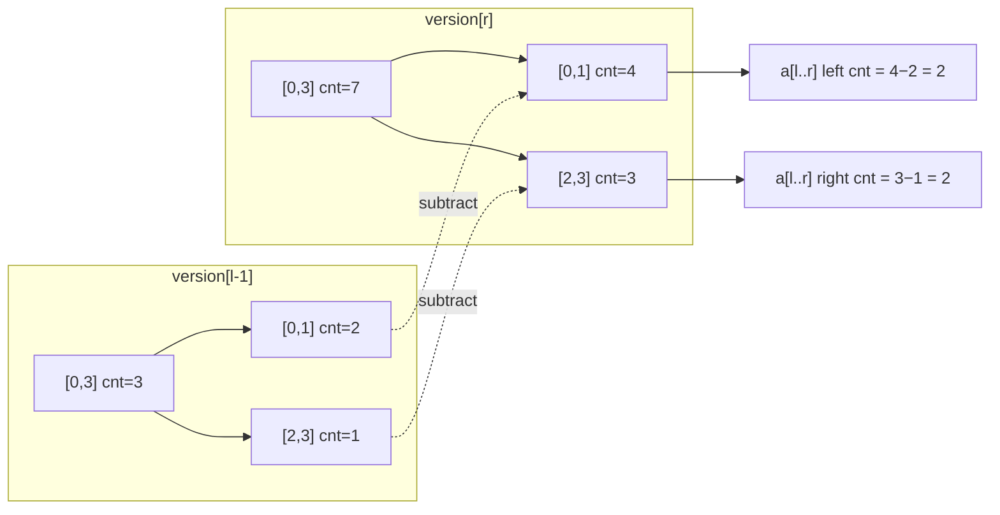

# Persistent Segment Tree — Middle Level

> **Read time: ~55 minutes** · **Audience:** Engineers who can already build a pointer-based persistent segment tree (see [`junior.md`](./junior.md)) and now want the *why* and *when*: the full **k-th smallest in a range** construction, **partial vs full persistence**, and how it stacks up against the **merge-sort tree**, **wavelet tree**, and **Mo's algorithm**.

At the junior level we learned the mechanism: immutable nodes, path copying, one root per version. At the middle level we turn that mechanism into a *toolkit*. The centerpiece is the **range k-th statistic** — given a static array and many `(l, r, k)` queries, return the k-th smallest value of `a[l..r]` in **O(log n)** each. We build it end to end with coordinate compression and tested code in all three languages. We then survey the broader family of "range query on values" data structures and give a precise decision table for when to reach for which.

---

## Table of Contents

1. [Introduction — From Mechanism to Application](#introduction)
2. [Deeper Concepts — Versions as Prefix Histograms](#deeper)
3. [Partial vs Full Persistence](#partial-full)
4. [The Range K-th Smallest Construction (Full)](#kth-full)
5. [Comparison with Alternatives — Merge-Sort Tree, Wavelet Tree, Mo's](#comparison)
6. [Advanced Patterns](#advanced-patterns)
7. [Other Applications — Range Distinct, Time-Travel, Online vs Offline](#other-apps)
8. [Code Examples — K-th Smallest in Go, Java, Python](#code-examples)
9. [Error Handling](#errors)
10. [Performance Analysis](#performance)
11. [Best Practices](#best-practices)
12. [Visual Animation](#animation)
13. [Summary](#summary)

---

<a name="introduction"></a>
## 1. Introduction — From Mechanism to Application

A persistent segment tree on its own is "a segment tree with version history". That is mildly useful. What makes it a *power tool* is a single, beautiful observation:

> If version `i` records something about the **prefix** `a[1..i]`, then the difference `version[r] − version[l−1]` records exactly that something about the **sub-array** `a[l..r]`.

Because each version is a segment tree, "difference" can be computed **node by node** while descending, without ever materializing a third tree. This converts a 2-D problem ("a query is a pair `(range, value-condition)`") into two 1-D walks. The most celebrated instance is the k-th order statistic on a segment; we develop it fully in §4. But the same prefix-difference idea powers range-distinct counting, range "number of elements ≤ x", and time-travel queries.

Two questions guide this level:

- **Why does it work?** Because counts are *additive over prefixes*, and a count segment tree is *linear* — subtracting two versions subtracts their per-bucket counts (§2).
- **When should I choose it?** Over a merge-sort tree (simpler, O(log²n) per query), a wavelet tree (same asymptotics, less memory), or Mo's algorithm (offline, O((n+q)√n))? §5 answers precisely.

---

<a name="deeper"></a>
## 2. Deeper Concepts — Versions as Prefix Histograms

### 2.1 The value-axis count tree

For the k-th problem we **do not** build the segment tree over array positions. We build it over the **value axis**. After coordinate compression, distinct values map to ranks `0, 1, …, D−1` (`D ≤ n`). A node covering value-ranks `[vlo, vhi]` stores a **count**: how many array elements (so far) have a value-rank in `[vlo, vhi]`.

- An **empty** count tree (all zeros) is version 0.
- Inserting one element of value-rank `g` = a point update "add 1 at value `g`" → produces a new version.

### 2.2 Prefix versions

Process the array left to right. After inserting `a[1], …, a[i]`, the current tree counts how many of those `i` elements fall in each value bucket. Call that root `version[i]`. So:

```
version[0] = empty tree (all counts 0)
version[i] = version[i-1] with +1 at bucket of a[i]      (one O(log n) update)
```

`version[i]` is literally a **histogram of the first `i` elements**, stored as a segment tree of counts. There are `n + 1` versions, and building them all costs `O(n log n)` time and `O(n log n)` nodes (each update adds `log n` nodes).

### 2.3 The linearity / subtraction trick

Counts are additive. The number of elements of `a[l..r]` in value bucket `B` equals:

```
count_in(a[l..r], B) = count_in(a[1..r], B) − count_in(a[1..l−1], B)
                     = version[r].count(B) − version[l−1].count(B)
```

This holds **for every node simultaneously**, because both versions have the *same shape* (same `[lo,hi]` decomposition of the value axis) — they differ only in counts. So as we descend, at any node we can compute the count of `a[l..r]` in that node's value range as `nodeR.cnt − nodeL.cnt`, walking the two roots in parallel. That is the engine of the k-th query.



### 2.4 Why two versions stay aligned

A subtle but crucial point: because every version is built by path-copying from the previous one, **corresponding nodes in version `l−1` and version `r` cover the exact same value range `[vlo, vhi]`**. They might be *different physical objects* (if that path was copied between version `l−1` and `r`) or the *same object* (if untouched), but their `[lo, hi]` semantics match because both descend with identical `mid` splits. That alignment is what lets us subtract `nodeR.left.cnt − nodeL.left.cnt` meaningfully.

---

<a name="partial-full"></a>
## 3. Partial vs Full Persistence

Persistence comes in degrees. Knowing which one you have prevents misuse.

| Property | Ephemeral | **Partial persistence** | **Full persistence** | Confluent persistence |
|---|---|---|---|---|
| Read past versions? | No | **Yes** | Yes | Yes |
| Write to past versions? | (only "now") | **No — newest only** | Yes (branches) | Yes |
| Version structure | single | **linear chain** | tree | DAG (can merge) |
| Path copying enough? | n/a | **Yes** | No — need fat nodes | Complex |
| Typical use | normal segtree | **range k-th, prefix versions** | versioned editors w/ branching undo | rope merges |

### 3.1 Partial persistence (the common case)

- You can **query** any version `0..m`, but you only ever **update the latest** to produce version `m+1`. History is a straight line.
- **Path copying suffices**: each update copies one root-to-leaf path; O(log n) per version. This is exactly what `junior.md` built and what the k-th application uses (each version derives from the immediately preceding prefix).
- 99% of competitive-programming and most engineering uses are partial.

### 3.2 Full persistence

- You can update **any** version, so the history becomes a **tree**: version 4 might spawn both version 5 (edit A) and version 6 (edit B), independently.
- Plain path copying still works for full persistence of **trees** specifically — you just keep a root per version and update from whichever root you like. (The subtlety in the literature is about making *arbitrary* pointer structures fully persistent; for a tree, path copying remains O(log n) per update.)
- The classic alternative is the **fat-node** method (Driscoll et al. 1989): each node stores a *list* of (version, value) records and you binary-search by version on read. Fat nodes give O(1) amortized space per update but O(log m) read overhead. We cover the trade-off in `professional.md`.

### 3.3 Why the distinction matters for k-th

The k-th-smallest application only needs **partial** persistence: versions form a linear chain (one per prefix), and you never edit an old prefix. So path copying — the cheapest mechanism — is all you need. Reaching for full persistence here would be over-engineering.

---

<a name="kth-full"></a>
## 4. The Range K-th Smallest Construction (Full)

Problem (classic: SPOJ MKTHNUM, "K-th Number"):

> Static array `a[1..n]`. For each query `(l, r, k)` (1 ≤ k ≤ r−l+1), output the **k-th smallest** value among `a[l..r]`.

### 4.1 Step 1 — Coordinate compression

```
sorted = sort(unique(a))                 # D distinct values
rank[v] = index of v in sorted           # value → 0..D-1   (binary search)
value[g] = sorted[g]                      # rank → value     (inverse map)
```

This makes the value axis dense `[0, D)`, so the count tree has only `D ≤ n` leaves.

### 4.2 Step 2 — Build n+1 prefix versions

```
roots[0] = build empty count tree over [0, D-1]   # all zeros
for i in 1..n:
    g = rank[a[i]]
    roots[i] = update(roots[i-1], 0, D-1, idx=g, delta=+1)
```

`O(n log D)` time, `O(n log D)` nodes.

### 4.3 Step 3 — Answer a query by walking two versions

```
kth(rootL = roots[l-1], rootR = roots[r], lo=0, hi=D-1, k):
    if lo == hi:
        return value[lo]                              # found the rank
    mid = (lo + hi) / 2
    leftCount = rootR.left.cnt − rootL.left.cnt        # # of a[l..r] in the left value-half
    if k <= leftCount:
        return kth(rootL.left,  rootR.left,  lo,    mid, k)        # k-th is among smaller values
    else:
        return kth(rootL.right, rootR.right, mid+1, hi,  k − leftCount)  # skip the left bucket
```

Each step descends one level and does O(1) work → **O(log D) ≈ O(log n)** per query. We walk *two* roots but only *one* path, so it's a single logarithmic descent, not two.

### 4.4 Worked micro-example

`a = [3, 1, 4, 1, 5]`. Distinct sorted = `[1, 3, 4, 5]`, so `rank: 1→0, 3→1, 4→2, 5→3`, `D = 4`.

Prefix histograms over buckets `{1,3,4,5}`:

| Version | inserted | counts `[#1, #3, #4, #5]` |
|---|---|---|
| 0 | — | `[0,0,0,0]` |
| 1 | 3 | `[0,1,0,0]` |
| 2 | 1 | `[1,1,0,0]` |
| 3 | 4 | `[1,1,1,0]` |
| 4 | 1 | `[2,1,1,0]` |
| 5 | 5 | `[2,1,1,1]` |

Query: 2nd smallest of `a[2..4] = [1, 4, 1]`. Use `rootL = version[1]`, `rootR = version[4]`.

Diff counts = `version[4] − version[1] = [2,0,1,0]` over `{1,3,4,5}` → the multiset `{1, 1, 4}`. Walking down with `k = 2`:

- Value axis `[0,3]`, `mid = 1`. Left half = buckets `{1,3}` (ranks 0–1). `leftCount = (#1+#3 in a[2..4]) = 2+0 = 2`. `k=2 ≤ 2` → go **left** with `k=2`.
- `[0,1]`, `mid = 0`. Left = bucket `{1}`. `leftCount = #1 = 2`. `k=2 ≤ 2` → go **left** with `k=2`.
- `[0,0]` leaf → rank 0 → value `1`. ✓ (Sorted `a[2..4]` = `[1,1,4]`; 2nd smallest = 1.)

### 4.5 Variants you get almost for free

- **Number of elements ≤ x in `a[l..r]`**: descend the value axis, summing left counts where the value range is fully ≤ x. O(log n).
- **Number of elements in `[x, y]` in `a[l..r]`**: standard range query on the *difference* of two versions. O(log n).
- **K-th smallest with updates** (array values change): combine persistence with a Fenwick tree of persistent trees, or switch to a *merge-sort tree + BIT* / *segment tree on the BIT* — heavier; sketched in `senior.md`.

---

<a name="comparison"></a>
## 5. Comparison with Alternatives

All four solve "k-th / count of values in a range". They differ in query cost, memory, online/offline, and code complexity.

| Attribute | **Persistent segtree** | Merge-sort tree | Wavelet tree | Mo's algorithm |
|---|---|---|---|---|
| Build time | O(n log n) | O(n log n) | O(n log σ) | O(n) |
| Memory | O(n log n) | O(n log n) | **O(n log σ)** (bit-packed, compact) | **O(n)** |
| Range k-th query | **O(log n)** | O(log² n) (or O(log³n) w/ BS) | **O(log σ)** | O((n+q)√n) total, offline |
| Range count ≤ x | O(log n) | O(log² n) | O(log σ) | O((n+q)√n) |
| Online? | **Yes** | Yes | Yes | **No (offline)** |
| Supports point updates? | Hard (extra structure) | Hard | Hard | **Yes (Mo with updates)** |
| Code complexity | Medium | Low–medium | High (bitvectors+rank) | Low |
| Constant factor | Medium (pointer chasing) | Low | **Very low** (bitwise) | Low |

**Choose persistent segment tree when:** you need **online** k-th / range-count queries with the cleanest O(log n) per query and you can afford O(n log n) memory; or you genuinely need version history (time-travel).

**Choose merge-sort tree when:** you want the simplest code, queries are O(log² n)-acceptable, and you only need "count of values ≤ x in a range" / k-th via outer binary search.

**Choose wavelet tree** (cross-link [`13-wavelet-tree`](../13-wavelet-tree/)) **when:** memory and constant factor matter most — bit-packed, cache-friendly, O(log σ) per query, and it does k-th, rank, select, and range-count in one structure. The trade-off is harder implementation (succinct bitvectors with rank/select).

**Choose Mo's algorithm when:** queries are **offline**, you can sort them, and you need flexible per-query aggregates (distinct count, mode, etc.) where maintaining an incremental answer is easy. O((n+q)√n) total.

### 5.1 Persistent segtree vs wavelet tree — the close call

They have the *same* asymptotic query cost for k-th. Practical guidance:

- **Wavelet tree**: ~half the memory, better cache behavior, also gives `rank`/`select`/`quantile`/`range count` uniformly. Prefer it for large `n` and read-only data.
- **Persistent segtree**: easier to extend to *weighted* counts, to combine with other segment-tree machinery, and it directly models **versioned arrays** (which a wavelet tree does not). Prefer it when you also want history or non-count aggregates per bucket.

---

<a name="advanced-patterns"></a>
## 6. Advanced Patterns

### Pattern A: Walk two versions in one recursion (k-th)
The defining pattern — pass **both** roots down, compute `right.cnt − left.cnt` at each step. Already shown in §4.3.

### Pattern B: Build versions incrementally, never from scratch
`version[i]` derives from `version[i-1]` via one point update. Never rebuild a full tree per prefix — that would be O(n²log n).

### Pattern C: Persistence over an "event timeline"
Versions need not be prefixes of an array. Any **sequence of point updates** yields versions; query "state after the t-th event". Useful for sweep-line algorithms where events are sorted by a coordinate and each version answers a stabbing query.

### Pattern D: Online "k-th with the previous answer" (forced online)
Some judges XOR each query with the previous answer to forbid offline solutions. Persistent segtree answers each query immediately, so it handles forced-online k-th where Mo's cannot.

#### Go (count + descend skeleton)
```go
func kth(l, r *Node, lo, hi, k int) int {
    if lo == hi {
        return lo // value-rank
    }
    mid := (lo + hi) / 2
    leftCnt := r.left.cnt - l.left.cnt
    if k <= leftCnt {
        return kth(l.left, r.left, lo, mid, k)
    }
    return kth(l.right, r.right, mid+1, hi, k-leftCnt)
}
```

#### Java
```java
int kth(Node l, Node r, int lo, int hi, int k) {
    if (lo == hi) return lo;
    int mid = (lo + hi) >>> 1;
    int leftCnt = r.left.cnt - l.left.cnt;
    if (k <= leftCnt) return kth(l.left, r.left, lo, mid, k);
    return kth(l.right, r.right, mid + 1, hi, k - leftCnt);
}
```

#### Python
```python
def kth(l, r, lo, hi, k):
    if lo == hi:
        return lo
    mid = (lo + hi) // 2
    left_cnt = r.left.cnt - l.left.cnt
    if k <= left_cnt:
        return kth(l.left, r.left, lo, mid, k)
    return kth(l.right, r.right, mid + 1, hi, k - left_cnt)
```

---

<a name="other-apps"></a>
## 7. Other Applications — Range Distinct, Time-Travel, Online vs Offline

### 7.1 Range-distinct counting (offline, via persistence)
"How many distinct values in `a[l..r]`?" One technique: process indices left to right; for each value keep its previous occurrence. Build a persistent segment tree over positions where, when you reach position `i` holding value `v`, you `−1` at the previous occurrence of `v` and `+1` at `i`. Then `query(version[r], l, r)` counts positions still marked +1 inside `[l, r]` = distinct count. This is the persistent-tree analogue of the classic offline BIT solution; it makes the queries **online** by keeping all versions.

### 7.2 Time-travel range queries
"Sum of `a[3..7]` as of version 4." Trivial: `query(roots[4], 3, 7)`. Any historical aggregate is one ordinary query on the right root.

### 7.3 Online vs offline
- **Offline** problems can be sorted and answered with Mo's or a single sweep + BIT — often simpler and lighter.
- **Online / forced-online** problems (each query depends on the previous answer) need a structure that answers immediately. Persistent segtree and wavelet tree do; Mo's does not. This is frequently the deciding factor.

### 7.4 Versioned arrays / functional collections
Outside contests, the same path-copying idea underlies persistent vectors in functional languages (Clojure's `PersistentVector`, Scala's `Vector`), where O(log₃₂ n) copy-on-write gives cheap immutable snapshots. The segment-tree version specializes this to range-aggregate workloads.

---

<a name="code-examples"></a>
## 8. Code Examples — K-th Smallest in Go, Java, Python

Full, runnable solutions to "k-th smallest in `a[l..r]`".

### Go
```go
package main

import (
    "fmt"
    "sort"
)

type Node struct {
    cnt         int
    left, right *Node
}

var roots []*Node
var D int // number of distinct values

func build(lo, hi int) *Node {
    if lo == hi {
        return &Node{}
    }
    mid := (lo + hi) / 2
    return &Node{left: build(lo, mid), right: build(mid+1, hi)}
}

// returns a NEW root: +1 at value-rank g
func insert(prev *Node, lo, hi, g int) *Node {
    if lo == hi {
        return &Node{cnt: prev.cnt + 1}
    }
    mid := (lo + hi) / 2
    if g <= mid {
        l := insert(prev.left, lo, mid, g)
        return &Node{cnt: l.cnt + prev.right.cnt, left: l, right: prev.right}
    }
    r := insert(prev.right, mid+1, hi, g)
    return &Node{cnt: prev.left.cnt + r.cnt, left: prev.left, right: r}
}

func kth(l, r *Node, lo, hi, k int) int {
    if lo == hi {
        return lo
    }
    mid := (lo + hi) / 2
    leftCnt := r.left.cnt - l.left.cnt
    if k <= leftCnt {
        return kth(l.left, r.left, lo, mid, k)
    }
    return kth(l.right, r.right, mid+1, hi, k-leftCnt)
}

func main() {
    a := []int{3, 1, 4, 1, 5}
    n := len(a)

    // coordinate compression
    sorted := append([]int(nil), a...)
    sort.Ints(sorted)
    uniq := sorted[:0]
    for i, v := range sorted {
        if i == 0 || v != sorted[i-1] {
            uniq = append(uniq, v)
        }
    }
    D = len(uniq)
    rank := func(v int) int { return sort.SearchInts(uniq, v) }

    roots = make([]*Node, n+1)
    roots[0] = build(0, D-1)
    for i := 1; i <= n; i++ {
        roots[i] = insert(roots[i-1], 0, D-1, rank(a[i-1]))
    }

    // 2nd smallest of a[2..4] = [1,4,1] (1-indexed l=2,r=4)
    l, r, k := 2, 4, 2
    g := kth(roots[l-1], roots[r], 0, D-1, k)
    fmt.Println(uniq[g]) // 1
}
```

### Java
```java
import java.util.*;

public class KthInRange {
    static final class Node {
        int cnt; Node left, right;
        Node() {}
        Node(int cnt, Node l, Node r) { this.cnt = cnt; this.left = l; this.right = r; }
    }
    static int D;

    static Node build(int lo, int hi) {
        if (lo == hi) return new Node();
        int mid = (lo + hi) >>> 1;
        return new Node(0, build(lo, mid), build(mid + 1, hi));
    }
    static Node insert(Node p, int lo, int hi, int g) {
        if (lo == hi) return new Node(p.cnt + 1, null, null);
        int mid = (lo + hi) >>> 1;
        if (g <= mid) {
            Node l = insert(p.left, lo, mid, g);
            return new Node(l.cnt + p.right.cnt, l, p.right);
        } else {
            Node r = insert(p.right, mid + 1, hi, g);
            return new Node(p.left.cnt + r.cnt, p.left, r);
        }
    }
    static int kth(Node l, Node r, int lo, int hi, int k) {
        if (lo == hi) return lo;
        int mid = (lo + hi) >>> 1;
        int leftCnt = r.left.cnt - l.left.cnt;
        if (k <= leftCnt) return kth(l.left, r.left, lo, mid, k);
        return kth(l.right, r.right, mid + 1, hi, k - leftCnt);
    }

    public static void main(String[] args) {
        int[] a = {3, 1, 4, 1, 5};
        int n = a.length;
        int[] sorted = a.clone();
        Arrays.sort(sorted);
        int[] uniq = Arrays.stream(sorted).distinct().toArray();
        D = uniq.length;

        Node[] roots = new Node[n + 1];
        roots[0] = build(0, D - 1);
        for (int i = 1; i <= n; i++) {
            int g = lowerBound(uniq, a[i - 1]);
            roots[i] = insert(roots[i - 1], 0, D - 1, g);
        }
        int l = 2, r = 4, k = 2;
        int g = kth(roots[l - 1], roots[r], 0, D - 1, k);
        System.out.println(uniq[g]); // 1
    }
    static int lowerBound(int[] arr, int v) {
        int lo = 0, hi = arr.length;
        while (lo < hi) { int m = (lo + hi) >>> 1; if (arr[m] < v) lo = m + 1; else hi = m; }
        return lo;
    }
}
```

### Python
```python
import sys, bisect
sys.setrecursionlimit(1 << 20)


class Node:
    __slots__ = ("cnt", "left", "right")
    def __init__(self, cnt=0, left=None, right=None):
        self.cnt, self.left, self.right = cnt, left, right


def build(lo, hi):
    if lo == hi:
        return Node()
    mid = (lo + hi) // 2
    return Node(0, build(lo, mid), build(mid + 1, hi))


def insert(p, lo, hi, g):
    if lo == hi:
        return Node(p.cnt + 1)
    mid = (lo + hi) // 2
    if g <= mid:
        l = insert(p.left, lo, mid, g)
        return Node(l.cnt + p.right.cnt, l, p.right)
    r = insert(p.right, mid + 1, hi, g)
    return Node(p.left.cnt + r.cnt, p.left, r)


def kth(l, r, lo, hi, k):
    if lo == hi:
        return lo
    mid = (lo + hi) // 2
    left_cnt = r.left.cnt - l.left.cnt
    if k <= left_cnt:
        return kth(l.left, r.left, lo, mid, k)
    return kth(l.right, r.right, mid + 1, hi, k - left_cnt)


def solve(a, queries):
    n = len(a)
    uniq = sorted(set(a))
    D = len(uniq)
    roots = [build(0, D - 1)]
    for v in a:
        g = bisect.bisect_left(uniq, v)
        roots.append(insert(roots[-1], 0, D - 1, g))
    out = []
    for (l, r, k) in queries:               # 1-indexed l, r
        g = kth(roots[l - 1], roots[r], 0, D - 1, k)
        out.append(uniq[g])
    return out


if __name__ == "__main__":
    a = [3, 1, 4, 1, 5]
    print(solve(a, [(2, 4, 2), (1, 5, 3), (1, 5, 1)]))  # [1, 3, 1]
```

---

<a name="errors"></a>
## 9. Error Handling

| Scenario | What goes wrong | Correct approach |
|---|---|---|
| Used `version[l]` not `version[l-1]` | Off-by-one excludes/includes wrong element | Subtract the version *before* `l`. |
| Forgot compression | Tree over `[0, 10^9]` → OOM | Compress values to `[0, D)` first. |
| k out of range | k > range length or k < 1 | Validate `1 ≤ k ≤ r−l+1`. |
| Null child in count tree | Built with `null` leaves | Build a full empty tree (zeros), or guard nulls. |
| Versions misaligned | Built some versions from scratch | Always derive `version[i]` from `version[i−1]`. |
| Integer overflow in counts | huge n | counts fit in `int`; sums of values may need `long`. |

---

<a name="performance"></a>
## 10. Performance Analysis

| Metric | Cost | Note |
|---|---|---|
| Build all versions | O(n log n) time, O(n log n) nodes | one update per element |
| Per k-th query | O(log n) | single descent over two roots |
| Memory | O(n log n) nodes | each ~ {int + 2 ptrs} |
| Cache behavior | pointer-chasing | mitigate with node arena (senior.md) |

#### Go (benchmark sketch)
```go
func benchmark() {
    sizes := []int{1000, 10000, 100000}
    for _, n := range sizes {
        a := make([]int, n)
        for i := range a { a[i] = i % 1000 }
        // build versions, then time 10000 random k-th queries
        // expect ~ log n cost per query
        _ = a
    }
}
```

#### Java
```java
public static void benchmark() {
    int[] sizes = {1000, 10000, 100000};
    for (int n : sizes) {
        // build n+1 versions, time random (l,r,k) queries
        // per-query time should scale ~ log n
    }
}
```

#### Python
```python
import timeit
# Build versions once; time repeated kth() calls.
# Per-query cost grows ~ log n; build cost ~ n log n.
```

**Takeaway:** building dominates (O(n log n)); each query is a flat O(log n). For `q` queries total cost is `O((n + q) log n)` — beats merge-sort tree's `O((n + q) log² n)` and is online (unlike Mo's `O((n+q)√n)`).

---

<a name="best-practices"></a>
## 11. Best Practices

- **Always compress coordinates** before building the value-axis tree.
- **Build versions strictly incrementally** (`version[i]` from `version[i−1]`).
- **Use 1-indexed `roots`** so `version[l−1]` is natural (`roots[0]` = empty).
- **Validate `k`** against the range length.
- **Walk both versions in one recursion** for k-th; don't run two separate queries.
- **Pre-allocate a node arena** for large inputs (senior.md) to cut allocation/GC cost.
- **Unit-test against brute force**: sort each sub-array and compare the k-th.
- **Prefer wavelet tree** if memory is tight and you only need k-th/rank/select on static data.

---

<a name="animation"></a>
## 12. Visual Animation

See [`animation.html`](./animation.html). The **k-th query mode** highlights `version[l−1]` and `version[r]` and steps down the value axis, displaying the `leftCount = right.cnt − left.cnt` subtraction and the running `k` at each level until it lands on the k-th leaf. The **update mode** shows path copying building each prefix version — green nodes copied, blue nodes shared — so you can watch the `n+1` versions accrete with only O(log n) new nodes each.

---

<a name="summary"></a>
## 13. Summary

- The power of persistence comes from **prefix versions + subtraction**: `version[r] − version[l−1]` isolates `a[l..r]`'s histogram, computed node-by-node during a single descent.
- **Range k-th smallest**: compress values, build `n+1` prefix count-versions (O(n log n)), then answer each `(l,r,k)` in **O(log n)** by walking two roots down one path. **Online** and clean.
- **Partial persistence** (read any, write latest) suffices and is served by cheap **path copying**; **full persistence** (write anywhere, branching) needs fat nodes or per-root updates.
- Versus alternatives: **simpler & online** than Mo's, **faster per query (O(log n))** than a merge-sort tree (O(log²n)), **same asymptotics but heavier than** a wavelet tree (prefer the wavelet tree when memory/constant matter, the persistent tree when you also want versioning).

---

**Next step:** Continue to [`senior.md`](./senior.md) for time-travel/versioned systems, memory accounting (O(n log n) for n versions), node arenas, garbage collection, and persistence in functional languages.
