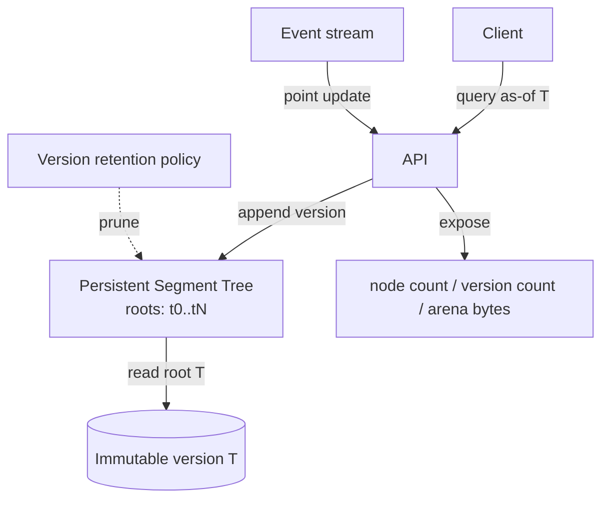
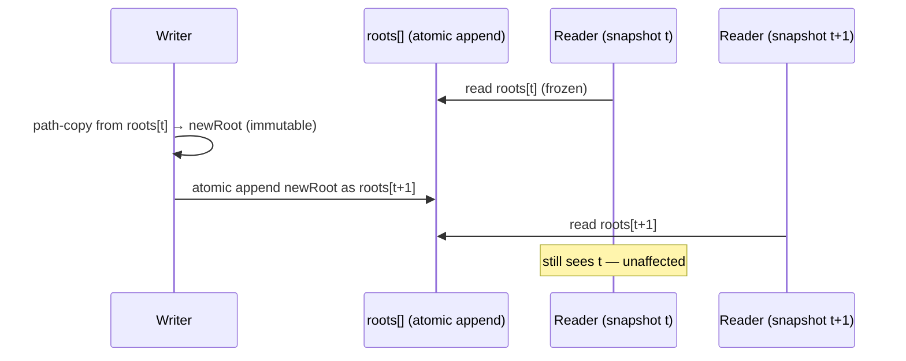
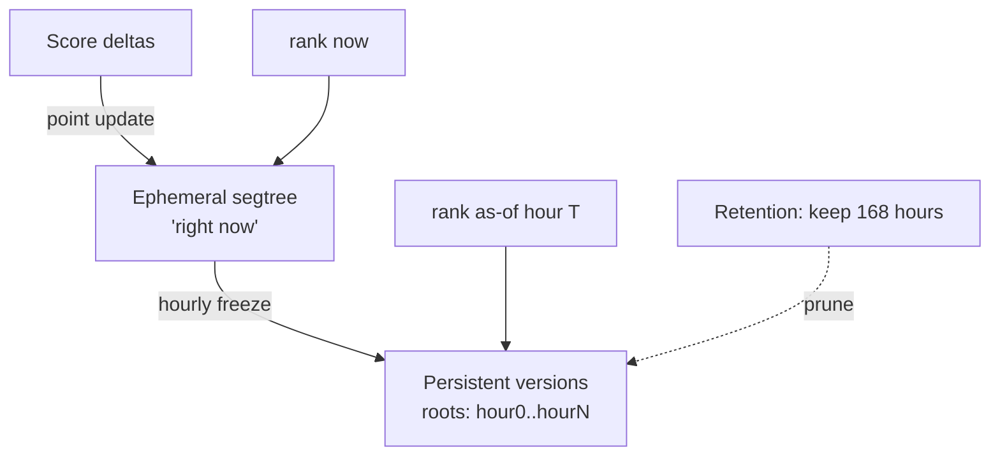

# Persistent Segment Tree — Senior Level

> **Read time: ~50 minutes** · **Audience:** Engineers architecting systems (or contest libraries) on top of persistence — who need to reason about **memory budgets**, **allocation/GC**, **node arenas**, **concurrent reads of immutable versions**, and how persistence shows up in **functional languages** and real storage engines.

At junior/middle level we mastered the mechanism and the k-th application. At senior level the questions change. *How much memory does keeping `n` versions actually cost, and how do I keep it under budget? Can I avoid the GC storm of millions of tiny nodes? Can readers run lock-free against historical versions? Where does this idea already live in production — MVCC databases, copy-on-write filesystems, functional collections?* This file treats the persistent segment tree as a **systems** object, not just an algorithm.

---

## Table of Contents

1. [Introduction — Persistence as a Systems Primitive](#introduction)
2. [System Design with Versioned State](#system-design)
3. [Memory Accounting — O(n log n) for n Versions](#memory)
4. [Node Arenas, Pools, and GC Strategy](#arena-gc)
5. [Concurrency — Immutable Versions Read Lock-Free](#concurrency)
6. [Persistence in Functional Languages & Storage Engines](#functional)
7. [Comparison with Alternatives (Systems View)](#comparison)
8. [Architecture Patterns](#architecture)
9. [Code Examples — Arena-Backed Persistent Tree](#code-examples)
10. [Case Study — A Versioned Leaderboard Service](#case-study)
11. [Serialization, Durability, and Recovery](#durability)
12. [Capacity Planning Worksheet](#capacity)
13. [Observability](#observability)
14. [Failure Modes](#failure-modes)
15. [Summary](#summary)

---

<a name="introduction"></a>
## 1. Introduction — Persistence as a Systems Primitive

A persistent segment tree is a **copy-on-write immutable tree with versioned roots**. Strip away the segment-tree specifics and you are left with the exact pattern that underlies:

- **MVCC** (multi-version concurrency control) in PostgreSQL / MySQL-InnoDB — readers see a consistent snapshot while writers create new row versions.
- **Copy-on-write B-trees / LSM** in databases and filesystems (ZFS, Btrfs, LMDB) — a write produces a new root pointing mostly at old blocks.
- **Persistent collections** in Clojure/Scala/Immutable.js — structural sharing for cheap immutable updates.

So the senior skill is to recognize when "I need cheap, queryable history of an aggregate over an array" and to budget its memory, allocation, and concurrency cost. The algorithm is identical to `junior.md`; what's new is **operating it at scale**.

---

<a name="system-design"></a>
## 2. System Design with Versioned State

Consider a service that maintains a large keyed aggregate (e.g., a **real-time leaderboard** over score buckets, or **per-tenant rate-count histograms**) and must answer:

1. "k-th highest score right now" / "rank of score X" — range/order queries.
2. "What did the histogram look like at snapshot T?" — time-travel.
3. Point updates as events stream in.



Design choices a senior makes:

- **Version granularity.** One version per event is simplest but unbounded. Often you snapshot per *time window* (e.g., one version per second) and let intra-window state be ephemeral, to cap version count.
- **Retention.** Old versions are roots; dropping a root makes its *exclusive* nodes collectible. Keep a sliding window of the last `W` versions (§11).
- **Read isolation.** A query "as of T" just reads `roots[T]` — no locks, because that subtree is immutable.

---

<a name="memory"></a>
## 3. Memory Accounting — O(n log n) for n Versions

The headline cost. Let `n` = value-axis size (or array size), `m` = number of versions/updates.

```
Build version 0:            ~2n nodes        (a full tree)
Each update (new version):  ⌈log₂ n⌉ + 1 new nodes
After m updates:            2n + m·(⌈log₂ n⌉ + 1) nodes
                          = O(n + m log n)
```

When `m ≈ n` (e.g., one version per array element in the k-th application), this is **O(n log n)** total — the number you must budget for.

### 3.1 Concrete budget table

Assume a node is `{ int32 cnt; ptr left; ptr right }`. On a 64-bit machine with explicit pointers that's ~20–24 bytes; in a packed arena with `int32` child indices it's **12 bytes**.

| n = m | Nodes ≈ 2n + n·log₂n | Arena bytes (12 B/node) | Heap nodes (24 B/node) |
|---|---|---|---|
| 10^4 | ~1.5·10^5 | ~1.8 MB | ~3.6 MB |
| 10^5 | ~1.9·10^6 | ~23 MB | ~46 MB |
| 10^6 | ~2.2·10^7 | ~265 MB | ~530 MB |
| 2·10^6 | ~4.6·10^7 | ~550 MB | ~1.1 GB |

The lesson: at `n = m = 10^6` you are in the **hundreds of MB**. The arena (packed indices) roughly halves it versus heap pointers. The **naive "full copy per version"** would be `m·2n = 4·10^12` nodes — utterly impossible. Path copying's `log n`-per-version is what makes it fit.

### 3.2 Reducing memory further

- **Pack children as `int32` indices** into one arena array → 12 B/node, no per-object header.
- **Lazy build of version 0**: if it starts empty (all zeros), don't materialize `2n` nodes — share a single sentinel "empty" node for all-zero subtrees and only split on first insert. This makes version 0 cost ~1 node and total cost `O(m log n)` instead of `O(n + m log n)`.
- **Drop unreachable versions** (retention) to let exclusive nodes be reclaimed.

---

<a name="arena-gc"></a>
## 4. Node Arenas, Pools, and GC Strategy

Heap-allocating one object per node is the dominant cost in GC languages: millions of tiny objects thrash the allocator and the collector. The standard remedy is a **node arena**.

### 4.1 Arena (struct-of-arrays / index children)

Keep three parallel arrays (or one array of small structs). A node is an **index** into the arena; children are `int32` indices; index 0 is a reserved "null/empty" sentinel.

```
cnt[]   : int32   value/count of node i
lc[]    : int32   left child index  (0 = empty)
rc[]    : int32   right child index (0 = empty)
free    : int     next free slot (bump allocator)
```

Allocating a node = `i = free++; set cnt[i], lc[i], rc[i]`. No GC pressure, perfect cache locality, and you can `mmap`/serialize the arena directly.

### 4.2 GC interaction in managed runtimes

- **Go**: with explicit `*Node` pointers, the GC must scan every node. A struct arena with `int32` children means the GC sees one big slice of pointer-free structs — it scans almost nothing. Huge win for pause times.
- **Java**: same idea — `int[] cnt, lc, rc`. Avoids per-node object headers (12–16 B each) and keeps the structure off the GC's per-object book-keeping.
- **Python**: arenas help less (everything is boxed); use `__slots__` and prefer the wavelet tree or NumPy-backed arrays if memory-critical.

### 4.3 Reclaiming versions (manual or GC)

- In GC languages, **dropping all references to `roots[t]`** lets the collector reclaim any node reachable *only* from version `t`. Shared nodes (still reachable from a surviving version) stay.
- In an arena you can't free individual indices cheaply; instead use **generational arenas**: when retention prunes old versions, rebuild a fresh arena containing only live versions (compaction), or use a windowed ring of arenas.

---

<a name="concurrency"></a>
## 5. Concurrency — Immutable Versions Read Lock-Free

Immutability is a concurrency superpower.

- **Any number of readers** can traverse any historical version with **no locks**, because no node is ever mutated. A reader holding `roots[t]` sees a consistent, frozen snapshot forever (until that root is pruned).
- **A single writer** creates a new version (path copy) and publishes it with **one atomic pointer store** (`roots[newVer] = root` / append to a slice guarded by a lightweight lock or atomic). Readers either see the old `roots` length or the new one — never a half-built tree, because every node the new root points at is fully constructed before publication.
- This is precisely **MVCC**: readers snapshot, writer appends versions, no reader/writer contention on the data itself.



Caveats: multiple **concurrent writers** still need serialization (they both branch from "latest"); use a single writer or a lock around the append. The *reads* remain lock-free regardless.

---

<a name="functional"></a>
## 6. Persistence in Functional Languages & Storage Engines

Persistent segment trees are a special case of a deep idea.

| System | Persistence mechanism | Relation |
|---|---|---|
| **Clojure `PersistentVector`** | 32-way trie, copy-on-write path of ~log₃₂ n nodes | Same path-copying, higher branching |
| **Scala `Vector` / Immutable.js** | RRB / HAMT, structural sharing | Same idea, different shape |
| **Haskell** (purely functional) | *all* data is immutable; updates share structure by default | Persistence is the default, not opt-in |
| **PostgreSQL MVCC** | new row version per update; old visible to older snapshots | Versioned reads = time-travel queries |
| **ZFS / Btrfs** | copy-on-write block tree; snapshot = root pointer | Path copying on a block B-tree |
| **LMDB** | copy-on-write B+tree, single writer, lock-free readers | Exactly the concurrency model of §5 |
| **Git** | content-addressed trees; commit shares unchanged blobs | Versioned roots + structural sharing |

The senior insight: **the persistent segment tree is the same pattern your database and filesystem already use**, specialized to range-aggregate queries. Branching = higher fan-out (B-trees use ~hundreds to cut tree height and copy cost per update), but the core "copy the path, share the rest, keep a root per version" is universal.

### 6.1 Why higher fan-out matters at scale

Binary nodes copy `log₂ n` nodes per update; a 32-way trie copies `log₃₂ n ≈ (log₂ n)/5` *levels*, but each copied node is 32 slots wide, so the **bytes** copied per update are `32 · log₃₂ n ≈ 6.4 · log₂ n` — *more* bytes than binary, but far fewer *pointer indirections* (shorter trees → fewer cache misses). Functional collection libraries pick fan-out 32 because it trades a bit more copy work for dramatically shallower trees and better cache behavior. A persistent segment tree stays binary because its query semantics (the midpoint split, the trichotomy) depend on binary subdivision; the lesson is that **fan-out is a tunable knob** in the broader persistence design space, and binary is the right point for *aggregate-over-interval* queries.

### 6.2 Mapping persistent-tree concepts to MVCC vocabulary

| Persistent segment tree | Database MVCC |
|---|---|
| version / root | transaction snapshot / commit LSN |
| immutable node | immutable row version (tuple) |
| `roots[t]` | snapshot visibility cutoff |
| path copying | new tuple versions on update |
| retention / pruning old roots | VACUUM / old-version GC |
| lock-free historical read | snapshot isolation read |
| single writer publishes root | commit makes new versions visible |

Speaking this vocabulary in a systems interview signals that you see the persistent segment tree not as a contest trick but as an instance of a production-grade concurrency model.

---

<a name="comparison"></a>
## 7. Comparison with Alternatives (Systems View)

| Attribute | Persistent segtree | Wavelet tree | MVCC store (DB) | Snapshot via full copy |
|---|---|---|---|---|
| Memory / version | O(log n) | n/a (static) | O(changed rows) | **O(n)** |
| Time-travel reads | O(log n) | no | O(log versions) | O(1) once copied |
| Concurrent reads | **lock-free** | lock-free (static) | snapshot isolation | lock-free |
| Point update cost | O(log n) + alloc | rebuild | row write + WAL | O(n) |
| Best for | in-memory range k-th + history | static rank/select, low memory | durable transactional data | tiny n / few versions |

---

<a name="architecture"></a>
## 8. Architecture Patterns

### 8.1 Snapshot-per-window
Cap version count: maintain ephemeral state within a window, materialize one persistent version at each boundary (e.g., per second). Bounds memory to `O(W · log n)` for `W` retained windows.

### 8.2 Append-only version log + retention ring
Store `roots` as a ring buffer of the last `W` versions. Evicting `roots[t-W]` drops references; GC reclaims its exclusive nodes. Arenas use windowed compaction.

### 8.3 Persistent index over an event-sourced stream
Each domain event = one point update = one version. Replaying to "state at event t" is a direct read of `roots[t]`. Pairs naturally with event sourcing (cross-link [`event-driven-architecture`] skill).

### 8.4 Lazy-empty version 0
Represent all-zero subtrees with a shared sentinel; only split on first write. Cuts initial memory from O(n) to O(1) and total to O(m log n).

---

<a name="code-examples"></a>
## 9. Code Examples — Arena-Backed Persistent Tree

GC-friendly arena: nodes are `int32` indices; index 0 is the "empty" sentinel. Concurrent readers are lock-free; a single writer appends versions.

### Go
```go
package arenapst

import "sync/atomic"

// Struct-of-arrays arena. Index 0 = empty sentinel (cnt 0, children 0).
type Arena struct {
    cnt []int32
    lc  []int32
    rc  []int32
}

func NewArena(capHint int) *Arena {
    a := &Arena{
        cnt: make([]int32, 1, capHint+1),
        lc:  make([]int32, 1, capHint+1),
        rc:  make([]int32, 1, capHint+1),
    }
    return a // node 0 is the empty sentinel
}

func (a *Arena) alloc(cnt, l, r int32) int32 {
    a.cnt = append(a.cnt, cnt)
    a.lc = append(a.lc, l)
    a.rc = append(a.rc, r)
    return int32(len(a.cnt) - 1)
}

// insert returns a NEW node index; the lazy-empty version uses sentinel 0.
func (a *Arena) insert(prev int32, lo, hi, g int) int32 {
    if lo == hi {
        return a.alloc(a.cnt[prev]+1, 0, 0)
    }
    mid := (lo + hi) / 2
    pl, pr := a.lc[prev], a.rc[prev]
    if g <= mid {
        nl := a.insert(pl, lo, mid, g)
        return a.alloc(a.cnt[nl]+a.cnt[pr], nl, pr) // share right index pr
    }
    nr := a.insert(pr, mid+1, hi, g)
    return a.alloc(a.cnt[pl]+a.cnt[nr], pl, nr) // share left index pl
}

func (a *Arena) kth(l, r int32, lo, hi, k int) int {
    if lo == hi {
        return lo
    }
    mid := (lo + hi) / 2
    leftCnt := int(a.cnt[a.lc[r]] - a.cnt[a.lc[l]])
    if k <= leftCnt {
        return a.kth(a.lc[l], a.lc[r], lo, mid, k)
    }
    return a.kth(a.rc[l], a.rc[r], mid+1, hi, k-leftCnt)
}

// Versions: lock-free reads via atomic pointer to an immutable []int32 of roots.
type Versions struct{ roots atomic.Pointer[[]int32] }

func (v *Versions) Publish(newRoots []int32) { v.roots.Store(&newRoots) }
func (v *Versions) Root(t int) int32         { return (*v.roots.Load())[t] }
```

### Java
```java
public final class ArenaPST {
    int[] cnt = new int[1]; // index 0 = empty sentinel
    int[] lc  = new int[1];
    int[] rc  = new int[1];
    int size = 1;

    private int alloc(int c, int l, int r) {
        if (size == cnt.length) {
            int cap = size * 2;
            cnt = java.util.Arrays.copyOf(cnt, cap);
            lc  = java.util.Arrays.copyOf(lc, cap);
            rc  = java.util.Arrays.copyOf(rc, cap);
        }
        cnt[size] = c; lc[size] = l; rc[size] = r;
        return size++;
    }

    int insert(int prev, int lo, int hi, int g) {
        if (lo == hi) return alloc(cnt[prev] + 1, 0, 0);
        int mid = (lo + hi) >>> 1;
        int pl = lc[prev], pr = rc[prev];
        if (g <= mid) { int nl = insert(pl, lo, mid, g); return alloc(cnt[nl] + cnt[pr], nl, pr); }
        int nr = insert(pr, mid + 1, hi, g);             return alloc(cnt[pl] + cnt[nr], pl, nr);
    }

    int kth(int l, int r, int lo, int hi, int k) {
        if (lo == hi) return lo;
        int mid = (lo + hi) >>> 1;
        int leftCnt = cnt[lc[r]] - cnt[lc[l]];
        if (k <= leftCnt) return kth(lc[l], lc[r], lo, mid, k);
        return kth(rc[l], rc[r], mid + 1, hi, k - leftCnt);
    }
    // Lock-free reads: publish an immutable int[] of roots via a volatile reference.
    volatile int[] roots;
}
```

### Python
```python
import sys, bisect
sys.setrecursionlimit(1 << 20)


class ArenaPST:
    """Index-based arena. Node 0 is the empty sentinel."""
    def __init__(self):
        self.cnt = [0]
        self.lc = [0]
        self.rc = [0]

    def _alloc(self, c, l, r):
        self.cnt.append(c); self.lc.append(l); self.rc.append(r)
        return len(self.cnt) - 1

    def insert(self, prev, lo, hi, g):
        if lo == hi:
            return self._alloc(self.cnt[prev] + 1, 0, 0)
        mid = (lo + hi) // 2
        pl, pr = self.lc[prev], self.rc[prev]
        if g <= mid:
            nl = self.insert(pl, lo, mid, g)
            return self._alloc(self.cnt[nl] + self.cnt[pr], nl, pr)
        nr = self.insert(pr, mid + 1, hi, g)
        return self._alloc(self.cnt[pl] + self.cnt[nr], pl, nr)

    def kth(self, l, r, lo, hi, k):
        if lo == hi:
            return lo
        mid = (lo + hi) // 2
        left_cnt = self.cnt[self.lc[r]] - self.cnt[self.lc[l]]
        if k <= left_cnt:
            return self.kth(self.lc[l], self.lc[r], lo, mid, k)
        return self.kth(self.rc[l], self.rc[r], mid + 1, hi, k - left_cnt)


if __name__ == "__main__":
    a = [3, 1, 4, 1, 5]
    uniq = sorted(set(a)); D = len(uniq)
    t = ArenaPST()
    roots = [0]  # version 0 = empty sentinel (lazy-empty)
    for v in a:
        g = bisect.bisect_left(uniq, v)
        roots.append(t.insert(roots[-1], 0, D - 1, g))
    g = t.kth(roots[1], roots[4], 0, D - 1, 2)  # 2nd smallest of a[2..4]
    print(uniq[g])  # 1
```

Note the **lazy-empty** trick: version 0 is just sentinel `0`, so no `2n` initial nodes — total memory is `O(m log n)`.

---

<a name="case-study"></a>
## 10. Case Study — A Versioned Leaderboard Service

Let us make the systems story concrete. We are building a **real-time leaderboard** for an online game with up to **2,000,000 active players** whose scores change constantly. Product wants three features:

1. **`rank(score)`** — "how many players have a score ≥ X right now?" (and the inverse, "what score is at rank K?").
2. **`asOf(snapshot, score)`** — the same queries against an end-of-hour snapshot ("your rank when the season closed").
3. **Streaming updates** — millions of score deltas per minute.

### 10.1 Why a persistent segment tree fits

- The value axis is **score buckets** (compressed; scores are bounded). A node stores the **count of players** in its score range. `rank(score)` is a prefix-count query: O(log n).
- An **hourly snapshot** is just `roots[hourBoundary]` — feature (2) is free. No separate snapshot store, no copy, no downtime.
- Streaming updates are point updates: a player moving from score A to B is `−1` at A and `+1` at B, two O(log n) updates producing two new versions (or one combined version if we batch).

### 10.2 The version-granularity decision

One version per score change = millions of versions/minute = OOM. We instead use **snapshot-per-window**:

- Inside the current hour, maintain an **ephemeral** ordinary segment tree (mutable, cheap) for "right now" queries.
- At each hour boundary, **freeze** it into one persistent version (`roots.append`). That gives 24 versions/day for time-travel, not millions.
- Time-travel queries hit persistent roots; "right now" queries hit the ephemeral tree. Best of both.



### 10.3 Sizing it

- Score buckets compressed to `D ≈ 2·10^5` distinct values. Ephemeral tree: `~4·10^5` nodes, mutable, trivial.
- Persistent versions: we keep **168** hourly snapshots (one week). But here is the subtlety — an *hourly freeze that copies the whole tree* costs `2D` nodes each → `168 · 4·10^5 ≈ 6.7·10^7` nodes (~800 MB in an arena). That is the **naive snapshot**, and for *one snapshot per hour* it is actually acceptable because 168 is small.
- If instead we wanted one persistent version *per player update* for fine-grained time-travel, path copying's `O(log D)` per version is mandatory: `m = 10^8` updates/week × 18 ≈ `1.8·10^9` nodes — too big, so we'd shorten retention or coarsen granularity. **The senior decision is choosing granularity to fit the memory envelope.**

### 10.4 Read path under load

All historical reads are **lock-free** (immutable roots), so the leaderboard's read replicas scale horizontally with zero coordination. The single writer owns the ephemeral tree and publishes hourly roots with one atomic append. This is exactly MVCC: writers never block readers.

---

<a name="durability"></a>
## 11. Serialization, Durability, and Recovery

In-memory persistence is great until the process restarts. Three options:

### 11.1 Rebuild from an event log (preferred)
If updates come from a durable stream (Kafka, WAL, event store), **don't persist the tree at all** — persist the *events* and replay them on startup. Replaying `m` updates is `O(m log n)`; for `m = 10^7` that's seconds. This pairs naturally with **event sourcing**: the persistent segment tree is a materialized, versioned *projection* of the event log.

### 11.2 Serialize the arena
Because the arena is `int32` arrays (`cnt`, `lc`, `rc`) plus a `roots` array, it serializes to a flat byte buffer trivially — `mmap` it, or write it to disk and reload. No pointer fix-up needed because children are *indices*, not addresses. This is why arenas (senior §4) double as a durability format.

```
on shutdown:  write [D, len(arena), cnt[], lc[], rc[], roots[]]  → blob
on startup:   mmap blob → arrays are ready, O(1); roots immediately queryable
```

### 11.3 Snapshot + incremental log (hybrid)
Periodically serialize the arena (a checkpoint) and append subsequent updates to a small log. Recovery = load checkpoint + replay tail. Bounds replay time regardless of total history. This is the LSM/WAL pattern applied to the persistent tree.

| Strategy | Restart cost | Disk | Best when |
|---|---|---|---|
| Replay event log | O(m log n) | event log only | events already durable |
| Serialize arena | O(arena size) load | full arena | fast restart, self-contained |
| Checkpoint + tail | O(checkpoint + tail) | checkpoint + small log | long histories, frequent restarts |

---

<a name="capacity"></a>
## 12. Capacity Planning Worksheet

A repeatable procedure to size a deployment:

1. **Pick `D`** = distinct values on the axis after compression (≤ data size).
2. **Pick `m`** = number of persistent versions you will *retain* (after applying windowing/retention).
3. **Nodes** ≈ `2D + m·(⌈log₂ D⌉ + 1)` (or `m·⌈log₂ D⌉` with lazy-empty).
4. **Bytes** ≈ `nodes × 12` (arena, `int32×3`) or `× 24` (heap pointers).
5. **Add roots array** `m × 4 bytes` (negligible).
6. **Headroom**: target ≤ 70% of the RAM budget; the rest for ephemeral state, OS, and spikes.
7. **If over budget**: coarsen version granularity (snapshot-per-window), shorten retention, switch heap→arena, enable lazy-empty, or move to a **wavelet tree** (≈ half the memory, but loses versioning).

**Worked example.** `D = 2·10^5`, retain `m = 5·10^5` versions, lazy-empty:
`nodes ≈ 5·10^5 × 18 = 9·10^6`; arena bytes ≈ `108 MB`; comfortably under a 256 MB budget at <45% — leaves room for the ephemeral tree and headroom.

---

<a name="observability"></a>
## 13. Observability

| Metric | Why | Alert threshold |
|---|---|---|
| `pst_node_count` | total arena size | > 80% of arena cap |
| `pst_version_count` | retention working? | > retention window W |
| `pst_bytes` | memory budget | > 80% of allotted RAM |
| `pst_alloc_rate` | GC / arena growth pressure | sustained spikes |
| `pst_query_latency_p99` | should be flat O(log n) | > a few µs |
| `pst_oldest_version_age` | retention lag | older than window |

Expose node count and version count; a steadily climbing node count with flat version count means you forgot the lazy-empty / retention optimization.

---

<a name="failure-modes"></a>
## 14. Failure Modes

- **Unbounded version growth → OOM.** One version per event with no retention. *Fix:* snapshot-per-window + retention ring; prune old roots.
- **GC storm from per-node objects.** Millions of tiny `Node` allocations. *Fix:* struct arena with `int32` children.
- **Accidental mutation breaks old versions.** Someone "optimizes" by writing into a shared node. *Fix:* enforce immutability (final fields), never expose setters.
- **Arena overflow.** Bump allocator runs out. *Fix:* pre-size to `2n + m·log n` (or `m·log n` with lazy-empty); grow geometrically.
- **Reader sees half-built version.** Publishing a root before children are constructed. *Fix:* construct the whole new path, then **atomically** publish the root — never expose an intermediate.
- **Retention frees a still-referenced version.** A long-running reader holds `roots[t]` you pruned. *Fix:* reference-count or epoch-based reclamation; don't compact versions with live readers.
- **Count overflow under extreme skew.** Most inserts hit one value range; a single `cnt` can exceed `int32`. *Fix:* use `int64` counts when `m` is very large.
- **Serialization drift.** An arena serialized with one axis size `D` is reloaded against a different value set. *Fix:* serialize `D` and the `uniq` value map with the arena; validate on load.

### 14.1 Decision checklist before shipping

Run through this list before putting a persistent segment tree in production:

1. **Do you truly need history?** If not, an ephemeral segment tree or Fenwick tree is simpler and lighter.
2. **Is the workload read-only and memory-tight?** Prefer a **wavelet tree** (≈ half the memory, O(log σ) queries).
3. **Are queries offline?** Mo's algorithm may be simpler and use O(n) memory.
4. **What bounds your version count?** Pick a retention/windowing policy *now*, not after an OOM.
5. **Heap or arena?** For `> 10^5` versions in a GC language, use an arena from the start.
6. **Durability?** Decide event-replay vs. arena-serialize vs. checkpoint before launch.
7. **One writer?** Concurrent writers need serialization; confirm the write path is single-threaded or locked.

---

<a name="summary"></a>
## 15. Summary

- A persistent segment tree is a **copy-on-write immutable tree with versioned roots** — the same pattern as **MVCC, COW filesystems, and functional persistent collections**.
- **Memory is O(n log n)** for `n` versions; a **node arena** with `int32` children (~12 B/node) and a **lazy-empty version 0** keep it tight and GC-friendly (`O(m log n)` total).
- **Reads are lock-free** because versions are immutable; a single writer publishes new roots with one **atomic** store — textbook MVCC.
- Operate it with **version retention** (windowing / ring) to bound growth, and **observe** node/version counts and query latency.
- Recognize it in the wild: ZFS/Btrfs snapshots, LMDB's COW B+tree, PostgreSQL MVCC, Clojure/Scala persistent vectors — all path-copying with versioned roots.

---

**Next step:** Continue to [`professional.md`](./professional.md) for the formal proof that path copying is O(log n) per version, the full space-complexity derivation, the fat-node method for full persistence, and a rigorous complexity comparison.
