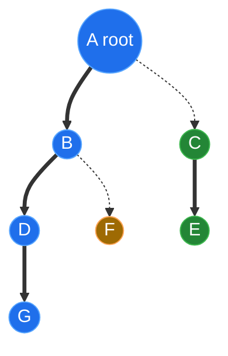

# Link-Cut Tree — Junior Level

> **Read time: ~50 minutes** · **Audience:** Students who already know binary search trees, recursion, and tree traversal, and now want a structure that maintains a *forest of trees* that is *changing shape over time* while still answering path questions fast.

A **Link-Cut Tree (LCT)** is a data structure for the **dynamic trees problem**: you have a forest (a set of rooted trees) and you must support *adding* an edge (`link`), *removing* an edge (`cut`), and asking *questions about the path* between two nodes (the sum, the maximum, the length, the lowest common ancestor) — all while the tree shape keeps changing. Every one of these operations runs in **amortized O(log n)**. The structure was invented by **Daniel Sleator and Robert Tarjan in 1981** specifically to speed up network-flow algorithms, and it is one of the most elegant ideas in all of data structures: it represents a tree using *other balanced trees* (splay trees), and the whole machine runs off a single core operation called **`access`**.

This document builds the intuition from the ground up. We start with *why* a plain tree is not enough, introduce **preferred paths** and the **preferred-child decomposition**, explain **`access(v)`** — the one operation everything else is built on — and trace a small concrete example by hand. We finish with the Big-O table, the common-bug list, and a cheat sheet you can keep.

---

## Table of Contents

1. [Introduction — The Dynamic Trees Problem](#introduction)
2. [Prerequisites](#prerequisites)
3. [Glossary](#glossary)
4. [Core Concepts — Preferred Paths and ACCESS](#core-concepts)
5. [Big-O Summary](#big-o)
6. [Real-World Analogies](#analogies)
7. [Pros and Cons](#pros-cons)
8. [Step-by-Step Walkthrough on a 7-Node Tree](#walkthrough)
9. [Code Examples — Go, Java, Python](#code-examples)
10. [Coding Patterns — Everything Is `access`](#patterns)
11. [Error Handling](#errors)
12. [Performance Tips](#performance-tips)
13. [Best Practices](#best-practices)
14. [Edge Cases](#edge-cases)
15. [Common Mistakes](#common-mistakes)
16. [Cheat Sheet](#cheat-sheet)
17. [Visual Animation Reference](#animation)
18. [Summary](#summary)
19. [Further Reading](#further-reading)

---

<a name="introduction"></a>
## 1. Introduction — The Dynamic Trees Problem

Imagine you are maintaining a tree — not a binary search tree, just an ordinary rooted tree where each node has one parent — and the tree **keeps changing**. Edges appear; edges disappear. Between changes, people ask you questions:

- *"How far is node `u` from node `v` (along the unique tree path)?"*
- *"What is the maximum edge weight on the path from `u` to `v`?"*
- *"Are `u` and `v` in the same tree right now?"*
- *"What is the sum of node values along the path `u → v`?"*

If the tree never changed, you could precompute everything: an Euler tour, binary lifting for LCA, prefix sums along root-to-node paths. That is the world of **static** tree queries, and **Heavy-Light Decomposition** (see `11-graphs/17-heavy-light-decomposition`) handles it beautifully. But HLD assumes the tree shape is **fixed**. The moment edges start being added and removed, the heavy-light structure has to be rebuilt, and a rebuild costs O(n). If you have `q` updates that is O(nq) — far too slow.

The **dynamic trees problem** asks: can we support `link`, `cut`, and path queries each in **O(log n)**, no matter how the shape changes? The answer is *yes*, and the Link-Cut Tree is the classic solution.

### 1.1 Why not just store parent pointers?

The naive idea is: every node stores a pointer to its parent. Then:

- `link(u, v)` (make `u` a child of `v`): set `u.parent = v`. O(1). 
- `cut(u)` (detach `u` from its parent): set `u.parent = null`. O(1). 
- *"Is `u` in the same tree as `v`?"*: walk both up to their roots and compare. **O(n) in the worst case** — a path of `n` nodes means walking `n` pointers.
- *"What is the sum on the path `u → v`?"*: walk up from both. Again **O(n)**.

The parent-pointer forest gives fast updates but **slow queries**, because a tree can be a long chain. The Link-Cut Tree fixes exactly this: it keeps a clever *secondary representation* on top of the forest so that walking a path costs O(log n) instead of O(path length).

### 1.2 The one-sentence idea

> A Link-Cut Tree represents each "root-to-node" path of the forest as a **balanced binary search tree** (a *splay tree*) keyed by depth, and the operation `access(v)` reshapes those balanced trees so that the entire path from the root down to `v` becomes one single splay tree — at which point any path question becomes a question about that one balanced tree, answerable in O(log n).

Everything else — `link`, `cut`, `findRoot`, path sum, path max, `lca`, even reversing which end is the root — is a thin wrapper around `access`. Learn `access` and you have learned the LCT.

---

<a name="prerequisites"></a>
## 2. Prerequisites

1. **Rooted trees.** Parent, child, ancestor, descendant, path, root, depth. The "tree" here is *not* a binary search tree — a node can have any number of children.
2. **Binary search trees** and rotations. The internal machinery is a BST whose nodes are kept balanced by rotations.
3. **Splay trees** (helpful, not required). A splay tree is a self-adjusting BST that moves an accessed node to the root via rotations. If you have not met them, read `22-randomized-algorithms/04-treap` for balanced-BST background and the short splay primer in §4.3 below.
4. **Recursion and amortized intuition.** You do not need the full amortized proof (that is `professional.md`), but the phrase "amortized O(log n)" — *averaged over a sequence of operations* — should not scare you.
5. **Big-O for trees.** Why a balanced binary tree has height O(log n).

If splay trees or BST rotations are shaky, review `09-trees` (binary trees, AVL) and `22-randomized-algorithms/04-treap` first.

---

<a name="glossary"></a>
## 3. Glossary

| Term | Definition |
|---|---|
| **Forest** | A set of rooted trees. The thing an LCT maintains. The *represented* forest. |
| **Represented tree** | The actual logical tree the user thinks about (the "real" parent/child relationships). |
| **Preferred child** | At most one child of each node is "preferred". The chosen child the path goes down to. |
| **Preferred path** | A maximal downward chain of preferred edges. Every node is on exactly one preferred path. |
| **Preferred-path decomposition** | The partition of the represented tree into disjoint preferred paths. |
| **Auxiliary tree / splay tree** | A balanced BST that stores the nodes of **one** preferred path, keyed by depth. |
| **Path-parent pointer** | A pointer from the *root* of one auxiliary tree to the node in another auxiliary tree where its path attaches. The "glue" between splay trees. |
| **`access(v)`** | The core operation: make the path from the root of `v`'s represented tree down to `v` a single preferred path, and splay `v` to the top. |
| **Splay** | Move a node to the root of its BST via rotations; the self-adjusting balancing step. |
| **`link(u, v)`** | Attach tree containing `u` (as a root) under node `v`. Adds one edge. |
| **`cut(u)`** | Remove the edge from `u` to its parent. Splits one tree into two. |
| **`findRoot(v)`** | Return the root of the represented tree containing `v`. |
| **`makeRoot(v)`** | Re-root the represented tree so that `v` becomes the root (uses a lazy reverse flag). |
| **Lazy reverse flag** | A boolean tag on a splay node meaning "this subtree's left/right order is logically flipped"; flushed lazily. |
| **Amortized O(log n)** | Averaged over any sequence of `m` operations, each costs O(log n) — some single ops may be slower, but the total is O(m log n). |
| **Virtual / dashed edge** | A path-parent edge (not part of the current splay tree); contrast with **preferred / solid** edges inside a splay tree. |

---

<a name="core-concepts"></a>
## 4. Core Concepts — Preferred Paths and ACCESS

### 4.1 Two views of the same forest

An LCT keeps the forest in **two layers** at once:

1. **The represented forest** — the real trees, what the user cares about. We never store this directly with parent pointers; it is *implied* by the layer below.
2. **The auxiliary forest of splay trees** — how the LCT actually stores things. The represented forest is **chopped into preferred paths**, and each preferred path is stored as its own **splay tree**, ordered by depth (shallowest node = leftmost, deepest = rightmost).

The splay trees are glued together by **path-parent pointers**: the root of one splay tree points to the node where its path connects to the path above it. Crucially, that path-parent pointer is **one-directional** — the parent does not know about the child path. This asymmetry is what makes the bookkeeping cheap.

### 4.2 Preferred paths — the decomposition

Each node designates **at most one** of its children as **preferred**. Following preferred edges downward gives **preferred paths**. Every node lies on exactly one preferred path. Here is a represented tree split into three preferred paths (solid = preferred, dashed = non-preferred):



The three preferred paths are `A→B→D→G` (blue), `C→E` (green), and `F` alone (orange). The dashed edges `A⇢C` and `B⇢F` are *non-preferred*; in the auxiliary layer they become **path-parent pointers**: the splay tree holding `{C,E}` has a path-parent pointer to `A`, and the splay tree holding `{F}` has a path-parent pointer to `B`.

### 4.3 A 60-second splay-tree primer

A **splay tree** is a binary search tree with no explicit balance field. Its one rule: whenever you touch a node, you **splay** it — rotate it up to the root using a fixed pattern of double rotations (zig, zig-zig, zig-zag). Splaying keeps the tree balanced *in an amortized sense*: any sequence of `m` operations on a splay tree of `n` nodes costs O((m + n) log n) total, so each operation is amortized O(log n).

In an LCT, each splay tree stores **one preferred path**, ordered by **depth in the represented tree** (not by key value). So the in-order traversal of the splay tree visits the path nodes from shallowest to deepest. The leftmost node is the top of the path; the rightmost is the bottom.

### 4.4 ACCESS(v) — the heart of everything

`access(v)` does one thing: it makes the path from the **root of v's represented tree** down to **v** into a *single preferred path*, and puts `v` at the top of that path's splay tree. After `access(v)`, the splay tree rooted at `v` contains **exactly** the root-to-`v` path — so any aggregate over that path is sitting right there in `v`'s subtree.

The algorithm walks up from `v` to the root, splay tree by splay tree, **re-stitching preferred children** as it goes:

```text
access(v):
    splay(v)                      # bring v to the top of its own splay tree
    v.right = null                # cut off everything DEEPER than v on this path
                                  #   (those nodes stop being preferred)
    last = v
    while v has a path-parent p:
        splay(p)                  # bring p to the top of the path above
        p.right = last            # make THIS path p's new preferred child
        last = p                  # walk up
        v = p
    splay(original_v)             # final splay brings v all the way to the top
```

Read the loop slowly. Each iteration jumps from one preferred path to the one above it via the path-parent pointer, and **re-points the preferred child** so the two paths merge into one. The detached deeper portion (`v.right = null`) becomes a new preferred path hanging off by a fresh path-parent pointer. When the loop ends, the root-to-`v` path is one splay tree, and a final splay puts `v` on top.

> **Why it is fast:** each `while` step is one `splay`, and a deep result from amortized analysis shows the **total number of preferred-child changes** across any sequence of operations is O(m log n). That is the whole ballgame — proven in `professional.md`.

### 4.5 Building the other operations from ACCESS

Once you have `access`, the rest are short:

| Operation | Recipe (informal) |
|---|---|
| `findRoot(v)` | `access(v)`; then walk left in the splay tree to the shallowest node (the root) and splay it. |
| `link(u, v)` | `makeRoot(u)`; `access(v)`; set `u`'s path-parent to `v`. |
| `cut(u)` | `access(u)`; the edge to the parent is now `u`'s left subtree — detach it (`u.left.parent = null; u.left = null`). |
| path query `u→v` | `makeRoot(u)`; `access(v)`; the answer is the aggregate stored at `v`. |
| `makeRoot(v)` | `access(v)`; mark `v`'s splay tree with a **lazy reverse** flag (flips depth order so `v` becomes shallowest). |

We expand each of these — including `makeRoot` and the lazy-reverse trick — in `middle.md`. For now, the takeaway is: **everything is a thin shell around `access`.**

---

<a name="big-o"></a>
## 5. Big-O Summary

| Operation | Time (amortized) | Notes |
|---|---|---|
| `access(v)` | **O(log n)** | The core; everything routes through it. |
| `link(u, v)` | **O(log n)** | One `makeRoot` + one `access`. |
| `cut(u)` | **O(log n)** | One `access`, then a constant splice. |
| `findRoot(v)` | **O(log n)** | `access` + walk-left + splay. |
| `makeRoot(v)` | **O(log n)** | `access` + set a lazy reverse flag (O(1) extra). |
| path aggregate `u→v` (sum/max/min) | **O(log n)** | `makeRoot(u)` + `access(v)`, read root aggregate. |
| `lca(u, v)` (fixed root) | **O(log n)** | `access(u)`, then `access(v)` returns the LCA. |
| Space | **O(n)** | A constant number of pointers/fields per node. |

> **Amortized**, not worst-case: a single `access` may touch many nodes, but across any sequence of `m` operations the total is O(m log n). For `n = 10⁶`, that is ~20 splay steps per operation on average — millions of operations per second on one core.

---

<a name="analogies"></a>
## 6. Real-World Analogies

### 6.1 Highway on-ramps for a road network
Think of the represented tree as roads, where a "preferred path" is a *main highway* you can drive end-to-end quickly, and non-preferred edges are *on-ramps* (path-parent pointers). `access(v)` is like rebuilding the highway so it runs straight from the city center (the root) to your destination `v`, demoting the old branches to on-ramps. Once the highway exists, measuring the whole route (its length, its tolls, its worst pothole) is one fast lookup.

### 6.2 A re-pinning org chart
The represented tree is a company hierarchy that keeps reorganizing (people get reassigned: `cut` then `link`). You frequently ask "what is the total headcount-budget along the reporting chain from the CEO down to engineer `v`?" Instead of walking the chain each time, the LCT keeps the *current* CEO-to-`v` chain pre-summed in one balanced tree, and re-stitches it cheaply whenever someone moves.

### 6.3 Git branch surgery
`makeRoot(v)` is like `git checkout` re-rooting your view of history so a different commit becomes "HEAD"; `link`/`cut` are like grafting and pruning branches. The path query is "show me the diff stats along the line of commits between these two."

> **Where the analogies break:** real highways and org charts do not *reorder themselves on every read*. The LCT does — that self-adjustment (splaying) is exactly what buys the O(log n), and it has no everyday counterpart.

---

<a name="pros-cons"></a>
## 7. Pros and Cons

### Pros
- **Fully dynamic.** `link` and `cut` are first-class, each O(log n). HLD cannot do this without O(n) rebuilds.
- **Path queries are O(log n)** for any associative aggregate (sum, max, min, gcd, xor) — same skeleton, swap the combine.
- **Re-rooting (`makeRoot`) is O(log n)** via a lazy reverse flag, so "path between any two nodes" needs no fixed root.
- **`findRoot` / connectivity** in O(log n) — the backbone of dynamic-connectivity and online-MST algorithms.
- **Powers real algorithms:** Sleator–Tarjan invented it to make the blocking-flow step of max-flow faster; it appears in dynamic MST, dynamic connectivity, and offline tree problems.

### Cons
- **Amortized, not worst-case.** A single operation can spike; bad for hard real-time deadlines (use the worst-case but heavier **top trees** there).
- **Big constant factor.** Splaying, lazy flags, and path-parent bookkeeping make the constant 3–10× a segment tree. Heavy-Light Decomposition is usually *faster in practice* for **static** trees.
- **Subtle to implement.** Lazy reverse + splay + path-parent has many footguns (see §15). It is among the trickiest standard structures to get right.
- **Subtree (not just path) aggregates need extra machinery** — a virtual-subtree augmentation maintaining "sum of the non-preferred children" (covered in `senior.md`).

### Decision matrix
| Need | Use |
|---|---|
| Static tree, path queries only | **Heavy-Light Decomposition** (`11-graphs/17`) |
| Static tree, subtree queries | **Euler tour + segment tree** |
| Dynamic tree (link/cut), path queries | **Link-Cut Tree** |
| Dynamic tree, worst-case (not amortized) bounds | **Top trees** |
| Dynamic connectivity only (no path aggregate) | **Euler-tour trees** or LCT |

---

<a name="walkthrough"></a>
## 8. Step-by-Step Walkthrough on a 7-Node Tree

Let the represented tree be rooted at `A`:

```
        A
        |
        B
       / \
      D   F
      |
      G
        \
         C
         |
         E   (suppose C hangs under D, E under C)
```

To keep it concrete, take the parent relationships: `B→A`, `D→B`, `F→B`, `G→D`, `C→D`, `E→C`. (Every node points to its parent; `A` is the root.) Node values are `A=1, B=2, C=3, D=4, E=5, F=6, G=7`.

### 8.1 Initial preferred-path decomposition

Suppose the preferred children currently are: `A→B`, `B→D`, `D→G`. Then the preferred paths are:

- Path 1 (a splay tree): `A, B, D, G` (depth order). 
- Path 2: `C, E` — attaches to `D` via a path-parent pointer (since `C→D` is non-preferred). 
- Path 3: `F` alone — attaches to `B` via a path-parent pointer.

### 8.2 Run `access(E)`

Goal: make `A→…→E` one preferred path with `E` on top.

```
Step 1: splay(E) inside its splay tree {C, E}.  E becomes the local root.
Step 2: E.right = null  (nothing is deeper than E on this path — no change).
Step 3: E has path-parent → D (the path {C,E} attaches to D).
        splay(D) inside {A,B,D,G}.  Now cut D's deeper part:
        D.right (= the part {G}) is detached → becomes a NEW preferred path,
        getting a fresh path-parent pointer back to D.
        Set D.right = (root of {C,E}), merging the two paths.  last = D.
Step 4: D has path-parent? No — D is now inside the path {A,B,D}. Continue up
        through the splay tree: the new combined path is A,B,D,C,E in depth order.
Step 5: final splay(E) brings E to the top of the combined splay tree.
```

After `access(E)` the single preferred path is `A → B → D → C → E` (depths 0,1,2,3,4), stored as one splay tree with `E` at the top. The old preferred child `D→G` was **demoted**: `G` is now its own path with a path-parent to `D`. The old `F` path is untouched (still hanging off `B`).

### 8.3 Query the path sum `A → E`

Because the whole `A→E` path is now one splay tree and we keep a **subtree-sum** in each splay node, the sum is simply the aggregate stored at the splay root `E`:

```
sum = value(A)+value(B)+value(D)+value(C)+value(E) = 1+2+4+3+5 = 15
```

No walking — one field read at the splay root. That is the payoff.

### 8.4 `cut(C)` — remove the edge `C→D`

```
access(C):  make A→…→C one preferred path, C on top.
Now C's LEFT subtree in the splay tree = everything shallower than C = {A,B,D}.
Detach it:  C.left.parent = null;  C.left = null.
```

The forest splits into two trees: one rooted at `A` (containing `A,B,D,F,G`) and one rooted at `C` (containing `C,E`). Both operations were O(log n) amortized.

### 8.5 `link(C, F)` — attach C's tree under F

```
makeRoot(C):  re-root C's tree so C is the root (lazy reverse on its splay tree).
access(F):    expose root-to-F path.
Set C's path-parent = F.
```

Now `C` (and `E` beneath it) hang under `F`. The whole forest is connected again, rooted at `A`, with `C` a child of `F`.

---

<a name="code-examples"></a>
## 9. Code Examples — Go, Java, Python

Below is a **junior-friendly, runnable LCT** supporting `link`, `cut`, `findRoot`, `makeRoot`, and **path sum**. Each splay node stores its value, a subtree `sum`, and a lazy `rev` (reverse) flag. The key helper `isRoot` distinguishes a *splay-tree root* (a node whose parent does not claim it as a child — i.e., reached via a path-parent pointer).

### 9.1 Link-Cut Tree with path sum

#### Go
```go
package lct

type Node struct {
    ch     [2]*Node // left (0), right (1) splay children
    parent *Node    // splay parent OR path-parent if this is a splay root
    val    int64    // this node's value
    sum    int64    // subtree sum within this splay tree
    rev    bool     // lazy: this subtree's left/right is logically flipped
}

func New(val int64) *Node { return &Node{val: val, sum: val} }

// isRoot reports whether n is the root of its splay tree (not a child of its parent).
func isRoot(n *Node) bool {
    p := n.parent
    return p == nil || (p.ch[0] != n && p.ch[1] != n)
}

func pull(n *Node) { // recompute aggregate from children
    n.sum = n.val
    if n.ch[0] != nil {
        n.sum += n.ch[0].sum
    }
    if n.ch[1] != nil {
        n.sum += n.ch[1].sum
    }
}

func applyRev(n *Node) {
    if n == nil {
        return
    }
    n.ch[0], n.ch[1] = n.ch[1], n.ch[0]
    n.rev = !n.rev
}

func push(n *Node) { // flush lazy reverse down to children
    if n.rev {
        applyRev(n.ch[0])
        applyRev(n.ch[1])
        n.rev = false
    }
}

func rotate(n *Node) {
    p := n.parent
    g := p.parent
    var d int
    if p.ch[1] == n {
        d = 1
    }
    if !isRoot(p) {
        if g.ch[0] == p {
            g.ch[0] = n
        } else {
            g.ch[1] = n
        }
    }
    n.parent = g
    p.ch[d] = n.ch[d^1]
    if n.ch[d^1] != nil {
        n.ch[d^1].parent = p
    }
    n.ch[d^1] = p
    p.parent = n
    pull(p)
    pull(n)
}

func splay(n *Node) {
    push(n)
    for !isRoot(n) {
        p := n.parent
        if !isRoot(p) {
            g := p.parent
            push(g)
            push(p)
            push(n)
            // zig-zig vs zig-zag
            if (g.ch[0] == p) == (p.ch[0] == n) {
                rotate(p)
            } else {
                rotate(n)
            }
        } else {
            push(p)
            push(n)
        }
        rotate(n)
    }
}

// access exposes the root-to-n path as one splay tree; returns the last path-parent seen.
func access(n *Node) *Node {
    var last *Node
    for cur := n; cur != nil; cur = cur.parent {
        splay(cur)
        cur.ch[1] = last // attach previous path as preferred (right) child
        pull(cur)
        last = cur
    }
    splay(n)
    return last
}

func MakeRoot(n *Node) {
    access(n)
    applyRev(n) // flip depth order so n becomes shallowest = root
}

func FindRoot(n *Node) *Node {
    access(n)
    for n.ch[0] != nil {
        push(n)
        n = n.ch[0]
    }
    splay(n)
    return n
}

func Link(u, v *Node) {
    MakeRoot(u)
    u.parent = v // u becomes a path-child of v (a path-parent pointer)
}

func Cut(u, v *Node) {
    MakeRoot(u)
    access(v)
    // now u is v's left child in the splay tree; detach
    if v.ch[0] == u && u.ch[1] == nil {
        v.ch[0].parent = nil
        v.ch[0] = nil
        pull(v)
    }
}

// PathSum returns the sum of node values on the path u..v.
func PathSum(u, v *Node) int64 {
    MakeRoot(u)
    access(v)
    return v.sum
}
```

#### Java
```java
public final class LinkCutTree {
    static final class Node {
        Node left, right, parent;
        long val, sum;
        boolean rev;
        Node(long v) { val = v; sum = v; }
    }

    static boolean isRoot(Node n) {
        return n.parent == null || (n.parent.left != n && n.parent.right != n);
    }

    static void pull(Node n) {
        n.sum = n.val
              + (n.left != null ? n.left.sum : 0)
              + (n.right != null ? n.right.sum : 0);
    }

    static void applyRev(Node n) {
        if (n == null) return;
        Node t = n.left; n.left = n.right; n.right = t;
        n.rev = !n.rev;
    }

    static void push(Node n) {
        if (n.rev) {
            applyRev(n.left);
            applyRev(n.right);
            n.rev = false;
        }
    }

    static void rotate(Node n) {
        Node p = n.parent, g = p.parent;
        boolean right = (p.right == n);
        Node child = right ? n.left : n.right;
        if (!isRoot(p)) {
            if (g.left == p) g.left = n; else g.right = n;
        }
        n.parent = g;
        if (right) { p.right = child; n.left = p; }
        else       { p.left = child;  n.right = p; }
        if (child != null) child.parent = p;
        p.parent = n;
        pull(p); pull(n);
    }

    static void splay(Node n) {
        push(n);
        while (!isRoot(n)) {
            Node p = n.parent;
            if (!isRoot(p)) {
                Node g = p.parent;
                push(g); push(p); push(n);
                boolean zigzig = (g.left == p) == (p.left == n);
                rotate(zigzig ? p : n);
            } else {
                push(p); push(n);
            }
            rotate(n);
        }
    }

    static Node access(Node n) {
        Node last = null;
        for (Node cur = n; cur != null; cur = cur.parent) {
            splay(cur);
            cur.right = last;
            pull(cur);
            last = cur;
        }
        splay(n);
        return last;
    }

    public static void makeRoot(Node n) { access(n); applyRev(n); }

    public static Node findRoot(Node n) {
        access(n);
        while (n.left != null) { push(n); n = n.left; }
        splay(n);
        return n;
    }

    public static void link(Node u, Node v) { makeRoot(u); u.parent = v; }

    public static void cut(Node u, Node v) {
        makeRoot(u);
        access(v);
        if (v.left == u && u.right == null) {
            v.left.parent = null;
            v.left = null;
            pull(v);
        }
    }

    public static long pathSum(Node u, Node v) {
        makeRoot(u);
        access(v);
        return v.sum;
    }
}
```

#### Python
```python
import sys
sys.setrecursionlimit(1 << 20)

class Node:
    __slots__ = ("ch", "parent", "val", "sum", "rev")
    def __init__(self, val):
        self.ch = [None, None]   # [left, right]
        self.parent = None
        self.val = val
        self.sum = val
        self.rev = False

def is_root(n):
    p = n.parent
    return p is None or (p.ch[0] is not n and p.ch[1] is not n)

def pull(n):
    n.sum = n.val
    if n.ch[0]: n.sum += n.ch[0].sum
    if n.ch[1]: n.sum += n.ch[1].sum

def apply_rev(n):
    if n is None: return
    n.ch[0], n.ch[1] = n.ch[1], n.ch[0]
    n.rev = not n.rev

def push(n):
    if n.rev:
        apply_rev(n.ch[0])
        apply_rev(n.ch[1])
        n.rev = False

def rotate(n):
    p = n.parent
    g = p.parent
    d = 1 if p.ch[1] is n else 0
    if not is_root(p):
        if g.ch[0] is p: g.ch[0] = n
        else:            g.ch[1] = n
    n.parent = g
    p.ch[d] = n.ch[d ^ 1]
    if n.ch[d ^ 1]: n.ch[d ^ 1].parent = p
    n.ch[d ^ 1] = p
    p.parent = n
    pull(p); pull(n)

def splay(n):
    push(n)
    while not is_root(n):
        p = n.parent
        if not is_root(p):
            g = p.parent
            push(g); push(p); push(n)
            if (g.ch[0] is p) == (p.ch[0] is n):
                rotate(p)
            else:
                rotate(n)
        else:
            push(p); push(n)
        rotate(n)

def access(n):
    last = None
    cur = n
    while cur is not None:
        splay(cur)
        cur.ch[1] = last
        pull(cur)
        last = cur
        cur = cur.parent
    splay(n)
    return last

def make_root(n):
    access(n)
    apply_rev(n)

def find_root(n):
    access(n)
    while n.ch[0]:
        push(n)
        n = n.ch[0]
    splay(n)
    return n

def link(u, v):
    make_root(u)
    u.parent = v

def cut(u, v):
    make_root(u)
    access(v)
    if v.ch[0] is u and u.ch[1] is None:
        v.ch[0].parent = None
        v.ch[0] = None
        pull(v)

def path_sum(u, v):
    make_root(u)
    access(v)
    return v.sum
```

### 9.2 Swapping the aggregate

Just like a segment tree, only `pull` (the combine) changes. For **path max** instead of sum:

```python
def pull_max(n):
    best = n.val
    if n.ch[0]: best = max(best, n.ch[0].mx)
    if n.ch[1]: best = max(best, n.ch[1].mx)
    n.mx = best
```

Store `mx` instead of `sum`. The identity for max is `-inf`. For min use `min` / `+inf`, for xor use `^` / `0`. The skeleton (splay, access, link, cut) is identical — that generality is the whole appeal.

---

<a name="patterns"></a>
## 10. Coding Patterns — Everything Is `access`

The mental model: **first reshape, then read.** Almost every LCT operation is "call `access` (and maybe `makeRoot`) to put the path you care about into one splay tree, then do a trivial O(1) read or splice."

```text
PATH OPERATION on (u, v):
    make_root(u)        # re-root so u is shallowest
    access(v)           # expose u..v as one splay tree, v on top
    answer = v.aggregate   # O(1) read at the splay root

CONNECTIVITY (u, v):
    return find_root(u) is find_root(v)

STRUCTURAL CHANGE (link / cut):
    reshape with make_root / access
    then splice path-parent pointers in O(1)
```

If you remember nothing else: **reshape with `access`, then the answer is one field read.**

---

<a name="errors"></a>
## 11. Error Handling

| Error | Cause | Fix |
|---|---|---|
| Wrong path sum | Forgot `pull` after rewiring a child in `access` | Call `pull(cur)` right after `cur.ch[1] = last`. |
| Stale reverse | Splayed/rotated without `push` first | `push` the node (and ancestors involved) before touching children. |
| `cut` of a non-edge | `cut(u, v)` where `u,v` are not adjacent | After `makeRoot(u); access(v)`, verify `v.left == u && u.right == null` before detaching. |
| `link` creates a cycle | Linking two nodes already in the same tree | Check `findRoot(u) != findRoot(v)` before `link`. |
| Infinite loop in `access` | Path-parent pointer accidentally points into the same splay tree | Keep path-parent pointers strictly *between* splay trees; never set them inside `splay`. |
| Stack overflow (Python) | Deep recursion in helpers | Helpers here are iterative; raise `setrecursionlimit` only if you add recursive `pull`. |

---

<a name="performance-tips"></a>
## 12. Performance Tips

1. **Store nodes in a flat array/arena**, index by integer id, not pointers — far better cache locality and no GC pressure.
2. **Inline `push`/`pull`** in the hot loop of `splay` and `access`.
3. **Skip `makeRoot` when the root is fixed** — for rooted-tree path queries where the root never changes, plain `access(u); access(v)` gives you LCA and you avoid the lazy-reverse overhead.
4. **Use `int64`/`long` for sum aggregates** — path sums overflow 32-bit quickly.
5. **Avoid recursion in `pull`** — recompute from the two children only; it is O(1).
6. **Batch reads** — if you query the same path repeatedly without edits, the first `access` already exposed it; a second is cheap.

---

<a name="best-practices"></a>
## 13. Best Practices

- **Always `push` before you read or rewire children.** The lazy reverse flag is the #1 source of LCT bugs.
- **Encode the `isRoot` test correctly** — a node is a splay root iff its parent does not list it as a child. Get this wrong and rotations corrupt the structure.
- **Keep aggregates symmetric** when you use `makeRoot`/lazy reverse — sum, min, max, xor all survive a reversal; a *prefix* aggregate (like "first element") does not, so store both ends if needed.
- **Test against a brute-force forest** (parent-pointer walk) on random `link`/`cut`/`query` sequences.
- **Document the aggregate and its identity** at the top of the file.
- **Use 0-based integer node ids** and a pool; it makes serialization and debugging far simpler than raw pointers.

---

<a name="edge-cases"></a>
## 14. Edge Cases

| Case | Input | Expected behavior |
|---|---|---|
| Single node | `access(v)` on isolated `v` | No-op reshape; `findRoot(v)=v`. |
| Path of length 0 | `pathSum(v, v)` | Returns `value(v)`. |
| `link` already-connected nodes | `link(u, v)` with same root | Must be rejected (would form a cycle). |
| `cut` non-adjacent | `cut(u, v)` not an edge | Must be a no-op / rejected. |
| Re-root then re-root back | `makeRoot(u); makeRoot(w)` | Both succeed; reverse flags compose correctly. |
| Aggregate overflow | Long chain of large values | Use 64-bit sums. |
| Repeated `access(v)` | Two accesses in a row | Second is cheap (already exposed). |

---

<a name="common-mistakes"></a>
## 15. Common Mistakes

1. **Forgetting `push` before `rotate`/read.** Lazy reverse leaks and corrupts depth order. The single most common LCT bug.
2. **Wrong `isRoot`.** Confusing a *splay-tree root* (reached via path-parent) with the *represented-tree root*. They are different things.
3. **Not calling `pull(cur)` inside `access`** after re-pointing the preferred (right) child — the aggregate goes stale.
4. **Using a non-reversible aggregate with `makeRoot`.** If your combine is not symmetric, re-rooting silently produces wrong answers.
5. **Linking without a connectivity check**, creating a cycle that breaks every later operation.
6. **Cutting the wrong direction** — after `makeRoot(u); access(v)`, the edge is `v.left == u`; detaching the wrong child splits the tree incorrectly.
7. **Treating LCT bounds as worst-case.** They are *amortized*; a single op can be slow.
8. **Mixing 32-bit values** with large path sums → silent overflow.
9. **Reusing path-parent pointers as splay-parent pointers carelessly** — the single `parent` field plays both roles, distinguished only by `isRoot`. Respect that.
10. **Expecting subtree aggregates for free.** LCT gives *path* aggregates cheaply; *subtree* aggregates need the extra virtual-subtree augmentation (`senior.md`).

---

<a name="cheat-sheet"></a>
## 16. Cheat Sheet

```
NODE
    ch[0]=left, ch[1]=right, parent (splay-parent OR path-parent)
    val, sum (aggregate), rev (lazy reverse flag)
    isRoot(n): parent==null OR parent doesn't list n as a child

LAZY
    push(n): if n.rev → swap children of both kids, toggle their rev, clear n.rev
    pull(n): n.sum = n.val + left.sum + right.sum

SPLAY(n): push(n); while !isRoot(n): handle zig/zig-zig/zig-zag with rotate

ACCESS(v):                          # core operation, amortized O(log n)
    last = null
    for cur = v; cur != null; cur = cur.parent:
        splay(cur); cur.right = last; pull(cur); last = cur
    splay(v); return last

MAKEROOT(v):  access(v); applyRev(v)          # v becomes the root
FINDROOT(v):  access(v); walk left to top; splay; return
LINK(u, v):   makeRoot(u); u.parent = v
CUT(u, v):    makeRoot(u); access(v); detach v.left (== u)
PATHSUM(u,v): makeRoot(u); access(v); return v.sum

COMPLEXITY  every op: amortized O(log n);  space O(n)

AGGREGATES (must be reversible if you use makeRoot)
    sum: a+b, 0     max: max, -inf    min: min, +inf    xor: ^, 0
```

---

<a name="animation"></a>
## 17. Visual Animation Reference

See `animation.html` in this folder. It renders a **forest** on a dark canvas, drawing **preferred paths** as solid colored chains and non-preferred edges as dashed (path-parent) links. Buttons let you run **`access(v)`** — watch the root-to-`v` path re-stitch into one preferred path and `v` rise to the top — plus **`link`** and **`cut`**, which visibly change the structure. A live info panel narrates each step ("splaying D… re-pointing preferred child… demoting G to its own path"), a Big-O table lists every operation's amortized cost, and a scrollable log records the sequence. Run `access` once on a 7-node tree and the preferred-path idea becomes permanent.

---

<a name="summary"></a>
## 18. Summary

- A **Link-Cut Tree** solves the **dynamic trees problem**: maintain a forest under `link`/`cut` with path queries, each amortized **O(log n)**.
- It stores the forest as a set of **preferred paths**, each represented by a **splay tree** keyed by depth, glued by one-directional **path-parent pointers**.
- **`access(v)`** is the one core operation: it reshapes those splay trees so the entire root-to-`v` path becomes a single splay tree with `v` on top — then any path question is one field read.
- **Everything else is a wrapper**: `findRoot`, `link`, `cut`, `makeRoot` (via a lazy reverse flag), and path aggregates (sum/max/min/xor — swap the combine).
- Compared to **Heavy-Light Decomposition**, LCT adds true dynamism at a larger constant; compared to **top trees**, LCT is simpler but only amortized.

Master `access` and the rest of the Link-Cut Tree falls out of it.

---

<a name="further-reading"></a>
## 19. Further Reading

- **Sleator, D. and Tarjan, R.**, *A Data Structure for Dynamic Trees*, JCSS 26(3), 1983. The original paper.
- **Tarjan, R.**, *Data Structures and Network Algorithms*, SIAM, 1983 — chapter on dynamic trees.
- **CP-Algorithms.com** — link-cut tree tutorial with clean reference code.
- **MIT 6.851 Advanced Data Structures** — lecture on dynamic trees (Demaine); preferred-path decomposition and the amortized proof.
- Cross-links in this Roadmap: `22-randomized-algorithms/04-treap` (balanced-BST / splay background), `09-trees` (binary trees, AVL), `11-graphs/17-heavy-light-decomposition` (the static counterpart).
- Continue with `middle.md` for `makeRoot`'s lazy-reverse mechanics, full `link`/`cut`/`findRoot`/path-sum proofs of correctness, and LCT vs HLD vs Euler-tour trees.

**Next step:** [`middle.md`](./middle.md) — why `access` is amortized O(log n), the lazy-reverse `makeRoot`, and choosing LCT over HLD and Euler-tour trees.
