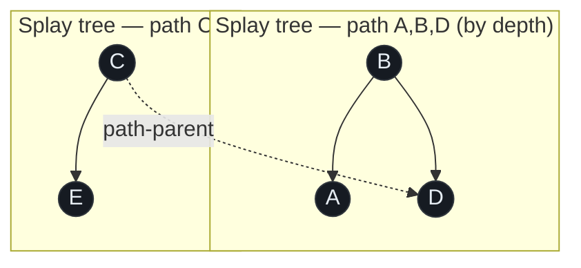
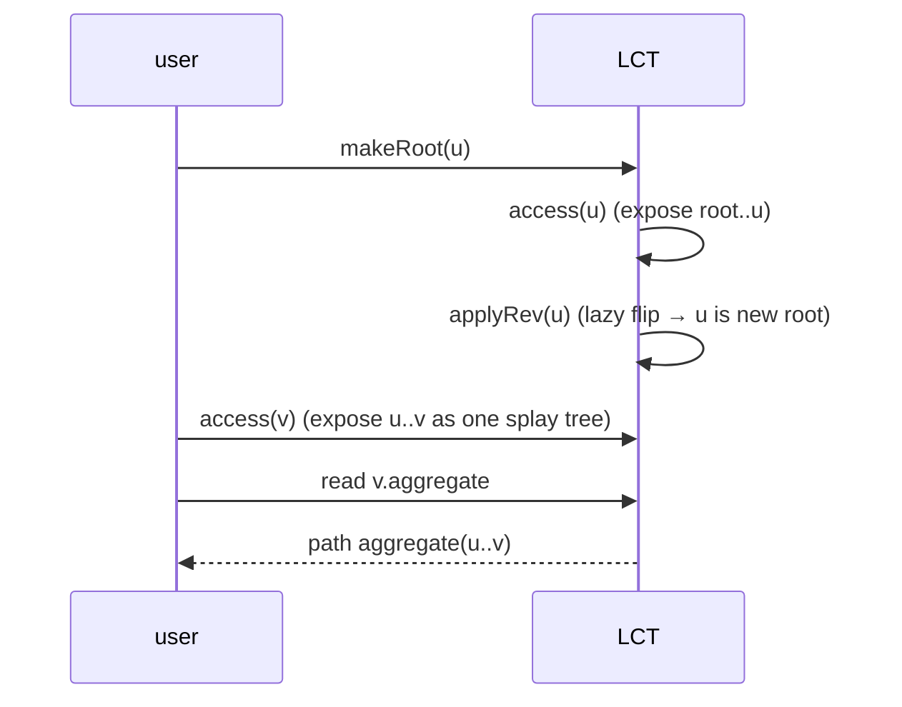

# Link-Cut Tree — Middle Level

> **Audience:** Engineers who have read `junior.md`, can already implement `access`, `link`, `cut`, and a path-sum query, and now want to understand *why* each operation is correct and amortized O(log n), how the **lazy-reverse `makeRoot`** really works, and **when to reach for an LCT instead of Heavy-Light Decomposition or Euler-tour trees**.

At the junior level the Link-Cut Tree was "everything is `access`, then read one field." That is true, but it leaves three questions unanswered: (1) *Why* is `access` fast — what guarantees the preferred paths do not blow up? (2) *How* does `makeRoot` reverse a path in O(1) extra work, and why does the lazy flag compose correctly through splays? (3) *When* is the LCT actually the right tool versus its static cousins? This document answers all three, with worked invariants, a comparison table, and full code for `makeRoot`, `findRoot`, `lca`, and reversible path aggregates.

---

## Table of Contents

1. [Introduction — From "How" to "Why"](#introduction)
2. [The Two Invariants That Make LCT Correct](#invariants)
3. [Why `access` Is Amortized O(log n) — The Intuition](#why-fast)
4. [`makeRoot` and the Lazy-Reverse Trick](#makeroot)
5. [Comparison — LCT vs HLD vs Euler-Tour Trees](#comparison)
6. [Operation Correctness Walkthroughs](#correctness)
7. [Reversible Path Aggregates](#aggregates)
8. [Code Examples — Go, Java, Python](#code-examples)
9. [Error Handling](#errors)
10. [Performance Analysis](#performance)
11. [Best Practices](#best-practices)
12. [Visual Animation](#animation)
13. [Summary](#summary)

---

<a name="introduction"></a>
## 1. Introduction — From "How" to "Why"

The LCT keeps two layers (recall `junior.md`): the **represented forest** (the logical trees) and the **auxiliary forest of splay trees** (one splay tree per preferred path). The magic is that we never store the represented tree explicitly — it is *implied* by the auxiliary trees plus the path-parent pointers. To trust this machine, you must believe two invariants always hold, and you must believe `access` cannot be tricked into doing too much work. We build that belief here.

A second, very practical question is selection. An interview or a real system rarely *says* "use a link-cut tree." It says "the tree changes and we need path maxima," or "we need online connectivity with edge insertions and deletions," or "implement dynamic MST." Knowing which of LCT / HLD / Euler-tour trees / top trees fits is the actual senior skill. §5 is the decision core.

---

<a name="invariants"></a>
## 2. The Two Invariants That Make LCT Correct

### Invariant 1 — Splay trees are keyed by represented-depth

Each splay tree stores **one preferred path**. Its **in-order traversal yields the path nodes from shallowest to deepest** in the represented tree. Equivalently: the left subtree of a splay node holds the strictly-shallower path nodes, the right subtree the strictly-deeper ones. This is what lets "the root of the represented tree on this path" be found by walking **all the way left**, and "the deepest exposed node" by walking right.

> If this order is ever violated (e.g., you rotated without flushing a lazy reverse), every depth-based decision — `findRoot`, `cut`, the contained/aggregate logic — silently breaks. This is why §4's lazy flag must be flushed before any structural touch.

### Invariant 2 — Path-parent pointers connect splay roots upward only

The **root** of each auxiliary (splay) tree carries a `parent` pointer to a node in the splay tree **above** it (the node where this preferred path attaches). The upper node does **not** know about the lower path — the link is one-directional. We reuse the single `parent` field for both splay-parent and path-parent; the `isRoot(n)` test (parent does not list `n` as a child) disambiguates them.

> Because the upper node does not point back, re-stitching preferred children in `access` is O(1) per step — you only ever overwrite the *lower* side's pointer plus one `right` child. No upward fan-out to fix.

These two invariants together encode the *entire* represented forest. Every operation is "preserve both invariants while reshaping," and that is exactly what `splay`, `push`, `pull`, and the `access` loop do.



The dashed `C ⇢ D` is a path-parent pointer: the splay tree `{C,E}` attaches under `D` in the represented tree, even though, *inside* the auxiliary forest, `C` is the root of its own splay tree.

---

<a name="why-fast"></a>
## 3. Why `access` Is Amortized O(log n) — The Intuition

The formal proof (splay potential + counting preferred-child changes) lives in `professional.md`. Here is the *intuition* a middle engineer should carry.

`access(v)` does some number `k` of `splay` calls — one per preferred path it climbs through. Each `splay` is amortized O(log n) by the splay-tree access lemma. So `access` costs O(k log n). The worry: could `k` be Θ(n)? A single `access` certainly *can* climb many paths. The resolution is **amortization over the whole sequence**:

- Every iteration of the `access` loop that climbs from a lower path to an upper path performs **one preferred-child change** (it makes the lower path the upper node's new preferred child, demoting whatever was preferred before).
- The key lemma (Sleator–Tarjan): **across any sequence of `m` operations, the total number of preferred-child changes is O(m log n)**. Intuitively, you cannot keep creating new preferred children faster than you destroy them, and a charging argument tied to "light" vs "heavy" edges caps the total.

So although one `access` might do many path-climbs, the *sum* over all operations is O(m log n), giving **amortized O(log n) per operation**. The mental shortcut: **count preferred-child changes, not individual node visits** — that count is what is bounded.

| Cost component | Per `access` | Across `m` operations |
|---|---|---|
| Number of `splay` calls (= path-climbs) | up to O(n) (rare) | **O(m log n) total** |
| Cost of each `splay` | amortized O(log n) | — |
| **Net** | amortized O(log n) | O(m log n) |

---

<a name="makeroot"></a>
## 4. `makeRoot` and the Lazy-Reverse Trick

### 4.1 The problem `makeRoot` solves

Path queries between *arbitrary* `u` and `v` need `u` to be the root, so that `access(v)` exposes exactly the `u→v` path. But the represented tree has a *fixed* root, and `u` might be deep inside it. `makeRoot(v)` re-roots the whole tree so `v` becomes the root — flipping the direction of every edge on the old-root-to-`v` path.

### 4.2 Reversal = swap depth order

After `access(v)`, the entire root-to-`v` path is one splay tree keyed by depth (shallow→deep). Re-rooting at `v` means **reversing** that order: `v` (formerly deepest) must become shallowest, and the old root (formerly shallowest) becomes deepest. Reversing the in-order sequence of a BST is achieved by **swapping every node's left and right children**. Doing that eagerly is O(size). Instead we do it **lazily**:

```text
applyRev(n):                 # mark, don't recurse
    swap n.left, n.right
    n.rev = !n.rev           # toggle a pending-reverse flag

push(n):                     # flush one level, just-in-time
    if n.rev:
        applyRev(n.left)
        applyRev(n.right)
        n.rev = false
```

`makeRoot(v)` is then just `access(v); applyRev(v)` — O(1) on top of the access. The flag is **flushed on demand**: any time `splay`, `rotate`, or a child-read touches a node, `push` runs first, so descendants only ever see a *consistent* depth order. The flags **compose** because toggling twice cancels (`rev` is a XOR-like boolean) and the child-swap is its own inverse.

### 4.3 Why aggregates survive reversal

Reversing a path reverses the order of its node values. An aggregate is safe under `makeRoot` **iff it is order-independent** (a commutative monoid): sum, min, max, gcd, xor all qualify. A *directional* aggregate — e.g., "value of the shallowest node," or a non-commutative matrix product read left-to-right — does **not** survive a swap and must store both forward and reverse versions (see `senior.md` for the two-sided trick).



---

<a name="comparison"></a>
## 5. Comparison — LCT vs HLD vs Euler-Tour Trees

This is the table to memorize.

| Attribute | **Link-Cut Tree** | **Heavy-Light Decomposition** (`11-graphs/17`) | **Euler-Tour Tree** |
|---|---|---|---|
| Tree shape | **Dynamic** (link/cut) | **Static** (fixed shape) | Dynamic (link/cut) |
| `link` / `cut` | O(log n) amortized | O(n) rebuild | O(log n) |
| Path aggregate (sum/max) | **O(log n)** | O(log² n) (or O(log n) with extra work) | **Not directly** (Euler tour loses path structure) |
| Subtree aggregate | O(log n) with augmentation | O(log n) (Euler-flattened) | **O(log n)** (natural fit) |
| Connectivity query | O(log n) | O(1) (static) | O(log n) |
| `makeRoot` / re-root | O(log n) (lazy reverse) | not supported | O(log n) |
| Bound type | amortized | worst-case per query | amortized |
| Constant factor | high | **low** | medium |
| Implementation difficulty | **hard** | medium | medium |
| Killer use case | dynamic tree path queries, flow | static tree path queries | dynamic *subtree* / connectivity |

**Choose the LCT when** the tree's *shape changes* (edges inserted/deleted) **and** you need **path** aggregates or re-rooting. This is the dynamic MST, dynamic connectivity-with-path-info, and network-flow setting.

**Choose HLD when** the tree is **fixed** and you want path queries with a small constant and worst-case bounds — it is simpler and faster in practice for static trees.

**Choose Euler-tour trees when** the tree is dynamic but you care about **subtree** aggregates or **plain connectivity**, not path aggregates — the Euler representation makes subtrees a contiguous range but destroys the path structure that LCT preserves.

**Top trees** (see `professional.md`) generalize LCT to *worst-case* O(log n) and arbitrary "cluster" aggregates — use them when amortized is unacceptable (hard real-time) or when you need non-path cluster information.

---

<a name="correctness"></a>
## 6. Operation Correctness Walkthroughs

### 6.1 `findRoot(v)` is correct

After `access(v)`, the splay tree contains exactly the represented-root-to-`v` path, ordered by depth (Invariant 1). The **shallowest** node is the represented root. Walking **all the way left** (flushing `push` each step) reaches it; a final `splay` keeps the structure balanced. Correct because "leftmost = shallowest = root."

### 6.2 `link(u, v)` is correct

Precondition: `u` and `v` are in **different** trees (else we create a cycle — check with `findRoot`). `makeRoot(u)` makes `u` the root of its tree (so `u` has no parent). Setting `u.parent = v` adds a **path-parent pointer** from `u`'s splay root to `v`. In the represented forest this is exactly the new edge `u—v` with `u` hanging under `v`. No splay-child pointers change, so both invariants hold.

### 6.3 `cut(u, v)` is correct

Precondition: `u—v` is a real edge. `makeRoot(u); access(v)` exposes the `u→v` path; since they are adjacent and `u` is the root, the path has exactly two nodes with `u` shallowest, so in the splay tree `v.left == u` and `u.right == null`. Detaching (`v.left.parent = null; v.left = null; pull(v)`) removes precisely the edge `u—v`, splitting the tree into the `u`-subtree and the `v`-subtree. The verification `v.left == u && u.right == null` guards against cutting a non-edge.

### 6.4 `lca(u, v)` under a fixed root

When you do **not** call `makeRoot` (root is fixed): `access(u)` exposes root-to-`u`. Then `access(v)` climbs from `v` upward; the **last** node where the second access switches preferred paths — the value `access` returns as its "last path-parent" — is the **lowest common ancestor** of `u` and `v`. This is the standard rooted-LCA-via-LCT trick and is O(log n).

---

<a name="aggregates"></a>
## 7. Reversible Path Aggregates

Because `makeRoot` reverses paths, an aggregate used with arbitrary-endpoint path queries must be a **commutative monoid**:

| Aggregate | Combine | Identity | Reversible? |
|---|---|---|---|
| Sum | `a + b` | `0` | Yes |
| Max | `max(a, b)` | `-∞` | Yes |
| Min | `min(a, b)` | `+∞` | Yes |
| GCD | `gcd(a, b)` | `0` | Yes |
| XOR | `a ^ b` | `0` | Yes |
| Count of nodes | `a + b` | `0` | Yes (path length) |
| "Shallowest value" | non-associative | — | **No** — store both ends |
| Matrix product (ordered) | `A · B` | `I` | **No** — store forward and reverse products |

For non-commutative aggregates with `makeRoot`, keep two values per node — the aggregate read left-to-right and right-to-left — and have `applyRev` swap them. This is the same idea as a reversible segment-tree node.

---

<a name="code-examples"></a>
## 8. Code Examples — Go, Java, Python

Below: a full LCT supporting **path max** plus **`lca`** (fixed-root) and arbitrary-endpoint **path max** (via `makeRoot`). It reuses the splay/access core from `junior.md`, swapping `sum` for `mx`.

### 8.1 Path-max LCT with LCA

#### Go
```go
package lct

const negInf = int64(-1) << 62

type Node struct {
    ch     [2]*Node
    parent *Node
    val    int64
    mx     int64 // subtree max within this splay tree
    rev    bool
}

func New(v int64) *Node { return &Node{val: v, mx: v} }

func isRoot(n *Node) bool {
    p := n.parent
    return p == nil || (p.ch[0] != n && p.ch[1] != n)
}

func pull(n *Node) {
    n.mx = n.val
    if l := n.ch[0]; l != nil && l.mx > n.mx {
        n.mx = l.mx
    }
    if r := n.ch[1]; r != nil && r.mx > n.mx {
        n.mx = r.mx
    }
}

func applyRev(n *Node) {
    if n != nil {
        n.ch[0], n.ch[1] = n.ch[1], n.ch[0]
        n.rev = !n.rev
    }
}

func push(n *Node) {
    if n.rev {
        applyRev(n.ch[0])
        applyRev(n.ch[1])
        n.rev = false
    }
}

func rotate(n *Node) {
    p, g := n.parent, n.parent.parent
    d := 0
    if p.ch[1] == n {
        d = 1
    }
    if !isRoot(p) {
        if g.ch[0] == p {
            g.ch[0] = n
        } else {
            g.ch[1] = n
        }
    }
    n.parent = g
    p.ch[d] = n.ch[d^1]
    if n.ch[d^1] != nil {
        n.ch[d^1].parent = p
    }
    n.ch[d^1] = p
    p.parent = n
    pull(p)
    pull(n)
}

func splay(n *Node) {
    push(n)
    for !isRoot(n) {
        p := n.parent
        if !isRoot(p) {
            g := p.parent
            push(g)
            push(p)
            push(n)
            if (g.ch[0] == p) == (p.ch[0] == n) {
                rotate(p)
            } else {
                rotate(n)
            }
        } else {
            push(p)
            push(n)
        }
        rotate(n)
    }
}

func access(n *Node) *Node {
    var last *Node
    for cur := n; cur != nil; cur = cur.parent {
        splay(cur)
        cur.ch[1] = last
        pull(cur)
        last = cur
    }
    splay(n)
    return last
}

func MakeRoot(n *Node) { access(n); applyRev(n) }

func Link(u, v *Node) { MakeRoot(u); u.parent = v }

func Cut(u, v *Node) {
    MakeRoot(u)
    access(v)
    if v.ch[0] == u && u.ch[1] == nil {
        v.ch[0].parent = nil
        v.ch[0] = nil
        pull(v)
    }
}

// PathMax of arbitrary endpoints (uses makeRoot).
func PathMax(u, v *Node) int64 {
    MakeRoot(u)
    access(v)
    return v.mx
}

// LCA under a FIXED root r: call MakeRoot(r) once beforehand.
func LCA(u, v *Node) *Node {
    access(u)
    return access(v) // last switch point = LCA
}
```

#### Java
```java
public final class LctMax {
    static final long NEG_INF = Long.MIN_VALUE / 4;

    static final class Node {
        Node left, right, parent;
        long val, mx;
        boolean rev;
        Node(long v) { val = v; mx = v; }
    }

    static boolean isRoot(Node n) {
        return n.parent == null || (n.parent.left != n && n.parent.right != n);
    }

    static void pull(Node n) {
        n.mx = n.val;
        if (n.left != null)  n.mx = Math.max(n.mx, n.left.mx);
        if (n.right != null) n.mx = Math.max(n.mx, n.right.mx);
    }

    static void applyRev(Node n) {
        if (n == null) return;
        Node t = n.left; n.left = n.right; n.right = t;
        n.rev = !n.rev;
    }

    static void push(Node n) {
        if (n.rev) { applyRev(n.left); applyRev(n.right); n.rev = false; }
    }

    static void rotate(Node n) {
        Node p = n.parent, g = p.parent;
        boolean right = (p.right == n);
        Node child = right ? n.left : n.right;
        if (!isRoot(p)) { if (g.left == p) g.left = n; else g.right = n; }
        n.parent = g;
        if (right) { p.right = child; n.left = p; }
        else       { p.left = child;  n.right = p; }
        if (child != null) child.parent = p;
        p.parent = n;
        pull(p); pull(n);
    }

    static void splay(Node n) {
        push(n);
        while (!isRoot(n)) {
            Node p = n.parent;
            if (!isRoot(p)) {
                Node g = p.parent;
                push(g); push(p); push(n);
                boolean zigzig = (g.left == p) == (p.left == n);
                rotate(zigzig ? p : n);
            } else { push(p); push(n); }
            rotate(n);
        }
    }

    static Node access(Node n) {
        Node last = null;
        for (Node cur = n; cur != null; cur = cur.parent) {
            splay(cur); cur.right = last; pull(cur); last = cur;
        }
        splay(n);
        return last;
    }

    public static void makeRoot(Node n) { access(n); applyRev(n); }
    public static void link(Node u, Node v) { makeRoot(u); u.parent = v; }

    public static void cut(Node u, Node v) {
        makeRoot(u); access(v);
        if (v.left == u && u.right == null) {
            v.left.parent = null; v.left = null; pull(v);
        }
    }

    public static long pathMax(Node u, Node v) {
        makeRoot(u); access(v); return v.mx;
    }

    /** LCA under a fixed root r — call makeRoot(r) once first. */
    public static Node lca(Node u, Node v) { access(u); return access(v); }
}
```

#### Python
```python
NEG_INF = float("-inf")

class Node:
    __slots__ = ("ch", "parent", "val", "mx", "rev")
    def __init__(self, val):
        self.ch = [None, None]
        self.parent = None
        self.val = val
        self.mx = val
        self.rev = False

def is_root(n):
    p = n.parent
    return p is None or (p.ch[0] is not n and p.ch[1] is not n)

def pull(n):
    n.mx = n.val
    if n.ch[0] and n.ch[0].mx > n.mx: n.mx = n.ch[0].mx
    if n.ch[1] and n.ch[1].mx > n.mx: n.mx = n.ch[1].mx

def apply_rev(n):
    if n is None: return
    n.ch[0], n.ch[1] = n.ch[1], n.ch[0]
    n.rev = not n.rev

def push(n):
    if n.rev:
        apply_rev(n.ch[0]); apply_rev(n.ch[1]); n.rev = False

def rotate(n):
    p, g = n.parent, n.parent.parent
    d = 1 if p.ch[1] is n else 0
    if not is_root(p):
        if g.ch[0] is p: g.ch[0] = n
        else:            g.ch[1] = n
    n.parent = g
    p.ch[d] = n.ch[d ^ 1]
    if n.ch[d ^ 1]: n.ch[d ^ 1].parent = p
    n.ch[d ^ 1] = p
    p.parent = n
    pull(p); pull(n)

def splay(n):
    push(n)
    while not is_root(n):
        p = n.parent
        if not is_root(p):
            g = p.parent
            push(g); push(p); push(n)
            rotate(p if (g.ch[0] is p) == (p.ch[0] is n) else n)
        else:
            push(p); push(n)
        rotate(n)

def access(n):
    last = None
    cur = n
    while cur is not None:
        splay(cur); cur.ch[1] = last; pull(cur); last = cur; cur = cur.parent
    splay(n)
    return last

def make_root(n): access(n); apply_rev(n)
def link(u, v): make_root(u); u.parent = v

def cut(u, v):
    make_root(u); access(v)
    if v.ch[0] is u and u.ch[1] is None:
        v.ch[0].parent = None; v.ch[0] = None; pull(v)

def path_max(u, v):
    make_root(u); access(v); return v.mx

def lca(u, v):           # fixed root: call make_root(root) once first
    access(u); return access(v)
```

### 8.2 Connectivity from `findRoot`

```python
def find_root(n):
    access(n)
    while n.ch[0]:
        push(n); n = n.ch[0]
    splay(n)
    return n

def connected(u, v):
    return find_root(u) is find_root(v)
```

This is the kernel of **online dynamic connectivity** with `link`/`cut`.

---

<a name="errors"></a>
## 9. Error Handling

| Scenario | What goes wrong | Correct approach |
|---|---|---|
| `link` of already-connected nodes | Creates a cycle → corrupts every later op | Guard with `if find_root(u) is not find_root(v)` |
| `cut` of a non-edge | Splits the tree wrongly | Verify `v.left == u && u.right == null` before detaching |
| Reading aggregate without exposing path | Reads a stale subtree value | Always `makeRoot(u); access(v)` first, then read `v.mx`/`v.sum` |
| Lazy flag not flushed | Reversed order leaks → wrong depths | `push` before every `rotate`, child-read, and the walk-left in `findRoot` |
| Non-commutative aggregate + `makeRoot` | Wrong answer, silently | Use a two-sided node or avoid `makeRoot` (fixed-root queries) |

---

<a name="performance"></a>
## 10. Performance Analysis

The benchmark you should run: a random mix of `link`/`cut`/`pathMax` and compare wall-clock against a brute-force parent-walk forest. The LCT should be flat in `n` (per-op ~O(log n)); the brute force should grow linearly with path length.

#### Go
```go
package main

import (
    "fmt"
    "math/rand"
    "time"
)

func main() {
    for _, n := range []int{1000, 10000, 100000} {
        nodes := make([]*Node, n)
        for i := range nodes {
            nodes[i] = New(int64(i))
        }
        // chain them
        for i := 1; i < n; i++ {
            Link(nodes[i], nodes[i-1])
        }
        start := time.Now()
        ops := 200000
        for k := 0; k < ops; k++ {
            a, b := rand.Intn(n), rand.Intn(n)
            _ = PathMax(nodes[a], nodes[b])
        }
        fmt.Printf("n=%7d: %.2f ns/op\n", n, float64(time.Since(start).Nanoseconds())/float64(ops))
    }
}
```

#### Java
```java
import java.util.Random;

public class Bench {
    public static void main(String[] args) {
        Random rnd = new Random(1);
        for (int n : new int[]{1000, 10000, 100000}) {
            LctMax.Node[] nodes = new LctMax.Node[n];
            for (int i = 0; i < n; i++) nodes[i] = new LctMax.Node(i);
            for (int i = 1; i < n; i++) LctMax.link(nodes[i], nodes[i - 1]);
            int ops = 200000;
            long start = System.nanoTime();
            for (int k = 0; k < ops; k++)
                LctMax.pathMax(nodes[rnd.nextInt(n)], nodes[rnd.nextInt(n)]);
            System.out.printf("n=%7d: %.2f ns/op%n", n, (System.nanoTime() - start) / (double) ops);
        }
    }
}
```

#### Python
```python
import random, time

for n in (1000, 10000, 50000):
    nodes = [Node(i) for i in range(n)]
    for i in range(1, n):
        link(nodes[i], nodes[i - 1])
    ops = 50000
    start = time.perf_counter()
    for _ in range(ops):
        path_max(nodes[random.randrange(n)], nodes[random.randrange(n)])
    print(f"n={n:>7}: {(time.perf_counter()-start)/ops*1e9:.0f} ns/op")
```

You should see per-op time grow like `log n` — roughly constant across these `n` because logs differ by small factors.

---

<a name="best-practices"></a>
## 11. Best Practices

- **Prefer fixed-root queries when possible.** If the tree's root never changes, skip `makeRoot` entirely and use `access(u); access(v)` for LCA-based path splitting — you avoid lazy-reverse overhead and non-commutative pitfalls.
- **Keep one `parent` field, disambiguated by `isRoot`.** Two separate fields invite desync bugs.
- **Always `push` before structural reads.** Bake it into `splay`, `rotate`, and `findRoot`'s walk-left.
- **Use commutative aggregates** with `makeRoot`; for non-commutative ones store both directions.
- **Test invariants explicitly** in debug builds: re-derive the represented tree by walking path-parents and compare to a reference forest.
- **Reach for HLD instead** if the tree is static — simpler, faster, worst-case.

---

<a name="animation"></a>
## 12. Visual Animation

> See [`animation.html`](./animation.html).
>
> Middle-level relevance: step `access(v)` to watch preferred-child re-pointing (the events the amortized bound counts), then run `makeRoot` to see the lazy-reverse flag flip a path's direction, then `link`/`cut` to watch connectivity change. The log records each preferred-child change so you can *see* what the O(m log n) bound is counting.

---

<a name="summary"></a>
## 13. Summary

- The LCT rests on **two invariants**: splay trees ordered by represented-depth, and one-directional path-parent pointers between splay roots.
- `access` is amortized O(log n) because the quantity that matters — **total preferred-child changes** — is bounded by O(m log n) across the whole sequence, not per operation.
- **`makeRoot(v) = access(v) + applyRev(v)`**: a lazy reverse flag flips a path's depth order in O(1) extra, flushed just-in-time by `push`. Aggregates survive only if they are commutative monoids.
- **Choose LCT** for *dynamic* trees with *path* queries / re-rooting; **HLD** for static path queries; **Euler-tour trees** for dynamic *subtree*/connectivity; **top trees** for worst-case bounds.
- `findRoot`, `link`, `cut`, and `lca` are all short, provably-correct wrappers around `access`.

**Next step:** [`senior.md`](./senior.md) — dynamic connectivity/MST/flow systems, subtree aggregates via the virtual-subtree augmentation, splay vs other BBST choices, and production implementation pitfalls.
