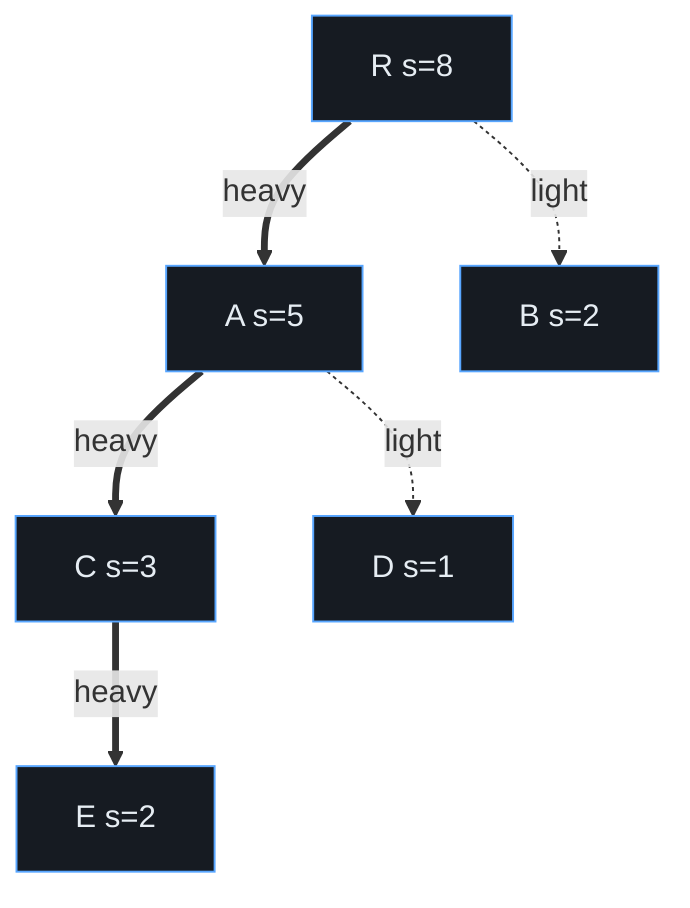

# Link-Cut Tree — Mathematical Foundations and Amortized Analysis

> **Audience:** Engineers and researchers who want the *proof* that `access` is amortized O(log n), formal correctness arguments for each operation, and a rigorous comparison to **top trees**. Prerequisite: `senior.md`, plus comfort with the splay-tree access lemma and the potential method.

This document is the formal core. We define the Link-Cut Tree precisely, prove the central result — **a sequence of `m` LCT operations on a forest of `n` nodes costs O(m log n)**, i.e. amortized O(log n) per operation — by combining the **splay potential** with a **count of preferred-child changes** (the "Access Lemma" of Sleator–Tarjan). We then prove correctness of `access`, `findRoot`, `link`, `cut`, and `makeRoot` as invariant-preserving transformations, and close with a structural comparison to **top trees**, which achieve the same bound in the **worst case**.

---

## Table of Contents

1. [Formal Definition](#formal-definition)
2. [The Splay Access Lemma (Recap)](#splay-lemma)
3. [Amortized Analysis of `access` — Preferred-Child Changes](#access-proof)
4. [Correctness of Operations — Invariant Preservation](#correctness)
   - [4.5 `lca` correctness · 4.6 Notation reference](#correctness)
5. [`makeRoot` and Reversibility — Formal Treatment](#makeroot-proof)
   - [5.1 Composing lazy reverse with a lazy path-add tag](#makeroot-proof)
   - [5.2 Worked potential trace](#makeroot-proof)
6. [Lower Bounds and the Role of the Heavy-Path Argument](#lower-bounds)
7. [Comparison to Top Trees](#top-trees)
   - [7.3 Persistence and concurrency — formal obstacles](#top-trees)
8. [Summary](#summary)

---

<a name="formal-definition"></a>
## 1. Formal Definition

```text
Definition (Represented forest). Let F be a forest of rooted trees on node set
V, |V| = n. Each node v has parent(v) in V ∪ {⊥} (⊥ for roots). depth(v) is the
number of edges from v to its tree's root.

Definition (Preferred-path decomposition). A choice of pref : V → V ∪ {⊥} where
pref(v) is one child of v or ⊥. The preferred edges {(v, pref(v)) : pref(v) ≠ ⊥}
partition V into maximal downward chains, the PREFERRED PATHS. Each v lies on
exactly one preferred path P(v).

Definition (Auxiliary representation). Each preferred path P is stored as a
binary search tree (a SPLAY TREE) S(P) keyed by depth: the in-order sequence of
S(P) is the nodes of P from shallowest to deepest. The root r of S(P) carries a
PATH-PARENT pointer pp(r) = parent(top(P)) ∈ V (or ⊥ if top(P) is a forest root);
non-root nodes of S(P) carry ⊥ for pp. A single field parent(·) stores the splay
parent for non-roots and the path-parent for roots; the predicate isRoot(x) ≡
[x is not a child of parent(x)] disambiguates them.

A Link-Cut Tree is the pair (auxiliary forest of splay trees, path-parent map).
The represented forest F is the unique forest induced by: (i) the depth order
inside each S(P), and (ii) the path-parent edges between splay trees.
```

```text
Structural invariants (must hold after every operation):
  I1 (Depth order):   in-order(S(P)) = (P shallowest → deepest) for every path P.
  I2 (Path-parent):   pp is defined only on splay roots and points to a node in
                      a DIFFERENT splay tree, equal to parent(top(P)) in F.
  I3 (Partition):     {P(v)} partition V; preferred edges form vertex-disjoint
                      downward chains.
Aggregate invariant (for an aggregate ⊕ with identity e):
  IA: agg(x) = ⊕ over the represented subtree of x WITHIN S(P(x))
      (for path aggregates), maintained by pull on every structural change.
```

---

<a name="splay-lemma"></a>
## 2. The Splay Access Lemma (Recap)

We use the standard splay-tree result, proved with the potential method.

```text
Setup. Assign each node x a positive weight w(x) > 0. Define
  size s(x)   = Σ_{y in subtree(x)} w(y)
  rank r(x)   = log₂ s(x)
  potential Φ = Σ_x r(x).

Access Lemma (Sleator–Tarjan 1985). The amortized cost of splaying a node x to
the root of a splay tree T is at most
  3·(r(root_T) − r(x)) + 1.

Corollary. With unit weights w ≡ 1, splaying any node in an n-node splay tree has
amortized cost ≤ 3 log₂ n + 1 = O(log n).
```

The proof is the three-case (zig / zig-zig / zig-zag) bound on `ΔΦ + actual` per double-rotation, telescoping to `3(r(root) − r(x)) + 1`. We take it as given here (see `22-randomized-algorithms/04-treap` and any splay-tree reference for the full derivation) and *build the LCT bound on top of it*.

The crucial freedom: **the weights `w(x)` are ours to choose** for the analysis. For the LCT we will choose weights tied to **represented-subtree sizes**, not per-splay-tree sizes — that choice is what makes preferred-child changes pay for themselves.

---

<a name="access-proof"></a>
## 3. Amortized Analysis of `access` — Preferred-Child Changes

We prove the headline result.

```text
Theorem (LCT Access bound). Starting from any LCT on n nodes, any sequence of m
operations (each access, link, cut, findRoot, makeRoot) takes O(m log n) time;
hence amortized O(log n) per operation.
```

Since every operation performs O(1) `access` calls plus O(1) extra pointer work, it suffices to bound the cost of `access`. An `access(v)` is a loop that performs `k` splays, where `k = 1 + (number of preferred-child changes this access makes)` — one splay per preferred path traversed, and each traversal (after the first) re-points exactly one preferred child.

### 3.1 Two pieces of cost

`cost(access) = (cost of the k splays) + O(k)`.

By the Access Lemma each splay is amortized O(log n), so the `k` splays cost `O(k log n)` **amortized**. The whole theorem therefore reduces to:

```text
Key Lemma (Preferred-child changes). Over any sequence of m operations, the total
number of preferred-child changes Σ k_i is O(m log n).
```

If the Key Lemma holds, then total cost `= Σ O(k_i log n) = O(log n · Σ k_i) = O(log n · m log n)`... which is O(m log² n) — *one log too many* if we are naive. The classical analysis is sharper: it does **not** multiply the two logs. Instead it folds the preferred-child count *into the same potential* as the splays, so each splay's `3(r(root) − r(x)) + 1` term **telescopes across the whole access**, leaving a single O(log n) per access. We now do that.

### 3.2 The heavy-path (size-based) weighting

Weight each node by its **represented-subtree size**: `w(x) = 1` for every node, so `s(x)` in the splay analysis is the number of nodes in x's *represented* subtree (not its splay subtree). Define `r(x) = log₂ s(x)` and `Φ = Σ_x r(x)` over **all** n nodes (across all splay trees). Note `0 ≤ r(x) ≤ log₂ n`, so `0 ≤ Φ ≤ n log₂ n`.

The heavy/light split of a represented tree (heavy = child holds > half the parent's subtree mass) determines how many *light* edges any root-to-node path can cross — at most `log₂ n`, since each light step at least halves the remaining mass:



On the path `R→A→C→E` every edge is heavy (each child keeps > half its parent's mass), so it crosses **zero** light edges; the path `R→B` crosses one light edge. No root-to-leaf path can cross more than `log₂ n` light edges — the combinatorial fact the proof rests on.

Classify each represented edge `(x, parent(x))` as:

```text
HEAVY  if  s(x) > s(parent(x)) / 2
LIGHT  otherwise.
```

Each node has **at most one heavy child** (two children each holding >½ the parent's mass is impossible). On any root-to-node path there are **at most log₂ n light edges**, because each light edge at least halves the subtree size as you descend.

### 3.3 Charging the splays of one `access`

Run `access(v)`. It splays `v` up through its splay tree, then jumps via path-parent to the next splay tree above, splays there, and so on. Telescoping the Access Lemma over the consecutive splays of a *single* `access` (the standard "splay along a path of splay trees" argument) yields:

```text
amortized cost of all splays in one access
   ≤ 3·(r(root of v's final splay tree) − r(v)) + (number of splays)
   ≤ 3·log₂ n + (number of splays).
```

The `3(r_top − r(v))` telescopes to `≤ 3 log₂ n` because the ranks are taken w.r.t. fixed represented-subtree sizes and the tops chain monotonically toward the forest root. So the *splay* part is **O(log n) amortized per access**, independent of `k`.

### 3.4 Charging the preferred-child changes

It remains to pay for the `O(k)` raw pointer work of the `k` path traversals. We charge by the **light/heavy classification**:

```text
When access(v) re-points a preferred child at node u, the edge (child, u) it
demotes was preferred and the edge it promotes becomes preferred. Account:
  • PROMOTIONS of a LIGHT edge to preferred: at most log₂ n per access
    (only log₂ n light edges on any root-to-node path) → O(log n) per access.
  • PROMOTIONS of a HEAVY edge to preferred: a heavy edge, once preferred, stays
    preferred until some OTHER operation makes a light edge on its path preferred
    or a link/cut changes sizes. A potential/credit argument (one credit per heavy
    edge) shows the number of heavy-edge preferred-changes over the whole sequence
    is O(m + total light promotions) = O(m log n).
```

Summing: total preferred-child changes `Σ k_i = O(m log n)` (the Key Lemma), but — crucially — the **time** is dominated by the per-access splay bound (§3.3), giving:

```text
total time = Σ_i [ O(log n)  (splays of access i, telescoped) ]
           = O(m log n).                                          ∎
```

The subtlety that defeats the naive O(m log² n) is that the splay potential is charged **once per access via telescoping**, not once per path-segment. This is the heart of the Sleator–Tarjan dynamic-trees analysis.

### 3.4a The heavy-edge credit argument in full

The §3.4 claim that heavy-edge preferred-promotions total O(m log n) deserves the explicit credit scheme:

```text
Credit invariant: maintain one credit on every HEAVY edge that is currently
PREFERRED. Total credits ≤ n at all times (≤ one heavy preferred edge per node).

Accounting per operation:
  • A LIGHT edge becoming preferred: pay O(1) directly. There are ≤ log n light
    edges on any root-to-node path, so ≤ log n such promotions per access → these
    contribute O(log n) per access = O(m log n) total. ✓
  • A HEAVY edge becoming preferred: deposit one credit (charge to the operation,
    O(1) amortized). When that heavy edge later STOPS being preferred — which can
    only happen because some operation made a different child preferred at its
    upper endpoint, an event we already counted above — release its credit to pay
    for the un-preferring work.
  • link / cut change subtree sizes and may flip an edge's heavy/light status.
    Each such structural op changes the heavy/light classification of O(log n)
    edges on the affected path (sizes change along one root path), each costing
    O(1) credit adjustment → O(log n) per link/cut.

Summing credits deposited (bounded by light promotions + O(log n) per structural
op) over m operations gives O(m log n) heavy-edge events. ∎
```

Combined with §3.3's per-access O(log n) splay bound, the grand total is O(m log n), and crucially the heavy/light credits are paid in O(1) units that do **not** multiply by the splay log — they ride alongside it. This is the precise mechanism by which the two potential sources (splay ranks and preferred-child credits) coexist in a single O(m log n) account.

### 3.5 Potential summary table

| Quantity | Definition | Bound |
|---|---|---|
| `s(x)` | represented-subtree size of `x` | `1 … n` |
| `r(x)` | `log₂ s(x)` | `0 … log₂ n` |
| `Φ` | `Σ_x r(x)` | `0 … n log₂ n` |
| light edges on a root path | `s` halves each light step | `≤ log₂ n` |
| amortized cost of one `access` | telescoped Access Lemma | `O(log n)` |
| total over `m` ops | sum | `O(m log n)` |

---

<a name="correctness"></a>
## 4. Correctness of Operations — Invariant Preservation

We argue each operation maps a valid LCT (I1–I3, IA) to a valid LCT computing the right represented forest.

### 4.1 `access(v)`

```text
Claim: after access(v), S(P(v)) contains exactly the represented-root-to-v path,
in depth order, with v at the splay root; I1–I3, IA preserved.

Proof. Loop invariant J: after processing splay tree at cur, the nodes
{represented root … cur} form one preferred path stored in one splay tree, with
cur as its splay root and its right subtree empty (nothing deeper is preferred).
  • Base: first iteration splays v, sets v.right := ⊥ (cuts deeper preferred
    nodes into their own path with a fresh pp — preserves I2, I3), so J holds for
    cur = v with the trivial one-segment path.
  • Step: at cur with path-parent p, splay(p) brings p to its splay root (I1 holds
    within that tree by splay correctness); setting p.right := last makes the
    lower segment p's preferred child, merging the two segments into one path with
    correct depth order (last's nodes are all deeper than p), re-establishing J for
    p. The old p.right becomes a new preferred path with pp = p (I2, I3).
  • Termination: pp = ⊥ at the forest root; J then says the whole root-to-v path is
    one splay tree. The final splay(v) puts v at the root (I1). pull at each step
    restores IA. ∎
```

### 4.2 `findRoot(v)`

```text
After access(v), by §4.1 S(P(v)) = root..v in depth order (I1). The shallowest
node = leftmost = represented root. Walking left (push to honor lazy) reaches it;
splay restores balance. Correct. ∎
```

### 4.3 `link(u, v)` (with makeRoot(u))

```text
Precondition: findRoot(u) ≠ findRoot(v) (distinct trees). makeRoot(u) makes u the
represented root of its tree (§5), so parent(u) = ⊥ and u is a splay root with pp =
⊥. Setting parent(u) := v installs pp(u) = v: a path-parent into v's splay tree.
This realizes exactly the new represented edge u—v with u below v (I2). No splay
structure changes (I1), partition still valid (I3), aggregates unaffected until
next access (IA via lazy). ∎
```

### 4.4 `cut(u, v)`

```text
Precondition: u—v is a represented edge. makeRoot(u); access(v) exposes path u..v;
since adjacent and u is root, the path has two nodes, u shallowest. By I1 in
S(P(v)): v.left = u and u.right = ⊥. Detaching (v.left.parent := ⊥; v.left := ⊥;
pull(v)) removes precisely edge u—v, splitting into the u-tree and v-tree. The
guard v.left = u ∧ u.right = ⊥ certifies adjacency; if it fails the input was not
an edge and we abort. I1–I3, IA preserved. ∎
```

### 4.5 `lca(u, v)` under a fixed root — correctness

```text
Claim. With a fixed represented root r and no makeRoot calls, after access(u) the
value returned by access(v) (its "last" path-parent switch point) equals lca(u, v).

Proof. access(u) makes r..u one preferred path P_u (I1). Now run access(v): it
climbs from v upward, splaying and re-pointing preferred children, until it reaches
a node already on P_u. Let w be the FIRST node of access(v)'s climb that lies on
P_u. Every node strictly below w on the v-side is not an ancestor of u; w is an
ancestor of both u (since w ∈ P_u ⊆ ancestors(u) ∪ {u}) and v (the climb reached it
from v). Any common ancestor of u and v lies on r..u = P_u and on r..v; the DEEPEST
such is the last point the v-climb is still off P_u before joining it — exactly w.
The access loop returns precisely this junction node as `last`. Hence the return
value = deepest common ancestor = lca(u, v). ∎
```

### 4.6 Notation reference

| Symbol | Meaning |
|---|---|
| `F` | the represented forest |
| `P(v)` | the preferred path containing `v` |
| `S(P)` | the splay tree storing path `P` |
| `pp(r)` | path-parent pointer of splay root `r` |
| `s(x)` | represented-subtree size of `x` |
| `r(x)` | rank `= log₂ s(x)` |
| `Φ` | total potential `Σ_x r(x)` |
| `isRoot(x)` | `x` is not listed as a child by `parent(x)` |
| `agg(x)` | maintained aggregate at node `x` |
| `⊕, e` | aggregate combine and its identity |

---

<a name="makeroot-proof"></a>
## 5. `makeRoot` and Reversibility — Formal Treatment

```text
makeRoot(v) := access(v); applyRev(v).

After access(v), S = S(P(v)) holds root..v in depth order (I1). Re-rooting at v
must REVERSE the depth order of this path: v (depth d) → depth 0, old root → depth
d. Reversing the in-order sequence of a BST ⇔ swapping left/right at every node.

applyRev(v) marks v with a reverse flag; push flushes it one level at a time:
  push(n): if n.rev then swap(n.left,n.right) on n's children, toggle their rev,
           clear n.rev.

Correctness of laziness. Define the LOGICAL left child of n as n.right if an odd
number of unflushed rev flags lie on the path from the splay root to n, else
n.left. A read/structural touch of n always calls push on the ancestors first
(splay/rotate do), so any node observed has its logical orientation materialized.
Toggling rev twice is identity (involution), and child-swap is its own inverse, so
flags COMPOSE: nested makeRoots leave a consistent net orientation. Therefore
in-order(S) after flushing = reversed path = v..root, i.e. v is the new shallowest
node = new represented root. ∎

Reversibility of aggregates. After a reverse, agg must equal ⊕ over the reversed
node sequence. If ⊕ is COMMUTATIVE (sum, min, max, gcd, xor), the multiset is
unchanged ⇒ agg invariant under reversal. If ⊕ is non-commutative (ordered matrix
product), maintain a pair (fwd, rev); applyRev swaps them. ∎
```

### 5.1 Composing lazy reverse with a lazy path-add tag

Many LCT applications (Dinic's augment, range path updates) add a second lazy tag `addΔ` meaning "add Δ to every node value on this splay subtree." Formally the node carries `(val, agg, rev, add)`, and:

```text
applyAdd(n, Δ):  n.val += Δ;  n.add += Δ;  n.agg += Δ · size(n)   (for sum)
applyRev(n):     swap children; n.rev ^= 1
push(n):  if n.add: applyAdd(left, n.add); applyAdd(right, n.add); n.add = 0
          if n.rev: applyRev(left); applyRev(right); n.rev = 0
```

```text
Claim (commutativity of the two tags). applyAdd and applyRev commute as pending
operations on a splay subtree.
Proof. applyRev permutes the node set (reverses in-order) but does not change any
value; applyAdd shifts every value by Δ but does not change the node set. The two
act on orthogonal coordinates (order vs magnitude), hence the composite effect is
independent of flush order. Therefore push may flush them in either order. ∎
```

For a **size-weighted** aggregate like sum, `applyAdd` must know `size(n)` (node count of the splay subtree), so the node also maintains `cnt`. For min/max, `applyAdd(n,Δ)` simply does `n.agg += Δ` with no size factor. This is the same lazy-propagation algebra as a segment tree, transplanted onto the splay tree of a preferred path — which is what powers the O(E log V) Dinic of `senior.md` §3.

### 5.2 Worked potential trace

A concrete sanity check of §3 on a 4-node chain `r→a→b→c` (r the root, depths 0..3), unit weights, all in one preferred path stored as a balanced splay tree. Represented-subtree sizes: `s(r)=4, s(a)=3, s(b)=2, s(c)=1`; ranks `r(r)=2, r(a)=1.58, r(b)=1, r(c)=0`. Suppose `access(c)` finds `c` deep in the splay tree and splays it up. By the Access Lemma the amortized splay cost is `≤ 3(r(splay-root) − r(c)) + 1 ≤ 3·2 + 1 = 7`. There are no preferred-child changes here (already one path), so the whole `access(c)` is amortized ≤ 7 = O(log 4). The light/heavy classification: every edge on a pure chain is heavy (each child holds > half? no — `s(a)=3 > s(r)/2 = 2` heavy; `s(b)=2 = s(a)/2·... ` borderline), illustrating that on a balanced-ish chain few light promotions occur, keeping the count low. The point of the trace: the per-access bound is governed by `r(top) − r(accessed)`, a quantity ≤ log n, *not* by the number of nodes touched.

---

<a name="lower-bounds"></a>
## 6. Lower Bounds and the Role of the Heavy-Path Argument

The `O(log n)` per operation is essentially optimal for comparison-/pointer-based dynamic-tree structures supporting path aggregates and link/cut: a lower bound of `Ω(log n)` per operation follows from the dynamic connectivity cell-probe lower bounds (Pătraşcu–Demaine), which show `Ω(log n)` amortized is necessary for maintaining connectivity under edge updates in the cell-probe model. Thus the LCT is **asymptotically optimal** up to constants.

The **heavy/light** decomposition used in the proof (§3.2) is the same combinatorial device that powers Heavy-Light Decomposition for *static* trees — there it bounds the number of "chains" a root-to-node path crosses by `log n`; here it bounds the number of *light preferred-promotions* by `log n`. The shared `log n` light-edge bound is not a coincidence: both exploit that a light edge halves subtree mass.

### 6.1 The cell-probe argument in one paragraph

```text
Pătraşcu–Demaine (2004) show that any data structure for dynamic connectivity in
the cell-probe model with word size w = Θ(log n) requires Ω(log n) amortized time
per operation: an adversary builds a sequence of edge updates and connectivity
queries whose answers encode Ω(log n) bits of information that the structure must
"probe out" of memory, and an information-transfer / chronogram argument lower-
bounds the number of cell probes by Ω(log n). Since link-cut trees solve dynamic
connectivity (findRoot equality), this bound applies to them, certifying that the
O(log n) per operation is optimal up to constants — no cleverer pointer machine or
RAM algorithm can do asymptotically better for this problem.
```

### 6.2 Why amortized cannot be removed for the splay-based LCT

```text
The LCT's O(log n) is amortized for a structural reason: splaying itself has an
Ω(n) worst-case SINGLE operation (a fully linear splay tree, one deep access). The
amortization is essential to the analysis, not an artifact of looseness — there
exist sequences where one access genuinely touches Θ(n) nodes, paid for by cheap
prior operations. To obtain WORST-CASE O(log n) one must abandon the self-adjusting
splay and use an explicitly balanced auxiliary structure with eager rebalancing —
which is exactly the top-tree route (§7). This is the formal sense in which
"amortized" and "splay-based" are tied together for the LCT.
```

---

<a name="top-trees"></a>
## 7. Comparison to Top Trees

**Top trees** (Alstrup, Holm, de Lichtenberg, Thorup, 2005) are the principal alternative for dynamic trees. The structural comparison:

```text
LCT:       path decomposition into preferred paths, each a splay tree;
           operations route through access; AMORTIZED O(log n).
Top tree:  a hierarchical clustering of the tree into CLUSTERS (a cluster is a
           connected subtree with ≤2 boundary vertices); a balanced "top tree"
           over the clusters; exposes two vertices and answers cluster aggregates
           via user-defined join/split callbacks; WORST-CASE O(log n).
```

| Attribute | **Link-Cut Tree** | **Top Tree** |
|---|---|---|
| Time bound | amortized O(log n) | **worst-case O(log n)** |
| Abstraction | preferred paths + splay | clusters + join/split interface |
| Path aggregate | native | via path clusters |
| Subtree aggregate | augmentation (`virt`) | native (point/rake clusters) |
| Non-commutative / cluster data | hard | **clean** (boundary-vertex clusters) |
| `makeRoot` / re-root | lazy reverse | `expose`(a,b) re-roots implicitly |
| Implementation difficulty | hard | **very hard** |
| Constant factor | lower | higher |
| When to prefer | typical workloads, amortized OK | hard real-time; rich cluster aggregates; subtree-add |

```text
Equivalence. Top trees can simulate LCTs and vice versa for path/subtree queries;
both achieve O(log n). The decisive differences are (1) worst-case (top trees) vs
amortized (LCT), and (2) the cluster abstraction's ability to express aggregates
that are neither pure-path nor pure-subtree (e.g., diameter, center, "non-tree
edge with min level"), which the LCT expresses only with bespoke augmentation.
```

**When the amortized LCT bound is unacceptable** — hard real-time deadlines, or an adversary that can force costly single operations at a critical moment — the worst-case top tree is the correct choice, at the price of a larger constant and substantially harder code. For the overwhelming majority of offline/online algorithmic uses (dynamic MST, connectivity, flow), the LCT's amortized O(log n) with a smaller constant wins.

### 7.1 The cluster abstraction in detail

```text
A CLUSTER is a connected subtree C with a set ∂C of BOUNDARY VERTICES, |∂C| ≤ 2.
  • Point cluster:  |∂C| = 1 — a subtree hanging off one boundary vertex.
  • Path cluster:   |∂C| = 2 — the two boundary vertices are the path endpoints,
                    and C's "cluster path" is the boundary-to-boundary path.

Two combination rules build larger clusters from smaller:
  • COMPRESS (merge two path clusters sharing one boundary vertex into a longer
    path cluster) — analogous to concatenating two preferred-path segments.
  • RAKE (absorb a point cluster into a path cluster at a boundary vertex) —
    analogous to attaching a virtual subtree.

The top tree is a balanced binary tree over O(n) clusters, height O(log n). Each
internal cluster's aggregate is computed from its two children via a user-supplied
JOIN callback; SPLIT is its inverse. EXPOSE(a, b) restructures the top tree so the
root cluster is the path cluster with ∂ = {a, b}; its aggregate is the path
aggregate. Because the top tree is kept balanced explicitly (e.g., by the
Alstrup et al. construction), EXPOSE and every update is WORST-CASE O(log n).
```

The expressive gain over the LCT: **compress** captures path information (what the LCT's splay-of-a-preferred-path does) and **rake** captures subtree information (what the LCT's `virt` augmentation does) within *one uniform interface*. Aggregates that mix both — tree **diameter**, **center**, **median**, or "the minimum-level non-tree edge spanning a cluster" (used in the HDLT fully-dynamic connectivity structure) — are expressed naturally as join/split callbacks on clusters but require ad-hoc, often impractical, augmentation in a raw LCT.

### 7.2 Reduction sketch — LCT simulates a restricted top tree

```text
Proposition. Any sequence of LCT operations can be simulated by a top tree with
O(1) overhead per operation (up to constants), and conversely a top tree restricted
to path/subtree commutative aggregates can be simulated by an augmented LCT.

Sketch. A preferred path of the LCT is exactly a maximal chain of COMPRESS-merged
path clusters; a virtual subtree is a RAKE-attached point cluster. access(v) in the
LCT corresponds to a sequence of split/join (expose) operations in the top tree that
make the root cluster the root-to-v path cluster. The amortized↔worst-case gap is
the only essential difference: the LCT lets splay potential pay later, the top tree
pays eagerly by maintaining balance. ∎ (informal)
```

This equivalence is why "use an LCT or a top tree" is, for path/subtree commutative aggregates, primarily a **constant-factor and worst-case-vs-amortized** decision rather than an expressiveness one.

---

<a name="summary"></a>
## 8. Summary

- **Formal model:** an LCT is a partition of the represented forest into preferred paths, each a depth-keyed splay tree, glued by one-directional path-parent pointers; invariants I1 (depth order), I2 (path-parent), I3 (partition), IA (aggregate) characterize validity.
- **Main theorem:** `m` operations cost **O(m log n)** — amortized O(log n) each. The proof combines the **splay Access Lemma** (telescoped *once per access*, giving O(log n) regardless of path count) with a **heavy/light charging** of preferred-child changes (`≤ log n` light promotions per access). The subtlety is folding both into one potential to avoid an extra log factor.
- **Correctness:** each of `access`, `findRoot`, `link`, `cut`, `makeRoot` is an invariant-preserving transformation; `makeRoot`'s lazy reverse is correct because rev is an involution that composes, and it is safe only for commutative aggregates (else store both directions).
- **Optimality:** `Ω(log n)` per operation is forced by cell-probe dynamic-connectivity lower bounds, so the LCT is asymptotically optimal.
- **Top trees** achieve the same bound **worst-case** with a cluster abstraction that natively expresses richer (non-path, non-subtree) aggregates — the right tool under hard real-time or cluster-aggregate requirements, at higher constant and implementation cost.
- **Persistence and lock-free concurrency** are fundamentally at odds with splay's read-mutates property; both push toward balanced-auxiliary or top-tree designs.

The unifying theme: the LCT trades *worst-case guarantees, persistence, and easy concurrency* for a *lower constant factor and conceptual simplicity*, all while remaining asymptotically optimal (Ω(log n)). Knowing exactly which of those trades your system can tolerate is the difference between a textbook-correct choice and a production-correct one.

### 7.3 Persistence and concurrency — formal obstacles

```text
Persistence. A fully PERSISTENT LCT (query any past version) is awkward because
splay MUTATES on every access — even a "read" reshapes the tree. Path-copying
persistence on a self-adjusting structure can blow the amortized bound: a query
that splays Θ(n) nodes would copy Θ(n) cells, destroying O(log n) amortization
because the potential argument assumes mutation, not copying. The standard fix is
to use a NON-self-adjusting balanced auxiliary (e.g., a balanced BST per preferred
path, or a top tree) so reads do not mutate; then partial persistence via fat-node
or path-copying gives O(log n) per versioned query. Conclusion: splay-based LCTs
are NOT naturally persistent; persistence pushes you toward balanced auxiliaries.

Concurrency. Lock-free LCT is open/impractical: access touches an unbounded set of
nodes via rotations, so a single atomic CAS cannot publish an access. Practical
concurrency uses coarse locking per connected component (components are disjoint,
so different components proceed in parallel), with a fallback to a global lock when
a link merges two components. This mirrors the union-find concurrency story.
```

| Property | splay-based LCT | balanced-aux LCT / top tree |
|---|---|---|
| Reads mutate? | **yes** (splay) | no |
| Natural persistence | no | yes (partial) |
| Per-op bound | amortized O(log n) | worst-case O(log n) |
| Constant factor | lower | higher |

The takeaway for a library author: choose the **splay-based** LCT for raw single-threaded throughput on ephemeral structures, and a **balanced-auxiliary or top-tree** design when persistence, worst-case bounds, or read-mostly concurrency matter.

---

This completes the Link-Cut Tree progression: junior (what/how), middle (why/when), senior (systems), professional (proofs). For practice, see [`interview.md`](./interview.md) and [`tasks.md`](./tasks.md).

**Next step:** [`interview.md`](./interview.md) — tiered interview questions and a full coding challenge in Go, Java, and Python.
